# FPGA tutorials: an ADC, a DAC, and a lock-in amplifier on an Icepi Zero

A sequence of hands-on tutorials for a junior-level physics electronics lab.
You should know basic analog and digital electronics and Fourier analysis. You
do **not** need to have used an FPGA or Verilog before.

By the end you will have built, from scratch:

1. a binary counter on five LEDs (Part 1)
2. a function generator: a sawtooth, then a sine by direct digital synthesis,
   then the same at twice the clock rate from a PLL (Part 2)
3. a 25 MS/s digitizer that sends its samples to Python on your PC (Part 3)
4. a **lock-in amplifier** that measures the amplitude and phase response of a
   filter or a cable (Part 4)

and then the same three instruments as peripherals of a small RISC-V computer
built inside the FPGA, first driven by a C program (Parts 5–7) and then by
Linux, which in the end boots by itself from the board's flash and a micro-SD
card (Part 8).

Every design, script, figure and number here comes from the real hardware
described below; [Appendix B](#appendix-b-how-these-tutorials-were-tested)
says how it was measured. The source files are printed here in full (one
variant, `lockin_pll.v`, as the lines that change), and they are all in
[`IcepiZeroADCDAC_tutorials/`](IcepiZeroADCDAC_tutorials/), next to this file.

## Contents

- [The hardware](#the-hardware)
- [Part 0: Installing the tools](#part-0-installing-the-tools)
- [Part 1: A counter on the LEDs](#part-1-a-counter-on-the-leds)
- [Part 2: Making waveforms with the DAC](#part-2-making-waveforms-with-the-dac)
- [Part 3: Capturing the ADC to your PC](#part-3-capturing-the-adc-to-your-pc)
- [Part 4: A lock-in amplifier](#part-4-a-lock-in-amplifier)
- [Part 5: A computer inside the FPGA — LiteX and a function-generator peripheral](#part-5-a-computer-inside-the-fpga--litex-and-a-function-generator-peripheral)
- [Part 6: An ADC-capture peripheral](#part-6-an-adc-capture-peripheral)
- [Part 7: A lock-in peripheral](#part-7-a-lock-in-peripheral)
- [Part 8: The peripherals under Linux](#part-8-the-peripherals-under-linux)
- [Part 9: More experiments](#part-9-more-experiments)
- [Appendix A: Troubleshooting](#appendix-a-troubleshooting)
- [Appendix B: How these tutorials were tested](#appendix-b-how-these-tutorials-were-tested)

---

## The hardware

Three boards, stacked:

| board | what it is |
| --- | --- |
| **Icepi Zero** | A Lattice **ECP5 LFE5U-25F** FPGA on a Raspberry-Pi-Zero-sized board: a 50 MHz crystal oscillator, 5 white LEDs, 2 buttons, 32 MB of SDRAM, and one USB-C port whose FT231X chip does two jobs — it programs the FPGA and it is a serial port (`/dev/ttyUSB0`). |
| **IcepiZero_AD9280_AD9708_2x20 adapter** | A passive board: the Icepi Zero's 40-pin header on the bottom, a socket for the converter module on top, and silkscreen naming every pin. |
| **"AD9280 AD9708 Data Acquisition Board"** (the 2x20-pin variant, SMA connectors) | An **AD9280** ADC (8 bits, up to 32 MS/s) and an **AD9708** DAC (8 bits, up to 125 MS/s), each with an op-amp front end. |

**Plug the module in the right way round.** The 2x20 module goes in **upside
down**: its pins stick up out of its top, so you flip it over (connectors up and
toward you, then over) and plug it in so the `1`, `2`, `39`, `40` numbers
printed next to its connector line up with the same numbers on the adapter. The
wrong way round puts 5 V on FPGA pins. **Never** power the module from its own
DC jack while it is plugged into the adapter; it gets 5 V from the Icepi Zero.

What these converters actually do, measured on this set of boards (see
[Appendix B](#appendix-b-how-these-tutorials-were-tested) for how):

| | DAC (output SMA) | ADC (input SMA) |
| --- | --- | --- |
| bits | 8 (codes 0–255) | 8 (codes 0–255) |
| sample rate used here | 50 MS/s | 25 MS/s |
| range | code 0 → −3.95 V, code 255 → +3.88 V | −5.0 V → code 0, +5.06 V → code 255 |
| one code (LSB) | 30.7 mV | 39.5 mV |
| conversion | V = 0.0307 × code − 3.95 | code = 126.7 + 25.35 × V |
| measured quality | harmonics ≥ 46 dB below a 1 MHz tone | 7.1 effective bits at 1–3 MHz |

The DAC's output was measured into a 1 MΩ scope input. Keep the ADC's input
within ±5 V. With the DAC cabled straight to the ADC, ADC code = 0.776 × DAC
code + 27.5, and a change at the DAC comes back 6 samples (240 ns) later
(Part 3, "Closing the loop").

The pin-by-pin wiring from FPGA ball to module pin is in
`~/OpticsPCBs/IcepiZeroADCDAC/adapters/out/IcepiZero_AD9280_AD9708_2x20/`. You
don't need it: the constraints file in Part 1 already encodes it.

---

## Part 0: Installing the tools

The FPGA tools used here are all open source:

| tool | job |
| --- | --- |
| **Yosys** | *synthesis*: turns Verilog into a netlist of the FPGA's building blocks |
| **nextpnr-ecp5** | *place and route*: decides which physical block does what, and wires them |
| **ecppack** | packs the result into a *bitstream*, the file the FPGA loads |
| **openFPGALoader** | sends the bitstream to the board over USB |
| **Icarus Verilog** (`iverilog`) | simulates Verilog on your PC, no hardware needed |

All of them come in one download, the **OSS CAD Suite**. There are two ways to
get it: through a VS Code extension, or by hand.

### The easy way: VS Code and the Apio extension

> This route follows Apio's own documentation (September 2026). The rest of
> the tutorial uses the by-hand install below, and gives the commands in full.

[Apio](https://fpgawars.github.io/apio/docs/) is a front end to the OSS CAD
Suite, and **Apio IDE** is its VS Code extension. It downloads the tools for you
and knows the Icepi Zero by name (board ID `icepi-zero`).

1. Install [VS Code](https://code.visualstudio.com/).
2. In VS Code's Extensions panel, search for **`fpgawars.apio`** ("Apio FPGA")
   and install it. The first time you use it, it installs the Apio command-line
   tool and the toolchain packages.
3. **Linux only**, once per computer: let ordinary users talk to the board's
   FT231X chip, then unplug and replug the board:

   ```bash
   wget https://raw.githubusercontent.com/trabucayre/openFPGALoader/master/99-openfpgaloader.rules
   sudo cp 99-openfpgaloader.rules /etc/udev/rules.d/
   sudo udevadm control --reload-rules && sudo udevadm trigger
   sudo usermod -a -G plugdev,dialout $USER     # then log out and back in
   ```

4. Make a new folder and copy in the Part 1–4 files only: `icepi_adda.lpf` and
   the `.v` files from the top level of `IcepiZeroADCDAC_tutorials/`. Apio reads
   every file in a project's folder tree, so it would trip over `litex/` and its
   generated build files. In that folder, create a file called `apio.ini`:

   ```ini
   [env:default]
   board = icepi-zero
   top-module = counter
   ```

   Apio compiles every `.v` file in the folder (except testbenches, whose names
   end in `_tb.v`) and uses the one `.lpf` constraints file it finds.
   `top-module` picks which design is the top; change it to `sine`, `capture`
   or `lockin` for the later parts.
5. Open the folder in VS Code (*File → Open Folder*). Use the **Build** and
   **Upload** buttons in the status bar, or open a terminal and run
   `apio build` and `apio upload`.

### The by-hand way (what this document uses)

Download the OSS CAD Suite and put it on your `PATH`, as in
[`README.md`](README.md#install-the-oss-cad-suite-toolchain):

```bash
mkdir -p ~/openfpga && cd ~/openfpga
# pick the newest release from https://github.com/YosysHQ/oss-cad-suite-build/releases
wget https://github.com/YosysHQ/oss-cad-suite-build/releases/download/2026-09-28/oss-cad-suite-linux-x64-20260928.tgz
tar xzf oss-cad-suite-linux-x64-20260928.tgz
echo 'export PATH="$HOME/openfpga/oss-cad-suite/bin:$PATH"' >> ~/.bashrc
```

Do the same Linux step 3 as above. You will also want Python with `pyserial`,
`numpy` and `matplotlib` (`pip install pyserial numpy matplotlib`).

Check that it worked, with the board plugged in:

```console
$ openFPGALoader -b icepi-zero --detect
...
	manufacturer lattice
	family ECP5
	model  LFE5U-25
```

---

## Part 1: A counter on the LEDs

### What an FPGA is

A microcontroller runs one instruction after another. An FPGA doesn't run
instructions at all: it is a large grid of small logic blocks — about 24,000
four-input *look-up tables* (each can be any Boolean function of 4 inputs),
24,000 *flip-flops* (one-bit memories that update on a clock edge), plus 56
blocks of RAM, 28 hardware multipliers, and ~200 I/O pins — with a
programmable wiring network between them. A *bitstream* says what each block
computes and how the wires connect. Loading one turns the chip into the circuit
you described. Everything in it runs **at the same time**, on every clock edge.

You describe that circuit in a *hardware description language*. We use
**Verilog**. It looks like a programming language, but it is closer to a
schematic written as text: each line describes some hardware that exists all
the time, not a step that happens once.

### The design

<!-- file: counter.v -->
```verilog
// counter.v -- Tutorial 1: a binary counter on the five white LEDs.
//
// The 50 MHz oscillator ticks a 28-bit register up by one every 20 ns.
// Bit n of a counter toggles at 50 MHz / 2^(n+1), so we show the top five
// bits (23..27) -- bit 23 changes every 0.17 s, slow enough to watch.

module counter (
    input  wire       clk,      // 50 MHz
    output wire [4:0] led       // 1 = LED on
);
    reg [27:0] count = 0;       // "= 0" is the value right after the FPGA loads

    always @(posedge clk)       // on every rising edge of the clock...
        count <= count + 1;     // ...add one.  That's the whole circuit.

    assign led = count[27:23];  // wires from five flip-flops to five pins
endmodule
```

What each piece means:

- A **`module`** is a circuit with named **ports**. This one has one input (the
  clock) and a 5-bit output bus, `led[4:0]`.
- `reg [27:0] count` declares 28 **flip-flops**. A `reg` holds its value until
  it is assigned again.
- `always @(posedge clk)` means "on every rising edge of `clk`". The `<=` inside
  is a *non-blocking assignment*: every `<=` in the design reads its right-hand
  side just before the edge and updates just after it, all at once. That is
  exactly how real flip-flops behave. Use `<=` in clocked `always` blocks.
- `count + 1` is an adder. Yosys builds it out of the FPGA's logic and its fast
  carry chains.
- `assign` connects wires permanently. `count[27:23]` is five of the
  flip-flops' outputs; they drive the five LED pins.

### The constraints file

Verilog says nothing about which pin of the chip a port is on. That is the job
of the **constraints file**. This one is shared by every design in Parts 1–4;
a design only uses the lines for the ports it has.

<!-- file: icepi_adda.lpf -->
```
# icepi_adda.lpf -- pin constraints for an Icepi Zero with the
# IcepiZero_AD9280_AD9708_2x20 (or _2x12) adapter and an AD9280/AD9708 module.
#
# One file for every "bare Verilog" tutorial.  A design only has to use the
# ports it needs; constraints for ports a design doesn't have are ignored
# (nextpnr prints a warning for each and carries on).
#
# Each pair of lines says: this Verilog port name lives on this ball (pin) of
# the ECP5 chip, and uses this electrical standard.

# ---- 50 MHz crystal oscillator: the only clock on the board ----------------
LOCATE COMP "clk" SITE "M1";
IOBUF  PORT "clk" IO_TYPE=LVCMOS33;
FREQUENCY PORT "clk" 50 MHZ;

# ---- 5 white LEDs, active high (1 = on) ------------------------------------
# Numbered so a binary number reads normally with the USB connectors pointing
# down: led[4] (the MSB) is the leftmost LED, led[0] (the LSB) the rightmost.
# (LiteX's own platform file numbers them the other way round.)
LOCATE COMP "led[4]" SITE "E13";
LOCATE COMP "led[3]" SITE "D14";
LOCATE COMP "led[2]" SITE "E12";
LOCATE COMP "led[1]" SITE "C13";
LOCATE COMP "led[0]" SITE "D13";
IOBUF  PORT "led[0]" IO_TYPE=LVCMOS33;
IOBUF  PORT "led[1]" IO_TYPE=LVCMOS33;
IOBUF  PORT "led[2]" IO_TYPE=LVCMOS33;
IOBUF  PORT "led[3]" IO_TYPE=LVCMOS33;
IOBUF  PORT "led[4]" IO_TYPE=LVCMOS33;

# ---- push button nearest the USB connectors: reads 0 while pressed ---------
# (The other button, C4, is also the reset line of the LiteX designs.)
LOCATE COMP "btn" SITE "C5";
IOBUF  PORT "btn" IO_TYPE=LVCMOS33 PULLMODE=UP;

# ---- serial port, through the FT231X USB chip (/dev/ttyUSB0 on the PC) -----
LOCATE COMP "uart_tx" SITE "K15";
IOBUF  PORT "uart_tx" IO_TYPE=LVCMOS33;
LOCATE COMP "uart_rx" SITE "K16";
IOBUF  PORT "uart_rx" IO_TYPE=LVCMOS33 PULLMODE=UP;

# ---- AD9280 ADC: 8 data bits in, clock out ---------------------------------
# adc_d[7] is the MSB.  2x20 module silkscreen: D0..D7, ADCLK.
LOCATE COMP "adc_d[0]" SITE "R1";
LOCATE COMP "adc_d[1]" SITE "R3";
LOCATE COMP "adc_d[2]" SITE "N4";
LOCATE COMP "adc_d[3]" SITE "P3";
LOCATE COMP "adc_d[4]" SITE "P2";
LOCATE COMP "adc_d[5]" SITE "M2";
LOCATE COMP "adc_d[6]" SITE "L1";
LOCATE COMP "adc_d[7]" SITE "L2";
LOCATE COMP "adc_clk"  SITE "J1";
IOBUF  PORT "adc_d[0]" IO_TYPE=LVCMOS33;
IOBUF  PORT "adc_d[1]" IO_TYPE=LVCMOS33;
IOBUF  PORT "adc_d[2]" IO_TYPE=LVCMOS33;
IOBUF  PORT "adc_d[3]" IO_TYPE=LVCMOS33;
IOBUF  PORT "adc_d[4]" IO_TYPE=LVCMOS33;
IOBUF  PORT "adc_d[5]" IO_TYPE=LVCMOS33;
IOBUF  PORT "adc_d[6]" IO_TYPE=LVCMOS33;
IOBUF  PORT "adc_d[7]" IO_TYPE=LVCMOS33;
IOBUF  PORT "adc_clk"  IO_TYPE=LVCMOS33 DRIVE=4 SLEWRATE=SLOW;

# ---- AD9708 DAC: 8 data bits out, clock out --------------------------------
# dac_d[7] is the MSB.  The 2x20 module's silkscreen calls these DB13 (MSB)
# down to DB6 (LSB) -- names borrowed from the 14-bit AD9764.  DACLK = clock.
LOCATE COMP "dac_d[0]" SITE "D4";
LOCATE COMP "dac_d[1]" SITE "E4";
LOCATE COMP "dac_d[2]" SITE "E3";
LOCATE COMP "dac_d[3]" SITE "J3";
LOCATE COMP "dac_d[4]" SITE "F3";
LOCATE COMP "dac_d[5]" SITE "E1";
LOCATE COMP "dac_d[6]" SITE "G1";
LOCATE COMP "dac_d[7]" SITE "H2";
LOCATE COMP "dac_clk"  SITE "G2";
IOBUF  PORT "dac_d[0]" IO_TYPE=LVCMOS33 DRIVE=4 SLEWRATE=SLOW;
IOBUF  PORT "dac_d[1]" IO_TYPE=LVCMOS33 DRIVE=4 SLEWRATE=SLOW;
IOBUF  PORT "dac_d[2]" IO_TYPE=LVCMOS33 DRIVE=4 SLEWRATE=SLOW;
IOBUF  PORT "dac_d[3]" IO_TYPE=LVCMOS33 DRIVE=4 SLEWRATE=SLOW;
IOBUF  PORT "dac_d[4]" IO_TYPE=LVCMOS33 DRIVE=4 SLEWRATE=SLOW;
IOBUF  PORT "dac_d[5]" IO_TYPE=LVCMOS33 DRIVE=4 SLEWRATE=SLOW;
IOBUF  PORT "dac_d[6]" IO_TYPE=LVCMOS33 DRIVE=4 SLEWRATE=SLOW;
IOBUF  PORT "dac_d[7]" IO_TYPE=LVCMOS33 DRIVE=4 SLEWRATE=SLOW;
IOBUF  PORT "dac_clk"  IO_TYPE=LVCMOS33 DRIVE=4 SLEWRATE=SLOW;
```

`LOCATE COMP "led[4]" SITE "E13"` puts bit 4 of the Verilog port `led` on the
chip's ball E13, which the Icepi Zero wires to an LED. The numbering is a
choice. With the board held the usual way, USB connectors pointing down, E13 is
the *leftmost* LED, so making it `led[4]` puts the most significant bit on the
left and a binary number reads the normal way. (Number them the other way
round and the counter visibly runs "backwards".) `IO_TYPE=LVCMOS33` says
the pin uses 3.3 V logic. `FREQUENCY` tells the tools how fast the clock is, so
they can check that every signal gets through its logic within one 20 ns
period.

### Build it and load it

```bash
cd IcepiZeroADCDAC_tutorials
yosys -p "synth_ecp5 -top counter -json counter.json" counter.v
nextpnr-ecp5 --25k --package CABGA256 --speed 6 --json counter.json \
             --lpf icepi_adda.lpf --textcfg counter.config
ecppack --compress counter.config counter.bit
openFPGALoader -b icepi-zero counter.bit
```

| step | what it does | output |
| --- | --- | --- |
| `yosys ... synth_ecp5` | reads the Verilog, infers an adder and 28 flip-flops, maps them to ECP5 cells | `counter.json`, a netlist |
| `nextpnr-ecp5` | places each cell on the chip and routes the wires; reports the fastest clock the result could run at | `counter.config` |
| `ecppack` | converts that to the binary the chip loads | `counter.bit` |
| `openFPGALoader` | sends it over USB into the FPGA's configuration memory | a running circuit |

The whole thing takes about a second. Look for this line in nextpnr's output:

```
Info: Max frequency for clock '$glbnet$clk$TRELLIS_IO_IN': 305.06 MHz (PASS at 50.00 MHz)
```

It says the counter's slowest path would still work with a 305 MHz clock, so
50 MHz is comfortably safe. When a design fails this check it may still appear
to work, but not reliably.

The LEDs now count in binary. `led[0]`, the rightmost, toggles every 0.17 s
(2²³ clock periods of 20 ns), and `led[4]`, the leftmost, every 2.7 s.

The bitstream went into SRAM, so unplugging the board erases it. That's what
you want while experimenting. (`openFPGALoader -f` writes the SPI flash
instead, so the design loads by itself at power-up.)

The `Makefile` in the tutorial folder runs the same four commands:
`make load-counter` builds `counter.bit` if needed and loads it. The commands
are shown here in full so you know what `make` is doing.

**Try this:**

- Make it count twice as fast. Then make it count down.
- Show `count[24:20]` instead. Why does `led[0]` now look dimly lit rather than
  blinking?
- Add a second input, `input wire btn` (already in the `.lpf`: it reads 0 while
  the button nearest the USB connectors is pressed), and freeze the counter
  while it's pressed.

---

## Part 2: Making waveforms with the DAC

Put a scope on the DAC output SMA for this part.

### A counter plus a DAC is a sawtooth generator

The AD9708 DAC takes an 8-bit number on eight pins, `dac_d[7:0]`, and on each
rising edge of its clock pin, `dac_clk`, turns it into an output current. The
module's op-amp turns that into a voltage.

<!-- file: sawtooth.v -->
```verilog
// sawtooth.v -- Tutorial 2a: a counter wired to the DAC is a ramp generator.
//
// Every 20 ns the 8-bit count goes up by one and the DAC turns it into a
// voltage.  After 255 it wraps to 0, so the output is a sawtooth that repeats
// every 256 x 20 ns = 5.12 us (195.3 kHz).

module sawtooth (
    input  wire       clk,       // 50 MHz
    output reg  [7:0] dac_d,     // DAC data, dac_d[7] = MSB
    output wire       dac_clk    // the DAC grabs dac_d on the RISING edge
);
    initial dac_d = 0;

    always @(posedge clk)
        dac_d <= dac_d + 1;

    // dac_d changes just after each rising edge of clk.  Inverting clk puts
    // the DAC's rising edge halfway between those changes, 10 ns after one
    // and 10 ns before the next -- when the data is steady.
    assign dac_clk = ~clk;
endmodule
```

The only new idea is the DAC clock. The AD9708 needs its data steady for 2.0 ns
before and 1.5 ns after its clock's rising edge (the *setup* and *hold* times
from its datasheet). Our data changes just after each rising edge of `clk`, so
we give the DAC the inverted clock. Its rising edge then falls in the middle of
each 20 ns period, 10 ns from any change.

`make load-sawtooth`, and on the scope:

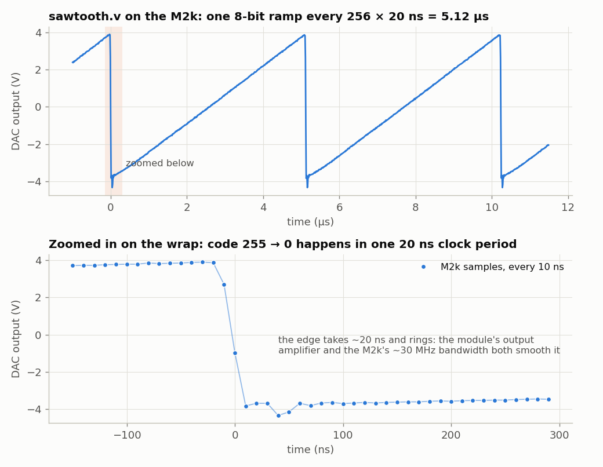

The ramp repeats every 5.12 µs (195.3 kHz) and runs from −3.95 V at code 0 to
+3.88 V at code 255: 30.7 mV per code. In the lower panel, notice that there is
no visible staircase, even though the value steps every 20 ns. The DAC's output
amplifier and the scope's own ~30 MHz bandwidth both low-pass filter the steps.
The one big step, 255 → 0, shows that filtering as a ~20 ns edge with some
ringing.

### A sine: direct digital synthesis

To make a sine, keep a *phase*, advance it by a fixed amount every clock, and
look up the sine of it in a table. This is **direct digital synthesis (DDS)**,
which is how almost every modern function generator works:

<!-- file: sine.v -->
```verilog
// sine.v -- Tutorial 2b: a sine wave out of the DAC by direct digital synthesis.
//
// A 32-bit "phase accumulator" adds a constant TW every clock.  Think of it as
// the angle of a phasor: 2^32 counts = one full turn.  Its top 8 bits pick
// one of 256 entries in a table of sin(), and that goes to the DAC.
//
//     output frequency  f = TW * 50 MHz / 2^32        (resolution 0.012 Hz)
//     so                TW = round(f / 50 MHz * 2^32)

module sine #(
    parameter [31:0] TW = 32'd85899346      // 1.000 000 MHz
) (
    input  wire       clk,                  // 50 MHz
    output reg  [7:0] dac_d,
    output wire       dac_clk
);
    // ---- the table: 256 samples of one cycle, from -127 to +127 ----------
    // Filled in when the design is compiled: yosys runs this loop, not the FPGA.
    reg signed [7:0] sine_table [0:255];
    integer i;
    initial
        for (i = 0; i < 256; i = i + 1)
            sine_table[i] = $rtoi($floor(127.0 * $sin(6.283185307179586 * i / 256) + 0.5));

    // ---- the phase accumulator -------------------------------------------
    reg [31:0] phase = 0;

    always @(posedge clk) begin
        phase <= phase + TW;                       // wraps around at 2^32, like an angle
        dac_d <= sine_table[phase[31:24]] + 128;   // -127..+127  ->  1..255
    end

    assign dac_clk = ~clk;                         // as in sawtooth.v
endmodule
```

The phase is a 32-bit number in which 2³² means one full turn, so it wraps
around exactly like an angle. Adding `TW` (the *tuning word*) every 20 ns gives

$$ f = \frac{TW}{2^{32}} \times 50\ \text{MHz}, \qquad \Delta f_{\min} = \frac{50\ \text{MHz}}{2^{32}} = 0.012\ \text{Hz}. $$

For 1 MHz, TW = 2³² / 50 = 85,899,345.9, so we use 85,899,346. Only the top 8
bits of the phase address the table, but the low 24 bits still matter. They
keep the fractional phase, so the *average* frequency is exact even when 50 MHz
/ f isn't a whole number of samples.

Two more Verilog ideas:

- `reg signed [7:0] sine_table [0:255]` is a **memory** of 256 eight-bit words.
  The `initial` loop fills it in *when the design is compiled*: Yosys computes
  `$sin` and stores the results in the bitstream. The FPGA never computes a
  sine.
- The table holds −127…+127, but the DAC wants 0…255 ("offset binary"). Adding
  128 converts.

`make load-sine`:

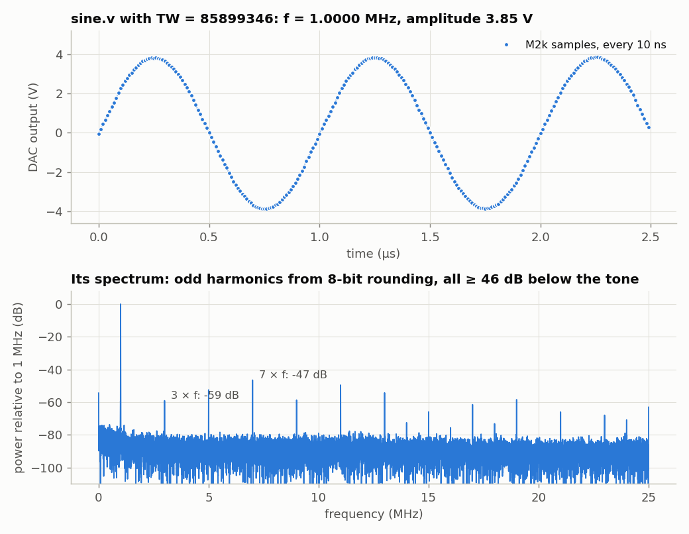

The scope measured 999,997.2 Hz. That's 2.8 parts per million low, which is
simply how far the Icepi Zero's crystal and the scope's crystal disagree. The
spectrum shows what an 8-bit table does: rounding every sample to the nearest
code adds an error that repeats every cycle, so it appears as harmonics. They
are mostly odd because the error has the same half-wave symmetry as the sine.
All are at least 46 dB below the tone.

**Try this:**

- Change the frequency by overriding the parameter instead of editing the file:
  `yosys -p "read_verilog sine.v; chparam -set TW 429496730 sine; synth_ecp5 -top sine -json sine.json"`
  (5 MHz). Then try TW = 2³¹ (25 MHz, two samples per cycle) and TW = 3×2³⁰
  (37.5 MHz). What frequency comes out for the last one, and why? (Hint:
  sampling theorem, and the images of a sampled signal at *n* × 50 MHz ± *f*.)
- Make a triangle wave, and a square wave, from the same phase accumulator.
- Add amplitude control: multiply the table value by a 0–255 number and keep
  the top 8 bits of the product.

### Faster clocks: a PLL

The AD9708 is rated for 100 MS/s, twice what `sine.v` gives it, but the board
has only a 50 MHz oscillator. The FPGA can multiply that. The ECP5 has two
**phase-locked loops (PLLs)**. A PLL has its own voltage-controlled oscillator
(VCO) and a feedback loop. The loop divides the output clock by *N*, compares
the result with the input clock, and steers the VCO until the two agree in
frequency *and* phase. So the output settles at *N* times the input. Divide the
input by *M* first and you get *N*/*M* times the input, for many whole numbers
*N* and *M*. Because the output is phase-locked to the crystal, it's exactly
as accurate as the crystal: this board's "100 MHz" is the crystal's 50 MHz
times two, 2.8 ppm low and all.

You rarely work out the dividers yourself. The OSS CAD Suite's `ecppll` does
it and writes the Verilog:

```console
$ ecppll -i 50 -o 100 -f my_pll.v
Pll parameters:
Refclk divisor: 1
Feedback divisor: 2
clkout0 divisor: 6
clkout0 frequency: 100 MHz
VCO frequency: 600
```

`pll100.v` is that file, tidied up and with clearer port names. There's one
module, `EHXPLLL`, which is the PLL itself, and a page of settings you can take
as given:

<!-- file: pll100.v -->
```verilog
// pll100.v -- 100 MHz from the board's 50 MHz oscillator, with the ECP5's PLL.
//
// A PLL (phase-locked loop) steers a voltage-controlled oscillator (VCO) until
// the VCO, divided down, matches the input in frequency and phase:
//
//     VCO = 50 MHz x CLKFB_DIV x CLKOP_DIV / CLKI_DIV = 50 x 2 x 6 / 1 = 600 MHz
//     clk100 = VCO / CLKOP_DIV = 100 MHz,  phase-locked to the 50 MHz input
//
// The VCO must stay between 400 and 800 MHz.  This file is the output of
// `ecppll -i 50 -o 100` (from the OSS CAD Suite), tidied up; ask ecppll for
// any other frequency and paste its numbers in.  Used by sine_pll.v and
// lockin_pll.v.

module pll100 (
    input  wire clk,          // 50 MHz
    output wire clk100,       // 100 MHz
    output wire locked        // 1 once clk100 is steady (about 10 us after power-up)
);
    // The FREQUENCY_PIN attributes tell nextpnr the output frequency, so it
    // checks timing at 100 MHz without being told separately.
    (* FREQUENCY_PIN_CLKI="50" *) (* FREQUENCY_PIN_CLKOP="100" *)
    (* ICP_CURRENT="12" *) (* LPF_RESISTOR="8" *) (* MFG_ENABLE_FILTEROPAMP="1" *) (* MFG_GMCREF_SEL="2" *)
    EHXPLLL #(
        .CLKI_DIV(1), .CLKFB_DIV(2), .CLKOP_DIV(6), .CLKOP_CPHASE(2), .CLKOP_FPHASE(0),
        .CLKOP_ENABLE("ENABLED"), .FEEDBK_PATH("CLKOP"),
        .OUTDIVIDER_MUXA("DIVA"), .OUTDIVIDER_MUXB("DIVB"),
        .OUTDIVIDER_MUXC("DIVC"), .OUTDIVIDER_MUXD("DIVD"),
        .PLLRST_ENA("DISABLED"), .INTFB_WAKE("DISABLED"),
        .STDBY_ENABLE("DISABLED"), .DPHASE_SOURCE("DISABLED")
    ) pll (
        .CLKI(clk), .CLKFB(clk100), .CLKOP(clk100), .LOCK(locked),
        .RST(1'b0), .STDBY(1'b0), .PHASESEL0(1'b0), .PHASESEL1(1'b0),
        .PHASEDIR(1'b1), .PHASESTEP(1'b1), .PHASELOADREG(1'b1),
        .PLLWAKESYNC(1'b0), .ENCLKOP(1'b0)
    );
endmodule
```

The new design is `sine.v` with its clock from the PLL, and one precaution:
the DDS waits until the PLL reports `locked`, since the output clock wanders
while the loop settles.

<!-- file: sine_pll.v -->
```verilog
// sine_pll.v -- sine.v with the DAC at 100 MS/s instead of 50, clocked by a PLL.
//
// Only three things change from sine.v: the clock comes from pll100.v, the DDS
// waits for the PLL to lock, and the tuning word is for 100 MHz:
//
//     f = TW * 100 MHz / 2^32,   so   TW = round(f / 100 MHz * 2^32)

module sine_pll #(
    parameter [31:0] TW = 32'd42949673      // 1.000 000 MHz at 100 MS/s
) (
    input  wire       clk,                  // 50 MHz
    output reg  [7:0] dac_d,
    output wire       dac_clk
);
    wire clk100, locked;
    pll100 pll (.clk(clk), .clk100(clk100), .locked(locked));

    reg signed [7:0] sine_table [0:255];
    integer i;
    initial
        for (i = 0; i < 256; i = i + 1)
            sine_table[i] = $rtoi($floor(127.0 * $sin(6.283185307179586 * i / 256) + 0.5));

    reg [31:0] phase = 0;
    always @(posedge clk100)
        if (locked) begin                          // wait until the PLL has settled
            phase <= phase + TW;
            dac_d <= sine_table[phase[31:24]] + 128;
        end

    assign dac_clk = ~clk100;                      // 5 ns after each data change
endmodule
```

`make load-sine_pll`. The tone is the same 1 MHz, but it's now built from
steps 10 ns long instead of 20. On a spectrum analyzer fast enough to see it,
the first image, at clock − *f*, moves from 49 MHz to 99 MHz. It is weaker, because the DAC's
zero-order hold (the staircase) suppresses it by sinc(99/100) instead of
sinc(49/50). The analog filters on the module suppress it further. A faster
clock also flattens the droop of the tone itself. A staircase of steps *T*
long has a response sinc(*fT*) = sin(π*fT*)/(π*fT*): at 20 MHz that's 0.76 at
50 MS/s and 0.94 at 100 MS/s. [A faster DAC](#a-faster-dac) in Part 4 puts
the PLL to work in the lock-in, and measures what the image does to a
measurement.

`nextpnr` reports that `sine_pll.v`'s logic would run at 200 MHz, so the
FPGA isn't the limit. What it doesn't check is the timing at the DAC's pins.
With `dac_clk = ~clk100`, the DAC's clock rises 5 ns after the data changes and
5 ns before the next change. The DAC's 2.0 ns setup and 1.5 ns hold fit inside
that, with about 3 ns to spare on each side for the pins and wires to differ.
At 125 MHz there would be only 4 ns between each edge and the next change, and
the margins shrink to 2 ns and 2.5 ns.

**Try this:**

- `ecppll -n pll125 -i 50 -o 125 -f pll125.v`, and push the DAC to its
  typical maximum. Then go past it, to 150 MHz. How does it fail?
- Use a second PLL output as a phase-shifted copy of the clock
  (`ecppll ... --clkout1 100 --phase1 90`). Clock the DAC from it and move the
  phase to find where the DAC's data window opens and closes.

---

## Part 3: Capturing the ADC to your PC

Now the other direction. Connect a function generator to the ADC input SMA
(±5 V at most), and the Icepi Zero's USB to your PC.

### Three new pieces

**Clocking the ADC.** The AD9280 needs its clock high for at least 14.7 ns and
low for at least 14.7 ns. With a 50 MHz master clock, the fastest we can do is
25 MHz: toggle `adc_clk` on every edge. The ADC is *pipelined*: it outputs the
sample it took on one clock edge 3 clock cycles later, and each output appears
about 25 ns (t<sub>OD</sub>, the datasheet's *output delay*) after the rising
edge that releases it. So we read the data pins just before the next rising
edge, 40 ns later, when they have been steady for about 15 ns.

**Why 25 MS/s in but 50 MS/s out?** Each converter's datasheet sets its own
ceiling. The AD9280 is rated for 32 MS/s: a clock period of at least 31.25 ns,
of which at least 14.7 ns high and 14.7 ns low, because each stage of its
pipeline needs that long to settle. The AD9708 only has to latch a new code on
each rising clock edge (data steady 2.0 ns before, 1.5 ns after), and is rated
for 100 MS/s (125 typical). On this board, though, every clock comes from the
one 50 MHz oscillator, and counting its edges gives only 50 MHz divided by a
whole number: 50, 25, 16.7, 12.5 MHz... The DAC gets the full 50, and the ADC
gets 25, the fastest of those it can take. The whole-number ratio has a second
benefit that Parts 3 and 4 rely on. Every ADC sample falls at the same point
of the DAC's clock, so the two stay in step forever (they're *coherent*). To
go faster, the FPGA can make a faster clock itself with a PLL
([Faster clocks: a PLL](#faster-clocks-a-pll) runs the DAC at 100 MS/s). The
ADC could gain its last 28% the same way. For example, a 120 MHz clock could
run the DAC at 120 MS/s (past its guaranteed 100, within its typical 125) and
the ADC at 30 MS/s, still in a whole-number ratio. Beyond the chips, the other limit is the path to
your PC. 25 million bytes per second is 250 times what the serial port
carries, which is why the design below stores a burst in block RAM and sends it
afterwards.

**Block RAM.** `reg [7:0] mem [0:16383]` is 16 kB of memory. Yosys notices
that it is only ever written and read one address at a time and maps it onto 8
of the chip's 56 block RAMs, instead of 131,072 flip-flops.

**A serial port (UART).** The FT231X chip on the Icepi Zero is also a
USB-to-serial converter. It appears on the PC as `/dev/ttyUSB0` and talks to
the FPGA on two wires, `uart_tx` and `uart_rx`. This file does the FPGA's half,
at 1,000,000 bits per second (1 µs = 50 clocks per bit):

<!-- file: uart.v -->
```verilog
// uart.v -- a serial port ("UART"): 8 data bits, no parity, 1 stop bit (8N1).
//
// On the wire, an idle line sits at 1.  A byte is a 0 "start bit", the 8 data
// bits least-significant first, and a 1 "stop bit", each lasting one bit time.
// At 1,000,000 baud a bit time is 1 us = 50 clocks of the 50 MHz clock.
//
// Used by capture.v and lockin.v.  The FT231X chip on the Icepi Zero turns
// these wires into /dev/ttyUSB0 on the PC.

module uart_tx #(
    parameter CLKS_PER_BIT = 50
) (
    input  wire       clk,
    input  wire [7:0] data,
    input  wire       start,     // high for one clock: send `data`
    output wire       busy,      // high while a byte is going out
    output wire       tx
);
    reg [9:0]  frame = 10'b1111111111;   // {stop, data[7:0], start}; bit 0 is on the wire
    reg [3:0]  bits  = 0;                // bits left to send
    reg [15:0] timer = 0;

    assign tx   = frame[0];
    assign busy = (bits != 0);

    always @(posedge clk)
        if (!busy) begin
            if (start) begin
                frame <= {1'b1, data, 1'b0};
                bits  <= 10;
                timer <= 0;
            end
        end else if (timer == CLKS_PER_BIT - 1) begin
            timer <= 0;
            frame <= {1'b1, frame[9:1]};  // shift the next bit onto the wire
            bits  <= bits - 1;
        end else
            timer <= timer + 1;
endmodule


module uart_rx #(
    parameter CLKS_PER_BIT = 50
) (
    input  wire       clk,
    input  wire       rx,
    output reg  [7:0] data  = 0,
    output reg        valid = 0      // high for one clock when `data` is new
);
    // rx comes from another chip with its own clock, so it can change at any
    // instant.  Two flip-flops in a row give it time to settle to a clean 0/1.
    reg rx1 = 1, rx2 = 1;
    always @(posedge clk) begin
        rx1 <= rx;
        rx2 <= rx1;
    end

    reg [3:0]  count = 0;            // 0 = idle; 1..8 = next data bit; 9 = stop bit
    reg [15:0] timer = 0;
    reg [7:0]  shift = 0;

    always @(posedge clk) begin
        valid <= 0;
        if (count == 0) begin
            if (!rx2) begin                          // start bit has begun
                count <= 1;
                timer <= CLKS_PER_BIT * 3 / 2;       // wait 1.5 bits: middle of data bit 0
            end
        end else if (timer != 0)
            timer <= timer - 1;
        else if (count <= 8) begin                   // middle of a data bit
            shift <= {rx2, shift[7:1]};              // LSB arrives first
            count <= count + 1;
            timer <= CLKS_PER_BIT - 1;
        end else begin                               // middle of the stop bit
            data  <= shift;
            valid <= 1;
            count <= 0;
        end
    end
endmodule
```

The receiver shows a pattern you will meet again. `rx` comes from a chip with
its own clock, so it can change at any moment, including exactly on our clock
edge. That can leave a flip-flop undecided for a while (*metastability*). Two
flip-flops in a row give it a full clock period to settle before anything
depends on it.

### The design: a state machine

<!-- file: capture.v -->
```verilog
// capture.v -- Tutorial 3: record 16384 ADC samples into memory, then send
// them to the PC over the serial port.
//
// The PC sends one character, the hex digit D ("0".."9" or "a".."f", meaning
// 0..15).  The FPGA then keeps every 2^D-th sample
// of the 25 MS/s ADC stream -- a sample rate of 25 MHz / 2^D -- until its
// memory is full, and sends the 16384 samples back as 16384 raw bytes at
// 1,000,000 baud (about 0.16 s).  capture.py does the PC side.
//
// LEDs, USB connectors down: the left three show the ADC's top 3 bits (MSB on
// the left), then led[1] = sending, and the rightmost, led[0] = recording.

module capture (
    input  wire       clk,         // 50 MHz
    input  wire [7:0] adc_d,
    output wire       adc_clk,
    input  wire       uart_rx,
    output wire       uart_tx,
    output wire [4:0] led
);
    localparam N = 16384;

    // ---- the ADC: clock it at 25 MHz and grab each sample ------------------
    // The AD9280 needs 14.7 ns high and 14.7 ns low, so 25 MHz (20 + 20 ns) is
    // as fast as a 50 MHz clock allows.  A sample appears on adc_d about 25 ns
    // after the ADC's rising clock edge, so we read it just before the NEXT
    // rising edge, 40 ns later, when it has been steady for ~15 ns.
    reg       adc_clk_r = 0;
    reg       new_sample = 0;      // high for one clk when `sample` is new
    reg [7:0] sample = 0;

    always @(posedge clk) begin
        adc_clk_r  <= ~adc_clk_r;
        new_sample <= 0;
        if (adc_clk_r == 0) begin  // adc_clk is about to rise
            sample     <= adc_d;
            new_sample <= 1;
        end
    end
    assign adc_clk = adc_clk_r;

    // ---- the serial port ---------------------------------------------------
    wire [7:0] rx_data;
    wire       rx_valid;
    reg  [7:0] tx_data = 0;
    reg        tx_start = 0;
    wire       tx_busy;

    uart_rx #(.CLKS_PER_BIT(50)) rx (.clk(clk), .rx(uart_rx),
                                     .data(rx_data), .valid(rx_valid));
    uart_tx #(.CLKS_PER_BIT(50)) tx (.clk(clk), .data(tx_data), .start(tx_start),
                                     .busy(tx_busy), .tx(uart_tx));

    // ---- memory: 16384 bytes of block RAM ----------------------------------
    reg [7:0]  mem [0:N-1];
    reg [13:0] addr = 0;

    // ---- what we're doing now ----------------------------------------------
    localparam IDLE = 0, RECORD = 1, SEND = 2;
    reg [1:0]  state = IDLE;
    reg [3:0]  D = 0;              // keep 1 sample in 2^D
    reg [15:0] skip = 0;           // samples still to skip before keeping one

    always @(posedge clk) begin
        tx_start <= 0;
        case (state)
            IDLE:
                // Only a hex digit starts a capture.  Anything else is ignored --
                // including the junk byte the FT231X can produce when the PC
                // opens the port.
                if (rx_valid && ((rx_data >= "0" && rx_data <= "9") ||
                                 (rx_data >= "a" && rx_data <= "f"))) begin
                    D     <= (rx_data <= "9") ? rx_data - "0" : rx_data - "a" + 10;
                    skip  <= 0;
                    addr  <= 0;
                    state <= RECORD;
                end
            RECORD:
                if (new_sample) begin
                    if (skip == 0) begin
                        mem[addr] <= sample;
                        addr  <= addr + 1;
                        skip  <= (16'd1 << D) - 1;
                        if (addr == N - 1)     // that was the last one
                            state <= SEND;     // (addr wraps back to 0)
                    end else
                        skip <= skip - 1;
                end
            SEND:
                if (!tx_busy && !tx_start) begin
                    tx_data  <= mem[addr];
                    tx_start <= 1;
                    addr     <= addr + 1;
                    if (addr == N - 1)
                        state <= IDLE;
                end
        endcase
    end

    assign led = {sample[7:5], state == SEND, state == RECORD};
endmodule
```

`state` makes this a **state machine**: in `IDLE` it waits for a command, in
`RECORD` it stores samples, in `SEND` it sends them. The `case` statement says
what happens in each state on each clock. Note that `mem[addr] <= sample` and
`tx_data <= mem[addr]` are the *only* ways memory is touched: one write port
and one read port, which is what lets Yosys use a block RAM.

The command is a single hex digit, `D`. The FPGA keeps one sample in every
2<sup>D</sup>, so the sample rate is 25 MS/s ÷ 2<sup>D</sup>: 16384 samples
cover 655 µs at D = 0 and 21 s at D = 15.

**Why a hex digit and not simply the byte D?** Because just *opening*
`/dev/ttyUSB0` briefly pulls the FT231X's transmit line low. The FPGA's receiver
reads that as a start bit followed by all ones: the byte 0xFF. If any byte were
a command, that would mean "capture with D = 15", a 21-second capture, and the
PC's real request would arrive while the FPGA was busy and be ignored.
Accepting only `0`–`9` and `a`–`f` makes the glitch harmless.

### The PC side

<!-- file: capture.py -->
```python
#!/usr/bin/env python3
"""Tutorial 3, the PC side: ask capture.v for 16384 ADC samples and plot them.

    python3 capture.py            # 25 MS/s
    python3 capture.py -d 4       # 25 MS/s / 2^4 = 1.5625 MS/s
    python3 capture.py -d 4 -o scope.csv --no-plot
"""
import argparse
import time

import numpy as np
import serial                        # pip install pyserial

N = 16384
FS_MAX = 25e6                        # the ADC runs at 50 MHz / 2


def capture(port, d):
    """Returns (time in seconds, ADC codes 0..255)."""
    with serial.Serial(port, 1_000_000, timeout=2) as ser:
        time.sleep(0.05)                 # let the line settle after opening,
        ser.reset_input_buffer()         # and throw away anything stale
        ser.write(b"%x" % d)             # D as one hex digit: b"0" .. b"f"
        raw = ser.read(N)
    if len(raw) != N:
        raise RuntimeError(f"got {len(raw)} of {N} bytes -- is capture.bit loaded?")
    fs = FS_MAX / 2**d
    return np.arange(N) / fs, np.frombuffer(raw, dtype=np.uint8)


if __name__ == "__main__":
    ap = argparse.ArgumentParser(description=__doc__,
                                 formatter_class=argparse.RawDescriptionHelpFormatter)
    ap.add_argument("-d", type=int, default=0, help="keep 1 sample in 2^d (0..15)")
    ap.add_argument("--port", default="/dev/ttyUSB0")
    ap.add_argument("-o", "--out", help="save time,code to this CSV file")
    ap.add_argument("--no-plot", action="store_true")
    args = ap.parse_args()

    t0 = time.time()
    t, code = capture(args.port, args.d)
    print(f"{N} samples at {FS_MAX / 2**args.d / 1e6:g} MS/s in {time.time() - t0:.2f} s; "
          f"codes {code.min()}..{code.max()}, mean {code.mean():.1f}")
    if args.out:
        np.savetxt(args.out, np.column_stack([t, code]), delimiter=",",
                   header="time_s,adc_code", fmt=["%.9g", "%d"])
    if not args.no_plot:
        import matplotlib.pyplot as plt
        plt.plot(t * 1e6, code, ".-", markersize=3, linewidth=0.5)
        plt.xlabel("time (µs)")
        plt.ylabel("ADC code (0..255)")
        plt.grid(True)
        plt.show()
```

```console
$ make load-capture
$ python3 capture.py                 # 25 MS/s, plots codes vs time
16384 samples at 25 MS/s in 0.23 s; codes 28..226, mean 126.8
$ python3 capture.py -d 4 -o slow.csv --no-plot
16384 samples at 1.5625 MS/s in 0.24 s; codes 28..226, mean 126.8
```

Below is a 4 V, 1.1 MHz sine, captured and converted to volts with the
calibration from [the hardware table](#the-hardware):

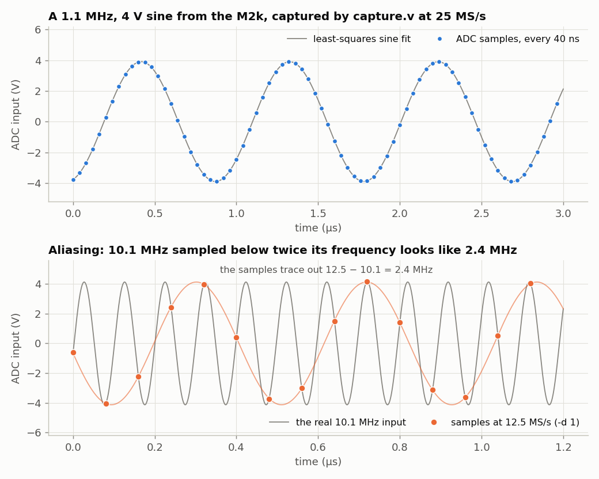

The lower panel is the sampling theorem in action. At 12.5 MS/s (`-d 1`) the
Nyquist frequency is 6.25 MHz, and a 10.1 MHz input is indistinguishable from
12.5 − 10.1 = 2.4 MHz: the samples lie exactly on the real waveform (grey) and
trace out the alias (orange). Nothing in the digital data can tell the two
apart. That's why real digitizers put an *anti-aliasing* low-pass filter in
front of the ADC.

**Try this:**

- Measure the ADC's calibration yourself: DC in from a power supply at several
  voltages, `capture.py`, and fit code against volts.
- Fit a sine to a capture (as in the figure) and compute the residual. How many
  *effective* bits does this 8-bit ADC have? (Ideal quantization noise is
  1/√12 of a code rms.) How does it change between 100 kHz and 10 MHz?
- Add a trigger: in `RECORD`, don't start filling memory until the sample
  crosses mid-scale going upward, so repeated captures line up like a scope's.

### Closing the loop: the DAC talks to the ADC

Now connect the DAC output to the ADC input with a coax. (The measurements
below used two RG-316 cables, 101.5 cm and 16.5 cm long.) `loopback.v` is `capture.v`
plus a DAC that plays a pattern locked to the sample counter `n`. The
recording starts at `n` = 0, so you know exactly which sample each DAC change
happened at, and can watch it come back.

<!-- file: loopback.v -->
```verilog
// loopback.v -- the DAC talks to the ADC: record your own signal coming back.
//
// Wire the DAC output to the ADC input with a cable.  As in capture.v, the PC
// sends one character and gets back 16384 ADC samples (25 MS/s) as raw bytes at
// 1,000,000 baud.  Meanwhile the DAC plays a pattern locked to the sample
// counter n, so we know exactly which sample each DAC change happened at:
//
//   "s"  square wave: low for n = 0..511, high for n = 512..1023, repeating
//   "t"  the same square wave, but every DAC change happens 20 ns (half a
//        sample) later -- interleave "s" and "t" for 50 MS/s "equivalent time"
//   "r"  a staircase: DAC code k for n = 64k .. 64k+63, k = 0..255
//   "p"  pseudo-random: HI or LO for each sample, from a 10-bit LFSR (an
//        m-sequence, period 1023), restarted from the same seed at n = 0
//
// The recording always starts at n = 0, so sample i of the record is n = i.

module loopback (
    input  wire       clk,         // 50 MHz
    input  wire [7:0] adc_d,
    output wire       adc_clk,
    output reg  [7:0] dac_d,
    output wire       dac_clk,
    input  wire       uart_rx,
    output wire       uart_tx,
    output wire [4:0] led
);
    localparam N = 16384;
    localparam LO = 8'd32, HI = 8'd224;     // the square wave: about -2.97 V and +2.93 V

    // ---- the ADC, as in capture.v, plus a sample counter n --------------------
    reg        adc_clk_r = 0;
    reg        new_sample = 0;
    reg [7:0]  sample = 0;
    reg [13:0] n = 0;
    always @(posedge clk) begin
        adc_clk_r  <= ~adc_clk_r;
        new_sample <= 0;
        if (adc_clk_r == 0) begin
            sample     <= adc_d;
            n          <= n + 1;           // n and sample change together
            new_sample <= 1;
        end
    end
    assign adc_clk = adc_clk_r;

    // ---- the pseudo-random sequence: x^10 + x^7 + 1, one step per sample -------
    localparam [9:0] SEED = 10'h001;
    reg [9:0] lfsr = SEED;
    always @(posedge clk)
        if (adc_clk_r == 0)                // same edge as n
            lfsr <= (n == 14'h3fff) ? SEED : {lfsr[8:0], lfsr[9] ^ lfsr[6]};

    // ---- the DAC: a pattern computed from n ------------------------------------
    reg [1:0]  mode = 0;                   // 0 = "s", 1 = "t", 2 = "r", 3 = "p"
    reg [13:0] n_late = 0;                 // n, one clock (20 ns) later
    always @(posedge clk) n_late <= n;
    wire [13:0] m = (mode == 1) ? n_late : n;
    initial dac_d = LO;
    always @(posedge clk)
        dac_d <= (mode == 2) ? m[13:6] :
                 (mode == 3) ? (lfsr[9] ? HI : LO) :
                               (m[9] ? HI : LO);
    assign dac_clk = ~clk;

    // ---- the serial port ---------------------------------------------------------
    wire [7:0] rx_data;
    wire       rx_valid;
    reg  [7:0] tx_data = 0;
    reg        tx_start = 0;
    wire       tx_busy;
    uart_rx #(.CLKS_PER_BIT(50)) rx (.clk(clk), .rx(uart_rx),
                                     .data(rx_data), .valid(rx_valid));
    uart_tx #(.CLKS_PER_BIT(50)) tx (.clk(clk), .data(tx_data), .start(tx_start),
                                     .busy(tx_busy), .tx(uart_tx));

    // ---- record 16384 samples, starting at n = 0, then send them ---------------
    reg [7:0]  mem [0:N-1];
    reg [13:0] addr = 0;
    localparam IDLE = 0, WAIT = 1, RECORD = 2, SEND = 3;
    reg [1:0]  state = IDLE;
    reg [21:0] settle = 0;                 // let the new pattern run a while first

    always @(posedge clk) begin
        tx_start <= 0;
        case (state)
            IDLE:
                if (rx_valid && (rx_data == "s" || rx_data == "t" ||
                                 rx_data == "r" || rx_data == "p")) begin
                    mode   <= (rx_data == "s") ? 0 : (rx_data == "t") ? 1 :
                              (rx_data == "r") ? 2 : 3;
                    settle <= ~0;                    // 84 ms
                    state  <= WAIT;
                end
            WAIT:                                    // settle, then wait for n = 0
                if (settle != 0)
                    settle <= settle - 1;
                else if (new_sample && n == 0) begin
                    mem[0] <= sample;
                    addr   <= 1;
                    state  <= RECORD;
                end
            RECORD:
                if (new_sample) begin
                    mem[addr] <= sample;             // sample i was taken with n = i
                    addr <= addr + 1;
                    if (addr == N - 1)
                        state <= SEND;
                end
            SEND:
                if (!tx_busy && !tx_start) begin
                    tx_data  <= mem[addr];
                    tx_start <= 1;
                    addr     <= addr + 1;
                    if (addr == N - 1)
                        state <= IDLE;
                end
        endcase
    end

    assign led = {sample[7:5], state == SEND, state == RECORD};
endmodule
```

<!-- file: loopback.py -->
```python
#!/usr/bin/env python3
"""The PC side of loopback.v: record the DAC's pattern coming back through the ADC.

    python3 loopback.py s          # square wave: plot one rising edge
    python3 loopback.py r          # staircase: plot ADC code against DAC code
    python3 loopback.py p          # pseudo-random: the loop's impulse response
    python3 loopback.py s -o sq.csv --no-plot

Needs a cable from the DAC output to the ADC input.
"""
import argparse
import time

import numpy as np
import serial

N = 16384


def record(port, mode):
    """mode is "s", "t", "r" or "p".  Returns ADC codes; sample i was taken at n = i."""
    with serial.Serial(port, 1_000_000, timeout=2) as ser:
        time.sleep(0.05)
        ser.reset_input_buffer()
        ser.write(mode.encode())
        raw = ser.read(N)
    if len(raw) != N:
        raise RuntimeError(f"got {len(raw)} of {N} bytes -- is loopback.bit loaded?")
    return np.frombuffer(raw, dtype=np.uint8).astype(int)


if __name__ == "__main__":
    ap = argparse.ArgumentParser(description=__doc__,
                                 formatter_class=argparse.RawDescriptionHelpFormatter)
    ap.add_argument("mode", choices=["s", "t", "r", "p"])
    ap.add_argument("--port", default="/dev/ttyUSB0")
    ap.add_argument("-o", "--out", help="save sample,code as CSV")
    ap.add_argument("--no-plot", action="store_true")
    args = ap.parse_args()

    code = record(args.port, args.mode)
    i = np.arange(N)
    if args.out:
        np.savetxt(args.out, np.column_stack([i, code]), delimiter=",",
                   header="sample,adc_code", fmt="%d")

    if args.mode in "st":
        # the DAC stepped up at n = 512, 1536, ...: average all 16 rising edges
        edges = code.reshape(16, 1024).mean(axis=0)
        half = (edges[:512].mean() + edges[512:].mean()) / 2
        first = 512 + np.argmax(edges[512:] > half)
        print(f"the DAC stepped up at sample 512; the ADC crossed half-way at sample {first}")
        if not args.no_plot:
            import matplotlib.pyplot as plt
            plt.plot(np.arange(500, 540), edges[500:540], "o-")
            plt.axvline(512, color="gray")
            plt.xlabel("sample (40 ns each)")
            plt.ylabel("ADC code, averaged over 16 edges")
            plt.grid(True)
            plt.show()
    elif args.mode == "p":
        # The same m-sequence loopback.v plays: x^10 + x^7 + 1, seed 1, +-1
        M, state, x = 1023, 1, []
        for _ in range(M):
            x.append(1.0 if state & 0x200 else -1.0)
            state = ((state << 1) | (((state >> 9) ^ (state >> 6)) & 1)) & 0x3FF
        x = np.array(x)
        # skip the first period (the sequence restarted at n = 0), average the rest
        y = code[M:16 * M].reshape(15, M).mean(axis=0)
        # circular cross-correlation with the stimulus = the impulse response,
        # because an m-sequence's autocorrelation is (almost) a delta function
        r = np.real(np.fft.ifft(np.fft.fft(y - y.mean()) * np.conj(np.fft.fft(x)))) / (M + 1)
        h = r / ((224 - 32) / 2)                   # ADC codes per DAC code
        print("impulse response, ADC codes per DAC code, delays 0..11 samples:")
        print(np.round(h[:12], 3))
        if not args.no_plot:
            import matplotlib.pyplot as plt
            plt.stem(np.arange(20), h[:20])
            plt.xlabel("delay (samples of 40 ns)")
            plt.ylabel("h (ADC codes per DAC code)")
            plt.grid(True)
            plt.show()
    else:
        # DAC code k for samples 64k .. 64k+63: skip the first 16 of each while it settles
        steps = code.reshape(256, 64)[:, 16:].mean(axis=1)
        print("ADC code at DAC codes 0, 128, 255: %.2f %.2f %.2f" % (steps[0], steps[128], steps[255]))
        if not args.no_plot:
            import matplotlib.pyplot as plt
            plt.plot(np.arange(256), steps, ".")
            plt.xlabel("DAC code")
            plt.ylabel("ADC code")
            plt.grid(True)
            plt.show()
```

**How long is the round trip?** `make load-loopback`, then:

```console
$ python3 loopback.py s
the DAC stepped up at sample 512; the ADC crossed half-way at sample 518
```


The DAC changed at sample 512 and the ADC reports it at sample 518: **6
samples, 240 ns**, identical on all 16 edges of the record. Where the time
goes, from the datasheets and the measurements in this section and Part 4:

| | time |
| --- | --- |
| `n` becomes 512; `dac_d` takes the new code on the next clock edge | 20 ns |
| the DAC latches it on the rising edge of the inverted clock | 10 ns |
| **analog**: the DAC's output stage, the cable, the ADC's input amplifier and its 4 ns aperture delay | 32 ns, plus 4.6 ns per metre of RG-316 |
| waiting for the ADC's next sampling edge | 0–40 ns (here 13 ns) |
| the AD9280's pipeline (3 clock cycles, then 25 ns until the data is valid), read by the FPGA on the 4th clock edge | 160 ns |

So "how long does a new DAC value take to reach the ADC?" has two answers. The
signal itself takes about **32 ns** to get from the DAC to the ADC's sampling
point, plus 4.6 ns per metre of cable. But from the FPGA writing a DAC word to
the FPGA reading the ADC's measurement of it takes **5 to 6 samples** (200–240
ns), and two thirds of that is the ADC's pipeline. For a feedback loop built in
the FPGA, those 6 samples are the delay that limits how fast the loop can be.

**Finer than one sample.** The ADC only samples every 40 ns, but the pattern
repeats exactly, so you can shift it and sample again. `t` makes every DAC
change 20 ns later. Interleaving the `s` and `t` records (lower panel) gives
the step response at 20 ns spacing: *equivalent-time sampling*, the trick
behind every sampling oscilloscope. The step arrives about 35 ns after the DAC
latches it, overshoots, and rings for ~100 ns. The short cable delivers it a
few ns sooner and with more overshoot, probably because the two cables load the
DAC's output differently at the tens-of-MHz frequencies that make up a fast
edge.

**The whole transfer curve in one capture.** `r` plays DAC codes 0 to 255, 64
samples each:

```console
$ python3 loopback.py r
ADC code at DAC codes 0, 128, 255: 27.02 126.00 225.00
```


ADC = 0.776 × DAC + 27.5. The slope agrees within 0.2% with the two
calibrations in [the hardware table](#the-hardware), made separately with an
external instrument: (30.7 mV/code) × (25.35 codes/V) = 0.778. The residual is
the ADC's rounding to whole codes and nothing more. Notice too that, with a
steady input, the ADC's output doesn't flicker at all: its noise is well below
one code.

**An impulse response from noise.** `p` plays a *pseudo-random* sequence: HI or
LO for each sample, from a 10-bit linear-feedback shift register. That makes an
*m-sequence*, 1023 samples long, whose autocorrelation is (almost exactly) a
delta function. So the cross-correlation of the ADC's record with the sequence
the DAC played *is* the loop's impulse response. That's the Wiener–Khinchin
theorem put to work.

```console
$ python3 loopback.py p
impulse response, ADC codes per DAC code, delays 0..11 samples:
[-0.001 -0.001 -0.001 -0.001 -0.001 -0.001  0.903 -0.183  0.023  0.017
  0.006  0.002]
```

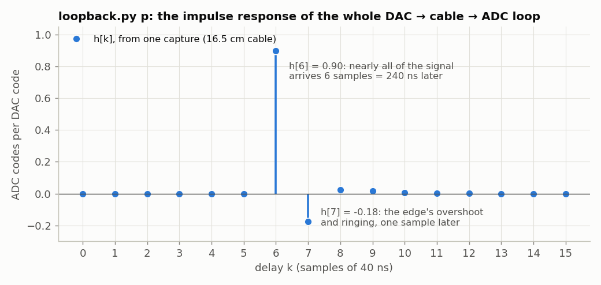

Nothing for 6 samples, then almost everything at once, then a little ringing.
The taps sum to 0.77, the staircase's slope. This is the loop as the FPGA sees
it, sample by sample: exactly what you need to design a digital controller or
an equalizer around it. One caution for the Fourier-minded: the FFT of `h` is
**not** the analog frequency response near 12.5 MHz. The sequence changes once
per sample, so its spectrum at 25 MHz − *f* folds onto *f* with equal weight.
Part 4's lock-in, stepping a pure sine, is the right tool for the analog
response. (Below 1 MHz the two agree within 1%; toward 12.5 MHz they part ways.)

**Try this:**

- Build an oscillator out of the loop: inverting feedback with a gain above 1,
  `dac_d <= 128 - 2 * (sample - 128)` (clipped to 0..255), and capture the
  result with `loopback.py`'s `record()`. Predict what you'll see from the
  6-sample delay first. (What you'll find: the pattern repeats every 12
  samples, but it is not one oscillation. Each sample depends only on the one 6
  samples earlier, so you get *six independent oscillators*, interleaved. Feed
  back the average of the last 4 samples instead and they lock into one
  near-square wave at 1.685 MHz, a period of 14.8 samples. Can you predict that
  number?)
- Get finer than 20 ns: generate the DAC clock from the ECP5's PLL with an
  adjustable phase shift, and step it in 1/8ths of a clock period.
- Use the impulse response to cancel the ringing: send the DAC a pre-distorted
  step (an FIR filter that inverts `h`) and see how clean the edge gets.

---

## Part 4: A lock-in amplifier

### The idea

You want to know how a circuit (a filter, a cable, a sample) responds at
frequency *f*. Drive it with a sine, sin(ωt), and it returns
*a* sin(ωt + φ) plus noise, plus interference, plus harmonics. Multiply what
comes back by the sine you sent, and separately by the cosine, and average over
a time *T*:

$$ X = \langle a\sin(\omega t+\varphi)\,\sin\omega t\rangle = \tfrac{a}{2}\cos\varphi, \qquad Y = \langle a\sin(\omega t+\varphi)\,\cos\omega t\rangle = \tfrac{a}{2}\sin\varphi. $$

So *a* = 2√(X² + Y²) and φ = atan2(Y, X). Everything else in the signal is at
some other frequency *f′*. It multiplies into a component at *f′* − *f*, which
averages away. How well it averages away is a Fourier transform. Averaging for
a time *T* is convolution with a box of width *T*, so a component at *f′* − *f*
= Δ*f* survives with weight |sin(πΔ*fT*)/(πΔ*fT*)|: a pass band about 1/*T*
wide, centred on your reference. With *T* = 42 ms that is ±12 Hz. At 1 MHz that
is a filter with a Q of about 40,000, and you tune it by changing a number.

This instrument is a **lock-in amplifier**. Ours has one big advantage over one
that has to lock onto an external reference: the reference and the stimulus
come from the **same phase accumulator**, so they have exactly the same
frequency by construction.

### The design

<!-- file: lockin.v -->
```verilog
// lockin.v -- Tutorial 4: a lock-in amplifier.
//
// The DAC plays a sine at frequency f (the "stimulus").  Whatever comes back
// into the ADC is multiplied by sin and by cos of that same stimulus phase and
// averaged over 2^20 samples (42 ms):
//
//     X = < adc * sin(phase) >        Y = < adc * cos(phase) >
//
// If the ADC sees  a*sin(phase + phi)  then  X = (a*127/2) cos(phi)  and
// Y = (a*127/2) sin(phi): the amplitude and phase of the response at f, with
// everything at other frequencies (noise, harmonics, hum) averaged away.
//
// Serial port, 1,000,000 baud:
//   PC -> FPGA:  the tuning word TW as hex digits, then Enter, e.g. "051eb852\n"
//                sets f = TW * 50 MHz / 2^32 (= 1.000000 MHz here) and restarts
//                the average.  lockin.py does the arithmetic for you.
//   FPGA -> PC:  one line per average, three 32-bit hex numbers:
//                "TTTTTTTT XXXXXXXX YYYYYYYY"  -- the TW it used, then X and Y
//                in units of 1/65536 of a code^2, two's complement.
//
// LEDs: the rightmost (led[0]) toggles with each result; the leftmost (led[4])
// lights when the ADC clips (reads 0 or 255).

module lockin #(
    parameter N_LOG2 = 20               // average 2^20 samples = 42 ms at 25 MS/s
) (
    input  wire       clk,         // 50 MHz
    input  wire [7:0] adc_d,
    output wire       adc_clk,
    output reg  [7:0] dac_d,
    output wire       dac_clk,
    input  wire       uart_rx,
    output wire       uart_tx,
    output wire [4:0] led
);
    // ---- sine table, as in sine.v -------------------------------------------
    reg signed [7:0] sine_table [0:255];
    integer i;
    initial
        for (i = 0; i < 256; i = i + 1)
            sine_table[i] = $rtoi($floor(127.0 * $sin(6.283185307179586 * i / 256) + 0.5));

    // ---- the stimulus: DDS -> DAC at 50 MS/s, as in sine.v --------------------
    reg [31:0] tw = 32'h051eb852;       // 1 MHz until told otherwise
    reg [31:0] phase = 0;
    initial dac_d = 128;
    always @(posedge clk) begin
        phase <= phase + tw;
        dac_d <= sine_table[phase[31:24]] + 128;
    end
    assign dac_clk = ~clk;

    // ---- the ADC at 25 MS/s, as in capture.v ---------------------------------
    reg       adc_clk_r = 0;
    reg       new_sample = 0;
    reg [7:0] sample = 128;
    reg [7:0] sample_phase = 0;         // the stimulus phase when it was taken
    always @(posedge clk) begin
        adc_clk_r  <= ~adc_clk_r;
        new_sample <= 0;
        if (adc_clk_r == 0) begin
            sample       <= adc_d;
            sample_phase <= phase[31:24];
            new_sample   <= 1;
        end
    end
    assign adc_clk = adc_clk_r;

    // ---- multiply and accumulate: a 3-step assembly line --------------------
    // Each step takes one clock; v1 and v2 say "the step before me had data".
    reg               v1 = 0, v2 = 0;
    reg signed [8:0]  s = 0;            // sample - 128:  -128 .. +127
    reg signed [7:0]  ref_sin = 0, ref_cos = 0;
    reg signed [16:0] p_sin = 0, p_cos = 0;
    reg signed [N_LOG2+16:0] acc_x = 0, acc_y = 0;
    reg [N_LOG2-1:0]  count = 0;
    reg               done = 0;         // high for one clock: X and Y are ready
    reg signed [31:0] X = 0, Y = 0;
    reg               restart = 0;      // set by the serial command below

    always @(posedge clk) begin
        // step 1: look up the reference, remove the ADC's mid-scale offset
        v1 <= new_sample;
        s       <= $signed({1'b0, sample}) - 9'sd128;
        ref_sin <= sine_table[sample_phase];
        ref_cos <= sine_table[sample_phase + 8'd64];     // 64/256 of a turn = 90 degrees
        // step 2: multiply (the FPGA has hardware multipliers for this)
        v2 <= v1;
        p_sin <= s * ref_sin;
        p_cos <= s * ref_cos;
        // step 3: add up 2^N_LOG2 products, then report and start again
        done <= 0;
        if (restart) begin
            acc_x <= 0;
            acc_y <= 0;
            count <= 0;
        end else if (v2) begin
            if (count == {N_LOG2{1'b1}}) begin            // the last one
                X <= (acc_x + p_sin) >>> (N_LOG2 - 16);   // sum / 2^N_LOG2 * 65536
                Y <= (acc_y + p_cos) >>> (N_LOG2 - 16);
                done  <= 1;
                acc_x <= 0;
                acc_y <= 0;
            end else begin
                acc_x <= acc_x + p_sin;
                acc_y <= acc_y + p_cos;
            end
            count <= count + 1;
        end
    end

    // ---- serial port ---------------------------------------------------------
    wire [7:0] rx_data;
    wire       rx_valid;
    reg  [7:0] tx_data = 0;
    reg        tx_start = 0;
    wire       tx_busy;
    uart_rx #(.CLKS_PER_BIT(50)) rx (.clk(clk), .rx(uart_rx),
                                     .data(rx_data), .valid(rx_valid));
    uart_tx #(.CLKS_PER_BIT(50)) tx (.clk(clk), .data(tx_data), .start(tx_start),
                                     .busy(tx_busy), .tx(uart_tx));

    // Commands: hex digits shift into `entry`; Enter makes it the new TW.
    reg [31:0] entry = 0;
    wire is_digit  = rx_data >= "0" && rx_data <= "9";
    wire is_letter = rx_data >= "a" && rx_data <= "f";
    wire [3:0] nibble = is_digit ? rx_data - "0" : rx_data - "a" + 10;
    always @(posedge clk) begin
        restart <= 0;
        if (rx_valid) begin
            if (is_digit || is_letter)
                entry <= {entry[27:0], nibble};
            else if (rx_data == "\n" || rx_data == "\r") begin
                tw      <= entry;
                restart <= 1;
            end
        end
    end

    // Results: print TW, X and Y as 8 hex digits each, then a newline.
    reg [95:0] line = 0;                // the three numbers, next digit at the top
    reg [1:0]  word = 3;                // 0..2 = printing that number, 3 = idle
    reg [3:0]  digit = 0;               // 0..7 = a hex digit, 8 = the separator
    wire [3:0] top = line[95:92];
    always @(posedge clk) begin
        tx_start <= 0;
        if (done && word == 3) begin
            line  <= {tw, X, Y};
            word  <= 0;
            digit <= 0;
        end else if (word != 3 && !tx_busy && !tx_start) begin
            tx_start <= 1;
            if (digit == 8) begin
                tx_data <= (word == 2) ? "\n" : " ";
                word    <= word + 1;
                digit   <= 0;
            end else begin
                tx_data <= (top < 10) ? "0" + top : "a" + top - 10;
                line    <= line << 4;
                digit   <= digit + 1;
            end
        end
    end

    // ---- LEDs ------------------------------------------------------------------
    reg results_led = 0;
    reg [23:0] clip_timer = 0;          // stays lit ~0.3 s after the ADC clips
    always @(posedge clk) begin
        if (done) results_led <= ~results_led;
        if (new_sample && (sample == 0 || sample == 255)) clip_timer <= ~0;
        else if (clip_timer != 0) clip_timer <= clip_timer - 1;
    end
    assign led = {clip_timer != 0, 3'b000, results_led};
endmodule
```

New here:

- **Signed arithmetic.** `$signed({1'b0, sample}) - 9'sd128` turns the ADC's
  offset-binary code into a signed number centred on zero. `s * ref_sin`
  multiplies two signed numbers; Yosys puts it on one of the FPGA's 18×18-bit
  hardware multipliers (`MULT18X18D`). The report counts them: this design
  uses 2 of 28.
- **Pipelining.** Looking up the table, multiplying and adding each take one
  clock. `v1` and `v2` mark which steps hold a real sample.
- **Scaling.** The sum of 2²⁰ products is shifted right by 4 bits, so the
  numbers printed are ⟨adc × ref⟩ in units of 1/65536. A full-scale input in
  phase with the reference gives ⟨127 sin × 127 sin⟩ ≈ 127²/2 = 8064.5, printed
  as about 8064.5 × 65536 = `1f808000` in hex.
- **Parameters.** `#(parameter N_LOG2 = 20)` can be overridden, which the
  testbench below uses to make simulation 16× faster.

### Simulate it first

Hardware is slow to debug: you see only pins. A *testbench* is Verilog that
wraps your design in a fake world and runs on your PC. This one connects the
DAC pins back to the ADC pins through a 100 ns delay and a factor of ½, and
plays the part of the PC on the serial port:

<!-- file: lockin_tb.v -->
```verilog
// lockin_tb.v -- simulate lockin.v with no hardware at all.
//
// The "analog world" here is a wire from the DAC pins back to the ADC pins,
// delayed by DELAY clocks and halved in amplitude.  So the lock-in should
// report an amplitude of 127/2 = 63.5 codes and a phase that is a pure delay.
//
//   iverilog -o lockin_tb.vvp lockin_tb.v lockin.v uart.v && vvp lockin_tb.vvp
`timescale 1ns/1ps
module lockin_tb;
    reg clk = 0;
    always #10 clk = ~clk;                          // 50 MHz

    wire [7:0] dac;
    wire       dac_clk, adc_clk, tx;
    reg        rx = 1;
    wire [4:0] led;

    // the fake analog path: delay the DAC codes, halve them around mid-scale
    localparam DELAY = 5;                            // clocks = 100 ns
    reg [7:0] pipe [0:DELAY];
    integer k;
    initial for (k = 0; k <= DELAY; k = k + 1) pipe[k] = 128;   // silence, not "x"
    always @(posedge clk) begin
        pipe[0] <= dac;
        for (k = 1; k <= DELAY; k = k + 1) pipe[k] <= pipe[k-1];
    end
    wire signed [8:0] centred = $signed({1'b0, pipe[DELAY]}) - 128;
    wire [7:0] adc = 128 + (centred >>> 1);

    // average 2^16 samples instead of 2^20, so the simulation is 16x shorter
    lockin #(.N_LOG2(16)) dut (.clk(clk), .adc_d(adc), .adc_clk(adc_clk),
        .dac_d(dac), .dac_clk(dac_clk), .uart_rx(rx), .uart_tx(tx), .led(led));

    // play the PC: send characters at 1 Mbaud (1 us per bit)
    task send(input [7:0] c);
        integer b;
        begin
            rx = 0; #1000;                                   // start bit
            for (b = 0; b < 8; b = b + 1) begin rx = c[b]; #1000; end
            rx = 1; #1000;                                   // stop bit
        end
    endtask

    // ...and listen: collect characters into a line and print it
    reg [8*40:1] line = 0;
    reg [7:0] c;
    integer b2;
    always @(negedge tx) begin
        #1500;                                               // middle of bit 0
        for (b2 = 0; b2 < 8; b2 = b2 + 1) begin c[b2] = tx; #1000; end
        if (c == "\n") begin
            $display("%t ns  FPGA says: %0s", $time / 1000, line);
            line = 0;
        end else
            line = {line[8*39:1], c};
    end

    initial begin
        #6_000_000;                                  // two results at 1 MHz (the default)
        send("0"); send("c"); send("c"); send("c");  // TW = 0ccccccd: 2.5 MHz
        send("c"); send("c"); send("c"); send("d"); send("\n");
        #6_000_000;
        $finish;
    end
endmodule
```

```console
$ make sim-lockin
  2892000 ns  FPGA says: 051eb852 0a0fc564 f3db130a
  5513000 ns  FPGA says: 051eb852 0a0faa02 f3dad4c7
  8981000 ns  FPGA says: 0ccccccd f6a7f162 f3427615
 11603000 ns  FPGA says: 0ccccccd f6a7aa4a f342598b
```

Decode the second line: X = 0x0a0faa02 / 65536 = 2575.7 and Y = 0xf3dad4c7 as a
signed number / 65536 = −3109.2. So *a* = 2 × 4037.4 / 127 = 63.6 codes (the
fake world halved the 127-code sine: ✓), and φ = −50.4°. At 2.5 MHz the
amplitude is the same and φ = −126.3°. Both phases correspond to the same delay,
−φ/(360° *f*) = 140 ns: the testbench's 100 ns plus two clocks in the DAC and
ADC registers. A delay shows up as a phase proportional to frequency, which is
what the cable measurement below relies on.

To look at waveforms rather than printed numbers, add
`initial begin $dumpfile("lockin.vcd"); $dumpvars(0, lockin_tb); end` to the
testbench and open `lockin.vcd` in GTKWave or Surfer.

The same idea works for Part 3's `capture.v`. A fake ADC counts up by one on
every clock edge, 25 ns late like the real one, and the testbench checks that
the samples coming back over the serial port do the same:

<!-- file: capture_tb.v -->
```verilog
// capture_tb.v -- simulate capture.v with no hardware at all.
//
// A fake ADC counts up by one on every rising edge of adc_clk, with the
// AD9280's 25 ns output delay, and the testbench plays the PC: it sends "0"
// and checks that the samples coming back count up by one too.
//
//   make sim-capture     (or: iverilog -o capture_tb.vvp capture_tb.v capture.v uart.v && vvp capture_tb.vvp)
`timescale 1ns/1ps
module capture_tb;
    reg clk = 0;
    always #10 clk = ~clk;                          // 50 MHz

    reg  [7:0] adc = 0;
    wire       adc_clk, tx;
    reg        rx = 1;
    wire [4:0] led;
    always @(posedge adc_clk) adc <= #25 adc + 1;   // a ramp, 25 ns late like the real ADC

    capture dut (.clk(clk), .adc_d(adc), .adc_clk(adc_clk),
                 .uart_rx(rx), .uart_tx(tx), .led(led));

    task send(input [7:0] c);                       // 1 Mbaud: 1 us per bit
        integer b;
        begin
            rx = 0; #1000;
            for (b = 0; b < 8; b = b + 1) begin rx = c[b]; #1000; end
            rx = 1; #1000;
        end
    endtask

    integer n = 0, errors = 0, b2;
    reg [7:0] c, prev;
    always @(negedge tx) begin                      // receive one byte
        #1500;
        for (b2 = 0; b2 < 8; b2 = b2 + 1) begin c[b2] = tx; #1000; end
        if (n < 8) $display("%t ns  sample %0d = %0d", $time / 1000, n, c);
        if (n > 0 && c != prev + 8'd1) errors = errors + 1;
        prev = c;
        n = n + 1;
    end

    initial begin
        #5000;
        send("0");                                  // capture at full rate
        #1_000_000;                                 // recording + the first ~30 bytes back
        $display("%0d samples received, %0d not one more than the one before", n, errors);
        $finish;
    end
endmodule
```

```console
$ make sim-capture
   679000 ns  sample 0 = 109
   689000 ns  sample 1 = 110
   ...
34 samples received, 0 not one more than the one before
```

The first sample is 109, not 0, because the fake ADC has been counting since
time zero, and the capture only starts once the command has arrived.

### On the hardware

<!-- file: lockin.py -->
```python
#!/usr/bin/env python3
"""Tutorial 4, the PC side of lockin.v.

    python3 lockin.py -f 1e6                      # watch one frequency (Ctrl-C to stop)
    python3 lockin.py --sweep 1e4 1e7 -o thru.csv # sweep with a plain cable: the reference
    python3 lockin.py --sweep 1e4 1e7 -o rc.csv --ref thru.csv
                                                  # sweep a device, divided by the reference
    python3 lockin.py --sweep 1e5 8e6 -n 80 --linear
                                                  # linear steps; prints the delay (phase slope)
    python3 lockin.py --fclk 100e6 --sweep 1e5 49.9e6 -n 80 --linear
                                                  # with lockin_pll.bit: the DDS runs at 100 MHz

Each measurement is one 42 ms average in the FPGA.  Amplitudes are in volts at
the ADC (the ADC reads -5..+5 V as codes 0..255, about 25.35 codes per volt).
"""
import argparse
import cmath
import math
import time

import numpy as np
import serial

F_CLK = 50e6
ADC_CODES_PER_VOLT = 25.35      # measured: code = 126.7 + 25.35 * V


def tuning_word(f):
    return int(round(f / F_CLK * 2**32)) & 0xFFFFFFFF


def signed32(v):
    return v - 2**32 if v >= 2**31 else v


class LockIn:
    def __init__(self, port="/dev/ttyUSB0"):
        self.ser = serial.Serial(port, 1_000_000, timeout=1)
        time.sleep(0.05)
        self.ser.reset_input_buffer()

    def measure(self, f, averages=1):
        """Set the stimulus to f and return (f actually used, complex amplitude
        in volts at the ADC).  The phase is relative to the FPGA's reference."""
        tw = tuning_word(f)
        self.ser.write(b"%08x\n" % tw)
        z = []
        deadline = time.time() + 2 + 0.1 * averages
        while len(z) < averages:
            if time.time() > deadline:
                raise RuntimeError("no answer -- is lockin.bit loaded?")
            parts = self.ser.readline().split()
            if len(parts) != 3:
                continue
            try:
                t, x, y = (int(p, 16) for p in parts)
            except ValueError:
                continue
            if t != tw:                  # still an average from before the change
                continue
            X, Y = signed32(x) / 65536, signed32(y) / 65536   # < adc * ref >
            # adc = a sin(phase + phi)  gives  X + jY = (127 a / 2) e^{j phi}
            z.append(complex(X, Y) * 2 / 127 / ADC_CODES_PER_VOLT)
        return tw * F_CLK / 2**32, sum(z) / len(z)


def load(path):
    d = np.loadtxt(path, delimiter=",", skiprows=1)
    return d[:, 0], d[:, 1] * np.exp(1j * np.radians(d[:, 2]))


if __name__ == "__main__":
    ap = argparse.ArgumentParser(description=__doc__,
                                 formatter_class=argparse.RawDescriptionHelpFormatter)
    ap.add_argument("--port", default="/dev/ttyUSB0")
    ap.add_argument("-f", type=float, help="watch this one frequency, in Hz")
    ap.add_argument("--sweep", nargs=2, type=float, metavar=("FMIN", "FMAX"))
    ap.add_argument("-n", type=int, default=31, help="points in the sweep (log spaced)")
    ap.add_argument("--linear", action="store_true", help="space the points linearly instead")
    ap.add_argument("-a", "--averages", type=int, default=1, help="42 ms averages per point")
    ap.add_argument("-o", "--out", help="save the sweep as CSV: f_Hz, amplitude_V, phase_deg")
    ap.add_argument("--ref", help="divide by this earlier sweep (same frequencies)")
    ap.add_argument("--no-plot", action="store_true")
    ap.add_argument("--fclk", type=float, default=F_CLK, help="the DDS clock: 100e6 for lockin_pll.bit")
    args = ap.parse_args()
    F_CLK = args.fclk
    li = LockIn(args.port)

    if args.f:
        print("    f (Hz)      amplitude (V)   phase (deg)")
        while True:
            f, z = li.measure(args.f)
            print(f"{f:12.3f}   {abs(z):10.4f}   {math.degrees(cmath.phase(z)):10.2f}")

    elif args.sweep:
        if args.linear:
            freqs = np.linspace(args.sweep[0], args.sweep[1], args.n)
        else:
            freqs = np.geomspace(args.sweep[0], args.sweep[1], args.n)
        ref = load(args.ref)[1] if args.ref else None
        rows = []
        print("    f (Hz)      amplitude (V)   phase (deg)" + ("    |H|     phase(H)" if args.ref else ""))
        for i, f in enumerate(freqs):
            f, z = li.measure(f, args.averages)
            rows.append((f, abs(z), math.degrees(cmath.phase(z))))
            line = f"{f:12.1f}   {abs(z):10.4f}   {rows[-1][2]:10.2f}"
            if ref is not None:
                h = z / ref[i]
                line += f"   {abs(h):7.4f}  {math.degrees(cmath.phase(h)):8.2f}"
            print(line)
        rows = np.array(rows)
        # A delay tau adds a phase of -360 deg * f * tau: the slope gives tau.
        z = rows[:, 1] * np.exp(1j * np.radians(rows[:, 2]))
        if ref is not None:
            z = z / ref
        slope = np.polyfit(rows[:, 0], np.unwrap(np.angle(z)), 1)[0]
        print(f"phase slope {np.degrees(slope) * 1e6:.3f} deg/MHz  ->  delay {-slope / (2 * np.pi) * 1e9:.2f} ns")
        if args.out:
            np.savetxt(args.out, rows, delimiter=",", header="f_Hz,amplitude_V,phase_deg",
                       fmt=["%.6f", "%.6f", "%.4f"])
        if not args.no_plot:
            import matplotlib.pyplot as plt
            z = rows[:, 1] * np.exp(1j * np.radians(rows[:, 2]))
            if ref is not None:
                z = z / ref
            fig, (a, b) = plt.subplots(2, 1, sharex=True)
            a.semilogx(rows[:, 0], 20 * np.log10(abs(z)), ".-")
            a.set_ylabel("|H| (dB)" if ref is not None else "amplitude (dB re 1 V)")
            b.semilogx(rows[:, 0], np.degrees(np.unwrap(np.angle(z))), ".-")
            b.set_ylabel("phase (deg)")
            b.set_xlabel("frequency (Hz)")
            a.grid(True, which="both")
            b.grid(True, which="both")
            plt.show()
    else:
        ap.print_help()
```

```console
$ make load-lockin
$ python3 lockin.py -f 100e3
    f (Hz)      amplitude (V)   phase (deg)
  100000.005       1.9159       175.44
  100000.005       1.9152      -132.26
  100000.005       1.9149       -80.19
  100000.005       1.9153       -28.43
  100000.005       1.9161        23.42
  ...
```

That output is worth a second look. The ADC input here was **not** the DAC: it
was a separate 2 V generator (an ADALM2000) set as close to 100 kHz as it could
get, 100,003.07 Hz. The amplitude is steady to a fraction of a millivolt, but
the phase advances about 52° from one reading to the next (readings are about
43 ms apart). That is a phasor turning at the 3.3 Hz difference between the two
frequencies. The amplitude reads 1.915 V rather than 2 V. About 3% of the
shortfall is because the phasor turns by 50° *during* each 42 ms average, and
about 1% is the ADC's gain.

What the lock-in does with a signal that is *not* at its reference frequency is
the clearest picture of how it works. Here the same generator ran 2 Hz away
from the reference, and then at a range of offsets:


In the top panel, X and Y rotate at the 2 Hz difference frequency while R stays
at 1.98 V. The lower panel is the pass band: the measured R lies on the sinc
function, with nulls at multiples of 1/*T* = 23.8 Hz. A signal generator is never
exactly on your frequency: two crystal oscillators differ by parts per million
(these two by 2.8 ppm, 0.28 Hz at 100 kHz). That's why a lock-in uses the
stimulus itself as its reference.

### Measuring a cable

Connect the DAC output to the ADC input with a coax. The DAC's 3.9 V amplitude
is inside the ADC's ±5 V range. Sweep with linear steps and let `lockin.py`
fit the phase slope:

```console
$ python3 lockin.py --sweep 1e5 8e6 -n 80 --linear
    f (Hz)      amplitude (V)   phase (deg)
    100000.0       3.8907        -7.88
    200000.0       3.8888       -15.76
    ...
phase slope -76.571 deg/MHz  ->  delay 212.70 ns
```

That was with a 16.5 cm RG-316 cable. With a 101.5 cm one, **216.6 ns**. Almost
all of both is the instrument itself: the digital pipeline and the analog
stages of "Closing the loop" (Part 3). (Here the delay is measured from the
DDS's phase register, and includes the DAC's half-sample *zero-order hold*: a
sine rebuilt as a staircase lags the samples by half a sample, 10 ns.)

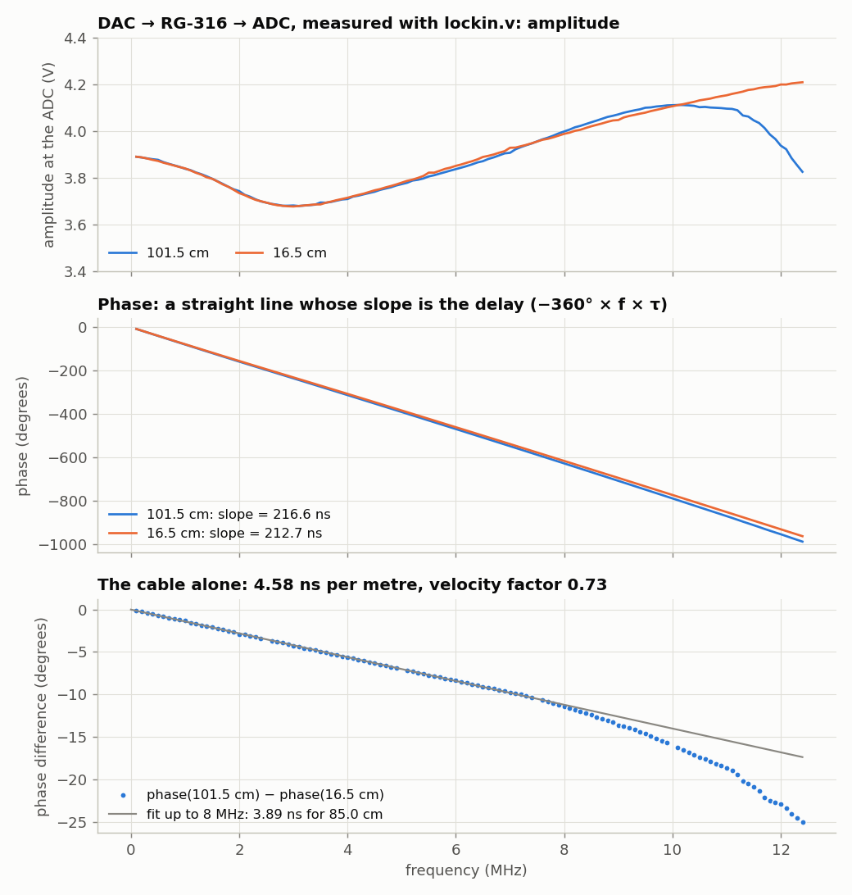

To get the cable alone, measure one cable, save it, and divide the other by it:

```bash
python3 lockin.py --sweep 1e5 8e6 -n 80 --linear -o short.csv    # 16.5 cm cable
# ...swap in the 101.5 cm cable...
python3 lockin.py --sweep 1e5 8e6 -n 80 --linear --ref short.csv
```

Everything the two setups share cancels, and what's left is the extra cable
(bottom panel): a phase slope of **3.89 ns for 85.0 cm, 4.58 ns/m**. The speed
of the signal in the cable is 0.85 m / 3.89 ns = 0.73 *c*: RG-316's *velocity
factor*, which its datasheet gives as 0.695 (4.80 ns/m). The measurement repeats
to 0.05 ns from sweep to sweep and drifted less than 0.15 ns in 5 minutes, so
it can tell cable lengths apart at the ±1 cm level. Why it disagrees with the
datasheet by 5% is the interesting part:

- **Why the cable looks like a pure delay at all.** The ADC's input is high
  impedance: the ADC sees the same 3.9 V the DAC makes into a 1 MΩ scope. A
  cable into an open end would ring, unless the source *also* has the cable's
  impedance, 50 Ω. Then the reflection from the open end is absorbed at the
  source and the far end sees one clean, delayed copy of the signal. That is
  *series termination*. The two cables give the same amplitude to within
  ±0.6% below 10 MHz, which is what series termination predicts, so the DAC's
  output is evidently built that way.
- **What that does to the measurement.** With a source resistance *R* and an
  open end, the phase is −atan[(*R*/*Z*₀) tan(ω*τ*)], which is −(*R*/*Z*₀)ω*τ*
  at these frequencies. The apparent delay is the true delay times *R*/*Z*₀.
  A source 2 Ω off 50 Ω, and a cable 2 Ω off its nominal 50 Ω, are both within
  normal tolerances and together make 5–8%. So with this setup the velocity
  factor is measured to about ±5%. Length *differences* between cables of the
  same type, which is what you usually want, are much more precise than that.
- **Why the fit stops at 8 MHz.** Above that, the two cables' phases stop
  differing linearly (bottom panel). The reason is aliasing again. The DAC
  runs at 50 MS/s, so its output has an image at 50 MHz − *f*, and the ADC
  (25 MS/s) folds 50 MHz − *f* exactly back onto *f*. The analog filters
  attenuate that image, but less as *f* approaches 12.5 MHz. Its phase
  depends on the cable, because the long cable delays a 40 MHz image by an
  extra 56°. The next section measures the image: about 1% of the signal at
  8 MHz, 4% at 12.4 MHz. So stay below ~8 MHz for delay measurements at 50 MS/s.

### A faster DAC

Part 2 ran the DAC at 100 MS/s from a PLL. `lockin_pll.v` does the same for the
lock-in. Every block runs on the PLL's 100 MHz clock, the ADC still samples at
25 MS/s (now 100 MHz / 4), and the serial port still runs at 1,000,000 baud
(now 100 clocks per bit). `diff lockin.v lockin_pll.v` shows everything that
changed. Apart from `clk` becoming `clk100` everywhere, it's this:

```verilog
    wire clk100, locked;                 // every block below runs on clk100
    pll100 pll (.clk(clk), .clk100(clk100), .locked(locked));
...
    reg       adc_div = 0;               // toggles every clock: adc_clk_r every other
    always @(posedge clk100) begin
        adc_div    <= ~adc_div;
        if (adc_div) adc_clk_r <= ~adc_clk_r;
        new_sample <= 0;
        if (adc_div && adc_clk_r == 0) begin
...
    uart_rx #(.CLKS_PER_BIT(100)) rx (.clk(clk100), .rx(uart_rx),
```

`adc_clk` is still 20 ns high and 20 ns low, and the data pins are still read
just before its rising edge. Only the tuning word's arithmetic changes on the
PC, so `lockin.py` takes the clock as an option. The DAC can now make any
frequency up to its own Nyquist frequency, 50 MHz:

```console
$ make load-lockin_pll
$ python3 lockin.py --fclk 100e6 -f 40e6
    f (Hz)      amplitude (V)   phase (deg)
39999999.991       0.2751      -172.45
39999999.991       0.2832      -172.25
39999999.991       0.2754      -172.48
...
```

The ADC samples at only 25 MS/s, so how can it measure 40 MHz? It aliases
40 MHz down to 10 MHz, but the reference table is looked up at exactly the same
instants, so the reference aliases identically and still matches. (This is the
"Try this" at the end of this part, taken further.) Here are sweeps through
the 16.5 cm cable at both DAC rates:

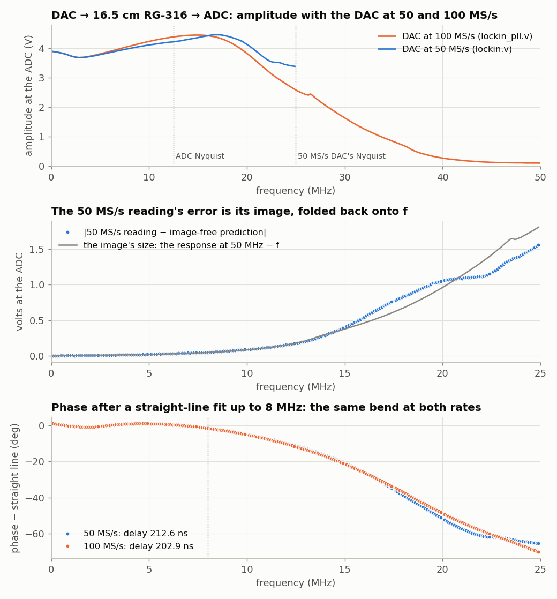

- **The module's response, to 50 MHz** (top). It rises to 4.45 V around
  15 MHz, and then falls: 2.6 V at 25 MHz, 0.26 V at 40 MHz. That's the analog
  filters on the DAC's output and the ADC's input. Up to about 16 MHz the
  100 MS/s curve is slightly *higher*, because a staircase of shorter steps
  droops less: sinc(*f*/100 MHz) instead of sinc(*f*/50 MHz).
- **The 50 MS/s readings above ~8 MHz are wrong, and here is by how much**
  (middle). Above 16 MHz the 50 MS/s design reads *more* than the 100 MS/s
  one. At 20 MHz it reads 4.11 V. Taking the 100 MS/s measurement and
  correcting it for the other sinc droop, the 50 MS/s DAC's tone alone
  should give 3.06 V. The difference is the image at 50 MHz − *f*, which
  the ADC folds back onto *f*. The 100 MS/s sweep measured the module's
  response at 50 MHz − *f* independently, and it predicts the image's size.
  The dots and the line agree to within about 25% over the whole range. At 100 MS/s
  the image moves to 100 MHz − *f*, where the analog filters pass almost
  nothing.
- **The phase bend above 8 MHz is the instrument's own** (bottom). It's the
  same at both rates, so it isn't the image. It's the analog filters, whose
  delay isn't constant near their cutoff. It cancels when you divide one
  measurement by another, as in the cable comparison. The image doesn't
  cancel, because its phase depends on the cable.

The fitted delay is 9.7 ns shorter at 100 MS/s. That's one DAC clock period
less (20 ns at 50 MS/s, 10 ns at 100). The DAC latches each new value half a
clock after the FPGA computes it, and the staircase lags its samples by
another half.

**Try this:**

- Repeat the two-cable measurement with `lockin_pll.v`. With the image gone,
  does the phase difference stay a straight line past 8 MHz?
- Measure an RC low-pass with a corner near 20 MHz, at both rates, each
  divided by its own through reference. Which result can you believe?

### Measuring a filter

The procedure is the same division by a reference:

1. **Through reference**, with just a short cable:
   `python3 lockin.py --sweep 1e4 1e7 -n 31 -o thru.csv`.
2. **The device**: put an RC low-pass between them (e.g. 1 kΩ in series, then
   1 nF to ground: *f*<sub>c</sub> = 1/(2π*RC*) = 159 kHz), and divide by the
   reference: `python3 lockin.py --sweep 1e4 1e7 -n 31 -o rc.csv --ref thru.csv`.
   Compare |H| and phase(H) with 1/(1 + *jωRC*). The phase goes through −45°
   exactly at *f*<sub>c</sub>, the measurement a lock-in is made for. Keep in
   mind that the DAC's ~50 Ω source resistance is in series with your R.

**Know the floor.** Some of the DAC signal leaks into the ADC inside the
module and adapter even with nothing connected. With the ADC input driven to
0 V by a low-impedance source, the lock-in reads 0.05 mV at 10 kHz, 0.5 mV at
1 MHz, 5.6 mV at 8 MHz and 15 mV at 12 MHz: −99, −77, −57 and −48 dB relative
to the 3.9 V stimulus. Don't trust an |H| smaller than that, and note that a
high-impedance device output lets in more crosstalk than a low-impedance
source does.

**Try this:**

- Average for 2²² samples instead of 2²⁰. What happens to the scatter of
  repeated measurements, and to the pass band?
- The ADC samples at 25 MS/s, so 12.5 MHz is its Nyquist frequency. Try a
  stimulus above it anyway. The ADC aliases 15 MHz to 10 MHz, but the reference
  table is sampled at exactly the same instants, so it aliases identically.
  (Through the short cable the lock-in still reads 3.7 V at 13 MHz and
  3.1 V at 20 MHz, and falls below 1 V near 24 MHz, where the DAC's own
  sin(x)/x and filter cut in. At simple fractions of 25 MHz, like 10, 12.5 and
  20 MHz, readings scatter from one measurement to the next. Why?)
- Add a second reference at 3*f* and measure a diode's third harmonic.

---

## Part 5: A computer inside the FPGA — LiteX and a function-generator peripheral

In Parts 1–4, changing *anything* — the frequency, the averaging time, the
serial protocol — meant editing Verilog and re-synthesizing. Now we put a small
computer into the FPGA, next to our circuits, and let software set them.

### What LiteX builds

[LiteX](https://github.com/enjoy-digital/litex) is a Python library that
assembles a complete *system on chip* (SoC) out of parts:

| part | what it is here |
| --- | --- |
| **CPU** | VexRiscv, a 32-bit RISC-V processor written in SpinalHDL, running at 50 MHz |
| **bus** | Wishbone: address, data, read/write strobes. The CPU reaches everything else through it. |
| **memory** | an SDRAM controller for the board's 32 MB, plus block-RAM ROM (holding the BIOS) and SRAM |
| **BIOS** | a small program in ROM that tests the memory, then gives you a `litex>` prompt and can load programs over the serial port |
| **CSRs** | "control and status registers": small registers that connect the CPU to hardware. The CPU writes a *CSRStorage* and the hardware sees the value; the hardware drives a *CSRStatus* and the CPU reads it. Each appears at an address, like memory. |

LiteX also writes the files the software needs: a C header with a function per
register (`funcgen_tw_write(...)`), a table of addresses (`csr.csv`), and a
Linux device tree (Part 8). Your Verilog stays Verilog; LiteX provides the
plumbing.

You already have LiteX if you followed [`README.md`](README.md#install-litex).
You also need the RISC-V cross-compiler (`sudo apt install gcc-riscv64-unknown-elf`).

### The peripherals: your Verilog, plus registers

All three peripherals of Parts 5–7 share the converters, so they are built
from four small Verilog cores. The first owns the pins, and is Parts 2 and 3's
clocking, unchanged:

<!-- file: litex/adda_io.v -->
```verilog
// adda_io.v -- the converter pins, and nothing else.
//
// The same clocking as the bare-Verilog tutorials: the DAC takes a new value
// every clock (50 MS/s) on the rising edge of the inverted clock, and the ADC
// is clocked at clk/2 = 25 MS/s and read just before each rising edge of its
// clock.  Every peripheral that wants the converters goes through here.

module adda_io (
    input  wire       clk,          // the SoC's 50 MHz system clock
    // the pins
    input  wire [7:0] adc_d,
    output wire       adc_clk,
    output reg  [7:0] dac_d = 128,
    output wire       dac_clk,
    // the peripherals' side
    input  wire [7:0] dac_value,    // what the DAC should output (0..255)
    output reg  [7:0] adc_sample = 128,
    output reg        adc_valid = 0 // high for one clock when adc_sample is new
);
    always @(posedge clk)
        dac_d <= dac_value;
    assign dac_clk = ~clk;

    reg adc_clk_r = 0;
    always @(posedge clk) begin
        adc_clk_r <= ~adc_clk_r;
        adc_valid <= 0;
        if (adc_clk_r == 0) begin
            adc_sample <= adc_d;
            adc_valid  <= 1;
        end
    end
    assign adc_clk = adc_clk_r;
endmodule
```

The function generator is Part 2's DDS with the tuning word, amplitude and
waveform turned into *inputs*, so the CPU can change them while it runs:

<!-- file: litex/funcgen_core.v -->
```verilog
// funcgen_core.v -- a DDS function generator: sine, square, triangle, sawtooth.
//
// The phase accumulator of Tutorial 2, with the waveform and amplitude now
// inputs, so a CPU can change them while it runs.  The phase is also an
// output: the lock-in uses it as its reference.
//
//   f = tw * f_clk / 2^32        amplitude: 255 = full scale (+-3.9 V)

module funcgen_core (
    input  wire        clk,
    input  wire [31:0] tw,          // tuning word
    input  wire [7:0]  amplitude,   // 0..255
    input  wire [1:0]  waveform,    // 0 sine, 1 square, 2 triangle, 3 sawtooth
    output reg  [31:0] phase = 0,
    output reg  [7:0]  dac_value = 128
);
    reg signed [7:0] sine_table [0:255];
    integer i;
    initial
        for (i = 0; i < 256; i = i + 1)
            sine_table[i] = $rtoi($floor(127.0 * $sin(6.283185307179586 * i / 256) + 0.5));

    always @(posedge clk)
        phase <= phase + tw;

    // step 1: the waveform, as a signed number -128..127
    wire [8:0] p = phase[31:23];                 // 9 bits of phase, for the triangle
    reg signed [7:0] w = 0;
    always @(posedge clk)
        case (waveform)
            2'd0: w <= sine_table[phase[31:24]];
            2'd1: w <= phase[31] ? -8'sd127 : 8'sd127;
            2'd2: w <= (p < 256) ? p - 128 : 383 - p;   // up for half a cycle, then down
            2'd3: w <= phase[31:24] - 128;
        endcase

    // step 2: scale by amplitude/256.  step 3: back to offset binary for the DAC
    reg signed [16:0] scaled = 0;
    always @(posedge clk) begin
        scaled    <= w * $signed({1'b0, amplitude});
        dac_value <= (scaled >>> 8) + 128;
    end
endmodule
```

This Python file is the only new kind of code. For each core it declares the
registers, wires them to the core's ports with `Instance(...)`, and tells
LiteX where the Verilog files are. `add_adda()` adds everything to an SoC. The
capture and lock-in wrappers are explained in Parts 6 and 7.

<!-- file: litex/adda_litex.py -->
```python
"""LiteX peripherals for the AD9280 ADC + AD9708 DAC module on an Icepi Zero.

Each peripheral is a hand-written Verilog core (the *_core.v files) wrapped in a
few lines of Python that give it registers ("CSRs") the CPU can read and write.

    from adda_litex import add_adda
    add_adda(soc)          # inside your SoC's __init__, after SoCCore.__init__

adds, in the CPU's address space:

    funcgen_tw, funcgen_amplitude, funcgen_waveform      the function generator
    capture_control/config/status + capture_buf (16 kB)  the ADC capture
    lockin_control/n_log2/status/x/y                     the lock-in
"""
import os

from migen import *
from litex.gen import LiteXModule
from litex.build.generic_platform import Pins, Subsignal, IOStandard, Misc
from litex.soc.interconnect.csr import CSRStorage, CSRStatus, CSRField
from litex.soc.interconnect import wishbone
from litex.soc.integration.soc import SoCRegion

HERE = os.path.dirname(os.path.abspath(__file__))

# The pins -- the same balls as icepi_adda.lpf in the bare-Verilog tutorials.
# In Pins("..."), the first ball is bit 0.
adda_pins = [
    ("adda", 0,
        Subsignal("adc_d",   Pins("R1 R3 N4 P3 P2 M2 L1 L2")),
        Subsignal("adc_clk", Pins("J1"), Misc("DRIVE=4 SLEWRATE=SLOW")),
        Subsignal("dac_d",   Pins("D4 E4 E3 J3 F3 E1 G1 H2"), Misc("DRIVE=4 SLEWRATE=SLOW")),
        Subsignal("dac_clk", Pins("G2"), Misc("DRIVE=4 SLEWRATE=SLOW")),
        IOStandard("LVCMOS33"),
    ),
]


class FuncGen(LiteXModule):
    def __init__(self):
        self.tw        = CSRStorage(32, description="Tuning word: f = tw * f_sys / 2^32.")
        self.amplitude = CSRStorage(8, reset=255, description="0..255; 255 = full scale.")
        self.waveform  = CSRStorage(2, description="0 sine, 1 square, 2 triangle, 3 sawtooth.")

        self.phase     = Signal(32)   # to the lock-in
        self.dac_value = Signal(8)    # to the DAC
        self.specials += Instance("funcgen_core",
            i_clk       = ClockSignal("sys"),
            i_tw        = self.tw.storage,
            i_amplitude = self.amplitude.storage,
            i_waveform  = self.waveform.storage,
            o_phase     = self.phase,
            o_dac_value = self.dac_value,
        )


class AdcCapture(LiteXModule):
    def __init__(self, sample, sample_valid):
        self.control = CSRStorage(fields=[
            CSRField("start", pulse=True, description="Write 1 to start a capture."),
        ])
        self.config = CSRStorage(fields=[
            CSRField("decimation",  size=4, offset=0,  description="Keep 1 sample in 2^decimation."),
            CSRField("trig_enable", size=1, offset=8,  description="Wait for an upward crossing of trig_level."),
            CSRField("trig_level",  size=8, offset=16, reset=128, description="Trigger level, in ADC codes."),
        ])
        self.status = CSRStatus(fields=[
            CSRField("busy", description="Waiting for the trigger, or recording."),
            CSRField("done", description="The buffer holds a complete capture."),
        ])

        # The buffer: a 32-bit Wishbone bus slave, read-only in effect.
        self.bus = wishbone.Interface(data_width=32, adr_width=30)
        rd_addr = Signal(12)
        rd_data = Signal(32)
        self.comb += [
            rd_addr.eq(self.bus.adr[:12]),
            self.bus.dat_r.eq(rd_data),
        ]
        # The core's memory answers one clock after it is asked: acknowledge then.
        self.sync += self.bus.ack.eq(self.bus.cyc & self.bus.stb & ~self.bus.ack)

        self.specials += Instance("adc_capture_core",
            i_clk          = ClockSignal("sys"),
            i_sample       = sample,
            i_sample_valid = sample_valid,
            i_start        = self.control.fields.start,
            i_decimation   = self.config.fields.decimation,
            i_trig_enable  = self.config.fields.trig_enable,
            i_trig_level   = self.config.fields.trig_level,
            o_busy         = self.status.fields.busy,
            o_done         = self.status.fields.done,
            i_rd_addr      = rd_addr,
            o_rd_data      = rd_data,
        )


class LockIn(LiteXModule):
    def __init__(self, sample, sample_valid, phase):
        self.control = CSRStorage(fields=[
            CSRField("start", pulse=True, description="Write 1 to start a measurement."),
        ])
        self.n_log2 = CSRStorage(5, reset=20, description="Average 2^n_log2 samples (max 24).")
        self.status = CSRStatus(fields=[
            CSRField("busy", description="Measuring."),
            CSRField("done", description="x and y hold a finished measurement."),
        ])
        self.x = CSRStatus(64, description="Sum of (adc-128)*sin, signed.")
        self.y = CSRStatus(64, description="Sum of (adc-128)*cos, signed.")

        x_sum = Signal((48, True))
        y_sum = Signal((48, True))
        self.comb += [self.x.status.eq(x_sum), self.y.status.eq(y_sum)]   # sign-extends
        self.specials += Instance("lockin_core",
            i_clk          = ClockSignal("sys"),
            i_sample       = sample,
            i_sample_valid = sample_valid,
            i_phase        = phase,
            i_start        = self.control.fields.start,
            i_n_log2       = self.n_log2.storage,
            o_busy         = self.status.fields.busy,
            o_done         = self.status.fields.done,
            o_x_sum        = x_sum,
            o_y_sum        = y_sum,
        )


def add_adda(soc):
    """Add the converter pins and all three peripherals to a LiteX SoC."""
    platform = soc.platform
    platform.add_extension(adda_pins)
    for f in ["adda_io.v", "funcgen_core.v", "adc_capture_core.v", "lockin_core.v"]:
        platform.add_source(os.path.join(HERE, f))

    pads = platform.request("adda")
    adc_sample = Signal(8)
    adc_valid  = Signal()

    soc.funcgen = FuncGen()
    soc.capture = AdcCapture(adc_sample, adc_valid)
    soc.lockin  = LockIn(adc_sample, adc_valid, soc.funcgen.phase)

    soc.specials += Instance("adda_io",
        i_clk        = ClockSignal("sys"),
        i_adc_d      = pads.adc_d,
        o_adc_clk    = pads.adc_clk,
        o_dac_d      = pads.dac_d,
        o_dac_clk    = pads.dac_clk,
        i_dac_value  = soc.funcgen.dac_value,
        o_adc_sample = adc_sample,
        o_adc_valid  = adc_valid,
    )

    # Put the capture buffer on the CPU's bus, in the uncached I/O area.
    soc.bus.add_slave("capture_buf", soc.capture.bus,
        SoCRegion(size=0x4000, cached=False))
```

`Instance("funcgen_core", i_tw=self.tw.storage, ...)` is a Verilog module
instantiation written in Python: `i_` marks an input port, `o_` an output.
`self.tw.storage` is the register's value, which the CPU sets.

And the SoC: LiteX-Boards' stock Icepi Zero SoC, plus `add_adda()`.

<!-- file: litex/icepi_adda_soc.py -->
```python
#!/usr/bin/env python3
"""A LiteX SoC for the Icepi Zero with the ADC/DAC peripherals added.

    python3 icepi_adda_soc.py --build          # ~3 minutes
    python3 icepi_adda_soc.py --load           # into the FPGA's SRAM

Everything the stock LiteX Icepi Zero target has (VexRiscv CPU, 32 MB SDRAM,
serial port, BIOS, LED chaser) plus add_adda()'s three peripherals.
"""
from litex.build.parser import LiteXArgumentParser
from litex.soc.integration.builder import Builder
from litex_boards.platforms import icepi_zero as icepi_zero_platform
from litex_boards.targets import icepi_zero

from adda_litex import add_adda


class BaseSoC(icepi_zero.BaseSoC):
    def __init__(self, **kwargs):
        icepi_zero.BaseSoC.__init__(self, **kwargs)   # the stock SoC...
        add_adda(self)                                # ...plus our peripherals


def main():
    parser = LiteXArgumentParser(platform=icepi_zero_platform.Platform,
                                 description="Icepi Zero + ADC/DAC SoC.")
    parser.add_target_argument("--sys-clk-freq", default=50e6, type=float, help="System clock.")
    args = parser.parse_args()

    soc = BaseSoC(sys_clk_freq=args.sys_clk_freq, **parser.soc_argdict)
    builder = Builder(soc, **parser.builder_argdict)
    if args.build:
        builder.build(**parser.toolchain_argdict)
    if args.load:
        soc.platform.create_programmer().load_bitstream(builder.get_bitstream_filename(mode="sram"))


if __name__ == "__main__":
    main()
```

### Build it

```bash
cd IcepiZeroADCDAC_tutorials/litex
python3 icepi_adda_soc.py --build --libc-mode full     # ~2 minutes
```

This runs the same Yosys → nextpnr → ecppack flow as Part 1, on a much bigger
design: the CPU and SoC take a third of the FPGA's logic and most of its block
RAM. It also compiles the BIOS with the RISC-V GCC. (`--libc-mode full` gives
C programs the whole standard library, including `atoi` and `sqrtf`, instead of
LiteX's default minimal one.)

Note that **the Python must be the system Python with LiteX installed**: if you
sourced OSS CAD Suite's `environment` script, run `export PATH=/usr/bin:$PATH`
first ([`README.md`](README.md) explains why).

Everything lands in `build/icepi_zero/`. Look at `csr.csv`, the SoC's map:

```text
csr_base,capture,0xf0000000,,
csr_base,funcgen,0xf0001000,,
csr_base,lockin,0xf0002800,,
csr_register,funcgen_tw,0xf0001000,1,rw
csr_register,funcgen_amplitude,0xf0001004,1,rw
csr_register,funcgen_waveform,0xf0001008,1,rw
...
memory_region,capture_buf,0x80000000,16384,io
```

### Talk to the hardware from the BIOS

Load it, and connect a terminal:

```bash
python3 icepi_adda_soc.py --load
litex_term /dev/ttyUSB0            # press Enter to see the litex> prompt
```

The BIOS's `mem_write` and `mem_read` commands store to and load from any
address. Since the function generator's registers *are* addresses, you can
drive it by hand (1 MHz is TW = 0x051eb852):

```
litex> mem_write 0xf0001000 0x051eb852
litex> mem_write 0xf0001004 64
litex> mem_read 0xf0001000 12
Memory dump:
0xf0001000  52 b8 1e 05 40 00 00 00 00 00 00 00              R...@.......
```

The first write sets 1 MHz; the second sets the amplitude to 64/255, and the
scope shows the sine shrink to a quarter of full scale (measured: 0.956 V vs
3.82 V). That's the whole idea of a memory-mapped peripheral: a store
instruction to one address, and a wire inside the FPGA changes.

### A C program

`firmware/` holds a small C program: a command shell with one command per
instrument. The function-generator part is just this:

```c
static void funcgen_set(uint32_t hz, int amplitude, int wave)
{
	uint32_t tw = ((uint64_t)hz << 32) / F_SYS;     /* f = tw * F_SYS / 2^32 */
	funcgen_tw_write(tw);
	funcgen_amplitude_write(amplitude);
	funcgen_waveform_write(wave);
}
```

`funcgen_tw_write()` comes from `build/icepi_zero/software/include/generated/csr.h`,
which LiteX wrote. It is a single 32-bit store to 0xf0001000. The full program
is at the end of Part 7. Build it and send it to the board:

```bash
cd firmware && make && cd ..            # -> firmware/firmware.bin, ~17 kB
litex_term --kernel=firmware/firmware.bin /dev/ttyUSB0
```

At the `litex>` prompt type **`serialboot`**. The BIOS asks litex_term for a
program, loads it into SDRAM at 0x40000000, and jumps to it:

```
[LITEX-TERM] Uploading firmware/firmware.bin to 0x40000000 (17320 bytes)...
[LITEX-TERM] Upload complete (10.9KB/s).
[LITEX-TERM] Booting the device.

ADC/DAC peripherals on LiteX.  Type 'help'.
adda> fg 250000 191 triangle
funcgen: 249999.994 Hz, amplitude 191/255, triangle
```

(Load the bitstream *before* starting litex_term. The FT231X chip does both
jobs, so loading a bitstream disconnects the serial port.)

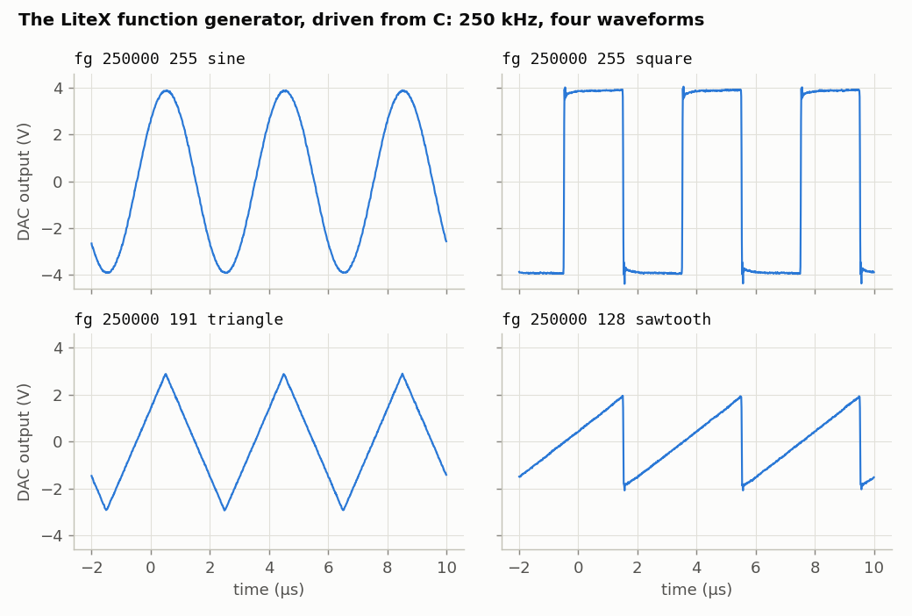

**Try this:**

- Add an `offset` register: a signed number added to the waveform before it
  goes to the DAC. You need a `CSRStorage` in `FuncGen`, a port on
  `funcgen_core`, and a few lines of C.
- Add a frequency *sweep* command to the firmware: step `funcgen_tw` in a loop
  with `busy_wait()` between steps. How fast can the CPU change the frequency?
  (Look at the DAC output with the scope's persistence on.)
- The `leds` register (`leds_out_write()`) belongs to the stock SoC's LED
  chaser. Show the waveform number on it. Careful: LiteX's platform file numbers
  the LEDs the opposite way from `icepi_adda.lpf`. Its bit 0 is the *leftmost*
  LED, so reverse the bits if you want the number to read normally.

---

## Part 6: An ADC-capture peripheral

The capture core is Part 3's `capture.v` without the serial port, plus a
trigger. The new part is how the CPU gets the samples: not through a register
at a time, but through a 16 kB window in its address space.

<!-- file: litex/adc_capture_core.v -->
```verilog
// adc_capture_core.v -- record 16384 ADC samples into a buffer the CPU can read.
//
// Tutorial 3's capture.v without the serial port: a `start` pulse records
// 16384 samples (keeping 1 in 2^decimation), optionally waiting first for the
// signal to cross `trig_level` going upward.  The buffer is 4096 32-bit words,
// four samples per word, first sample in the lowest byte -- so on the
// (little-endian) CPU it simply reads as an array of 16384 bytes.

module adc_capture_core (
    input  wire        clk,
    input  wire [7:0]  sample,
    input  wire        sample_valid,
    // control, from the CPU's registers
    input  wire        start,          // pulse: begin a new capture
    input  wire [3:0]  decimation,     // keep 1 sample in 2^decimation
    input  wire        trig_enable,    // wait for an upward crossing first
    input  wire [7:0]  trig_level,
    output wire        busy,
    output reg         done = 0,       // a complete capture is in the buffer
    // the CPU's read port into the buffer
    input  wire [11:0] rd_addr,
    output reg  [31:0] rd_data = 0
);
    reg [31:0] mem [0:4095];
    always @(posedge clk)
        rd_data <= mem[rd_addr];

    localparam IDLE = 0, ARMED = 1, RECORD = 2;
    reg [1:0]  state = IDLE;
    reg [15:0] skip = 0;
    reg [7:0]  last = 0;               // previous kept sample, for the trigger
    reg [13:0] n = 0;                  // samples recorded so far
    reg [23:0] pack = 0;               // the first three samples of a word

    assign busy = (state != IDLE);

    // "keep" is high for the samples that survive decimation
    wire keep = sample_valid && (skip == 0);
    always @(posedge clk)
        if (start || state == IDLE)
            skip <= 0;
        else if (sample_valid)
            skip <= (skip == 0) ? (16'd1 << decimation) - 1 : skip - 1;

    always @(posedge clk) begin
        if (start) begin
            done  <= 0;
            n     <= 0;
            last  <= 8'hff;            // forget the old signal: no crossing yet
            state <= trig_enable ? ARMED : RECORD;
        end else case (state)
            ARMED:
                if (keep) begin
                    last <= sample;
                    if (last < trig_level && sample >= trig_level)
                        state <= RECORD;
                end
            RECORD:
                if (keep) begin
                    // shift the sample in; every 4th completes a 32-bit word
                    if (n[1:0] == 3)
                        mem[n[13:2]] <= {sample, pack};
                    pack <= {sample, pack[23:8]};
                    n <= n + 1;
                    if (n == 16383) begin
                        state <= IDLE;
                        done  <= 1;
                    end
                end
        endcase
    end
endmodule
```

In `adda_litex.py`, `AdcCapture` has three registers (`control`, `config` and
`status`) built from named *fields*. `CSRField("start", pulse=True)` is a bit
that is high for exactly one clock when the CPU writes a 1, which is exactly
what `adc_capture_core`'s `start` input wants.

The buffer is a **bus slave**. `wishbone.Interface()` is the bundle of wires a
Wishbone device has (`adr`, `dat_r`, `cyc`, `stb`, `ack`, ...). The wrapper
connects the address to the core's read port and answers every request one
clock later with `ack`, which is how long the block RAM takes. Then

```python
soc.bus.add_slave("capture_buf", soc.capture.bus, SoCRegion(size=0x4000, cached=False))
```

tells LiteX to give it 16 kB of addresses. `cached=False` places it in the
CPU's uncached I/O area: the CPU must fetch fresh samples every time, not
reuse stale copies from its data cache. LiteX chose 0x80000000. To the C
program the buffer is just an array:

```c
static volatile uint8_t *const samples = (volatile uint8_t *)CAPTURE_BUF_BASE;
```

`volatile` tells the compiler that this memory can change behind its back, so
every `samples[i]` must be a real load.

With the firmware from Part 5 running, `cap D [level]` records 16384 samples at
25 MS/s ÷ 2<sup>D</sup> (optionally waiting for an upward crossing of `level`),
and `dump` prints them in hex:

```
adda> cap 2 128
capture: 16384 samples at 6250000 S/s, codes 51..203, mean 126
adda> dump
898d93979b9fa3a6a9abadafb0b1b1b2b0aeacaaa7a4a09d98938e8a85807a76716c67635f5b5855...
```

`cap_plot.py` does that for you from the PC and plots the result. Close
`litex_term` first: only one program can have the port open.

<!-- file: litex/cap_plot.py -->
```python
#!/usr/bin/env python3
"""Part 6, the PC side: ask the firmware for a capture and plot it.

    python3 cap_plot.py                 # 25 MS/s, free-running
    python3 cap_plot.py -d 2 -t 128     # 6.25 MS/s, triggered at mid-scale
    python3 cap_plot.py -o scope.csv --no-plot

The firmware must be running (its prompt is "adda>"), and no terminal program
may have the port open.
"""
import argparse
import re
import time

import numpy as np
import serial

N = 16384


def cap(port, d=0, level=None):
    """Returns (time in s, ADC codes) from the firmware's cap + dump commands."""
    with serial.Serial(port, 115200, timeout=0.2) as ser:
        ser.write(b"\r")
        time.sleep(0.2)
        ser.reset_input_buffer()
        ser.write(b"cap %d%s\r" % (d, b"" if level is None else b" %d" % level))
        reply = b""
        while b"adda> " not in reply:
            chunk = ser.read(256)
            if not chunk and b"cap" in reply and time.time() > deadline:
                raise RuntimeError("no reply: is the firmware running?")
            if not reply:
                deadline = time.time() + 25
            reply += chunk
        print(reply.decode(errors="replace").replace("\r", "").splitlines()[1])
        ser.write(b"dump\r")
        text = b""
        while text.count(b"\n") < N // 64 + 1:
            chunk = ser.read(4096)
            if not chunk:
                break
            text += chunk
    text = text.replace(b"\r", b"")          # LiteX's console ends lines with \n\r
    hexdigits = b"".join(re.findall(rb"^[0-9a-f]{128}$", text, re.M))
    codes = np.frombuffer(bytes.fromhex(hexdigits.decode()), dtype=np.uint8)
    if len(codes) != N:
        raise RuntimeError(f"got {len(codes)} of {N} samples")
    return np.arange(N) / (25e6 / 2**d), codes


if __name__ == "__main__":
    ap = argparse.ArgumentParser(description=__doc__,
                                 formatter_class=argparse.RawDescriptionHelpFormatter)
    ap.add_argument("--port", default="/dev/ttyUSB0")
    ap.add_argument("-d", type=int, default=0, help="keep 1 sample in 2^d")
    ap.add_argument("-t", "--trigger", type=int, help="trigger level, 0..255")
    ap.add_argument("-o", "--out", help="save time,code as CSV")
    ap.add_argument("--no-plot", action="store_true")
    args = ap.parse_args()

    t, code = cap(args.port, args.d, args.trigger)
    if args.out:
        np.savetxt(args.out, np.column_stack([t, code]), delimiter=",",
                   header="time_s,adc_code", fmt=["%.9g", "%d"])
    if not args.no_plot:
        import matplotlib.pyplot as plt
        plt.plot(t * 1e6, (code - 126.7) / 25.35, ".-", markersize=3, linewidth=0.5)
        plt.xlabel("time (µs)")
        plt.ylabel("ADC input (V)")
        plt.grid(True)
        plt.show()
```

```console
$ python3 cap_plot.py -d 2 -t 128
capture: 16384 samples at 6250000 S/s, codes 51..203, mean 126
```


Printing 16384 samples as text at 115,200 baud takes 3.4 s, versus 0.16 s for
Part 3's raw bytes at 1 Mbaud. That's the price of going through a console
meant for humans. Part 8 reads the same buffer under Linux.

**Try this:**

- Add a *pre-trigger*: keep recording into the buffer as a ring while
  `ARMED`, and stop 8192 samples after the trigger, so the capture shows what
  happened before the trigger as well as after.
- Add a `level` readback: a `CSRStatus(8)` that always holds the latest ADC
  sample, so the firmware can act as a slow voltmeter without a capture.

---

## Part 7: A lock-in peripheral

The lock-in core is Part 4's `lockin.v` minus the serial port and its own DDS.
Its reference is the **function generator's phase**, wired straight across in
`add_adda()`, so the lock-in always detects at whatever frequency the function
generator is playing.

<!-- file: litex/lockin_core.v -->
```verilog
// lockin_core.v -- Tutorial 4's lock-in, with the serial port replaced by
// registers.  The reference is the function generator's own phase, so
// whatever frequency the function generator is set to is what we detect.
//
// A `start` pulse sums 2^n_log2 products (n_log2 up to 24: 0.67 s):
//     x_sum = sum (adc - 128) * sin(phase)      y_sum = sum (adc - 128) * cos(phase)
// with sin and cos from a table of +-127.  The CPU divides by 2^n_log2.

module lockin_core (
    input  wire        clk,
    input  wire [7:0]  sample,
    input  wire        sample_valid,
    input  wire [31:0] phase,           // from funcgen_core
    input  wire        start,
    input  wire [4:0]  n_log2,
    output reg         busy = 0,
    output reg         done = 0,
    output reg  signed [47:0] x_sum = 0,
    output reg  signed [47:0] y_sum = 0
);
    reg signed [7:0] sine_table [0:255];
    integer i;
    initial
        for (i = 0; i < 256; i = i + 1)
            sine_table[i] = $rtoi($floor(127.0 * $sin(6.283185307179586 * i / 256) + 0.5));

    // the same 3-step assembly line as lockin.v
    reg               v1 = 0, v2 = 0;
    reg signed [8:0]  s = 0;
    reg signed [7:0]  ref_sin = 0, ref_cos = 0;
    reg signed [16:0] p_sin = 0, p_cos = 0;
    reg signed [47:0] acc_x = 0, acc_y = 0;
    reg [24:0]        count = 0;

    always @(posedge clk) begin
        v1      <= sample_valid;
        s       <= $signed({1'b0, sample}) - 9'sd128;
        ref_sin <= sine_table[phase[31:24]];
        ref_cos <= sine_table[phase[31:24] + 8'd64];
        v2      <= v1;
        p_sin   <= s * ref_sin;
        p_cos   <= s * ref_cos;

        if (start) begin
            acc_x <= 0;
            acc_y <= 0;
            count <= 0;
            busy  <= 1;
            done  <= 0;
        end else if (busy && v2) begin
            acc_x <= acc_x + p_sin;
            acc_y <= acc_y + p_cos;
            count <= count + 1;
            if (count == (25'd1 << n_log2) - 1) begin
                x_sum <= acc_x + p_sin;
                y_sum <= acc_y + p_cos;
                busy  <= 0;
                done  <= 1;
            end
        end
    end
endmodule
```

The sums are 48 bits wide, too wide for one 32-bit register. `CSRStatus(64)`
simply occupies two addresses, and LiteX's generated `lockin_x_read()` reads
both and returns a `uint64_t`. The C side divides by 2<sup>n_log2</sup> and
does the square root and arctangent in floating point. VexRiscv has no
floating-point unit, so the compiler calls software routines instead. That's
slow, but it runs once per 42 ms measurement.

The whole firmware:

<!-- file: litex/firmware/main.c -->
```c
// main.c -- a small command shell for the ADC/DAC peripherals (Parts 5-7).
//
// Runs on the VexRiscv CPU inside the FPGA.  Talk to it with
//     litex_term --kernel=firmware.bin /dev/ttyUSB0
// and type "help".
//
// Every peripheral register has a C function made for it by LiteX, in
// build/icepi_zero/software/include/generated/csr.h: funcgen_tw_write(),
// capture_status_read(), lockin_x_read() and so on.  Each one is a single
// load or store to a fixed address.

#include <stdio.h>
#include <stdlib.h>
#include <string.h>
#include <math.h>

#include <irq.h>
#include <system.h>
#include <libbase/uart.h>
#include <libbase/console.h>
#include <generated/csr.h>
#include <generated/mem.h>
#include <generated/soc.h>

#define F_SYS              CONFIG_CLOCK_FREQUENCY   /* 50 MHz */
#define ADC_CODES_PER_VOLT 25.35f                   /* measured in Part 3 */
#define N_SAMPLES          16384

/*---- function generator (Part 5) ------------------------------------------*/

static const char *wave_names[] = {"sine", "square", "triangle", "sawtooth"};

static void funcgen_set(uint32_t hz, int amplitude, int wave)
{
	uint32_t tw = ((uint64_t)hz << 32) / F_SYS;     /* f = tw * F_SYS / 2^32 */
	funcgen_tw_write(tw);
	funcgen_amplitude_write(amplitude);
	funcgen_waveform_write(wave);
}

static void print_frequency(void)
{
	uint64_t f = (uint64_t)funcgen_tw_read() * F_SYS;      /* Hz * 2^32 */
	uint32_t hz = f >> 32;
	uint32_t mhz = ((f & 0xffffffff) * 1000) >> 32;         /* the fraction, in mHz */
	printf("%lu.%03lu Hz", (unsigned long)hz, (unsigned long)mhz);
}

static void fg_cmd(char *args[], int n)
{
	if (n >= 2) {
		int amplitude = (n >= 3) ? atoi(args[2]) : 255;
		int wave = 0;
		if (n >= 4)
			for (int i = 0; i < 4; i++)
				if (strncmp(args[3], wave_names[i], 3) == 0)
					wave = i;
		funcgen_set(strtoul(args[1], NULL, 0), amplitude, wave);
	}
	printf("funcgen: ");
	print_frequency();
	printf(", amplitude %d/255, %s\n", (int)funcgen_amplitude_read(),
	       wave_names[funcgen_waveform_read() & 3]);
}

/*---- ADC capture (Part 6) ---------------------------------------------------*/

/* The capture buffer is ordinary memory as far as the CPU is concerned. */
static volatile uint8_t *const samples = (volatile uint8_t *)CAPTURE_BUF_BASE;

static int capture(int decimation, int trig_level)
{
	uint32_t config = decimation & 0xf;
	if (trig_level >= 0)                                  /* trig_enable + level */
		config |= (1 << 8) | ((trig_level & 0xff) << 16);
	capture_config_write(config);
	capture_control_write(1);                             /* start */
	for (int ms = 0; ms < 5000; ms++) {                   /* 16384 samples: 0.7 ms .. 21 s */
		if (capture_status_read() & 2)                /* done */
			return 0;
		busy_wait(1);
	}
	return -1;
}

static void cap_cmd(char *args[], int n)
{
	int d = (n >= 2) ? atoi(args[1]) : 0;
	int level = (n >= 3) ? atoi(args[2]) : -1;
	if (capture(d, level) < 0) {
		printf("capture: timed out (no trigger?)\n");
		return;
	}
	int lo = 255, hi = 0, sum = 0;
	for (int i = 0; i < N_SAMPLES; i++) {
		int s = samples[i];
		lo = s < lo ? s : lo;
		hi = s > hi ? s : hi;
		sum += s;
	}
	printf("capture: %d samples at %lu S/s, codes %d..%d, mean %d\n", N_SAMPLES,
	       (unsigned long)(F_SYS / 2 >> d), lo, hi, sum / N_SAMPLES);
}

static void dump_cmd(void)
{
	/* 16384 samples as hex, 64 per line: 34 kB of text, ~3 s at 115200 baud */
	for (int i = 0; i < N_SAMPLES; i++) {
		printf("%02x", samples[i]);
		if (i % 64 == 63)
			printf("\n");
	}
}

/*---- lock-in (Part 7) -------------------------------------------------------*/

/* One measurement at the function generator's frequency.  Returns the
   amplitude (volts at the ADC) and phase (degrees) of what came back. */
static int lockin_measure(int n_log2, float *volts, float *degrees)
{
	lockin_n_log2_write(n_log2);
	lockin_control_write(1);                              /* start */
	for (int ms = 0; ms < 2000; ms++) {
		if (lockin_status_read() & 2) {               /* done */
			/* The sums are 64-bit; divide by 2^n_log2 in integers first
			   (keeping 8 fraction bits), since this CPU's C library can't
			   convert a 64-bit integer straight to float. */
			int32_t x256 = (int64_t)lockin_x_read() >> (n_log2 - 8);
			int32_t y256 = (int64_t)lockin_y_read() >> (n_log2 - 8);
			float x = x256 / 256.0f;                      /* < adc * sin > */
			float y = y256 / 256.0f;                      /* < adc * cos > */
			*volts   = 2.0f * sqrtf(x * x + y * y) / 127.0f / ADC_CODES_PER_VOLT;
			*degrees = atan2f(y, x) * 180.0f / (float)M_PI;
			return 0;
		}
		busy_wait(1);
	}
	return -1;
}

/* print x/1000 with three decimals: printf here has no %f */
static void print_milli(int x)
{
	printf("%s%d.%03d", x < 0 ? "-" : "", abs(x) / 1000, abs(x) % 1000);
}

static void li_cmd(char *args[], int n)
{
	if (n >= 2)
		funcgen_set(strtoul(args[1], NULL, 0), 255, 0);
	int n_log2 = (n >= 3) ? atoi(args[2]) : 20;          /* 8..24 */
	float v, deg;
	if (lockin_measure(n_log2, &v, &deg) < 0) {
		printf("lockin: timed out\n");
		return;
	}
	print_frequency();
	printf("  ");
	print_milli(v * 1e6f);                                /* microvolts -> "mV" */
	printf(" mV  ");
	print_milli(deg * 1000);
	printf(" deg\n");
}

static void sweep_cmd(char *args[], int n)
{
	if (n < 4) {
		printf("usage: sweep <start Hz> <stop Hz> <points> [n_log2]\n");
		return;
	}
	float f0 = strtoul(args[1], NULL, 0), f1 = strtoul(args[2], NULL, 0);
	int points = atoi(args[3]);
	int n_log2 = (n >= 5) ? atoi(args[4]) : 20;
	printf("# f_Hz amplitude_mV phase_deg\n");
	for (int i = 0; i < points; i++) {
		float f = f0 * powf(f1 / f0, points > 1 ? (float)i / (points - 1) : 0);  /* log spacing */
		float v, deg;
		funcgen_set((uint32_t)f, 255, 0);
		if (lockin_measure(n_log2, &v, &deg) < 0)
			break;
		printf("%lu ", (unsigned long)f);
		print_milli(v * 1e6f);
		printf(" ");
		print_milli(deg * 1000);
		printf("\n");
	}
}

/*---- the shell ------------------------------------------------------------------*/

static void help(void)
{
	puts("fg <Hz> [amplitude 0-255] [sine|square|triangle|sawtooth]   function generator");
	puts("cap [decimation 0-15] [trigger level 0-255]                capture 16384 samples");
	puts("dump                                                       print the capture, in hex");
	puts("li [Hz] [n_log2]                                           one lock-in measurement");
	puts("sweep <start Hz> <stop Hz> <points> [n_log2]               lock-in frequency sweep");
}

static char *readline(void)
{
	static char line[80];
	static int len = 0;
	while (readchar_nonblock()) {
		char c = getchar();
		if (c == '\r' || c == '\n') {
			line[len] = 0;
			len = 0;
			putchar('\n');
			return line;
		} else if ((c == 0x7f || c == 0x08) && len > 0) {
			len--;
			fputs("\x08 \x08", stdout);
		} else if (c >= ' ' && len < (int)sizeof(line) - 1) {
			line[len++] = c;
			putchar(c);
		}
	}
	return NULL;
}

int main(void)
{
#ifdef CONFIG_CPU_HAS_INTERRUPT
	irq_setmask(0);
	irq_setie(1);
#endif
	uart_init();
	puts("\nADC/DAC peripherals on LiteX.  Type 'help'.");
	funcgen_set(1000000, 255, 0);
	printf("adda> ");
	while (1) {
		char *line = readline();
		if (line == NULL)
			continue;
		char *args[8];
		int n = 0;
		for (char *tok = strtok(line, " "); tok && n < 8; tok = strtok(NULL, " "))
			args[n++] = tok;
		if (n == 0)                         ;
		else if (!strcmp(args[0], "help"))  help();
		else if (!strcmp(args[0], "fg"))    fg_cmd(args, n);
		else if (!strcmp(args[0], "cap"))   cap_cmd(args, n);
		else if (!strcmp(args[0], "dump"))  dump_cmd();
		else if (!strcmp(args[0], "li"))    li_cmd(args, n);
		else if (!strcmp(args[0], "sweep")) sweep_cmd(args, n);
		else                                printf("unknown command; try 'help'\n");
		printf("adda> ");
	}
}
```

<!-- file: litex/firmware/Makefile -->
```makefile
# Build the firmware against a LiteX build directory:
#     make BUILD_DIR=../build/icepi_zero
# (adapted from LiteX's own litex/soc/software/demo/Makefile)
BUILD_DIR ?= ../build/icepi_zero

include $(BUILD_DIR)/software/include/generated/variables.mak
include $(SOC_DIRECTORY)/software/common.mak

OBJECTS = crt0.o main.o

all: firmware.bin

%.bin: %.elf
	$(OBJCOPY) -O binary $< $@

firmware.elf: $(OBJECTS)
	$(CC) $(LDFLAGS) -T linker.ld -N -o $@ $(OBJECTS) \
		$(PACKAGES:%=-L$(BUILD_DIR)/software/%) \
		-Wl,--start-group $(LIBS:lib%=-l%) -Wl,--end-group \
		-Wl,--gc-sections

-include $(OBJECTS:.o=.d)

VPATH = $(BIOS_DIRECTORY):$(BIOS_DIRECTORY)/cmds:$(CPU_DIRECTORY)

%.o: %.c
	$(compile)

%.o: %.S
	$(assemble)

clean:
	$(RM) $(OBJECTS) $(OBJECTS:.o=.d) firmware.elf firmware.bin

.PHONY: all clean
```

(`linker.ld` in the same folder is LiteX's demo linker script. It puts the code
in SDRAM and the stack in on-chip SRAM.)

```
adda> li 100000
99999.993 Hz  1983.707 mV  -1.650 deg
adda> li 100000
99999.993 Hz  1982.735 mV  -1.917 deg
adda> sweep 90000 110000 5
# f_Hz amplitude_mV phase_deg
90000 1.755 75.022
94630 1.827 128.802
99498 5.245 76.053
104617 2.744 126.332
110000 1.186 -100.367
```

Here the ADC input came from a separate 2 V generator, tuned to within 0.002
Hz of the function generator's 100 kHz, so the phase drifts by only a quarter
of a degree per reading. The sweep shows the other side of the same coin: 500
Hz or more away from the input's frequency, the lock-in reports a few
millivolts of a 2 V signal.

With the DAC looped to the ADC, `sweep` measures a filter or a cable as Part 4
did, with the same 42 ms averaging and pass band. Through the 16.5 cm cable:

```
adda> sweep 100000 8000000 6
# f_Hz amplitude_mV phase_deg
100000 3871.968 -10.768
240224 3868.114 -25.842
577079 3849.541 -61.900
1386289 3789.575 -148.128
3330213 3667.744 8.165
8000000 3957.055 -125.747
```

The amplitudes are the ones Part 4 measured. The delay is not: the phase
slope is 299 ns here against Part 4's 212.7 ns. `funcgen_core` has three more
pipeline registers between its phase accumulator and the DAC than `lockin.v`
(60 ns), and `lockin_core` reads the phase one clock later (20 ns). Neither
design is wrong. A lock-in's absolute phase includes its own internal delays,
which is why every measurement is divided by a reference taken the same way.
(The crosstalk floor is also higher in this SoC: 0.9 mV at 100 kHz, against
0.17 mV for Part 4's bare design.) What's new is that the measurement is now a
function call.
Averaging time, frequency plan and the arithmetic are software, and changing
them takes seconds instead of a re-synthesis.

How small a signal can it see? The same generator, at the function
generator's frequency, stepped from 4 V down to 1 mV. Each point is the mean of
three `li 100000 24` (2²⁴ samples, 0.67 s each):


- From 4 V down to one ADC code (39.5 mV) the reading is proportional to the
  input, reading low by 0.5% at 4 V and 3% at 0.1 V. A signal of ±2 codes
  exercises only the few codes around mid-scale, so it samples those codes'
  individual widths (the ADC's *differential nonlinearity*) rather than the
  average.
- Below one code the lock-in still clearly sees the signal: 7.4 mV for 10 mV,
  2.6 mV for 4 mV. The ADC's own noise, about half a code rms, *dithers* a
  small signal across code boundaries, and averaging 16 million samples
  recovers it. These readings are low by 25–40%, but this test can't say how
  much of that is the ADC: the ADALM2000's generator only has 2.4 mV steps
  itself.
- The floor, 0.9 mV, is what the lock-in reads with the input at 0 V. That is
  the DAC's own output leaking into the ADC. Because it is at exactly the
  reference frequency, no amount of averaging removes it. Only better layout
  and shielding would, or a separate measurement of it to subtract as a vector.

**Try this:**

- Make the lock-in free-running: when a result is done, latch it and start the
  next sum immediately, and add a `count` register that increments with each
  result. Now software can read results without waiting.
- Add an input to `lockin_core` that selects the reference as the *second
  harmonic* of the function generator (`phase << 1`), and measure the 2*f*
  distortion of a diode clipper driven at *f*.

---

## Part 8: The peripherals under Linux

The last step is to run Linux on the FPGA and control the three instruments
the way Linux controls any hardware. At the end of this part, this is a
function generator:

```console
# echo 123456 > /sys/bus/platform/devices/f0002000.adda/funcgen/frequency
# echo triangle > /sys/bus/platform/devices/f0002000.adda/funcgen/waveform
```

and this is a 16384-sample digitizer and a lock-in:

```console
# cat /sys/bus/platform/devices/f0002000.adda/capture/data > samples.bin
# cat /sys/bus/platform/devices/f0002000.adda/lockin/result
```

Read [`README.md`](README.md#default-target-icepi-zero-2026-08-27) first: it
boots the stock linux-on-litex-vexriscv images on this board, and everything
here builds on that. Linux needs a CPU with a memory-management unit, so these
SoCs use **VexRiscv-SMP** instead of the small VexRiscv of Parts 5–7.

There are three pieces to build, and each can be rebuilt without the others:

| piece | what it is | built by | time |
| --- | --- | --- | --- |
| gateware | the SoC, now with our peripherals, as a bitstream | `make_linux.py` | 2 min |
| device tree | tells Linux what hardware exists and where | `make_linux.py` | seconds |
| Linux | kernel, root file system, OpenSBI firmware | Buildroot | 25 min once, then seconds |

### 8.1 The SoC, and the device tree

linux-on-litex-vexriscv's `make.py` builds a Linux-capable SoC for a named
board. This wrapper adds one more board, `icepi_zero_adda`, which is the stock
`icepi_zero` plus `add_adda()` from Part 5, with the micro-SD slot driven in
its fast native 4-bit mode (8.7 boots from it). It then adds a node for our
peripherals to the device tree:

<!-- file: litex/make_linux.py -->
```python
#!/usr/bin/env python3
"""Build linux-on-litex-vexriscv's Icepi Zero SoC with the ADC/DAC peripherals.

Run it from the linux-on-litex-vexriscv directory, like that project's make.py:

    cd ~/openfpga/linux-on-litex-vexriscv
    python3 <this dir>/make_linux.py --board=icepi_zero_adda --build --uart-baudrate=460800

It registers one extra board, "icepi_zero_adda": the stock icepi_zero plus
add_adda(), with the SD card in its native 4-bit mode and no HDMI terminal.
It runs make.py, then writes a device tree with a node for the peripherals --
so a Linux driver can find them -- to <images-dir>/rv32.dtb.

    --images-dir=images_adda   (default) the root file system is an initramfs,
                               images_adda/rootfs.cpio.gz, whose size the device
                               tree records -- put it there first
    --rootfs=mmcblk0p2 --images-dir=images_sd
                               the root file system is partition 2 of the SD card

Without --build it only regenerates the device tree (seconds).
"""
import json
import os
import re
import shutil
import subprocess
import sys

HERE = os.path.dirname(os.path.abspath(__file__))
sys.path.insert(0, HERE)
sys.path.insert(0, os.getcwd())

import make      # linux-on-litex-vexriscv's make.py
import boards
from litex_boards.targets import icepi_zero
from adda_litex import add_adda

IMAGES = "images_adda"
for a in list(sys.argv):
    if a.startswith("--images-dir="):
        IMAGES = a.split("=", 1)[1]
        sys.argv.remove(a)


class IcepiZeroAddaSoC(icepi_zero.BaseSoC):
    def __init__(self, **kwargs):
        icepi_zero.BaseSoC.__init__(self, **kwargs)
        add_adda(self)


class Icepi_zero_adda(boards.Icepi_zero):
    def __init__(self):
        boards.Board.__init__(self, IcepiZeroAddaSoC, soc_capabilities={
            "serial", "sdcard", "leds",
        })


make.supported_boards["icepi_zero_adda"] = Icepi_zero_adda    # make.py's list of boards


DTS_NODE = """
/ {{
    soc {{
        adda: adda@{funcgen:x} {{
            compatible = "hmc,icepi-adda";
            reg = <0x{funcgen:x} 0x100>, <0x{capture:x} 0x100>,
                  <0x{lockin:x} 0x100>, <0x{buf:x} 0x{bufsize:x}>;
            reg-names = "funcgen", "capture", "lockin", "buffer";
            clock-frequency = <{clk}>;
            status = "okay";
        }};
    }};
}};
"""


def write_dtb(board_name):
    build = os.path.join("build", board_name)
    csr = json.load(open(os.path.join(build, "csr.json")))
    dts_file = os.path.join(build, board_name + ".dts")
    dts = open(dts_file).read()

    # make.py sized the initrd from images/rootfs.cpio.gz; use ours instead
    m = re.search(r"linux,initrd-start = <(0x[0-9a-f]+)>", dts)
    if m:
        end = int(m.group(1), 16) + os.path.getsize(os.path.join(IMAGES, "rootfs.cpio.gz"))
        dts = re.sub(r"linux,initrd-end   = <0x[0-9a-f]+>", "linux,initrd-end   = <0x%x>" % end, dts)

    dts += DTS_NODE.format(
        funcgen=csr["csr_bases"]["funcgen"],
        capture=csr["csr_bases"]["capture"],
        lockin=csr["csr_bases"]["lockin"],
        buf=csr["memories"]["capture_buf"]["base"],
        bufsize=csr["memories"]["capture_buf"]["size"],
        clk=csr["constants"]["config_clock_frequency"],
    )
    open(dts_file, "w").write(dts)
    subprocess.check_call(["dtc", "-O", "dtb", "-o", os.path.join(IMAGES, "rv32.dtb"), dts_file])
    rootfs = [a.split("=", 1)[1] for a in sys.argv if a.startswith("--rootfs=")] or ["ram0"]
    shutil.copy(os.path.join("images", "boot_%s.json" % rootfs[0]), os.path.join(IMAGES, "boot.json"))
    print(f"Device tree with the hmc,icepi-adda node: {IMAGES}/rv32.dtb (from {dts_file})")


if __name__ == "__main__":
    os.makedirs(IMAGES, exist_ok=True)
    stock_dtb = os.path.join("images", "rv32.dtb")
    saved = open(stock_dtb, "rb").read() if os.path.exists(stock_dtb) else None
    try:
        make.main()                 # (also writes images/rv32.dtb: put it back below)
    finally:
        if saved is not None:
            open(stock_dtb, "wb").write(saved)
    board = [a.split("=", 1)[1] for a in sys.argv if a.startswith("--board=")][0]
    write_dtb(board)
```

The **device tree** is how Linux learns what hardware exists on a board with no
plug-and-play bus. LiteX generates most of it from `csr.json` (the UART, the
timer, the interrupt controller...). Our node adds one device:

```dts
adda: adda@f0002000 {
    compatible = "hmc,icepi-adda";
    reg = <0xf0002000 0x100>, <0xf0000000 0x100>,
          <0xf0003800 0x100>, <0x80000000 0x4000>;
    reg-names = "funcgen", "capture", "lockin", "buffer";
    clock-frequency = <50000000>;
};
```

`compatible` is the name a driver will look for. `reg` lists the address
ranges the device occupies (the three register blocks and the capture buffer),
and `reg-names` labels them. The addresses come from this build's `csr.json`,
so they are right even if LiteX moves things around.

```bash
cd ~/openfpga/linux-on-litex-vexriscv
python3 <path>/IcepiZeroADCDAC_tutorials/litex/make_linux.py \
        --board=icepi_zero_adda --build --uart-baudrate=460800
```

The result is `build/icepi_zero_adda/gateware/icepi_zero_adda.bit` and
`images_adda/rv32.dtb`. This SoC fills 51 of the 56 block RAMs and 55% of the
logic, and passes timing at 50 MHz with little to spare (54.4 MHz). The UART
runs at 460,800 baud, which [`README.md`](README.md) found to be the fastest
rate that serial boot handles reliably.

### 8.2 Linux, built from source with Buildroot

The 2022 images from `README.md` boot on this SoC (try it: the quick test in
8.4 works with them), but that kernel was built without **loadable modules**,
so it can't accept a new driver without being rebuilt. So we build our own
kernel and root filesystem with
[Buildroot](https://buildroot.org), exactly as linux-on-litex-vexriscv's
README describes, plus a few changes. They live in `linux/`, a Buildroot
*external tree*:

<!-- file: linux/configs/icepi_adda_defconfig -->
```
# Target options
BR2_riscv=y
BR2_RISCV_32=y

# Instruction Set Extensions
BR2_riscv_custom=y
# Backward compat (buildroot 2023.02.5 LTS).
BR2_RISCV_ISA_CUSTOM_RVM=y
BR2_RISCV_ISA_CUSTOM_RVA=y
BR2_RISCV_ISA_CUSTOM_RVC=n
# make.py enables FPU/hard-float options in the generated board defconfig.
#BR2_RISCV_ISA_CUSTOM_RVF=y
#BR2_RISCV_ISA_CUSTOM_RVD=y
# Since commit cbd91e89e4 (2023-08-18 / 2023.11).
BR2_RISCV_ISA_RVM=y
BR2_RISCV_ISA_RVA=y
BR2_RISCV_ISA_RVC=n
# make.py enables FPU/hard-float options in the generated board defconfig.
#BR2_RISCV_ISA_RVF=y
#BR2_RISCV_ISA_RVD=y
BR2_RISCV_ABI_ILP32=y

# Patches
BR2_GLOBAL_PATCH_DIR="$(BR2_EXTERNAL_LITEX_VEXRISCV_PATH)/patches"

# GCC
BR2_GCC_VERSION_13_X=y

# System
BR2_TARGET_GENERIC_GETTY=y
BR2_TARGET_GENERIC_GETTY_PORT="console"

# Filesystem
BR2_TARGET_ROOTFS_CPIO=y
BR2_TARGET_ROOTFS_CPIO_GZIP=y
BR2_TARGET_ROOTFS_EXT2=y
BR2_TARGET_ROOTFS_EXT2_4=y

# Image

# Kernel header version
# Kernel header version. MUST track BR2_LINUX_KERNEL_CUSTOM_VERSION_VALUE below.
# BR2_KERNEL_HEADERS_AS_KERNEL=y (the kconfig default) builds the headers package
# at the kernel's version, while this symbol declares the series the toolchain is
# built against. support/scripts/check-kernel-headers.sh compares the two and
# aborts the build if they disagree.
BR2_PACKAGE_HOST_LINUX_HEADERS_CUSTOM_6_12=y

# Kernel (mainline + patches set)
BR2_LINUX_KERNEL=y
BR2_LINUX_KERNEL_CUSTOM_VERSION=y
BR2_LINUX_KERNEL_CUSTOM_VERSION_VALUE="6.12"
BR2_LINUX_KERNEL_USE_CUSTOM_CONFIG=y
BR2_LINUX_KERNEL_CUSTOM_CONFIG_FILE="$(BR2_EXTERNAL_LITEX_VEXRISCV_PATH)/board/litex_vexriscv/linux.config"
BR2_LINUX_KERNEL_IMAGE=y

# Bootloader (opensbi)
BR2_TARGET_OPENSBI=y
BR2_TARGET_OPENSBI_CUSTOM_GIT=y
BR2_TARGET_OPENSBI_CUSTOM_REPO_URL="https://github.com/litex-hub/opensbi.git"
BR2_TARGET_OPENSBI_CUSTOM_REPO_VERSION="1.3.1-linux-on-litex-vexriscv"
BR2_TARGET_OPENSBI_PLAT="litex/vexriscv"
BR2_TARGET_OPENSBI_INSTALL_DYNAMIC_IMG=n

# Rootfs customisation

# Required tools to create the SD image
BR2_PACKAGE_HOST_DOSFSTOOLS=y
BR2_PACKAGE_HOST_GENIMAGE=y
BR2_PACKAGE_HOST_MTOOLS=y

# Extra packages
#BR2_PACKAGE_DHRYSTONE_OPT=y
#BR2_PACKAGE_MICROPYTHON=y
#BR2_PACKAGE_SPIDEV_TEST=y
#BR2_PACKAGE_MTD=y
#BR2_PACKAGE_MTD_JFFS_UTILS=y

# Crypto
#BR2_PACKAGE_LIBATOMIC_OPS_ARCH_SUPPORTS=y
#BR2_PACKAGE_LIBATOMIC_OPS=y
#BR2_PACKAGE_OPENSSL=y
#BR2_PACKAGE_LIBRESSL=y
#BR2_PACKAGE_LIBRESSL_BIN=y
#BR2_PACKAGE_HAVEGED=y
# make.py enables hardware AES options in the generated board defconfig.
#BR2_PACKAGE_VEXRISCV_AES=y

# ---- added for the Icepi Zero ADC/DAC tutorials ----
# Loadable modules, so the adda driver can be insmod'ed:
BR2_LINUX_KERNEL_CONFIG_FRAGMENT_FILES="$(BR2_EXTERNAL_ICEPI_ADDA_PATH)/kernel_modules.config"
# Upstream's overlay plus ours (adda.ko and sweep.sh in /root):
BR2_ROOTFS_OVERLAY="$(BR2_EXTERNAL_LITEX_VEXRISCV_PATH)/board/litex_vexriscv/rootfs_overlay $(BR2_EXTERNAL_ICEPI_ADDA_PATH)/rootfs_overlay"
# No post-image script: upstream's replaces linux-on-litex-vexriscv/images/
# with links to these files.  Copy them to images_adda/ instead (see Part 8).
# awk with maths, for /root/sweep.sh:
BR2_PACKAGE_BUSYBOX_CONFIG_FRAGMENT_FILES="$(BR2_EXTERNAL_ICEPI_ADDA_PATH)/busybox.config"
# musl instead of glibc: glibc 2.42's dynamic loader (Buildroot 2026.02) crashes
# on this CPU before init's main(), while glibc 2.34 (the 2022 images) did not.
# musl works (tested), and is smaller too.
BR2_TOOLCHAIN_BUILDROOT_MUSL=y
# (BR2_PACKAGE_PPPD removed: it pulls in 6 MB of OpenSSL that every serial boot would have to upload)
```

The first part is linux-on-litex-vexriscv's own `litex_vexriscv_defconfig`,
copied unchanged apart from dropping `pppd`. Our additions are at the end, and
the small files they refer to are:

<!-- file: linux/kernel_modules.config -->
```
# Added to linux-on-litex-vexriscv's kernel config so that drivers can be
# loaded with insmod instead of rebuilding the kernel each time.
CONFIG_MODULES=y
CONFIG_MODULE_UNLOAD=y
```

<!-- file: linux/busybox.config -->
```
# Added to Buildroot's BusyBox configuration: floating-point maths in awk
# (sqrt, atan2, exp, log), for sweep.sh.
CONFIG_FEATURE_AWK_LIBM=y
```

Two of those changes need explaining:

- **musl instead of glibc.** With Buildroot 2026.02's glibc 2.42, the kernel
  boots, but the first user program crashes inside glibc's dynamic loader,
  before `main()` (`init[1]: unhandled signal 11 ... in ld-linux-riscv32-ilp32.so.1`,
  then `Kernel panic - not syncing: Attempted to kill init!`). The 2022 images
  use glibc 2.34 and work on the same CPU. The musl C library works, and makes
  the root filesystem much smaller.
- **No `pppd`.** It pulls in 6 MB of OpenSSL, which takes the compressed root
  filesystem from about 2 MB to 5 MB, and every serial boot has to push that
  through the serial port.

```bash
cd ~/openfpga
git clone https://gitlab.com/buildroot.org/buildroot.git
cd buildroot && git checkout 2026.02.3
make O=$HOME/openfpga/buildroot-icepi \
     BR2_EXTERNAL=$HOME/openfpga/linux-on-litex-vexriscv/buildroot:<path>/IcepiZeroADCDAC_tutorials/linux \
     icepi_adda_defconfig
make O=$HOME/openfpga/buildroot-icepi          # ~25 minutes on 24 cores, the first time
```

Buildroot builds a cross-compiler first, then Linux 6.12 (with
linux-on-litex-vexriscv's 30 LiteX patches), OpenSBI, BusyBox, and a root
filesystem. The results are in `~/openfpga/buildroot-icepi/images/`. Copy them
next to the device tree:

```bash
cd ~/openfpga/linux-on-litex-vexriscv
B=~/openfpga/buildroot-icepi/images
cp $B/Image $B/rootfs.cpio.gz images_adda/
cp $B/fw_jump.bin images_adda/opensbi.bin
python3 <path>/litex/make_linux.py --board=icepi_zero_adda     # re-make the DTB: see below
```

The device tree records where the root filesystem ends in memory. That's why
`make_linux.py` must run again whenever `rootfs.cpio.gz` changes size. Without
`--build` it only regenerates the device tree.

| file | size | what |
| --- | ---: | --- |
| `Image` | 9.1 MB | Linux 6.12 |
| `rootfs.cpio.gz` | 1.2 MB | BusyBox and musl: the whole root file system, unpacked into RAM |
| `opensbi.bin` | 264 kB | OpenSBI, the RISC-V firmware between the hardware and Linux |
| `rv32.dtb` | 3 kB | the device tree |

### 8.3 Boot it

```bash
openFPGALoader -b icepi-zero build/icepi_zero_adda/gateware/icepi_zero_adda.bit
litex_term --speed=460800 --images=images_adda/boot.json /dev/ttyUSB0
# press Enter for the litex> prompt, then:
serialboot
```

The four files go over the serial port at about 44 kB/s: **4 minutes**. Then
OpenSBI starts Linux, whose kernel takes 19 s to boot (about half of that is
unpacking the root file system into RAM). Its start-up scripts take another
45 s, and you get `buildroot login:`. Log in as `root`, no password.

```console
# uname -a
Linux buildroot 6.12.0 #1 SMP Mon Sep 28 23:26:07 PDT 2026 riscv32 GNU/Linux
# cat /proc/cpuinfo | head -4
processor	: 0
hart		: 0
isa		: rv32ima
mmu		: sv32
# free
              total        used        free      shared  buff/cache   available
Mem:          22988        3036       16176          12        3776       15460
# ls /sys/firmware/devicetree/base/soc | grep adda
adda@f0002000
```

The last command shows that the kernel has read our device tree node. (Five
minutes per boot is fine for now. Section 8.7 puts the gateware in flash and
Linux on a micro-SD card, and the board then boots by itself in about a
minute.)

### 8.4 The quick way: `/dev/mem`

`/dev/mem` is physical memory as a file. BusyBox's `devmem` reads or writes one
word of it:

```console
# devmem 0xf0002000 32
0x00000000
# devmem 0xf0002000 32 0x051eb852
```

The DAC now plays 1 MHz. The M2k measured 999,996.9 Hz and 3.81 V, exactly as
in Part 5's `mem_write`. It works, and it's a fine way to test hardware. But
it's a bad way to build an instrument on:

- you need root, and one wrong address can hang the machine;
- the addresses are hard-coded into every script, so a rebuild that moves a
  peripheral silently breaks them all;
- there is no locking: two programs doing captures at once corrupt each other;
- the arithmetic (tuning words, 64-bit sums, unpacking the buffer) is repeated
  in every program.

### 8.5 The Linux way: a driver

A **driver** is code in the kernel that owns a device and presents it to
programs through a standard interface. Ours presents each setting as a file in
**sysfs**, the directory tree under `/sys` where the kernel shows its devices.

<!-- file: linux/driver/adda.c -->
```c
// SPDX-License-Identifier: GPL-2.0
/*
 * adda.c -- a Linux driver for the Icepi Zero ADC/DAC peripherals (Part 8).
 *
 * The kernel finds the hardware through the device tree node that
 * make_linux.py adds (compatible = "hmc,icepi-adda"), and this driver gives
 * each peripheral a directory of ordinary files:
 *
 *   /sys/bus/platform/devices/<address>.adda/
 *       funcgen/frequency    Hz.  Write "1000000"; read back the exact value.
 *       funcgen/amplitude    0..255
 *       funcgen/waveform     sine, square, triangle or sawtooth
 *       capture/decimation   keep 1 sample in 2^decimation (0..15)
 *       capture/trigger      "off", or a level 0..255 to wait for
 *       capture/sample_rate  samples per second (read only)
 *       capture/data         reading it takes a capture: 16384 bytes
 *       lockin/n_log2        average 2^n_log2 samples (8..24)
 *       lockin/result        reading it measures at funcgen/frequency:
 *                            "<x> <y>", the averages of (adc-128)*sin and
 *                            (adc-128)*cos, in ADC codes squared
 */
#include <linux/io.h>
#include <linux/iopoll.h>
#include <linux/math64.h>
#include <linux/module.h>
#include <linux/mutex.h>
#include <linux/of.h>
#include <linux/platform_device.h>
#include <linux/sysfs.h>
#include <linux/unaligned.h>

/* Register offsets within each peripheral: build/<board>/csr.csv */
#define FUNCGEN_TW		0x00
#define FUNCGEN_AMPLITUDE	0x04
#define FUNCGEN_WAVEFORM	0x08
#define CAPTURE_CONTROL		0x00
#define CAPTURE_CONFIG		0x04
#define CAPTURE_STATUS		0x08
#define LOCKIN_CONTROL		0x00
#define LOCKIN_N_LOG2		0x04
#define LOCKIN_STATUS		0x08
#define LOCKIN_X		0x0c	/* 64 bits, as two 32-bit words, high word first */
#define LOCKIN_Y		0x14
#define STATUS_DONE		BIT(1)

#define N_SAMPLES		16384

struct adda {
	void __iomem *funcgen, *capture, *lockin, *buffer;
	u32 clk;			/* the SoC's clock, Hz */
	int decimation;
	int trigger;			/* -1 = off */
	struct mutex lock;		/* one capture or measurement at a time */
	u8 samples[N_SAMPLES];		/* the most recent capture */
};

/* ---- function generator -------------------------------------------------- */

static ssize_t frequency_show(struct device *dev, struct device_attribute *attr, char *buf)
{
	struct adda *a = dev_get_drvdata(dev);
	u64 f = (u64)readl(a->funcgen + FUNCGEN_TW) * a->clk;	/* Hz * 2^32 */
	u64 mhz = ((f & 0xffffffff) * 1000) >> 32;		/* the fraction, in mHz */

	return sysfs_emit(buf, "%llu.%03llu\n", f >> 32, mhz);
}

static ssize_t frequency_store(struct device *dev, struct device_attribute *attr,
			       const char *buf, size_t count)
{
	struct adda *a = dev_get_drvdata(dev);
	u64 hz;
	int ret = kstrtou64(buf, 0, &hz);

	if (ret)
		return ret;
	if (hz >= a->clk / 2)
		return -EINVAL;
	writel(div_u64(hz << 32, a->clk), a->funcgen + FUNCGEN_TW);	/* f = tw * clk / 2^32 */
	return count;
}
static DEVICE_ATTR_RW(frequency);

static ssize_t amplitude_show(struct device *dev, struct device_attribute *attr, char *buf)
{
	struct adda *a = dev_get_drvdata(dev);

	return sysfs_emit(buf, "%u\n", readl(a->funcgen + FUNCGEN_AMPLITUDE));
}

static ssize_t amplitude_store(struct device *dev, struct device_attribute *attr,
			       const char *buf, size_t count)
{
	struct adda *a = dev_get_drvdata(dev);
	u8 v;
	int ret = kstrtou8(buf, 0, &v);

	if (ret)
		return ret;
	writel(v, a->funcgen + FUNCGEN_AMPLITUDE);
	return count;
}
static DEVICE_ATTR_RW(amplitude);

static const char * const waveforms[] = { "sine", "square", "triangle", "sawtooth" };

static ssize_t waveform_show(struct device *dev, struct device_attribute *attr, char *buf)
{
	struct adda *a = dev_get_drvdata(dev);

	return sysfs_emit(buf, "%s\n", waveforms[readl(a->funcgen + FUNCGEN_WAVEFORM) & 3]);
}

static ssize_t waveform_store(struct device *dev, struct device_attribute *attr,
			      const char *buf, size_t count)
{
	struct adda *a = dev_get_drvdata(dev);
	int i = sysfs_match_string(waveforms, buf);

	if (i < 0)
		return i;
	writel(i, a->funcgen + FUNCGEN_WAVEFORM);
	return count;
}
static DEVICE_ATTR_RW(waveform);

static struct attribute *funcgen_attrs[] = {
	&dev_attr_frequency.attr, &dev_attr_amplitude.attr, &dev_attr_waveform.attr, NULL,
};
static const struct attribute_group funcgen_group = {
	.name = "funcgen", .attrs = funcgen_attrs,
};

/* ---- ADC capture ------------------------------------------------------------ */

static ssize_t decimation_show(struct device *dev, struct device_attribute *attr, char *buf)
{
	struct adda *a = dev_get_drvdata(dev);

	return sysfs_emit(buf, "%d\n", a->decimation);
}

static ssize_t decimation_store(struct device *dev, struct device_attribute *attr,
				const char *buf, size_t count)
{
	struct adda *a = dev_get_drvdata(dev);
	int v;
	int ret = kstrtoint(buf, 0, &v);

	if (ret)
		return ret;
	if (v < 0 || v > 15)
		return -EINVAL;
	a->decimation = v;
	return count;
}
static DEVICE_ATTR_RW(decimation);

static ssize_t trigger_show(struct device *dev, struct device_attribute *attr, char *buf)
{
	struct adda *a = dev_get_drvdata(dev);

	if (a->trigger < 0)
		return sysfs_emit(buf, "off\n");
	return sysfs_emit(buf, "%d\n", a->trigger);
}

static ssize_t trigger_store(struct device *dev, struct device_attribute *attr,
			     const char *buf, size_t count)
{
	struct adda *a = dev_get_drvdata(dev);
	int v;

	if (sysfs_streq(buf, "off")) {
		a->trigger = -1;
		return count;
	}
	if (kstrtoint(buf, 0, &v) || v < 0 || v > 255)
		return -EINVAL;
	a->trigger = v;
	return count;
}
static DEVICE_ATTR_RW(trigger);

static ssize_t sample_rate_show(struct device *dev, struct device_attribute *attr, char *buf)
{
	struct adda *a = dev_get_drvdata(dev);

	return sysfs_emit(buf, "%u\n", (a->clk / 2) >> a->decimation);
}
static DEVICE_ATTR_RO(sample_rate);

/* Record 16384 samples into a->samples.  Called with a->lock held. */
static int adda_capture(struct adda *a)
{
	u32 config = a->decimation, status;
	int i, ret;

	if (a->trigger >= 0)
		config |= BIT(8) | (a->trigger << 16);	/* trig_enable, trig_level */
	writel(config, a->capture + CAPTURE_CONFIG);
	writel(1, a->capture + CAPTURE_CONTROL);	/* start */

	/* up to 21 s at decimation 15; the calling process sleeps meanwhile */
	ret = readl_poll_timeout(a->capture + CAPTURE_STATUS, status,
				 status & STATUS_DONE, 1000, 30 * USEC_PER_SEC);
	if (ret)
		return ret;

	/* the buffer holds four samples per 32-bit word, first in the low byte */
	for (i = 0; i < N_SAMPLES / 4; i++)
		put_unaligned_le32(readl(a->buffer + 4 * i), &a->samples[4 * i]);
	return 0;
}

static ssize_t data_read(struct file *file, struct kobject *kobj, struct bin_attribute *attr,
			 char *buf, loff_t off, size_t count)
{
	struct adda *a = dev_get_drvdata(kobj_to_dev(kobj));	/* the device, even in a group */
	int ret = 0;

	/* "cat data" reads in several pieces: capture only for the first one */
	mutex_lock(&a->lock);
	if (off == 0)
		ret = adda_capture(a);
	if (!ret)
		memcpy(buf, a->samples + off, count);
	mutex_unlock(&a->lock);
	return ret ? ret : count;
}
static BIN_ATTR_RO(data, N_SAMPLES);

static struct attribute *capture_attrs[] = {
	&dev_attr_decimation.attr, &dev_attr_trigger.attr, &dev_attr_sample_rate.attr, NULL,
};
static struct bin_attribute *capture_bin_attrs[] = { &bin_attr_data, NULL };
static const struct attribute_group capture_group = {
	.name = "capture", .attrs = capture_attrs, .bin_attrs = capture_bin_attrs,
};

/* ---- lock-in ----------------------------------------------------------------- */

static ssize_t n_log2_show(struct device *dev, struct device_attribute *attr, char *buf)
{
	struct adda *a = dev_get_drvdata(dev);

	return sysfs_emit(buf, "%u\n", readl(a->lockin + LOCKIN_N_LOG2));
}

static ssize_t n_log2_store(struct device *dev, struct device_attribute *attr,
			    const char *buf, size_t count)
{
	struct adda *a = dev_get_drvdata(dev);
	int v;

	if (kstrtoint(buf, 0, &v) || v < 8 || v > 24)
		return -EINVAL;
	writel(v, a->lockin + LOCKIN_N_LOG2);
	return count;
}
static DEVICE_ATTR_RW(n_log2);

static s64 read_s64(void __iomem *reg)
{
	return (s64)(((u64)readl(reg) << 32) | readl(reg + 4));
}

/* print sum / 2^n with three decimals, without floating point */
static int emit_mean(char *buf, int at, s64 sum, int n)
{
	s64 milli = (sum * 1000) >> n;			/* rounds toward -infinity */
	u64 mag = milli < 0 ? -milli : milli;
	u32 frac;
	u64 whole = div_u64_rem(mag, 1000, &frac);	/* a 32-bit CPU: no plain 64-bit "/" */

	return sysfs_emit_at(buf, at, "%s%llu.%03u", milli < 0 ? "-" : "", whole, frac);
}

static ssize_t result_show(struct device *dev, struct device_attribute *attr, char *buf)
{
	struct adda *a = dev_get_drvdata(dev);
	int n = readl(a->lockin + LOCKIN_N_LOG2);
	u32 status;
	s64 x, y;
	int ret, len;

	mutex_lock(&a->lock);
	writel(1, a->lockin + LOCKIN_CONTROL);		/* start */
	ret = readl_poll_timeout(a->lockin + LOCKIN_STATUS, status,
				 status & STATUS_DONE, 1000, 2 * USEC_PER_SEC);
	x = read_s64(a->lockin + LOCKIN_X);
	y = read_s64(a->lockin + LOCKIN_Y);
	mutex_unlock(&a->lock);
	if (ret)
		return ret;

	len = emit_mean(buf, 0, x, n);
	len += sysfs_emit_at(buf, len, " ");
	len += emit_mean(buf, len, y, n);
	len += sysfs_emit_at(buf, len, "\n");
	return len;
}
static DEVICE_ATTR_RO(result);

static struct attribute *lockin_attrs[] = {
	&dev_attr_n_log2.attr, &dev_attr_result.attr, NULL,
};
static const struct attribute_group lockin_group = {
	.name = "lockin", .attrs = lockin_attrs,
};

/* ---- finding the hardware ------------------------------------------------------ */

static const struct attribute_group *adda_groups[] = {
	&funcgen_group, &capture_group, &lockin_group, NULL,
};

static int adda_probe(struct platform_device *pdev)
{
	struct adda *a = devm_kzalloc(&pdev->dev, sizeof(*a), GFP_KERNEL);

	if (!a)
		return -ENOMEM;
	/* each reg = <address size> in the device tree, by its reg-names entry */
	a->funcgen = devm_platform_ioremap_resource_byname(pdev, "funcgen");
	a->capture = devm_platform_ioremap_resource_byname(pdev, "capture");
	a->lockin  = devm_platform_ioremap_resource_byname(pdev, "lockin");
	a->buffer  = devm_platform_ioremap_resource_byname(pdev, "buffer");
	if (IS_ERR(a->funcgen) || IS_ERR(a->capture) || IS_ERR(a->lockin) || IS_ERR(a->buffer))
		return -ENODEV;
	if (of_property_read_u32(pdev->dev.of_node, "clock-frequency", &a->clk))
		a->clk = 50000000;
	a->trigger = -1;
	mutex_init(&a->lock);
	platform_set_drvdata(pdev, a);
	dev_info(&pdev->dev, "ADC/DAC peripherals ready, clock %u Hz\n", a->clk);
	return 0;
}

static const struct of_device_id adda_of_match[] = {
	{ .compatible = "hmc,icepi-adda" },
	{ }
};
MODULE_DEVICE_TABLE(of, adda_of_match);

static struct platform_driver adda_driver = {
	.probe = adda_probe,
	.driver = {
		.name		= "adda",
		.of_match_table	= adda_of_match,
		.dev_groups	= adda_groups,	/* the sysfs files above */
	},
};
module_platform_driver(adda_driver);

MODULE_DESCRIPTION("Icepi Zero AD9280/AD9708 function generator, capture and lock-in");
MODULE_LICENSE("GPL");
```

How it fits together:

1. When the module loads, `module_platform_driver()` registers the driver
   under the name `adda`, with `adda_of_match` listing the `compatible`
   string it handles.
2. The kernel already created a *platform device* for our device-tree node at
   boot. The strings match, so the kernel calls `adda_probe()`.
3. `devm_platform_ioremap_resource_byname(pdev, "funcgen")` looks up the
   `reg` entry named `funcgen` and maps it into the kernel's virtual
   addresses. (With an MMU, even the kernel can't use physical addresses
   directly.) `readl()` and `writel()` then read and write the registers.
4. `.dev_groups` creates the files. `DEVICE_ATTR_RW(frequency)` declares a file
   named `frequency` whose `frequency_show()` runs when someone reads it and
   `frequency_store()` when someone writes it. Grouping them with
   `.name = "funcgen"` puts them in a subdirectory.
5. `capture/data` is a *binary* attribute, so reading it can return 16384 raw
   bytes. Reading it from the start runs a capture. While waiting,
   `readl_poll_timeout()` *sleeps*, so the CPU is free for other programs even
   during a 21-second capture. `mutex_lock()` makes a second reader wait its
   turn.
6. The kernel does no floating point, so `lockin/result` prints the averages
   as fixed-point decimals, and the square root and arctangent are left to
   user space (`sweep.sh` below).

Build it against the kernel Buildroot built. A module must come from the same
source, configuration and compiler as the kernel that loads it, and this
`Makefile` hands the job to the kernel's own build system (*kbuild*):

<!-- file: linux/driver/Makefile -->
```makefile
# Build adda.ko against the kernel Buildroot built (Part 8):
#     make
# The module must be built by the same compiler, from the same kernel source
# and configuration, as the kernel it will be loaded into.
obj-m := adda.o

BR    ?= $(HOME)/openfpga/buildroot-icepi
KDIR  ?= $(BR)/build/linux-6.12
# the same compiler Buildroot built the kernel with (riscv32-buildroot-linux-musl-gcc)
CROSS ?= $(patsubst %gcc,%,$(firstword $(wildcard $(BR)/host/bin/riscv32-buildroot-linux-*-gcc)))

all:
	$(MAKE) -C $(KDIR) M=$(CURDIR) ARCH=riscv CROSS_COMPILE=$(CROSS) modules

clean:
	$(MAKE) -C $(KDIR) M=$(CURDIR) ARCH=riscv CROSS_COMPILE=$(CROSS) clean
```

```bash
cd <path>/IcepiZeroADCDAC_tutorials/linux/driver
make                                   # -> adda.ko
cp adda.ko ../rootfs_overlay/root/     # into the root file system...
cd ~/openfpga/buildroot && make O=$HOME/openfpga/buildroot-icepi    # ...repacked in seconds
```

then copy `rootfs.cpio.gz` to `images_adda/` again, re-run `make_linux.py`, and
reboot. Everything in `rootfs_overlay/` appears in the board's file system;
`/root` also gets two scripts:

<!-- file: linux/rootfs_overlay/root/sweep.sh -->
```sh
#!/bin/sh
# sweep.sh START_HZ STOP_HZ POINTS -- a lock-in frequency sweep from the shell.
#   ./sweep.sh 10000 10000000 31 > thru.txt
# Prints: frequency (Hz), amplitude at the ADC (V), phase (degrees).
A=$(echo /sys/bus/platform/devices/*.adda)
awk -v a="$1" -v b="$2" -v n="$3" 'BEGIN {
        for (i = 0; i < n; i++) printf "%d\n", a * exp(log(b / a) * i / (n - 1)) }' |
while read f; do
    echo "$f" > "$A/funcgen/frequency"
    read x y < "$A/lockin/result"
    echo "$f $x $y" | awk '{ printf "%10d %8.4f %8.2f\n", $1,
        2 * sqrt($2 * $2 + $3 * $3) / 127 / 25.35, atan2($3, $2) * 57.29578 }'
done
```

<!-- file: linux/rootfs_overlay/root/dump.sh -->
```sh
#!/bin/sh
# dump.sh -- take one capture and print it as hex, 64 samples per line: the
# same format as the bare-metal firmware's "dump" (Part 6), so the same PC-side
# parser reads either.
A=$(echo /sys/bus/platform/devices/*.adda)
hexdump -v -e '64/1 "%02x" "\n"' "$A/capture/data"
```

### 8.6 Using it

Load the driver, and the kernel matches it to the device:

```console
# insmod /root/adda.ko
[  151.139637] adda: loading out-of-tree module taints kernel.
[  151.231889] adda f0002000.adda: ADC/DAC peripherals ready, clock 50000000 Hz
# cd /sys/bus/platform/devices/f0002000.adda
# ls funcgen capture lockin
capture:
data         decimation   sample_rate  trigger

funcgen:
amplitude  frequency  waveform

lockin:
n_log2  result
```

(*Tainted* just means the kernel has loaded code that isn't part of its own
source tree.) Every instrument setting is now a file:

```console
# echo 123456 > funcgen/frequency
# cat funcgen/frequency
123455.992
# echo triangle > funcgen/waveform; echo 128 > funcgen/amplitude
```

The frequency reads back as the value the DDS really makes: the nearest
multiple of 50 MHz / 2³². On the scope, a triangle from −2.02 to +1.99 V.

A capture, triggered on the way up through mid-scale, at 6.25 MS/s:

```console
# echo 2 > capture/decimation; echo 128 > capture/trigger
# cat capture/sample_rate
6250000
# time cat capture/data > /tmp/samples.bin
real	0m 0.59s
# od -An -tu1 -N48 /tmp/samples.bin
 138 148 158 167 175 183 189 194 198 201 202 201 200 197 192 187
 180 172 163 154 144 134 124 113 103  94  84  76  69  63  58  54
  52  51  52  54  57  62  68  75  82  91 101 111 121 131 142 152
```

And the lock-in, with a 2 V signal at the function generator's frequency on
the ADC input:

```console
# echo 100000 > funcgen/frequency
# cat lockin/n_log2
20
# cat lockin/result
-133.539 -3193.317
# cat lockin/result
-55.729 -3195.380
```

√(X² + Y²) = 3196, and 2 × 3196 / 127 / 25.35 = 1.985 V. (The input came from a
separate generator, so its phase drifts slowly relative to ours.) The scripts
do that arithmetic in `awk`:

```console
# cd /root && ./sweep.sh 90000 110000 5
     90000   0.0010   -11.00
     94630   0.0017  -178.56
     99498   0.0061    79.68
    104617   0.0036    53.46
    110000   0.0010  -167.96
# ./dump.sh | head -1
898e93979c9fa3a6a9abaeafb0b0b1b0afadaca9a6a39f9b97928e89847f7a75...
```

With the DAC looped to the ADC through a filter, `./sweep.sh 10000 10000000 31`
is Part 4's Bode measurement, driven from a shell script on a Linux computer
that you built inside an FPGA.

This is also the point where the whole stack is visible at once: a shell
command becomes a `write()` system call, which reaches `frequency_store()`,
whose `writel()` becomes a store instruction on the VexRiscv, then a Wishbone
write to 0xf0002000. That changes `funcgen_core`'s tuning word, and the phase
accumulator from Part 2 starts turning faster.

**Try this:**

- Getting a new `adda.ko` onto the board doesn't require a new rootfs and a
  4-minute reboot. Run `base64 adda.ko` on the PC, type `base64 -d > /tmp/adda.ko`
  on the board, paste the text, press Ctrl-D, then `rmmod adda; insmod /tmp/adda.ko`.
  Paste slowly: the board's serial port receives into a small buffer. At 8
  characters every 10 ms, the 14 kB module takes about 30 s, and arrives with
  an identical `md5sum`. Pasted at full speed, it arrives corrupted.
- Add a `funcgen/phase` file that reads the lock-in's phase in degrees, using
  integer arithmetic only (a CORDIC, or a lookup table and interpolation).
- The Linux way for a data-acquisition device is the **IIO** (Industrial I/O)
  subsystem: standard file names, buffered capture through `/dev/iio:device0`,
  and PC-side tools like `libiio` and ADI's Scopy, the ADALM2000's own
  software. Rewrite the capture half of the driver as an IIO driver. (The
  kernel built here doesn't have IIO switched on: add `CONFIG_IIO=y` to
  `kernel_modules.config`.)

### 8.7 Booting by itself: flash and a micro-SD card

A five-minute upload on every boot is fine while you're developing, but not
for an instrument. The board has what it takes to boot by itself. The SPI flash
chip beside the FPGA keeps a bitstream through power cycles
(`openFPGALoader -f`, from Part 1), and the micro-SD slot is wired to the FPGA.
The SoC from 8.1 includes LiteX's SD-card controller, and its BIOS tries each
way of booting in turn. First comes serial boot, for a quarter of a second, so
`litex_term` can always take over, and then the SD card. From the card, the
BIOS reads `boot.json` from the first partition, a FAT file system, and loads
the files it names, exactly as serial boot did.

So the plan is:

| where | what | written by |
| --- | --- | --- |
| SPI flash | the gateware, `icepi_zero_adda.bit` | `openFPGALoader -f`, from the PC |
| SD card, partition 1: 64 MiB, FAT32 | `Image`, `opensbi.bin`, `rv32.dtb`, `boot.json` | Linux, on the board |
| SD card, partition 2: 4 GiB, ext2 | the root file system | Linux, on the board |

The rest of the card is left empty (a third partition for data is an easy
addition). The device tree for this boot differs from 8.1's in one line:
`root=/dev/mmcblk0p2`, the card's second partition, instead of `root=/dev/ram0`,
with no initrd. `make_linux.py --rootfs=mmcblk0p2 --images-dir=images_sd`
writes it.

**Writing the card without taking it out.** You could write the card in a USB
card reader on your PC, but you don't have to. The board's Linux has a driver
for the SD controller, and the card appears as `/dev/mmcblk0`. The hard part is
getting 9 MB of files *to* the board, because its only link is the serial
port. Pasting into the console garbles bulk data (8.6's Try-this). Serial boot,
though, is reliable: `litex_term` sends each file in checksummed frames and
resends any frame that arrives damaged. So the files ride along with a serial
boot. The kernel accepts an initramfs made of several archives back to back.
`make_sd_installer.sh` adds a second, small archive to the end of
`rootfs.cpio.gz`, holding the card's files under `/boot/sd/` and the script
that installs them:

<!-- file: linux/make_sd_installer.sh -->
```sh
#!/bin/sh
# make_sd_installer.sh -- build the two sets of boot images for Part 8's SD card.
#
# Run from ~/openfpga/linux-on-litex-vexriscv after the Buildroot build, with
# the gateware already built by make_linux.py --build:
#
#     sh <path>/linux/make_sd_installer.sh
#
#   images_sd/       what goes on the card's FAT partition: Image, opensbi.bin,
#                    and a device tree whose root file system is /dev/mmcblk0p2
#   images_install/  a one-time serial boot: the usual kernel and root file
#                    system, plus an "installer payload" -- images_sd's files,
#                    an MBR and install-sd.sh -- appended to the initramfs, so
#                    they appear under /boot/sd on the running system
set -e
HERE=$(cd "$(dirname "$0")" && pwd)
BR=${BR:-$HOME/openfpga/buildroot-icepi/images}
MAKE_LINUX="python3 $HERE/../litex/make_linux.py --board=icepi_zero_adda --uart-baudrate=460800"

# ---- images_sd: the files the BIOS will load from the card -------------------
mkdir -p images_sd
cp $BR/Image images_sd/
cp $BR/fw_jump.bin images_sd/opensbi.bin
$MAKE_LINUX --rootfs=mmcblk0p2 --images-dir=images_sd > /dev/null

# ---- the payload: an uncompressed cpio archive with /boot/sd/* ----------------
P=$(mktemp -d)
mkdir -p $P/boot/sd $P/root
gzip -9 -c images_sd/Image > $P/boot/sd/Image.gz          # gunzipped onto the card
cp images_sd/opensbi.bin images_sd/rv32.dtb images_sd/boot.json $P/boot/sd/
python3 $HERE/make_mbr.py $P/boot/sd/mbr.bin
cp $HERE/install-sd.sh $P/root/
chmod +x $P/root/install-sd.sh
(cd $P && find boot root | cpio -o -H newc --quiet) > payload.cpio
rm -rf $P

# ---- images_install: rootfs.cpio.gz + zero padding to 4 bytes + payload -------
# The kernel unpacks concatenated archives one after another, skipping zero
# bytes between them; an uncompressed one must start on a 4-byte boundary.
mkdir -p images_install
cp $BR/Image images_install/
cp $BR/fw_jump.bin images_install/opensbi.bin
cp $BR/rootfs.cpio.gz images_install/rootfs.cpio.gz
SIZE=$(stat -c %s images_install/rootfs.cpio.gz)
head -c $(( (4 - SIZE % 4) % 4 )) /dev/zero >> images_install/rootfs.cpio.gz
cat payload.cpio >> images_install/rootfs.cpio.gz
rm payload.cpio
$MAKE_LINUX --images-dir=images_install > /dev/null      # sizes the initrd in the DTB

ls -l images_sd images_install
```

A partition table is the first 512-byte sector of the card, the *master boot
record* (MBR). It says where each partition starts, how long it is, and what
kind it is. BusyBox's `fdisk` expects a person at the keyboard, so the table
is built on the PC, one field at a time:

<!-- file: linux/make_mbr.py -->
```python
#!/usr/bin/env python3
"""Write a 512-byte MBR (DOS) partition table for the SD card:

    partition 1:  64 MiB, FAT32 (type 0x0c)  -- the LiteX BIOS boots from here
    partition 2:   4 GiB, Linux (type 0x83)  -- the root file system

    python3 make_mbr.py mbr.bin

The table is the first sector of the card: 446 bytes of (unused) boot code,
four 16-byte partition entries, and the signature 0x55 0xAA.  Each entry is
status, a CHS start address (unused today), type, a CHS end address, and the
two numbers that matter: the first sector and the number of sectors.
"""
import struct
import sys

SECTOR = 512
FIRST = 2048                              # 1 MiB in: the usual alignment
BOOT_SECTORS = 64 * 1024 * 1024 // SECTOR
ROOT_SECTORS = 4 * 1024 * 1024 * 1024 // SECTOR


def entry(bootable, ptype, first, count):
    no_chs = b"\xfe\xff\xff"              # "use the LBA fields"
    return struct.pack("<B3sB3sII", 0x80 if bootable else 0, no_chs, ptype, no_chs, first, count)


mbr = bytearray(SECTOR)
struct.pack_into("<I", mbr, 440, 0x1CE9A0DA)                  # disk signature (any value)
mbr[446:462] = entry(True, 0x0C, FIRST, BOOT_SECTORS)
mbr[462:478] = entry(False, 0x83, FIRST + BOOT_SECTORS, ROOT_SECTORS)
mbr[510:512] = b"\x55\xaa"
open(sys.argv[1] if len(sys.argv) > 1 else "mbr.bin", "wb").write(mbr)
```

And the script that runs on the board:

<!-- file: linux/install-sd.sh -->
```sh
#!/bin/sh
# install-sd.sh -- make the SD card a boot disk for this system.  ERASES THE CARD.
#
#   partition 1, 64 MiB FAT32: Image, opensbi.bin, rv32.dtb, boot.json -- what the
#                              LiteX BIOS loads at power-up
#   partition 2, 4 GiB ext2:   the root file system, copied from the running one
#
# The boot files come from /boot/sd, which the installer payload put there
# (see Part 8 of the tutorial).  Takes about 6 minutes.
set -e
DEV=/dev/mmcblk0
SRC=/boot/sd
for f in mbr.bin Image.gz opensbi.bin rv32.dtb boot.json; do
    [ -f "$SRC/$f" ] || { echo "missing $SRC/$f -- boot the installer payload first"; exit 1; }
done
[ -b $DEV ] || { echo "no SD card"; exit 1; }

echo "1/5 partition table"
dd if=/dev/zero of=$DEV bs=512 count=34 2>/dev/null          # any old GPT header
SECTORS=$(cat /sys/block/mmcblk0/size)
dd if=/dev/zero of=$DEV bs=512 seek=$((SECTORS - 33)) count=33 2>/dev/null   # its backup
dd if=$SRC/mbr.bin of=$DEV bs=512 count=1 2>/dev/null
partprobe $DEV
sleep 1

echo "2/5 file systems"
mkdosfs -n BOOT ${DEV}p1 >/dev/null
mke2fs -q -i 131072 -L root ${DEV}p2      # one inode per 128 kB: 32768 of them

echo "3/5 boot files"
mkdir -p /mnt/boot /mnt/root
mount -t vfat ${DEV}p1 /mnt/boot
gunzip -c $SRC/Image.gz > /mnt/boot/Image
cp $SRC/opensbi.bin $SRC/rv32.dtb $SRC/boot.json /mnt/boot/
ls -l /mnt/boot
umount /mnt/boot

echo "4/5 root file system"
mount -t ext2 ${DEV}p2 /mnt/root
cd /
tar -cf - bin etc lib lib32 linuxrc opt root sbin usr var | tar -xf - -C /mnt/root
mkdir -p /mnt/root/dev /mnt/root/proc /mnt/root/sys /mnt/root/tmp \
         /mnt/root/run /mnt/root/mnt /mnt/root/media
du -sh /mnt/root
umount /mnt/root

echo "5/5 sync"
sync
echo "Done.  Flash the bitstream (openFPGALoader -f), reset, and it boots from the card."
```

Step 1 also erases any GPT, the newer kind of partition table that a PC may
have written when the card was formatted. A GPT keeps a second copy at the
card's far end, and a leftover copy would confuse a PC that reads the card
later. `mkdosfs` and `mke2fs` make empty file systems on the two partitions.
`mke2fs -i 131072` makes one *inode* (a file's entry in the file system) per
128 kB of space: 32,768 of them, plenty for BusyBox's few hundred files. The
default is 8 times as many, and writing all those empty inodes to the card takes
5 minutes on this CPU. The file system is ext2, the simplest of the ext family
(no journal); the kernel's ext4 driver mounts it.

Now run it. It erases whatever is on the card:

```bash
cd ~/openfpga/linux-on-litex-vexriscv
sh <path>/IcepiZeroADCDAC_tutorials/linux/make_sd_installer.sh      # 20 s
openFPGALoader -b icepi-zero build/icepi_zero_adda/gateware/icepi_zero_adda.bit
litex_term --speed=460800 --images=images_install/boot.json /dev/ttyUSB0
# press Enter for the litex> prompt, then serialboot; log in as root, and:
time /root/install-sd.sh
```

The serial boot now carries 15 MB instead of 10, so the upload takes 5½
minutes. Then the script runs:

```console
# time /root/install-sd.sh
1/5 partition table
2/5 file systems
32768 inodes, 1048576 blocks
...
3/5 boot files
total 9162
-rwxr-xr-x    1 root     root       9113448 Jan  1  1980 Image
-rwxr-xr-x    1 root     root            96 Jan  1  1980 boot.json
-rwxr-xr-x    1 root     root        263660 Jan  1  1980 opensbi.bin
-rwxr-xr-x    1 root     root          3124 Jan  1  1980 rv32.dtb
4/5 root file system
2.4M	/mnt/root
5/5 sync
Done.  Flash the bitstream (openFPGALoader -f), reset, and it boots from the card.
real	6m 1.40s
```

Most of the 6 minutes is step 3, 3½ minutes to unpack the kernel and write it
to the card. The file systems take 1½ minutes and the root file system 1. This
CPU is slow at everything; you'll see how slow in a moment. (FAT has no
timestamps before 1980, and the board has no clock that knows the date.)

So the card never has to come out of the board. It's written over the same
USB cable that loads the FPGA, and only when the kernel or the root file system
changes. For small changes afterwards there
are faster ways. You can edit files on the running system, since they now live
on the card. You can paste a small file with 8.6's `base64` trick. And a card
reader is still the fastest route for anything big: any PC reads partition 1
(FAT32), and a Linux PC reads partition 2 too. (LiteX's BIOS also has
`sdcard_read` and `sdcard_write` commands, but they only test raw sectors: there's
no way to send them a file, and no FAT file system to put it in.)

**Flash the gateware, and boot from the card.** Write the same bitstream to the
SPI flash (`-f`) instead of the FPGA's SRAM. When it's written, the FPGA
reloads itself from the flash and boots, so start `litex_term` right away:

```bash
openFPGALoader -b icepi-zero -f build/icepi_zero_adda/gateware/icepi_zero_adda.bit   # 53 s
litex_term --speed=460800 /dev/ttyUSB0      # no --images: let the BIOS boot by itself
```

From now on the board boots by itself whenever it's powered. (`openFPGALoader`
and unplugging both take `/dev/ttyUSB0` away for a moment, so the first
second or two can scroll by before `litex_term` is listening. To watch a
whole boot, type `reboot` at the board's prompt. That restarts the SoC without
touching the USB chip.) Without `--images`, `litex_term` ignores the BIOS's
request for a serial boot, so after a quarter of a second the BIOS moves on:

```console
--============= Boot =============--
Booting from serial...
Press Q or ESC to abort boot completely.
sL5DdSMmkekro
Timeout
Booting from SDCard in SD-Mode...
Booting from boot.json...
Copying Image to 0x40000000 (9113448 bytes)...
[########################################]
Copying rv32.dtb to 0x40ef0000 (3124 bytes)...
Copying opensbi.bin to 0x40f00000 (263660 bytes)...
Executing booted program at 0x40f00000
--============== Liftoff! ==============--
...
[    6.942299] Waiting for root device /dev/mmcblk0p2...
[    7.255370]  mmcblk0: p1 p2
[    8.082532] VFS: Mounted root (ext4 filesystem) readonly on device 179:2.
[    8.645869] Run /sbin/init as init process
...
Welcome to Buildroot
buildroot login:
```

The times below were measured by a script that logged the serial port while
`openFPGALoader -b icepi-zero -r` made the FPGA reload itself from flash, as it
does at power-up:

| time (s) | what happened |
| ---: | --- |
| 0 | the FPGA starts reloading its configuration from the flash |
| 2.8 | the BIOS has tested the memory, and tries serial boot |
| 3.1 | it starts reading `Image` from the card |
| 17.5 | 9.1 MB later (633 kB/s): the kernel is in memory, then `rv32.dtb` and `opensbi.bin` |
| 17.9 | OpenSBI starts Linux |
| 27.2 | the kernel has found the card, mounted partition 2 as `/`, and starts `/sbin/init` |
| 86.5 | `buildroot login:` |

Serial boot, for comparison, takes 5 minutes: 3 min 56 s of upload, then 64 s
of booting. Where do the 86.5 s go?

- **Loading the kernel: 14.4 s.** The BIOS reads the card at 633 kB/s, and
  `Image` is 9.1 MB uncompressed, because the BIOS can't decompress. A smaller
  kernel loads proportionally faster.
- **The kernel: 9.3 s**, half its 19 s in the RAM-disk boot, because there's no
  archive to unpack.
- **The start-up scripts: 59 s.** These are BusyBox's `init`, the commands in
  `/etc/inittab`, and the scripts in `/etc/init.d/`, and each of their
  commands starts a new program. On this 50 MHz CPU, starting a program is
  slow. `time /bin/true`, a program that does nothing at all, takes 0.37 s. The
  same scripts take 45 s from the RAM disk, so the card costs only about 15 s
  of that. Part of those 15 s is the first read of BusyBox and the C library
  (1.9 MB: about 6 s at the 290 kB/s that Linux gets from the card).

So the place to save time is the start-up scripts. Five of Buildroot's standard
services do nothing useful on this board. `syslogd` and `klogd` keep a system
log, but `dmesg` works without them. `sysctl` applies settings, and there are
none. `network` sets up networking on a board with no network hardware (it
fails anyway). `crond` runs scheduled jobs, and there aren't any. `rcS` runs
every `/etc/init.d/S??*` in order, so moving them into a subdirectory switches
them off. And while you're there, add a script that loads the driver at boot:

```console
# cd /etc/init.d
# mkdir off
# mv S01syslogd S02klogd S02sysctl S40network S50crond off/
# printf '#!/bin/sh\n# load the ADC/DAC driver at boot\n[ "$1" = start ] && insmod /root/adda.ko\n' > S90adda
# chmod +x S90adda
# sync
```

`sync` makes sure the changes are on the card (more on that below). Then
power-cycle the board, or type `reboot`, and watch:

```console
[   40.994469] adda: loading out-of-tree module taints kernel.
[   41.059365] adda f0002000.adda: ADC/DAC peripherals ready, clock 50000000 Hz

Welcome to Buildroot
buildroot login:
```

**61 s from reset to login, with the instruments ready.** Log in, and
`/sys/bus/platform/devices/f0002000.adda/` is already there, with no `insmod`.
(Through the 16.5 cm cable, `./sweep.sh 1000000 8000000 3` on the card-booted
system reads 3.83 V at 1 MHz.) Notice also that the changes you just made survived
the reset. On the RAM disk, every change vanished at each boot. Now the card
is the root file system, and `/root` is a place to keep your scripts and data.

One caution comes with that. Linux holds changes in memory and writes them to
the card up to 30 s later, and ext2 keeps no journal to repair a write that was
cut short. So type `sync` before you unplug the board. After any reset that
wasn't a clean shutdown, the kernel warns
`EXT4-fs (mmcblk0p2): warning: mounting unchecked fs`. That means it can't
vouch for the file system, not that anything is damaged.

The flashed board still listens for a serial boot first. Start
`litex_term --speed=460800 --images=images_adda/boot.json /dev/ttyUSB0`, type
`reboot`, and it uploads the RAM-disk system as before. So you can test a new
kernel without touching the card.

**Try this:**

- Time the start-up yourself. Add `cat /proc/uptime` lines to
  `/etc/init.d/rcS`, or read the kernel's timestamps with `dmesg`. The 17 s
  between remounting `/` read-write (`dmesg | grep re-mounted`) and the first
  service go to a dozen small commands in `/etc/inittab`, and to `S01seedrng`.
  Which could you drop?
- BusyBox is linked against the C library at run time. Try linking it
  statically (`CONFIG_STATIC=y` in `linux/busybox.config`, then rebuild and
  reinstall) and time `/bin/true` again. This wasn't tried here, so predict
  first: does it help?
- Make a third partition for data (`make_mbr.py` has room for four), format
  it, and log captures to it. `dd` writes to the card at about 210 kB/s. How
  long a record of the lock-in can you keep?
- The kernel includes drivers this board will never use. Remove some with
  `make O=$HOME/openfpga/buildroot-icepi linux-menuconfig` (IPv6 and PPP, for
  a start), and see how much of the 14.4 s you save.

---

## Part 9: More experiments

Each experiment below needs only the designs and scripts from Parts 1–8, a
few components, and SMA-to-pin adapters (or a small board with two SMA jacks)
to connect them. Each comes with the numbers to expect, worked out in advance,
so that a measurement that disagrees is itself a finding. Every circuit starts
at the DAC, drawn as a source behind the ~50 Ω source resistance the module's
output appears to have (Part 4), and ends at the ADC's high-impedance input.

Two more experiments need nothing but a cable: the pseudo-random impulse
response and the loop oscillator, both in Part 3's "Closing the loop".

| experiment | what you learn | parts | uses |
| --- | --- | --- | --- |
| [9.1 The cable's capacitance](#91-the-adcs-input-and-the-cables-capacitance) | an RC corner; C per metre; the cable's Z₀ from two measurements | 10 kΩ | `lockin.py` |
| [9.2 RC filters](#92-rc-low-pass-and-high-pass) | Bode plots; −45° at the corner | 1 kΩ, 1 nF | `lockin.py --ref` |
| [9.3 LC resonance](#93-a-series-lc-resonance) | resonance, Q, the phase flip | 100 µH, 100 pF, 100 Ω | `lockin.py` |
| [9.4 A quartz crystal](#94-the-q-of-a-quartz-crystal) | a Q of 10⁴; series and parallel resonance; a clock is a crystal too | 4 MHz crystal, 50 Ω | `lockin.py` |
| [9.5 Diode clipper](#95-a-diode-clipper-symmetry-and-harmonics) | harmonics; why symmetry kills the even ones | 1 kΩ, two 1N4148 | Part 5–7 SoC |
| [9.6 Quarter-wave stub](#96-a-quarter-wave-stub) | standing waves; a cable's length from a notch | SMA T, 5 m RG-58 | `lockin.py` |
| [9.7 Speed of sound](#97-the-speed-of-sound-at-40-khz) | phase vs distance; *c* to 0.3%; temperature | 40 kHz transducer pair | `lockin.py -f` |
| [9.8 An optical link](#98-an-optical-link) | photodiode bandwidth; lock-in detection under room light | red LED, BPW34, 9 V | `lockin.py`, `capture.py` |
| [9.9 Feedback control](#99-feedback-control-of-an-rc-plant) | a PID loop, and what 6 samples of latency cost | 1 kΩ, 1 µF | new gateware |
| [9.10 Two clocks](#910-your-clock-against-a-reference) | parts-per-billion from a phase drift | 10 MHz reference | `lockin.v` |

### 9.1 The ADC's input and the cable's capacitance

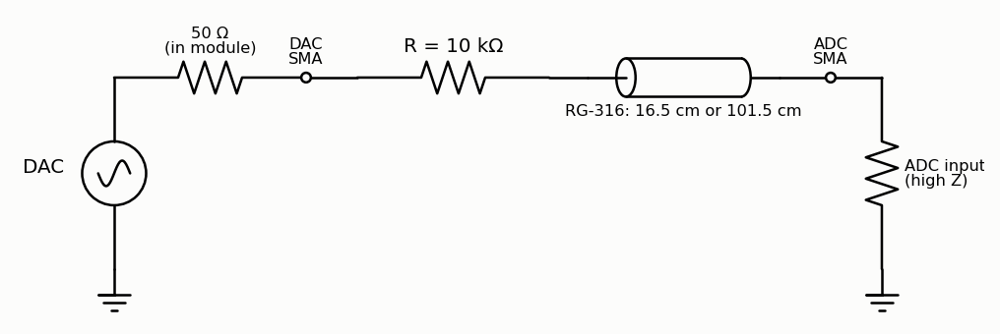

Through a 10 kΩ resistor the cable is no longer a delay line. At these
frequencies it is just a capacitor: C′ × length, about 95 pF per metre for
RG-316, plus the ADC's own input capacitance *C*<sub>in</sub>. Together with
the 10 kΩ it makes a low-pass. The prediction, for *C*<sub>in</sub> between 10
and 20 pF, is a corner at 136–149 kHz with the 101.5 cm cable and 444–617 kHz
with the 16.5 cm one.

- Find each corner as the −45° point of a sweep:
  `python3 lockin.py --sweep 2e4 2e6 -n 60`.
  Since *f*<sub>c</sub> = 1/(2π*RC*), the two corners give two capacitances.
  Their difference, divided by 0.85 m, is C′.
- The short cable's number, minus its 16 pF, is the ADC's *C*<sub>in</sub>.
- If |H| at low frequency is below 1, the ADC's input *resistance* R<sub>in</sub>
  is finite: |H| = R<sub>in</sub>/(R<sub>in</sub> + 10 kΩ).
- **Z₀ from two measurements.** Part 4 measured the delay per metre,
  τ′ = 4.58 ns/m. This measures C′. For a lossless line τ′ = √(L′C′) and
  Z₀ = √(L′/C′), so Z₀ = τ′/C′. Expect about 4.58 ns/m ÷ 95 pF/m = 48 Ω.

### 9.2 RC low-pass and high-pass

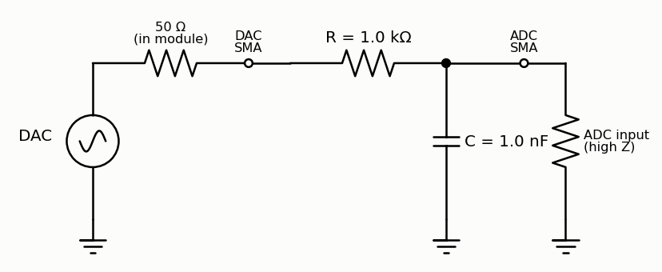
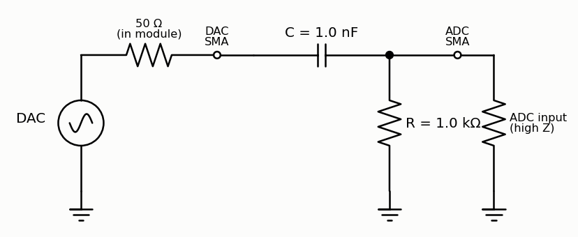

The measurement Part 4 describes. The DAC's 50 Ω adds to the 1 kΩ, so
*f*<sub>c</sub> = 1/(2π × 1050 Ω × 1 nF) = **152 kHz**. The cable and the ADC
add ~30 pF to the low-pass's capacitor, lowering it to 147 kHz. Compare the
magnitude (−3 dB, then −20 dB/decade) and phase (−45° at the corner) with
1/(1 + *jω RC*). The high-pass mirrors it: the corner is again 152 kHz, and
the passband gain is 1000/1050 = 0.95. Above ~5 MHz it droops, as the ~30 pF
starts to shunt the 1 kΩ.

### 9.3 A series LC resonance

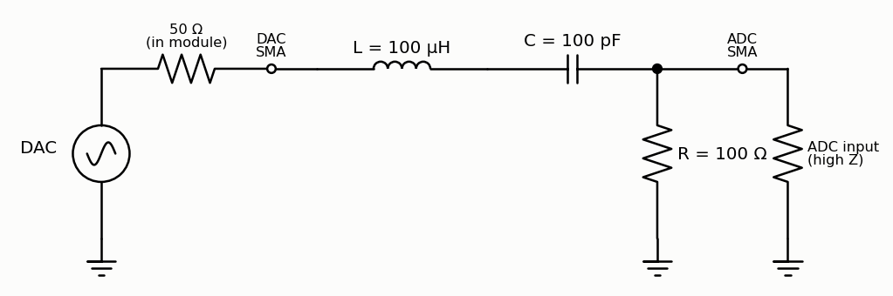

*f*₀ = 1/(2π√(LC)) = **1.59 MHz**. The Q is set by all the resistance in the
loop: √(L/C)/(50 + 100 + ~3 Ω of inductor) = 1000/153 ≈ **6.5**, a 244 kHz
bandwidth. The peak |H| is 100/153 = 0.65. The phase swings from +90° through
0° at *f*₀ to −90°. Sweep `python3 lockin.py --sweep 5e5 5e6 -n 80`, then change
the 100 Ω to 1 kΩ and watch Q fall. An inductor's self-resonance limits how
high this works; small 100 µH chokes are fine to about 5 MHz.

### 9.4 The Q of a quartz crystal

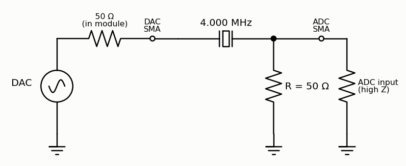

A quartz crystal is an RLC circuit with an absurd Q. For a typical 4 MHz HC-49
crystal, take the motional *C*₁ ≈ 16 fF, *R*₁ ≈ 50 Ω and a shunt
*C*₀ ≈ 5 pF (the *Butterworth–Van Dyke* model). That makes *L*₁ =
1/(ω²*C*₁) ≈ **0.1 H**. Loaded by 50 + 50 Ω of source and load, Q ≈ **16,600**:
a peak only **~240 Hz wide** at 4 MHz, with |H| = 50/150 = 0.33 at the top. Just
above it, *C*₀ cancels the motional arm and the crystal *blocks*: the parallel
resonance, about **6.4 kHz** higher, is a deep notch. Away from both, only
*C*₀'s feedthrough gets through: |H| ≈ ω*C*₀ × 50 Ω ≈ 0.006.

This is where the lock-in shines. Its 12 Hz bandwidth resolves a 240 Hz
peak, and the DDS sets the frequency to 0.012 Hz. The crystal rings up in
2Q/ω ≈ 1.3 ms, much less than one 42 ms average.

```bash
python3 lockin.py --sweep 3.99e6 4.02e6 -n 300 --linear     # find both resonances (100 Hz steps)
python3 lockin.py --sweep 3.9995e6 4.0015e6 -n 200 --linear # then zoom in (10 Hz steps)
```

Fit a Lorentzian to the peak for *f*<sub>s</sub> and Q, and the model to the
whole curve for *R*₁, *L*₁, *C*₁ and *C*₀. One last thing: the frequency you
measure is relative to the Icepi Zero's *own* crystal, which is itself a few
ppm off (Part 4 measured 2.8 ppm against the ADALM2000), about ±11 Hz here.
Every frequency measurement is a comparison between two oscillators.

### 9.5 A diode clipper: symmetry and harmonics

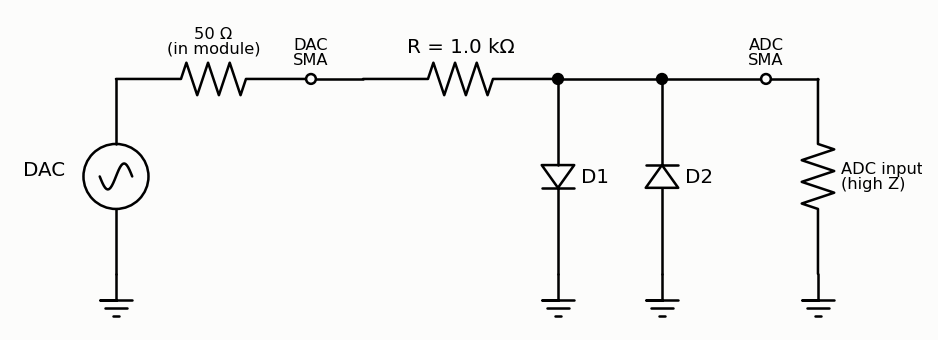

Drive 100 kHz at full amplitude (3.9 V). About 3 mA flows, and the diodes clip
the output at ±0.65 V. Fourier-analysing that clipped sine predicts:

| | DC | 1*f* | 2*f* | 3*f* | 4*f* | 5*f* |
| --- | --- | --- | --- | --- | --- | --- |
| both diodes | 0 | 0.82 V | 0 | 0.26 V | 0 | 0.15 V |
| D1 only (clips the positive side) | −0.93 V | 2.36 V | 0.79 V | 0.13 V | 0.13 V | 0.07 V |

The symmetric clipper makes *only odd harmonics*: it satisfies
*v*(*t* + *T*/2) = −*v*(*t*), and every even Fourier coefficient of such a
function is zero. Remove D2 and the symmetry, the even harmonics and a DC
level all appear.

Measure it with the Part 5–7 SoC and firmware: `fg 100000`, then capture and
FFT on the PC:

```python
import cap_plot, numpy as np
t, code = cap_plot.cap("/dev/ttyUSB0", 3)              # 3.125 MS/s: 31 samples per cycle
v = (code - 126.7) / 25.35
w = np.hanning(len(v))
amp = np.abs(np.fft.rfft((v - v.mean()) * w)) / w.sum() * 2
f = np.fft.rfftfreq(len(v), t[1] - t[0])
```

The baseline to beat: with a plain cable in place of the clipper, the loop's
own harmonics measured −64, −58, −56 and −46 dBc at 2*f* to 5*f* (5*f* =
19 mV). The clipper's 3*f* should be 40 dB above that.

### 9.6 A quarter-wave stub


Hang an open-ended cable off a T at the DAC. A wave travels to the open end
and back. When the round trip is half a period, it returns inverted, and the
stub's input looks like a short circuit: a notch where the stub is a quarter
wavelength long. For 5.0 m of RG-58 (velocity factor 0.66) that is
*f* = 0.66 *c*/(4 × 5 m) = **9.89 MHz**. Its depth is set by the cable's loss:
about −40 dB. Below it the stub is a 505 pF capacitor working against the DAC's
50 Ω: |H| = 0.99 at 1 MHz, 0.78 at 5 MHz.
`python3 lockin.py --sweep 1e5 12e6 -n 120 --linear` finds the notch, and so
the cable's electrical length. It's Part 4's cable measurement done the way RF
engineers do it. (With a 10 m stub the notch moves to 4.95 MHz.)

### 9.7 The speed of sound at 40 kHz

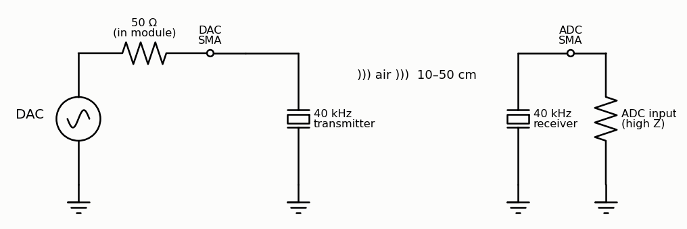

Drive a 40 kHz piezo transmitter (e.g. Murata MA40S4S; up to 20 V<sub>pp</sub>
is allowed, the DAC gives 7.8) directly from the DAC. The matching receiver,
10–50 cm away, goes straight to the ADC: expect tens of millivolts, which the
lock-in reads easily (Part 7). At 20 °C, *c* = 343.4 m/s, so λ = 8.59 mm, and
the phase falls by **41.9° for every millimetre** you move the receiver away.

```bash
python3 lockin.py -f 40000       # slide the receiver along a ruler, 1 mm at a time
```

Unwrap the phase against distance and fit: the slope gives *c* to a few
tenths of a percent. Then warm the air with a hair dryer. Since
*c* ≈ 331.3 + 0.606 *T*(°C) m/s, that is 0.18% per kelvin. A sweep from 36 to
44 kHz shows the transducers' own resonance (Q ≈ 20–30).

### 9.8 An optical link

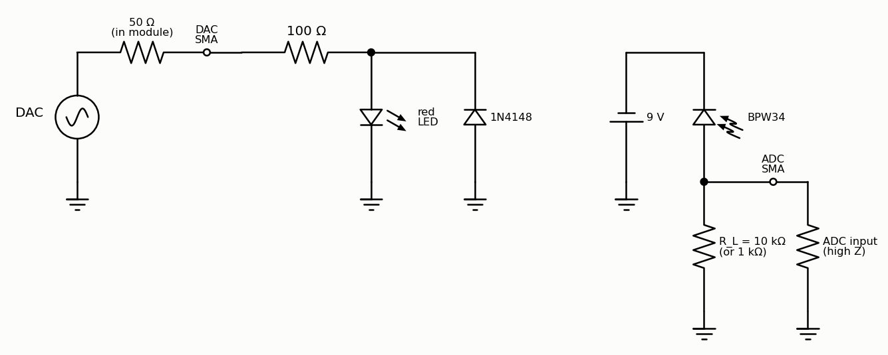

The DAC drives a red LED through 100 Ω (plus its own 50 Ω): 13 mA at the peak.
The LED lights on the positive half of each cycle, which still puts plenty of
signal at the fundamental. The 1N4148 limits the LED's reverse voltage. A
BPW34 photodiode, reverse-biased by a 9 V battery, turns the light into
current, and R<sub>L</sub> into a voltage: tens to hundreds of mV at a few cm.

- **Bandwidth.** The photodiode's capacitance (~15–25 pF at 9 V) plus the
  cable and ADC (~30 pF) against R<sub>L</sub>: with 10 kΩ the corner is about
  **350 kHz**; with 1 kΩ about **3.5 MHz**, for 10× less signal. Sweep both and
  see the gain–bandwidth trade that every photodiode amplifier design is about.
  (See the Photodiode amplifiers project in the OpticsPCBs repository.)
- **Lock-in detection in room light.** Capture with `capture.py`. The room
  lights add a large 120 Hz flicker, and the LED's signal is hard to see.
  The lock-in at 100 kHz ignores the flicker completely. Add 10 kΩ in series
  with the LED to cut its light 100×, and the lock-in still finds it.

### 9.9 Feedback control of an RC plant

Use the RC low-pass of 9.2 with R = 1 kΩ and C = **1 µF** (τ = 1 ms) as a
"plant". The goal: hold the capacitor at a setpoint voltage by adjusting the
DAC, with the controller in the FPGA. A PI controller is a few lines of
Verilog: `error = setpoint - sample`, `integral += error`,
`dac_d <= 128 + Kp*error + Ki*integral`. Step the setpoint and capture the
response with `loopback.v`'s recording logic. Then do the arithmetic Part 3
set up: the loop has 6 samples (240 ns) of latency, negligible against a 1 ms
plant. So change C to 1 nF (τ = 1 µs), push the gains up, and find where the
latency makes the loop ring and then oscillate. (Part 3's oscillator is the
extreme case.)

### 9.10 Your clock against a reference


A GPS-disciplined 10 MHz reference (see the GPSDO projects elsewhere in these
repositories) goes into the ADC through a 10 dB attenuator and a 50 Ω
termination. Run `lockin.v` at 10 MHz; its DAC isn't connected to anything.
X and Y rotate at the difference between the reference and the Icepi Zero's
crystal: a few ppm, i.e. tens of Hz, too fast for a 42 ms average. So first
tune the lock-in to the reference. The Icepi Zero's crystal ran 2.8 ppm *slow*
against the ADALM2000, so ask for 10 MHz × (1 + 2.8 × 10⁻⁶) to get close to a
true 10 MHz, and refine until the phasor turns slowly. The residual rotation, followed for
minutes, gives the crystal's offset to parts per *billion*. Put a finger on
the Icepi Zero's oscillator and watch its temperature coefficient happen.

---

## Appendix A: Troubleshooting

| symptom | cause and fix |
| --- | --- |
| `openFPGALoader` can't find the board, or `Permission denied` | the udev rule and group membership from Part 0 step 3; replug the board afterwards |
| `/dev/ttyUSB0` vanishes while loading a bitstream | normal: the same FT231X chip does JTAG and serial. Close serial programs before loading; the port comes back afterwards |
| a Python script gets no bytes back | wrong bitstream loaded, or a terminal program still has the port open. For `capture.v`, remember the junk byte on open (Part 3) |
| nextpnr: `IO 'x' is unconstrained in LPF` | a port name in your Verilog has no `LOCATE` line in `icepi_adda.lpf` (check spelling and `[n]` indices) |
| nextpnr: `FAIL at 50.00 MHz` | some path has too much logic for 20 ns: register an intermediate result (pipeline it), as `lockin.v` does |
| the DAC output sits at full scale before loading | normal: unconfigured FPGA pins float high |
| capture shows a flat line at code ~127 | nothing connected to the ADC input (it reads 0 V) |
| capture shows codes stuck at 0 or 255 | input beyond ±5 V, or the module not powered / plugged in backwards |
| LiteX build: `No module named 'litex'` | you sourced OSS CAD Suite's `environment`, which puts its own Python first. `export PATH=/usr/bin:$PATH` ([`README.md`](README.md)) |
| firmware: `undefined reference to 'atoi'` (or `sqrtf`, `strtok`) | the SoC was built without `--libc-mode full` |
| firmware: `undefined reference to '__floatdisf'` | converting a 64-bit integer to `float`; LiteX's runtime library lacks it. Shift down to 32 bits first, as `main.c` does |
| `litex_term` exits with `Lost connection to the device` | a bitstream was loaded while it was running. Load first, then start `litex_term` |
| Linux: `unhandled signal 11 ... in ld-linux-riscv32-ilp32.so.1`, then `Attempted to kill init!` | a glibc root filesystem from Buildroot 2026.02; use the musl `icepi_adda_defconfig` of Part 8 |
| Linux can't unpack its root file system, or can't find `/init` | one likely cause: `rv32.dtb` still records an old `rootfs.cpio.gz`'s size. Re-run `make_linux.py` |
| `insmod: ... Invalid module format` | `adda.ko` was built against a different kernel than the one running. Rebuild it in `linux/driver/` |
| characters go missing when you paste into the board's console | its UART receive buffer is small. Paste slowly, or a line at a time |
| `install-sd.sh` says `missing /boot/sd/mbr.bin` | the board was booted from `images_adda`, not `images_install` (8.7) |
| the BIOS can't boot from the card | no card, or no `boot.json` on its first (FAT) partition. Run 8.7's installer |
| Linux stops at `Waiting for root device /dev/mmcblk0p2...` | the card has no second partition, or isn't seated. From a serial-booted system, `ls /dev/mmcblk0*` shows what Linux sees |
| the flashed board boots the RAM-disk system instead of the card | `litex_term` was started with `--images`, so it answered the BIOS's serial-boot request. Start it without |
| a PLL design does nothing | the logic waits for `locked`. Check the `ecppll` numbers, and that the VCO is within 400–800 MHz |

## Appendix B: How these tutorials were tested

The development setup had an ADALM2000 ("M2k") USB instrument wired
permanently to the stack: the DAC output to scope channel 1, and the M2k's
signal generator W1 to the ADC input. Everything was driven from Python through
ADI's `libm2k`. The instructor's scripts that made every figure here, from live
captures, are in [`IcepiZeroADCDAC_tutorials/tools/`](IcepiZeroADCDAC_tutorials/tools/)
(`m2k.py` is the instrument wrapper, `fig_*.py` one per figure, and the raw data
is in `data/`).

- **DAC calibration**: the sawtooth, averaged over many periods at 100 MS/s and
  fitted with a straight line against code.
- **ADC calibration**: W1 stepped from −5 V to +5 V in 0.5 V steps, 16384
  samples averaged at each.
- **ADC quality**: sine captures at 1.1, 3.3 and 10.1 MHz, each fitted with a
  four-parameter least-squares sine. The residual was 0.46–0.62 codes rms, 5
  captures out of 5 at each frequency.
- **Lock-in**: the pass-band sweep above, and a 1 MHz ↔ 2.5 MHz frequency switch
  in simulation.

Three traps worth knowing if you script an M2k yourself. (1) The M2k's arbitrary
waveform generator silently truncates a cyclic buffer to a multiple of 4
samples, which leaves a phase jump each time it wraps. That showed up here as a
one-sample glitch in about half of the ADC captures until the buffer lengths
were rounded to a multiple of 8. (2) By default `libm2k` queues captures in
kernel buffers, so `getSamples()` can return data from *before* your last
change. `setKernelBuffersCount(1)` fixes it. Before that fix, an amplitude
sweep appeared to lag by two steps. (3) `libm2k` is not on PyPI for Linux, and its
current version needs libiio ≥ 0.24 (Ubuntu 22.04 ships 0.23). Both were built
from source into `~/.local` (libiio v0.25, then libm2k v0.9.1 with
`-DENABLE_PYTHON=ON -DINSTALL_UDEV_RULES=OFF`, swig from `pip install swig`).

The LiteX and Linux parts were tested the same way, with the helpers in
`tools/`: `serialboot.py` (litex_term's upload code without its keyboard
console, so it runs from a script), `console.py` (the BIOS and firmware
prompts), `linux_shell.py` (logs in and runs commands on the board) and
`test_linux.py` (the Part 8 checks, with the M2k measuring the DAC).

- **LiteX peripherals**: every register through the BIOS's `mem_write` and
  `mem_read`; the amplitude register stepped 255 → 0 and checked on the M2k to
  within 1% of full scale; the four waveforms; free-running and triggered captures; lock-in
  readings against a 2 V input and down to 1 mV.
- **Linux**: `/dev/mem` on both the 2022 images and ours; every sysfs file;
  `sweep.sh` and `dump.sh`; a module reloaded over the serial console.
- **Flash and SD card** (8.7, a 64 GB SDXC card): the installer, end to end,
  twice (the second time with the final scripts); the boot from flash and card
  timed from the serial log three times, with `openFPGALoader -r` as t = 0,
  and the RAM-disk boot timed the same way; the trimmed start-up, and the
  driver and `sweep.sh` on the card-booted system.

**With a cable from the DAC to the ADC** (two RG-316 cables, 101.5 cm and
16.5 cm, and the M2k disconnected): `loopback.v` in all four modes with both
cables; lock-in sweeps from 100 kHz to 24.9 MHz in 100 kHz steps, 3 times with
each cable (the delays repeat to 0.05 ns); a 5-minute drift run (< 0.15 ns);
the firmware's `li` and `sweep` through the cable; and the oscillator exercise.
Then, for "A faster DAC", with the 16.5 cm cable: 3 new sweeps with `lockin.v`,
which repeat the earlier ones to 0.2% in amplitude and 0.13° in phase; 3 with
`lockin_pll.v` to 24.9 MHz; and 3 more from 25.1 to 49.9 MHz. The raw data
are in `data/cable_*.npz` and `data/loopback_*.npz` (`tools/cable_sweep.py`,
`tools/fig_cable.py`, `tools/fig_loopback.py`, `tools/fig_pll.py`).

**Not tested:**

- **Part 0's Apio / VS Code route**, as intended.
- **Measuring a filter** (Part 4): no filter was at hand. The cable
  measurement uses the same code and procedure.
- **The LED indicators of Parts 3 and 4.** Only the Part 1 counter was watched
  (it runs MSB-left with the USB connectors down). The pins and polarity are the
  ones [`README.md`](README.md) confirmed on this board.
- **`sine_pll.v` on a scope** (the M2k was disconnected by then). The same
  PLL, DDS and DAC timing were measured through `lockin_pll.v`.
- **A true power-on boot.** The boot times start at `openFPGALoader -r`,
  which makes the FPGA reload itself from flash as it does at power-up.
- **The open-ended "Try this" suggestions**, except the loop oscillator and the
  lock-in above 12.5 MHz, which were.
- **Part 9's experiments.** Their predictions are calculations, not
  measurements. Only the baseline for 9.5 (the loop's own harmonics) was
  measured.
