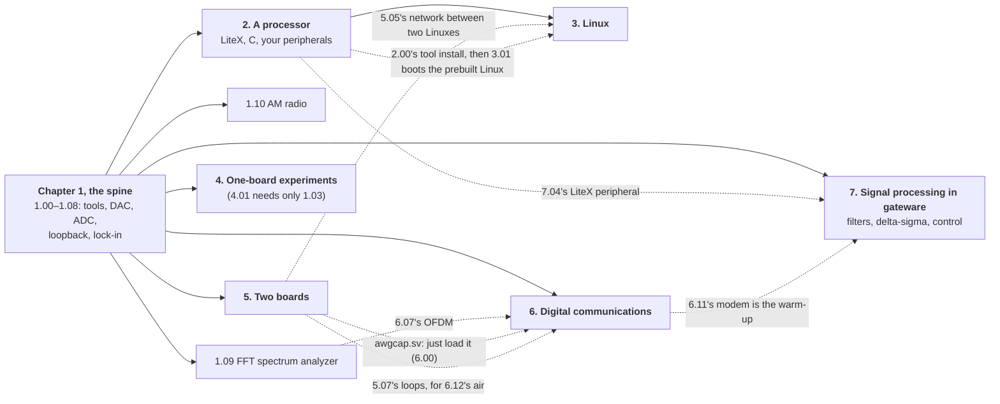

# FPGA tutorials: an ADC and a DAC on an Icepi Zero

A hands-on tutorial for a junior-level physics electronics lab. You should
know basic analog and digital electronics and a little Fourier analysis. You
do **not** need to have seen an [FPGA](https://en.wikipedia.org/wiki/Field-programmable_gate_array) or a hardware description language
before.

You will:

* configure the logic inside an FPGA to **blink lights**, **make analog
  waveforms** and **capture analog signals** at 25 million samples a second;
* build a **[lock-in amplifier](https://en.wikipedia.org/wiki/Lock-in_amplifier)** and use it as a simple [network analyzer](https://en.wikipedia.org/wiki/Network_analyzer_(electrical)), and
  a **[spectrum analyzer](https://en.wikipedia.org/wiki/Spectrum_analyzer)**, with an FFT computed in logic;
* build an **AM radio**, transmitter and receiver, and hear it on a real radio
  and on your laptop;
* turn the same FPGA into a **[RISC-V](https://en.wikipedia.org/wiki/RISC-V) computer** and write C programs that run
  on it and talk to your hardware;
* boot **Linux** on that computer, and read the [ADC](https://en.wikipedia.org/wiki/Analog-to-digital_converter) as an ordinary file;
* and then, if you like, keep going: crystals, resonators, the speed of sound,
  [time transfer](https://en.wikipedia.org/wiki/Time_transfer) between two boards (as national labs do it), modern
  digital communications (OFDM, at 56 Mbit/s through a cable), and a radio
  link.

Everything is open source, from the FPGA tools to the instruments: an
open-source function generator, digitizer (a slow oscilloscope), lock-in
amplifier, network analyzer, FFT spectrum analyzer, AM transmitter and
software-defined radio receiver, modems, and a time-transfer link, each a
page or two of SystemVerilog and Python that you can read and change.
[5.08](tutorial/5_08_more_hardware.md#instruments-for-a-physics-lab) lists more
that physics labs usually buy: a [Pound–Drever–Hall](https://en.wikipedia.org/wiki/Pound%E2%80%93Drever%E2%80%93Hall_technique) laser lock, a
coincidence counter, shot-noise and Johnson-noise measurements.

Most people will get as far as the lock-in amplifier
([1.08](tutorial/1_08_lockin.md#108-a-lock-in-amplifier)), and that's a fine
place to stop. Each later chapter builds on the earlier ones, but you can
skip around inside Chapters 4 and 5. The hardware is about $120:
[0.00](tutorial/0_00_the_hardware.md#000-the-hardware) has the list, and
[Appendix A](tutorial/A_why_this_hardware.md#appendix-a-why-this-hardware)
the prices.

**Start here: [0.00 The hardware](tutorial/0_00_the_hardware.md#000-the-hardware).**

## What depends on what

Nothing after Chapter 1 needs all of Chapter 1, and nothing needs Linux
except the two pages that use it. The spine is 1.00–1.08: the tools, a
counter, the [DAC](https://en.wikipedia.org/wiki/Digital-to-analog_converter), a sine, the ADC into Python, fast captures, the loopback,
and the lock-in. After that, go where you like:

The shortest paths:

- **The lock-in amplifier:** 1.00–1.08. (1.04 is optional; 1.09 and 1.10 are desserts.)
- **Digital communications (Chapter 6):** the spine, then [6.00](tutorial/6_00_digital_communications.md#600-digital-communications-hardware-defined-radio). It uses one
  design from Chapter 5, `awgcap.sv`, which you load without reading the chapter. One board is enough.
- **Linux on the FPGA:** 1.00–1.01 (load a bitstream), [2.00](tutorial/2_00_a_processor_on_the_fpga.md#200-a-processor-on-the-fpga) (install LiteX), then
  [3.01](tutorial/3_01_booting_linux.md#301-booting-linux) boots the prebuilt images. Understanding the driver ([3.02](tutorial/3_02_a_driver.md#302-a-driver)) wants 2.03–2.05;
  building it all yourself ([3.03](tutorial/3_03_building_linux.md#303-building-linux-yourself)) wants Chapter 2.
- **Filters, delta-sigma and control (Chapter 7):** the spine, then [7.00](tutorial/7_00_signal_processing_in_gateware.md#700-signal-processing-in-gateware); 7.04 alone needs Chapter 2's tools.
- **The experiments (Chapter 4):** the spine; each page says which instrument it uses.
- **Two boards (Chapter 5):** the spine and a second board; only the network part of
  [5.05](tutorial/5_05_fsk_modem.md#505-a-modem) needs Chapter 3.

Every chapter opener (2.00, 3.00, 4.00, 5.00, 6.00) starts with "What you need
first", so you can check before you start.

## Related reading

- **[learnSDR](https://github.com/gallicchio/learnSDR)**, this author's video course in software-defined radio with
  GNU Radio: Chapter 6 links its lessons.
- **[PySDR](https://pysdr.org)**, Marc Lichtman's free online textbook of SDR and DSP in Python. It is
  better than these pages at the theory and the Python, and it covers what this tutorial
  can't (link budgets, beamforming, real SDR hardware); read it alongside Chapter 6. What
  this tutorial has that it doesn't is that the hardware is yours, down to the clock.
- **[MIT's coffee-can radar course](https://ocw.mit.edu/courses/res-ll-003-build-a-small-radar-system-capable-of-sensing-range-doppler-and-synthetic-aperture-radar-imaging-january-iap-2011/)**, the model for the radar chapter sketched in [6.13](tutorial/6_13_more_ideas.md#613-more-ideas-and-a-radar-chapter).

## Contents

**0. Getting started**

- [0.00 The hardware](tutorial/0_00_the_hardware.md#000-the-hardware)
- [0.01 How to use this tutorial](tutorial/0_01_how_to_use_this_tutorial.md#001-how-to-use-this-tutorial)

**1. Logic in [SystemVerilog](https://en.wikipedia.org/wiki/SystemVerilog), up to a lock-in amplifier and an FFT**

- [1.00 Circuits from code](tutorial/1_00_circuits_from_code.md#100-circuits-from-code)
- [1.01 A counter on the LEDs](tutorial/1_01_led_counter.md#101-a-counter-on-the-leds)
- [1.02 A sawtooth from the DAC](tutorial/1_02_dac_sawtooth.md#102-a-sawtooth-from-the-dac)
- [1.03 A sine: direct digital synthesis](tutorial/1_03_dac_sine.md#103-a-sine-direct-digital-synthesis)
- [1.04 The ADC on the LEDs](tutorial/1_04_adc_on_the_leds.md#104-the-adc-on-the-leds)
- [1.05 ADC samples to Python](tutorial/1_05_adc_to_python.md#105-adc-samples-to-python)
- [1.06 Fast captures](tutorial/1_06_fast_capture.md#106-fast-captures)
- [1.07 Closing the loop: the DAC talks to the ADC](tutorial/1_07_closing_the_loop.md#107-closing-the-loop-the-dac-talks-to-the-adc)
- [1.08 A lock-in amplifier](tutorial/1_08_lockin.md#108-a-lock-in-amplifier)
- [1.09 A spectrum analyzer](tutorial/1_09_spectrum_analyzer.md#109-a-spectrum-analyzer)
- [1.10 An AM radio](tutorial/1_10_am_radio.md#110-an-am-radio)

**2. A RISC-V processor, and C**

- [2.00 A processor on the FPGA](tutorial/2_00_a_processor_on_the_fpga.md#200-a-processor-on-the-fpga)
- [2.01 A CPU and its BIOS](tutorial/2_01_a_cpu_and_its_bios.md#201-a-cpu-and-its-bios)
- [2.02 C on the CPU](tutorial/2_02_c_on_the_cpu.md#202-c-on-the-cpu)
- [2.03 A function-generator peripheral](tutorial/2_03_function_generator_peripheral.md#203-a-function-generator-peripheral)
- [2.04 A capture peripheral](tutorial/2_04_capture_peripheral.md#204-a-capture-peripheral)
- [2.05 A lock-in peripheral](tutorial/2_05_lockin_peripheral.md#205-a-lock-in-peripheral)
- [2.06 The registers from the laptop](tutorial/2_06_registers_from_the_laptop.md#206-the-registers-from-the-laptop)

**3. Linux**

- [3.00 Linux on the FPGA](tutorial/3_00_linux_on_the_fpga.md#300-linux-on-the-fpga)
- [3.01 Booting Linux](tutorial/3_01_booting_linux.md#301-booting-linux)
- [3.02 A driver](tutorial/3_02_a_driver.md#302-a-driver)
- [3.03 Building Linux yourself](tutorial/3_03_building_linux.md#303-building-linux-yourself)
- [3.04 Booting from an SD card](tutorial/3_04_booting_from_sd.md#304-booting-from-an-sd-card)

**4. More experiments with one board**

- [4.00 One-board experiments](tutorial/4_00_one_board_experiments.md#400-one-board-experiments)
- [4.01 A faster DAC: PLLs](tutorial/4_01_a_faster_dac.md#401-a-faster-dac-plls)
- [4.02 RC and LC circuits](tutorial/4_02_rc_and_lc_circuits.md#402-rc-and-lc-circuits)
- [4.03 The Q of a quartz crystal](tutorial/4_03_quartz_crystal.md#403-the-q-of-a-quartz-crystal)
- [4.04 Harmonics: a diode clipper](tutorial/4_04_harmonics.md#404-harmonics-a-diode-clipper)
- [4.05 A quarter-wave stub](tutorial/4_05_quarter_wave_stub.md#405-a-quarter-wave-stub)
- [4.06 The speed of sound at 40 kHz](tutorial/4_06_speed_of_sound.md#406-the-speed-of-sound-at-40-khz)
- [4.07 An optical link](tutorial/4_07_optical_link.md#407-an-optical-link)
- [4.08 Feedback control of an RC plant](tutorial/4_08_feedback_control.md#408-feedback-control-of-an-rc-plant)
- [4.09 Your crystal against a reference](tutorial/4_09_your_crystal.md#409-your-crystal-against-a-reference)
- [4.10 More ideas for one board](tutorial/4_10_more_ideas.md#410-more-ideas-for-one-board)

**5. Two boards**

- [5.00 Two boards on one laptop](tutorial/5_00_two_boards.md#500-two-boards-on-one-laptop)
- [5.01 Two clocks](tutorial/5_01_two_clocks.md#501-two-clocks)
- [5.02 Warming a crystal](tutorial/5_02_warming_a_crystal.md#502-warming-a-crystal)
- [5.03 What time is it over there?](tutorial/5_03_time_transfer.md#503-what-time-is-it-over-there)
- [5.04 Oscillators that listen to each other](tutorial/5_04_coupled_oscillators.md#504-oscillators-that-listen-to-each-other)
- [5.05 A modem](tutorial/5_05_fsk_modem.md#505-a-modem)
- [5.06 The modem against noise](tutorial/5_06_modem_and_noise.md#506-the-modem-against-noise)
- [5.07 A radio link](tutorial/5_07_radio_link.md#507-a-radio-link)
- [5.08 With a little more hardware](tutorial/5_08_more_hardware.md#508-with-a-little-more-hardware)

**6. Digital communications (Hardware Defined Radio)**

- [6.00 Digital communications (Hardware Defined Radio)](tutorial/6_00_digital_communications.md#600-digital-communications-hardware-defined-radio)
- [6.01 Eye diagrams and pulse shaping](tutorial/6_01_eye_diagrams.md#601-eye-diagrams-and-pulse-shaping)
- [6.02 PSK and QPSK: finding the clock and the carrier](tutorial/6_02_psk_and_qpsk.md#602-psk-and-qpsk-finding-the-clock-and-the-carrier)
- [6.03 QAM: more bits per symbol](tutorial/6_03_qam.md#603-qam-more-bits-per-symbol)
- [6.04 MSK and GMSK: constant envelope](tutorial/6_04_msk_and_gmsk.md#604-msk-and-gmsk-constant-envelope)
- [6.05 The channel: sounding it, and equalizing it](tutorial/6_05_the_channel.md#605-the-channel-sounding-it-and-equalizing-it)
- [6.06 Spread spectrum, the GPS way](tutorial/6_06_spread_spectrum.md#606-spread-spectrum-the-gps-way)
- [6.07 OFDM: the triumph of physics over math](tutorial/6_07_ofdm.md#607-ofdm-the-triumph-of-physics-over-math)
- [6.08 Shannon's limit, and how far from it you are](tutorial/6_08_shannons_limit.md#608-shannons-limit-and-how-far-from-it-you-are)
- [6.09 Error-correcting codes](tutorial/6_09_error_correcting_codes.md#609-error-correcting-codes)
- [6.10 Chirps, Zadoff–Chu and LoRa: ranging, and radar on a cable](tutorial/6_10_chirps_and_lora.md#610-chirps-zadoffchu-and-lora-ranging-and-radar-on-a-cable)
- [6.11 The modem in the FPGA](tutorial/6_11_the_modem_in_the_fpga.md#611-the-modem-in-the-fpga)
- [6.12 On the air: whispers, and how far they carry](tutorial/6_12_on_the_air.md#612-on-the-air-whispers-and-how-far-they-carry)
- [6.13 More ideas, and a radar chapter](tutorial/6_13_more_ideas.md#613-more-ideas-and-a-radar-chapter)

**7. Signal processing in gateware**

- [7.00 Signal processing in gateware](tutorial/7_00_signal_processing_in_gateware.md#700-signal-processing-in-gateware)
- [7.01 FIR filters: the sliding dot product](tutorial/7_01_fir_filters.md#701-fir-filters-the-sliding-dot-product)
- [7.02 IIR filters: feedback, and an RC in one line](tutorial/7_02_iir_filters.md#702-iir-filters-feedback-and-an-rc-in-one-line)
- [7.03 A filter you can load](tutorial/7_03_a_filter_you_can_load.md#703-a-filter-you-can-load)
- [7.04 The filter as a LiteX peripheral](tutorial/7_04_the_filter_as_a_litex_peripheral.md#704-the-filter-as-a-litex-peripheral)
- [7.05 Trading speed for bits](tutorial/7_05_trading_speed_for_bits.md#705-trading-speed-for-bits)
- [7.06 Control at the speed of the cable](tutorial/7_06_control.md#706-control-at-the-speed-of-the-cable)
- [7.07 Bigger ideas: NMR, MRI and qubits](tutorial/7_07_bigger_ideas.md#707-bigger-ideas-nmr-mri-and-qubits)

**Appendices**

- [Appendix A. Why this hardware?](tutorial/A_why_this_hardware.md#appendix-a-why-this-hardware)
- [Appendix B. Troubleshooting](tutorial/B_troubleshooting.md#appendix-b-troubleshooting)
- [Appendix C. How this tutorial was tested](tutorial/C_how_it_was_tested.md#appendix-c-how-this-tutorial-was-tested)

## What's in this repository

| folder | what |
| --- | --- |
| [`tutorial/`](tutorial/) | the tutorial, one page per topic, in order |
| [`src/`](src/) | everything you build: [`verilog/`](src/verilog/) (Chapters 1 and 4), [`riscv/`](src/riscv/) (Chapter 2), [`linux/`](src/linux/) (Chapter 3), [`twoboard/`](src/twoboard/) (Chapter 5, and 6.11's `qpsk_modem.sv` and 6.12's `ddc.sv`), [`comms/`](src/comms/) (Chapter 6's Python) |
| [`adapter_board/`](adapter_board/) | the adapter PCB between the Icepi Zero and the converter module: KiCad files and gerbers, ready to order |
| [`dev/`](dev/) | how the tutorial was made and tested: measurement scripts, raw data, and the log of the Claude Code sessions that wrote it |
| [`LICENSE`](LICENSE), [`LICENSES/`](LICENSES/) | which licence covers what, and their full texts |
| `tools/` | not in the repository: you make it in [1.00](tutorial/1_00_circuits_from_code.md#100-circuits-from-code), and the tools you install go there. Git ignores it |

Every design, script, figure and number in the tutorial comes from the real
hardware; [Appendix C](tutorial/C_how_it_was_tested.md) says how.

## Licence

The tutorial (text, figures and data) is under [CC BY 4.0](LICENSES/CC-BY-4.0.txt), the
code under [MIT](LICENSES/MIT.txt), the Linux driver under
[GPL-2.0](LICENSES/GPL-2.0-only.txt) and the adapter board under
[CERN-OHL-P-2.0](LICENSES/CERN-OHL-P-2.0.txt). The prebuilt Linux images keep their
components' licences. [LICENSE](LICENSE) has the details.

*By [Jason Gallicchio](mailto:jason@hmc.edu) (jason@hmc.edu), Physics Professor at
Harvey Mudd College, written along with Claude (Opus 5.5 and Fable 5.1), which also
ran every measurement: Appendix C says how.* I (Jason) wrote more of the very early
stuff and then got carried away when I let Claude take over, 
eventually pushing it to write my dream tutorial.
After a long weekend of editing and prompting, there's suddenly a two or three-semester course here.
See [dev/CLAUDE_CODE_CHAT.md](dev/CLAUDE_CODE_CHAT.md) for most of the chat.

*Dedicated to the memory of Brian Bryce's years at Harvey Mudd, where he showed a department that open tools and open hardware are how you do interesting physics and engineering without asking for anyone's permission or spending anyone's money. He isn't gone, just elsewhere, and this is the kind of thing he'd have liked.*
