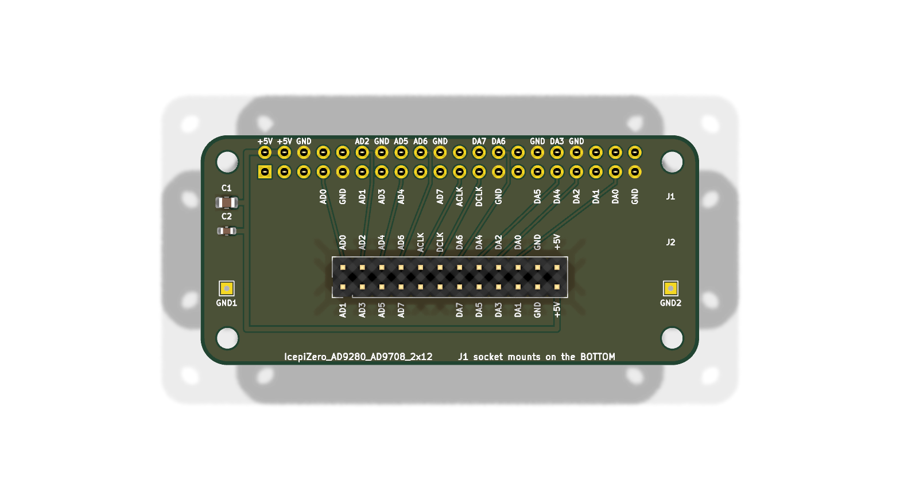

# The adapter board

A passive 65 × 30 mm board that connects an Icepi Zero's 40-pin header to the
AD9280/AD9708 converter module with a 2×12 header and SMA connectors (the one in
the tutorial's photo).

## Ordering it

Upload `IcepiZero_AD9280_AD9708_2x12-gerbers.zip` to a PCB maker such as
[JLCPCB](https://jlcpcb.com/), keep the defaults (2 layers, 1.6 mm, any
colour), and ask for as many boards as you need. Five cost about $2 plus
shipping.

Then solder on:

| part | what | where |
| --- | --- | --- |
| J1 | 2×20 female socket, 2.54 mm | on the **bottom**: it takes the Icepi Zero's 40-pin header |
| J2 | 2×12 male header, 2.54 mm | on the top, pins up: the module's socket plugs onto it |
| C1, C2 | 10 µF (0805) and 100 nF (0603) capacitors | the module's 5 V supply; optional |
| GND1, GND2 | plated holes | for a wire to the module's own ground, if you want a better ground return than the headers give |

## Plugging it together

The adapter has the Icepi Zero's shape, and the mounting holes of the two line
up. Plug the Icepi Zero in so that they do. **The wrong way round puts 5 V on
FPGA pins.**

The module goes on top. Every pin of both connectors is named on the
silkscreen, with the same names the module uses (`AD0`...`AD7` and `ACLK` for the
ADC, `DA0`...`DA7` and `DCLK` for the DAC), so line the module's labels up with
J2's.

## Files

The KiCad 10 project (`.kicad_pro`, `.kicad_sch`, `.kicad_pcb`), the schematic
as a PDF, the gerbers, a picture, and the pin map:

| module pin | design name | Icepi Zero header pin | Raspberry Pi name | ECP5 ball |
| --- | --- | --- | --- | --- |
| AD0 ... AD7 | `adc_d[0]` ... `adc_d[7]` | 7, 11, 12, 13, 15, 16, 18, 19 | GPIO4, 17, 18, 27, 22, 23, 24, 10 | R1, R3, N4, P3, P2, M2, L1, L2 |
| ACLK | `adc_clk` | 21 | GPIO9 | J1 |
| DCLK | `dac_clk` | 23 | GPIO11 | G2 |
| DA7 ... DA0 | `dac_d[7]` ... `dac_d[0]` | 24, 26, 29, 31, 32, 33, 35, 37 | GPIO8, 7, 5, 6, 12, 13, 19, 26 | H2, G1, E1, F3, J3, E3, E4, D4 |

The pin assignment stays off the six Raspberry Pi GPIOs that a real Pi can't
lend out (the HAT ID pins, I2C1 with its fixed pull-ups, and the serial
console), so the same adapter and module also plug into a Raspberry Pi, for a
much slower version of the same experiments.

The boards were drawn by a script, and the `.kicad_pcb` files are the source
of truth. The gerbers were plotted on 2026-09-14; plot new ones with KiCad
(*File → Fabrication Outputs*) if you change anything.
