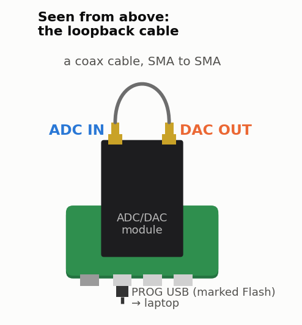

<!-- nav -->
[← Front page](../README.md) &emsp;&emsp;&emsp; **[Contents](../README.md#contents)** &emsp;&emsp;&emsp; [0.01 How to use this tutorial →](0_01_how_to_use_this_tutorial.md#001-how-to-use-this-tutorial)

# 0.00 The hardware

Three boards, stacked: an [FPGA](https://en.wikipedia.org/wiki/Field-programmable_gate_array) board at the bottom, a converter module at the
top, and a small passive adapter between them.

| board | what it is |
| --- | --- |
| **[Icepi Zero](https://github.com/cheyao/icepi-zero)** | A Lattice **ECP5 LFE5U-25F** FPGA on a Raspberry-Pi-Zero-sized board: a 50 MHz crystal oscillator, 5 white LEDs, 2 buttons, 32 MB of SDRAM, a micro-SD slot, a mini-HDMI socket and three USB-C ports. Use the USB-C marked **Flash** (the PROG port). Its FT231X chip does two jobs: it loads designs into the FPGA, and it is a serial port between the FPGA and your laptop. (The HDMI socket and the other two USB-C ports go straight to FPGA pins; [3.04](3_04_booting_from_sd.md#a-computer-of-its-own) says what they could do.) |
| **"AD9280 AD9708 Data Acquisition Board"** | An **[AD9280](https://www.analog.com/en/products/ad9280.html)** [ADC](https://en.wikipedia.org/wiki/Analog-to-digital_converter) (8 bits, up to 32 MS/s) and an **[AD9708](https://www.analog.com/en/products/ad9708.html)** [DAC](https://en.wikipedia.org/wiki/Digital-to-analog_converter) (8 bits, up to 125 MS/s), each with an op-amp front end, an SMA connector, and a potentiometer you can leave alone. Get the version with a **2×12** pin header and SMA connectors, the one in the photo. |
| **[The adapter](../adapter_board/)** | A passive board you order yourself (about $2 for five). The Icepi Zero's 40-pin header plugs into its bottom, the module plugs into its top, and its silkscreen names every pin. |

The [`adapter_board/`](../adapter_board/) folder has the adapter's KiCad files
and gerbers, ready to order, and says how to put it together.

> [!WARNING]
> **Plug the module in the right way round.** The adapter is the same shape as
> the Icepi Zero, and their mounting holes line up. The wrong way round puts
> 5 V on FPGA pins, which they do not survive. The
> [adapter's page](../adapter_board/) shows how the module goes in.

> [!WARNING]
> **Keep the ADC's input between −5 V and +5 V.**

### Which SMA is which

The module's SMA connectors aren't labelled. Hold the stack with its USB
connectors toward you: **ADC IN is on the left, and DAC OUT on the right.**
(The module's `ACLK` and `DCLK` pins, and the adapter's silkscreen, agree.)
Every page that connects anything but the loopback cable has a picture like
this one, drawn the same way:

## What the converters can do

Measured on these boards ([Appendix C](C_how_it_was_tested.md) says how):

| | DAC (output connector) | ADC (input connector) |
| --- | --- | --- |
| bits | 8 (codes 0–255) | 8 (codes 0–255) |
| sample rate used here | 50 MS/s (100 MS/s in [4.01](4_01_a_faster_dac.md#401-a-faster-dac-plls)) | 25 MS/s |
| range | code 0 → −3.95 V, code 255 → +3.88 V | −5.0 V → code 0, +5.06 V → code 255 |
| one code (LSB) | 30.7 mV | 39.5 mV |
| conversion | V = 0.0307 × code − 3.95 | code = 126.7 + 25.35 × V |
| quality | harmonics at least 46 dB below a 1 MHz tone | 7.1 effective bits at 1–3 MHz |

The DAC was measured into a 1 MΩ oscilloscope input. With a cable straight
from the DAC to the ADC, ADC code = 0.776 × DAC code + 27.5, and a change at
the DAC shows up at the ADC 6 samples (240 ns) later (you'll measure both in
[1.07](1_07_closing_the_loop.md#107-closing-the-loop-the-dac-talks-to-the-adc)). Each module is a little different: the gains
of the three tested here differ by up to 0.7%.

## What else you need

| for | what |
| --- | --- |
| everything | a laptop (Linux, macOS or Windows) and a USB-C cable |
| from [1.02](1_02_dac_sawtooth.md#102-a-sawtooth-from-the-dac) on | an oscilloscope helps a lot. A USB instrument such as the ADALM2000 is plenty |
| from [1.04](1_04_adc_on_the_leds.md#104-the-adc-on-the-leds) on | a coax cable from the DAC output to the ADC input, SMA to SMA. The measurements here used RG-316, 16.5 cm and 101.5 cm long. A function generator is useful but not essential |
| [3.04](3_04_booting_from_sd.md#304-booting-from-an-sd-card) | a micro-SD card, 1 GB or more (it will be erased) |
| Chapter 4 | a few resistors, capacitors and other parts, listed in each section |
| Chapter 5 | a second complete set of boards, and a second cable |

<!-- nav -->
[← Front page](../README.md) &emsp;&emsp;&emsp; **[Contents](../README.md#contents)** &emsp;&emsp;&emsp; [0.01 How to use this tutorial →](0_01_how_to_use_this_tutorial.md#001-how-to-use-this-tutorial)

<!-- author -->
Jason Gallicchio, jason@hmc.edu, Harvey Mudd College
