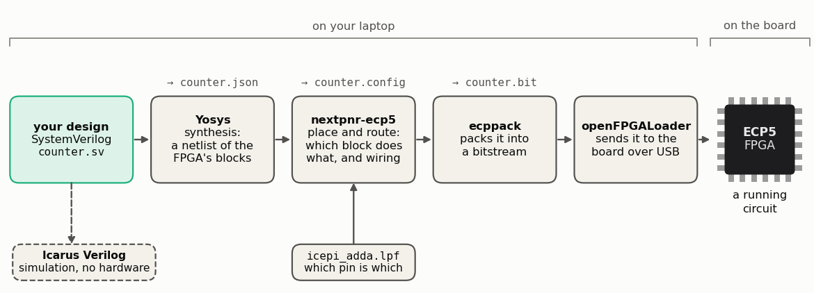

<!-- nav -->
[← 0.01 How to use this tutorial](0_01_how_to_use_this_tutorial.md#001-how-to-use-this-tutorial) &emsp;&emsp;&emsp; **[Contents](../README.md#contents)** &emsp;&emsp;&emsp; [1.01 A counter on the LEDs →](1_01_led_counter.md#101-a-counter-on-the-leds)

# 1.00 Circuits from code



An [FPGA](https://en.wikipedia.org/wiki/Field-programmable_gate_array) is a chip full of logic gates, flip-flops and small memories whose
wiring isn't fixed: you choose it, by loading a file into the chip. In this
chapter you describe circuits in [SystemVerilog](https://en.wikipedia.org/wiki/SystemVerilog), a language that looks like
code but describes hardware: every line becomes gates and wires that all run
at once, 50 million times a second. You start with a counter on the LEDs
([1.01](1_01_led_counter.md#101-a-counter-on-the-leds)), make the DAC play a sawtooth and a sine ([1.02](1_02_dac_sawtooth.md#102-a-sawtooth-from-the-dac), [1.03](1_03_dac_sine.md#103-a-sine-direct-digital-synthesis)), read the ADC
([1.04](1_04_adc_on_the_leds.md#104-the-adc-on-the-leds) to [1.07](1_07_closing_the_loop.md#107-closing-the-loop-the-dac-talks-to-the-adc)), and end with three real instruments made of nothing but
logic: a [lock-in amplifier](https://en.wikipedia.org/wiki/Lock-in_amplifier) ([1.08](1_08_lockin.md#108-a-lock-in-amplifier)), a [spectrum analyzer](https://en.wikipedia.org/wiki/Spectrum_analyzer) ([1.09](1_09_spectrum_analyzer.md#109-a-spectrum-analyzer)) and an AM radio
([1.10](1_10_am_radio.md#110-an-am-radio)). This page installs the tools.

The tools used here are all open source:

| tool | job |
| --- | --- |
| **Yosys** | *synthesis*: turns SystemVerilog into a netlist of the FPGA's building blocks |
| **nextpnr-ecp5** | *place and route*: decides which physical block does what, and wires them together |
| **ecppack** | packs the result into a *bitstream*, the file the FPGA loads |
| **openFPGALoader** | sends the bitstream to the board over USB |
| **Icarus Verilog** (`iverilog`) | simulates your design on the laptop, no hardware needed |

All of them come in one download, the **OSS CAD Suite**, which runs on
Linux, macOS and Windows. You'll also want Python 3 with a few packages.

The instructions below are the same `bash` commands on every laptop. On
**Windows**, that means doing the work inside Linux, using Microsoft's
*Windows Subsystem for Linux* (WSL). That is less strange than it sounds:
it's a real Ubuntu, in a window, and it is the only way the later chapters
(LiteX and Linux) work on Windows anyway.

## Windows only: Ubuntu in WSL, and USB

1. Open PowerShell **as Administrator** and install WSL with Ubuntu, then
   restart:

   ```powershell
   wsl --install -d Ubuntu
   ```

   Start **Ubuntu** from the Start menu and pick a user name and password.
   Everything below happens in that Ubuntu window.

2. WSL can't see USB devices by itself. Install
   [usbipd-win](https://github.com/dorssel/usbipd-win), which hands a USB
   device over to WSL. In PowerShell as Administrator:

   ```powershell
   winget install usbipd
   usbipd list                          # find the board: "USB Serial Converter", 0403:6015
   usbipd bind --busid 1-4              # your BUSID from the list; once per board
   ```

3. Then, each time you plug the board in, in an ordinary PowerShell:

   ```powershell
   usbipd attach --wsl --busid 1-4      # add --auto-attach to keep doing it
   ```

   In Ubuntu, `lsusb` should now list `0403:6015 Future Technology Devices
   International`, and `ls /dev/ttyUSB*` should show `/dev/ttyUSB0`. If it
   doesn't, `sudo modprobe ftdi_sio`.

   While the board is attached to WSL, Windows itself can't use it. That's fine.

Plots from Python appear in their own windows on Windows 11. On Windows 10,
save them to a file instead (`plt.savefig("plot.png")`) and open that.

## Everyone: a folder for the tools

Everything this tutorial installs goes inside this repository, in a folder
called `tools/` that git ignores, so nothing lands anywhere else on your
laptop, and deleting the repository deletes it all. If you haven't got the
repository yet, clone it now as in [0.01](0_01_how_to_use_this_tutorial.md#001-how-to-use-this-tutorial) (on
Windows, in WSL's Ubuntu window). Then, from its top folder, tell your shell
where it is, once:

```bash
cd icepi-zero-dac-adc                  # wherever you cloned it
echo "export ADDA=$PWD" >> ~/.bashrc   # macOS: ~/.zshrc, here and below
source ~/.bashrc                       # macOS: source ~/.zshrc
mkdir -p $ADDA/tools
```

From now on, in every terminal you open, `$ADDA` is the repository's top
folder, and the tutorial's commands use it wherever they need a folder. The
name is short for **a**nalog to **d**igital and **d**igital to **a**nalog: the
ADC and the DAC. You'll see *adda* in many file names.

## Everyone: the OSS CAD Suite

Go to the [OSS CAD Suite releases](https://github.com/YosysHQ/oss-cad-suite-build/releases/latest)
and download the newest file for your laptop:

| laptop | file |
| --- | --- |
| Linux, or Windows with WSL | `oss-cad-suite-linux-x64-YYYYMMDD.tgz` |
| Mac with an Apple chip (M1, M2, ...) | `oss-cad-suite-darwin-arm64-YYYYMMDD.tgz` |
| Mac with an Intel chip | `oss-cad-suite-darwin-x64-YYYYMMDD.tgz` |

Then, in a terminal (in WSL's Ubuntu window, on Windows), with your file's
name in place of the date:

```bash
cd $ADDA/tools
mv ~/Downloads/oss-cad-suite-*.tgz .         # WSL: cp /mnt/c/Users/<you>/Downloads/oss-cad-suite-*.tgz .
xattr -d com.apple.quarantine oss-cad-suite-*.tgz 2>/dev/null   # macOS only: let it run
tar xzf oss-cad-suite-*.tgz && rm oss-cad-suite-*.tgz
echo 'export PATH="$ADDA/tools/oss-cad-suite/bin:$PATH"' >> ~/.bashrc
```

Open a new terminal so the `PATH` change takes effect, and check: `yosys -V`
should print a version.

## Linux and WSL only: permission to use the board

By default only root may talk to the board's USB chip. Once per laptop:

```bash
cd $ADDA/tools
wget https://raw.githubusercontent.com/trabucayre/openFPGALoader/master/99-openfpgaloader.rules
sudo cp 99-openfpgaloader.rules /etc/udev/rules.d/
sudo udevadm control --reload-rules && sudo udevadm trigger
sudo usermod -a -G plugdev,dialout $USER     # then log out and back in
```

and unplug and replug the board (on Windows: `usbipd attach` it again).

## Everyone: Python

The laptop-side scripts need Python 3 with `pyserial`, `numpy` and
`matplotlib`. Give them their own *virtual environment*, so they can't fight
with anything else on your laptop:

```bash
sudo apt install python3-venv          # Linux and WSL only
python3 -m venv $ADDA/tools/venv
echo 'source $ADDA/tools/venv/bin/activate' >> ~/.bashrc
source $ADDA/tools/venv/bin/activate
pip install pyserial numpy matplotlib
```

(On a Mac, `python3` comes with Apple's command-line developer tools; the Mac
offers to install them the first time you type `python3`.)

## Check it all

Three commands, in a new terminal:

```console
$ yosys -V
$ iverilog -V
$ python3 -c "import serial, numpy, matplotlib"
```

The first two print a version, and the third prints nothing at all when all
is well (an error names the package that is missing). Then, with the board
plugged in:

```console
$ openFPGALoader -b icepi-zero --detect
...
	manufacturer lattice
	family ECP5
	model  LFE5U-25
```

If that works, you're ready for [1.01](1_01_led_counter.md#101-a-counter-on-the-leds).
[Appendix B](B_troubleshooting.md) has the usual problems.

<details>
<summary><b>Detail:</b> the other way, VS Code and the Apio extension</summary>

[Apio](https://fpgawars.github.io/apio/docs/) is a front end to the same OSS
CAD Suite, and **Apio IDE** is its VS Code extension. It downloads the tools
by itself and knows the Icepi Zero by name (`icepi-zero`). In VS Code's
Extensions panel, search for **`fpgawars.apio`** and install it. Then open the
[`src/verilog/`](../src/verilog/) folder (*File → Open Folder*): it already
has an `apio.ini`,

```ini
[env:default]
board = icepi-zero
top-module = counter
```

and Apio builds every `.sv` file in the folder except the testbenches
(`*_tb.sv`), with the one `.lpf` file it finds. Change `top-module` to pick a
design (`sawtooth`, `sine`, `capture`, `lockin`, ...) and use the **Build**
and **Upload** buttons, or `apio build` and `apio upload` in a terminal.

Two cautions. This route wasn't tested for this tutorial. And on Windows,
Apio replaces the board's USB driver to load bitstreams, and the board's
serial port, which most of Chapter 1 needs, disappears with it. Windows
users should stay with WSL.

</details>

<!-- nav -->
[← 0.01 How to use this tutorial](0_01_how_to_use_this_tutorial.md#001-how-to-use-this-tutorial) &emsp;&emsp;&emsp; **[Contents](../README.md#contents)** &emsp;&emsp;&emsp; [1.01 A counter on the LEDs →](1_01_led_counter.md#101-a-counter-on-the-leds)

<!-- author -->
<sub>Jason Gallicchio, jason@hmc.edu, Harvey Mudd College</sub>
