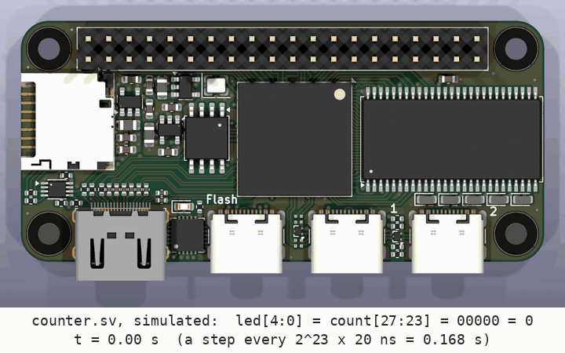

<!-- nav -->
[← 1.00 Circuits from code](1_00_circuits_from_code.md#100-circuits-from-code) &emsp;&emsp;&emsp; **[Contents](../README.md#contents)** &emsp;&emsp;&emsp; [1.02 A sawtooth from the DAC →](1_02_dac_sawtooth.md#102-a-sawtooth-from-the-dac)

# 1.01 A counter on the LEDs



By the end of this page, your board will do this. (The animation is a
simulation of this page's design, [`counter.sv`](../src/verilog/counter.sv),
shown on a 3D render of the Icepi Zero, in real time: one step every 0.168 s.
The render is of [cheyao's Icepi Zero design](https://github.com/cheyao/icepi-zero), under the
Solderpad Hardware License 2.1.)

## What an FPGA is

A microcontroller runs one instruction after another. An FPGA doesn't run
instructions at all: it is a large grid of small logic blocks. The one on the
Icepi Zero has

* about 24,000 four-input *look-up tables*, each of which can be any Boolean
  function of 4 inputs,
* 24,000 *flip-flops*, one-bit memories that update on a clock edge,
* 56 blocks of RAM and 28 hardware multipliers,
* about 200 I/O pins,
* and a programmable wiring network between all of these.

A *bitstream* says what each block computes and how the wires connect.
Loading one turns the chip into the circuit you described, and everything in
it runs **at the same time**, on every clock edge.

You describe that circuit in a *hardware description language*. We use
**[SystemVerilog](https://en.wikipedia.org/wiki/SystemVerilog)**, the language your engineering classmates learn. It looks
like a programming language, but it's closer to a schematic written as text:
each line describes some hardware that exists all the time, not a step that
happens once.

## The design

All the files for this chapter are in [`src/verilog/`](../src/verilog/).

<!-- file: src/verilog/counter.sv -->
```systemverilog
// counter.sv -- a binary counter on the five white LEDs.
//
// The 50 MHz oscillator ticks a 28-bit register up by one every 20 ns.
// Bit n of a counter is a square wave at 50 MHz / 2^(n+1), so we show the top five
// bits (23..27) -- bit 23 changes every 0.17 s, slow enough to watch.

module counter (
    input  logic       clk,         // 50 MHz, from the crystal oscillator
    output logic [4:0] led          // 1 = LED on
);
    logic [27:0] count = 0;         // 28 flip-flops; "= 0" is their value right after the FPGA loads

    always_ff @(posedge clk)        // on every rising edge of the clock...
        // ######################################################################
        // ##  KEY LINE: add one, every 20 ns.  That's the whole circuit.
        // ######################################################################
        count <= count + 1;

    assign led = count[27:23];      // wires from five of the flip-flops to the five LED pins
endmodule
```

What each piece means:

- A **`module`** is a circuit with named **ports**, its inputs and outputs.
  This one has one input, the clock, and a 5-bit output bus, `led[4:0]`.
- `logic [27:0] count` declares 28 bits of storage, and because they're
  assigned in an `always_ff` block, Yosys builds them as 28 **flip-flops**.
  (`logic` is SystemVerilog's general-purpose signal type. Older Verilog makes
  you choose between `reg` and `wire`; you'll see both in other people's code.)
- `always_ff @(posedge clk)` means "on every rising edge of `clk`". The `<=`
  inside is a *non-blocking assignment*: every `<=` in the design reads its
  right-hand side just before the edge and updates just after it, all at
  once. That's exactly how real flip-flops behave. Use `<=` in `always_ff`
  blocks.
- `count + 1` is an adder. Yosys builds it from the FPGA's logic and its fast
  carry chains.
- `assign` connects wires permanently. `count[27:23]` is five of the
  flip-flops' outputs, and they drive the five LED pins.

## The constraints file

SystemVerilog says nothing about which pin of the chip a port is on. That's
the job of the **constraints file**, `icepi_adda.lpf` (*adda*, as in [1.00](1_00_circuits_from_code.md#100-circuits-from-code)'s `$ADDA`: *analog to digital* and
*digital to analog*, the ADC and the DAC). One file serves every
design in this folder, and a design uses only the lines for the ports it
has. Getting it right meant reading the Icepi Zero's
[schematic](https://github.com/cheyao/icepi-zero/tree/main/hardware). The
part this design uses:

```
LOCATE COMP "clk" SITE "M1";
IOBUF  PORT "clk" IO_TYPE=LVCMOS33;
FREQUENCY PORT "clk" 50 MHZ;

LOCATE COMP "led[4]" SITE "E13";
LOCATE COMP "led[3]" SITE "D14";
LOCATE COMP "led[2]" SITE "E12";
LOCATE COMP "led[1]" SITE "C13";
LOCATE COMP "led[0]" SITE "D13";
IOBUF  PORT "led[0]" IO_TYPE=LVCMOS33;
...
```

* `LOCATE COMP "led[4]" SITE "E13"` puts bit 4 of the port `led` on the
  chip's ball E13, which the Icepi Zero wires to an LED. The numbering is a
  choice. With the board held the usual way, USB connectors pointing down, E13
  is the *leftmost* LED, so calling it `led[4]` puts the most significant bit
  on the left and a binary number reads the normal way. (Number them the
  other way round and the counter runs "backwards".)
* `IO_TYPE=LVCMOS33` says the pin uses 3.3 V logic.
* `FREQUENCY` tells the tools how fast the clock is, so they can check that
  every signal gets through its logic within one 20 ns period.
* The converters' output pins carry two more settings, `DRIVE=4
  SLEWRATE=SLOW`: how much current the pin is guaranteed to source or sink
  (4, 8, 12 or 16 mA) and whether its edges are fast or deliberately gentle.
  ([4.01](4_01_a_faster_dac.md#401-a-faster-dac-plls) says what faster settings did
  when they were tried.)

<details>
<summary>The whole file: <code>icepi_adda.lpf</code></summary>

<!-- file: src/verilog/icepi_adda.lpf -->
```
# icepi_adda.lpf -- pin constraints for an Icepi Zero with the
# IcepiZero_AD9280_AD9708_2x12 adapter (../../adapter_board/) and an
# AD9280/AD9708 module.
#
# One file for every design in this folder.  A design only has to use the
# ports it needs; constraints for ports a design doesn't have are ignored
# (nextpnr prints a warning for each and carries on).
#
# Each pair of lines says: this Verilog port name lives on this ball (pin) of
# the ECP5 chip, and uses this electrical standard.

# ---- 50 MHz crystal oscillator: the only clock on the board ----------------
LOCATE COMP "clk" SITE "M1";
IOBUF  PORT "clk" IO_TYPE=LVCMOS33;
FREQUENCY PORT "clk" 50 MHZ;

# ---- 5 white LEDs, active high (1 = on) ------------------------------------
# Numbered so a binary number reads normally with the USB connectors pointing
# down: led[4] (the MSB) is the leftmost LED, led[0] (the LSB) the rightmost.
# (LiteX's own platform file numbers them the other way round.)
LOCATE COMP "led[4]" SITE "E13";
LOCATE COMP "led[3]" SITE "D14";
LOCATE COMP "led[2]" SITE "E12";
LOCATE COMP "led[1]" SITE "C13";
LOCATE COMP "led[0]" SITE "D13";
IOBUF  PORT "led[0]" IO_TYPE=LVCMOS33;
IOBUF  PORT "led[1]" IO_TYPE=LVCMOS33;
IOBUF  PORT "led[2]" IO_TYPE=LVCMOS33;
IOBUF  PORT "led[3]" IO_TYPE=LVCMOS33;
IOBUF  PORT "led[4]" IO_TYPE=LVCMOS33;

# ---- push button nearest the USB connectors: reads 0 while pressed ---------
# (The other button, C4, is also the reset line of the LiteX designs.)
LOCATE COMP "btn" SITE "C5";
IOBUF  PORT "btn" IO_TYPE=LVCMOS33 PULLMODE=UP;

# ---- serial port, through the FT231X USB chip (/dev/ttyUSB0 on the laptop) -
LOCATE COMP "uart_tx" SITE "K15";
IOBUF  PORT "uart_tx" IO_TYPE=LVCMOS33;
LOCATE COMP "uart_rx" SITE "K16";
IOBUF  PORT "uart_rx" IO_TYPE=LVCMOS33 PULLMODE=UP;

# ---- AD9280 ADC: 8 data bits in, clock out ---------------------------------
# adc_d[7] is the MSB.  On the module's silkscreen: AD0..AD7, and ACLK.
LOCATE COMP "adc_d[0]" SITE "R1";
LOCATE COMP "adc_d[1]" SITE "R3";
LOCATE COMP "adc_d[2]" SITE "N4";
LOCATE COMP "adc_d[3]" SITE "P3";
LOCATE COMP "adc_d[4]" SITE "P2";
LOCATE COMP "adc_d[5]" SITE "M2";
LOCATE COMP "adc_d[6]" SITE "L1";
LOCATE COMP "adc_d[7]" SITE "L2";
LOCATE COMP "adc_clk"  SITE "J1";
IOBUF  PORT "adc_d[0]" IO_TYPE=LVCMOS33;
IOBUF  PORT "adc_d[1]" IO_TYPE=LVCMOS33;
IOBUF  PORT "adc_d[2]" IO_TYPE=LVCMOS33;
IOBUF  PORT "adc_d[3]" IO_TYPE=LVCMOS33;
IOBUF  PORT "adc_d[4]" IO_TYPE=LVCMOS33;
IOBUF  PORT "adc_d[5]" IO_TYPE=LVCMOS33;
IOBUF  PORT "adc_d[6]" IO_TYPE=LVCMOS33;
IOBUF  PORT "adc_d[7]" IO_TYPE=LVCMOS33;
IOBUF  PORT "adc_clk"  IO_TYPE=LVCMOS33 DRIVE=4 SLEWRATE=SLOW;

# ---- AD9708 DAC: 8 data bits out, clock out --------------------------------
# dac_d[7] is the MSB.  On the module's silkscreen: DA0..DA7, and DCLK.
LOCATE COMP "dac_d[0]" SITE "D4";
LOCATE COMP "dac_d[1]" SITE "E4";
LOCATE COMP "dac_d[2]" SITE "E3";
LOCATE COMP "dac_d[3]" SITE "J3";
LOCATE COMP "dac_d[4]" SITE "F3";
LOCATE COMP "dac_d[5]" SITE "E1";
LOCATE COMP "dac_d[6]" SITE "G1";
LOCATE COMP "dac_d[7]" SITE "H2";
LOCATE COMP "dac_clk"  SITE "G2";
IOBUF  PORT "dac_d[0]" IO_TYPE=LVCMOS33 DRIVE=4 SLEWRATE=SLOW;
IOBUF  PORT "dac_d[1]" IO_TYPE=LVCMOS33 DRIVE=4 SLEWRATE=SLOW;
IOBUF  PORT "dac_d[2]" IO_TYPE=LVCMOS33 DRIVE=4 SLEWRATE=SLOW;
IOBUF  PORT "dac_d[3]" IO_TYPE=LVCMOS33 DRIVE=4 SLEWRATE=SLOW;
IOBUF  PORT "dac_d[4]" IO_TYPE=LVCMOS33 DRIVE=4 SLEWRATE=SLOW;
IOBUF  PORT "dac_d[5]" IO_TYPE=LVCMOS33 DRIVE=4 SLEWRATE=SLOW;
IOBUF  PORT "dac_d[6]" IO_TYPE=LVCMOS33 DRIVE=4 SLEWRATE=SLOW;
IOBUF  PORT "dac_d[7]" IO_TYPE=LVCMOS33 DRIVE=4 SLEWRATE=SLOW;
IOBUF  PORT "dac_clk"  IO_TYPE=LVCMOS33 DRIVE=4 SLEWRATE=SLOW;
```

</details>

<details>
<summary><b>Detail:</b> why the ADC and DAC pins are <code>DRIVE=4 SLEWRATE=SLOW</code></summary>

A pin with neither setting gets Lattice's defaults, 8 mA and SLOW, and
that's what the LEDs and the serial port use. An LED changes a few times a
second and the serial line at most a million times, over a few centimetres
of the Icepi Zero's own board, so the defaults are fine for both.

The DAC's nine lines (and the ADC's clock) are different. They leave the
board through two 0.1-inch connectors, toward a chip whose output is
analog, and up to 100 million times a second the eight data lines switch
together, each edge pushing current through the connectors' few ground
pins. A gentler edge rings less, and couples less into its neighbours and
into the DAC's output. The AD9708's datasheet recommends "the slowest logic
family" that still meets its timing, for this reason. It also keeps the
wiring simple: a signal takes about 0.3 ns to cross the adapter, and as long
as its edge takes several times longer than that, the wire behaves as a
plain connection and needs no terminating resistor. So these pins get half
the default current. `SLEWRATE=SLOW` only restates the default, but writing
it down makes the choice visible. The ADC's data pins are inputs, and drive
and slew rate don't apply to inputs.

These values were first chosen by that reasoning, and later checked with the
DAC cabled to the ADC. A DAC sine at 100 MS/s came back with the least noise
at 4 mA and SLOW: 47.0 dB above the noise floor, against 45.6 dB for the
8 mA default and 44.8 dB for 16 mA FAST, each repeatable to 0.1 dB. A faster
edge on the DAC's clock alone didn't help either. Nor do the weak edges limit
the speed: with every setting tried, the DAC still converted correctly at
200 MS/s, past both the AD9708's typical 125 MS/s and Lattice's 150 MHz
rating for these outputs.

</details>

## Build it and load it

```bash
cd $ADDA/src/verilog
yosys -p "synth_ecp5 -top counter -json counter.json" counter.sv
nextpnr-ecp5 --25k --package CABGA256 --speed 6 --json counter.json \
             --lpf icepi_adda.lpf --textcfg counter.config
ecppack --compress counter.config counter.bit
openFPGALoader -b icepi-zero counter.bit
```

| step | what it does | output |
| --- | --- | --- |
| `yosys ... synth_ecp5` | reads the SystemVerilog, infers an adder and 28 flip-flops, maps them to ECP5 cells | `counter.json`, a netlist |
| `nextpnr-ecp5` | places each cell on the chip and routes the wires; reports the fastest clock the result could run at | `counter.config` |
| `ecppack` | converts that to the binary the chip loads | `counter.bit` |
| `openFPGALoader` | sends it over USB into the FPGA's configuration memory | a running circuit |

The whole thing takes a few seconds. Look for a line like this in
nextpnr's output:

```
Info: Max frequency for clock '$glbnet$clk$TRELLIS_IO_IN': 305.06 MHz (PASS at 50.00 MHz)
```

It says the counter's *slowest* path would still work with a 305 MHz clock,
so 50 MHz is comfortably safe. A design that fails this check may still
appear to work, but not reliably.

The LEDs now count in binary. `led[0]`, the rightmost, toggles every 0.17 s
(2<sup>23</sup> clock periods of 20 ns), and `led[4]`, the leftmost, every
2.7 s.

`openFPGALoader` loaded the bitstream into the FPGA's own memory (SRAM), so
unplugging the board erases it. That's what you want while experimenting.
(`openFPGALoader -f` writes the board's flash chip instead, so the design
loads by itself at power-up; [3.04](3_04_booting_from_sd.md#304-booting-from-an-sd-card) does that.)

<details>
<summary><b>Detail:</b> how the bits get into the FPGA, and how your design "starts"</summary>

The FPGA's configuration is held in memory cells (SRAM) spread across the
chip: one bit for each entry of each look-up table, each routing switch, each
pin's settings, and the starting contents of each block RAM. For this chip
that's 4.7 million bits, a 582 kB file uncompressed. (`ecppack --compress`
squeezes a nearly empty design like the counter to 99 kB.) At power-up those
cells are blank, and the chip loads them from one of two places: the SPI flash
chip beside it, which it reads by itself, or the JTAG pins, which
`openFPGALoader` wiggles through the FT231X USB chip. That's the
`Enable configuration`, `SRAM erase`, `Loading` and `Disable configuration`
that it prints, 1.7 s for the counter.

While the chip is being configured, its I/O pins float, held up by weak
pull-up resistors. (That's why the DAC sits at full scale before you load
anything: all eight of its data pins read 1.) When the last bits are in and
their checksum is right, the chip *wakes up*, all at once: it sets every
flip-flop to its initial value (the `= 0` in `logic [27:0] count = 0`), turns
on its outputs, and lets go. The 50 MHz oscillator has been running all
along. From its next rising edge, every flip-flop in the design updates on
every edge, together, until the power goes off.

So nothing "starts" the way a program does: there's no first line. The whole
circuit appears at one instant, in the state its initial values describe, and
then the clock moves it along.

</details>

The [`Makefile`](../src/verilog/Makefile) in the folder runs the same four
commands: `make load-counter` builds `counter.bit` if it needs to and loads
it. The commands are shown here in full so you know what `make` is doing.

**Try this:**

- Make it count twice as fast. Then make it count down.
- Show `count[22:18]` instead. Why does `led[0]` now look steadily lit, a
  little dimmer, rather than blinking?
- Add a second input, `input logic btn` (it's already in the `.lpf`: it reads
  0 while the button nearest the USB connectors is pressed), and freeze the
  counter while it's pressed.

<!-- nav -->
[← 1.00 Circuits from code](1_00_circuits_from_code.md#100-circuits-from-code) &emsp;&emsp;&emsp; **[Contents](../README.md#contents)** &emsp;&emsp;&emsp; [1.02 A sawtooth from the DAC →](1_02_dac_sawtooth.md#102-a-sawtooth-from-the-dac)

<!-- author -->
<sub>Jason Gallicchio, jason@hmc.edu, Harvey Mudd College</sub>
