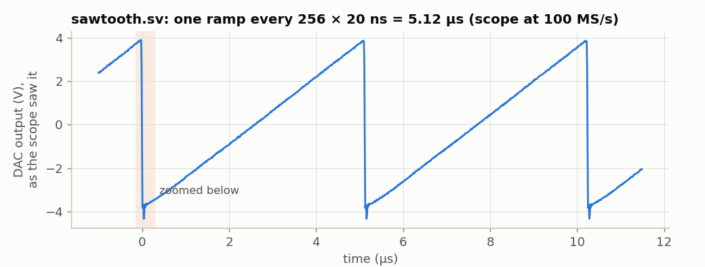
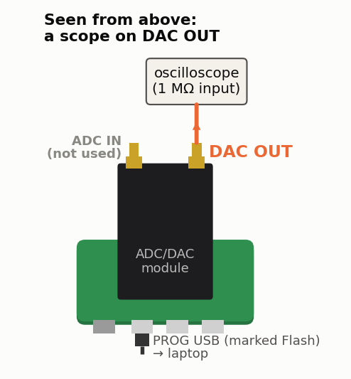
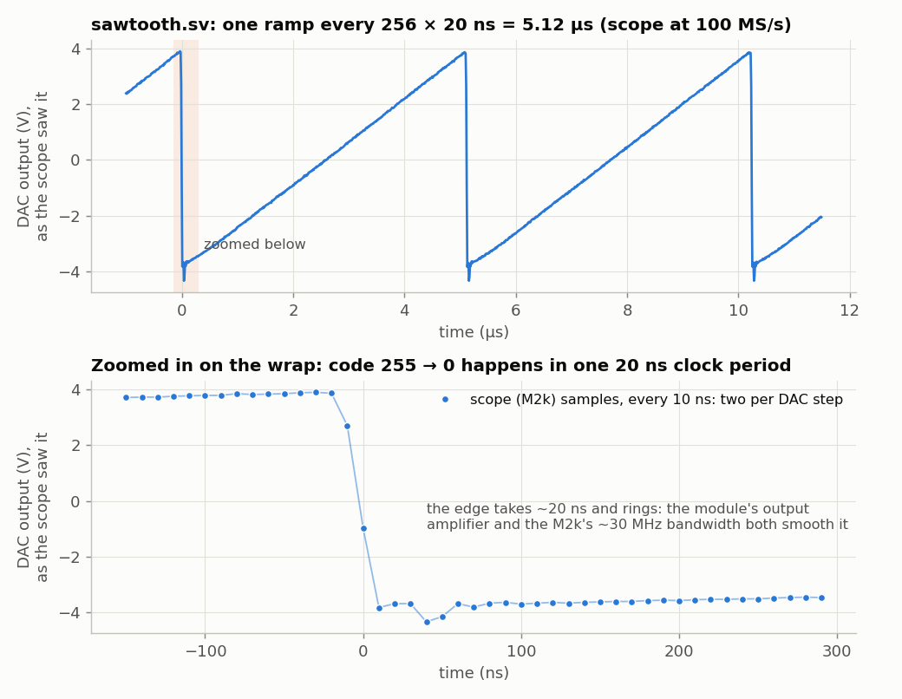

<!-- nav -->
[← 1.01 A counter on the LEDs](1_01_led_counter.md#101-a-counter-on-the-leds) &emsp;&emsp;&emsp; **[Contents](../README.md#contents)** &emsp;&emsp;&emsp; [1.03 A sine: direct digital synthesis →](1_03_dac_sine.md#103-a-sine-direct-digital-synthesis)

# 1.02 A sawtooth from the DAC



Put a scope on the DAC's output connector for this one: DAC OUT, the
right-hand SMA with the USB connectors toward you.



The AD9708 DAC takes an 8-bit number on eight pins, `dac_d[7:0]`, and on each
rising edge of its clock pin, `dac_clk`, turns it into an output current. The
module's op-amp turns that into a voltage. So what happens if you wire the
counter of [1.01](1_01_led_counter.md#101-a-counter-on-the-leds) to the DAC?

<!-- file: src/verilog/sawtooth.sv -->
```systemverilog
// sawtooth.sv -- a counter wired to the DAC is a ramp generator.
//
// Every 20 ns the 8-bit count goes up by one and the DAC turns it into a
// voltage.  After 255 it wraps to 0, so the output is a sawtooth that repeats
// every 256 x 20 ns = 5.12 us (195.3 kHz).

module sawtooth (
    input  logic       clk,         // 50 MHz
    output logic [7:0] dac_d = 0,   // DAC data; dac_d[7] is the most significant bit (MSB)
    output logic       dac_clk      // the DAC grabs dac_d on the RISING edge of this
);
    always_ff @(posedge clk)
        // ######################################################################
        // ##  KEY LINE: the DAC's number goes up by one every clock (20 ns).
        // ##  8 bits wrap from 255 back to 0 by themselves: that's the sawtooth.
        // ######################################################################
        dac_d <= dac_d + 1;

    // dac_d changes just after each rising edge of clk.  Inverting clk puts
    // the DAC's rising edge halfway between those changes, 10 ns after one
    // and 10 ns before the next -- when the data is steady.
    assign dac_clk = ~clk;
endmodule
```

The counter is now 8 bits wide, the width of the DAC, and runs at full
speed: 255 + 1 wraps around to 0 by itself, so the output is a ramp that
starts over every 256 clocks.

The only new idea is the DAC's clock. The AD9708 needs its data steady for
2.0 ns before and 1.5 ns after its clock's rising edge (the *setup* and
*hold* times, from its datasheet). Our data changes just after each rising
edge of `clk`, so we give the DAC the inverted clock. Its rising edge then
falls in the middle of each 20 ns period, 10 ns from any change.

`make load-sawtooth`, and on the scope:



The ramp repeats every 5.12 µs (195.3 kHz) and runs from −3.95 V at code 0
to +3.88 V at code 255: 30.7 mV per code. The scope took a sample every
10 ns, two for each 20 ns step of the DAC, and the line joins them up. Look
at the lower panel: there's no visible staircase, even though the value
steps every 20 ns. The DAC's output amplifier and the scope's own ~25 MHz
bandwidth both low-pass filter the steps. The one big step, 255 → 0, shows
that filtering as a ~20 ns edge with some ringing.

**Try this:**

- Make the ramp go down instead of up. Then make a triangle: up, then down.
- Slow it down by a factor of a million: feed `dac_d` from `count[27:20]` of
  a 28-bit counter, as [`adc_leds.sv`](../src/verilog/adc_leds.sv) does in
  [1.04](1_04_adc_on_the_leds.md#104-the-adc-on-the-leds), and watch it with a
  multimeter instead. How long is one ramp now?

<!-- nav -->
[← 1.01 A counter on the LEDs](1_01_led_counter.md#101-a-counter-on-the-leds) &emsp;&emsp;&emsp; **[Contents](../README.md#contents)** &emsp;&emsp;&emsp; [1.03 A sine: direct digital synthesis →](1_03_dac_sine.md#103-a-sine-direct-digital-synthesis)

<!-- author -->
<sub>Jason Gallicchio, jason@hmc.edu, Harvey Mudd College</sub>
