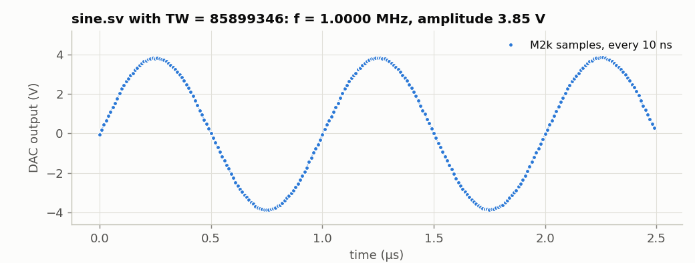
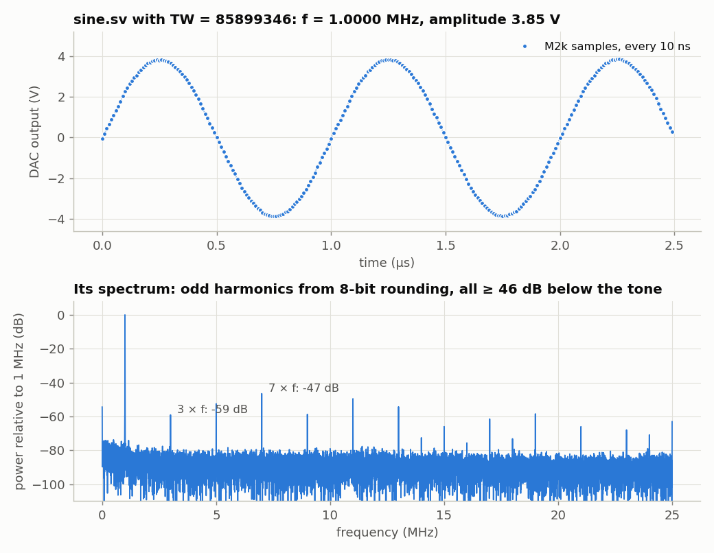

<!-- nav -->
[← 1.02 A sawtooth from the DAC](1_02_dac_sawtooth.md#102-a-sawtooth-from-the-dac) &emsp;&emsp;&emsp; **[Contents](../README.md#contents)** &emsp;&emsp;&emsp; [1.04 The ADC on the LEDs →](1_04_adc_on_the_leds.md#104-the-adc-on-the-leds)

# 1.03 A sine: direct digital synthesis



To make a sine, keep a *phase*, advance it by a fixed amount every clock, and
look up the sine of it in a table. This is **[direct digital synthesis](https://en.wikipedia.org/wiki/Direct_digital_synthesis) (DDS)**,
and it's how almost every modern function generator works.

<!-- file: src/verilog/sine.sv -->
```systemverilog
// sine.sv -- a sine wave out of the DAC by direct digital synthesis (DDS).
//
// A 32-bit "phase accumulator" adds a constant TW every clock.  Think of it as
// the angle of a phasor: 2^32 counts = one full turn.  Its top 8 bits pick
// one of 256 entries in a table of sin(), and that goes to the DAC.
//
//     output frequency  f = TW * 50 MHz / 2^32        (resolution 0.012 Hz)
//     so                TW = round(f / 50 MHz * 2^32)

module sine #(
    parameter logic [31:0] TW = 32'd85899346    // 1.000 000 MHz (calculation above)
) (
    input  logic       clk,                     // 50 MHz
    output logic [7:0] dac_d = 0,
    output logic       dac_clk
);
    // ---- the table: 256 samples of one cycle, from -127 to +127 ----------
    // Filled in when the design is compiled: Yosys runs this loop, not the FPGA.
    logic signed [7:0] sine_table [0:255];
    initial
        for (int i = 0; i < 256; i++)
            sine_table[i] = $rtoi($floor(127.0 * $sin(2 * 3.141592653589793 * i / 256) + 0.5));

    // ---- the phase accumulator -------------------------------------------
    logic [31:0] phase = 0;

    always_ff @(posedge clk) begin
        // ######################################################################
        // ##  KEY LINE 1: the phase advances by TW every clock.  It wraps
        // ##  around at 2^32 all by itself, exactly like an angle.
        // ######################################################################
        phase <= phase + TW;

        // ######################################################################
        // ##  KEY LINE 2: the top 8 bits of the phase pick a sample of sin()
        // ##  from the table.  "+ 128" turns -127..+127 into 1..255 for the DAC.
        // ######################################################################
        dac_d <= sine_table[phase[31:24]] + 128;
    end

    assign dac_clk = ~clk;                      // as in sawtooth.sv
endmodule
```

The phase is a 32-bit number in which 2<sup>32</sup> means one full turn, so
it wraps around exactly like an angle. Adding `TW` (the *tuning word*) every
20 ns gives

$$ f = \frac{TW}{2^{32}} \times 50\ \text{MHz}, \qquad \Delta f_{\min} = \frac{50\ \text{MHz}}{2^{32}} = 0.012\ \text{Hz}. $$

For 1 MHz, TW = 2<sup>32</sup> / 50 = 85,899,345.9, so we use 85,899,346.
Only the top 8 bits of the phase address the table, but the low 24 bits still
matter: they keep the fractional phase, so the *average* frequency is exact
even when 50 MHz / *f* isn't a whole number of samples.

Two more SystemVerilog ideas:

- `logic signed [7:0] sine_table [0:255]` is a **memory** of 256 eight-bit
  words. The `initial` loop fills it in *when the design is compiled*: Yosys
  computes `$sin` and stores the 8-bit results in the bitstream. The FPGA
  never computes a sine.
- The table holds −127…+127, but the DAC wants 0…255 ("offset binary").
  Adding 128 converts.

`make load-sine`:



The scope measured 999,997.2 Hz. That's 2.8 parts per million low, which is
simply how far the Icepi Zero's crystal and the scope's crystal disagree
(Chapter 5 makes a whole study of that). The spectrum shows what an 8-bit
table does: rounding every sample to the nearest code adds an error that
repeats every cycle, so it appears as harmonics. They are mostly odd,
because the error has the same half-wave symmetry as the sine. All are at
least 46 dB below the tone.

**Try this:**

- Change the frequency by overriding the parameter instead of editing the
  file:
  `yosys -p "read_verilog -sv sine.sv; chparam -set TW 429496730 sine; synth_ecp5 -top sine -json sine.json"`
  (5 MHz), then the `nextpnr-ecp5`, `ecppack` and `openFPGALoader` commands
  of [1.01](1_01_led_counter.md#101-a-counter-on-the-leds). Then try TW = 2<sup>31</sup>: 25 MHz, two samples per cycle, and
  the scope shows a flat 0 V. Why? (Which two table entries does the phase
  visit?) Then TW = 3 × 2<sup>30</sup> (37.5 MHz). What frequency comes out,
  and why? (Hint: the [sampling theorem](https://en.wikipedia.org/wiki/Nyquist%E2%80%93Shannon_sampling_theorem), and the images of a sampled
  signal at *n* × 50 MHz ± *f*.)
- Make a triangle wave and a square wave from the same phase accumulator.
  They'll have any frequency you like, to 0.012 Hz.
- Add amplitude control: multiply the table value by a number from 0 to 255
  and keep the top 8 bits of the product.

The DAC can run twice as fast as this, from a faster clock that the FPGA
makes itself. That's [4.01](4_01_a_faster_dac.md#401-a-faster-dac-plls), for later.

<!-- nav -->
[← 1.02 A sawtooth from the DAC](1_02_dac_sawtooth.md#102-a-sawtooth-from-the-dac) &emsp;&emsp;&emsp; **[Contents](../README.md#contents)** &emsp;&emsp;&emsp; [1.04 The ADC on the LEDs →](1_04_adc_on_the_leds.md#104-the-adc-on-the-leds)

<!-- author -->
<sub>Jason Gallicchio, jason@hmc.edu, Harvey Mudd College</sub>
