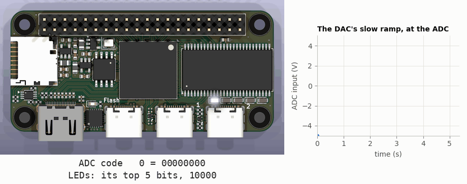

<!-- nav -->
[← 1.03 A sine: direct digital synthesis](1_03_dac_sine.md#103-a-sine-direct-digital-synthesis) &emsp;&emsp;&emsp; **[Contents](../README.md#contents)** &emsp;&emsp;&emsp; [1.05 ADC samples to Python →](1_05_adc_to_python.md#105-adc-samples-to-python)

# 1.04 The ADC on the LEDs



That's where this page ends up: the DAC plays a slow ramp, a cable carries it
to the ADC, and the LEDs show the top five bits of what the ADC reads. (A
simulation of this page's design,
[`adc_leds.sv`](../src/verilog/adc_leds.sv), in real time, with the ADC's
behaviour as measured in [1.07](1_07_closing_the_loop.md#107-closing-the-loop-the-dac-talks-to-the-adc).)

Now the other direction: analog in, numbers out. Connect a coax cable from
DAC OUT to ADC IN: with the USB connectors toward you, DAC OUT is the
right-hand SMA and ADC IN the left-hand one. (Or connect a function generator
or a power supply to ADC IN instead, but keep it between −5 V and +5 V.)


## Clocking the ADC

The AD9280 takes a sample on each rising edge of its clock pin and puts the
result on its eight data pins. Three things from its datasheet decide how to
drive it:

* **Its clock must stay high for at least 14.7 ns, and low for at least
  14.7 ns.** Our 50 MHz clock has a 20 ns period, 10 ns on each side: not
  enough. So we toggle the ADC's clock on every rising edge of ours, which
  makes a 25 MHz clock, 20 ns high and 20 ns low. That's 25 million samples
  a second (25 MS/s).
* **It's *pipelined*.** A conversion takes 3 clock cycles, and the ADC works
  on three samples at once, like an assembly line. The number on its pins
  belongs to the sample taken 3 cycles earlier. That's fine for a steady
  stream; it only matters when you care about exactly when ([1.07](1_07_closing_the_loop.md#107-closing-the-loop-the-dac-talks-to-the-adc) will).
* **Each new result appears about 25 ns after the rising edge that releases
  it** (t<sub>OD</sub>, the datasheet's *output delay*). So we read the pins
  just before the *next* rising edge, 40 ns later, when they've been steady
  for about 15 ns.


Here that is, with the top five bits of each sample sent to the LEDs:

<!-- file: src/verilog/adc_leds.sv -->
```systemverilog
// adc_leds.sv -- the ADC's reading on the five LEDs: the world's slowest voltmeter.
//
// The ADC is clocked at 25 MHz and its top five bits go straight to the LEDs:
// -5 V lights none, 0 V lights 01111, +5 V lights all five.  One LED step is
// 8 ADC codes, about 0.32 V.
//
// So that there is something to look at without a function generator, the DAC
// plays a very slow ramp (the counter of counter.sv, wired to the DAC): connect
// the DAC output to the ADC input with a cable and the LEDs count up for 5.4 s,
// then drop back.

module adc_leds (
    input  logic       clk,         // 50 MHz
    input  logic [7:0] adc_d,       // the ADC's 8 data pins (adc_d[7] is the MSB)
    output logic       adc_clk,     // the ADC's clock: it takes a sample on each rising edge
    output logic [7:0] dac_d,
    output logic       dac_clk,
    output logic [4:0] led
);
    // ---- the ADC: a 25 MHz clock, and a register to catch each sample ------
    logic       adc_clk_r = 0;
    logic [7:0] sample    = 0;

    always_ff @(posedge clk) begin
        // ######################################################################
        // ##  KEY LINE 1: flip the ADC's clock on every 50 MHz clock edge.
        // ##  20 ns high, 20 ns low: a 25 MHz clock, 25 million samples a second.
        // ######################################################################
        adc_clk_r <= ~adc_clk_r;

        // ######################################################################
        // ##  KEY LINE 2: catch the ADC's output just before its clock rises
        // ##  again.  That is when the data pins have been steady the longest.
        // ######################################################################
        if (adc_clk_r == 1'b0)          // adc_clk is low now, and rises at this same edge:
            sample <= adc_d;            // read the pins just before it does
    end
    assign adc_clk = adc_clk_r;

    assign led = sample[7:3];           // the top five bits of the reading

    // ---- the DAC: a slow ramp, so a cable from DAC to ADC makes the LEDs count
    logic [27:0] count = 0;
    always_ff @(posedge clk)
        count <= count + 1;
    assign dac_d   = count[27:20];      // one DAC step every 2^20 clocks (21 ms)
    assign dac_clk = ~clk;              // as in sawtooth.sv
endmodule
```

Two ports are new: `adc_d[7:0]`, eight inputs, and `adc_clk`, the output that
clocks the ADC. Their pins are in `icepi_adda.lpf` already.

`make load-adc_leds`. With the cable in place, the DAC ramps slowly from
−3.95 V to +3.88 V and the ADC follows it, so the LEDs count up in binary from
`00011` to `11100` over 5.4 seconds, and start again. Pull the cable out and
they settle at `01111`: an unconnected ADC input reads 0 V, code 127, which
is `01111111`. With a power supply instead, each LED step is 8 ADC codes,
0.32 V.

<details>
<summary><b>Detail:</b> why 25 MS/s in but 50 MS/s out?</summary>

Each converter's datasheet sets its own ceiling. The AD9280 ADC is rated for
32 MS/s: a clock period of at least 31.25 ns, of which at least 14.7 ns high
and 14.7 ns low, because each stage of its pipeline needs that long to
settle. The AD9708 DAC is simpler and faster: it only has to latch a new code
on each rising clock edge (data steady 2.0 ns before, 1.5 ns after). Its
datasheet lists the maximum update rate as 100 MS/s *minimum* and 125 MS/s
*typical*: every part is guaranteed to keep up at 100 MS/s, and a typical part
still works at 125, but no particular part is promised that. (The guarantee is
stated for 5 V supplies; this module runs the DAC's logic at 3.3 V.)

On this board, though, every clock comes from the one 50 MHz oscillator, and
counting its edges gives only 50 MHz divided by a whole number: 50, 25, 16.7,
12.5 MHz... The DAC gets the full 50, and the ADC gets 25, the fastest of
those it can take. The whole-number ratio has a second benefit that [1.07](1_07_closing_the_loop.md#107-closing-the-loop-the-dac-talks-to-the-adc) and
[1.08](1_08_lockin.md#108-a-lock-in-amplifier) rely on: every ADC sample is taken at the same point of the DAC's clock,
so the two stay in step forever. They're *coherent*.

</details>

<details>
<summary><b>Detail:</b> could the ADC go faster?</summary>

The FPGA can make faster clocks itself, with a PLL ([4.01](4_01_a_faster_dac.md#401-a-faster-dac-plls)
runs the DAC at 100 MS/s that way), and the ADC could gain its last 28% like
that. A 120 MHz clock could run the DAC at 120 MS/s (past its guaranteed
100, within its typical 125) and the ADC at 30 MS/s, still in a whole-number
ratio. A 62.5 MHz clock would run the ADC at 31.25 MS/s, 98% of its maximum,
with the DAC at 62.5.

At that rate, though, the 25 ns output delay is most of a 32 ns period: "just
before the next rising edge", the data would have been steady for only about
7 ns, and the datasheet gives the 25 ns only as a typical value. So this was
tried on the hardware. The ADC's data pins were sampled every 8 ns while the
ADC's clock was shifted in 2 ns steps. The data turned out to be valid for all
but about 4 ns of each 32 ns period, and at the best sampling point the
quality was the same as at 25 MS/s (43.7 dB SINAD, 7.0 effective bits,
including the DAC's own distortion). So 31.25 MS/s works, if the design reads
the data away from those 4 ns, and the way to find where they fall is to try,
as here.

The same test turned up a subtler effect. When the ADC sampled just as the DAC
was switching, the noise rose by about 5 dB, because the two converters share
a board and a ground. Run both from one clock in a whole-number ratio, as
these designs do, and that timing is the same every time you load the design.

</details>

**Try this:**

- Make the LEDs a bar graph instead of a binary number: none lit at −5 V, all
  five at +5 V.
- The LEDs flicker when the input sits near a boundary between two LED
  patterns. Why? (The ADC's own noise is under a tenth of a code, as
  [1.07](1_07_closing_the_loop.md#107-closing-the-loop-the-dac-talks-to-the-adc)
  and [1.09](1_09_spectrum_analyzer.md#109-a-spectrum-analyzer) find, but a
  bench supply's ripple and whatever the cable picks up are usually more.)
  Fix it by updating the LEDs only ten times a second.
- With a power supply and a multimeter, check the ADC's calibration from
  [0.00](0_00_the_hardware.md#000-the-hardware): code = 126.7 + 25.35 × V.

<!-- nav -->
[← 1.03 A sine: direct digital synthesis](1_03_dac_sine.md#103-a-sine-direct-digital-synthesis) &emsp;&emsp;&emsp; **[Contents](../README.md#contents)** &emsp;&emsp;&emsp; [1.05 ADC samples to Python →](1_05_adc_to_python.md#105-adc-samples-to-python)

<!-- author -->
<sub>Jason Gallicchio, jason@hmc.edu, Harvey Mudd College</sub>
