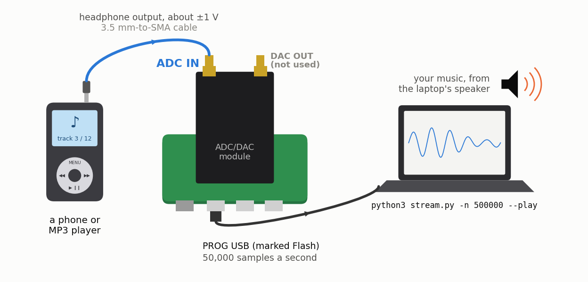
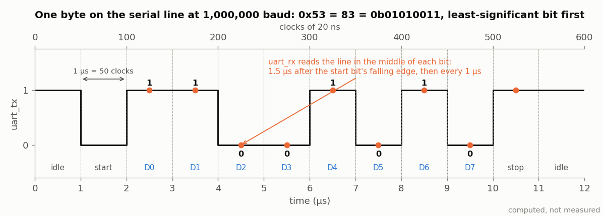
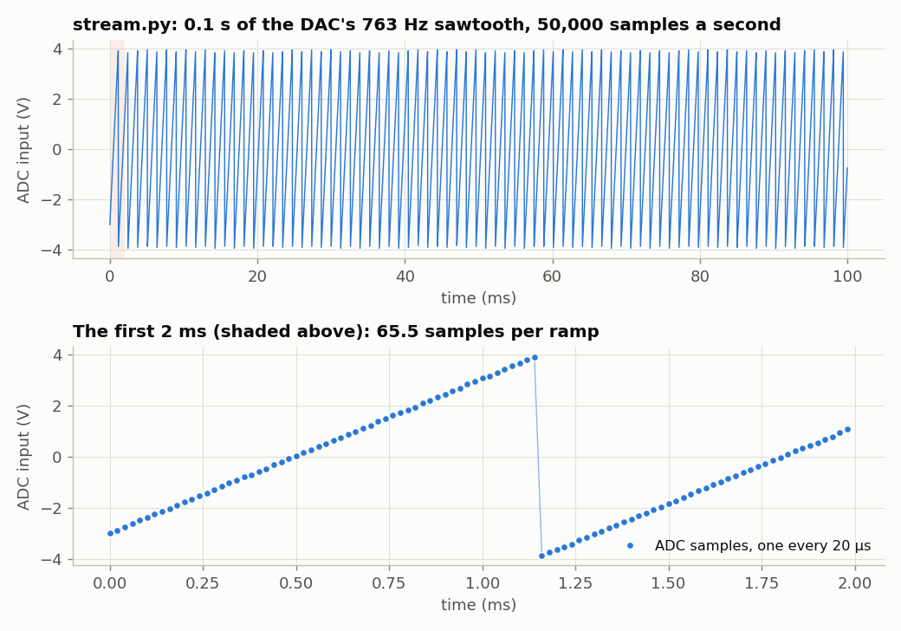
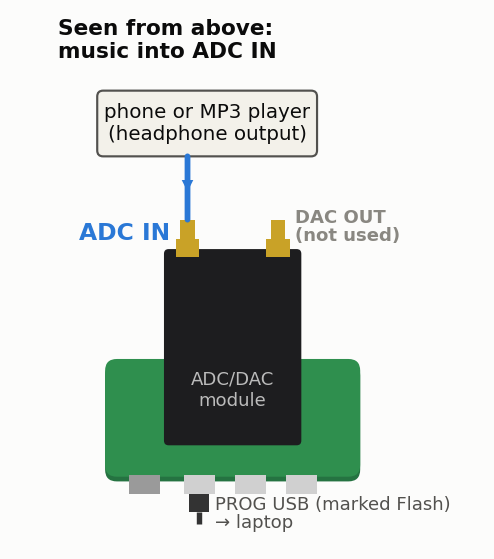

<!-- nav -->
[← 1.04 The ADC on the LEDs](1_04_adc_on_the_leds.md#104-the-adc-on-the-leds) &emsp;&emsp;&emsp; **[Contents](../README.md#contents)** &emsp;&emsp;&emsp; [1.06 Fast captures →](1_06_fast_capture.md#106-fast-captures)

# 1.05 ADC samples to Python



By the end of this page, the laptop records whatever the ADC sees, 50,000
samples a second, and can play it back: plug a phone's headphone output into
the ADC, and you'll hear your music, recorded by your FPGA.

Five LEDs are a poor oscilloscope. The same USB cable that loads the FPGA is
also a serial port, so let's send the samples to the laptop.

## A serial port (UART)

The FT231X chip on the Icepi Zero is a USB-to-serial converter. On your
laptop it's a serial port ([0.01](0_01_how_to_use_this_tutorial.md#001-how-to-use-this-tutorial) says what
it's called); on the FPGA's side it's two wires, `uart_tx` (FPGA to laptop)
and `uart_rx` (laptop to FPGA). The protocol is the one you've probably seen
on a microcontroller's serial port with a scope: the line idles at 1, and
each byte is a 0 *start bit*, the 8 data bits least-significant first, and a 1
*stop bit*. Ten bit-times per byte. At 1,000,000 bits per second (*baud*), a
bit lasts 1 µs, which is 50 of our clock cycles.



Here's the FPGA's half, a transmitter and a receiver. Only the transmitter is
used in this section; the receiver comes in [1.06](1_06_fast_capture.md#106-fast-captures).

<!-- file: src/verilog/uart.sv -->
```systemverilog
// uart.sv -- a serial port ("UART"): 8 data bits, no parity, 1 stop bit (8N1).
//
// On the wire, an idle line sits at 1.  A byte is a 0 "start bit", the 8 data
// bits least-significant first, and a 1 "stop bit", each lasting one bit time.
// At 1,000,000 baud a bit time is 1 us = 50 clocks of the 50 MHz clock.
//
// Used by adc_stream.sv, capture.sv, loopback.sv and lockin.sv.  The FT231X
// chip on the Icepi Zero turns these wires into a serial port on the laptop.

module uart_tx #(
    parameter CLKS_PER_BIT = 50
) (
    input  logic       clk,
    input  logic [7:0] data,
    input  logic       start,     // high for one clock: send `data`
    output logic       busy,      // high while a byte is going out
    output logic       tx
);
    logic [9:0]  frame = 10'b1111111111;  // {stop, data[7:0], start}; bit 0 is on the wire
    logic [3:0]  bits  = 0;               // bits left to send
    logic [15:0] timer = 0;               // counts the clocks of one bit

    assign tx   = frame[0];
    assign busy = (bits != 0);

    always_ff @(posedge clk)
        if (!busy) begin
            if (start) begin
                // ##############################################################
                // ##  KEY LINE: load the whole 10-bit frame at once:
                // ##  stop bit (1), the 8 data bits, start bit (0).
                // ##############################################################
                frame <= {1'b1, data, 1'b0};
                bits  <= 10;
                timer <= 0;
            end
        end else if (timer == CLKS_PER_BIT - 1) begin
            timer <= 0;
            // ##################################################################
            // ##  KEY LINE: one bit time is up: shift the next bit onto the
            // ##  wire.  Ones shift in from the top, so the line ends idle.
            // ##################################################################
            frame <= {1'b1, frame[9:1]};
            bits  <= bits - 1;
        end else
            timer <= timer + 1;
endmodule


module uart_rx #(
    parameter CLKS_PER_BIT = 50
) (
    input  logic       clk,
    input  logic       rx,
    output logic [7:0] data  = 0,
    output logic       valid = 0      // high for one clock when `data` is new
);
    // rx comes from another chip with its own clock, so it can change at any
    // instant.  Two flip-flops in a row give it time to settle to a clean 0/1.
    logic rx1 = 1, rx2 = 1;
    always_ff @(posedge clk) begin
        rx1 <= rx;
        rx2 <= rx1;
    end

    logic [3:0]  count = 0;           // 0 = idle; 1..8 = next data bit; 9 = stop bit
    logic [15:0] timer = 0;
    logic [7:0]  shift = 0;

    always_ff @(posedge clk) begin
        valid <= 0;
        if (count == 0) begin
            if (!rx2) begin                          // the start bit has begun
                count <= 1;
                timer <= CLKS_PER_BIT * 3 / 2;       // wait 1.5 bits: the middle of data bit 0
            end
        end else if (timer != 0)
            timer <= timer - 1;
        else if (count <= 8) begin
            // ##################################################################
            // ##  KEY LINE: in the middle of each data bit, read the line and
            // ##  shift it in.  The LSB arrives first, so shift in from the top.
            // ##################################################################
            shift <= {rx2, shift[7:1]};
            count <= count + 1;
            timer <= CLKS_PER_BIT - 1;
        end else begin                               // the middle of the stop bit
            data  <= shift;
            valid <= 1;
            count <= 0;
        end
    end
endmodule
```

The transmitter is a 10-bit shift register: load the frame, then shift it
out one bit every 50 clocks.

## Stream the samples

The ADC makes 25 million bytes a second and the serial port carries 100,000,
so we can't send them all. This design sends every 500th sample, 50,000 a
second, as raw bytes:

<!-- file: src/verilog/adc_stream.sv -->
```systemverilog
// adc_stream.sv -- stream ADC samples to the laptop: 50,000 samples a second, forever.
//
// The ADC runs at 25 MS/s, as in adc_leds.sv, far faster than the serial port
// can carry.  So every 1000 clocks (20 us) the latest sample goes out over the
// serial port as one raw byte: 50,000 bytes a second, half of what 1,000,000
// baud can carry.  stream.py reads and plots them.
//
// The DAC plays a sawtooth that repeats every 1.31 ms (763 Hz), so a cable from
// the DAC to the ADC gives you something to see without a function generator.

module adc_stream (
    input  logic       clk,         // 50 MHz
    input  logic [7:0] adc_d,
    output logic       adc_clk,
    output logic [7:0] dac_d,
    output logic       dac_clk,
    output logic       uart_tx,     // to the laptop, through the FT231X USB chip
    output logic [4:0] led
);
    // ---- the ADC, exactly as in adc_leds.sv ----------------------------------
    logic       adc_clk_r = 0;
    logic [7:0] sample    = 0;
    always_ff @(posedge clk) begin
        adc_clk_r <= ~adc_clk_r;
        if (adc_clk_r == 1'b0)
            sample <= adc_d;
    end
    assign adc_clk = adc_clk_r;

    // ---- the serial port: only the transmitter is needed (see uart.sv) -------
    logic [7:0] tx_data  = 0;
    logic       tx_start = 0;
    logic       tx_busy;
    uart_tx #(.CLKS_PER_BIT(50)) tx (.clk(clk), .data(tx_data), .start(tx_start),
                                     .busy(tx_busy), .tx(uart_tx));

    // ---- every 1000 clocks, send the latest sample -----------------------------
    logic [9:0] tick = 0;           // counts 0, 1, ..., 999, 0, ...
    always_ff @(posedge clk) begin
        tx_start <= 1'b0;           // a one-clock pulse, unless set below
        if (tick == 999) begin
            tick <= 0;
            // ##################################################################
            // ##  KEY LINE: hand the latest sample to the UART and start it.
            // ##  A byte takes 500 clocks to send, so the UART is always free
            // ##  again long before the next one, 1000 clocks later.
            // ##################################################################
            tx_data  <= sample;
            tx_start <= 1'b1;
        end else
            tick <= tick + 1;
    end

    assign led = sample[7:3];       // as in adc_leds.sv

    // ---- the DAC: a sawtooth from a counter, slower than sawtooth.sv by 2^8 ---
    logic [15:0] count = 0;
    always_ff @(posedge clk)
        count <= count + 1;
    assign dac_d   = count[15:8];   // 256 steps of 256 clocks: 1.31 ms per ramp
    assign dac_clk = ~clk;
endmodule
```

`uart_tx #(.CLKS_PER_BIT(50)) tx (...)` is an *instance*: a copy of the
`uart_tx` module from `uart.sv`, named `tx`, with its parameter set to 50 and
its ports wired to our signals. That's how SystemVerilog designs are built up
out of pieces. `make` passes both files to Yosys (see the
[`Makefile`](../src/verilog/Makefile)).

The DAC plays a sawtooth again, 256 times slower than [1.02](1_02_dac_sawtooth.md#102-a-sawtooth-from-the-dac)'s, so that a cable
from the DAC to the ADC gives you something to look at.

## The laptop side

<!-- file: src/verilog/stream.py -->
```python
#!/usr/bin/env python3
"""The laptop side of adc_stream.sv: read 0.1 s of samples and plot them.

    python3 stream.py                 # finds the Icepi Zero's serial port by itself
    python3 stream.py -n 50000        # a whole second
    python3 stream.py --port /dev/ttyUSB1   # or name the port yourself
    python3 stream.py -n 500000 --play   # 10 s, then play it through the laptop's speaker
    python3 stream.py -n 500000 --play --bits 3     # ...as if the ADC had 3 bits
    python3 stream.py -n 500000 --play --keep 10    # ...as if it took 5,000 samples a second
    python3 stream.py -n 500000 --play --reverse    # ...backwards
"""
import argparse
import shutil
import subprocess
import wave

import numpy as np
import serial                         # pip install pyserial
from serial.tools import list_ports

FS = 50_000                           # samples per second: adc_stream.sv sends one every 20 us


def find_port():
    """The first FTDI FT231X serial port (USB ID 0403:6015): the Icepi Zero's."""
    for p in list_ports.comports():
        if (p.vid, p.pid) == (0x0403, 0x6015):
            return p.device
    raise SystemExit("No Icepi Zero found. Is it plugged in? (Or give --port.)")


def requantize(code, bits):
    """What an ADC with fewer bits would have recorded: only the top `bits` bits of each
    sample, put back in the middle of its step."""
    step = 2 ** (8 - bits)
    return (code // step) * step + step / 2


def save_wav(code, path="stream.wav", fs=FS):
    """Save the samples (taken at fs) as a sound file: 16-bit, 48 kHz, as loud as possible."""
    x = code - code.mean()                       # remove the ADC's mid-scale offset
    x = x / max(1, np.abs(x).max())              # as loud as it can be without clipping
    # Sound cards want 44.1 or 48 kHz, not 50 kHz: interpolate onto a 48 kHz grid.
    t48 = np.arange(int(len(x) * 48_000 / fs)) / 48_000
    x48 = np.interp(t48, np.arange(len(x)) / fs, x)
    with wave.open(path, "wb") as w:             # 16-bit mono WAV
        w.setnchannels(1)
        w.setsampwidth(2)
        w.setframerate(48_000)
        w.writeframes((x48 * 32000).astype("<i2").tobytes())
    print(f"wrote {path}")
    return x48


def play(code, path="stream.wav", fs=FS):
    """Play the samples through the laptop's speaker (and save them as a sound file)."""
    x48 = save_wav(code, path, fs)
    try:
        import sounddevice                       # pip install sounddevice, if you like
        print(f"Playing {path} through the laptop's speaker with sounddevice...")
        sounddevice.play(x48, 48_000, blocking=True)
        return
    except ImportError:
        pass
    for player in ["afplay", "paplay", "aplay"]:  # macOS, then Linux
        if shutil.which(player):
            print(f"Playing {path} through the laptop's speaker with {player}...")
            subprocess.run([player, path])
            return
    print(f"no audio player found: open {path} yourself")


if __name__ == "__main__":
    ap = argparse.ArgumentParser(description=__doc__,
                                 formatter_class=argparse.RawDescriptionHelpFormatter)
    ap.add_argument("--port", help="serial port (default: find it)")
    ap.add_argument("-n", type=int, default=5000, help="number of samples (default 5000)")
    ap.add_argument("--play", action="store_true",
                    help="play the samples through the laptop's speaker (and save stream.wav)")
    ap.add_argument("--bits", type=int, default=8, help="--play: keep only this many bits (1..8)")
    ap.add_argument("--keep", type=int, default=1, help="--play: keep only every KEEP-th sample")
    ap.add_argument("--reverse", action="store_true", help="--play: play it backwards")
    args = ap.parse_args()

    # read() gives up when the timeout runs out, so allow the n / FS seconds the samples take
    with serial.Serial(args.port or find_port(), 1_000_000, timeout=args.n / FS + 2) as ser:
        ser.reset_input_buffer()      # throw away whatever arrived before we were ready
        # ######################################################################
        # ##  KEY LINE: every byte that arrives is one ADC sample, 0..255.
        # ######################################################################
        raw = ser.read(args.n)

    code = np.frombuffer(raw, dtype=np.uint8)
    volts = (code - 126.7) / 25.35    # the ADC's calibration, from the hardware table
    t_ms = np.arange(len(code)) / FS * 1e3
    print(f"{len(code)} samples; codes {code.min()}..{code.max()}, "
          f"{volts.min():.2f} V to {volts.max():.2f} V")
    if args.play:
        played = requantize(code.astype(float), args.bits)
        # Every KEEP-th sample: 50,000 / KEEP a second.  No filter first, so anything
        # above the new Nyquist frequency folds back: aliasing, as in 1.06.
        played = played[::args.keep]
        if args.reverse:
            played = played[::-1]
        play(played, fs=FS / args.keep)

    import matplotlib.pyplot as plt
    plt.plot(t_ms, volts, ".-", markersize=3, linewidth=0.5)
    plt.xlabel("time (ms)")
    plt.ylabel("ADC input (V)")
    plt.grid(True)
    plt.show()
```

```console
$ make load-adc_stream
$ python3 stream.py
5000 samples; codes 28..227, -3.89 V to 3.96 V
```



That's an oscilloscope: slow, but yours. Every byte that arrives is a sample,
so there's nothing to decode. The samples are evenly spaced because the FPGA
times them, not the laptop: the laptop just has to keep up, and at 50 kB/s it
easily does.

## Listen to it

50,000 samples a second is fast enough for sound: hearing stops near 20 kHz,
below the 25 kHz [Nyquist frequency](https://en.wikipedia.org/wiki/Nyquist_frequency). Plug the headphone output of a phone or an
MP3 player into ADC IN, the left-hand SMA with the USB connectors toward
you, with a 3.5 mm-to-SMA cable (a few dollars; or 3.5 mm-to-BNC plus a
BNC-to-SMA adapter).



Play some music, and record 10 seconds of it:

```console
$ python3 stream.py -n 500000 --play
500000 samples; codes 27..227, -3.93 V to 3.96 V
wrote stream.wav
Playing stream.wav through the laptop's speaker with paplay...
```

(Those codes are from the loopback cable, which was still in when this
was run: the board's own ramp, the loudest thing it can hear. A phone's
headphone output is quieter, about codes 100 to 150; the first line is
where you check that 500,000 samples really arrived, 10 seconds' worth.)

`--play` scales the samples to fill a 16-bit sound file, resamples them to
48 kHz (sound cards don't take 50 kHz), saves the result as `stream.wav`, and
plays it: with the `sounddevice` package if you've installed it
(`pip install sounddevice`), or else with `afplay` (macOS) or `paplay` or
`aplay` (Linux). WSL may have no sound; open `stream.wav` from Windows instead
(`explorer.exe .` opens the folder).

Expect hiss, like an old answering machine. A headphone output swings about
±1 V, which is only about ±25 of the ADC's 256 codes, so you're hearing
roughly 6-bit sound.

**Hear what bits and samples are worth.** The same recording can be played
back as if the ADC had been worse:

```console
$ python3 stream.py -n 500000 --play --bits 3     # only the top 3 bits: 8 levels
$ python3 stream.py -n 500000 --play --keep 10    # every 10th sample: 5,000 a second
$ python3 stream.py -n 500000 --play --reverse    # backwards
```

With 3 bits, the rounding error becomes a loud hiss that follows the music.
With 5,000 samples a second, everything above the new Nyquist frequency,
2.5 kHz, folds back down as tones that weren't in the music: cymbals turn into
whistles. That's [aliasing](https://en.wikipedia.org/wiki/Aliasing), heard
rather than seen.

**Try this:**

- Feed the ADC from a function generator (within ±5 V) and look at a 1 kHz
  sine, then a 20 kHz one, then a 40 kHz one. What happens above 25 kHz, half
  the sample rate?
- Make `stream.py` a live display: read 2,500 samples at a time in a loop and
  redraw with `plt.pause(0.01)`.
- Send every 250th sample instead (100,000 a second). How close is that to the
  serial port's limit? What happens if you go past it?
- `adc_stream.sv` keeps one ADC sample in 500 and throws the rest away.
  Add up all 500 instead, each minus 128 (as [1.08](1_08_lockin.md#108-a-lock-in-amplifier) does), shift the sum right
  by 7 bits, add 128 back, and send that (clipped to 0..255). It's the average
  times 3.9: more gain for a headphone signal, and steps a quarter of a code
  apart, which no single sample has. Listen again: is there less hiss? How
  can an average have finer steps than the numbers it averages?

<!-- nav -->
[← 1.04 The ADC on the LEDs](1_04_adc_on_the_leds.md#104-the-adc-on-the-leds) &emsp;&emsp;&emsp; **[Contents](../README.md#contents)** &emsp;&emsp;&emsp; [1.06 Fast captures →](1_06_fast_capture.md#106-fast-captures)

<!-- author -->
<sub>Jason Gallicchio, jason@hmc.edu, Harvey Mudd College</sub>
