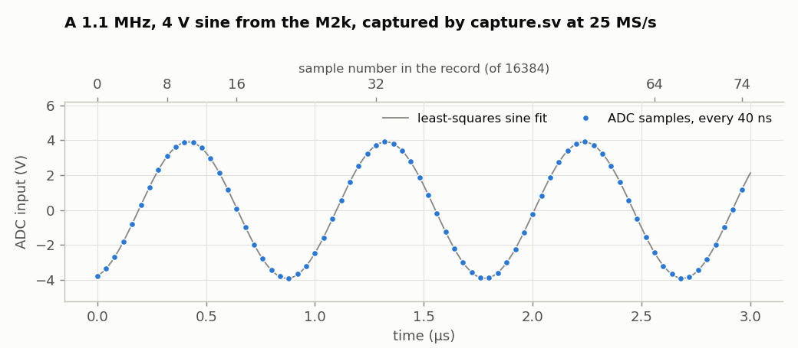
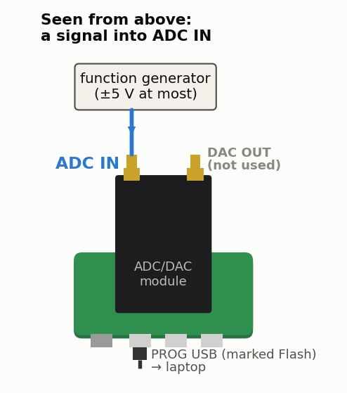
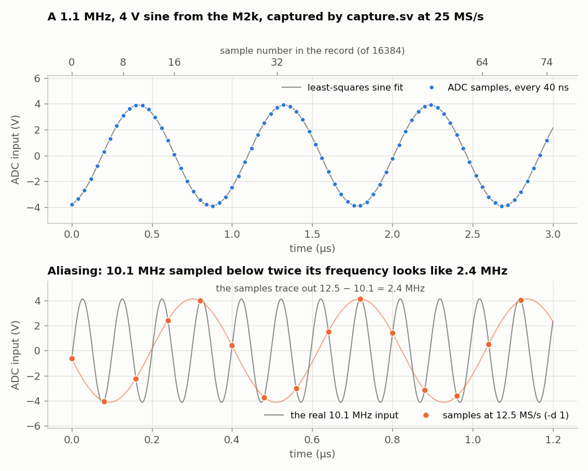

<!-- nav -->
[← 1.05 ADC samples to Python](1_05_adc_to_python.md#105-adc-samples-to-python) &emsp;&emsp;&emsp; **[Contents](../README.md#contents)** &emsp;&emsp;&emsp; [1.07 Closing the loop: the DAC talks to the ADC →](1_07_closing_the_loop.md#107-closing-the-loop-the-dac-talks-to-the-adc)

# 1.06 Fast captures



[1.05](1_05_adc_to_python.md#105-adc-samples-to-python) threw away 499 samples out of every 500. To see
what the ADC sees at its full 25 MS/s, record a burst of samples into the
FPGA's own memory as fast as they come, then send them to the laptop at the
serial port's leisurely pace. Every fast digitizer has to make this choice:
a very fast link to the computer, short bursts, or doing the processing on
the FPGA and sending only answers. This section does bursts; the lock-in of
[1.08](1_08_lockin.md#108-a-lock-in-amplifier) does the processing.

## Three new pieces

**Block RAM.** `logic [7:0] mem [0:16383]` is 16 kB of memory. Yosys notices
that it's only ever written and read one address at a time, and maps it onto
8 of the chip's 56 block RAMs instead of 131,072 flip-flops.

**The serial receiver.** The laptop needs to say "go", so this design uses
`uart_rx` from [`uart.sv`](../src/verilog/uart.sv) too. The receiver shows a
pattern you'll meet again. `rx` comes from a chip with its own clock, so it
can change at any moment, including exactly on our clock edge. That can leave
a flip-flop undecided for a while (*[metastability](https://en.wikipedia.org/wiki/Metastability_(electronics))*). Two flip-flops in a row
give it a full clock period to settle before anything depends on it.

**A [state machine](https://en.wikipedia.org/wiki/Finite-state_machine).** The design is always in one of three *states*, and what
it does on each clock depends on which:

* in `IDLE` it waits for a command,
* in `RECORD` it stores samples,
* in `SEND` it sends them.

`typedef enum logic [1:0] {IDLE, RECORD, SEND} state_t;` gives the states
names, so the code says `state <= SEND` instead of `state <= 2`.

## The design

<!-- file: src/verilog/capture.sv -->
```systemverilog
// capture.sv -- record 2^14 = 16384 ADC samples into memory at up to 25 MS/s,
// then send them to the laptop over the serial port.
//
// The laptop sends one character, the hex digit D ("0".."9" or "a".."f", meaning
// 0..15).  The FPGA then keeps every 2^D-th sample of the 25 MS/s ADC stream
// -- a sample rate of 25 MHz / 2^D -- until its memory is full, and sends the
// 16384 samples back as 16384 raw bytes at 1,000,000 baud (about 0.16 s).
// capture.py does the laptop side.
//
// LEDs (with the USB connectors facing down):
//   the left three LEDs show the ADC's top 3 bits (MSB on the left), then
//   led[1] = sending, and
//   led[0] = recording, on the right

module capture (
    input  logic       clk,         // 50 MHz
    input  logic [7:0] adc_d,
    output logic       adc_clk,
    input  logic       uart_rx,
    output logic       uart_tx,
    output logic [4:0] led
);
    localparam N = 16384;

    // ---- the ADC: clock it at 25 MHz and grab each sample (as in adc_leds.sv)
    logic       adc_clk_r  = 0;
    logic       new_sample = 0;     // high for one clk when `sample` is new
    logic [7:0] sample     = 0;

    always_ff @(posedge clk) begin
        adc_clk_r  <= ~adc_clk_r;
        new_sample <= 0;
        if (adc_clk_r == 0) begin   // adc_clk is about to rise
            sample     <= adc_d;
            new_sample <= 1;
        end
    end
    assign adc_clk = adc_clk_r;

    // ---- the serial port, both directions (see uart.sv) ---------------------
    logic [7:0] rx_data;
    logic       rx_valid;
    logic [7:0] tx_data  = 0;
    logic       tx_start = 0;
    logic       tx_busy;

    uart_rx #(.CLKS_PER_BIT(50)) rx (.clk(clk), .rx(uart_rx),
                                     .data(rx_data), .valid(rx_valid));
    uart_tx #(.CLKS_PER_BIT(50)) tx (.clk(clk), .data(tx_data), .start(tx_start),
                                     .busy(tx_busy), .tx(uart_tx));

    // ---- memory: 16384 bytes, which Yosys puts in the FPGA's block RAM -------
    logic [7:0]  mem [0:N-1];
    logic [13:0] addr = 0;          // 14 bits: counts 0..16383, then wraps to 0

    // ---- what we're doing now: the state machine's three states --------------
    typedef enum logic [1:0] {IDLE, RECORD, SEND} state_t;
    state_t      state = IDLE;
    logic [3:0]  D     = 0;         // keep 1 sample in 2^D
    logic [15:0] skip  = 0;         // samples still to skip before keeping one

    always_ff @(posedge clk) begin
        tx_start <= 0;
        case (state)
            IDLE:
                // Only a hex digit starts a capture.  Anything else is ignored --
                // including the junk byte the FT231X can produce when the laptop
                // opens the port.
                if (rx_valid && ((rx_data >= "0" && rx_data <= "9") ||
                                 (rx_data >= "a" && rx_data <= "f"))) begin
                    D     <= (rx_data <= "9") ? rx_data - "0" : rx_data - "a" + 10;
                    skip  <= 0;
                    addr  <= 0;
                    state <= RECORD;
                end
            RECORD:
                if (new_sample) begin
                    if (skip == 0) begin
                        // ######################################################
                        // ##  KEY LINE: store the sample, move to the next address.
                        // ######################################################
                        mem[addr] <= sample;
                        addr  <= addr + 1;
                        skip  <= (16'd1 << D) - 1;
                        if (addr == N - 1)     // that was the last one
                            state <= SEND;     // (addr wraps back to 0)
                    end else
                        skip <= skip - 1;
                end
            SEND:
                if (!tx_busy && !tx_start) begin
                    // ##########################################################
                    // ##  KEY LINE: the UART is free: send the next stored byte.
                    // ##########################################################
                    tx_data  <= mem[addr];
                    tx_start <= 1;
                    addr     <= addr + 1;
                    if (addr == N - 1)
                        state <= IDLE;
                end
        endcase
    end

    assign led = {sample[7:5], state == SEND, state == RECORD};
endmodule
```

The `case` statement says what happens in each state on each clock. Notice
that `mem[addr] <= sample` and `tx_data <= mem[addr]` are the *only* ways the
memory is touched: one write port and one read port, which is what lets Yosys
use a block RAM.

The command is a single hex digit, `D`. The FPGA keeps one sample in every
2<sup>D</sup>, so the sample rate is 25 MS/s ÷ 2<sup>D</sup>: 16384 samples
cover 655 µs at D = 0 and 21 s at D = 15.

<details>
<summary><b>Detail:</b> why a hex digit, and not simply the byte D?</summary>

Because just *opening* the serial port briefly pulls the FT231X's transmit
line low. The FPGA's receiver reads that as a start bit followed by all ones:
the byte 0xFF. So 0xFF can't be a valid command, and accepting only `0`–`9`
and `a`–`f` makes the glitch harmless.

</details>

## Simulate it first

Hardware is slow to debug: all you can see is pins. A *testbench* is
SystemVerilog that wraps your design in a fake world and runs on your laptop,
in the Icarus Verilog simulator. This one plays both the ADC, which counts up
by one on every clock edge, 25 ns late like the real one, and the laptop,
which sends `0` and checks that the samples coming back count up too:

<!-- file: src/verilog/capture_tb.sv -->
```systemverilog
// capture_tb.sv -- simulate capture.sv with no hardware at all.
//
// A fake ADC counts up by one on every rising edge of adc_clk, with the
// AD9280's 25 ns output delay, and the testbench plays the laptop: it sends "0"
// and checks that the samples coming back count up by one too.
//
//   make sim-capture
//   (or: iverilog -g2012 -o capture_tb.vvp capture_tb.sv capture.sv uart.sv && vvp capture_tb.vvp)
`timescale 1ns/1ps
module capture_tb;
    logic clk = 0;
    always #10 clk = ~clk;                          // 50 MHz: flip every 10 ns

    logic [7:0] adc = 0;
    logic       adc_clk, tx;
    logic       rx = 1;
    logic [4:0] led;
    always @(posedge adc_clk) adc <= #25 adc + 1;   // a ramp, 25 ns late like the real ADC

    // the design under test ("dut"), wired to the fake world
    capture dut (.clk(clk), .adc_d(adc), .adc_clk(adc_clk),
                 .uart_rx(rx), .uart_tx(tx), .led(led));

    // play the laptop: send one character at 1 Mbaud (1 us per bit)
    task automatic send(input logic [7:0] c);
        rx = 0; #1000;                                  // start bit
        for (int b = 0; b < 8; b++) begin rx = c[b]; #1000; end
        rx = 1; #1000;                                  // stop bit
    endtask

    // ...and listen: receive each byte the FPGA sends, and check it
    int n = 0, errors = 0;
    logic [7:0] c, prev;
    always @(negedge tx) begin                      // the start bit has begun
        #1500;                                      // to the middle of data bit 0
        for (int b = 0; b < 8; b++) begin c[b] = tx; #1000; end
        if (n < 8) $display("%t ns  sample %0d = %0d", $time / 1000, n, c);
        if (n > 0 && c != prev + 8'd1) errors = errors + 1;
        prev = c;
        n = n + 1;
    end

    initial begin
        #5000;
        send("0");                                  // capture at full rate
        #1_000_000;                                 // recording + the first ~30 bytes back
        $display("%0d samples received, %0d not one more than the one before", n, errors);
        $finish;
    end
endmodule
```

Testbenches use parts of the language that don't make hardware: `#1000`
waits 1000 ns, `$display` prints, and `initial` blocks run once, top to
bottom, like a program.

```console
$ make sim-capture
   679000 ns  sample 0 = 109
   689000 ns  sample 1 = 110
   ...
34 samples received, 0 not one more than the one before
```

The first sample is 109, not 0, because the fake ADC has been counting since
time zero, and the capture starts only once the command has arrived. Only 34
samples come back because the simulation stops after 1 ms of simulated time;
sending all 16384 would take 0.16 s.

## The laptop side

<details>
<summary>The whole file: <code>capture.py</code></summary>

<!-- file: src/verilog/capture.py -->
```python
#!/usr/bin/env python3
"""1.06, the laptop side: ask capture.sv for 16384 ADC samples and plot them.

    python3 capture.py            # 25 MS/s
    python3 capture.py -d 4       # 25 MS/s / 2^4 = 1.5625 MS/s
    python3 capture.py -d 4 -o scope.csv --no-plot
"""
import argparse
import time

import numpy as np
import serial                        # pip install pyserial

N = 16384
FS_MAX = 25e6                        # the ADC runs at 50 MHz / 2


def find_port():
    """The first FTDI FT231X serial port (USB ID 0403:6015): the Icepi Zero's."""
    from serial.tools import list_ports
    for p in list_ports.comports():
        if (p.vid, p.pid) == (0x0403, 0x6015):
            return p.device
    raise SystemExit("No Icepi Zero found. Is it plugged in? (Or give --port.)")


def capture(port, d):
    """Returns (time in seconds, ADC codes 0..255)."""
    with serial.Serial(port, 1_000_000, timeout=2) as ser:
        time.sleep(0.05)                 # let the line settle after opening,
        ser.reset_input_buffer()         # and throw away anything stale
        # ######################################################################
        # ##  KEY LINES: send the command (one hex digit), then read back
        # ##  16384 bytes: one byte per sample.
        # ######################################################################
        ser.write(b"%x" % d)             # D as one hex digit: b"0" .. b"f"
        raw = ser.read(N)
    if len(raw) != N:
        raise RuntimeError(f"got {len(raw)} of {N} bytes -- is capture.bit loaded?")
    fs = FS_MAX / 2**d
    return np.arange(N) / fs, np.frombuffer(raw, dtype=np.uint8)


if __name__ == "__main__":
    ap = argparse.ArgumentParser(description=__doc__,
                                 formatter_class=argparse.RawDescriptionHelpFormatter)
    ap.add_argument("-d", type=int, default=0, help="keep 1 sample in 2^d (0..15)")
    ap.add_argument("--port", help="serial port (default: find the Icepi Zero)")
    ap.add_argument("-o", "--out", help="save time,code to this CSV file")
    ap.add_argument("--no-plot", action="store_true")
    args = ap.parse_args()

    t0 = time.time()
    t, code = capture(args.port or find_port(), args.d)
    print(f"{N} samples at {FS_MAX / 2**args.d / 1e6:g} MS/s in {time.time() - t0:.2f} s; "
          f"codes {code.min()}..{code.max()}, mean {code.mean():.1f}")
    if args.out:
        np.savetxt(args.out, np.column_stack([t, code]), delimiter=",",
                   header="time_s,adc_code", fmt=["%.9g", "%d"])
    if not args.no_plot:
        import matplotlib.pyplot as plt
        plt.plot(t * 1e6, code, ".-", markersize=3, linewidth=0.5)
        plt.xlabel("time (µs)")
        plt.ylabel("ADC code (0..255)")
        plt.grid(True)
        plt.show()
```

</details>



A function generator goes into ADC IN, the left-hand SMA with the USB
connectors toward you. (`capture.sv` leaves the DAC alone, so with the
loopback cable still in from [1.05](1_05_adc_to_python.md#105-adc-samples-to-python)
you'll see a flat line, not a signal. Plug the generator in, or wait for
[1.07](1_07_closing_the_loop.md#107-closing-the-loop-the-dac-talks-to-the-adc),
where the DAC plays something.)

```console
$ make load-capture
$ python3 capture.py                 # 25 MS/s, plots codes vs time
16384 samples at 25 MS/s in 0.23 s; codes 28..226, mean 126.8
$ python3 capture.py -d 4 -o slow.csv --no-plot
16384 samples at 1.5625 MS/s in 0.24 s; codes 28..226, mean 126.8
```

Here's a 4 V, 1.1 MHz sine from the generator, converted to volts with the
calibration from [0.00](0_00_the_hardware.md#000-the-hardware):



The lower panel is the [sampling theorem](https://en.wikipedia.org/wiki/Nyquist%E2%80%93Shannon_sampling_theorem) in action. At 12.5 MS/s (`-d 1`) the
[Nyquist frequency](https://en.wikipedia.org/wiki/Nyquist_frequency) is 6.25 MHz, and a 10.1 MHz input is indistinguishable
from 12.5 − 10.1 = 2.4 MHz: the samples lie exactly on the real waveform
(grey) and trace out the alias (orange). Nothing in the digital data can tell
the two apart. That's why real digitizers put an *anti-aliasing* low-pass
filter in front of the ADC. There's none on this module and none was added:
[aliasing](https://en.wikipedia.org/wiki/Aliasing) is easier to respect once it has bitten you, and
[1.08](1_08_lockin.md#108-a-lock-in-amplifier)'s Try this and
[1.10](1_10_am_radio.md#110-an-am-radio) put it to work.

<details>
<summary><b>Detail:</b> what would it take to hook the ADC to an antenna and capture all the radio around you?</summary>

At 25 MS/s, the ADC sees everything from 0 to 12.5 MHz at once. That band is
full of radio: AM broadcasting (0.53–1.7 MHz), shortwave broadcasting from
other continents (the 49, 41, 31 and 25 m bands, around 6, 7.3, 9.6 and
11.8 MHz), radio amateurs (1.8, 3.5, 7 and 10.1 MHz), and the [WWV](https://en.wikipedia.org/wiki/WWV_(radio_station)) time
signals from Colorado at 2.5, 5 and 10 MHz. Cell phones, Wi-Fi and FM radio
are 8 to 500 times higher in frequency, out of reach without a mixer that
moves them down first (which is what an RTL-SDR dongle's tuner chip does).

Four things stand between a wire and a picture of all of it:

1. **Gain.** One ADC code is 39 mV. A few metres of wire gives most stations
   microvolts to millivolts, all of it below one code; only a strong local AM
   station might show up unaided. An amplifier with 20 to 40 dB of gain
   (a *[low-noise amplifier](https://en.wikipedia.org/wiki/Low-noise_amplifier)*, LNA, for 0.1–30 MHz) brings them up.
2. **A low-pass filter.** Without one, everything above 12.5 MHz (FM radio,
   TV, the noise of every computer in the room) folds back on top of the band
   you want, exactly as the 10.1 MHz sine did above. A 7-pole LC filter at
   about 11 MHz, home-made or bought, goes between the antenna and the LNA.
3. **Somewhere to put 200 Mbit/s.** The ADC makes 25 million bytes a second;
   the serial port carries 100 thousand. So either capture bursts, as this
   page does, and look at their spectrum ([1.09](1_09_spectrum_analyzer.md#109-a-spectrum-analyzer) does this), or do the work in
   the FPGA and send only the answer: an FFT spectrum (also [1.09](1_09_spectrum_analyzer.md#109-a-spectrum-analyzer)), or one
   station, picked out by multiplying by cos and −sin as the lock-in does,
   filtered, and sent as audio through [1.05](1_05_adc_to_python.md#105-adc-samples-to-python)'s stream. That last one is an AM
   radio receiver, entirely in logic.
4. **Dynamic range.** 8 bits is about 48 dB between the biggest signal that
   fits and one code. A strong station sets the gain, and anything 50 dB
   weaker is lost under it. (An FFT gains back some: each bin of a
   16384-point FFT has about 39 dB less noise than the whole band.) Serious
   receivers for this band use 14- or 16-bit ADCs.

The antenna itself is the easy part: 5 to 20 m of wire, as high as you can
get it, outdoors if possible, because indoors at these frequencies is full
of noise from switching power supplies and LED lamps. A long wire collects
static, so give it a 1 MΩ resistor to ground at the SMA, and never connect
it during a thunderstorm.

None of this has been tried with this board yet. It's a good project.

</details>

**Try this:**

- Measure the ADC's calibration yourself: DC in from a power supply at several
  voltages, `capture.py`, and fit code against volts.
- Fit a sine to a capture (as in the figure) and compute the residual. How
  many *effective* bits does this 8-bit ADC have? (Ideal quantization noise
  is 1/√12 of a code, rms.) How does it change between 100 kHz and 10 MHz?
- Add a trigger: in `RECORD`, don't start filling memory until the sample
  crosses mid-scale going upward, so that repeated captures line up like a
  scope's.

<!-- nav -->
[← 1.05 ADC samples to Python](1_05_adc_to_python.md#105-adc-samples-to-python) &emsp;&emsp;&emsp; **[Contents](../README.md#contents)** &emsp;&emsp;&emsp; [1.07 Closing the loop: the DAC talks to the ADC →](1_07_closing_the_loop.md#107-closing-the-loop-the-dac-talks-to-the-adc)

<!-- author -->
<sub>Jason Gallicchio, jason@hmc.edu, Harvey Mudd College</sub>
