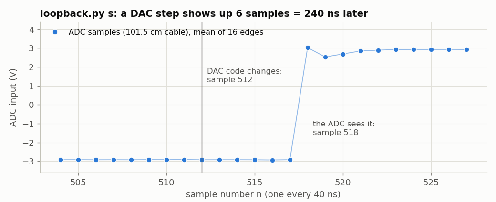
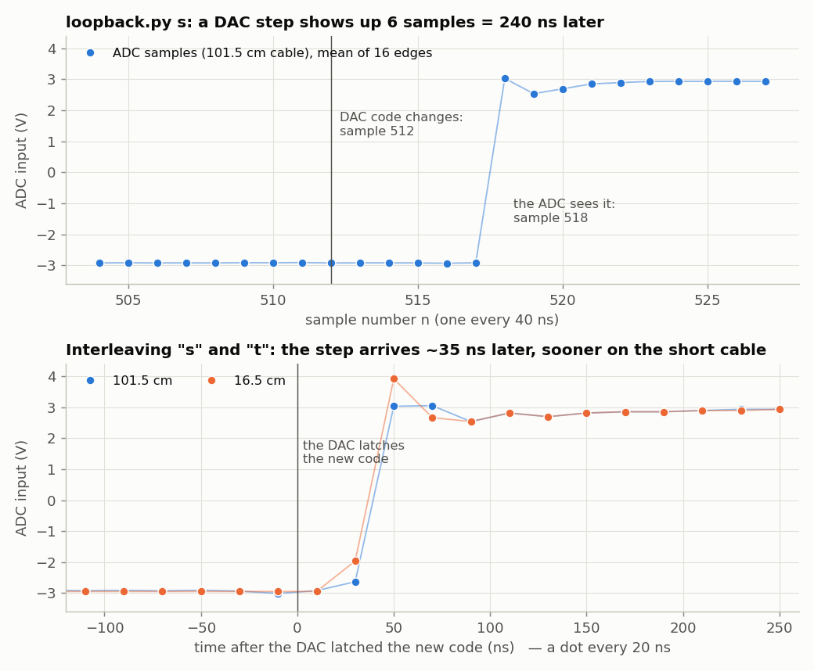
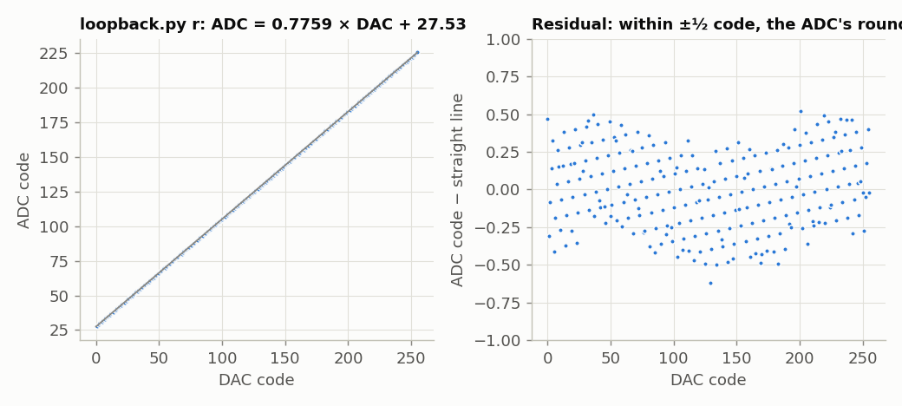
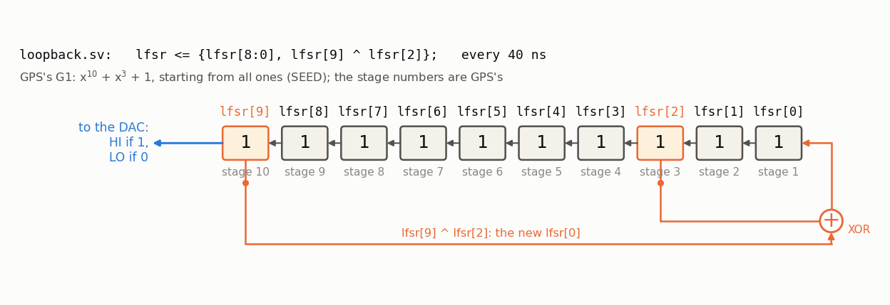
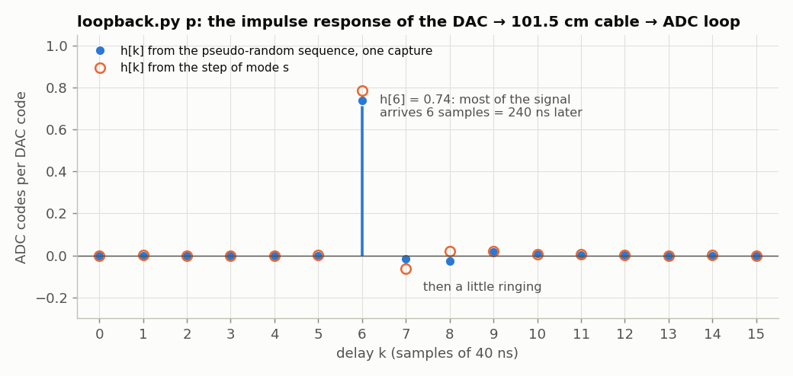

<!-- nav -->
[← 1.06 Fast captures](1_06_fast_capture.md#106-fast-captures) &emsp;&emsp;&emsp; **[Contents](../README.md#contents)** &emsp;&emsp;&emsp; [1.08 A lock-in amplifier →](1_08_lockin.md#108-a-lock-in-amplifier)

# 1.07 Closing the loop: the DAC talks to the ADC



Connect the DAC output to the ADC input with a coax cable. (The measurements
here used two RG-316 cables, 101.5 cm and 16.5 cm long.) `loopback.sv` is
`capture.sv` plus a DAC that plays a pattern tied to the sample counter `n`.
The recording always starts at `n` = 0, so you know exactly which sample each
DAC change happened at, and you can watch it come back into the ADC: scaled,
shifted, and late. By how much is what this section measures.

<!-- file: src/verilog/loopback.sv -->
```systemverilog
// loopback.sv -- the DAC talks to the ADC: record your own signal coming back.
//
// Wire the DAC output to the ADC input with a cable.  As in capture.sv, the laptop
// sends one character and gets back 16384 ADC samples (25 MS/s) as raw bytes at
// 1,000,000 baud.  Meanwhile the DAC plays a pattern locked to the sample
// counter n, so we know exactly which sample each DAC change happened at:
//
//   "s"  square wave: low for n = 0..511, high for n = 512..1023, repeating
//   "t"  the same square wave, but every DAC change happens 20 ns (half a
//        sample) later -- interleave "s" and "t" for 50 MS/s "equivalent time"
//   "r"  a staircase: DAC code k for n = 64k .. 64k+63, k = 0..255
//   "p"  pseudo-random: HI or LO for each sample, from a 10-bit LFSR (an
//        m-sequence, period 1023), restarted from the same seed at n = 0.
//        It's G1, the register in every GPS satellite (x^10 + x^3 + 1, from all ones)
//
// The recording always starts at n = 0, so sample i of the record is n = i.

module loopback (
    input  logic       clk,         // 50 MHz
    input  logic [7:0] adc_d,
    output logic       adc_clk,
    output logic [7:0] dac_d = 32,  // = LO, below
    output logic       dac_clk,
    input  logic       uart_rx,
    output logic       uart_tx,
    output logic [4:0] led
);
    localparam N = 16384;
    localparam logic [7:0] LO = 8'd32, HI = 8'd224;    // the square wave: about -2.97 V and +2.93 V

    // ---- the ADC, as in capture.sv, plus a sample counter n --------------------
    logic        adc_clk_r  = 0;
    logic        new_sample = 0;
    logic [7:0]  sample     = 0;
    logic [13:0] n          = 0;    // 14 bits: counts 0..16383 and wraps
    always_ff @(posedge clk) begin
        adc_clk_r  <= ~adc_clk_r;
        new_sample <= 0;
        if (adc_clk_r == 0) begin
            sample     <= adc_d;
            n          <= n + 1;    // n and sample change together
            new_sample <= 1;
        end
    end
    assign adc_clk = adc_clk_r;

    // ---- the pseudo-random sequence: x^10 + x^3 + 1, one step per sample ---------
    // GPS's G1: shift left, feed stage 3 xor stage 10 back into stage 1, and
    // play stage 10 (stage k is lfsr[k-1]).  Like GPS, start from all ones.
    localparam logic [9:0] SEED = 10'h3ff;
    logic [9:0] lfsr = SEED;
    always_ff @(posedge clk)
        if (adc_clk_r == 0)                         // same edge as n
            lfsr <= (n == 14'h3fff) ? SEED : {lfsr[8:0], lfsr[9] ^ lfsr[2]};

    // ---- the DAC: a pattern computed from n ------------------------------------
    logic [1:0]  mode   = 0;                        // 0 = "s", 1 = "t", 2 = "r", 3 = "p"
    logic [13:0] n_late = 0;                        // n, one clock (20 ns) later
    always_ff @(posedge clk) n_late <= n;
    logic [13:0] m;
    assign m = (mode == 1) ? n_late : n;
    always_ff @(posedge clk)
        // ######################################################################
        // ##  KEY LINE: the DAC's value is a function of the sample number n,
        // ##  so every change happens at a known sample of the recording.
        // ######################################################################
        dac_d <= (mode == 2) ? m[13:6] :                // staircase: n / 64
                 (mode == 3) ? (lfsr[9] ? HI : LO) :    // pseudo-random
                               (m[9] ? HI : LO);        // square: bit 9 of n flips every 512
    assign dac_clk = ~clk;

    // ---- the serial port ---------------------------------------------------------
    logic [7:0] rx_data;
    logic       rx_valid;
    logic [7:0] tx_data  = 0;
    logic       tx_start = 0;
    logic       tx_busy;
    uart_rx #(.CLKS_PER_BIT(50)) rx (.clk(clk), .rx(uart_rx),
                                     .data(rx_data), .valid(rx_valid));
    uart_tx #(.CLKS_PER_BIT(50)) tx (.clk(clk), .data(tx_data), .start(tx_start),
                                     .busy(tx_busy), .tx(uart_tx));

    // ---- record 16384 samples, starting at n = 0, then send them ---------------
    logic [7:0]  mem [0:N-1];
    logic [13:0] addr = 0;
    typedef enum logic [1:0] {IDLE, WAIT, RECORD, SEND} state_t;
    state_t      state  = IDLE;
    logic [21:0] settle = 0;                        // let the new pattern run a while first

    always_ff @(posedge clk) begin
        tx_start <= 0;
        case (state)
            IDLE:
                if (rx_valid && (rx_data == "s" || rx_data == "t" ||
                                 rx_data == "r" || rx_data == "p")) begin
                    mode   <= (rx_data == "s") ? 0 : (rx_data == "t") ? 1 :
                              (rx_data == "r") ? 2 : 3;
                    settle <= '1;                   // all ones: 2^22 clocks = 84 ms
                    state  <= WAIT;
                end
            WAIT:                                   // settle, then wait for n = 0
                if (settle != 0)
                    settle <= settle - 1;
                else if (new_sample && n == 0) begin
                    mem[0] <= sample;
                    addr   <= 1;
                    state  <= RECORD;
                end
            RECORD:
                if (new_sample) begin
                    mem[addr] <= sample;            // sample i was taken with n = i
                    addr <= addr + 1;
                    if (addr == N - 1)
                        state <= SEND;
                end
            SEND:
                if (!tx_busy && !tx_start) begin
                    tx_data  <= mem[addr];
                    tx_start <= 1;
                    addr     <= addr + 1;
                    if (addr == N - 1)
                        state <= IDLE;
                end
        endcase
    end

    assign led = {sample[7:5], state == SEND, state == RECORD};
endmodule
```

<details>
<summary>The laptop side: <code>loopback.py</code></summary>

<!-- file: src/verilog/loopback.py -->
```python
#!/usr/bin/env python3
"""1.07, the laptop side of loopback.sv: record the DAC's pattern coming back through the ADC.

    python3 loopback.py s          # square wave: plot one rising edge
    python3 loopback.py r          # staircase: plot ADC code against DAC code
    python3 loopback.py p          # pseudo-random: the loop's impulse response
    python3 loopback.py s -o sq.csv --no-plot

Needs a cable from the DAC output to the ADC input.
"""
import argparse
import time

import numpy as np
import serial

N = 16384


def find_port():
    """The first FTDI FT231X serial port (USB ID 0403:6015): the Icepi Zero's."""
    from serial.tools import list_ports
    for p in list_ports.comports():
        if (p.vid, p.pid) == (0x0403, 0x6015):
            return p.device
    raise SystemExit("No Icepi Zero found. Is it plugged in? (Or give --port.)")


def record(port, mode):
    """mode is "s", "t", "r" or "p".  Returns ADC codes; sample i was taken at n = i."""
    with serial.Serial(port, 1_000_000, timeout=2) as ser:
        time.sleep(0.05)
        ser.reset_input_buffer()
        ser.write(mode.encode())
        raw = ser.read(N)
    if len(raw) != N:
        raise RuntimeError(f"got {len(raw)} of {N} bytes -- is loopback.bit loaded?")
    return np.frombuffer(raw, dtype=np.uint8).astype(int)


if __name__ == "__main__":
    ap = argparse.ArgumentParser(description=__doc__,
                                 formatter_class=argparse.RawDescriptionHelpFormatter)
    ap.add_argument("mode", choices=["s", "t", "r", "p"])
    ap.add_argument("--port", help="serial port (default: find the Icepi Zero)")
    ap.add_argument("-o", "--out", help="save sample,code as CSV")
    ap.add_argument("--no-plot", action="store_true")
    args = ap.parse_args()

    code = record(args.port or find_port(), args.mode)
    i = np.arange(N)
    if args.out:
        np.savetxt(args.out, np.column_stack([i, code]), delimiter=",",
                   header="sample,adc_code", fmt="%d")

    if args.mode in "st":
        # the DAC stepped up at n = 512, 1536, ...: average all 16 rising edges
        edges = code.reshape(16, 1024).mean(axis=0)
        half = (edges[:512].mean() + edges[512:].mean()) / 2
        first = 512 + np.argmax(edges[512:] > half)
        print(f"the DAC stepped up at sample 512; the ADC crossed half-way at sample {first}")
        if not args.no_plot:
            import matplotlib.pyplot as plt
            plt.plot(np.arange(500, 540), edges[500:540], "o-")
            plt.axvline(512, color="gray")
            plt.xlabel("sample (40 ns each)")
            plt.ylabel("ADC code, averaged over 16 edges")
            plt.grid(True)
            plt.show()
    elif args.mode == "p":
        # The same m-sequence loopback.sv plays: GPS's G1, x^10 + x^3 + 1, from all ones, +-1
        M, state, x = 1023, 0x3FF, []
        for _ in range(M):
            x.append(1.0 if state & 0x200 else -1.0)
            state = ((state << 1) | (((state >> 9) ^ (state >> 2)) & 1)) & 0x3FF
        x = np.array(x)
        # skip the first period (the sequence restarted at n = 0), average the rest
        y = code[M:16 * M].reshape(15, M).mean(axis=0)
        # circular cross-correlation with the stimulus = the impulse response,
        # because an m-sequence's autocorrelation is (almost) a delta function
        # ######################################################################
        # ##  KEY LINE: cross-correlate what came back with what was sent.
        # ######################################################################
        r = np.real(np.fft.ifft(np.fft.fft(y - y.mean()) * np.conj(np.fft.fft(x)))) / (M + 1)
        h = r / ((224 - 32) / 2)                   # ADC codes per DAC code
        print("impulse response, ADC codes per DAC code, delays 0..11 samples:")
        print(np.round(h[:12], 3))
        if not args.no_plot:
            import matplotlib.pyplot as plt
            plt.stem(np.arange(20), h[:20])
            plt.xlabel("delay (samples of 40 ns)")
            plt.ylabel("h (ADC codes per DAC code)")
            plt.grid(True)
            plt.show()
    else:
        # DAC code k for samples 64k .. 64k+63: skip the first 16 of each while it settles
        steps = code.reshape(256, 64)[:, 16:].mean(axis=1)
        print("ADC code at DAC codes 0, 128, 255: %.2f %.2f %.2f" % (steps[0], steps[128], steps[255]))
        if not args.no_plot:
            import matplotlib.pyplot as plt
            plt.plot(np.arange(256), steps, ".")
            plt.xlabel("DAC code")
            plt.ylabel("ADC code")
            plt.grid(True)
            plt.show()
```

</details>

## How long is the round trip?

`make load-loopback`, then:

```console
$ python3 loopback.py s
the DAC stepped up at sample 512; the ADC crossed half-way at sample 518
```



The DAC changed at sample 512 and the ADC reports it at sample 518: **6
samples, 240 ns**, the same on all 16 edges of the record. That has two
answers to "how long does a new DAC value take to reach the ADC?" The signal
itself takes about **32 ns** to get from the DAC's output to the ADC's
sampling point, plus 4.6 ns per metre of cable. But from the FPGA writing a
DAC word to the FPGA reading the ADC's measurement of it takes **5 to 6 ADC
samples** (200–240 ns), and two thirds of that is the ADC's pipeline. For a
feedback loop built in the FPGA, those 6 samples are the delay that limits
how fast the loop can be ([4.08](4_08_feedback_control.md#408-feedback-control-of-an-rc-plant)).

<details>
<summary><b>Detail:</b> where the 240 ns go</summary>

From the datasheets, and from the measurements in this section and [1.08](1_08_lockin.md#108-a-lock-in-amplifier):

| | time |
| --- | --- |
| `n` becomes 512; `dac_d` takes the new code on the next clock edge | 20 ns |
| the DAC latches it on the rising edge of the inverted clock | 10 ns |
| **analog**: the DAC's output stage, the cable, the ADC's input amplifier and its 4 ns aperture delay | 32 ns, plus 4.6 ns per metre of RG-316 |
| waiting for the ADC's next sampling edge | 0–40 ns (here 13 ns) |
| the AD9280's pipeline (3 clock cycles, then 25 ns until the data is valid), read by the FPGA on the 4th clock edge | 160 ns |

</details>

<details>
<summary><b>Detail:</b> finer than one sample, and why the two cables differ</summary>

The ADC samples only every 40 ns, but the pattern repeats exactly, so you can
shift it and sample again. Mode `t` makes every DAC change 20 ns later.
Interleaving the `s` and `t` records (lower panel above) gives the step
response at 20 ns spacing: *equivalent-time sampling*, the trick behind every
sampling oscilloscope. The step arrives about 35 ns after the DAC latches it,
overshoots, and rings for ~100 ns. The short cable delivers it a few ns sooner
and with more overshoot, probably because the two cables load the DAC's
output differently at the tens-of-MHz frequencies that make up a fast edge.

</details>

## The whole transfer curve in one capture

Mode `r` plays DAC codes 0 to 255, 64 samples each:

```console
$ python3 loopback.py r
ADC code at DAC codes 0, 128, 255: 27.02 126.00 225.00
```



ADC = 0.776 × DAC + 27.5. The slope agrees within 0.3% with the two
calibrations in [0.00](0_00_the_hardware.md#000-the-hardware), which were made separately with an
external instrument: (30.7 mV/code) × (25.35 codes/V) = 0.778. The residual is
the ADC's rounding to whole codes and nothing more. Notice too that, with a
steady input, the ADC's output doesn't flicker at all: its noise is well below
one code.

## An impulse response from noise

Mode `p` plays a *pseudo-random* sequence: HI or LO for each sample, from a
10-bit *[linear-feedback shift register](https://en.wikipedia.org/wiki/Linear-feedback_shift_register)* (LFSR):



Each step shifts the register left one bit and feeds stage 3 XOR stage 10
back into stage 1: the polynomial x<sup>10</sup> + x<sup>3</sup> + 1. Ten bits have 1024
states. All zeros would stay all zeros forever, but this feedback takes the
register through all 1023 others before it comes back to where it started.
That makes an *[m-sequence](https://en.wikipedia.org/wiki/Maximum_length_sequence)*, 1023 samples long, as random-looking as it is
repeatable:


Its autocorrelation is (almost exactly) a delta function. So the
[cross-correlation](https://en.wikipedia.org/wiki/Cross-correlation) of the ADC's record with the sequence the DAC played *is*
the loop's [impulse response](https://en.wikipedia.org/wiki/Impulse_response).

This particular LFSR, started from all ones, is **G1, the shift register in
every GPS satellite**, used there for the same reason. A GPS receiver finds
each satellite, and how late its signal arrives, by cross-correlating what
it hears with a copy of the code, and a sharp autocorrelation peak means a
sharp time. (Each satellite XORs G1 with a second register's output, delayed
by an amount of its own, to make its personal 1023-chip *[C/A code](https://en.wikipedia.org/wiki/GPS_signals#Coarse/Acquisition_code)*: that's
how a receiver tells the satellites apart.)

```console
$ python3 loopback.py p
impulse response, ADC codes per DAC code, delays 0..11 samples:
[-0.001 -0.001 -0.001 -0.001 -0.001 -0.001  0.74  -0.018 -0.027  0.015
  0.009  0.003]
```



Nothing for 6 samples, then most of the signal at once, then a little
ringing. This is the cable loop as the FPGA sees it, sample by sample:
exactly what you need to design a digital controller or an equalizer around
it.


<details>
<summary><b>Detail:</b> a slightly non-linear loop</summary>

The circles are a check: the same impulse response, from mode `s` instead,
as the differences between successive samples of the averaged step. The two
nearly agree, but not quite (0.74 against 0.79 at *k* = 6). The
cross-correlation assumes the loop is *linear*: twice the input, twice the
output, and responses simply add. Through the 16.5 cm cable it is, and the
two methods agree to 1%. Through the 101.5 cm cable, a linear model of the
record leaves 11 codes rms unexplained, against 0.5 for the short cable: a
single LO between two HIs reads 66, where the step predicts 47, while a single
HI reads about what the step predicts. The cable itself is linear; what isn't
is an amplifier at one end of it, seeing the long cable's different load at
the tens of MHz in a fast edge, and treating a short dip differently from a
short pulse. Which amplifier, and why a dip, isn't known yet: a puzzle worth
chasing, and a reminder to check a method's assumptions with a second method.

</details>

<details>
<summary><b>Detail:</b> why this works, and a caution for the Fourier-minded</summary>

The cross-correlation of the output with the input is the impulse response
convolved with the input's autocorrelation. When that autocorrelation is a
delta function, what's left is the impulse response itself. That's the
[Wiener–Khinchin theorem](https://en.wikipedia.org/wiki/Wiener%E2%80%93Khinchin_theorem) put to work: an m-sequence has a flat spectrum, like
white noise, but it's perfectly repeatable.

The caution: the FFT of `h` is **not** the analog frequency response near
12.5 MHz. The sequence changes once per sample, so its spectrum at 25 MHz −
*f* folds onto *f* with comparable weight (equal at 12.5 MHz). The lock-in of [1.08](1_08_lockin.md#108-a-lock-in-amplifier), stepping a pure
sine, is the right tool for the analog response. (Below 1 MHz the two agree
within 1%; towards 12.5 MHz they part ways.)

</details>

**Try this:**

- Build an oscillator out of the loop: inverting feedback with a gain above
  1, `dac_d <= 128 - 2 * (sample - 128)` (clipped to 0..255), and record the
  result with `loopback.py`'s `record()`. Predict what you'll see from the
  6-sample delay first. (What you'll find: the pattern repeats every 12
  samples, but it isn't one oscillation. Each sample depends only on the one 6
  samples earlier, so you get *six independent oscillators*, interleaved. Feed
  back the average of the last 4 samples instead and they lock into one
  near-square wave at 1.685 MHz, a period of 14.8 samples. Can you predict that
  number?)
- Use the impulse response to cancel the ringing: send the DAC a
  pre-distorted step (an [FIR filter](https://en.wikipedia.org/wiki/Finite_impulse_response) that inverts `h`) and see how clean the
  edge gets.

<!-- nav -->
[← 1.06 Fast captures](1_06_fast_capture.md#106-fast-captures) &emsp;&emsp;&emsp; **[Contents](../README.md#contents)** &emsp;&emsp;&emsp; [1.08 A lock-in amplifier →](1_08_lockin.md#108-a-lock-in-amplifier)

<!-- author -->
<sub>Jason Gallicchio, jason@hmc.edu, Harvey Mudd College</sub>
