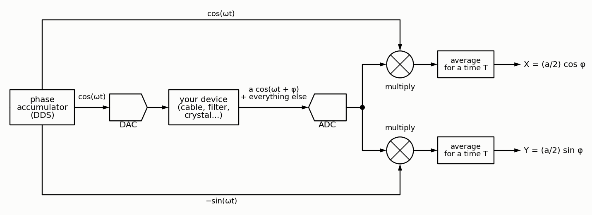
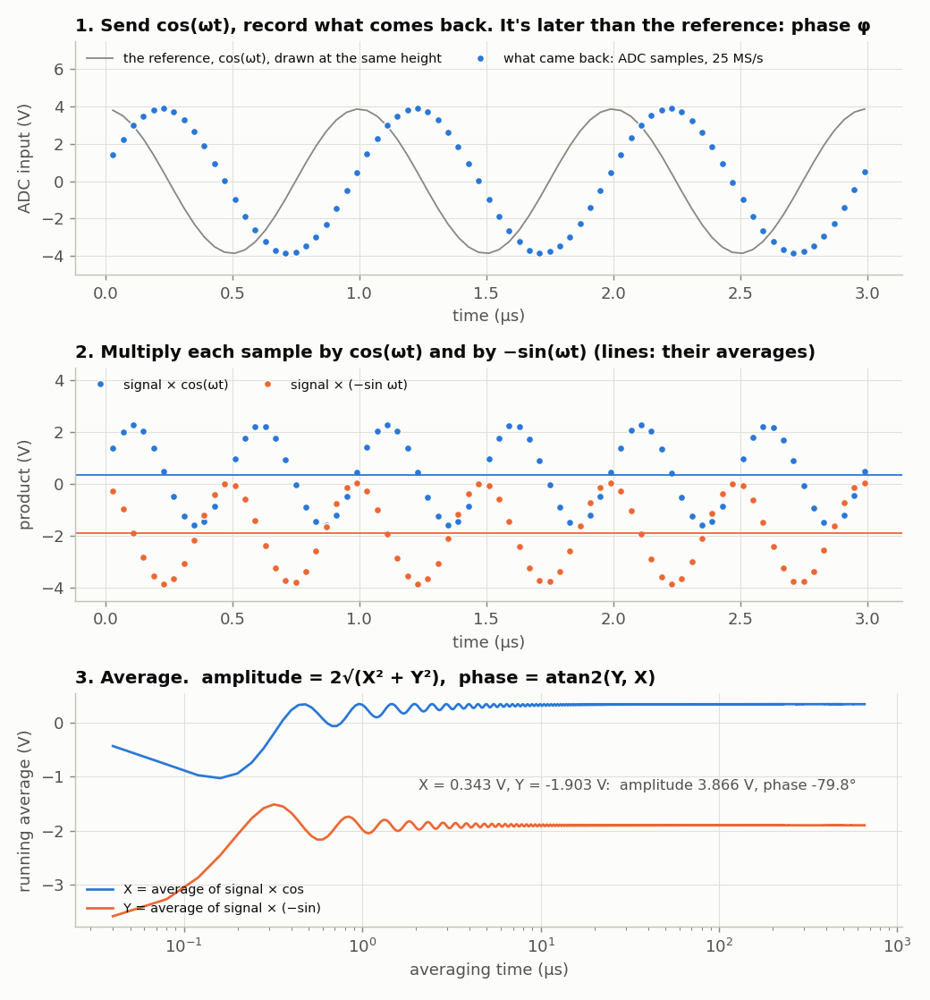
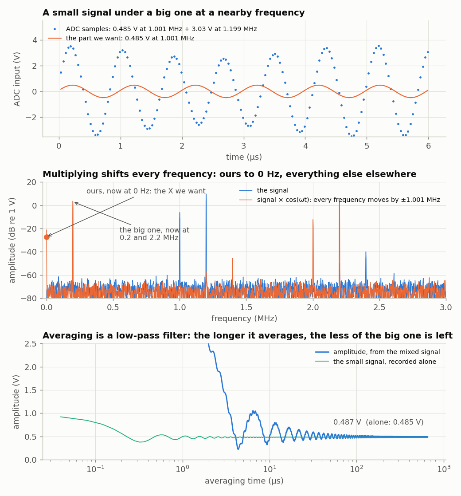
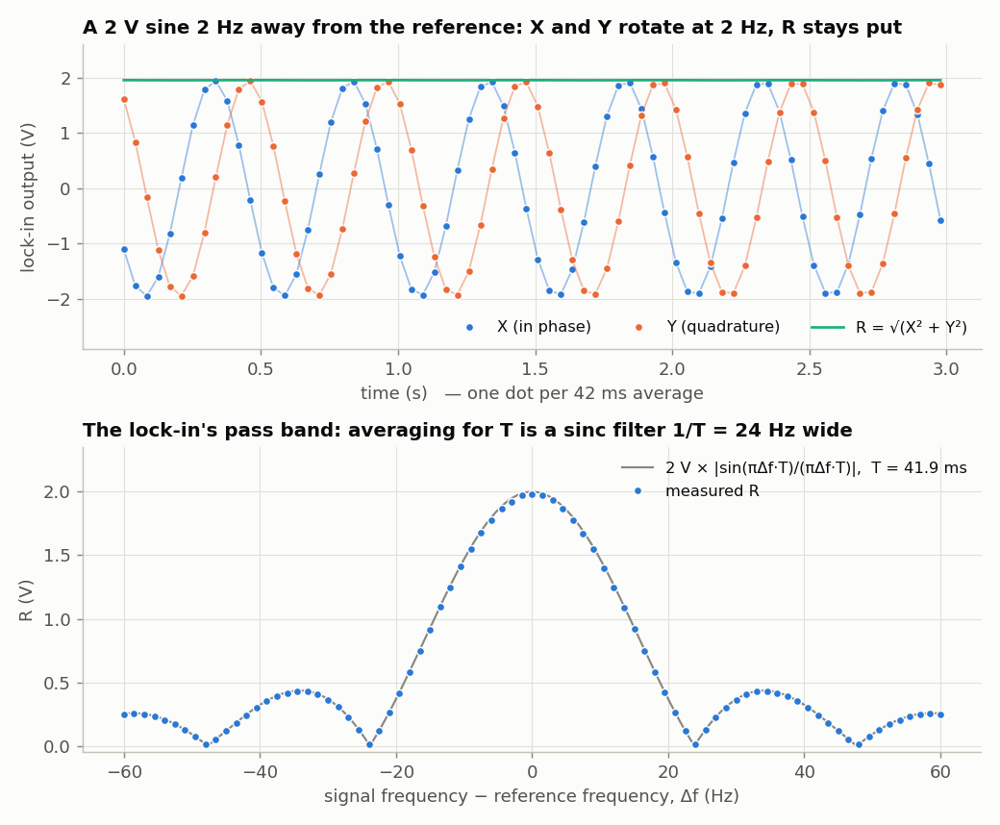
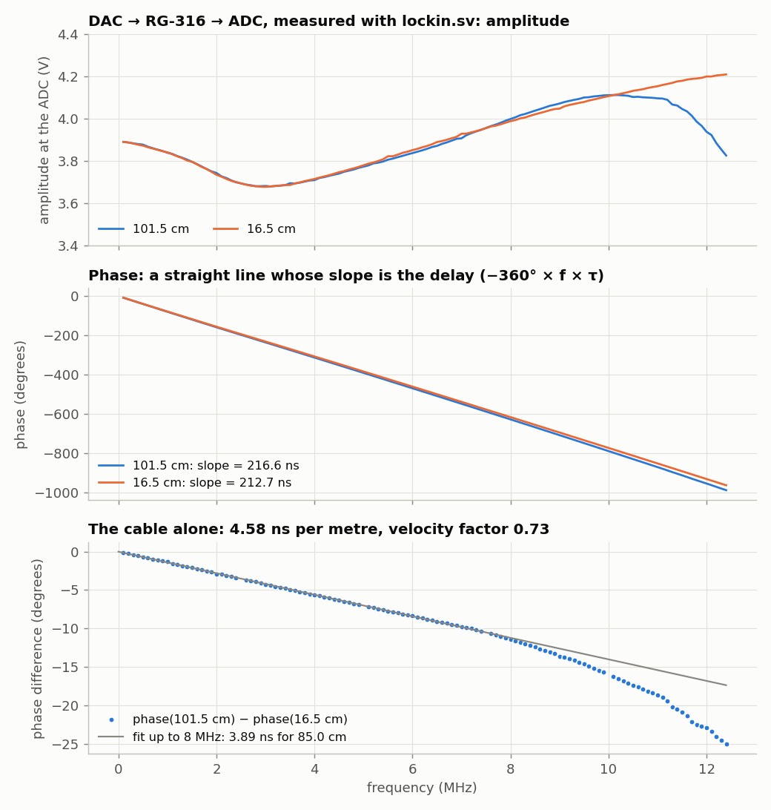
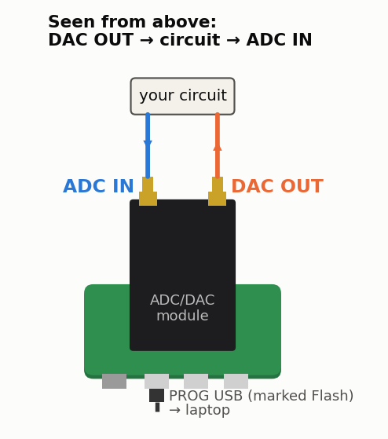

<!-- nav -->
[← 1.07 Closing the loop: the DAC talks to the ADC](1_07_closing_the_loop.md#107-closing-the-loop-the-dac-talks-to-the-adc) &emsp;&emsp;&emsp; **[Contents](../README.md#contents)** &emsp;&emsp;&emsp; [1.09 A spectrum analyzer →](1_09_spectrum_analyzer.md#109-a-spectrum-analyzer)

# 1.08 A lock-in amplifier



## The idea

Ask a circuit (a filter, a cable, a crystal, a sample) a simple question: *what
do you do to a sine at frequency f?* A linear circuit can only do two things
to it: change its amplitude, and delay it, which shows up as a phase shift φ.
Measure those two numbers at one frequency after another and you have the
circuit's frequency response, its [Bode plot](https://en.wikipedia.org/wiki/Bode_plot). An instrument that does this is a
*[network analyzer](https://en.wikipedia.org/wiki/Network_analyzer_(electrical))*. Its heart is the trick in this section, which works even
when the response is tiny, buried in noise, or sitting next to a much bigger
signal. The diagram at the top of this page is the whole instrument.

The DDS of [1.03](1_03_dac_sine.md#103-a-sine-direct-digital-synthesis) plays a sine wave through the DAC into the
device. Call it cos(ω*t*): which point of the cycle is *t* = 0 is up to us, and
a cosine makes the arithmetic below line up with complex numbers. What comes
back to the ADC is *a* cos(ω*t* + φ), plus noise, plus anything else that
happens to be there. The FPGA multiplies each sample of it by the cosine it
sent, and separately by −sin(ω*t*), the same wave a quarter turn on, and
averages each product for a time *T*. Here's that arithmetic done on real samples, through the
101.5 cm cable of [1.07](1_07_closing_the_loop.md#107-closing-the-loop-the-dac-talks-to-the-adc), at 1.001 MHz:



1. The response comes back as big as it went out (the cable doesn't lose
   much) but later: the dots lag the grey reference by φ = −79.8°. That's about
   220 ns: the time it takes to get through the DAC, the cable and the ADC.
2. Multiply sample by sample. Each product wiggles at twice the frequency,
   2ω, but not around zero: around a steady value, the line.
3. Average, and the wiggles cancel, leaving the steady values: X = 0.343 V
   and Y = −1.903 V.

Why the steady values are what we want is one trig identity,
cos *A* cos *B* = ½[cos(*A* − *B*) + cos(*A* + *B*)], and its partner for
sin *A* cos *B*:

$$ X = \langle a\cos(\omega t+\varphi)\,\cos\omega t\rangle = \tfrac{a}{2}\cos\varphi, \qquad Y = \langle a\cos(\omega t+\varphi)\,(-\sin\omega t)\rangle = \tfrac{a}{2}\sin\varphi. $$

The terms at *A* + *B* are the wiggle at 2ω, and they average to zero. So
*a* = 2√(X<sup>2</sup> + Y<sup>2</sup>) = 3.866 V and φ = atan2(Y, X) = −79.8°.

[Euler's formula](https://en.wikipedia.org/wiki/Euler%27s_formula), e<sup>−*j*ω*t*</sup> = cos ω*t* − *j* sin ω*t*, makes the two
one: X is the real part and Y the imaginary part of

$$ X + jY = \langle a\cos(\omega t+\varphi)\, e^{-j\omega t}\rangle = \tfrac{a}{2}\,e^{j\varphi}. $$

Write *a* cos(ω*t* + φ) as (*a*/2)[e<sup>*j*(ω*t*+φ)</sup> + e<sup>−*j*(ω*t*+φ)</sup>]
and multiply by e<sup>−*j*ω*t*</sup>: the first half stands still at
(*a*/2)e<sup>*j*φ</sup>, and the second spins at 2ω and averages away. X + *j*Y
is the response as a *[phasor](https://en.wikipedia.org/wiki/Phasor)*: its length is half the amplitude, and its angle
is the phase.

<details>
<summary><b>Detail:</b> sine or cosine?</summary>

The hardware can't tell. The DAC plays entries from a table holding one cycle
of a sine wave ([1.03](1_03_dac_sine.md#103-a-sine-direct-digital-synthesis)), and the second reference is the same
table looked up 64 entries (a quarter turn) further on. Call the stimulus
sin(ω*t*), and the two references are sin and cos; call it cos(ω*t*), and they
are cos and −sin. Either way the FPGA does the same multiplications and gets
the same X, Y and φ: only the instant called *t* = 0 moves, by a quarter of a
period. Lock-in manuals often write everything as sines (Stanford Research's
SR830 manual, for one). This tutorial uses the cosine because then X and Y are
the real and imaginary parts of one complex number, the way phasors and Fourier
transforms are written everywhere else.

</details>

## Why it ignores everything else

Now the hard case. The DAC plays the same 1.001 MHz at only 0.485 V, plus
an unrelated 3.03 V signal at 1.199 MHz, six times bigger and only 0.2 MHz
away.
The lock-in, still referenced to 1.001 MHz:



- **Top:** the samples. The small signal (orange) is invisible in them.
- **Middle:** the spectrum. Multiplying by cos(ω*t*) moves every frequency in
  the signal by ±1.001 MHz. Ours lands at 0 Hz: that's the X we want. The big
  one lands at 0.2 and 2.2 MHz.
- **Bottom:** so averaging, which keeps 0 Hz and suppresses everything else,
  picks ours out. After 655 µs the lock-in reads 0.487 V; the small signal
  recorded on its own read 0.485 V.

<details>
<summary><b>Detail:</b> how well the rest averages away is a Fourier transform</summary>

Averaging for a time *T* is convolution with a box of width *T*, so a
component that lands at Δ*f* survives with weight
|sin(πΔ*fT*)/(πΔ*fT*)|: a pass band about 1/*T* wide, centred on your
reference. With the FPGA's *T* = 42 ms that's ±12 Hz. At 1 MHz, that's a
filter with a [Q](https://en.wikipedia.org/wiki/Q_factor) of about 40,000, and you tune it by changing a number.

</details>

This instrument is a **[lock-in amplifier](https://en.wikipedia.org/wiki/Lock-in_amplifier)**. Ours has one big advantage over
one that has to lock onto an external reference: the reference and the
stimulus come from the **same phase accumulator**, so they have exactly the
same frequency by construction.

(These figures do the lock-in's arithmetic in numpy, on samples recorded by
`awgcap.sv` of [5.03](5_03_time_transfer.md#503-what-time-is-it-over-there): [`dev/tools/fig_lockin_idea.py`](../dev/tools/fig_lockin_idea.py).
The design below does the same arithmetic in the FPGA, 25 million samples a
second.)

## The design

The DDS of [1.03](1_03_dac_sine.md#103-a-sine-direct-digital-synthesis) plays the stimulus, the ADC of
[1.06](1_06_fast_capture.md#106-fast-captures) samples whatever comes back, and in between, on
every sample, two multiplications and two additions:

<!-- file: src/verilog/lockin.sv -->
```systemverilog
// lockin.sv -- a lock-in amplifier.
//
// The DAC plays a sine wave at frequency f (the "stimulus"); call it cos(wt).
// Whatever comes back into the ADC is multiplied by the stimulus itself, and
// separately by the stimulus a quarter turn on, cos(wt + 90 deg) = -sin(wt), and
// each product is averaged over 2^20 samples (42 ms):
//
//     X = < adc * cos(wt) >        Y = < adc * -sin(wt) >
//
// If the ADC sees  a*cos(wt + phi)  then  X = (a*127/2) cos(phi)  and
// Y = (a*127/2) sin(phi); together,  X + jY = < adc * e^(-jwt) > = (a*127/2) e^(j phi):
// the amplitude and phase of the response at f, with everything at other
// frequencies (noise, harmonics, hum) averaged away.
//
// Serial port, 1,000,000 baud:
//   laptop -> FPGA:  the tuning word TW as hex digits, then Enter, e.g. "051eb852\n"
//                sets f = TW * 50 MHz / 2^32 (= 1.000000 MHz here) and restarts
//                the average.  lockin.py does the arithmetic for you.
//   FPGA -> laptop:  one line per average, three 32-bit hex numbers:
//                "TTTTTTTT XXXXXXXX YYYYYYYY"  -- the TW it used, then X and Y
//                in units of 1/65536 of a code^2, two's complement.
//
// LEDs: the rightmost (led[0]) toggles with each result; the leftmost (led[4])
// lights when the ADC clips (reads 0 or 255).

module lockin #(
    parameter N_LOG2 = 20           // average 2^20 samples = 42 ms at 25 MS/s
) (
    input  logic       clk,         // 50 MHz
    input  logic [7:0] adc_d,
    output logic       adc_clk,
    output logic [7:0] dac_d = 128,
    output logic       dac_clk,
    input  logic       uart_rx,
    output logic       uart_tx,
    output logic [4:0] led
);
    // ---- sine table, as in sine.sv -------------------------------------------
    // One cycle of the stimulus.  Which point of the cycle is t = 0 is ours to
    // choose, so call what the DAC plays cos(wt): then the entry 64 further on,
    // a quarter of the way round the table, is cos(wt + 90 deg) = -sin(wt).
    logic signed [7:0] sine_table [0:255];
    initial
        for (int i = 0; i < 256; i++)
            sine_table[i] = $rtoi($floor(127.0 * $sin(6.283185307179586 * i / 256) + 0.5));

    // ---- the stimulus: DDS -> DAC at 50 MS/s, as in sine.sv --------------------
    logic [31:0] tw    = 32'h051eb852;  // 1 MHz until told otherwise
    logic [31:0] phase = 0;
    always_ff @(posedge clk) begin
        phase <= phase + tw;
        dac_d <= sine_table[phase[31:24]] + 128;
    end
    assign dac_clk = ~clk;

    // ---- the ADC at 25 MS/s, as in capture.sv ---------------------------------
    logic       adc_clk_r    = 0;
    logic       new_sample   = 0;
    logic [7:0] sample       = 128;
    logic [7:0] sample_phase = 0;   // the stimulus phase when it was taken
    always_ff @(posedge clk) begin
        adc_clk_r  <= ~adc_clk_r;
        new_sample <= 0;
        if (adc_clk_r == 0) begin
            sample       <= adc_d;
            // ##################################################################
            // ##  KEY LINE: remember the stimulus phase at the moment of each
            // ##  sample.  The reference below is computed from this phase.
            // ##################################################################
            sample_phase <= phase[31:24];
            new_sample   <= 1;
        end
    end
    assign adc_clk = adc_clk_r;

    // ---- multiply and accumulate: a 3-step assembly line --------------------
    // Each step takes one clock; v1 and v2 say "the step before me had data".
    logic                     v1 = 0, v2 = 0;
    logic signed [8:0]        s = 0;            // sample - 128:  -128 .. +127
    logic signed [7:0]        ref_x = 0, ref_y = 0;
    logic signed [16:0]       p_x = 0, p_y = 0;
    logic signed [N_LOG2+16:0] acc_x = 0, acc_y = 0;
    logic [N_LOG2-1:0]        count = 0;
    logic                     done = 0;         // high for one clock: X and Y are ready
    logic signed [31:0]       X = 0, Y = 0;
    logic                     restart = 0;      // set by the serial command below

    always_ff @(posedge clk) begin
        // step 1: look up the reference, remove the ADC's mid-scale offset
        v1      <= new_sample;
        s       <= $signed({1'b0, sample}) - 9'sd128;
        ref_x <= sine_table[sample_phase];            // cos(wt): the stimulus itself
        ref_y <= sine_table[sample_phase + 8'd64];    // a quarter turn on: -sin(wt)
        // step 2: multiply (the FPGA has hardware multipliers for this)
        v2 <= v1;
        // ######################################################################
        // ##  KEY LINE 1: multiply the signal by both references, cos and -sin.
        // ######################################################################
        p_x <= s * ref_x;
        p_y <= s * ref_y;
        // step 3: add up 2^N_LOG2 products, then report and start again
        done <= 0;
        if (restart) begin
            acc_x <= 0;
            acc_y <= 0;
            count <= 0;
        end else if (v2) begin
            if (count == {N_LOG2{1'b1}}) begin              // the last one
                // ##############################################################
                // ##  KEY LINE 3: the average is the sum / 2^N_LOG2.  Keep 16
                // ##  bits after the binary point: sum / 2^N_LOG2 * 65536.
                // ##############################################################
                X <= (acc_x + p_x) >>> (N_LOG2 - 16);
                Y <= (acc_y + p_y) >>> (N_LOG2 - 16);
                done  <= 1;
                acc_x <= 0;
                acc_y <= 0;
            end else begin
                // ##############################################################
                // ##  KEY LINE 2: add up the products.  Anything not at the
                // ##  stimulus frequency averages towards zero.
                // ##############################################################
                acc_x <= acc_x + p_x;
                acc_y <= acc_y + p_y;
            end
            count <= count + 1;
        end
    end

    // ---- serial port ---------------------------------------------------------
    logic [7:0] rx_data;
    logic       rx_valid;
    logic [7:0] tx_data  = 0;
    logic       tx_start = 0;
    logic       tx_busy;
    uart_rx #(.CLKS_PER_BIT(50)) rx (.clk(clk), .rx(uart_rx),
                                     .data(rx_data), .valid(rx_valid));
    uart_tx #(.CLKS_PER_BIT(50)) tx (.clk(clk), .data(tx_data), .start(tx_start),
                                     .busy(tx_busy), .tx(uart_tx));

    // Commands: hex digits shift into `entry`; Enter makes it the new TW.
    logic [31:0] entry = 0;
    logic        is_digit, is_letter;
    logic [3:0]  nibble;
    assign is_digit  = rx_data >= "0" && rx_data <= "9";
    assign is_letter = rx_data >= "a" && rx_data <= "f";
    assign nibble    = is_digit ? rx_data - "0" : rx_data - "a" + 10;
    always_ff @(posedge clk) begin
        restart <= 0;
        if (rx_valid) begin
            if (is_digit || is_letter)
                entry <= {entry[27:0], nibble};
            else if (rx_data == "\n" || rx_data == "\r") begin
                tw      <= entry;
                restart <= 1;
            end
        end
    end

    // Results: print TW, X and Y as 8 hex digits each, then a newline.
    logic [95:0] line  = 0;         // the three numbers, next digit at the top
    logic [1:0]  word  = 3;         // 0..2 = printing that number, 3 = idle
    logic [3:0]  digit = 0;         // 0..7 = a hex digit, 8 = the separator
    logic [3:0]  top;
    assign top = line[95:92];
    always_ff @(posedge clk) begin
        tx_start <= 0;
        if (done && word == 3) begin
            line  <= {tw, X, Y};
            word  <= 0;
            digit <= 0;
        end else if (word != 3 && !tx_busy && !tx_start) begin
            tx_start <= 1;
            if (digit == 8) begin
                tx_data <= (word == 2) ? "\n" : " ";
                word    <= word + 1;
                digit   <= 0;
            end else begin
                tx_data <= (top < 10) ? "0" + top : "a" + top - 10;
                line    <= line << 4;
                digit   <= digit + 1;
            end
        end
    end

    // ---- LEDs ------------------------------------------------------------------
    logic        results_led = 0;
    logic [23:0] clip_timer  = 0;   // stays lit ~0.3 s after the ADC clips
    always_ff @(posedge clk) begin
        if (done) results_led <= ~results_led;
        if (new_sample && (sample == 0 || sample == 255)) clip_timer <= '1;
        else if (clip_timer != 0) clip_timer <= clip_timer - 1;
    end
    assign led = {clip_timer != 0, 3'b000, results_led};
endmodule
```

New here:

- **Signed arithmetic.** `$signed({1'b0, sample}) - 9'sd128` turns the ADC's
  offset-binary code into a signed number centred on zero. `s * ref_x`
  multiplies two signed numbers, and Yosys puts it on one of the FPGA's
  18×18-bit hardware multipliers (`MULT18X18D`). The report counts them: this
  design uses 2 of 28.
- **Pipelining.** Looking up the table, multiplying, and adding each take one
  clock. `v1` and `v2` mark which steps hold a real sample. Doing it all in one
  clock would make a longer path through the logic, and a slower maximum
  clock.
- **Scaling.** The sum of 2<sup>20</sup> products is shifted right by 4 bits,
  so the numbers printed are ⟨adc × ref⟩ in units of 1/65536. A full-scale
  input in phase with the reference gives ⟨127 cos × 127 cos⟩ ≈ 127<sup>2</sup>/2 =
  8064.5, printed as about 8064.5 × 65536 = `1f808000` in hex.
- **Parameters.** `#(parameter N_LOG2 = 20)` can be overridden, which the
  testbench below uses to make the simulation 16× faster.

## Simulate it first

This testbench connects the DAC pins back to the ADC pins through a 100 ns
delay and a factor of ½, and plays the laptop on the serial port:

<!-- file: src/verilog/lockin_tb.sv -->
```systemverilog
// lockin_tb.sv -- simulate lockin.sv with no hardware at all.
//
// The "analog world" here is a wire from the DAC pins back to the ADC pins,
// delayed by DELAY clocks and halved in amplitude.  So the lock-in should
// report an amplitude of 127/2 = 63.5 codes and a phase that is a pure delay.
//
//   make sim-lockin
//   (or: iverilog -g2012 -o lockin_tb.vvp lockin_tb.sv lockin.sv uart.sv && vvp lockin_tb.vvp)
`timescale 1ns/1ps
module lockin_tb;
    logic clk = 0;
    always #10 clk = ~clk;                          // 50 MHz

    logic [7:0] dac;
    logic       dac_clk, adc_clk, tx;
    logic       rx = 1;
    logic [4:0] led;

    // ##########################################################################
    // ##  KEY LINES: the fake analog world.  Delay the DAC's codes by DELAY
    // ##  clocks, and halve them around mid-scale.  That is what the ADC sees.
    // ##########################################################################
    localparam DELAY = 5;                           // clocks = 100 ns
    logic [7:0] pipe [0:DELAY];
    initial for (int k = 0; k <= DELAY; k++) pipe[k] = 128;    // silence, not "x"
    always @(posedge clk) begin
        pipe[0] <= dac;
        for (int k = 1; k <= DELAY; k++) pipe[k] <= pipe[k-1];
    end
    logic signed [8:0] centred;
    logic        [7:0] adc;
    assign centred = $signed({1'b0, pipe[DELAY]}) - 128;
    assign adc     = 128 + (centred >>> 1);

    // average 2^16 samples instead of 2^20, so the simulation is 16x shorter
    lockin #(.N_LOG2(16)) dut (.clk(clk), .adc_d(adc), .adc_clk(adc_clk),
        .dac_d(dac), .dac_clk(dac_clk), .uart_rx(rx), .uart_tx(tx), .led(led));

    // play the laptop: send characters at 1 Mbaud (1 us per bit)
    task automatic send(input logic [7:0] c);
        rx = 0; #1000;                                  // start bit
        for (int b = 0; b < 8; b++) begin rx = c[b]; #1000; end
        rx = 1; #1000;                                  // stop bit
    endtask

    // ...and listen: collect characters into a line and print it
    logic [8*40:1] line = 0;
    logic [7:0]    c;
    always @(negedge tx) begin
        #1500;                                          // the middle of bit 0
        for (int b = 0; b < 8; b++) begin c[b] = tx; #1000; end
        if (c == "\n") begin
            $display("%t ns  FPGA says: %0s", $time / 1000, line);
            line = 0;
        end else
            line = {line[8*39:1], c};
    end

    initial begin
        #6_000_000;                                 // two results at 1 MHz (the default)
        send("0"); send("c"); send("c"); send("c"); // TW = 0ccccccd: 2.5 MHz
        send("c"); send("c"); send("c"); send("d"); send("\n");
        #6_000_000;
        $finish;
    end
endmodule
```

```console
$ make sim-lockin
  2892000 ns  FPGA says: 051eb852 0a0fc564 f3db130a
  5513000 ns  FPGA says: 051eb852 0a0faa02 f3dad4c7
  8981000 ns  FPGA says: 0ccccccd f6a7f162 f3427615
 11603000 ns  FPGA says: 0ccccccd f6a7aa4a f342598b
```

Decode the second line: X = 0x0a0faa02 / 65536 = 2575.7, and Y = 0xf3dad4c7
as a signed number / 65536 = −3109.2. So *a* = 2 × 4037.4 / 127 = 63.6 codes
(the fake world halved the 127-code sine, as it should), and φ = −50.4°. At 2.5 MHz the
amplitude is the same and φ = −126.3°. Both phases correspond to the same
delay, −φ/(360° *f*) = 140 ns: the testbench's 100 ns plus two clocks in the
DAC and ADC registers. A delay shows up as a phase proportional to frequency,
which is what [the measurements below](#measuring-with-it) use to measure a cable.

To look at waveforms rather than printed numbers, add
`initial begin $dumpfile("lockin.vcd"); $dumpvars(0, lockin_tb); end` to the
testbench and open `lockin.vcd` in [GTKWave](https://gtkwave.sourceforge.net/)
(it comes with the OSS CAD Suite) or [Surfer](https://surfer-project.org/).

## On the hardware

`lockin.py` does the laptop's part: it turns a frequency into a tuning word,
sends it, and turns X and Y into volts and degrees. With `--sweep` it steps
through frequencies and plots a Bode plot.

<details>
<summary>The whole file: <code>lockin.py</code></summary>

<!-- file: src/verilog/lockin.py -->
```python
#!/usr/bin/env python3
"""1.08, the laptop side of lockin.sv.

    python3 lockin.py -f 1e6                      # watch one frequency (Ctrl-C to stop)
    python3 lockin.py --sweep 1e4 1e7 -o thru.csv # sweep with a plain cable: the reference
    python3 lockin.py --sweep 1e4 1e7 -o rc.csv --ref thru.csv
                                                  # sweep a device, divided by the reference
    python3 lockin.py --sweep 1e5 8e6 -n 80 --linear
                                                  # linear steps; prints the delay (phase slope)
    python3 lockin.py --fclk 100e6 --sweep 1e5 49.9e6 -n 80 --linear
                                                  # with lockin_pll.bit: the DDS runs at 100 MHz

Each measurement is one 42 ms average in the FPGA.  Amplitudes are in volts at
the ADC (the ADC reads -5..+5 V as codes 0..255, about 25.35 codes per volt).
"""
import argparse
import cmath
import math
import time

import numpy as np
import serial

F_CLK = 50e6
ADC_CODES_PER_VOLT = 25.35      # measured: code = 126.7 + 25.35 * V


def find_port():
    """The first FTDI FT231X serial port (USB ID 0403:6015): the Icepi Zero's."""
    from serial.tools import list_ports
    for p in list_ports.comports():
        if (p.vid, p.pid) == (0x0403, 0x6015):
            return p.device
    raise SystemExit("No Icepi Zero found. Is it plugged in? (Or give --port.)")


def tuning_word(f):
    return int(round(f / F_CLK * 2**32)) & 0xFFFFFFFF


def signed32(v):
    return v - 2**32 if v >= 2**31 else v


class LockIn:
    def __init__(self, port=None):
        self.ser = serial.Serial(port or find_port(), 1_000_000, timeout=1)
        time.sleep(0.05)
        self.ser.reset_input_buffer()

    def measure(self, f, averages=1):
        """Set the stimulus to f and return (f actually used, complex amplitude
        in volts at the ADC).  The phase is relative to the FPGA's reference."""
        tw = tuning_word(f)
        self.ser.write(b"%08x\n" % tw)
        z = []
        deadline = time.time() + 2 + 0.1 * averages
        while len(z) < averages:
            if time.time() > deadline:
                raise RuntimeError("no answer -- is lockin.bit loaded?")
            parts = self.ser.readline().split()
            if len(parts) != 3:
                continue
            try:
                t, x, y = (int(p, 16) for p in parts)
            except ValueError:
                continue
            if t != tw:                  # still an average from before the change
                continue
            X, Y = signed32(x) / 65536, signed32(y) / 65536   # < adc * ref >
            # adc = a cos(wt + phi)  gives  X + jY = (127 a / 2) e^{j phi}
            # ######################################################################
            # ##  KEY LINE: X + jY is the response as a phasor.  Scale it to volts:
            # ##  a = 2 sqrt(X^2 + Y^2) / 127 codes, then codes -> volts.
            # ######################################################################
            z.append(complex(X, Y) * 2 / 127 / ADC_CODES_PER_VOLT)
        return tw * F_CLK / 2**32, sum(z) / len(z)


def load(path):
    d = np.loadtxt(path, delimiter=",", skiprows=1)
    return d[:, 0], d[:, 1] * np.exp(1j * np.radians(d[:, 2]))


if __name__ == "__main__":
    ap = argparse.ArgumentParser(description=__doc__,
                                 formatter_class=argparse.RawDescriptionHelpFormatter)
    ap.add_argument("--port", help="serial port (default: find the Icepi Zero)")
    ap.add_argument("-f", type=float, help="watch this one frequency, in Hz")
    ap.add_argument("--sweep", nargs=2, type=float, metavar=("FMIN", "FMAX"))
    ap.add_argument("-n", type=int, default=31, help="points in the sweep (log spaced)")
    ap.add_argument("--linear", action="store_true", help="space the points linearly instead")
    ap.add_argument("-a", "--averages", type=int, default=1, help="42 ms averages per point")
    ap.add_argument("-o", "--out", help="save the sweep as CSV: f_Hz, amplitude_V, phase_deg")
    ap.add_argument("--ref", help="divide by this earlier sweep (same frequencies)")
    ap.add_argument("--no-plot", action="store_true")
    ap.add_argument("--fclk", type=float, default=F_CLK, help="the DDS clock: 100e6 for lockin_pll.bit")
    args = ap.parse_args()
    F_CLK = args.fclk
    li = LockIn(args.port)

    if args.f:
        print("    f (Hz)      amplitude (V)   phase (deg)")
        while True:
            f, z = li.measure(args.f)
            print(f"{f:12.3f}   {abs(z):10.4f}   {math.degrees(cmath.phase(z)):10.2f}")

    elif args.sweep:
        if args.linear:
            freqs = np.linspace(args.sweep[0], args.sweep[1], args.n)
        else:
            freqs = np.geomspace(args.sweep[0], args.sweep[1], args.n)
        ref = load(args.ref)[1] if args.ref else None
        rows = []
        print("    f (Hz)      amplitude (V)   phase (deg)" + ("    |H|     phase(H)" if args.ref else ""))
        for i, f in enumerate(freqs):
            f, z = li.measure(f, args.averages)
            rows.append((f, abs(z), math.degrees(cmath.phase(z))))
            line = f"{f:12.1f}   {abs(z):10.4f}   {rows[-1][2]:10.2f}"
            if ref is not None:
                h = z / ref[i]
                line += f"   {abs(h):7.4f}  {math.degrees(cmath.phase(h)):8.2f}"
            print(line)
        rows = np.array(rows)
        # A delay tau adds a phase of -360 deg * f * tau: the slope gives tau.
        z = rows[:, 1] * np.exp(1j * np.radians(rows[:, 2]))
        if ref is not None:
            z = z / ref
        # ######################################################################
        # ##  KEY LINE: fit a straight line to phase against frequency.
        # ######################################################################
        slope = np.polyfit(rows[:, 0], np.unwrap(np.angle(z)), 1)[0]
        print(f"phase slope {np.degrees(slope) * 1e6:.3f} deg/MHz  ->  delay {-slope / (2 * np.pi) * 1e9:.2f} ns")
        if args.out:
            np.savetxt(args.out, rows, delimiter=",", header="f_Hz,amplitude_V,phase_deg",
                       fmt=["%.6f", "%.6f", "%.4f"])
        if not args.no_plot:
            import matplotlib.pyplot as plt
            z = rows[:, 1] * np.exp(1j * np.radians(rows[:, 2]))
            if ref is not None:
                z = z / ref
            fig, (a, b) = plt.subplots(2, 1, sharex=True)
            a.semilogx(rows[:, 0], 20 * np.log10(abs(z)), ".-")
            a.set_ylabel("|H| (dB)" if ref is not None else "amplitude (dB re 1 V)")
            b.semilogx(rows[:, 0], np.degrees(np.unwrap(np.angle(z))), ".-")
            b.set_ylabel("phase (deg)")
            b.set_xlabel("frequency (Hz)")
            a.grid(True, which="both")
            b.grid(True, which="both")
            plt.show()
    else:
        ap.print_help()
```

</details>

```console
$ make load-lockin
$ python3 lockin.py -f 100e3
    f (Hz)      amplitude (V)   phase (deg)
  100000.005       1.9159       175.44
  100000.005       1.9152      -132.26
  100000.005       1.9149       -80.19
  100000.005       1.9153       -28.43
  100000.005       1.9161        23.42
  ...
```

That output is worth a second look. The ADC input here was **not** the DAC:
it was a separate 2 V signal generator (an ADALM2000) set to 100,003.07 Hz,
as close to 100 kHz as it would go; with its crystal 2.8 ppm off ours
(measured below), that is 3.35 Hz above the reference. The amplitude is
steady to a fraction of a millivolt, but the phase advances about 52° from
one reading to the next (readings are about 43 ms apart): a phasor turning at
that 3.35 Hz. The amplitude reads 1.915 V rather than 2 V, 4% short: 3%
because the phasor turns by 50° *during* each 42 ms average, and about 1% is
the ADC's gain.

What the lock-in does with a signal that is *not* at its reference frequency
is the clearest picture of how it works. Here the same generator ran 2 Hz
away from the reference, and then at a range of offsets:



In the top panel, X and Y rotate at the 2 Hz difference while R stays at
1.98 V. The lower panel is the pass band: the measured R lies on the [sinc](https://en.wikipedia.org/wiki/Sinc_function)
function, with nulls at multiples of 1/*T* = 23.8 Hz. A signal generator is
never exactly on your frequency: two crystal oscillators differ by parts per
million (these two by 2.8 ppm, 0.28 Hz at 100 kHz). That's why a lock-in uses
the stimulus itself as its reference.

**Try this:**

- Average for 2<sup>22</sup> samples instead of 2<sup>20</sup> (change
  `N_LOG2`). What happens to the scatter of repeated measurements, and to the
  pass band?
- With `lockin_tb.sv`, change the fake world's delay `DELAY` and its gain, and
  predict the numbers before you run it.

## Measuring with it

The lock-in, its DAC driving a device and its ADC listening to what comes
out, is a simple *network analyzer*: it measures a device's response,
amplitude and phase, one frequency at a time.

### A cable

Connect the DAC output to the ADC input with a coax. The DAC's 3.9 V amplitude
is inside the ADC's ±5 V range. Sweep with linear steps and let `lockin.py`
fit the phase slope:

```console
$ python3 lockin.py --sweep 1e5 8e6 -n 80 --linear
    f (Hz)      amplitude (V)   phase (deg)
    100000.0       3.8907        -7.88
    200000.0       3.8888       -15.76
    ...
phase slope -76.571 deg/MHz  ->  delay 212.70 ns
```

A delay τ turns into a phase −360° × *f* × τ, a straight line through zero,
and its slope is the delay. That was with a 16.5 cm RG-316 cable. With a
101.5 cm one, **216.6 ns**. Almost all of both is the instrument itself: the
digital pipeline and the analog stages of [1.07](1_07_closing_the_loop.md#107-closing-the-loop-the-dac-talks-to-the-adc).
Take [1.07](1_07_closing_the_loop.md#107-closing-the-loop-the-dac-talks-to-the-adc)'s
table and the two instruments agree: drop the 20 ns register between `n` and
`dac_d` (here the DAC's data and the reference both come from the DDS's phase
register at the same clock edge, so that register cancels), drop the 13 ns
wait for a sampling edge (a sine has no edge to wait for), and add 10 ns
because the delay here is measured to the middle of each 20 ns DAC step (the
*[zero-order hold](https://en.wikipedia.org/wiki/Zero-order_hold)*: a sine
rebuilt as a staircase lags its samples by half a sample):
240 − 20 − 13 + 10 = 217 ns.



To get the cable alone, measure one cable, save it, and divide the other by
it:

```console
$ python3 lockin.py --sweep 1e5 8e6 -n 80 --linear -o short.csv     # the 16.5 cm cable
$ python3 lockin.py --sweep 1e5 8e6 -n 80 --linear --ref short.csv  # then swap in the 101.5 cm one
```

Everything the two setups share cancels, and what's left is the extra cable
(bottom panel): a phase slope of **3.89 ns for 85.0 cm, 4.58 ns/m**. So the
signal travels through the cable at 0.85 m / 3.89 ns = 0.73 *c*: RG-316's
*velocity factor*, which its datasheet gives as 0.695 (4.80 ns/m). The
measurement repeats to 0.05 ns from sweep to sweep and drifted less than
0.15 ns in 5 minutes, so it can tell cable lengths apart to about ±1 cm.

Why does it disagree with the datasheet by 5%? That's the interesting part.

First, why the cable looks like a pure delay at all. The ADC's input is high
impedance: the ADC sees the same 3.9 V the DAC makes into a 1 MΩ scope. A
cable into an open end would ring, unless the source *also* has the cable's
impedance, 50 Ω. Then the reflection from the open end is absorbed at the
source, and the far end sees one clean, delayed copy of the signal. That's
*series termination*. The two cables give the same amplitude to within
±0.6% below 10 MHz, which is what series termination predicts, so the DAC's
output is evidently built that way.

Now what that does to the measurement. With a source resistance *R* and an
open end, the phase is −atan[(*R*/*Z*<sub>0</sub>) tan(ωτ)], which is
−(*R*/*Z*<sub>0</sub>)ωτ at these frequencies. The apparent delay is the
true delay times *R*/*Z*<sub>0</sub>. A source 2 Ω off 50 Ω, and a cable 2 Ω
off its nominal 50 Ω, are both within normal tolerances and together make
5–8%. So with this setup the velocity factor is measured to about ±5%.
Length *differences* between cables of the same type, which is what you
usually want, are much more precise than that.

<details>
<summary><b>Detail:</b> why the fit stops at 8 MHz</summary>

Above 8 MHz, the two cables' phases stop differing linearly (bottom panel).
The reason is [aliasing](https://en.wikipedia.org/wiki/Aliasing) again. The DAC
runs at 50 MS/s, so its output has an image at 50 MHz − *f*, and the ADC
(25 MS/s) folds 50 MHz − *f* exactly back onto *f*. The analog filters
attenuate that image, but less as *f* approaches 12.5 MHz, and its phase
depends on the cable, because the long cable delays a 40 MHz image by an
extra 56°. [4.01](4_01_a_faster_dac.md#401-a-faster-dac-plls) measures the image: about 1% of the
signal at 8 MHz, 4% at 12.4 MHz. So stay below ~8 MHz for delay
measurements at 50 MS/s.

</details>

### A filter



The procedure is the same division by a reference. The filter goes between
DAC OUT (the right-hand SMA, with the USB connectors toward you) and ADC IN
(the left-hand one):

1. **Through reference**, with just a short cable:
   `python3 lockin.py --sweep 1e4 1e7 -n 31 -o thru.csv`.
2. **The device**: put an RC low-pass between the DAC and the ADC, for
   example 1 kΩ in series, then 1 nF to ground, so *f*<sub>c</sub> = 1/(2π*RC*)
   = 159 kHz. Then divide by the reference:
   `python3 lockin.py --sweep 1e4 1e7 -n 31 -o rc.csv --ref thru.csv`.

Compare |H| and phase(H) with 1/(1 + *j*ω*RC*). The phase goes through −45°
exactly at *f*<sub>c</sub>, the measurement a lock-in is made for. Keep in
mind that the DAC's ~50 Ω source resistance is in series with your R.
[4.02](4_02_rc_and_lc_circuits.md#402-rc-and-lc-circuits) has more circuits to try, with the numbers to
expect.

**Know the floor.** Some of the DAC's signal leaks into the ADC inside the
module and the adapter, even with nothing connected. With the ADC input driven
to 0 V by a low-impedance source, the lock-in reads 0.05 mV at 10 kHz,
0.5 mV at 1 MHz, 5.6 mV at 8 MHz and 15 mV at 12 MHz: −99, −77, −57 and
−48 dB relative to the 3.9 V stimulus. Don't trust an |H| smaller than that,
and note that a device with a high-impedance output lets in more crosstalk
than a low-impedance source does.

**Try this:**

- The ADC samples at 25 MS/s, so 12.5 MHz is its [Nyquist frequency](https://en.wikipedia.org/wiki/Nyquist_frequency). Try a
  stimulus above it anyway. The ADC aliases 15 MHz to 10 MHz, but the
  reference table is looked up at exactly the same instants, so it aliases
  identically. Through the short cable the lock-in still reads 3.7 V at
  13 MHz and 3.1 V at 20 MHz, and falls below 1 V near 24 MHz, where the DAC's
  own sin(x)/x and filters cut in. At simple fractions of 25 MHz, like 10, 12.5
  and 20 MHz, readings scatter from one measurement to the next. Why?
- Add a second reference at 3*f* and measure a diode's third harmonic
  ([4.04](4_04_harmonics.md#404-harmonics-a-diode-clipper) has the circuit and the numbers to expect).

<!-- nav -->
[← 1.07 Closing the loop: the DAC talks to the ADC](1_07_closing_the_loop.md#107-closing-the-loop-the-dac-talks-to-the-adc) &emsp;&emsp;&emsp; **[Contents](../README.md#contents)** &emsp;&emsp;&emsp; [1.09 A spectrum analyzer →](1_09_spectrum_analyzer.md#109-a-spectrum-analyzer)

<!-- author -->
<sub>Jason Gallicchio, jason@hmc.edu, Harvey Mudd College</sub>
