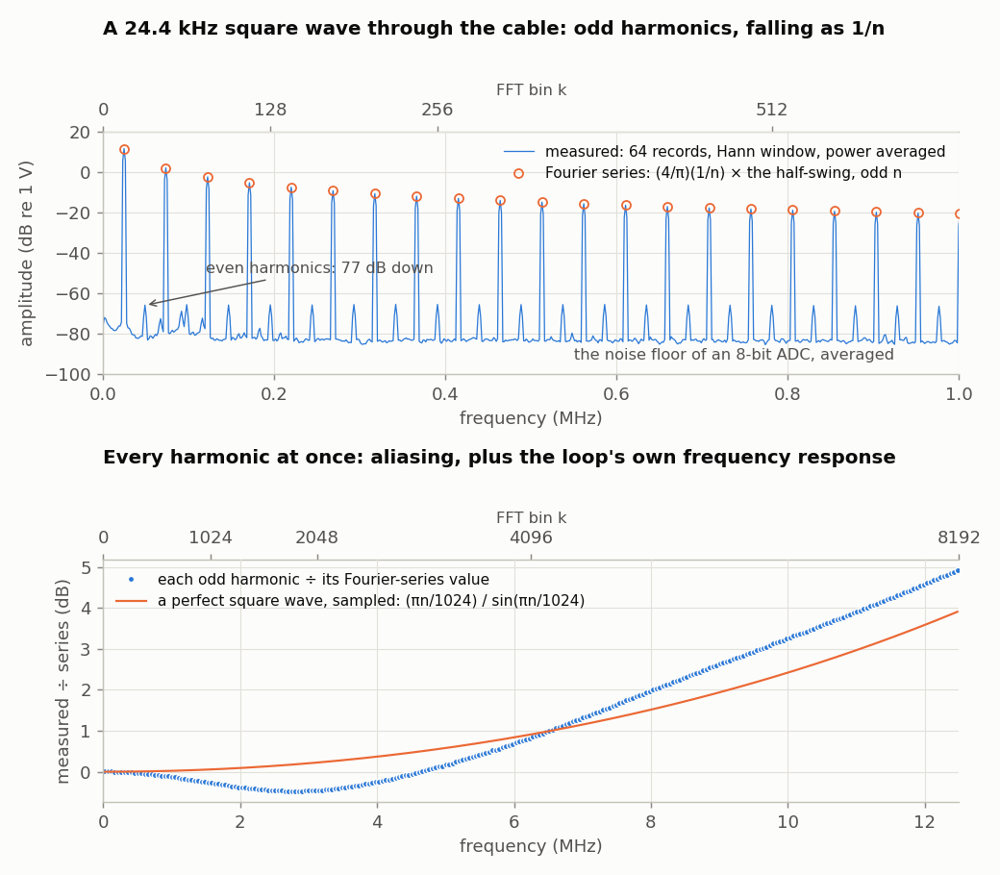
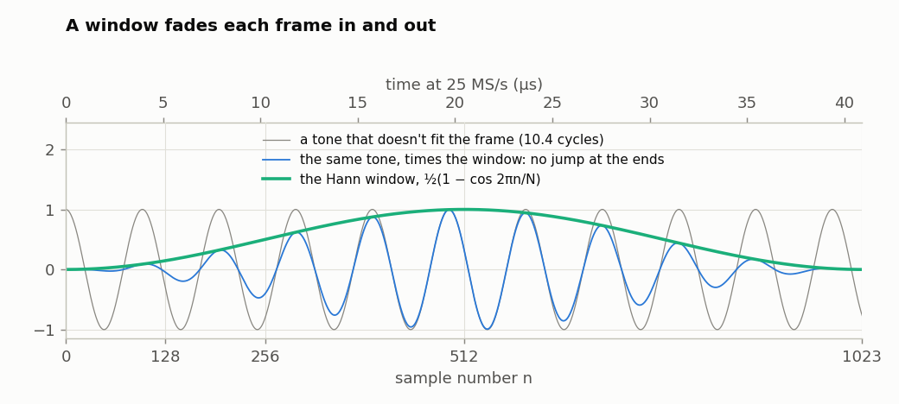
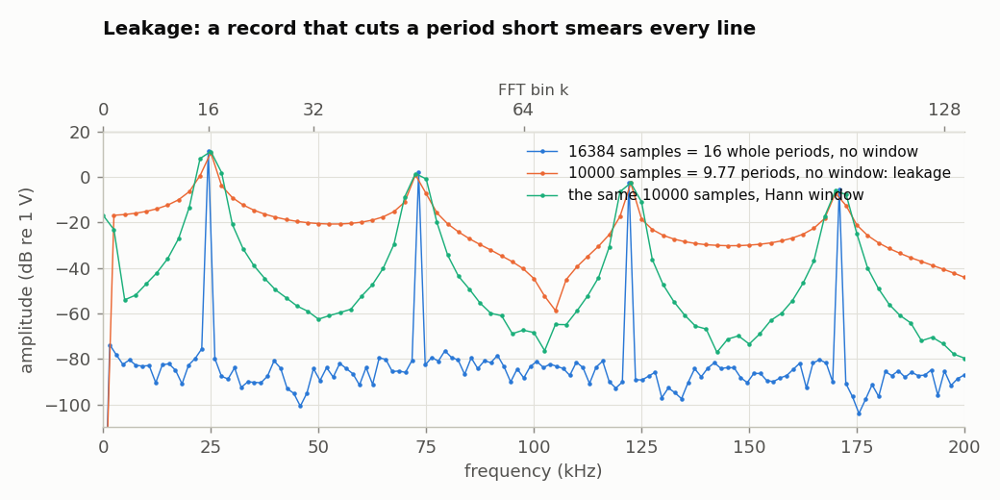
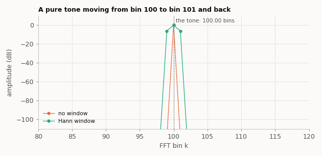
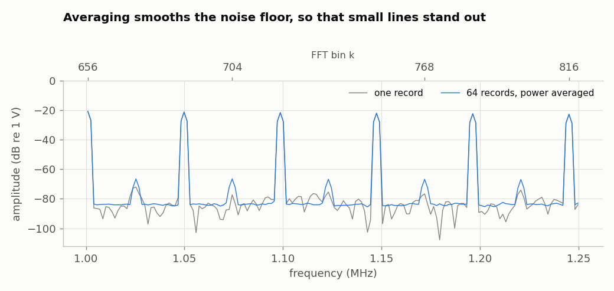
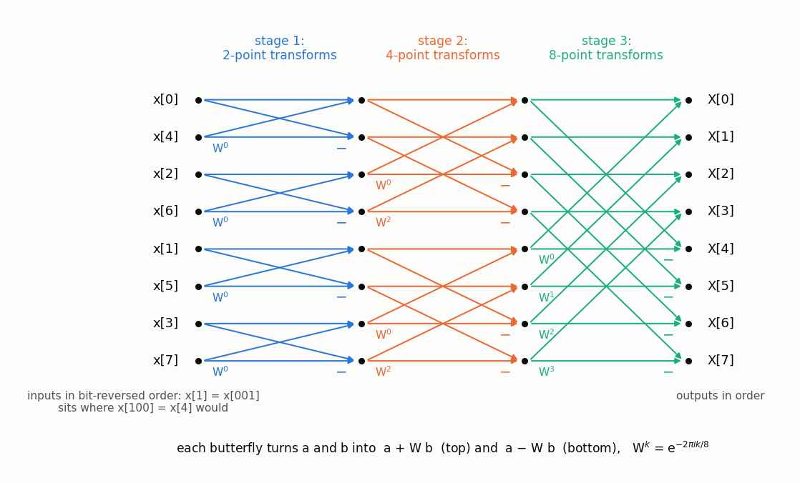
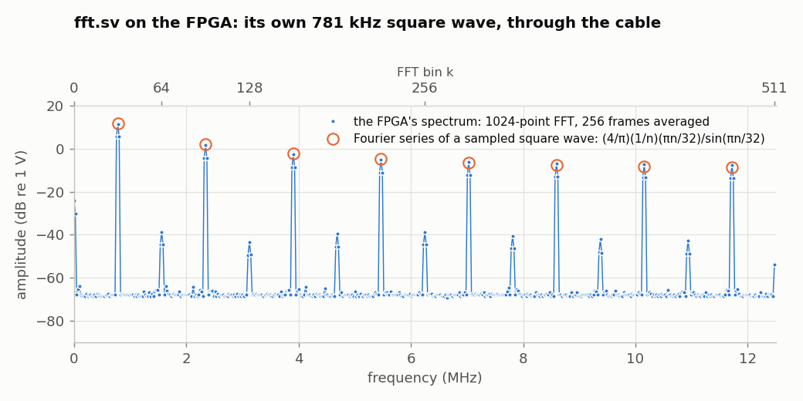

<!-- nav -->
[← 1.08 A lock-in amplifier](1_08_lockin.md#108-a-lock-in-amplifier) &emsp;&emsp;&emsp; **[Contents](../README.md#contents)** &emsp;&emsp;&emsp; [1.10 An AM radio →](1_10_am_radio.md#110-an-am-radio)

# 1.09 A spectrum analyzer



The lock-in of [1.08](1_08_lockin.md#108-a-lock-in-amplifier) asks about one frequency at a time. A *spectrum
analyzer* asks about all of them at once: how much of the signal is at each
frequency. That's a Fourier transform, and this page does it twice: first in
Python, on records from [1.06](1_06_fast_capture.md#106-fast-captures)'s capture design, and then in the FPGA itself,
with a [fast Fourier transform](https://en.wikipedia.org/wiki/Fast_Fourier_transform) (FFT) written in SystemVerilog.

## In Python, on long captures

[`spectrum.py`](../src/verilog/spectrum.py) takes many 16384-sample
records, at 25 MS/s, from either `capture.sv` ([1.06](1_06_fast_capture.md#106-fast-captures): whatever you plug into
the ADC) or `loopback.sv` ([1.07](1_07_closing_the_loop.md#107-closing-the-loop-the-dac-talks-to-the-adc): a test signal from the DAC, through the
cable). It FFTs each record and averages their power. It doesn't load a
design itself: load one first, `make load-capture` or `make load-loopback`.
(`capture.sv` leaves the DAC alone, so nothing it plays can leak into what
you're measuring.)

<details>
<summary>The whole file: <code>spectrum.py</code></summary>

<!-- file: src/verilog/spectrum.py -->
```python
#!/usr/bin/env python3
"""1.09, on the laptop: the spectrum of what the ADC sees.  Takes many 16384-sample
records, multiplies each by a window, FFTs it, and averages the power.

    python3 spectrum.py                   # capture.sv (1.06): 25 MS/s, 16 records
    python3 spectrum.py -d 4              # capture.sv at 25 MS/s / 2^4
    python3 spectrum.py --loopback s      # loopback.sv (1.07): its square wave, through the cable
    python3 spectrum.py -n 64 --window rect -o spec.npz --no-plot
"""
import argparse

import numpy as np
import serial                         # pip install pyserial

N = 16384
FS_MAX = 25e6
CODES_PER_VOLT = 25.35


def find_port():
    """The first FTDI FT231X serial port (USB ID 0403:6015): the Icepi Zero's."""
    from serial.tools import list_ports
    for p in list_ports.comports():
        if (p.vid, p.pid) == (0x0403, 0x6015):
            return p.device
    raise SystemExit("No Icepi Zero found. Is it plugged in? (Or give --port.)")


def records(port, command, n):
    """n records of N samples each, in volts.  capture.sv and loopback.sv both answer one
    command byte with N raw bytes."""
    out = []
    with serial.Serial(port, 1_000_000, timeout=2) as ser:
        ser.reset_input_buffer()
        for _ in range(n):
            ser.write(command)
            raw = ser.read(N)
            if len(raw) != N:
                raise RuntimeError(f"got {len(raw)} of {N} bytes -- is capture.bit or loopback.bit loaded?")
            out.append(np.frombuffer(raw, dtype=np.uint8) / CODES_PER_VOLT)
    return np.array(out)


def spectrum(x, fs, window="hann"):
    """Average amplitude spectrum of the rows of x, in volts: a sine of amplitude A that
    sits on a bin reads A.  Returns (frequencies in Hz, amplitudes in V)."""
    w = np.hanning(x.shape[1]) if window == "hann" else np.ones(x.shape[1])
    x = x - x.mean(axis=1, keepdims=True)
    # ##########################################################################
    # ##  KEY LINES: window each record, FFT it, and average the POWER of the
    # ##  records (averaging the complex values would cancel the noise and the
    # ##  signal alike unless every record started at the same phase).
    # ##########################################################################
    X = np.fft.rfft(x * w, axis=1) / (w.sum() / 2)
    power = np.mean(np.abs(X) ** 2, axis=0)
    return np.fft.rfftfreq(x.shape[1], 1 / fs), np.sqrt(power)


if __name__ == "__main__":
    ap = argparse.ArgumentParser(description=__doc__,
                                 formatter_class=argparse.RawDescriptionHelpFormatter)
    ap.add_argument("-d", type=int, default=0, help="capture.sv: keep 1 sample in 2^d (0..15)")
    ap.add_argument("--loopback", choices=["s", "r", "p"], help="use loopback.sv's pattern instead")
    ap.add_argument("-n", type=int, default=16, help="number of records to average (default 16)")
    ap.add_argument("--window", choices=["hann", "rect"], default="hann")
    ap.add_argument("--port", help="serial port (default: find the Icepi Zero)")
    ap.add_argument("-o", "--out", help="save frequency (Hz) and amplitude (V) to this .npz")
    ap.add_argument("--no-plot", action="store_true")
    args = ap.parse_args()

    command = args.loopback.encode() if args.loopback else b"%x" % args.d
    fs = FS_MAX if args.loopback else FS_MAX / 2**args.d
    x = records(args.port or find_port(), command, args.n)
    f, amp = spectrum(x, fs, args.window)
    db = 20 * np.log10(amp + 1e-9)
    print(f"{args.n} records of {N} samples at {fs / 1e6:g} MS/s: bins {fs / N:.1f} Hz apart")
    peaks = [i for i in range(1, len(amp) - 1) if amp[i - 1] < amp[i] >= amp[i + 1]]
    for i in sorted(peaks, key=lambda i: -amp[i])[:5]:      # the five biggest peaks
        print(f"  {f[i] / 1e6:10.6f} MHz  {amp[i] * 1e3:9.2f} mV  ({db[i]:6.1f} dBV)")
    if args.out:
        np.savez(args.out, f=f, amp=amp)
    if not args.no_plot:
        import matplotlib.pyplot as plt
        plt.plot(f / 1e6, db, linewidth=0.7)
        plt.xlabel("frequency (MHz)")
        plt.ylabel("amplitude (dB re 1 V)")
        plt.grid(True)
        plt.show()
```

</details>

The figure at the top is `loopback.sv`'s square wave, 24.4 kHz, through the
101.5 cm cable:

```console
$ make load-loopback
$ python3 spectrum.py --loopback s -n 64
64 records of 16384 samples at 25 MS/s: bins 1525.9 Hz apart
    0.024414 MHz    3767.33 mV  (  11.5 dBV)
    0.073242 MHz    1255.67 mV  (   2.0 dBV)
    0.122070 MHz     753.25 mV  (  -2.5 dBV)
    0.170898 MHz     537.90 mV  (  -5.4 dBV)
    0.219727 MHz     418.24 mV  (  -7.6 dBV)
```

A square wave's [Fourier series](https://en.wikipedia.org/wiki/Fourier_series) is (4/π)(sin ω*t* + ⅓ sin 3ω*t* + ⅕ sin 5ω*t* +
...) times its half-swing. Here the half-swing is 2.957 V, so the series says
3.765 V, 1.255 V, 0.753 V, 0.538 V and 0.418 V: the measurement agrees to
0.1%. The even harmonics, which a perfectly symmetric square wave doesn't
have, are 77 dB down. The lower panel divides each of the 256 odd harmonics
by its predicted value. Two things bend it. Near 12.5 MHz, harmonic
1024 − *n* folds onto harmonic *n* ([aliasing](https://en.wikipedia.org/wiki/Aliasing), as in [1.06](1_06_fast_capture.md#106-fast-captures)), which a perfect
square wave, sampled, would show as (π*n*/1024)/sin(π*n*/1024): +3.9 dB at
the top. What's left over is the loop's own frequency response, −0.5 dB at
2.7 MHz and +1 dB at 12.5 MHz, the same as the lock-in measured in [1.08](1_08_lockin.md#108-a-lock-in-amplifier). One
square wave measures the whole band at once.

Three things every [spectrum analyzer](https://en.wikipedia.org/wiki/Spectrum_analyzer) has to deal with:

**Resolution.** The FFT of *N* samples taken at *f*<sub>s</sub> has bins
*f*<sub>s</sub>/*N* apart: 1.53 kHz for 16384 samples at 25 MS/s. To see finer
detail you need a longer record: `-d 4` keeps one sample in 16, so the same
16384 samples last 16 times as long, with bins 95 Hz apart (and a Nyquist
frequency 16 times lower).

**Leakage, and windows.** An FFT treats its record as one period of a signal
that repeats forever ([6.07](6_07_ofdm.md#607-ofdm-the-triumph-of-physics-over-math) makes use of the same fact). The square wave fits
16 whole periods into 16384 samples, so its lines are perfectly sharp. Cut the
record at 10,000 samples instead, 9.77 periods, and the repeated record has a
jump in it at every join. That jump has a spectrum of its own, spread across
every bin: *[leakage](https://en.wikipedia.org/wiki/Spectral_leakage)*. Multiplying the record by a *window* that tapers to zero
at both ends, here the [Hann window](https://en.wikipedia.org/wiki/Hann_function)
½(1 − cos 2π*n*/*N*), removes the jump:





At first sight the window looks like a bad idea: the 16384-sample record with
no window (blue) has the sharpest lines of all. But that's only because the
square wave was made from the board's own clock, and fits the record
exactly, a whole number of periods. A signal from anywhere else never does.
Even two crystals that are meant to agree differ by parts per million
([5.01](5_01_two_clocks.md#501-two-clocks)), so a real tone sits somewhere between
two bins, and drifts. Without a window, as it drifts between bins, it changes
from looking like blue to looking like orange and back. With a window, it
always looks the same (green), just shifted:



That's why every spectrum analyzer that samples applies a window before
its FFT. The price is that each line is a few bins wide.

**Noise, and averaging.** Averaging the power of many records doesn't lower
the noise floor (each record has the same noise), but it makes the floor
smooth, so a line just above it stands out. The even harmonics at −66 dBV
are hard to tell from the noise in one record, and plain in 64:



The floor itself is about −84 dBV per bin, which works out to 0.08 codes rms
of noise. That's well below the rounding noise an 8-bit ADC is usually said
to have, 1/√12 of a code rms, which would give −73 dBV per bin. The reason
is the signal: rounding the square wave's two flat levels makes the same
error every period, and an error that repeats lands on the harmonics, not in
the floor. A signal that never repeats, like music, spreads the rounding
error out, and the floor rises to about −73 dBV.

## On the FPGA

The laptop did the Fourier transform above. Now the FPGA does it, 25 million
samples a second in, a spectrum out. A *[discrete Fourier transform](https://en.wikipedia.org/wiki/Discrete_Fourier_transform)* of
N = 1024 samples,

$$ X[k] = \frac{1}{N}\sum_{n=0}^{N-1} x[n]\, e^{-2\pi i k n / N}, $$

takes N<sup>2</sup>, about a million, complex multiplications done directly.
The *fast Fourier transform* gets the same answer with 5120. It splits the
samples into the even-numbered and the odd-numbered ones, transforms each
half, and combines them: if *A* and *B* are the two halves' transforms at
frequency *k*, the whole one's is *A* + *W B* at *k* and *A* − *W B* at
*k* + N/2, with *W* = e<sup>−2π*ik*/N</sup>. That combining step is a
*[butterfly](https://en.wikipedia.org/wiki/Butterfly_diagram)*. Each half is split the same way, ten times over, down to single
samples, so the transform is 10 stages of 512 butterflies, each one complex
multiplication. Here is the same thing for N = 8: 3 stages of 4 butterflies.



[`fft.sv`](../src/verilog/fft.sv) is [1.06](1_06_fast_capture.md#106-fast-captures)'s `capture.sv` with that between
"record" and "send":

1. **Record** 1024 samples, subtract 128 (to remove the average DC level), 
   multiply by a Hann window, and store
   each at its *[bit-reversed](https://en.wikipedia.org/wiki/Bit-reversal_permutation)* address (sample 1 = 0000000001 goes to address
   1000000000 = 512). Splitting into evens and odds ten times over leaves the
   samples in exactly that order.
2. **Transform**, in place: 10 stages of 512 "butterflies", one every 6 clocks
   (read *a*, read *b*, multiply, write two answers back), 0.61 ms in all.
   The twiddle factors *W* come from a table that Yosys computes, like [1.03](1_03_dac_sine.md#103-a-sine-direct-digital-synthesis)'s
   sine table.
3. **Add up** |X[k]|<sup>2</sup> for k = 0..511 into a second memory, and do
   it all again for 2<sup>A</sup> frames.
4. **Send** the 512 averages to the laptop: 2048 bytes, 20 ms.

The numbers are 18-bit integers, the width of the FPGA's multipliers, and
each stage halves its results, which keeps them from growing (that's the 1/N
above). The top of the file explains why nothing can overflow. It uses 7 of
the 28 multipliers, 7 of the 56 block RAMs and 5% of the logic, and runs at
up to 84 MHz.

<details>
<summary>The whole file: <code>fft.sv</code></summary>

<!-- file: src/verilog/fft.sv -->
```systemverilog
// fft.sv -- a spectrum analyzer: record 1024 ADC samples, Fourier transform
// them inside the FPGA, and send the power spectrum to the laptop.
//
// It is capture.sv (1.06) with a Fourier transform between "record" and "send".
// For each "frame" of N = 1024 samples the FPGA
//   1. records the samples, keeping 1 in 2^D of the 25 MS/s stream: a sample
//      rate fs = 25 MHz / 2^D.  There is no anti-alias filter, so a signal
//      above fs/2 shows up folded back to a frequency below fs/2.
//   2. subtracts 128 (so 0 V is about 0) and multiplies by a Hann window, a
//      bump that fades the frame in and out.  Without it, a sine that doesn't
//      fit a whole number of cycles into the frame leaks into every frequency.
//   3. computes X[k] = (1/N) sum_n x[n] w[n] exp(-2 pi i k n / N), with the
//      window w[n], using the FFT: 10 stages of 512 "butterflies".  X[k] is
//      the amplitude at the frequency k * fs / N.
//   4. adds |X[k]|^2, k = 0..511 (0 to fs/2), to a running sum in memory.
// After 2^A frames it sends the average and waits for the next command.
// One frame takes 1024 * 2^D / 25 MHz to record (41 us at D = 0), then 0.61 ms
// for the FFT (10 * 512 butterflies, 6 clocks each) and 41 us for step 4.
//
// Serial port, 1,000,000 baud:
//   laptop -> FPGA:  two hex digits, D then A ("0".."9", "a".."f"), e.g. "08":
//                    fs = 25 MHz / 2^D, average 2^A frames.  Other bytes are
//                    ignored, except "q" and "w", which turn the DAC's test
//                    signal off and on.
//   FPGA -> laptop:  P[0] .. P[511], 32-bit unsigned numbers, least significant
//                    byte first (2048 bytes, 20 ms).  P[k] is the average of
//                    |X[k]|^2, rounded down; anything too big for 32 bits is
//                    sent as 2^32 - 1.  A sine of amplitude 128 codes (full
//                    scale) exactly at frequency k gives P[k] = 2^30, so
//                    dB re full scale = 10 log10(P / 2^30).   (fft.py)
//
// Numbers: everything in the FFT is an 18-bit signed integer, -131072 ..
// 131071, the width of the FPGA's multipliers.  The window peaks at 1024, so
// |x w| <= 128 * 1024 = 131072.  Each stage computes (a + W b)/2 and
// (a - W b)/2, which are never bigger than the bigger of |a| and |b| (|W| = 1),
// so the numbers can't grow; ten halvings make the 1/N.  (A real part of
// +131072 wouldn't fit, but the first stage averages samples n and n + 512,
// whose window values add up to exactly 1024: after it, everything is at most
// 65536, half the range.)
//
// The DAC plays a test signal, a 781.25 kHz square wave, so that 1.07's cable from
// the DAC to the ADC gives the analyzer something to show: 32 whole periods per
// frame at D = 0, so its odd harmonics land exactly on k = 32, 96, 160, ...
// Send "q" to quiet it (the DAC sits at mid-scale, 0 V), so it can't leak into
// what you plug into the ADC, and "w" to bring it back.  (fft.py --quiet.)
//
// LEDs: the left three show the ADC's top 3 bits, then
//   led[1] = sending, and led[0] = recording or computing.

module fft #(
    parameter LOG2N = 10            // N = 2^10 = 1024 samples per frame
) (
    input  logic       clk,         // 50 MHz
    input  logic [7:0] adc_d,
    output logic       adc_clk,
    output logic [7:0] dac_d,
    output logic       dac_clk,
    input  logic       uart_rx,
    output logic       uart_tx,
    output logic [4:0] led
);
    localparam N = 1 << LOG2N;

    // ---- the DAC's test signal: a square wave, 64 clocks per period ----------
    logic [5:0] dac_count = 0;
    logic       dac_on    = 1;      // "q" turns it off, "w" back on (see below)
    always_ff @(posedge clk)
        dac_count <= dac_count + 1;
    assign dac_d   = !dac_on ? 8'd128 :                  // mid-scale: 0 V
                     dac_count[5] ? 8'd224 : 8'd32;      // about +2.9 V and -2.9 V, as loopback.sv
    assign dac_clk = ~clk;

    // ---- the ADC: clock it at 25 MHz and grab each sample (as in capture.sv)
    logic       adc_clk_r  = 0;
    logic       new_sample = 0;     // high for one clk when `sample` is new
    logic [7:0] sample     = 0;
    always_ff @(posedge clk) begin
        adc_clk_r  <= ~adc_clk_r;
        new_sample <= 0;
        if (adc_clk_r == 0) begin   // adc_clk is about to rise
            sample     <= adc_d;
            new_sample <= 1;
        end
    end
    assign adc_clk = adc_clk_r;

    // ---- the serial port, both directions (see uart.sv) ---------------------
    logic [7:0] rx_data;
    logic       rx_valid;
    logic [7:0] tx_data  = 0;
    logic       tx_start = 0;
    logic       tx_busy;
    uart_rx #(.CLKS_PER_BIT(50)) rx (.clk(clk), .rx(uart_rx),
                                     .data(rx_data), .valid(rx_valid));
    uart_tx #(.CLKS_PER_BIT(50)) tx (.clk(clk), .data(tx_data), .start(tx_start),
                                     .busy(tx_busy), .tx(uart_tx));
    always_ff @(posedge clk)
        if (rx_valid && rx_data == "q") dac_on <= 0;
        else if (rx_valid && rx_data == "w") dac_on <= 1;
    logic       is_hex;             // rx_data is "0".."9" or "a".."f"
    logic [3:0] hex;                // ...and its value
    assign is_hex = (rx_data >= "0" && rx_data <= "9") || (rx_data >= "a" && rx_data <= "f");
    assign hex    = (rx_data <= "9") ? rx_data - "0" : rx_data - "a" + 10;

    // ---- tables, computed by Yosys (like the sine table in lockin.sv) --------
    logic        [10:0] hann [0:N-1];            // the window: 0 .. 1024 .. 0
    logic signed [17:0] twiddle_re [0:N/2-1];    // exp(-2 pi i k / N), k = 0..N/2-1,
    logic signed [17:0] twiddle_im [0:N/2-1];    //   times 65536
    initial begin
        for (int i = 0; i < N; i++)
            hann[i] = $rtoi($floor(512.0 - 512.0 * $cos(6.283185307179586 * i / N) + 0.5));
        for (int i = 0; i < N/2; i++) begin
            twiddle_re[i] = $rtoi($floor( 65536.0 * $cos(6.283185307179586 * i / N) + 0.5));
            twiddle_im[i] = $rtoi($floor(-65536.0 * $sin(6.283185307179586 * i / N) + 0.5));
        end
    end

    // ---- memory, in block RAM -------------------------------------------------
    // The FFT works "in place" on N complex numbers: a butterfly reads two and
    // writes its two answers back in their places.  A RAM reads its read
    // address on every clock (the data is there on the next), and writes one
    // clock after the state machine sets `we`.  (* no_rw_check *) tells Yosys
    // that nothing reads an address in the clock it's written (fft_tb.sv
    // checks), so it needn't add logic for that case.
    (* no_rw_check *) logic signed [17:0] mem_re [0:N-1], mem_im [0:N-1];
    logic [LOG2N-1:0]   raddr, waddr = 0;
    logic signed [17:0] rd_re, rd_im, wr_re = 0, wr_im = 0;
    logic               we = 0;
    always_ff @(posedge clk) begin
        if (we) begin
            mem_re[waddr] <= wr_re;
            mem_im[waddr] <= wr_im;
        end
        rd_re <= mem_re[raddr];
        rd_im <= mem_im[raddr];
    end

    // The sums of |X[k]|^2.  |X|^2 < 2^33, so 2^15 frames add up to < 2^48.
    (* no_rw_check *) logic [47:0] acc [0:N/2-1];
    logic [LOG2N-2:0] k = 0, acc_waddr = 0;      // k: the frequency, 0 .. N/2-1
    logic [47:0]      acc_rd, acc_wr = 0;
    logic             acc_we = 0;
    always_ff @(posedge clk) begin
        if (acc_we)
            acc[acc_waddr] <= acc_wr;
        acc_rd <= acc[k];
    end

    // ---- the state machine's registers ------------------------------------------
    typedef enum logic [2:0] {IDLE, RECORD, FFT, POWER, SEND} state_t;
    state_t           state = IDLE;
    logic [3:0]       D = 0, A = 0;  // keep 1 sample in 2^D; average 2^A frames
    logic             got_D  = 0;    // the first digit (D) has arrived
    logic [15:0]      skip   = 0;    // samples still to skip before keeping one
    logic [14:0]      frame  = 0;    // which frame, 0 .. 2^A - 1
    logic [LOG2N-1:0] n      = 0;    // RECORD: which sample, 0 .. N-1
    logic [3:0]       stage  = 0;    // FFT: which stage, 0 .. LOG2N-1
    logic [LOG2N-2:0] j      = 0;    // FFT: which butterfly, 0 .. N/2-1
    logic [2:0]       step   = 0;    // the step within a butterfly, or a k
    logic [1:0]       byte_i = 0;    // SEND: which byte of P[k]

    // ---- recording ----------------------------------------------------------------
    logic              keep;         // a new sample, and the 1 in 2^D we keep
    logic signed [8:0] x;            // the sample - 128:  -128 .. +127
    assign keep = (state == RECORD) && new_sample && (skip == 0);
    assign x    = $signed({1'b0, sample}) - 9'sd128;

    // Sample n is stored at address "n with its 10 bits in reverse order".  The
    // FFT splits the samples into evens and odds, each of those into evens and
    // odds, and so on; bit-reversed order is the order that leaves them in.
    // Then each stage combines neighbouring blocks, and X[k] ends up at k.
    function automatic logic [LOG2N-1:0] bit_reverse(input logic [LOG2N-1:0] v);
        for (int i = 0; i < LOG2N; i++)
            bit_reverse[i] = v[LOG2N-1-i];
    endfunction

    // The window for sample n.  A block RAM's output comes too late in the
    // clock (5.6 ns) to go straight into a multiplier, so it's copied into a
    // register first.  That takes the 2 clocks there are between samples at
    // 25 MS/s, so as soon as a sample is kept, look up the next one's.
    logic [10:0] hann_rom, hann_n;
    always_ff @(posedge clk) begin
        hann_rom <= hann[keep ? n + 1'b1 : n];
        hann_n   <= hann_rom;
    end

    // ---- the butterfly ----------------------------------------------------------
    // Stage s makes 2^(s+1)-point transforms out of pairs of 2^s-point ones.
    // If a is frequency lo of the first (the "even" samples) and b frequency
    // lo of the second ("odd"), then a + W b and a - W b are frequencies lo and
    // lo + 2^s of the bigger one, with W = exp(-2 pi i lo / 2^(s+1)): entry
    // lo * 2^(9-s) of the table.  Butterfly j works on addresses
    //   ia = j with a 0 put in at bit s  (= 2j - lo, where lo = j's bits below s)
    //   ib = ia + 2^s.
    logic [LOG2N-1:0] half, ia, ib;
    logic [LOG2N-2:0] lo, w_k;
    assign half  = 1 << stage;
    assign lo    = j & (half - 1);
    assign ia    = 2 * j - lo;
    assign ib    = ia + half;
    assign w_k   = lo << (LOG2N - 1 - stage);
    assign raddr = (state == FFT) ? ((step == 0) ? ia : ib) : k;

    logic signed [17:0] w_re_rom, w_im_rom, w_re, w_im;     // W (times 65536), copied
    always_ff @(posedge clk) begin                           //   into a register too:
        w_re_rom <= twiddle_re[w_k];                         //   ready by step 2
        w_im_rom <= twiddle_im[w_k];
        w_re     <= w_re_rom;
        w_im     <= w_im_rom;
    end

    logic signed [17:0] a_re = 0, a_im = 0, b_re = 0, b_im = 0;
    logic signed [35:0] p1 = 0, p2 = 0, p3 = 0, p4 = 0;     // the four products
    logic signed [37:0] top_re, top_im, bot_re, bot_im;      // a + W b, a - W b, times 65536
    assign top_re = (a_re <<< 16) + (p1 - p2);               // (<<< 16 is times 65536)
    assign top_im = (a_im <<< 16) + (p3 + p4);
    assign bot_re = (a_re <<< 16) - (p1 - p2);
    assign bot_im = (a_im <<< 16) - (p3 + p4);

    // v / 2^17 (undo the 65536, and halve), rounded to the nearest integer; an
    // exact half goes to the even neighbour, so the roundings don't add up to a
    // bias.  The answer always fits in 18 bits (see "Numbers" at the top).
    function automatic logic signed [17:0] halve(input logic signed [37:0] v);
        logic signed [37:0] r;
        r = v + 38'sd65535 + v[17];
        halve = r >>> 17;
    endfunction

    // ---- the power spectrum ---------------------------------------------------
    logic [36:0] power = 0;          // |X[k]|^2
    logic [47:0] sum   = 0;          // acc[k], out of the RAM
    logic [47:0] avg;                // SEND: sum / 2^A ...
    logic [31:0] P;                  // ...in 32 bits
    assign avg = sum >> A;
    assign P   = (avg[47:32] != 0) ? 32'hFFFFFFFF : avg[31:0];

    // ---- what we're doing now ---------------------------------------------------
    always_ff @(posedge clk) begin
        we       <= 0;
        acc_we   <= 0;
        tx_start <= 0;
        case (state)
            IDLE:
                // Two hex digits, D then A.  Anything else is ignored -- including
                // the junk byte the FT231X can send when the laptop opens the port.
                if (rx_valid && is_hex) begin
                    if (!got_D) begin
                        D     <= hex;
                        got_D <= 1;
                    end else begin
                        A     <= hex;
                        got_D <= 0;
                        frame <= 0;
                        skip  <= 0;
                        state <= RECORD;
                    end
                end
            RECORD:
                if (keep) begin
                    // ##########################################################
                    // ##  KEY LINE: take off the offset, multiply by the window,
                    // ##  and store at the bit-reversed address.
                    // ##########################################################
                    we    <= 1;
                    waddr <= bit_reverse(n);
                    wr_re <= x * $signed({1'b0, hann_n});
                    wr_im <= 0;
                    n     <= n + 1;                  // (wraps to 0 after N-1)
                    skip  <= (16'd1 << D) - 1;
                    if (n == N - 1)                  // that was the last one
                        state <= FFT;
                end else if (new_sample)
                    skip <= skip - 1;
            FFT: begin
                // One butterfly every 6 clocks.  stage, j and step start at 0.
                step <= step + 1;
                case (step)
                    0: ;                                     // the RAM reads a (raddr = ia)
                    1: begin a_re <= rd_re; a_im <= rd_im; end   // ...and then b
                    2: begin b_re <= rd_re; b_im <= rd_im; end
                    3: begin
                        // ######################################################
                        // ##  KEY LINE: W b, a complex multiply: four real
                        // ##  multiplies, on four of the FPGA's multipliers.
                        // ######################################################
                        p1 <= b_re * w_re;
                        p2 <= b_im * w_im;
                        p3 <= b_re * w_im;
                        p4 <= b_im * w_re;
                    end
                    4: begin
                        // ######################################################
                        // ##  KEY LINE: the butterfly.  (a + W b)/2 goes where a
                        // ##  was, and (a - W b)/2 (next clock) where b was.
                        // ######################################################
                        we    <= 1;
                        waddr <= ia;
                        wr_re <= halve(top_re);
                        wr_im <= halve(top_im);
                    end
                    5: begin
                        we    <= 1;
                        waddr <= ib;
                        wr_re <= halve(bot_re);
                        wr_im <= halve(bot_im);
                        step  <= 0;
                        j     <= j + 1;                      // (wraps to 0 after N/2-1)
                        if (j == N/2 - 1) begin              // the stage's last butterfly
                            stage <= stage + 1;
                            if (stage == LOG2N - 1) begin    // ...and the last stage
                                stage <= 0;
                                state <= POWER;
                            end
                        end
                    end
                endcase
            end
            POWER: begin
                // For each k: read X[k] and its sum so far, add |X[k]|^2.
                step <= step + 1;
                case (step)
                    0: ;                                     // the RAMs read X[k], acc[k]
                    1: begin
                        a_re <= rd_re;
                        a_im <= rd_im;
                        sum  <= (frame == 0) ? 48'd0 : acc_rd;   // first frame: from 0
                    end
                    2: power <= a_re * a_re + a_im * a_im;
                    3: begin
                        // ######################################################
                        // ##  KEY LINE: add this frame's |X[k]|^2 to the sum.
                        // ######################################################
                        acc_we    <= 1;
                        acc_waddr <= k;
                        acc_wr    <= sum + power;
                        step      <= 0;
                        k         <= k + 1;                  // (wraps to 0 after N/2-1)
                        if (k == N/2 - 1) begin
                            if (frame == (16'd1 << A) - 1)   // that was the last frame
                                state <= SEND;
                            else begin                       // record another
                                frame <= frame + 1;
                                skip  <= 0;
                                state <= RECORD;
                            end
                        end
                    end
                endcase
            end
            SEND:
                // Send P[k] = acc[k] / 2^A as 4 bytes, low byte first.
                case (step)
                    0: step <= 1;                            // the RAM reads acc[k]
                    1: begin                                 // take it out of the RAM
                        sum  <= acc_rd;
                        step <= 2;
                    end
                    2: if (!tx_busy && !tx_start) begin
                        // ######################################################
                        // ##  KEY LINE: the UART is free: send the next byte.
                        // ######################################################
                        tx_data  <= P[8*byte_i +: 8];
                        tx_start <= 1;
                        byte_i   <= byte_i + 1;
                        if (byte_i == 3) begin               // P[k] is done
                            step <= 0;
                            k    <= k + 1;
                            if (k == N/2 - 1)
                                state <= IDLE;
                        end
                    end
                endcase
        endcase
    end

    assign led = {sample[7:5], state == SEND, state == RECORD || state == FFT || state == POWER};
endmodule
```

</details>

**Simulate it first.** `make sim-fft` runs [`fft_tb.sv`](../src/verilog/fft_tb.sv)
on a sine exactly at bin 100 and prints the biggest bins, with the values
to expect. [`fft_check.py`](../src/verilog/fft_check.py)
goes further: it runs eight test signals through the simulation (a tone on a
bin, one between bins, a tone 40 dB under another, white noise, averaging, a
decimated tone, full scale, and an ADC stuck at 0) and compares the FPGA's
output with numpy. Every number agrees exactly with a numpy model of the same
integer arithmetic, and to within 0.2 dB with numpy's exact FFT. The rounding
in the FPGA's arithmetic adds noise 20 dB below the 8-bit ADC's own.

**On the hardware.** [`fft.py`](../src/verilog/fft.py) is the laptop's half:
it sends the command, reads back the 512 numbers, and draws them.

<details>
<summary>The whole file: <code>fft.py</code></summary>

<!-- file: src/verilog/fft.py -->
```python
#!/usr/bin/env python3
"""1.09, the laptop side of fft.sv: a spectrum analyzer, with the FFT in the FPGA.

    python3 fft.py                     # live, 25 MS/s: 0 to 12.5 MHz (close the window to stop)
    python3 fft.py -d 4 -a 6           # 25 MS/s / 2^4 = 1.5625 MS/s: 0 to 781 kHz,
                                       #   each spectrum the average of 2^6 = 64 frames
    python3 fft.py --volts             # y axis in dB re 1 V (as spectrum.py), not re full scale
    python3 fft.py --once -o spec.npz  # one spectrum: plot it and save it

The FPGA sends P[k], k = 0..511: the average over 2^A frames of |X[k]|^2, at
the frequency k * fs / 1024 (see fft.sv).  A sine of amplitude 128 codes (full
scale, about 5 V) exactly at one of those frequencies gives P[k] = 2^30, so

    dB re full scale = 10 log10(P / 2^30).

A sine between two of the frequencies reads up to 1.4 dB low (that's the Hann
window), and an ideal 8-bit ADC's rounding noise reads -75 dB in every k.
"""
import argparse
import time

import numpy as np
import serial                        # pip install pyserial

N = 1024                             # samples per frame in fft.sv
FS_MAX = 25e6                        # the ADC runs at 50 MHz / 2
FULL_SCALE = 2**30                   # P[k] for a sine of amplitude 128 codes at frequency k
ADC_CODES_PER_VOLT = 25.35           # measured: code = 126.7 + 25.35 * V
FLOOR_8BIT = 32                      # P[k] of an ideal 8-bit ADC's rounding noise (1/12 code^2)


def find_port():
    """The first FTDI FT231X serial port (USB ID 0403:6015): the Icepi Zero's."""
    from serial.tools import list_ports
    for p in list_ports.comports():
        if (p.vid, p.pid) == (0x0403, 0x6015):
            return p.device
    raise SystemExit("No Icepi Zero found. Is it plugged in? (Or give --port.)")


def seconds_per_spectrum(d, a):
    """How long the FPGA takes: 2^a frames of (record 1024 samples, FFT, add up
    the powers: 10 * 512 * 6 + 512 * 4 clocks), then 2048 bytes of 10 bits."""
    frame = N * 2**d / FS_MAX + (10 * 512 * 6 + 512 * 4) / 50e6
    return 2**a * frame + 2048 * 10 / 1e6


def parse(raw):
    """2048 bytes from fft.sv -> P[0..511]: 32-bit numbers, least significant byte first."""
    return np.frombuffer(raw, dtype="<u4").astype(float)


def frequencies(d):
    """The frequency of each P[k], in Hz: k * fs / N."""
    return np.arange(N // 2) * (FS_MAX / 2**d) / N


def db_full_scale(P):
    # ##########################################################################
    # ##  KEY LINE: a full-scale sine (amplitude 128 codes) reads 2^30 = 0 dB.
    # ##  (P = 0 would be minus infinity dB: show it as P = 0.5.)
    # ##########################################################################
    return 10 * np.log10(np.maximum(P, 0.5) / FULL_SCALE)


def db_volts(P):
    """Amplitude in dB re 1 V at the ADC input, as in spectrum.py: a sine of
    amplitude A volts exactly at a frequency k reads 20 log10(A).  Full scale,
    128 codes, is 128 / 25.35 = 5.05 V: +14.1 dB re 1 V."""
    return db_full_scale(P) + 20 * np.log10(128 / ADC_CODES_PER_VOLT)


def spectrum(ser, d, a):
    """Ask the FPGA for one spectrum.  Returns P[0..511]."""
    ser.timeout = seconds_per_spectrum(d, a) + 1
    # ##########################################################################
    # ##  KEY LINES: send the command (two hex digits, D then A), then read
    # ##  back 512 numbers of 4 bytes each.
    # ##########################################################################
    ser.write(b"%x%x" % (d, a))
    raw = ser.read(2048)
    if len(raw) != 2048:
        raise RuntimeError(f"got {len(raw)} of 2048 bytes -- is fft.bit loaded? (Or is it "
                           "still busy with an earlier, longer average? Then wait, or reload it.)")
    return parse(raw)


def freq_unit(f_max):
    for scale, unit in ((1e6, "MHz"), (1e3, "kHz"), (1, "Hz")):
        if f_max >= scale:
            return scale, unit
    return 1, "Hz"


if __name__ == "__main__":
    ap = argparse.ArgumentParser(description=__doc__,
                                 formatter_class=argparse.RawDescriptionHelpFormatter)
    ap.add_argument("-d", type=int, default=0, help="keep 1 sample in 2^d (0..15): fs = 25 MHz / 2^d")
    ap.add_argument("-a", type=int, default=0, help="average 2^a frames per spectrum (0..15)")
    ap.add_argument("--port", help="serial port (default: find the Icepi Zero)")
    ap.add_argument("--once", action="store_true", help="take one spectrum instead of running live")
    ap.add_argument("-o", "--out", help="save the (last) spectrum to this .npz file")
    ap.add_argument("--volts", action="store_true", help="amplitude in dB re 1 V instead of re full scale")
    ap.add_argument("--no-plot", action="store_true", help="take one spectrum and just print its peak")
    ap.add_argument("--quiet", action="store_true",
                    help="turn off the DAC's test square wave, e.g. when the music player is plugged in")
    args = ap.parse_args()
    if not (0 <= args.d <= 15 and 0 <= args.a <= 15):
        raise SystemExit("-d and -a must be 0..15")

    f = frequencies(args.d)
    scale, unit = freq_unit(f[-1])
    to_db = db_volts if args.volts else db_full_scale
    ylabel = "amplitude (dB re 1 V)" if args.volts else "dB re full-scale sine (dBFS)"
    fs = FS_MAX / 2**args.d
    fs_scale, fs_unit = freq_unit(fs)
    title = f"fs = {fs / fs_scale:g} {fs_unit[:-2]}S/s, {2**args.a} frame{'s' * (args.a > 0)} per spectrum"
    print(f"{title}: 0 to {f[-1] / scale:g} {unit} in steps of {f[1] / scale:.4g} {unit}, "
          f"{seconds_per_spectrum(args.d, args.a):.3g} s per spectrum")

    def describe(P):
        k = int(np.argmax(P[2:])) + 2           # the biggest, not counting DC (k = 0,
                                                #   and k = 1 through the window)
        return f"peak {f[k] / scale:.5g} {unit}, {to_db(P)[k]:.1f} dB"

    P = None
    with serial.Serial(args.port or find_port(), 1_000_000, timeout=2) as ser:
        time.sleep(0.05)                 # let the line settle after opening,
        ser.reset_input_buffer()         # and throw away anything stale
        ser.write(b"q" if args.quiet else b"w")   # the DAC's test signal: off or on
        P = spectrum(ser, args.d, args.a)
        print(describe(P))
        if not args.no_plot:
            import matplotlib.pyplot as plt
            fig, ax = plt.subplots()
            line, = ax.plot(f / scale, to_db(P), ".-", markersize=3, linewidth=0.5)
            ax.axhline(to_db(FLOOR_8BIT), color="gray", linestyle="--", linewidth=0.8,
                       label="ideal 8-bit ADC's rounding noise")
            ax.set_xlabel(f"frequency ({unit})")
            ax.set_ylabel(ylabel)
            ax.set_ylim(to_db(0.5) - 5, to_db(FULL_SCALE) + 5)
            ax.legend(loc="upper right")
            ax.grid(True)
            ax.set_title(f"{title}\n{describe(P)}", fontsize=10)
            if args.once:
                plt.show()
            else:
                plt.ion()
                plt.show()
                count, t0 = 0, time.time()
                try:
                    while plt.fignum_exists(fig.number):
                        P = spectrum(ser, args.d, args.a)
                        line.set_ydata(to_db(P))
                        count += 1
                        ax.set_title(f"{title}\n{describe(P)}, "
                                     f"{count / (time.time() - t0):.1f} spectra/s", fontsize=10)
                        fig.canvas.draw_idle()
                        plt.pause(0.001)
                except KeyboardInterrupt:
                    pass

    if args.out:
        np.savez(args.out, freq_hz=f, power=P, db_full_scale=db_full_scale(P), d=args.d, a=args.a)
        print(f"saved to {args.out}")
```

</details>

`fft.sv` also plays a test signal on the DAC, a 781.25 kHz square wave, so
the cable from [1.07](1_07_closing_the_loop.md#107-closing-the-loop-the-dac-talks-to-the-adc)
is all you need:

```console
$ make load-fft
$ python3 fft.py                       # a live spectrum, 0 to 12.5 MHz; close the window to stop
$ python3 fft.py --once -a 8 --volts -o spec.npz
fs = 25 MS/s, 256 frames per spectrum: 0 to 12.4756 MHz in steps of 0.02441 MHz, 0.199 s per spectrum
peak 0.78125 MHz, 11.4 dB
```



`-d D` keeps 1 sample in 2<sup>D</sup>, as in `capture.sv`, and `-a A`
averages 2<sup>A</sup> frames. The FPGA computed 256 spectra and averaged
them in about 0.2 s; the laptop only drew the result. The square wave has 32 samples a
period, so the aliasing factor is now (π*n*/32)/sin(π*n*/32), and with it the
harmonics agree with the Fourier series to within 1 dB, the loop's own
response again. The even harmonics, about 50 dB down, are bigger than at
24.4 kHz: at 781 kHz, the DAC's rising and falling edges, which aren't
quite alike, are a bigger part of each period.

When something else is plugged into ADC IN, turn the test signal off with
`--quiet`: some of the DAC's signal leaks into the ADC inside the module
([1.08](1_08_lockin.md#a-filter)'s "know the floor"), and a square wave would put
its harmonics into your spectrum. With `--quiet`, the biggest peak through the
cable falls from +11.4 to −79 dB re 1 V: the noise floor (below the dashed
"ideal" line, for the reason given above: a steady input doesn't exercise the
rounding).


**Try this:**

- Run `python3 fft.py -d 2` and watch the square wave's harmonics above
  3.125 MHz fold back. Predict where each one lands.
- Plug in [1.05](1_05_adc_to_python.md#105-adc-samples-to-python)'s music player
  and look at its spectrum with `spectrum.py -d 8` (`capture.sv`, 98 kHz
  sampling, 6 Hz bins), or live with `fft.py -d 8 -a 4 --quiet`. Can you see
  the notes?
- Run `spectrum.py --loopback p`: [1.07](1_07_closing_the_loop.md#107-closing-the-loop-the-dac-talks-to-the-adc)'s GPS sequence. Why is its spectrum a
  comb of lines 24.4 kHz apart, and what shape is the comb's envelope?
- With an external function generator, find the frequency at which a sine leaks least
  and most with the rectangular window. How far down are the worst sidelobes,
  with and without the Hann window?

One more instrument, and it's a radio: [1.10](1_10_am_radio.md#110-an-am-radio)
turns the lock-in's multiplier and the DDS into an AM transmitter and
receiver.

<!-- nav -->
[← 1.08 A lock-in amplifier](1_08_lockin.md#108-a-lock-in-amplifier) &emsp;&emsp;&emsp; **[Contents](../README.md#contents)** &emsp;&emsp;&emsp; [1.10 An AM radio →](1_10_am_radio.md#110-an-am-radio)

<!-- author -->
<sub>Jason Gallicchio, jason@hmc.edu, Harvey Mudd College</sub>
