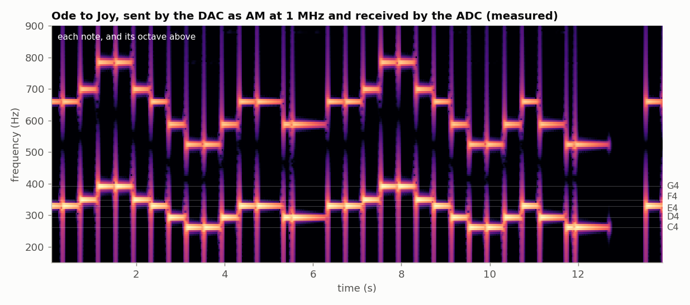
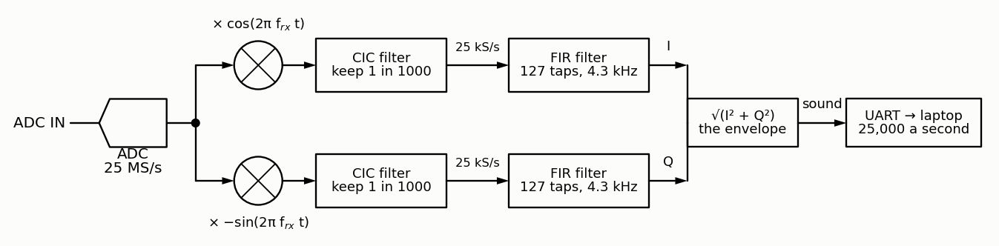
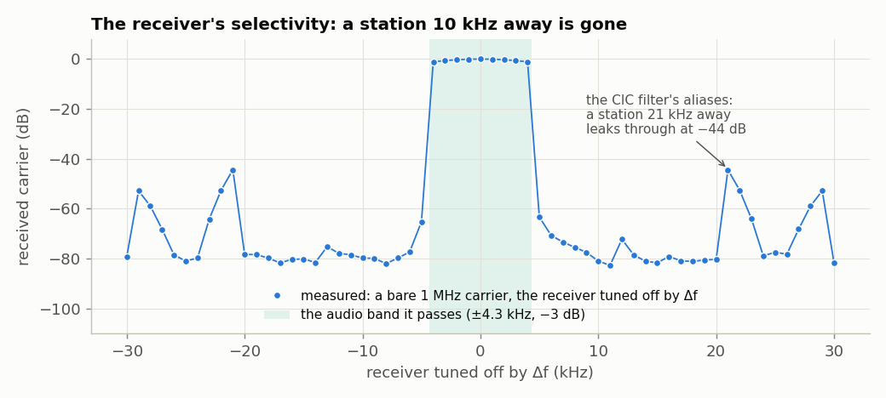
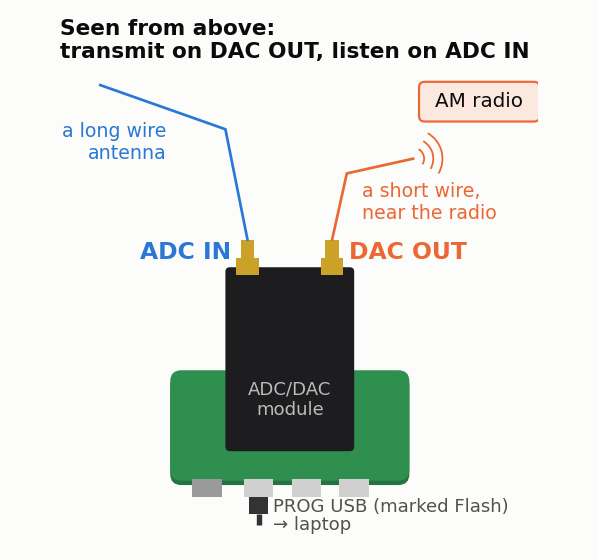

<!-- nav -->
[← 1.09 A spectrum analyzer](1_09_spectrum_analyzer.md#109-a-spectrum-analyzer) &emsp;&emsp;&emsp; **[Contents](../README.md#contents)** &emsp;&emsp;&emsp; [2.00 A processor on the FPGA →](2_00_a_processor_on_the_fpga.md#200-a-processor-on-the-fpga)

# 1.10 An AM radio



[Amplitude modulation](https://en.wikipedia.org/wiki/Amplitude_modulation) is
how radio began: the first broadcasts, in the 1920s, were AM, and so is the
[crystal radio](https://en.wikipedia.org/wiki/Crystal_radio) you may have built, with its coil, germanium diode and
earpiece. This page puts an AM radio station and an AM radio receiver in one
FPGA design, built from things you already have: the DDS of
[1.03](1_03_dac_sine.md#103-a-sine-direct-digital-synthesis) for the
transmitter, the lock-in's multiplication of
[1.08](1_08_lockin.md#108-a-lock-in-amplifier) for the receiver, and
[1.05](1_05_adc_to_python.md#105-adc-samples-to-python)'s stream to the laptop's
speaker. With the loopback cable, the laptop plays Ode to Joy, sent and
received by your FPGA (the figure above, measured). With a short wire on
DAC OUT, an ordinary AM radio should play it too; with a long wire on ADC
IN, the laptop should hear real stations.

## How AM works

A station sends a *carrier*, a sine at its frequency *f*<sub>c</sub> (here
1 MHz), whose amplitude follows the sound *a*(*t*):

$$ s(t) = A\,[1 + m\,a(t)]\cos(2\pi f_c t), $$

with −1 ≤ *a* ≤ 1 and a *modulation depth* *m* < 1, so the amplitude never
reaches zero. The amplitude, the *envelope*, is a copy of the sound. In
frequency, a tone *a* = cos 2π*f*<sub>a</sub>*t* puts two *sidebands* beside
the carrier, at *f*<sub>c</sub> ± *f*<sub>a</sub>, each *m*/2 of its
amplitude, so a station carrying sound up to 5 kHz is 10 kHz wide, and AM
stations sit 10 kHz apart (9 kHz in Europe).

A receiver has two jobs: pick one station out of all of them, and recover its
envelope. The lock-in of [1.08](1_08_lockin.md#108-a-lock-in-amplifier) already
does most of it. Multiply by cos and −sin at the station's frequency
*f*<sub>rx</sub>, and the station lands at 0 Hz, its sound around it, while a
station 10 kHz away lands at 10 kHz. A low-pass filter that keeps 0 to 4 kHz
then keeps one station and rejects the rest, and the two products, I and Q,
give the envelope as √(I<sup>2</sup> + Q<sup>2</sup>), whatever the station's
phase.

## The design

[`am_radio.sv`](../src/verilog/am_radio.sv) is both:

- **The transmitter** is a DDS carrier, as in [1.03](1_03_dac_sine.md#103-a-sine-direct-digital-synthesis),
  multiplied by 1 + 0.8 *a*(*t*). The sound comes from inside the FPGA: a music
  box that plays Beethoven's Ode to Joy (public domain, and recognizable
  anywhere) from a table of notes, each one plucked and dying away, or a
  steady 1 kHz test tone.
- **The receiver** is a *digital down-converter*, the front end of every
  software-defined radio:



1. **Mix**, as the lock-in does: each 25 MS/s sample times cos and −sin of
   the receive frequency.
2. **A [CIC filter](https://en.wikipedia.org/wiki/Cascaded_integrator%E2%80%93comb_filter)**
   (*cascaded integrator–comb*), the cheapest filter there is: three running
   sums at 25 MS/s, then three differences at 25 kS/s, keeping 1 sample in
   1000. No multiplications at all, just additions, which is why every
   digital radio uses one first. Its numbers grow by 3 × log<sub>2</sub>1000
   ≈ 30 bits, so its registers are 45 bits wide.
3. **A [FIR filter](https://en.wikipedia.org/wiki/Finite_impulse_response)**
   at 25 kS/s: 127 numbers (*taps*, a windowed [sinc](https://en.wikipedia.org/wiki/Sinc_function)) that pass 0 to 4 kHz and
   block 5 kHz and beyond. There are 2000 clocks between samples, so one
   multiplier does all 127 multiplications for I and Q in turn.
4. **The envelope**, √(I<sup>2</sup> + Q<sup>2</sup>), with a square root
   worked out one bit per clock.
5. **The laptop** gets 25,000 envelope samples a second, two bytes each.

The filters together pass the sound flat to within 1.1 dB up to 4 kHz, 3 dB
down at 4.3 kHz. Here is how well the receiver ignores a station it isn't
tuned to, measured with the transmitter sending a bare carrier and the
receiver tuned further and further away:



A station 10 kHz away comes through 80 dB weaker: that's the 8-bit ADC's
own noise floor. The weak spots are the lobes at ±21 and ±29 kHz. The CIC
keeps only every 1000th sample, so signals near 25 kHz from the tuned
frequency fold back onto it, and the CIC's own response there is only
44 dB down. (A fourth CIC stage, or a second filter in front, would fix
that: a Try-this below.)

<details>
<summary>The whole file: <code>am_radio.sv</code></summary>

<!-- file: src/verilog/am_radio.sv -->
```systemverilog
// am_radio.sv -- an AM radio station on the DAC and an AM radio receiver on the ADC.
//
// TRANSMITTER (the DAC).  A carrier at frequency f_tx (default 1.000 MHz, in the
// AM broadcast band; anything from 0.1 to 20 MHz works), made by a DDS as in
// sine.sv, whose amplitude follows a sound a(t) between -1 and +1:
//
//     DAC = 128 + 70 (1 + m a(t)) cos(2 pi f_tx t)       (codes; m = 0.8)
//
// (times 127/128, as the sine table's peak is 127).  m < 1 keeps 1 + m a(t)
// above 0, so the carrier never vanishes and its amplitude -- its "envelope" --
// is a copy of the sound.  At the loudest, 70 x 1.8 = 126 codes still fits.
// The sound comes from inside the FPGA: a music box playing Beethoven's "Ode to
// Joy" (13.6 s, over and over; each note is plucked and dies away), or a
// steady 1 kHz test tone.
//
// RECEIVER (the ADC).  A "digital down-converter" and an AM detector:
//   1. Mix: multiply each ADC sample (minus 128) by cos and -sin of a second DDS
//      at the receive frequency f_rx, as lockin.sv does.  A station at f_rx
//      lands at 0 Hz (plus and minus its sound's frequencies); a station 10 kHz
//      away lands at 10 kHz.  The two products are I and Q, the lock-in's X, Y.
//   2. A CIC filter: three running sums at 25 MS/s, then three differences at
//      25 kS/s.  It averages away everything far from 0 Hz and keeps 1 sample in
//      R = 1000: 25 MS/s -> 25 kS/s.
//   3. A FIR filter at 25 kS/s: 127 numbers ("taps") that pass 0..4 kHz and
//      block 5 kHz and beyond.  This is what separates neighbouring stations.
//   4. The envelope, sqrt(I^2 + Q^2): the amplitude of whatever is left near f_rx.
//      It doesn't care about the station's phase, so f_rx needn't match f_tx
//      exactly, nor be locked to it.
//   5. Send it to the laptop, 25,000 samples a second.  (am_radio.py plays it.)
//
// Serial port, 1,000,000 baud:
//   laptop -> FPGA:  a letter, hex digits, Enter ("\n" or "\r"):
//       t<TW>   transmit frequency  f_tx = TW x 50 MHz / 2^32   ("t51eb852": 1 MHz)
//       r<TW>   receive frequency   f_rx = TW x 50 MHz / 2^32   ("r51eb852": 1 MHz)
//       m<n>    what to transmit: 0 nothing (DAC at 128), 1 the bare carrier,
//               2 the melody (from its first note), 3 the 1 kHz tone
//       g<n>    output = envelope / 2^n, n = 0..f (default 2)
//     Lowercase hex.  Anything else is ignored, as are m > 3 and g > f.
//   FPGA -> laptop:  each envelope sample, 0..16383 (14 bits), as two bytes:
//       0hhhhhhh = its low 7 bits, then 1hhhhhhh = its high 7 bits.
//     The top bit says which byte is which, so the laptop can join in anywhere.
//     Envelopes bigger than 16383 after the shift are sent as 16383.
//     25,000 samples/s x 2 bytes = 50 kB/s: half of what 1 Mbaud carries.
// At power-up it transmits the melody at 1.000 MHz and receives at 1.000 MHz,
// with g = 2: a cable from the DAC to the ADC plays Ode to Joy, no commands.
//
// Numbers (all checked by am_check.py):
//   - The envelope is 473.1 A for a carrier of amplitude A ADC codes at f_rx:
//     the mixer gives 127 A / 2, the CIC multiplies by R^3 = 10^9 and divides
//     by 2^27, the FIR's gain is 1.  So a full-scale carrier (A = 127) gives
//     60,084, and a cable from the DAC (A = 0.776 x 69.5 = 54 codes) about
//     25,500: 6,375 after g = 2.  The modulation then swings it from 0.2 to 1.8
//     times that.  A 14-bit output holds up to 16,383.
//   - The sound is flat to 1.1 dB from 0 to 4 kHz, 3 dB down at 4.33 kHz.
//   - Anything 6 to 19 kHz from f_rx (a station 10 kHz away, say) comes
//     through at least 93 dB weaker (from 5.5 kHz: 81 dB), if the arithmetic
//     were perfect.  In practice the 8-bit ADC's own rounding noise, about
//     80 dB below a full-scale carrier, is what's left.
//   - The weak spot: the CIC keeps 1 sample in 1000, so frequencies 25 kHz
//     from f_rx fold onto 0 Hz, and some 20.3 to 29.6 kHz away get through
//     only 43 dB weaker (the worst: 20.8 kHz).  So a station 20 kHz away is
//     stopped 101 dB, but its sound's sidebands at 21 kHz only 44 dB.  (See
//     the CIC section.)
//   - Tuned 10 kHz away from its own transmitter, it still hears the melody,
//     60 dB down: the DAC rounds the modulated carrier to 8 bits, and the
//     rounding errors make faint copies of the sound tens of kHz wide.
//
// LEDs: the left four are a signal-strength meter (each needs 10 dB more than
// the one to its right: a carrier of 1.5, 5, 15, 50 ADC codes); the rightmost
// lights while the transmitter plays a note.

module am_radio #(
    parameter integer EIGHTH = 10_000_000   // clocks per eighth note: 0.2 s (at most 2^24)
) (
    input  logic       clk,         // 50 MHz
    input  logic [7:0] adc_d,
    output logic       adc_clk,
    output logic [7:0] dac_d = 128,
    output logic       dac_clk,
    input  logic       uart_rx,
    output logic       uart_tx,
    output logic [4:0] led
);
    localparam logic [31:0] TW_1MHZ = 32'h051eb852;  // 1.000000 MHz = 85899346 x 50 MHz / 2^32
    localparam logic [31:0] TW_1KHZ = 32'd85899;     // 999.996 Hz, the test tone

    // ---- tables, computed by Yosys (as in lockin.sv and fft.sv) ---------------
    // sine_table: one cycle of a sine, height 127: the carrier, and the
    //   receiver's references (the table at the phase is cos, 64 entries on is
    //   -sin, as in lockin.sv).
    // tone_table: the same, height 56 = 0.8 x 70: the 1 kHz tone, at m = 0.8.
    // box_table:  the music box's note, sin x + 0.5 sin 2x (the note plus, half
    //   as loud, the note an octave up, so even a laptop speaker that can't
    //   play 262 Hz plays something), scaled to the same height, 56.  The
    //   peak of sin x + 0.5 sin 2x is 3 sqrt(3) / 4 = 1.299, at x = 60 degrees.
    logic signed [7:0] sine_table [0:255], tone_table [0:255], box_table [0:255];
    initial
        for (int i = 0; i < 256; i++) begin
            sine_table[i] = $rtoi($floor(127.0 * $sin(6.283185307179586 * i / 256) + 0.5));
            tone_table[i] = $rtoi($floor(56.0 * $sin(6.283185307179586 * i / 256) + 0.5));
            box_table[i]  = $rtoi($floor(56.0 / 1.299038105676658 * ($sin(6.283185307179586 * i / 256)
                                         + 0.5 * $sin(12.566370614359172 * i / 256)) + 0.5));
        end

    // ---- the serial port, both directions (see uart.sv) -------------------------
    logic [7:0] rx_data;
    logic       rx_valid;
    logic [7:0] tx_data  = 0;
    logic       tx_start = 0;
    logic       tx_busy;
    uart_rx #(.CLKS_PER_BIT(50)) rx (.clk(clk), .rx(uart_rx),
                                     .data(rx_data), .valid(rx_valid));
    uart_tx #(.CLKS_PER_BIT(50)) tx (.clk(clk), .data(tx_data), .start(tx_start),
                                     .busy(tx_busy), .tx(uart_tx));

    // ---- commands: a letter, hex digits, Enter -----------------------------------
    // The letter is remembered, the digits shift into `entry` (as in lockin.sv),
    // and Enter carries out the command.
    localparam logic [1:0] OFF = 0, CARRIER = 1, MELODY = 2, TONE = 3;
    logic [31:0] tx_tw   = TW_1MHZ;  // transmit frequency
    logic [31:0] rx_tw   = TW_1MHZ;  // receive frequency
    logic [1:0]  source  = MELODY;   // what the transmitter sends
    logic [3:0]  shift   = 2;        // output = envelope / 2^shift
    logic        restart = 0;        // high for one clock: play the tune from the top
    logic [7:0]  command = 0;        // the letter of the command being typed, or 0
    logic [31:0] entry   = 0;
    logic        is_digit, is_letter;
    logic [3:0]  nibble;
    assign is_digit  = rx_data >= "0" && rx_data <= "9";
    assign is_letter = rx_data >= "a" && rx_data <= "f";
    assign nibble    = is_digit ? rx_data - "0" : rx_data - "a" + 10;
    always_ff @(posedge clk) begin
        restart <= 0;
        if (rx_valid) begin
            if (rx_data == "t" || rx_data == "r" || rx_data == "m" || rx_data == "g") begin
                command <= rx_data;
                entry   <= 0;
            end else if (is_digit || is_letter)
                entry <= {entry[27:0], nibble};
            else if (rx_data == "\n" || rx_data == "\r") begin
                case (command)
                    "t": tx_tw <= entry;
                    "r": rx_tw <= entry;
                    "m": if (entry <= 3) begin
                        source  <= entry[1:0];
                        restart <= 1;
                    end
                    "g": if (entry <= 15) shift <= entry[3:0];
                    default: ;
                endcase
                command <= 0;
            end
        end
    end

    // =============================================================================
    //  THE TRANSMITTER
    // =============================================================================

    // ---- the tune --------------------------------------------------------------
    // Written as text: each note is a letter, the pitch (C to B: C4 to B4, the
    // octave from middle C; R is a rest), then a digit, its length in eighth
    // notes (1 = an eighth, 2 = a quarter, 3 = a dotted quarter, 4 = a half).
    // Write your own tune here.  (A Verilog string is a vector of 8-bit
    // characters, with the first character in the top 8 bits.)
    localparam integer N_NOTES = 31;
    localparam logic [8*2*N_NOTES-1:0] TUNE =
        {"E2E2F2G2", "G2F2E2D2", "C2C2D2E2", "E3D1D4",       // one bar per string:
         "E2E2F2G2", "G2F2E2D2", "C2C2D2E2", "D3C1C4",       //   4 quarter notes each
         "R4"};
    localparam integer GAP = EIGHTH / 5;  // the last 40 ms of each note fades out

    logic [5:0]  note   = 0;         // which note of the tune: 0 .. N_NOTES-1
    logic [2:0]  eighth = 0;         // eighths of it already played
    logic [23:0] timer  = 0;         // clocks into the current eighth
    logic [7:0]  letter, digit;
    logic [31:0] note_tw;            // the note's tuning word, or 0 for a rest
    logic        last_eighth, in_gap, note_over;
    assign letter      = TUNE[8 * (2 * N_NOTES - 1 - 2 * note) +: 8];
    assign digit       = TUNE[8 * (2 * N_NOTES - 2 - 2 * note) +: 8];
    assign last_eighth = (eighth == digit - "1");
    assign in_gap      = last_eighth && (timer >= EIGHTH - GAP);
    assign note_over   = last_eighth && (timer == EIGHTH - 1);

    // The pitch: f = 440 Hz x 2^(s/12), s = semitones from A4 (equal temperament),
    // as a tuning word for a DDS clocked at 50 MHz: f x 2^32 / 50 MHz.
    always_comb
        case (letter)
            "C": note_tw = 32'd22473;    // C4, 261.63 Hz
            "D": note_tw = 32'd25226;    // D4, 293.66 Hz
            "E": note_tw = 32'd28315;    // E4, 329.63 Hz
            "F": note_tw = 32'd29998;    // F4, 349.23 Hz
            "G": note_tw = 32'd33672;    // G4, 392.00 Hz
            "A": note_tw = 32'd37796;    // A4, 440.00 Hz
            "B": note_tw = 32'd42424;    // B4, 493.88 Hz
            default: note_tw = 0;        // R: a rest
        endcase

    // ---- the music box: each note starts loud and dies away ---------------------
    // Every 2^16 clocks (1.31 ms) the loudness loses 1/256 of itself: an
    // exponential decay with a time constant of 256 x 1.31 ms = 0.34 s.  In the
    // gap at the end of a note it loses 1/8 each time (10 ms), so the next
    // pluck, even of the same note, is heard as a new note.
    logic        pluck       = 0;        // high for one clock: a new note begins
    logic [15:0] loudness    = 16'hffff; // 0 .. 65535 = silent .. full
    logic [15:0] tick        = 0;        // counts 2^16 clocks
    logic [31:0] note_phase  = 0;        // the note's DDS: starts at 0 with each pluck
    logic [31:0] tone_phase  = 0;        // the 1 kHz tone's DDS
    always_ff @(posedge clk) begin
        timer <= (timer == EIGHTH - 1) ? 24'd0 : timer + 1;
        if (timer == EIGHTH - 1)
            eighth <= eighth + 1;
        pluck <= 0;
        if (note_over || restart) begin            // on to the next note
            note   <= (restart || note == N_NOTES - 1) ? 6'd0 : note + 1;
            eighth <= 0;
            timer  <= 0;
            pluck  <= 1;                            // (next clock: note_tw is the new note's)
        end
        tick <= tick + 1;
        if (pluck) begin
            loudness   <= (note_tw != 0) ? 16'hffff : 16'd0;
            note_phase <= 0;                        // so the sound starts smoothly from 0
        end else begin
            if (tick == 0)
                loudness <= loudness - (loudness >> (in_gap ? 3 : 8));
            note_phase <= note_phase + note_tw;
        end
        tone_phase <= tone_phase + TW_1KHZ;
    end

    // ---- the sound a(t), and the carrier's amplitude 70 (1 + 0.8 a(t)) -------------
    // Everything here is in DAC codes x 256, so that the slowly changing
    // amplitude has 8 bits after the binary point.
    logic signed [7:0]  wave      = 0;   // the table: -56 .. 56
    logic        [8:0]  level     = 0;   // its loudness: 0 .. 256
    logic signed [16:0] audio     = 0;   // wave x level = 56 a(t) x 256
    logic        [15:0] amplitude = 0;   // 70 x 256 + audio = 70 (1 + 0.8 a(t)) x 256
    always_ff @(posedge clk) begin
        wave  <= (source == TONE) ? tone_table[tone_phase[31:24]] : box_table[note_phase[31:24]];
        level <= (source == TONE) ? 9'd256 : {1'b0, loudness[15:8]};
        audio <= wave * $signed({1'b0, level});
        case (source)
            OFF:     amplitude <= 0;
            CARRIER: amplitude <= 70 * 256;
            default: amplitude <= 70 * 256 + audio;
        endcase
    end

    // ---- the carrier, and the DAC -----------------------------------------------
    logic [31:0]        tx_phase = 0;
    logic signed [7:0]  carrier  = 0;    // cos(2 pi f_tx t): -127 .. 127
    logic signed [24:0] rf       = 0;    // carrier x amplitude
    always_ff @(posedge clk) begin
        tx_phase <= tx_phase + tx_tw;
        carrier  <= sine_table[tx_phase[31:24]];
        // ######################################################################
        // ##  KEY LINE: amplitude modulation.  The carrier times its amplitude;
        // ##  then / 2^15 (rounded) undoes the x 256 and the table's x 128:
        // ##  DAC = 128 + 70 (1 + 0.8 a(t)) x 127/128 x cos(2 pi f_tx t).
        // ######################################################################
        rf    <= carrier * $signed({1'b0, amplitude});
        dac_d <= 128 + ((rf + 25'sd16384) >>> 15);
    end
    assign dac_clk = ~clk;

    // =============================================================================
    //  THE RECEIVER
    // =============================================================================

    // ---- the ADC at 25 MS/s, and the receiver's own DDS, as in lockin.sv -------------
    // The receiver's phase steps every clock, like the transmitter's, so both
    // use f = TW x 50 MHz / 2^32.  Each sample keeps the phase it was taken at.
    logic [31:0] rx_phase     = 0;
    logic        adc_clk_r    = 0;
    logic        new_sample   = 0;
    logic [7:0]  sample       = 128;
    logic [7:0]  sample_phase = 0;
    always_ff @(posedge clk) begin
        rx_phase   <= rx_phase + rx_tw;
        adc_clk_r  <= ~adc_clk_r;
        new_sample <= 0;
        if (adc_clk_r == 0) begin            // adc_clk is about to rise
            sample       <= adc_d;
            sample_phase <= rx_phase[31:24];
            new_sample   <= 1;
        end
    end
    assign adc_clk = adc_clk_r;

    // ---- 1. mix down to 0 Hz -----------------------------------------------------
    // x cos and x (-sin), exactly the lock-in's products.  If the ADC sees
    // A cos(2 pi f t + phi), then I + jQ = (127 A / 2) e^(j (2 pi (f - f_rx) t + phi)),
    // plus terms at f + f_rx that the filters remove: the lock-in's X + jY, but
    // turning at the difference frequency f - f_rx.  The filters keep it only
    // if that's less than about 4.5 kHz.  Each step takes one clock; v1 and v2
    // say "the step before me had a new sample".
    logic               v1 = 0, v2 = 0;
    logic signed [8:0]  x     = 0;           // sample - 128: -128 .. 127
    logic signed [7:0]  ref_c = 0, ref_s = 0;
    logic signed [15:0] mix_i = 0, mix_q = 0;  // -16256 .. 16256
    always_ff @(posedge clk) begin
        v1    <= new_sample;
        x     <= $signed({1'b0, sample}) - 9'sd128;
        ref_c <= sine_table[sample_phase];            // cos
        ref_s <= sine_table[sample_phase + 8'd64];    // a quarter turn on: -sin
        v2    <= v1;
        // ######################################################################
        // ##  KEY LINE: multiply the signal by both references, cos and -sin.
        // ######################################################################
        mix_i <= x * ref_c;
        mix_q <= x * ref_s;
    end

    // ---- 2. the CIC filter: 25 MS/s -> 25 kS/s ----------------------------------------
    // The lock-in's average is a low-pass filter.  So is a moving average of the
    // last R = 1000 samples: it lets through about +-11 kHz around 0 Hz (3 dB
    // down there), and nothing at 25 kHz (= 25 MS/s / 1000), 50 kHz, ...
    // The trick: keep a running sum S[n] = x[0] + ... + x[n] (an "integrator");
    // then the sum of the last R samples is S[n] - S[n - R] (a "comb").  And
    // since we keep only every R-th output, the comb runs at 25 kS/s: each
    // output is S now minus S at the previous output.  No multiplies, no
    // memory of 1000 samples, just adders.
    //
    // One moving average leaks badly (frequencies between its nulls get through
    // only 13 dB down), so the CIC ("cascaded integrator-comb") does three in a
    // row: three integrators, then three combs.  Its response is
    //     H(f) = [ sin(pi f R / 25 MHz) / (R sin(pi f / 25 MHz)) ]^3,
    // zero at multiples of 25 kHz, and 1.1 dB down at 4 kHz, 1.7 dB at 5 kHz
    // ("droop"), 7.3 dB at 10 kHz, 38 dB at 20 kHz.  The FIR does the rest.
    //
    // The catch: after keeping 1 sample in 1000, f and f + 25 kHz look alike
    // ("aliasing", as the ADC itself folds 15 MHz onto 10 MHz).  The CIC's
    // nulls at 25 kHz, 50 kHz, ... are where things fold onto 0 Hz, which is
    // why it works -- but a station 21 kHz away folds onto 4 kHz, which the
    // FIR passes, and the CIC alone stops it only 44 dB.
    //
    // Bit growth: each sum of R numbers can be R times bigger than one of them,
    // so three in a row grow by R^3 = 10^9: log2(10^9) = 3 log2(1000) = 29.9 bits.
    // In: 15 bits (|mix| <= 16256 < 2^14, and a sign).  Out: 15 + 30 = 45 bits.
    // The integrators overflow and wrap around, over and over -- and that is
    // fine: two's complement is arithmetic modulo 2^45, and the combs'
    // differences come out right as long as the final answer fits in 45 bits.
    localparam integer R = 1000;
    localparam integer W = 45;
    logic signed [W-1:0] int_i1 = 0, int_i2 = 0, int_i3 = 0;
    logic signed [W-1:0] int_q1 = 0, int_q2 = 0, int_q3 = 0;
    logic [9:0]          count  = 0;     // 0 .. R-1
    logic                dec    = 0;     // high for one clock after every R-th sample
    always_ff @(posedge clk) begin
        dec <= 0;
        if (v2) begin
            // ##################################################################
            // ##  KEY LINES: three integrators in a row, at 25 MS/s.  Each adds
            // ##  up the one before it.
            // ##################################################################
            int_i1 <= int_i1 + mix_i;
            int_i2 <= int_i2 + int_i1;
            int_i3 <= int_i3 + int_i2;
            int_q1 <= int_q1 + mix_q;
            int_q2 <= int_q2 + int_q1;
            int_q3 <= int_q3 + int_q2;
            count  <= (count == R - 1) ? 10'd0 : count + 1;
            if (count == R - 1)
                dec <= 1;
        end
    end

    // The three combs, once per output, one per clock: each takes the
    // difference between its input now and its input at the previous output.
    logic signed [W-1:0] comb_i1 = 0, comb_i2 = 0, comb_i3 = 0, last_i1 = 0, last_i2 = 0, last_i3 = 0;
    logic signed [W-1:0] comb_q1 = 0, comb_q2 = 0, comb_q3 = 0, last_q1 = 0, last_q2 = 0, last_q3 = 0;
    logic [2:0]          dec_d = 0;      // dec, delayed by 1, 2, 3 clocks
    always_ff @(posedge clk) begin
        dec_d <= {dec_d[1:0], dec};
        if (dec) begin
            // ##################################################################
            // ##  KEY LINES: the first comb, at 25 kS/s: the running sum now,
            // ##  minus the running sum 1000 samples ago.
            // ##################################################################
            comb_i1 <= int_i3 - last_i1;
            last_i1 <= int_i3;
            comb_q1 <= int_q3 - last_q1;
            last_q1 <= int_q3;
        end
        if (dec_d[0]) begin
            comb_i2 <= comb_i1 - last_i2;
            last_i2 <= comb_i1;
            comb_q2 <= comb_q1 - last_q2;
            last_q2 <= comb_q1;
        end
        if (dec_d[1]) begin
            comb_i3 <= comb_i2 - last_i3;
            last_i3 <= comb_i2;
            comb_q3 <= comb_q2 - last_q3;
            last_q3 <= comb_q2;
        end
    end

    // Keep the top 18 bits, the width of the multipliers: / 2^27, rounded.
    // At most 16256 x 10^9 / 2^27 = 121,117, so it fits (18 bits: +-131,071).
    logic signed [W-1:0] cic_i_full, cic_q_full;
    logic signed [17:0]  cic_i, cic_q;
    assign cic_i_full = (comb_i3 + (45'sd1 <<< 26)) >>> 27;
    assign cic_q_full = (comb_q3 + (45'sd1 <<< 26)) >>> 27;
    assign cic_i      = cic_i_full[17:0];
    assign cic_q      = cic_q_full[17:0];

    // ---- 3. the FIR filter at 25 kS/s -----------------------------------------------
    // A FIR ("finite impulse response") filter: each output is a weighted sum of
    // the last 127 inputs,  y[n] = h[0] x[n] + h[1] x[n-1] + ... + h[126] x[n-126].
    // Its response to a sine of frequency f is sum_k h[k] e^(-2 pi i f k / 25 kHz)
    // (a Fourier transform of the h's), so to pass 0..4.5 kHz and block the
    // rest, choose h = the Fourier transform of that: the "sinc" function
    //     sin(2 pi fc k / fs) / (pi k),   fc = 4.5 kHz, fs = 25 kHz,
    // counting k from the middle tap.  It goes on forever, so cut it to 127
    // taps, and fade it out towards the ends with a window (as fft.sv does to
    // its frames), here a Blackman window, so the cut doesn't leak.  Result:
    // flat (+-0.001 dB) to 3.5 kHz, -6 dB at 4.5 kHz, -63 dB at 5 kHz, and
    // below -78 dB from 5.5 kHz up.  The h's add up to 2^18 (almost: 262,140),
    // so dividing the sum by 2^18 gives a gain of 1 at 0 Hz.
    //
    // 127 multiplies for I and 127 for Q, 4 clocks each: 1016 of the 2000
    // clocks between outputs, all on one multiplier.
    localparam integer TAPS = 127;
    localparam real    FS = 25000.0, FC = 4500.0;
    logic signed [17:0] coef [0:TAPS-1];
    initial
        for (int i = 0; i < TAPS; i++)
            coef[i] = (i == TAPS / 2) ? $rtoi($floor(262144.0 * 2.0 * FC / FS + 0.5))
                    : $rtoi($floor(262144.0
                        * $sin(6.283185307179586 * FC / FS * (i - TAPS / 2))     // the sinc,
                        / (3.141592653589793 * (i - TAPS / 2))
                        * (0.42 + 0.5 * $cos(6.283185307179586 * (i - TAPS / 2) / 128.0)   // the window
                           + 0.08 * $cos(12.566370614359172 * (i - TAPS / 2) / 128.0)) + 0.5));

    // The last 128 inputs of each, in block RAM, as a ring: `newest` is where
    // the newest is, and x[n-k] is k places back (the 7-bit address wraps).
    (* no_rw_check *) logic signed [17:0] hist_i [0:127], hist_q [0:127];
    initial
        for (int i = 0; i < 128; i++) begin
            hist_i[i] = 0;
            hist_q[i] = 0;
        end
    logic [6:0]         newest = 0;
    logic [6:0]         tap    = 0;      // k
    logic               ch     = 0;      // 0: filtering I; 1: Q
    logic [6:0]         raddr;
    logic signed [17:0] rd_i, rd_q, coef_rd;
    assign raddr = newest - tap;
    always_ff @(posedge clk) begin
        if (dec_d[2]) begin                  // the combs are done: a new input
            hist_i[newest + 7'd1] <= cic_i;
            hist_q[newest + 7'd1] <= cic_q;
        end
        rd_i    <= hist_i[raddr];
        rd_q    <= hist_q[raddr];
        coef_rd <= coef[tap];
    end

    // ---- 4. the envelope, and 5. out to the laptop ------------------------------------
    // v / 2^18, rounded, kept within 18 bits.  (Only a strange signal, bigger
    // than any sine, could need more: the h's add up to 2^18, but their sizes
    // to 2.05 x 2^18.)
    function automatic logic signed [17:0] scale(input logic signed [39:0] v);
        logic signed [39:0] r;
        r = (v + 40'sd131072) >>> 18;
        if (r > 131071)       scale = 131071;
        else if (r < -131071) scale = -131071;
        else                  scale = r[17:0];
    endfunction

    typedef enum logic [2:0] {WAIT, FILTER, ROUND, SQUARE, ROOT, OUTPUT} state_t;
    state_t             state = WAIT;
    logic [1:0]         step  = 0;       // FILTER: the step within one tap
    logic signed [17:0] d = 0, c = 0;    // x[n-k] and h[k], into the multiplier
    logic signed [35:0] prod  = 0;
    logic signed [39:0] acc   = 0, acc_i = 0;
    logic signed [17:0] fir_i = 0, fir_q = 0;
    logic        [35:0] power = 0;       // I^2 + Q^2 < 2^35
    logic        [17:0] root  = 0, bit_ = 0, envelope = 0;
    logic        [17:0] trial;
    logic        [35:0] trial_sq;
    logic               out_ready = 0;   // high for one clock: `envelope` is new
    assign trial    = root | bit_;
    assign trial_sq = trial * trial;
    always_ff @(posedge clk) begin
        out_ready <= 0;
        case (state)
            WAIT:
                if (dec_d[2]) begin              // a new input is being written
                    newest <= newest + 1;
                    tap    <= 0;
                    ch     <= 0;
                    step   <= 0;
                    acc    <= 0;
                    state  <= FILTER;
                end
            FILTER: begin
                step <= step + 1;
                case (step)
                    0: ;                                    // the RAMs read x[n-k], h[k]
                    1: begin                                // into registers (fft.sv explains)
                        d <= ch ? rd_q : rd_i;
                        c <= coef_rd;
                    end
                    2: prod <= d * c;
                    3: begin
                        // ##########################################################
                        // ##  KEY LINE: multiply-accumulate: add h[k] x[n-k].
                        // ##########################################################
                        acc <= acc + prod;
                        tap <= tap + 1;
                        if (tap == TAPS - 1) begin          // that was the last tap
                            tap <= 0;
                            if (ch == 0) begin              // I is done; now Q
                                acc_i <= acc + prod;
                                acc   <= 0;
                                ch    <= 1;
                            end else
                                state <= ROUND;
                        end
                    end
                endcase
            end
            ROUND: begin
                fir_i <= scale(acc_i);
                fir_q <= scale(acc);
                state <= SQUARE;
            end
            SQUARE: begin
                power <= fir_i * fir_i + fir_q * fir_q;
                root  <= 0;
                bit_  <= 18'h20000;                         // 2^17, the top bit of the root
                state <= ROOT;
            end
            ROOT: begin
                // ##############################################################
                // ##  KEY LINE: the square root, one bit per clock, from the
                // ##  top: set the next bit, and keep it if the square of the
                // ##  root so far is still no more than I^2 + Q^2.  After 18
                // ##  clocks, root = floor(sqrt(I^2 + Q^2)).
                // ##############################################################
                if (trial_sq <= power)
                    root <= trial;
                bit_ <= bit_ >> 1;
                if (bit_ == 1)
                    state <= OUTPUT;
            end
            OUTPUT: begin
                envelope  <= root;
                out_ready <= 1;
                state     <= WAIT;
            end
            default: state <= WAIT;
        endcase
    end

    // Send envelope / 2^shift (at most 16383) as two bytes: 0 + the low 7 bits,
    // then 1 + the high 7 bits.  They take 1000 of the 2000 clocks to the next.
    logic [17:0] shifted;
    logic [13:0] out14   = 0;
    logic [1:0]  to_send = 0;            // bytes still to send
    assign shifted = envelope >> shift;
    always_ff @(posedge clk) begin
        tx_start <= 0;
        if (out_ready) begin
            out14   <= (shifted > 16383) ? 14'd16383 : shifted[13:0];
            to_send <= 2;
        end else if (to_send != 0 && !tx_busy && !tx_start) begin
            tx_data  <= (to_send == 2) ? {1'b0, out14[6:0]} : {1'b1, out14[13:7]};
            tx_start <= 1;
            to_send  <= to_send - 1;
        end
    end

    // ---- LEDs: signal strength (473 per ADC code), and the notes -----------------------
    logic playing;
    assign playing = (source == TONE) || (source == MELODY && note_tw != 0 && !in_gap);
    assign led = {envelope >= 18'd23655, envelope >= 18'd7097, envelope >= 18'd2366,
                  envelope >= 18'd710, playing};
endmodule
```

</details>

**Simulate it first.** `make sim-am_radio` runs
[`am_radio_tb.sv`](../src/verilog/am_radio_tb.sv): the DAC looped back to the
ADC in simulation, the melody's first note found at 329.62 Hz (E4 is
329.63 Hz). [`am_check.py`](../src/verilog/am_check.py) goes much further, with
a fast [Verilator](https://www.veripool.org/verilator/) model: 50 runs of the
receiver, every output sample equal to a numpy model of the same arithmetic,
and the filters' measured response equal to the theory.

## Try it with a cable

[`am_radio.py`](../src/verilog/am_radio.py) is the laptop's half: it sends the
frequencies and the gain, reads the envelope, and plays it with
[1.05](1_05_adc_to_python.md#105-adc-samples-to-python)'s `play()`.

<details>
<summary>The whole file: <code>am_radio.py</code></summary>

<!-- file: src/verilog/am_radio.py -->
```python
#!/usr/bin/env python3
"""The laptop side of am_radio.sv: listen to the FPGA's AM radio.

    python3 am_radio.py                     # 10 s at 1.000 MHz, then play it: with a cable
                                            #   from the DAC to the ADC, Ode to Joy
    python3 am_radio.py --source tone --plot   # the 1 kHz test tone; plot it and its spectrum
    python3 am_radio.py --rx 1.01e6         # tune 10 kHz away: the station all but vanishes
    python3 am_radio.py --tx 7.2e6 --rx 7.2e6  # move both: 0.1 to 20 MHz
    python3 am_radio.py --source off --rx 1.07e6 --seconds 30
                                            # transmitter off, an antenna on the ADC: a station?
    python3 am_radio.py -o ode.wav --no-play

The FPGA sends its AM detector's output, the envelope, 25,000 times a second, each
sample as two bytes: 0 + its low 7 bits, then 1 + its high 7 bits (see am_radio.sv).
A carrier of amplitude A ADC codes at the receive frequency gives an envelope of
473.1 A, divided by 2^g (the gain command; by default this script picks g itself).
"""
import argparse
import time

import numpy as np

import stream                        # stream.py: save_wav() and play()

F_CLK = 50e6                         # both DDSs: f = TW x 50 MHz / 2^32
FS = 25_000                          # envelope samples per second: 25 MS/s / 1000
ENV_PER_CODE = 473.1                 # envelope for a carrier of 1 ADC code (am_radio.sv's header)
ADC_CODES_PER_VOLT = 25.35           # measured: code = 126.7 + 25.35 * V
FULL = 16383                         # the biggest 14-bit sample; bigger ones are sent as this
SOURCES = {"off": 0, "carrier": 1, "melody": 2, "tone": 3}


def find_port():
    """The first FTDI FT231X serial port (USB ID 0403:6015): the Icepi Zero's."""
    from serial.tools import list_ports
    for p in list_ports.comports():
        if (p.vid, p.pid) == (0x0403, 0x6015):
            return p.device
    raise SystemExit("No Icepi Zero found. Is it plugged in? (Or give --port.)")


def tuning_word(f):
    return int(round(f / F_CLK * 2**32)) & 0xFFFFFFFF


def decode(raw):
    """Bytes from am_radio.sv -> envelope samples, 0..16383.

    A sample is a byte with its top bit 0 (the low 7 bits) followed by one with its
    top bit 1 (the high 7 bits).  So wherever the reading starts -- even halfway
    through a sample -- the pairs find themselves, and a lost byte costs one sample."""
    b = np.frombuffer(raw, dtype=np.uint8).astype(np.int64)
    # ##########################################################################
    # ##  KEY LINES: find each "low byte, then high byte" pair, and join them.
    # ##########################################################################
    starts = np.nonzero((b[:-1] < 128) & (b[1:] >= 128))[0]
    return (b[starts] & 0x7F) | ((b[starts + 1] & 0x7F) << 7)


def command(ser, letter, value):
    """Send one command line, e.g. command(ser, "r", 0x051eb852) sends "r51eb852\\n"."""
    ser.write(b"%s%x\n" % (letter.encode(), value))


def read_envelope(ser, seconds):
    """Read `seconds` of envelope samples."""
    n = 2 * int(seconds * FS) + 2               # bytes: 2 per sample, and a spare pair
    ser.timeout = seconds + 2
    raw = ser.read(n)
    if len(raw) < n:
        raise RuntimeError(f"got {len(raw)} of {n} bytes -- is am_radio.bit loaded?")
    env = decode(raw)
    lost = len(raw) // 2 - 1 - len(env)
    if lost > 0:
        print(f"  ({lost} samples lost on the way: the laptop didn't keep up?)")
    return env[:int(seconds * FS)]


def settle(ser):
    """After a command: give the FPGA time to act on it and its filters time to
    fill (5 ms), then throw away whatever was already on its way."""
    time.sleep(0.05)
    ser.reset_input_buffer()
    read_envelope(ser, 0.02)


def auto_gain(ser):
    """The smallest g for which the loudest of 0.3 s of envelope / 2^g stays below
    8192, half of the 14 bits: room for louder moments.  If g = 0 overflows,
    look again at g = 4, then 8 (2^18 / 2^8 can't overflow)."""
    for g in (0, 4, 8):
        command(ser, "g", g)
        settle(ser)
        peak = int(read_envelope(ser, 0.3).max())
        if peak < FULL:
            break
    return max(0, ((peak << g) // 8192).bit_length())


def listen(ser, rx=1e6, tx=1e6, source="melody", gain=None, seconds=10.0):
    """Tune, transmit, set the gain, listen.  Returns (the envelope in the FPGA's
    units before the shift, i.e. the samples x 2^g; the 14-bit samples; g)."""
    # ##########################################################################
    # ##  KEY LINES: the commands: transmit and receive frequencies, what to
    # ##  transmit, and the gain; then "m" again, so the melody starts from
    # ##  the top as we start listening.
    # ##########################################################################
    command(ser, "t", tuning_word(tx))
    command(ser, "r", tuning_word(rx))
    command(ser, "m", SOURCES[source])
    g = auto_gain(ser) if gain is None else gain
    command(ser, "g", g)
    command(ser, "m", SOURCES[source])
    settle(ser)
    samples = read_envelope(ser, seconds)
    return samples.astype(float) * 2**g, samples, g


def describe(env, samples, g):
    codes = env / ENV_PER_CODE                   # carrier amplitude, ADC codes
    clipped = np.mean(samples >= FULL)
    audio = codes - codes.mean()
    spec = np.abs(np.fft.rfft(audio * np.hanning(len(audio))))
    f = np.fft.rfftfreq(len(audio), 1 / FS)
    k = int(np.argmax(spec[1:])) + 1
    print(f"{len(samples)} samples ({len(samples) / FS:.2f} s), g = {g}: carrier amplitude "
          f"{codes.mean():.2f} ADC codes = {codes.mean() / ADC_CODES_PER_VOLT:.3f} V at the ADC")
    if codes.mean() > 0:
        print(f"  the sound: {audio.std() / codes.mean() * 100:.1f}% rms of the carrier, "
              f"loudest frequency {f[k]:.1f} Hz" + (f"; {clipped * 100:.2f}% of samples clipped "
                                                    f"at 16383: use a bigger --gain" if clipped else ""))


def plot(env, g, title):
    import matplotlib.pyplot as plt
    volts = env / ENV_PER_CODE / ADC_CODES_PER_VOLT
    t_ms = np.arange(len(env)) / FS * 1e3
    fig, (a, b) = plt.subplots(2, 1, figsize=(9, 7))
    a.plot(t_ms, volts, ".-", markersize=2, linewidth=0.5)
    a.set_xlabel("time (ms)")
    a.set_ylabel("envelope: carrier amplitude at the ADC (V)")
    a.set_title(title, fontsize=10)
    a.grid(True)
    audio = env - env.mean()
    w = np.hanning(len(audio))
    # amplitude spectrum, scaled so a sine of amplitude a volts reads 20 log10(a) dB re 1 V
    spec = np.abs(np.fft.rfft(audio * w)) * 2 / w.sum() / ENV_PER_CODE / ADC_CODES_PER_VOLT
    f = np.fft.rfftfreq(len(audio), 1 / FS)
    b.plot(f / 1e3, 20 * np.log10(np.maximum(spec, 1e-9)), linewidth=0.7)
    b.set_xlabel("audio frequency (kHz)")
    b.set_ylabel("dB re 1 V (envelope minus its average)")
    b.set_xlim(0, FS / 2e3)
    b.grid(True)
    plt.tight_layout()
    plt.show()


def main(argv=None, ser=None):
    ap = argparse.ArgumentParser(description=__doc__,
                                 formatter_class=argparse.RawDescriptionHelpFormatter)
    ap.add_argument("--port", help="serial port (default: find the Icepi Zero)")
    ap.add_argument("--rx", type=float, default=1e6, help="receive frequency, Hz (default 1e6)")
    ap.add_argument("--tx", type=float, default=1e6, help="transmit frequency, Hz (default 1e6)")
    ap.add_argument("--source", choices=SOURCES, default="melody", help="what to transmit")
    ap.add_argument("--seconds", type=float, default=10.0, help="how long to listen (default 10)")
    ap.add_argument("--gain", type=int, choices=range(16), metavar="G",
                    help="output = envelope / 2^G, 0..15 (default: pick it automatically)")
    ap.add_argument("-o", "--out", default="am_radio.wav", help="sound file (default am_radio.wav)")
    ap.add_argument("--no-play", action="store_true", help="just save the sound file")
    ap.add_argument("--plot", action="store_true", help="plot the envelope and its spectrum")
    args = ap.parse_args(argv)
    for f in (args.rx, args.tx):
        if not 0 <= f < F_CLK / 2:
            raise SystemExit("frequencies must be 0 to 25 MHz (0.1 to 20 MHz is sensible)")

    print(f"transmitting {args.source} at {tuning_word(args.tx) * F_CLK / 2**32 / 1e6:.6f} MHz, "
          f"receiving at {tuning_word(args.rx) * F_CLK / 2**32 / 1e6:.6f} MHz")
    if ser is None:
        import serial                    # pip install pyserial
        ser = serial.Serial(args.port or find_port(), 1_000_000, timeout=2)
    with ser:
        time.sleep(0.05)                 # let the line settle after opening
        ser.reset_input_buffer()
        env, samples, g = listen(ser, args.rx, args.tx, args.source, args.gain, args.seconds)
    describe(env, samples, g)
    # The sound, in ADC codes of carrier amplitude.  stream.py makes it as loud as it
    # can, unless its swings are under 1 code: then it plays quieter, in proportion.
    if args.no_play:
        stream.save_wav(env / ENV_PER_CODE, args.out, fs=FS)
    else:
        stream.play(env / ENV_PER_CODE, args.out, fs=FS)
    if args.plot:
        plot(env, g, f"received at {args.rx / 1e6:g} MHz, g = {g} ({args.source} "
                     f"transmitted at {args.tx / 1e6:g} MHz)")
    return env, samples, g


if __name__ == "__main__":
    main()
```

</details>

With the loopback cable from DAC OUT to ADC IN:

```console
$ make load-am_radio
$ python3 am_radio.py
transmitting melody at 1.000000 MHz, receiving at 1.000000 MHz
250000 samples (10.00 s), g = 3: carrier amplitude 53.79 ADC codes = 2.122 V at the ADC
  the sound: 28.9% rms of the carrier, loudest frequency 330.0 Hz
wrote am_radio.wav
```

and the laptop plays Ode to Joy, sent and received through the cable. More,
all measured:

| | command | result |
| --- | --- | --- |
| the 1 kHz test tone | `python3 am_radio.py --source tone --seconds 2` | a 1000.0 Hz tone, 56.2% rms of the carrier: *m* = 0.8 |
| tuned 10 kHz away | `python3 am_radio.py --rx 1.01e6` | the station falls from 53.7 to 0.06 ADC codes, 59 dB |
| at 7.2 MHz | `python3 am_radio.py --tx 7.2e6 --rx 7.2e6 --source tone` | the same, 54.8 codes |

Tuned 10 kHz away, the melody fades by 59 dB, not the 80 of a bare carrier.
That isn't the receiver: the DAC rounds the modulated carrier to 8 bits, and
the rounding errors repeat with the sound, which puts faint copies of it
tens of kilohertz to either side. Real transmitters add a little noise
(*[dither](https://en.wikipedia.org/wiki/Dither)*) to break that up.

## On the air: a real radio



Find a quiet spot on an AM radio's dial, near the top of the band where
stations are fewer (in the US, 1600–1700 kHz is often empty), set the
transmitter there, and put a short wire on DAC OUT, a hand's width from the
radio:

```console
$ python3 am_radio.py --tx 1650e3 --source melody --no-play
```

The radio should play Ode to Joy. (Not tried yet: the transmitter was tested
only through a cable, as above.)

> [!WARNING]
> **Keep it tiny.** In the US, FCC Part 15 (§15.219) allows anyone to run an
> AM-band transmitter with no licence if its final stage draws at most
> 100 mW, its antenna, feed line and ground lead together are at most 3 m
> long, and everything it sends outside 510–1705 kHz is at least 20 dB below
> its carrier. The DAC's output is far below 100 mW; keep the wire short,
> and if you can, put a low-pass filter (say 2 MHz) between DAC OUT and the
> wire, so that the DAC's images near 50 MHz stay out of the air. Other
> countries' rules differ: look yours up.

## Listening to real stations

Put a long wire on ADC IN instead (5 to 20 m, as high as you can, outdoors
if possible: see [1.06](1_06_fast_capture.md#106-fast-captures)'s Detail on
antennas), and tune:

```console
$ python3 am_radio.py --rx 1070e3 --seconds 30
```

Mostly you'll hear talk radio and advertisements. But a strong local AM
station is also what emergency broadcasting relies on: when the power is out
and the mobile networks are down, a laptop on its battery, this board and a
wire can still bring in the news. A weak or distant station needs more gain
than the ADC's 39 mV steps give it: an amplifier before ADC IN (a
*[low-noise amplifier](https://en.wikipedia.org/wiki/Low-noise_amplifier)* for 0.5–30 MHz) helps, and so does listening at night,
when AM signals bounce off the ionosphere and travel hundreds of kilometres.
(Not tried yet: the receiver was tested through a cable.)

## Your crystal radio, and this one

A crystal radio, a coil, a capacitor, a germanium diode and a piezoelectric
earpiece, does all of this with no power at all. The two make a good
comparison:

| | crystal radio | this radio |
| --- | --- | --- |
| power | none: the station's own signal drives the earpiece | about half a watt, from USB |
| parts | a coil, a capacitor, a diode, an earpiece | about 24,000 logic cells, an ADC, and a laptop |
| tuning | turn the capacitor; the coil's Q decides how well neighbouring stations are kept out | type a frequency; a digital filter decides, the same every time |
| detector | the diode: it keeps one side of the wave, and the earpiece smooths it into the envelope | √(I<sup>2</sup> + Q<sup>2</sup>), computed 25,000 times a second |
| how far | a strong local station, with a long antenna | the same, plus whatever an amplifier can add |
| sound | faint, in one ear | the laptop's speaker, and a WAV file |
| works in a blackout | forever | until the laptop's battery runs out |
| can be built in a foxhole | yes: soldiers in the Second World War made them from a razor blade and a pencil lead | not recommended |

The crystal radio wins on elegance. This one wins on everything you can
change: the filter, the detector, and what happens to the sound afterwards
are all a few lines of code.

## What else is on the air

Everything from 0 to 12.5 MHz reaches the ADC at once, and much of it is
worth hearing:

- **[WWV](https://en.wikipedia.org/wiki/WWV_(radio_station)) and WWVH**, the
  US time stations, at 2.5, 5 and 10 MHz (and Canada's CHU at 3.33 and
  7.85 MHz): a voice announces the time every minute, over a tick each
  second. They're AM, so this receiver hears them as it is, and a radio
  clock from Colorado is a fine reference for [Chapter 5](5_00_two_boards.md#500-two-boards-on-one-laptop)'s
  crystals, if you account for the ionosphere's few milliseconds.
- **Shortwave broadcasters** from other continents, mostly at night, in the
  bands around 6, 7.3, 9.6 and 11.8 MHz: also AM.
- **Radio amateurs** at 1.8, 3.5, 7 and 10.1 MHz, by voice in *single
  sideband* and in digital modes such as FT8 at 7.074 MHz. They need a
  different detector: [4.10](4_10_more_ideas.md#410-more-ideas-for-one-board)
  has the idea.
- **Above 12.5 MHz** signals fold back into the same band ([aliasing](https://en.wikipedia.org/wiki/Aliasing),
  [1.06](1_06_fast_capture.md#106-fast-captures)). That's a nuisance without a
  filter, and a trick with one: with a band-pass filter around 27 MHz, the
  Citizens Band appears at 27 − 25 = 2 MHz, where this receiver can tune it.
  FM broadcasting at 88–108 MHz is harder: nobody has measured how much of
  a 100 MHz signal the module's input amplifier lets through to the ADC, the
  sampling clock's jitter matters more at 100 MHz, and FM needs a different
  detector (the rate of change of the phase, not the amplitude). An untried
  project.

**Try this:**

- Change the tune: the melody is a line of text in `am_radio.sv`, a letter
  for each note's pitch and a digit for its length.
- Make a "seek" button: sweep the receive frequency across the AM band in
  10 kHz steps with the transmitter off and an antenna on ADC IN, record the
  carrier level at each, and list the stations you can hear.
- Fill in the alias lobes: add a fourth CIC stage, and measure the
  selectivity again with `dev/tools/fig_am.py`.
- Add dither to the transmitter (a little noise from an LFSR, like
  [1.07](1_07_closing_the_loop.md#107-closing-the-loop-the-dac-talks-to-the-adc)'s,
  added before the DAC rounds), and see whether the 59 dB becomes more.

That's the end of Chapter 1. You've built a function generator, a
digitizer, a [network analyzer](https://en.wikipedia.org/wiki/Network_analyzer_(electrical)),
a [spectrum analyzer](https://en.wikipedia.org/wiki/Spectrum_analyzer) and a radio out of nothing but logic.
[Chapter 2](2_00_a_processor_on_the_fpga.md#200-a-processor-on-the-fpga) puts
a computer in the FPGA next to them.

<!-- nav -->
[← 1.09 A spectrum analyzer](1_09_spectrum_analyzer.md#109-a-spectrum-analyzer) &emsp;&emsp;&emsp; **[Contents](../README.md#contents)** &emsp;&emsp;&emsp; [2.00 A processor on the FPGA →](2_00_a_processor_on_the_fpga.md#200-a-processor-on-the-fpga)

<!-- author -->
<sub>Jason Gallicchio, jason@hmc.edu, Harvey Mudd College</sub>
