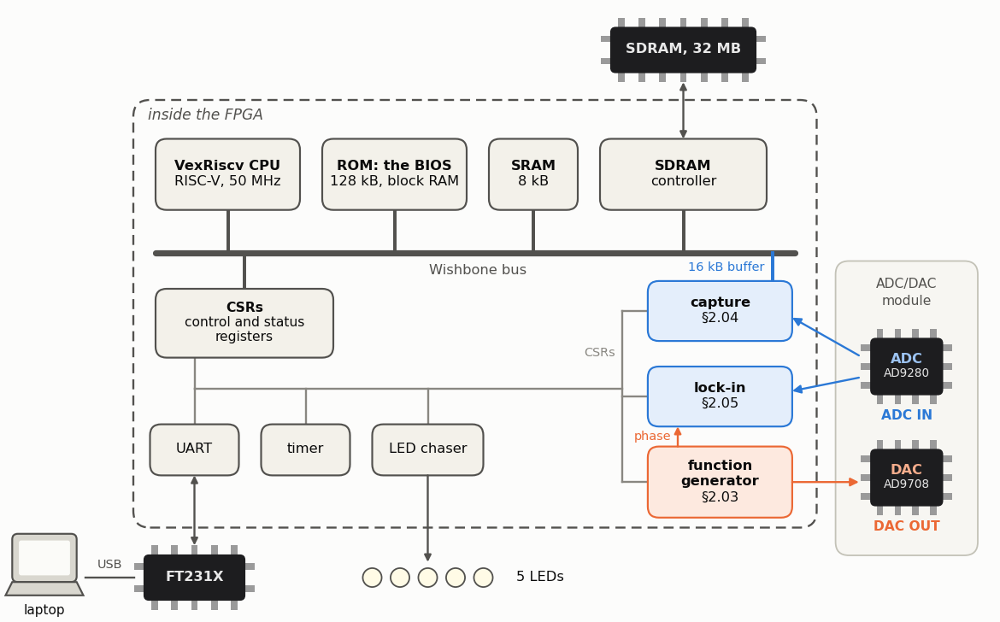

<!-- nav -->
[← 1.10 An AM radio](1_10_am_radio.md#110-an-am-radio) &emsp;&emsp;&emsp; **[Contents](../README.md#contents)** &emsp;&emsp;&emsp; [2.01 A CPU and its BIOS →](2_01_a_cpu_and_its_bios.md#201-a-cpu-and-its-bios)

# 2.00 A processor on the FPGA



**What you need first:** [1.00](1_00_circuits_from_code.md#100-circuits-from-code) and [1.01](1_01_led_counter.md#101-a-counter-on-the-leds) for the tools and loading a bitstream;
[1.03](1_03_dac_sine.md#103-a-sine-direct-digital-synthesis), [1.06](1_06_fast_capture.md#106-fast-captures) and [1.08](1_08_lockin.md#108-a-lock-in-amplifier) for the three peripherals of [2.03](2_03_function_generator_peripheral.md#203-a-function-generator-peripheral)–[2.05](2_05_lockin_peripheral.md#205-a-lock-in-peripheral), which are those designs
with registers on them.

In Chapter 1, changing *anything* (the frequency, the averaging time, the
serial protocol) meant editing SystemVerilog and building a new bitstream. In
this chapter we put a small computer into the FPGA, next to the circuits of
Chapter 1, and let software set them.

## Processors, and RISC-V

Every design in Chapter 1 was a circuit that does one job. A *processor* (a
CPU) is a circuit that can do any job, one small step at a time. It's a state
machine, like [1.06](1_06_fast_capture.md#106-fast-captures)'s capture: on each step it fetches an *instruction*, which is
just a number, from memory, and does what it says: add two numbers, read a word
from memory, write one, or, if some condition holds, *jump* somewhere else in
the program. Then it fetches the next instruction, or the one it jumped to. A
program is a list of these numbers in memory, and a compiler writes the list
for you from C.

A processor is the most general circuit there is, and therefore the slowest
way to do any particular thing. Chapter 1's lock-in did 25 million
multiplications a second in a few dozen flip-flops; this chapter's CPU will
need a whole second to find the primes below 100,000. We want it anyway, for
the reason a lab has a computer beside the oscilloscope: somebody has to
decide what to measure next.

Which numbers mean which instructions is the processor's *instruction set*.
The one you've most likely met is ARM's: it's in many microcontrollers (perhaps
the one in your microcontroller lab), in the Raspberry Pi, in Macs with Apple
chips, and in every phone. ARM is a company, and building an ARM processor
takes its license. **[RISC-V](https://en.wikipedia.org/wiki/RISC-V)** is an instruction set that anyone may build,
free, and many people have, from tiny microcontrollers to server chips. The
one in this chapter, *VexRiscv*, is open-source too, so it can be compiled into
an FPGA like any other design.

## LiteX: a system on chip from Python

[LiteX](https://github.com/enjoy-digital/litex) is a Python library that
assembles a complete *[system on chip](https://en.wikipedia.org/wiki/System_on_a_chip)* (SoC) out of parts: a CPU, a bus,
memory controllers, a serial port, and your own peripherals. It writes a Verilog
description of the whole system for Yosys and nextpnr, which you installed in
[1.00](1_00_circuits_from_code.md#100-circuits-from-code), and it compiles the CPU's first program,
its [BIOS](https://en.wikipedia.org/wiki/BIOS), with a RISC-V C compiler. So you need two more things: LiteX itself
and that compiler.

Work in the same terminal setup as [1.00](1_00_circuits_from_code.md#100-circuits-from-code) (on Windows, in WSL's Ubuntu window),
with the Python virtual environment active (your prompt starts with `(venv)`).

## The RISC-V compiler

| laptop | command |
| --- | --- |
| Linux and WSL (Ubuntu, Debian) | `sudo apt install gcc-riscv64-unknown-elf` |
| macOS, with [Homebrew](https://brew.sh) | `brew install riscv64-elf-gcc` |

Check: `riscv64-unknown-elf-gcc --version` (on a Mac, `riscv64-elf-gcc
--version`). The "64" doesn't matter: this compiler makes code for 32-bit
RISC-V CPUs too, and LiteX tells it to.

## Install LiteX

LiteX lives in a dozen git repositories, and a script fetches them all:

```bash
mkdir -p $ADDA/tools/litex && cd $ADDA/tools/litex
wget https://raw.githubusercontent.com/enjoy-digital/litex/master/litex_setup.py   # macOS: curl -O <same URL>
pip install meson ninja           # LiteX builds the BIOS's C library with these
python3 litex_setup.py --init --install
```

That takes a few minutes and a few hundred MB. Then check it, from the
repository's top folder:

```bash
cd $ADDA
python3 -c "import litex; print('LiteX OK')"
python3 -m litex_boards.targets.icepi_zero --help | head -3
```

> [!IMPORTANT]
> Don't run LiteX tools from inside `$ADDA/tools/litex` itself, the folder that
> holds the `litex/`, `migen/`, ... clones. Python can mistake the `litex/` folder
> there for the `litex` package and fail with a confusing
> `ImportError: cannot import name ... from 'litex' (unknown location)`. Any
> other folder is fine.

Next: build the SoC LiteX already knows for this board, and talk to its CPU.

<!-- nav -->
[← 1.10 An AM radio](1_10_am_radio.md#110-an-am-radio) &emsp;&emsp;&emsp; **[Contents](../README.md#contents)** &emsp;&emsp;&emsp; [2.01 A CPU and its BIOS →](2_01_a_cpu_and_its_bios.md#201-a-cpu-and-its-bios)

<!-- author -->
<sub>Jason Gallicchio, jason@hmc.edu, Harvey Mudd College</sub>
