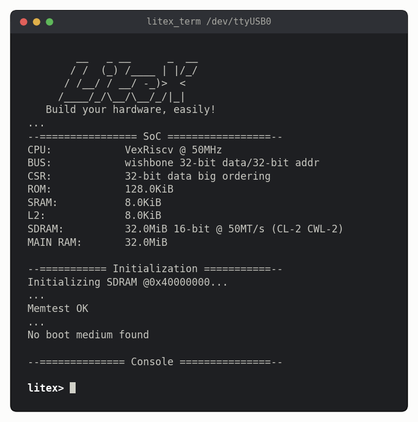
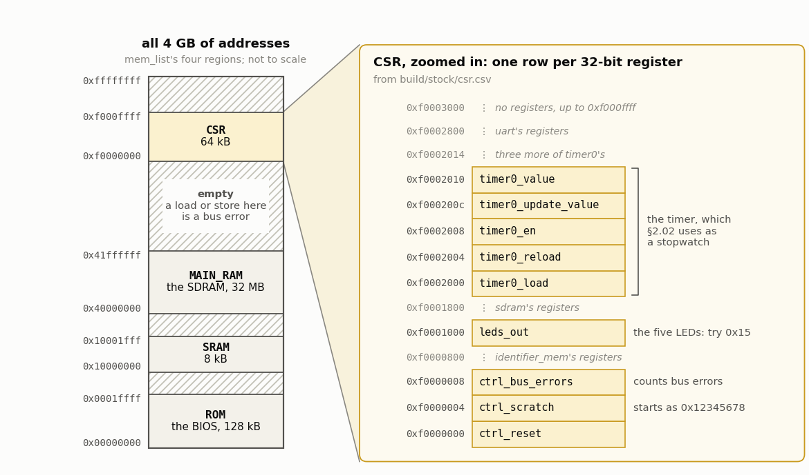

<!-- nav -->
[← 2.00 A processor on the FPGA](2_00_a_processor_on_the_fpga.md#200-a-processor-on-the-fpga) &emsp;&emsp;&emsp; **[Contents](../README.md#contents)** &emsp;&emsp;&emsp; [2.02 C on the CPU →](2_02_c_on_the_cpu.md#202-c-on-the-cpu)

# 2.01 A CPU and its BIOS



Before adding anything of our own, build the SoC that LiteX already knows for
the Icepi Zero, and talk to its CPU.

## What LiteX builds

| part | what it is here |
| --- | --- |
| **CPU** | VexRiscv, a small 32-bit [RISC-V](https://en.wikipedia.org/wiki/RISC-V) processor written in SpinalHDL, running at 50 MHz |
| **bus** | Wishbone: address, data, and read and write strobes. The CPU reaches everything else through it |
| **memory** | a controller for the board's 32 MB of SDRAM, plus on-chip RAM, and a ROM holding the [BIOS](https://en.wikipedia.org/wiki/BIOS) |
| **BIOS** | a small program in that ROM. It tests the memory, then gives you a `litex>` prompt, and it can load other programs over the serial port |
| **CSRs** | *control and status registers*: small registers that connect the CPU to hardware. The CPU writes a *CSRStorage* and the hardware sees the value as a wire; the hardware drives a *CSRStatus* and the CPU reads it. Each one has an address, like memory |
| **LED chaser** | a little piece of logic, like [1.01](1_01_led_counter.md#101-a-counter-on-the-leds)'s counter, that LiteX writes into the FPGA beside the CPU. It runs a light back and forth across the LEDs, by itself, until the CPU writes to its register. Like everything in this table, it's logic inside the FPGA, not a separate chip |

<details>
<summary><b>Detail:</b> where LiteX keeps the board's wiring</summary>

Chapter 1 told the tools which FPGA ball each signal is on with a constraints
file, `icepi_adda.lpf`. LiteX keeps the same facts in a Python *platform
file* for each board, written by the board's designer:
`litex_boards/platforms/icepi_zero.py`, in the LiteX you installed in
[2.00](2_00_a_processor_on_the_fpga.md#200-a-processor-on-the-fpga).
A few of its lines:

```python
("clk50",    0, Pins("M1"),  IOStandard("LVCMOS33")),
("user_led", 0, Pins("E13"), IOStandard("LVCMOS33")),
("serial",   0,
    Subsignal("tx", Pins("K15"), IOStandard("LVCMOS33")),
    Subsignal("rx", Pins("K16"), IOStandard("LVCMOS33"))),
```

`clk50` on ball M1 is `icepi_adda.lpf`'s `clk`. LiteX's `user_led` 0, ball
E13, is the leftmost LED, which [1.01](1_01_led_counter.md#101-a-counter-on-the-leds)
calls `led[4]`: the same wire, numbered the other way round. A design asks for a resource by name
(`platform.request("user_led", 0)`), and LiteX writes the constraints file for
nextpnr itself. The converter module isn't part of the board, so
[2.03](2_03_function_generator_peripheral.md#203-a-function-generator-peripheral)'s
`adda_litex.py` adds its pins the same way, with
`platform.add_extension()`.

</details>

## Build it, load it, connect

```bash
cd src/riscv
python3 -m litex_boards.targets.icepi_zero --build --output-dir build/stock    # about a minute
openFPGALoader -b icepi-zero build/stock/gateware/icepi_zero.bit
litex_term /dev/ttyUSB0                  # your port: see 0.01.  Press Enter for a prompt
```

The build is the same Yosys → nextpnr → ecppack flow as Chapter 1, on a much
bigger design, plus a C compiler run for the BIOS. LiteX prints a lot; the
result is in `build/stock/`. The LEDs start chasing as soon as the bitstream
loads.

`litex_term` is LiteX's terminal program. (Load the bitstream *before*
starting it: the FT231X chip does both jobs, so loading a bitstream
disconnects the serial port. Quit `litex_term` with Ctrl-C.) Type `reboot` at
the prompt to watch the CPU start up:

```
        __   _ __      _  __
       / /  (_) /____ | |/_/
      / /__/ / __/ -_)>  <
     /____/_/\__/\__/_/|_|
   Build your hardware, easily!
...
--================ SoC =================--
CPU:		VexRiscv @ 50MHz
BUS:		wishbone 32-bit data/32-bit addr
CSR:		32-bit data big ordering
ROM:		128.0KiB
SRAM:		8.0KiB
L2:		8.0KiB
SDRAM:		32.0MiB 16-bit @ 50MT/s (CL-2 CWL-2)
MAIN RAM:	32.0MiB

--=========== Initialization ===========--
Initializing SDRAM @0x40000000...
...
Memtest OK
Memspeed at 0x40000000 (Sequential, 2.0MiB)...
  Write speed: 15.5MiB/s
   Read speed: 22.1MiB/s
--================ Boot ================--
Booting from serial...
Press Q or ESC to abort boot completely.
sL5DdSMmkekro
Timeout
No boot medium found

--============== Console ===============--

litex>
```

The BIOS tested the SDRAM, looked for a program to boot (none yet), and gave
up gracefully. `help` lists what it can do.

<details>
<summary><b>Detail:</b> what the CPU does from power-up to the <code>litex></code> prompt</summary>

The BIOS is part of the bitstream. LiteX compiled it, and put it in block RAM
as that RAM's starting contents, the same way Yosys put the sine table of [1.03](1_03_dac_sine.md#103-a-sine-direct-digital-synthesis)
there: so when the FPGA wakes up ([1.01](1_01_led_counter.md#101-a-counter-on-the-leds)), the BIOS is already in memory, in a
128 kB region that the CPU sees as read-only, the ROM, at address 0. A RISC-V
CPU coming out of reset starts fetching instructions from a fixed *reset
address*, here 0x00000000, so the first instruction it runs is the BIOS's.

The BIOS then does what the banner says: it sets up the serial port and
prints the banner, sets up the SDRAM controller and tests the first 2 MB of
the SDRAM, and tries each way it knows of to boot a program. This SoC knows
only one, the serial port: the BIOS sends the string `sL5DdSMmkekro` and waits
a quarter of a second for `litex_term` to answer. Nobody answered, so it
prints `litex>` and waits for your commands, forever.

</details>

## Peek and poke

Every register in the SoC has an address, and the BIOS's `mem_read` and
`mem_write` commands load from and store to any address you like. Where's
everything? `mem_list` gives the big regions:

```
litex> mem_list
Available memory regions:
Region   Origin     End        Size
ROM      0x00000000 0x0001ffff 0x20000
SRAM     0x10000000 0x10001fff 0x2000
MAIN_RAM 0x40000000 0x41ffffff 0x2000000
CSR      0xf0000000 0xf000ffff 0x10000
```

and `build/stock/csr.csv`, which LiteX wrote, lists every register:

```text
csr_register,ctrl_reset,0xf0000000,1,rw
csr_register,ctrl_scratch,0xf0000004,1,rw
csr_register,ctrl_bus_errors,0xf0000008,1,ro
csr_register,leds_out,0xf0001000,1,rw
csr_register,timer0_load,0xf0002000,1,rw
...
```

Together they make a map. Almost all of the 4 GB that 32-bit addresses can
name is empty, and the registers are a thin slice at the top:



`ctrl_scratch` is a register that does nothing at all, which makes it a good
first experiment. It starts out holding 0x12345678:

```
litex> mem_read 0xf0000004
Memory dump:
0xf0000004  78 56 34 12                                      xV4.
litex> mem_write 0xf0000004 0xcafe
litex> mem_read 0xf0000004 4
Memory dump:
0xf0000004  fe ca 00 00                                      ....
```

(The bytes come out lowest first, because RISC-V is *little-endian*.) Now the
LEDs. `leds_out` is at 0xf0001000:

```
litex> mem_write 0xf0001000 0x15
```

The chaser stops, and the LEDs show `10101`. Try `0x01`: the *leftmost* LED
lights. LiteX numbers the LEDs the opposite way from Chapter 1's
`icepi_adda.lpf`, with bit 0 on the left.

That's the whole idea of a *memory-mapped* peripheral: a store instruction to
one address, and a wire inside the FPGA changes. The BIOS's `leds` command
(`leds 0x15`) does exactly the same store for you.

**Try this:**

- Count from 0 to 31 on the LEDs by hand, with `mem_write`. Then think about
  how much easier that would be with a program (next section).
- Find the timer's registers in `csr.csv`. Start it counting: write 0 to
  `timer0_en`, 0xffffffff to `timer0_load`, and 1 to `timer0_en`. Then write
  1 to `timer0_update_value` (which copies the count into `timer0_value`) and
  read `timer0_value`. Do that twice, a second or so apart. Which way is it
  counting, and how fast? ([2.02](2_02_c_on_the_cpu.md#202-c-on-the-cpu) uses it as a stopwatch.)

<!-- nav -->
[← 2.00 A processor on the FPGA](2_00_a_processor_on_the_fpga.md#200-a-processor-on-the-fpga) &emsp;&emsp;&emsp; **[Contents](../README.md#contents)** &emsp;&emsp;&emsp; [2.02 C on the CPU →](2_02_c_on_the_cpu.md#202-c-on-the-cpu)

<!-- author -->
<sub>Jason Gallicchio, jason@hmc.edu, Harvey Mudd College</sub>
