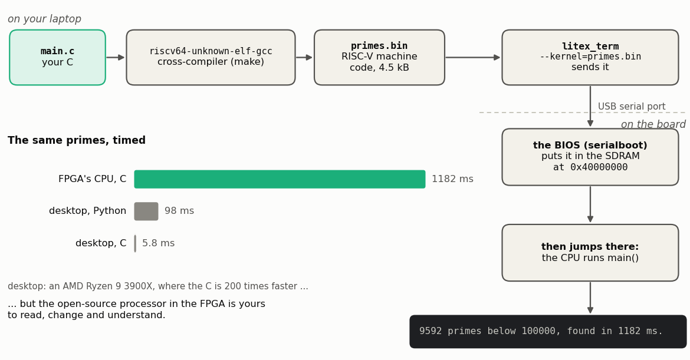

<!-- nav -->
[← 2.01 A CPU and its BIOS](2_01_a_cpu_and_its_bios.md#201-a-cpu-and-its-bios) &emsp;&emsp;&emsp; **[Contents](../README.md#contents)** &emsp;&emsp;&emsp; [2.03 A function-generator peripheral →](2_03_function_generator_peripheral.md#203-a-function-generator-peripheral)

# 2.02 C on the CPU



Poking registers by hand gets old fast. Let's write a program. A good first
job for a processor is one that would be miserable in logic: finding prime
numbers. It's all loops, multiplications and remainders, and the CPU does
those without being told how.

<!-- file: src/riscv/primes/main.c -->
```c
// main.c -- a first C program for the RISC-V CPU inside the FPGA: prime numbers.
//
// Nothing here needs the ADC or the DAC: it is the kind of job a processor is for.
// It counts the primes below 100,000 and times itself with the SoC's timer, then
// shows one prime after another on the LEDs, in binary, slowly enough to read.
//
//     make                                         -> primes.bin (needs ../build/stock)
//     litex_term --kernel=primes.bin /dev/ttyUSB0  then type "serialboot" at litex>

#include <stdio.h>

#include <irq.h>
#include <libbase/uart.h>
#include <libbase/console.h>
#include <generated/csr.h>      // leds_out_write(), timer0_...(): written by LiteX
#include <generated/soc.h>      // CONFIG_CLOCK_FREQUENCY

// ##########################################################################
// ##  KEY FUNCTION: trial division.  Every candidate costs a multiply (d*d)
// ##  and a remainder (n % d) per step: real arithmetic for the CPU.
// ##########################################################################
static int is_prime(unsigned int n)
{
	if (n < 2)
		return 0;
	if (n % 2 == 0)
		return n == 2;
	for (unsigned int d = 3; d * d <= n; d += 2)
		if (n % d == 0)
			return 0;
	return 1;
}

// The SoC's timer0 counts down at the 50 MHz system clock.  Start it at the
// top, and the number of clock ticks since then is how far it has come down.
static void timer_start(void)
{
	timer0_en_write(0);
	timer0_reload_write(0);
	timer0_load_write(0xffffffff);
	timer0_en_write(1);
}

static unsigned int timer_ticks(void)
{
	timer0_update_value_write(1);       // copy the counter into timer0_value
	return 0xffffffff - timer0_value_read();
}

// LiteX numbers the LEDs from the left (bit 0 = leftmost), so reverse the
// five bits to make a binary number read the usual way, MSB on the left.
static void leds_show(unsigned int v)
{
	unsigned int r = 0;
	for (int i = 0; i < 5; i++)
		if (v & (1 << i))
			r |= 1 << (4 - i);
	// ######################################################################
	// ##  KEY LINE: one store instruction to the LED register's address.
	// ######################################################################
	leds_out_write(r);
}

int main(void)
{
#ifdef CONFIG_CPU_HAS_INTERRUPT
	irq_setmask(0);
	irq_setie(1);
#endif
	uart_init();
	printf("\nPrime numbers on a RISC-V CPU inside an FPGA.\n");

	// 1. How fast is this CPU?
	timer_start();
	unsigned int count = 0;
	for (unsigned int n = 2; n < 100000; n++)
		if (is_prime(n))
			count++;
	unsigned int ms = timer_ticks() / (CONFIG_CLOCK_FREQUENCY / 1000);
	printf("%u primes below 100000, found in %u ms.\n", count, ms);

	// 2. One prime every 0.2 s, on the LEDs.
	printf("Now one at a time, on the LEDs (the low 5 bits).  Press any key to pause.\n");
	for (unsigned int n = 2;; n++) {
		if (readchar_nonblock()) {       // a key was pressed: wait for another
			getchar();
			printf("paused; press any key to go on\n");
			getchar();
		}
		if (!is_prime(n))
			continue;
		leds_show(n);
		char bits[6];                   // the low 5 bits as text, like the LEDs
		for (int i = 0; i < 5; i++)
			bits[i] = (n >> (4 - i)) & 1 ? '1' : '0';
		bits[5] = 0;
		printf("%6u   LEDs %s\n", n, bits);
		busy_wait(200);                 // milliseconds
	}
	return 0;
}
```

Three things here come from LiteX, not from C:

- `leds_out_write()`, `timer0_load_write()` and friends are in
  `build/stock/software/include/generated/csr.h`, which LiteX wrote when it
  built the SoC. Each one is a single store to (or load from) the register's
  address: `leds_out_write(r)` is exactly the `mem_write 0xf0001000` of [2.01](2_01_a_cpu_and_its_bios.md#201-a-cpu-and-its-bios).
- `printf()`, `getchar()` and `readchar_nonblock()` talk to the serial port,
  through LiteX's small C library.
- `busy_wait(ms)` waits, using the timer.

## Build it, and send it to the CPU

The [`Makefile`](../src/riscv/primes/Makefile) borrows LiteX's own build
rules, and needs the stock SoC's build folder from [2.01](2_01_a_cpu_and_its_bios.md#201-a-cpu-and-its-bios):

```bash
cd src/riscv/primes
make                                            # -> primes.bin, about 4.5 kB
litex_term --kernel=primes.bin /dev/ttyUSB0
```

`--kernel` names the program for `litex_term` to send when the [BIOS](https://en.wikipedia.org/wiki/BIOS) asks for
one. LiteX calls it a "kernel" because the usual thing to send is an
operating-system kernel (Chapter 3 sends Linux's), but any program will do,
and here it's ours. It goes into the SDRAM at 0x40000000 (`MAIN_RAM` in
`mem_list`) unless you say otherwise with `--kernel-adr`.

At the `litex>` prompt, type **`serialboot`**. The BIOS asks `litex_term` for
the program, loads it, and jumps to it:

```
litex> serialboot
Booting from serial...
Press Q or ESC to abort boot completely.
sL5DdSMmkekro
[LITEX-TERM] Received firmware download request from the device.
[LITEX-TERM] Uploading primes.bin to 0x40000000 (4512 bytes)...
[LITEX-TERM] Upload complete (10.9KB/s).
[LITEX-TERM] Booting the device.
[LITEX-TERM] Done.
Executing booted program at 0x40000000

--============== Liftoff! ==============--

Prime numbers on a RISC-V CPU inside an FPGA.
9592 primes below 100000, found in 1182 ms.
Now one at a time, on the LEDs (the low 5 bits).  Press any key to pause.
     2   LEDs 00010
     3   LEDs 00011
     5   LEDs 00101
     7   LEDs 00111
    11   LEDs 01011
...
```

Two programs printed into that one terminal: the lines in `[LITEX-TERM]`
brackets are `litex_term` on the laptop; everything else is the board.

The LEDs step through the primes in binary, five times a second.

<details>
<summary><b>Detail:</b> how the program gets into memory, and how <code>main()</code> starts</summary>

`serialboot` sends the same request string as at power-up (`sL5DdSMmkekro`),
and this time `litex_term` answers. It sends `primes.bin` in frames of up to
251 bytes, each with a checksum; the BIOS writes each frame into the SDRAM at
the address it names, and answers with an acknowledgement, or a request to
send it again. The last frame is a *jump* command with the address
0x40000000. The BIOS prints `Executing booted program at 0x40000000`, turns
off interrupts, flushes the CPU's caches (so that it fetches the new
instructions from the SDRAM, not stale copies), and jumps: it sets the CPU's
program counter to 0x40000000, and the BIOS is done.

`primes.bin` is nothing but instructions and data, laid out by the linker
script so that the first instructions are LiteX's `crt0.S` (*C run-time,
part 0*). Before any C can run, something has to set up what C takes for
granted: `crt0` points the stack pointer at the top of the on-chip SRAM, tells
the CPU where to go if an interrupt or an error happens, sets every global
variable without an initial value to zero, and then calls `main()`. Our
`main()` never returns: an embedded program has nowhere to return to.

</details>

<details>
<summary>The Makefile</summary>

<!-- file: src/riscv/primes/Makefile -->
```makefile
# Build the firmware against a LiteX build directory:
#     make                          (the stock SoC of 2.01, in ../build/stock)
#     make BUILD_DIR=../build/icepi_zero     (or any other LiteX build)
# (adapted from LiteX's own litex/soc/software/demo/Makefile)
BUILD_DIR ?= ../build/stock

include $(BUILD_DIR)/software/include/generated/variables.mak
include $(SOC_DIRECTORY)/software/common.mak

OBJECTS = crt0.o main.o

all: primes.bin

%.bin: %.elf
	$(OBJCOPY) -O binary $< $@

primes.elf: $(OBJECTS)
	$(CC) $(LDFLAGS) -T linker.ld -N -o $@ $(OBJECTS) \
		$(PACKAGES:%=-L$(BUILD_DIR)/software/%) \
		-Wl,--start-group $(LIBS:lib%=-l%) -Wl,--end-group \
		-Wl,--gc-sections

-include $(OBJECTS:.o=.d)

VPATH = $(BIOS_DIRECTORY):$(BIOS_DIRECTORY)/cmds:$(CPU_DIRECTORY)

%.o: %.c
	$(compile)

%.o: %.S
	$(assemble)

clean:
	$(RM) $(OBJECTS) $(OBJECTS:.o=.d) primes.elf primes.bin

.PHONY: all clean
```

(`linker.ld` in the same folder is LiteX's demo linker script. It puts the
program in the SDRAM and its stack in the on-chip SRAM.)

</details>

## How fast is it?

1182 ms for the primes below 100,000. The same C, compiled for the desktop
that wrote this tutorial (an AMD Ryzen 9 3900X), takes 5.8 ms: 200 times
faster. Even Python on that desktop takes only 98 ms. That's the honest
truth about soft CPUs: a 50 MHz processor built out of an FPGA's logic is
slow. What makes it worth having is that it sits right next to your own
hardware, as the next three sections show.

<details>
<summary><b>Detail:</b> why 200 times?</summary>

Roughly: the desktop's clock is about 80 times faster (about 4 GHz against
50 MHz), and it does more per clock (several instructions at once, against at
most one), and it divides much faster. Trial division is mostly `%`, the
remainder, and VexRiscv's divider takes many clock cycles per division. Count
the instructions in the inner loop and you can predict the time to within a
factor of two; `riscv64-unknown-elf-objdump -d primes.elf` shows them.

</details>

**Try this:**

- LiteX comes with a demo program that includes a spinning ASCII donut. In
  a scratch folder, `litex_bare_metal_demo --build-path=<path>/src/riscv/build/stock`,
  then `litex_term --kernel=demo.bin /dev/ttyUSB0`, `serialboot`, and `donut`.
- Count primes below a million instead. Predict the time first: how does
  trial division's work grow with *n*?
- Replace trial division with a sieve of Eratosthenes, in the 32 MB of SDRAM
  (`static unsigned char sieve[N];`). How much faster is it?

<!-- nav -->
[← 2.01 A CPU and its BIOS](2_01_a_cpu_and_its_bios.md#201-a-cpu-and-its-bios) &emsp;&emsp;&emsp; **[Contents](../README.md#contents)** &emsp;&emsp;&emsp; [2.03 A function-generator peripheral →](2_03_function_generator_peripheral.md#203-a-function-generator-peripheral)

<!-- author -->
<sub>Jason Gallicchio, jason@hmc.edu, Harvey Mudd College</sub>
