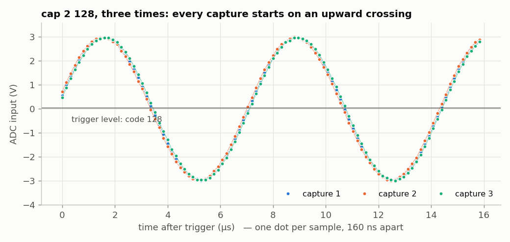

<!-- nav -->
[← 2.03 A function-generator peripheral](2_03_function_generator_peripheral.md#203-a-function-generator-peripheral) &emsp;&emsp;&emsp; **[Contents](../README.md#contents)** &emsp;&emsp;&emsp; [2.05 A lock-in peripheral →](2_05_lockin_peripheral.md#205-a-lock-in-peripheral)

# 2.04 A capture peripheral



The capture core is [1.06](1_06_fast_capture.md#106-fast-captures)'s `capture.sv` without the
serial port, plus a trigger. What's new is how the CPU gets the samples: not
one register at a time, but through a 16 kB window in its address space.

<!-- file: src/riscv/adc_capture_core.sv -->
```systemverilog
// adc_capture_core.sv -- record 16384 ADC samples into a buffer the CPU can read.
//
// capture.sv without the serial port: a `start` pulse records 16384 samples
// (keeping 1 in 2^decimation), optionally waiting first for the signal to
// cross `trig_level` going upward.  The buffer is 4096 32-bit words, four
// samples per word, first sample in the lowest byte -- so on the
// (little-endian) CPU it simply reads as an array of 16384 bytes.

module adc_capture_core (
    input  logic        clk,
    input  logic [7:0]  sample,
    input  logic        sample_valid,
    // control, from the CPU's registers
    input  logic        start,          // pulse: begin a new capture
    input  logic [3:0]  decimation,     // keep 1 sample in 2^decimation
    input  logic        trig_enable,    // wait for an upward crossing first
    input  logic [7:0]  trig_level,
    output logic        busy,
    output logic        done = 0,       // a complete capture is in the buffer
    // the CPU's read port into the buffer
    input  logic [11:0] rd_addr,
    output logic [31:0] rd_data = 0
);
    logic [31:0] mem [0:4095];
    // ##########################################################################
    // ##  KEY LINE: the CPU's side of the buffer.  Whatever address the CPU
    // ##  reads, the word stored there comes back one clock later.
    // ##########################################################################
    always_ff @(posedge clk)
        rd_data <= mem[rd_addr];

    typedef enum logic [1:0] {IDLE, ARMED, RECORD} state_t;
    state_t      state = IDLE;
    logic [15:0] skip  = 0;
    logic [7:0]  last  = 0;             // previous kept sample, for the trigger
    logic [13:0] n     = 0;             // samples recorded so far
    logic [23:0] pack  = 0;             // the first three samples of a word

    assign busy = (state != IDLE);

    // "keep" is high for the samples that survive decimation
    logic keep;
    assign keep = sample_valid && (skip == 0);
    always_ff @(posedge clk)
        if (start || state == IDLE)
            skip <= 0;
        else if (sample_valid)
            skip <= (skip == 0) ? (16'd1 << decimation) - 1 : skip - 1;

    always_ff @(posedge clk) begin
        if (start) begin
            done  <= 0;
            n     <= 0;
            last  <= 8'hff;             // forget the old signal: no crossing yet
            state <= trig_enable ? ARMED : RECORD;
        end else case (state)
            ARMED:
                if (keep) begin
                    last <= sample;
                    // ##########################################################
                    // ##  KEY LINE: the trigger.  Below the level last time,
                    // ##  at or above it now: start recording.
                    // ##########################################################
                    if (last < trig_level && sample >= trig_level)
                        state <= RECORD;
                end
            RECORD:
                if (keep) begin
                    // ##########################################################
                    // ##  KEY LINE: shift each sample in; every 4th completes
                    // ##  a 32-bit word, which goes into the buffer.
                    // ##########################################################
                    if (n[1:0] == 3)
                        mem[n[13:2]] <= {sample, pack};
                    pack <= {sample, pack[23:8]};
                    n <= n + 1;
                    if (n == 16383) begin
                        state <= IDLE;
                        done  <= 1;
                    end
                end
        endcase
    end
endmodule
```

In [`adda_litex.py`](../src/riscv/adda_litex.py) (printed in [2.03](2_03_function_generator_peripheral.md#203-a-function-generator-peripheral)), `AdcCapture`
has three registers, `control`, `config` and `status`, built from named
*fields*. `CSRField("start", pulse=True)` is a bit that's high for exactly one
clock when the CPU writes a 1, which is just what the core's `start` input
wants.

The buffer is a **bus slave**. `wishbone.Interface()` is the bundle of wires a
Wishbone device has (`adr`, `dat_r`, `cyc`, `stb`, `ack`, ...). The wrapper
connects the address to the core's read port and answers every request one
clock later with `ack`, which is how long the block RAM takes. Each 32-bit
word holds four samples, the first in its lowest byte:

| | byte 3 | byte 2 | byte 1 | byte 0 |
| --- | --- | --- | --- | --- |
| word *n* holds | sample 4*n*+3 | sample 4*n*+2 | sample 4*n*+1 | sample 4*n* |
| at CPU byte address | 4*n*+3 | 4*n*+2 | 4*n*+1 | 4*n* |

RISC-V is little-endian, so the CPU's byte address 4*n*+*k* holds sample
4*n*+*k*: the C program sees a byte array, in order. Then

```python
soc.bus.add_slave("capture_buf", soc.capture.bus, SoCRegion(size=0x4000, cached=False))
```

tells LiteX to give it 16 kB of addresses. `cached=False` places it in the
CPU's uncached I/O area: the CPU must fetch fresh samples every time, not
reuse stale copies from its data cache. LiteX chose 0x80000000 because
VexRiscv treats the top half of its address space as I/O and never caches it;
that is also why the CSRs live at 0xf0000000. To the C program, the buffer is
just an array:

```c
static volatile uint8_t *const samples = (volatile uint8_t *)CAPTURE_BUF_BASE;
```

`volatile` tells the compiler that this memory can change behind its back, so
every `samples[i]` must be a real load.

With the firmware from [2.03](2_03_function_generator_peripheral.md#203-a-function-generator-peripheral) running, `cap D [level]` records 16384 samples at
25 MS/s ÷ 2<sup>D</sup> (optionally waiting for an upward crossing of
`level`), and `dump` prints them in hex:

```
adda> cap 2 128
capture: 16384 samples at 6250000 S/s, codes 51..203, mean 126
adda> dump
898d93979b9fa3a6a9abadafb0b1b1b2b0aeacaaa7a4a09d98938e8a85807a76716c67635f5b5855...
```

`cap_plot.py` does that for you from the laptop, and plots the result. Quit
`litex_term` first: only one program can have the port open at a time.

<details>
<summary>The whole file: <code>cap_plot.py</code></summary>

<!-- file: src/riscv/cap_plot.py -->
```python
#!/usr/bin/env python3
"""2.04, the laptop side: ask the firmware for a capture and plot it.

    python3 cap_plot.py                 # 25 MS/s, free-running
    python3 cap_plot.py -d 2 -t 128     # 6.25 MS/s, triggered at mid-scale
    python3 cap_plot.py -o scope.csv --no-plot

The firmware must be running (its prompt is "adda>"), and no terminal program
may have the port open.
"""
import argparse
import re
import time

import numpy as np
import serial

N = 16384


def find_port():
    """The first FTDI FT231X serial port (USB ID 0403:6015): the Icepi Zero's."""
    from serial.tools import list_ports
    for p in list_ports.comports():
        if (p.vid, p.pid) == (0x0403, 0x6015):
            return p.device
    raise SystemExit("No Icepi Zero found. Is it plugged in? (Or give --port.)")


def cap(port, d=0, level=None):
    """Returns (time in s, ADC codes) from the firmware's cap + dump commands."""
    with serial.Serial(port, 115200, timeout=0.2) as ser:
        ser.write(b"\r")
        time.sleep(0.2)
        ser.reset_input_buffer()
        ser.write(b"cap %d%s\r" % (d, b"" if level is None else b" %d" % level))
        reply = b""
        while b"adda> " not in reply:
            chunk = ser.read(256)
            if not chunk and b"cap" in reply and time.time() > deadline:
                raise RuntimeError("no reply: is the firmware running?")
            if not reply:
                deadline = time.time() + 25
            reply += chunk
        print(reply.decode(errors="replace").replace("\r", "").splitlines()[1])
        ser.write(b"dump\r")
        text = b""
        while text.count(b"\n") < N // 64 + 1:
            chunk = ser.read(4096)
            if not chunk:
                break
            text += chunk
    text = text.replace(b"\r", b"")          # LiteX's console ends lines with \n\r
    hexdigits = b"".join(re.findall(rb"^[0-9a-f]{128}$", text, re.M))
    codes = np.frombuffer(bytes.fromhex(hexdigits.decode()), dtype=np.uint8)
    if len(codes) != N:
        raise RuntimeError(f"got {len(codes)} of {N} samples")
    return np.arange(N) / (25e6 / 2**d), codes


if __name__ == "__main__":
    ap = argparse.ArgumentParser(description=__doc__,
                                 formatter_class=argparse.RawDescriptionHelpFormatter)
    ap.add_argument("--port", help="serial port (default: find the Icepi Zero)")
    ap.add_argument("-d", type=int, default=0, help="keep 1 sample in 2^d")
    ap.add_argument("-t", "--trigger", type=int, help="trigger level, 0..255")
    ap.add_argument("-o", "--out", help="save time,code as CSV")
    ap.add_argument("--no-plot", action="store_true")
    args = ap.parse_args()

    t, code = cap(args.port or find_port(), args.d, args.trigger)
    if args.out:
        np.savetxt(args.out, np.column_stack([t, code]), delimiter=",",
                   header="time_s,adc_code", fmt=["%.9g", "%d"])
    if not args.no_plot:
        import matplotlib.pyplot as plt
        plt.plot(t * 1e6, (code - 126.7) / 25.35, ".-", markersize=3, linewidth=0.5)
        plt.xlabel("time (µs)")
        plt.ylabel("ADC input (V)")
        plt.grid(True)
        plt.show()
```

</details>

```console
$ python3 cap_plot.py -d 2 -t 128
capture: 16384 samples at 6250000 S/s, codes 51..203, mean 126
```

The figure at the top of this page shows three of them.

Printing 16384 samples as text at 115,200 baud takes 3.4 s, against 0.16 s
for [1.06](1_06_fast_capture.md#106-fast-captures)'s raw bytes at 1 Mbaud. That's the price of going through a console
meant for humans. Chapter 3 reads the same buffer under Linux.

**Try this:**

- Add a *pre-trigger*: keep recording into the buffer as a ring while
  `ARMED`, and stop 8192 samples after the trigger, so that the capture shows
  what happened before the trigger as well as after.
- Add a `level` readback: a `CSRStatus(8)` that always holds the latest ADC
  sample, so the firmware can be a slow voltmeter without a capture.

<!-- nav -->
[← 2.03 A function-generator peripheral](2_03_function_generator_peripheral.md#203-a-function-generator-peripheral) &emsp;&emsp;&emsp; **[Contents](../README.md#contents)** &emsp;&emsp;&emsp; [2.05 A lock-in peripheral →](2_05_lockin_peripheral.md#205-a-lock-in-peripheral)

<!-- author -->
<sub>Jason Gallicchio, jason@hmc.edu, Harvey Mudd College</sub>
