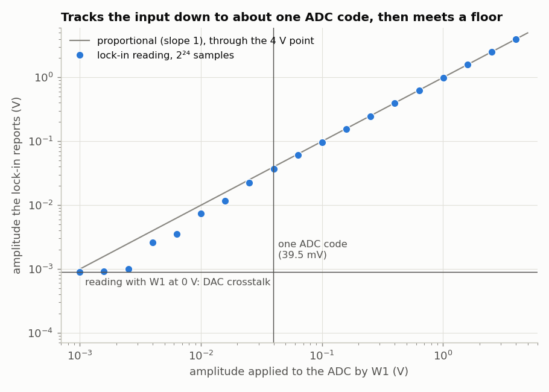

<!-- nav -->
[← 2.04 A capture peripheral](2_04_capture_peripheral.md#204-a-capture-peripheral) &emsp;&emsp;&emsp; **[Contents](../README.md#contents)** &emsp;&emsp;&emsp; [2.06 The registers from the laptop →](2_06_registers_from_the_laptop.md#206-the-registers-from-the-laptop)

# 2.05 A lock-in peripheral



The lock-in core is [1.08](1_08_lockin.md#108-a-lock-in-amplifier)'s `lockin.sv` minus its serial port
and its own DDS. Its reference is the **function generator's phase**, wired
straight across in `add_adda()`, so the lock-in always detects at whatever
frequency the function generator is playing.

<!-- file: src/riscv/lockin_core.sv -->
```systemverilog
// lockin_core.sv -- lockin.sv's lock-in, with the serial port replaced by
// registers.  The reference is the function generator's own phase, so
// whatever frequency the function generator is set to is what we detect.
//
// A `start` pulse sums 2^n_log2 products (n_log2 up to 24: 0.67 s):
//     x_sum = sum (adc - 128) * cos(wt)      y_sum = sum (adc - 128) * -sin(wt)
// calling the stimulus cos(wt), as lockin.sv does, with both references from one
// table of +-127.  The CPU divides by 2^n_log2.

module lockin_core (
    input  logic        clk,
    input  logic [7:0]  sample,
    input  logic        sample_valid,
    input  logic [31:0] phase,          // from funcgen_core
    input  logic        start,
    input  logic [4:0]  n_log2,
    output logic        busy = 0,
    output logic        done = 0,
    output logic signed [47:0] x_sum = 0,
    output logic signed [47:0] y_sum = 0
);
    logic signed [7:0] sine_table [0:255];
    initial
        for (int i = 0; i < 256; i++)
            sine_table[i] = $rtoi($floor(127.0 * $sin(6.283185307179586 * i / 256) + 0.5));

    // the same 3-step assembly line as lockin.sv
    logic               v1 = 0, v2 = 0;
    logic signed [8:0]  s = 0;
    logic signed [7:0]  ref_x = 0, ref_y = 0;
    logic signed [16:0] p_x = 0, p_y = 0;
    logic signed [47:0] acc_x = 0, acc_y = 0;
    logic [24:0]        count = 0;

    always_ff @(posedge clk) begin
        v1      <= sample_valid;
        s       <= $signed({1'b0, sample}) - 9'sd128;
        ref_x <= sine_table[phase[31:24]];            // cos(wt): the stimulus
        ref_y <= sine_table[phase[31:24] + 8'd64];    // a quarter turn on: -sin(wt)
        v2      <= v1;
        // ######################################################################
        // ##  KEY LINE 1: multiply the signal by both references, cos and -sin.
        // ######################################################################
        p_x   <= s * ref_x;
        p_y   <= s * ref_y;

        if (start) begin
            acc_x <= 0;
            acc_y <= 0;
            count <= 0;
            busy  <= 1;
            done  <= 0;
        end else if (busy && v2) begin
            // ##################################################################
            // ##  KEY LINE 2: add up the products; the CPU divides at the end.
            // ##################################################################
            acc_x <= acc_x + p_x;
            acc_y <= acc_y + p_y;
            count <= count + 1;
            if (count == (25'd1 << n_log2) - 1) begin
                x_sum <= acc_x + p_x;
                y_sum <= acc_y + p_y;
                busy  <= 0;
                done  <= 1;
            end
        end
    end
endmodule
```

The sums are 48 bits wide, too wide for one 32-bit register. `CSRStatus(64)`
simply occupies two addresses, and LiteX's generated `lockin_x_read()` reads
both and returns a `uint64_t`. The C side divides by 2<sup>n_log2</sup> and
does the square root and arctangent in floating point. VexRiscv has no
floating-point unit, so the compiler calls software routines instead. That's
slow, but it happens once per 42 ms measurement. This is a good division of
labor: the FPGA does 50 million multiplications a second, and the CPU does
the few awkward ones at the end.

## The whole firmware

<details>
<summary><code>firmware/main.c</code>: all three instruments, and a command shell</summary>

<!-- file: src/riscv/firmware/main.c -->
```c
// main.c -- a small command shell for the ADC/DAC peripherals (2.03-2.05, and
// 7.04's loadable filter).
//
// Runs on the VexRiscv CPU inside the FPGA.  Talk to it with
//     litex_term --kernel=firmware.bin /dev/ttyUSB0
// and type "help".
//
// Every peripheral register has a C function made for it by LiteX, in
// build/icepi_zero/software/include/generated/csr.h: funcgen_tw_write(),
// capture_status_read(), lockin_x_read() and so on.  Each one is a single
// load or store to a fixed address.

#include <stdio.h>
#include <stdlib.h>
#include <string.h>
#include <math.h>

#include <irq.h>
#include <system.h>
#include <libbase/uart.h>
#include <libbase/console.h>
#include <generated/csr.h>
#include <generated/mem.h>
#include <generated/soc.h>

#define F_SYS              CONFIG_CLOCK_FREQUENCY   /* 50 MHz */
#define ADC_CODES_PER_VOLT 25.35f                   /* measured: see 0.00 */
#define N_SAMPLES          16384

/*---- function generator (2.03) ---------------------------------------------*/

static const char *wave_names[] = {"sine", "square", "triangle", "sawtooth"};

static void funcgen_set(uint32_t hz, int amplitude, int wave)
{
	uint32_t tw = ((uint64_t)hz << 32) / F_SYS;     /* f = tw * F_SYS / 2^32 */
	/* ####################################################################
	 * ##  KEY LINE: one store to the tuning-word register, and the DDS in
	 * ##  funcgen_core.sv starts making the new frequency.
	 * #################################################################### */
	funcgen_tw_write(tw);
	funcgen_amplitude_write(amplitude);
	funcgen_waveform_write(wave);
}

static void print_frequency(void)
{
	uint64_t f = (uint64_t)funcgen_tw_read() * F_SYS;      /* Hz * 2^32 */
	uint32_t hz = f >> 32;
	uint32_t mhz = ((f & 0xffffffff) * 1000) >> 32;         /* the fraction, in mHz */
	printf("%lu.%03lu Hz", (unsigned long)hz, (unsigned long)mhz);
}

static void fg_cmd(char *args[], int n)
{
	if (n >= 2) {
		int amplitude = (n >= 3) ? atoi(args[2]) : 255;
		int wave = 0;
		if (n >= 4)
			for (int i = 0; i < 4; i++)
				if (strncmp(args[3], wave_names[i], 3) == 0)
					wave = i;
		funcgen_set(strtoul(args[1], NULL, 0), amplitude, wave);
	}
	printf("funcgen: ");
	print_frequency();
	printf(", amplitude %d/255, %s\n", (int)funcgen_amplitude_read(),
	       wave_names[funcgen_waveform_read() & 3]);
}

/*---- ADC capture (2.04) ------------------------------------------------------*/

/* The capture buffer is ordinary memory as far as the CPU is concerned. */
static volatile uint8_t *const samples = (volatile uint8_t *)CAPTURE_BUF_BASE;

static int capture(int decimation, int trig_level)
{
	uint32_t config = decimation & 0xf;
	if (trig_level >= 0)                                  /* trig_enable + level */
		config |= (1 << 8) | ((trig_level & 0xff) << 16);
	capture_config_write(config);
	/* ####################################################################
	 * ##  KEY LINE: start a capture.  The hardware records 16384 samples by
	 * ##  itself; the CPU just waits for the `done` bit below.
	 * #################################################################### */
	capture_control_write(1);                             /* start */
	for (int ms = 0; ms < 25000; ms++) {                  /* 16384 samples: 0.7 ms .. 21 s at decimation 15 */
		if (capture_status_read() & 2)                /* done */
			return 0;
		busy_wait(1);
	}
	return -1;
}

static void cap_cmd(char *args[], int n)
{
	int d = (n >= 2) ? atoi(args[1]) : 0;
	int level = (n >= 3) ? atoi(args[2]) : -1;
	if (capture(d, level) < 0) {
		printf("capture: timed out (no trigger?)\n");
		return;
	}
	int lo = 255, hi = 0, sum = 0;
	for (int i = 0; i < N_SAMPLES; i++) {
		int s = samples[i];                          /* a load from the buffer */
		lo = s < lo ? s : lo;
		hi = s > hi ? s : hi;
		sum += s;
	}
	printf("capture: %d samples at %lu S/s, codes %d..%d, mean %d\n", N_SAMPLES,
	       (unsigned long)(F_SYS / 2 >> d), lo, hi, sum / N_SAMPLES);
}

static void dump_cmd(void)
{
	/* 16384 samples as hex, 64 per line: 34 kB of text, ~3 s at 115200 baud */
	for (int i = 0; i < N_SAMPLES; i++) {
		printf("%02x", samples[i]);
		if (i % 64 == 63)
			printf("\n");
	}
}

/*---- lock-in (2.05) ----------------------------------------------------------*/

/* One measurement at the function generator's frequency.  Returns the
   amplitude (volts at the ADC) and phase (degrees) of what came back. */
static int lockin_measure(int n_log2, float *volts, float *degrees)
{
	lockin_n_log2_write(n_log2);
	lockin_control_write(1);                              /* start */
	for (int ms = 0; ms < 2000; ms++) {
		if (lockin_status_read() & 2) {               /* done */
			/* The sums are 64-bit; divide by 2^n_log2 in integers first
			   (keeping 8 fraction bits), since this CPU's C library can't
			   convert a 64-bit integer straight to float. */
			int32_t x256 = (int64_t)lockin_x_read() >> (n_log2 - 8);
			int32_t y256 = (int64_t)lockin_y_read() >> (n_log2 - 8);
			float x = x256 / 256.0f;                      /* < adc * cos > */
			float y = y256 / 256.0f;                      /* < adc * -sin > */
			/* ####################################################################
			 * ##  KEY LINES: amplitude and phase from X and Y, in floating point --
			 * ##  the part of the lock-in that's easier in C than in logic.
			 * #################################################################### */
			*volts   = 2.0f * sqrtf(x * x + y * y) / 127.0f / ADC_CODES_PER_VOLT;
			*degrees = atan2f(y, x) * 180.0f / (float)M_PI;
			return 0;
		}
		busy_wait(1);
	}
	return -1;
}

/* print x/1000 with three decimals: printf here has no %f */
static void print_milli(int x)
{
	printf("%s%d.%03d", x < 0 ? "-" : "", abs(x) / 1000, abs(x) % 1000);
}

static void li_cmd(char *args[], int n)
{
	if (n >= 2)
		funcgen_set(strtoul(args[1], NULL, 0), 255, 0);
	int n_log2 = (n >= 3) ? atoi(args[2]) : 20;          /* 8..24 */
	float v, deg;
	if (lockin_measure(n_log2, &v, &deg) < 0) {
		printf("lockin: timed out\n");
		return;
	}
	print_frequency();
	printf("  ");
	print_milli(v * 1e6f);                                /* microvolts -> "mV" */
	printf(" mV  ");
	print_milli(deg * 1000);
	printf(" deg\n");
}

static void sweep_cmd(char *args[], int n)
{
	if (n < 4) {
		printf("usage: sweep <start Hz> <stop Hz> <points> [n_log2]\n");
		return;
	}
	float f0 = strtoul(args[1], NULL, 0), f1 = strtoul(args[2], NULL, 0);
	int points = atoi(args[3]);
	int n_log2 = (n >= 5) ? atoi(args[4]) : 20;
	printf("# f_Hz amplitude_mV phase_deg\n");
	for (int i = 0; i < points; i++) {
		float f = f0 * powf(f1 / f0, points > 1 ? (float)i / (points - 1) : 0);  /* log spacing */
		float v, deg;
		funcgen_set((uint32_t)f, 255, 0);
		if (lockin_measure(n_log2, &v, &deg) < 0)
			break;
		printf("%lu ", (unsigned long)f);
		print_milli(v * 1e6f);
		printf(" ");
		print_milli(deg * 1000);
		printf("\n");
	}
}

/*---- the loadable filter (7.04) -----------------------------------------------*/

/* The sixteen b and four a registers were made in order, so b_k lives at b0's
   address + 4k: index them, instead of calling twenty csr.h functions by name. */
static void filter_b_write(int k, int v) { csr_write_simple((uint16_t)v, CSR_FILTER_B0_ADDR + 4 * k); }
static int  filter_b_read(int k)         { return (int16_t)csr_read_simple(CSR_FILTER_B0_ADDR + 4 * k); }
static void filter_a_write(int k, int v) { csr_write_simple((uint16_t)v, CSR_FILTER_A1_ADDR + 4 * (k - 1)); }
static int  filter_a_read(int k)         { return (int16_t)csr_read_simple(CSR_FILTER_A1_ADDR + 4 * (k - 1)); }

/* A whole filter: nb feed-forward and na feedback taps, the rest zero. */
static void filter_load(const int16_t *b, int nb, const int16_t *a, int na)
{
	for (int k = 0; k < 16; k++)
		filter_b_write(k, k < nb ? b[k] : 0);
	for (int k = 1; k <= 4; k++)
		filter_a_write(k, k <= na ? a[k - 1] : 0);
}

/* 7.01's SET 1, the 15-tap windowed sinc with a 2 MHz cutoff, now in Q2.13:
     python3 -c "import numpy as np, scipy.signal as s
     print(np.round(8192 * s.firwin(15, 2e6, fs=25e6)).astype(int))"       */
static const int16_t lowpass_b[15] = {-12, 8, 87, 289, 625, 1020, 1344, 1470,
                                      1344, 1020, 625, 289, 87, 8, -12};
static const int16_t edge_b[3] = {-8192, 16384, -8192};     /* 7.01's SET 2: [-1 2 -1] */

static const char *src_names[] = {"ADC", "impulse", "step", "noise", "tone", "?", "?", "?"};

static void filter_show(void)
{
	printf("filter: b =");
	for (int k = 0; k < 16; k++)
		printf(" %d", filter_b_read(k));
	printf("\n        a =");
	for (int k = 1; k <= 4; k++)
		printf(" %d", filter_a_read(k));
	printf("   (x 8192)\n");
	uint64_t f = (uint64_t)filter_tone_read() * (F_SYS / 2);     /* Hz x 2^32: the ADC's rate */
	int status = filter_status_read();
	printf("        src %s, out %s, tone %lu Hz; the DAC plays %s%s%s\n",
	       src_names[filter_src_read() & 7],
	       filter_out_read() ? "the input" : "the output",
	       (unsigned long)((f + (1ull << 31)) >> 32),               /* rounded */
	       filter_dac_source_read() ? "the filter" : "the function generator ('filter on' to switch)",
	       (status & 1) ? ", running" : "", (status & 2) ? ", clipped" : "");
}

static void filter_cmd(char *args[], int n)
{
	const char *what = (n >= 2) ? args[1] : "show";
	int k = (n >= 3) ? atoi(args[2]) : 0;
	int v = (n >= 4) ? atoi(args[3]) : 0;
	if (!strcmp(what, "b") && n >= 4 && k >= 0 && k < 16)
		/* ####################################################################
		 * ##  KEY LINE: one store, and the multiplier in filter_core.sv uses
		 * ##  the new coefficient on the next sample, 40 ns later.
		 * #################################################################### */
		filter_b_write(k, v);
	else if (!strcmp(what, "a") && n >= 4 && k >= 1 && k <= 4)
		filter_a_write(k, v);
	else if (!strcmp(what, "src") && n >= 3)
		filter_src_write(k);
	else if (!strcmp(what, "out") && n >= 3)
		filter_out_write(k);
	else if (!strcmp(what, "tone") && n >= 3)
		filter_tone_write(((uint64_t)strtoul(args[2], NULL, 0) << 32) / (F_SYS / 2));
	else if (!strcmp(what, "on"))
		filter_dac_source_write(1);
	else if (!strcmp(what, "off"))
		filter_dac_source_write(0);
	else if (!strcmp(what, "lowpass"))
		filter_load(lowpass_b, 15, NULL, 0);
	else if (!strcmp(what, "edge"))
		filter_load(edge_b, 3, NULL, 0);
	else if (!strcmp(what, "rc") && n >= 3 && k >= 0 && k <= 13) {
		/* 7.02's one-pole, y += (x - y) / 2^K:  b0 = 2^-K,  a1 = -(1 - 2^-K) */
		int16_t b0 = 8192 >> k, a1 = -(8192 - (8192 >> k));
		filter_load(&b0, 1, &a1, 1);
	} else if (strcmp(what, "show")) {
		printf("usage: filter b <0-15> <v> | a <1-4> <v> | src <0-4> | out <0-1> | tone <Hz>\n"
		       "       filter on | off | lowpass | edge | rc <K> | show\n");
		return;
	}
	filter_show();
}

/*---- the shell ------------------------------------------------------------------*/

static void help(void)
{
	puts("fg <Hz> [amplitude 0-255] [sine|square|triangle|sawtooth]   function generator");
	puts("cap [decimation 0-15] [trigger level 0-255]                capture 16384 samples");
	puts("dump                                                       print the capture, in hex");
	puts("li [Hz] [n_log2]                                           one lock-in measurement");
	puts("sweep <start Hz> <stop Hz> <points> [n_log2]               lock-in frequency sweep");
	puts("filter [show]                                              the loadable filter's settings (7.04)");
	puts("filter b <0-15> <v> | a <1-4> <v>                          one coefficient, x 8192 (Q2.13)");
	puts("filter lowpass | edge | rc <K>                             presets: 2 MHz low-pass, [-1 2 -1], one-pole");
	puts("filter src <0-4> | out <0-1> | tone <Hz> | on | off        input (0 ADC 1 impulse 2 step 3 noise 4 tone), DAC");
}

static char *readline(void)
{
	static char line[80];
	static int len = 0;
	while (readchar_nonblock()) {
		char c = getchar();
		if (c == '\r' || c == '\n') {
			line[len] = 0;
			len = 0;
			putchar('\n');
			return line;
		} else if ((c == 0x7f || c == 0x08) && len > 0) {
			len--;
			fputs("\x08 \x08", stdout);
		} else if (c >= ' ' && len < (int)sizeof(line) - 1) {
			line[len++] = c;
			putchar(c);
		}
	}
	return NULL;
}

int main(void)
{
#ifdef CONFIG_CPU_HAS_INTERRUPT
	irq_setmask(0);
	irq_setie(1);
#endif
	uart_init();
	puts("\nADC/DAC peripherals on LiteX.  Type 'help'.");
	funcgen_set(1000000, 255, 0);
	printf("adda> ");
	while (1) {
		char *line = readline();
		if (line == NULL)
			continue;
		char *args[8];
		int n = 0;
		for (char *tok = strtok(line, " "); tok && n < 8; tok = strtok(NULL, " "))
			args[n++] = tok;
		if (n == 0)                         ;
		else if (!strcmp(args[0], "help"))  help();
		else if (!strcmp(args[0], "fg"))    fg_cmd(args, n);
		else if (!strcmp(args[0], "cap"))   cap_cmd(args, n);
		else if (!strcmp(args[0], "dump"))  dump_cmd();
		else if (!strcmp(args[0], "li"))    li_cmd(args, n);
		else if (!strcmp(args[0], "sweep")) sweep_cmd(args, n);
		else if (!strcmp(args[0], "filter")) filter_cmd(args, n);
		else                                printf("unknown command; try 'help'\n");
		printf("adda> ");
	}
}
```

</details>

<details>
<summary><code>firmware/Makefile</code></summary>

<!-- file: src/riscv/firmware/Makefile -->
```makefile
# Build the firmware against a LiteX build directory:
#     make BUILD_DIR=../build/icepi_zero
# (adapted from LiteX's own litex/soc/software/demo/Makefile)
BUILD_DIR ?= ../build/icepi_zero

include $(BUILD_DIR)/software/include/generated/variables.mak
include $(SOC_DIRECTORY)/software/common.mak

OBJECTS = crt0.o main.o

all: firmware.bin

%.bin: %.elf
	$(OBJCOPY) -O binary $< $@

firmware.elf: $(OBJECTS)
	$(CC) $(LDFLAGS) -T linker.ld -N -o $@ $(OBJECTS) \
		$(PACKAGES:%=-L$(BUILD_DIR)/software/%) \
		-Wl,--start-group $(LIBS:lib%=-l%) -Wl,--end-group \
		-Wl,--gc-sections

-include $(OBJECTS:.o=.d)

VPATH = $(BIOS_DIRECTORY):$(BIOS_DIRECTORY)/cmds:$(CPU_DIRECTORY)

%.o: %.c
	$(compile)

%.o: %.S
	$(assemble)

clean:
	$(RM) $(OBJECTS) $(OBJECTS:.o=.d) firmware.elf firmware.bin

.PHONY: all clean
```

</details>

## Using it

```
adda> li 100000
99999.993 Hz  1983.707 mV  -1.650 deg
adda> li 100000
99999.993 Hz  1982.735 mV  -1.917 deg
adda> sweep 90000 110000 5
# f_Hz amplitude_mV phase_deg
90000 1.755 75.022
94630 1.827 128.802
99498 5.245 76.053
104617 2.744 126.332
110000 1.186 -100.367
```

Here the ADC's input came from a separate 2 V generator, tuned to within
0.002 Hz of the function generator's 99,999.993 Hz, so the phase drifts by
under a degree per second: a quarter of a degree between these two readings.
The sweep shows the other side of the same
coin: 500 Hz or more away from the input's frequency, the lock-in reports a
few millivolts of a 2 V signal.

With the DAC cabled to the ADC, `sweep` measures a filter or a cable as [1.08](1_08_lockin.md#108-a-lock-in-amplifier)
did, with the same 42 ms averaging and pass band. Through the 16.5 cm cable,
the one [1.08](1_08_lockin.md#108-a-lock-in-amplifier) timed:

```
adda> sweep 100000 8000000 6
# f_Hz amplitude_mV phase_deg
100000 3871.968 -10.768
240224 3868.114 -25.842
577079 3849.541 -61.900
1386289 3789.575 -148.128
3330213 3667.744 8.165
8000000 3957.055 -125.747
```

The amplitudes are the ones [1.08](1_08_lockin.md#108-a-lock-in-amplifier) measured. The delay is not: the phase slope
here is 299 ns, against [1.08](1_08_lockin.md#108-a-lock-in-amplifier)'s 212.7 ns. Neither design is wrong. A lock-in's
absolute phase includes its own internal delays, which is why every
measurement is divided by a reference taken the same way. What's new is that
the measurement is now a function call: the averaging time, the frequency
plan and the arithmetic are software, and changing them takes seconds instead
of a new bitstream.

<details>
<summary><b>Detail:</b> where the extra 86 ns come from</summary>

Mostly from the pipelines. `funcgen_core` has three more registers between
its phase accumulator and the DAC than `lockin.sv` has (60 ns), and
`lockin_core` reads the phase one clock later (20 ns). (The crosstalk floor is also higher in this
SoC: 0.9 mV at 100 kHz, against 0.17 mV for [1.08](1_08_lockin.md#108-a-lock-in-amplifier)'s bare design.)

</details>

## How small a signal can it see?

The same generator (the ADALM2000's W1), at the function generator's
frequency, stepped from 4 V down to 1 mV. Each point is the mean of three `li 100000 24` measurements
(2<sup>24</sup> samples, 0.67 s each). The figure at the top of this page is
the result.

From 4 V down to one ADC code (39.5 mV), the reading is proportional to the
input. And below one code, the lock-in still clearly sees the signal: 7.4 mV
for 10 mV, 2.6 mV for 4 mV. An 8-bit ADC, reading a signal a tenth of its
smallest step.

<details>
<summary><b>Detail:</b> how it sees below one code, and what limits it</summary>

- Above one code, the reading is low by 0.5% at 4 V and 3% at 0.1 V. A signal
  of ±2 codes exercises only the few codes around mid-scale, so it samples
  those codes' individual widths (the ADC's *[differential nonlinearity](https://en.wikipedia.org/wiki/Differential_nonlinearity)*)
  rather than their average.
- Below one code, the ADC's own noise, only about a tenth of a code rms (the
  half-code residual of [0.00](0_00_the_hardware.md#000-the-hardware)'s sine
  fit is mostly the converter's nonlinearity, not noise), *dithers* a small
  signal across code boundaries, and averaging 16 million samples recovers
  it. That little [dither](https://en.wikipedia.org/wiki/Dither) is why these readings fall short: low by 25–40%,
  though this test can't say how much of that is the ADC: the ADALM2000's
  generator only has 2.4 mV steps itself.
- The floor, 0.9 mV, is what the lock-in reads with the input at 0 V. That's
  the DAC's own output leaking into the ADC. Because it's at exactly the
  reference frequency, no amount of averaging removes it. Only better layout
  and shielding would, or a separate measurement of it to subtract as a vector.

</details>

**Try this:**

- Make the lock-in free-running: when a result is done, latch it and start the
  next sum immediately, and add a `count` register that increments with each
  result. Now software can read results without waiting.
- Add an input to `lockin_core` that selects the reference as the *second
  harmonic* of the function generator (`phase << 1`), and measure the 2*f*
  distortion of a diode clipper driven at *f* ([4.04](4_04_harmonics.md#404-harmonics-a-diode-clipper)).

<!-- nav -->
[← 2.04 A capture peripheral](2_04_capture_peripheral.md#204-a-capture-peripheral) &emsp;&emsp;&emsp; **[Contents](../README.md#contents)** &emsp;&emsp;&emsp; [2.06 The registers from the laptop →](2_06_registers_from_the_laptop.md#206-the-registers-from-the-laptop)

<!-- author -->
<sub>Jason Gallicchio, jason@hmc.edu, Harvey Mudd College</sub>
