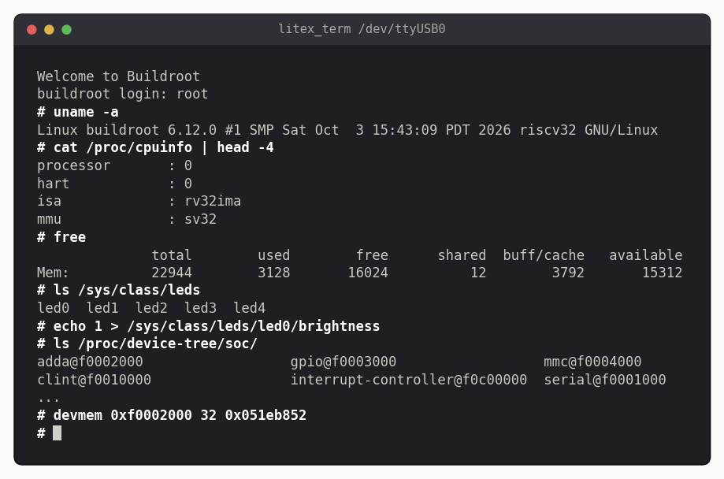

<!-- nav -->
[← 3.00 Linux on the FPGA](3_00_linux_on_the_fpga.md#300-linux-on-the-fpga) &emsp;&emsp;&emsp; **[Contents](../README.md#contents)** &emsp;&emsp;&emsp; [3.02 A driver →](3_02_a_driver.md#302-a-driver)

# 3.01 Booting Linux



## Boot it

From the top of this repository, as one command:

```bash
openFPGALoader -b icepi-zero src/linux/prebuilt/icepi_zero_adda.bit && \
litex_term --speed=460800 --images=src/linux/prebuilt/images/boot.json /dev/ttyUSB0
```

Type it as one command, as here, so that `litex_term` is already listening
when the SoC starts. About a second after the bitstream loads, the [BIOS](https://en.wikipedia.org/wiki/BIOS) offers
to boot from the serial port, and it waits only a quarter of a second for an
answer. `litex_term --images` answers by itself and starts sending the files.
Start it any later and the offer has gone; the BIOS moves on to the micro-SD
card. (With no card in the slot it can be stuck there for a quarter of an
hour: [Appendix B](B_troubleshooting.md). Just run the command again.)

The files go over the serial port at about 44 kB/s: **4 minutes**. Then
OpenSBI starts the kernel, which takes 19 s to boot (half of that is unpacking
the root file system into RAM). Its start-up scripts take another 45 s, and
you get

```
Welcome to Buildroot
buildroot login:
```

Log in as `root`, no password. Look around:

```console
# uname -a
Linux buildroot 6.12.0 #1 SMP Sat Oct  3 15:43:09 PDT 2026 riscv32 GNU/Linux
# cat /proc/cpuinfo | head -4
processor	: 0
hart		: 0
isa		: rv32ima
mmu		: sv32
# free
              total        used        free      shared  buff/cache   available
Mem:          22944        3128       16024          12        3792       15312
```

That's a 32-bit RISC-V CPU (`rv32ima`: integer, multiply, atomics) with an MMU
(`sv32`), and 22 MB of RAM for Linux. Everything you change is lost at the
next boot, because the root file system lives in RAM.
([3.04](3_04_booting_from_sd.md#304-booting-from-an-sd-card) fixes that, and the 5-minute boot.)

## The LEDs are files

Watch the LEDs while Linux starts. They chase, as in [2.01](2_01_a_cpu_and_its_bios.md#201-a-cpu-and-its-bios), until the kernel's
LED driver takes them over, and then the leftmost one beats like a heart:
that's Linux saying it's alive. Linux keeps every LED it knows about in
`/sys/class/leds`, as a folder of files:

```console
# ls /sys/class/leds
led0  led1  led2  led3  led4
# echo 1 > /sys/class/leds/led0/brightness
# echo 1 > /sys/class/leds/led2/brightness
# echo 0 > /sys/class/leds/led0/brightness
```

`led0` is the rightmost LED and `led4` the leftmost, the one with the
heartbeat, as in Chapter 1. `echo 1 > .../brightness` didn't write to a file
on any disk. `/sys` is a window into the kernel: writing to that "file" runs a
function in the kernel's LED driver, which sets a bit in the LED register of
[2.01](2_01_a_cpu_and_its_bios.md#201-a-cpu-and-its-bios). The kernel learned that the register exists, where it is, and that its
bits are LEDs from the *[device tree](https://en.wikipedia.org/wiki/Devicetree)*, which it shows as folders too:

```console
# ls /proc/device-tree/soc/
adda@f0002000                  gpio@f0003000                  mmc@f0004000
clint@f0010000                 interrupt-controller@f0c00000  serial@f0001000
...
```

## Poke the DAC

`gpio@f0003000` is the LEDs, and `adda@f0002000` is the function generator,
capture unit and lock-in of Chapter 2. There's no driver for those yet, but
`/dev/mem` is the computer's physical memory, all of it, as a file, and
[BusyBox](https://en.wikipedia.org/wiki/BusyBox)'s `devmem` reads or writes one word of it: the `mem_read` and
`mem_write` of [2.01](2_01_a_cpu_and_its_bios.md#201-a-cpu-and-its-bios), from Linux. The function generator's tuning word is its
first register:

```console
# devmem 0xf0002000 32
0x00000000
# devmem 0xf0002000 32 0x051eb852
```

The DAC now plays 1 MHz (the scope measured 999,996.9 Hz and 3.81 V), exactly
as with the BIOS's `mem_write`. 0xf0002000 is in the CSR region of the map at
the top of [3.00](3_00_linux_on_the_fpga.md#300-linux-on-the-fpga), where LiteX put this SoC's registers.

The board also has [MicroPython](https://micropython.org), a small Python 3 written for
microcontrollers, and its `machine.mem32` is `devmem` with Python around it:

```console
# micropython
MicroPython v1.22.2 on 2026-10-04; linux [GCC 13.4.0] version
Use Ctrl-D to exit, Ctrl-E for paste mode
>>> import machine
>>> FUNCGEN = 0xf0002000                       # the tuning word: see 3.00's map
>>> hex(machine.mem32[FUNCGEN])
'0x0'
>>> machine.mem32[FUNCGEN] = round(2e6 * 2**32 / 50e6)     # 2 MHz
>>> hex(machine.mem32[FUNCGEN])
'0xa3d70a4'
```

The DAC now plays 2 MHz ([3.02](3_02_a_driver.md#302-a-driver)'s driver reads the same register back as
2000000.001 Hz), and Ctrl-D leaves MicroPython.

`micropython` starts in about half a second from the RAM disk (from [3.04](3_04_booting_from_sd.md#304-booting-from-an-sd-card)'s
SD card, 4.4 s the first time, while it's read from the card, then about a
second), and adds 0.36 MB to the root file system: 8 seconds more of serial
boot. One thing to know: `mem32` reads
come back *signed*, so a register holding 0xf0000000 reads as −268435456;
`& 0xffffffff` gives the unsigned value.

`devmem` and `mem32` work, and they're a fine way to test hardware. But
they're a bad way to build an instrument on:

- you need to be root, and one wrong address can hang the machine;
- the addresses are written into every script, so a rebuild that moves a
  peripheral silently breaks them all;
- there's no locking: two programs doing captures at once corrupt each other;
- the arithmetic (tuning words, 64-bit sums, unpacking the buffer) is repeated
  in every program.

Those are the four problems a driver solves. [3.02](3_02_a_driver.md#302-a-driver) loads one,
and the ADC and DAC become files like the LEDs.

**Try this:**

- Here is [1.01](1_01_led_counter.md#101-a-counter-on-the-leds)'s counter as a shell script for the
  board (paste it at the `#` prompt), on the four LEDs without the heartbeat:
  ```sh
  for n in $(seq 0 15); do
    for b in 0 1 2 3; do
      echo $(( (n >> b) & 1 )) > /sys/class/leds/led$b/brightness
    done
  done
  ```
  It takes 2.1 seconds. The flip-flops of [1.01](1_01_led_counter.md#101-a-counter-on-the-leds) count that far in 320 ns,
  seven million times faster. But this one needed no synthesis, and you could
  change it while it runs.
- `cat /sys/class/leds/led4/trigger` lists what can drive an LED; the one in
  brackets is in charge. Try `echo timer > /sys/class/leds/led1/trigger`, then
  change its `delay_on` and `delay_off` (milliseconds). Or `mmc0`, which
  flashes the LED whenever the SD card is read.
- Keep the CPU busy (`while true; do :; done &`) and watch the heartbeat for a
  minute or two: it follows the system's *load average*, and speeds up.
  (`kill %1` stops the loop.)
- Set the function generator's amplitude (the next register, 0xf0002004) and
  waveform (0xf0002008: 0 sine, 1 square, 2 triangle, 3 sawtooth) with
  `devmem`.

<!-- nav -->
[← 3.00 Linux on the FPGA](3_00_linux_on_the_fpga.md#300-linux-on-the-fpga) &emsp;&emsp;&emsp; **[Contents](../README.md#contents)** &emsp;&emsp;&emsp; [3.02 A driver →](3_02_a_driver.md#302-a-driver)

<!-- author -->
<sub>Jason Gallicchio, jason@hmc.edu, Harvey Mudd College</sub>
