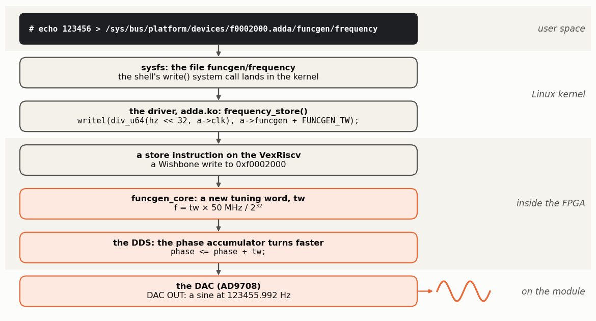

<!-- nav -->
[← 3.01 Booting Linux](3_01_booting_linux.md#301-booting-linux) &emsp;&emsp;&emsp; **[Contents](../README.md#contents)** &emsp;&emsp;&emsp; [3.03 Building Linux yourself →](3_03_building_linux.md#303-building-linux-yourself)

# 3.02 A driver



A **driver** is code in the kernel that owns a device and presents it to
programs through a standard interface. Ours presents each instrument setting
as a file in **[sysfs](https://en.wikipedia.org/wiki/Sysfs)**, the folder tree under `/sys` where the kernel shows
its devices (the LEDs of [3.01](3_01_booting_linux.md#301-booting-linux) live there too).

## The code

The driver is one C file, [`src/linux/driver/adda.c`](../src/linux/driver/adda.c).
You don't need to read all of it to use it, but it's worth seeing how little
there is:

<details>
<summary>The whole file: <code>adda.c</code> (about 360 lines)</summary>

<!-- file: src/linux/driver/adda.c -->
```c
// SPDX-License-Identifier: GPL-2.0
/*
 * adda.c -- a Linux driver for the Icepi Zero ADC/DAC peripherals (Chapter 3).
 *
 * The kernel finds the hardware through the device tree node that
 * make_linux.py adds (compatible = "hmc,icepi-adda"), and this driver gives
 * each peripheral a directory of ordinary files:
 *
 *   /sys/bus/platform/devices/<address>.adda/
 *       funcgen/frequency    Hz.  Write "1000000"; read back the exact value.
 *       funcgen/amplitude    0..255
 *       funcgen/waveform     sine, square, triangle or sawtooth
 *       capture/decimation   keep 1 sample in 2^decimation (0..15)
 *       capture/trigger      "off", or a level 0..255 to wait for
 *       capture/sample_rate  samples per second (read only)
 *       capture/data         reading it takes a capture: 16384 bytes
 *       lockin/n_log2        average 2^n_log2 samples (8..24)
 *       lockin/result        reading it measures at funcgen/frequency:
 *                            "<x> <y>", the averages of (adc-128)*cos and
 *                            (adc-128)*(-sin), in ADC codes squared
 */
#include <linux/io.h>
#include <linux/iopoll.h>
#include <linux/math64.h>
#include <linux/module.h>
#include <linux/mutex.h>
#include <linux/of.h>
#include <linux/platform_device.h>
#include <linux/sysfs.h>
#include <linux/unaligned.h>

/* Register offsets within each peripheral: build/<board>/csr.csv */
#define FUNCGEN_TW		0x00
#define FUNCGEN_AMPLITUDE	0x04
#define FUNCGEN_WAVEFORM	0x08
#define CAPTURE_CONTROL		0x00
#define CAPTURE_CONFIG		0x04
#define CAPTURE_STATUS		0x08
#define LOCKIN_CONTROL		0x00
#define LOCKIN_N_LOG2		0x04
#define LOCKIN_STATUS		0x08
#define LOCKIN_X		0x0c	/* 64 bits, as two 32-bit words, high word first */
#define LOCKIN_Y		0x14
#define STATUS_DONE		BIT(1)

#define N_SAMPLES		16384

struct adda {
	void __iomem *funcgen, *capture, *lockin, *buffer;
	u32 clk;			/* the SoC's clock, Hz */
	int decimation;
	int trigger;			/* -1 = off */
	struct mutex lock;		/* one capture or measurement at a time */
	u8 samples[N_SAMPLES];		/* the most recent capture */
};

/* ---- function generator -------------------------------------------------- */

static ssize_t frequency_show(struct device *dev, struct device_attribute *attr, char *buf)
{
	struct adda *a = dev_get_drvdata(dev);
	u64 f = (u64)readl(a->funcgen + FUNCGEN_TW) * a->clk;	/* Hz * 2^32 */
	u64 mhz = ((f & 0xffffffff) * 1000) >> 32;		/* the fraction, in mHz */

	return sysfs_emit(buf, "%llu.%03llu\n", f >> 32, mhz);
}

static ssize_t frequency_store(struct device *dev, struct device_attribute *attr,
			       const char *buf, size_t count)
{
	struct adda *a = dev_get_drvdata(dev);
	u64 hz;
	int ret = kstrtou64(buf, 0, &hz);

	if (ret)
		return ret;
	if (hz >= a->clk / 2)
		return -EINVAL;
	writel(div_u64(hz << 32, a->clk), a->funcgen + FUNCGEN_TW);	/* f = tw * clk / 2^32 */
	return count;
}
static DEVICE_ATTR_RW(frequency);

static ssize_t amplitude_show(struct device *dev, struct device_attribute *attr, char *buf)
{
	struct adda *a = dev_get_drvdata(dev);

	return sysfs_emit(buf, "%u\n", readl(a->funcgen + FUNCGEN_AMPLITUDE));
}

static ssize_t amplitude_store(struct device *dev, struct device_attribute *attr,
			       const char *buf, size_t count)
{
	struct adda *a = dev_get_drvdata(dev);
	u8 v;
	int ret = kstrtou8(buf, 0, &v);

	if (ret)
		return ret;
	writel(v, a->funcgen + FUNCGEN_AMPLITUDE);
	return count;
}
static DEVICE_ATTR_RW(amplitude);

static const char * const waveforms[] = { "sine", "square", "triangle", "sawtooth" };

static ssize_t waveform_show(struct device *dev, struct device_attribute *attr, char *buf)
{
	struct adda *a = dev_get_drvdata(dev);

	return sysfs_emit(buf, "%s\n", waveforms[readl(a->funcgen + FUNCGEN_WAVEFORM) & 3]);
}

static ssize_t waveform_store(struct device *dev, struct device_attribute *attr,
			      const char *buf, size_t count)
{
	struct adda *a = dev_get_drvdata(dev);
	int i = sysfs_match_string(waveforms, buf);

	if (i < 0)
		return i;
	writel(i, a->funcgen + FUNCGEN_WAVEFORM);
	return count;
}
static DEVICE_ATTR_RW(waveform);

static struct attribute *funcgen_attrs[] = {
	&dev_attr_frequency.attr, &dev_attr_amplitude.attr, &dev_attr_waveform.attr, NULL,
};
static const struct attribute_group funcgen_group = {
	.name = "funcgen", .attrs = funcgen_attrs,
};

/* ---- ADC capture ------------------------------------------------------------ */

static ssize_t decimation_show(struct device *dev, struct device_attribute *attr, char *buf)
{
	struct adda *a = dev_get_drvdata(dev);

	return sysfs_emit(buf, "%d\n", a->decimation);
}

static ssize_t decimation_store(struct device *dev, struct device_attribute *attr,
				const char *buf, size_t count)
{
	struct adda *a = dev_get_drvdata(dev);
	int v;
	int ret = kstrtoint(buf, 0, &v);

	if (ret)
		return ret;
	if (v < 0 || v > 15)
		return -EINVAL;
	a->decimation = v;
	return count;
}
static DEVICE_ATTR_RW(decimation);

static ssize_t trigger_show(struct device *dev, struct device_attribute *attr, char *buf)
{
	struct adda *a = dev_get_drvdata(dev);

	if (a->trigger < 0)
		return sysfs_emit(buf, "off\n");
	return sysfs_emit(buf, "%d\n", a->trigger);
}

static ssize_t trigger_store(struct device *dev, struct device_attribute *attr,
			     const char *buf, size_t count)
{
	struct adda *a = dev_get_drvdata(dev);
	int v;

	if (sysfs_streq(buf, "off")) {
		a->trigger = -1;
		return count;
	}
	if (kstrtoint(buf, 0, &v) || v < 0 || v > 255)
		return -EINVAL;
	a->trigger = v;
	return count;
}
static DEVICE_ATTR_RW(trigger);

static ssize_t sample_rate_show(struct device *dev, struct device_attribute *attr, char *buf)
{
	struct adda *a = dev_get_drvdata(dev);

	return sysfs_emit(buf, "%u\n", (a->clk / 2) >> a->decimation);
}
static DEVICE_ATTR_RO(sample_rate);

/* Record 16384 samples into a->samples.  Called with a->lock held. */
static int adda_capture(struct adda *a)
{
	u32 config = a->decimation, status;
	int i, ret;

	if (a->trigger >= 0)
		config |= BIT(8) | (a->trigger << 16);	/* trig_enable, trig_level */
	writel(config, a->capture + CAPTURE_CONFIG);
	writel(1, a->capture + CAPTURE_CONTROL);	/* start */

	/* up to 21 s at decimation 15; the calling process sleeps meanwhile */
	ret = readl_poll_timeout(a->capture + CAPTURE_STATUS, status,
				 status & STATUS_DONE, 1000, 30 * USEC_PER_SEC);
	if (ret)
		return ret;

	/* the buffer holds four samples per 32-bit word, first in the low byte */
	for (i = 0; i < N_SAMPLES / 4; i++)
		put_unaligned_le32(readl(a->buffer + 4 * i), &a->samples[4 * i]);
	return 0;
}

static ssize_t data_read(struct file *file, struct kobject *kobj, struct bin_attribute *attr,
			 char *buf, loff_t off, size_t count)
{
	struct adda *a = dev_get_drvdata(kobj_to_dev(kobj));	/* the device, even in a group */
	int ret = 0;

	/* "cat data" reads in several pieces: capture only for the first one */
	mutex_lock(&a->lock);
	if (off == 0)
		ret = adda_capture(a);
	if (!ret)
		memcpy(buf, a->samples + off, count);
	mutex_unlock(&a->lock);
	return ret ? ret : count;
}
static BIN_ATTR_RO(data, N_SAMPLES);

static struct attribute *capture_attrs[] = {
	&dev_attr_decimation.attr, &dev_attr_trigger.attr, &dev_attr_sample_rate.attr, NULL,
};
static struct bin_attribute *capture_bin_attrs[] = { &bin_attr_data, NULL };
static const struct attribute_group capture_group = {
	.name = "capture", .attrs = capture_attrs, .bin_attrs = capture_bin_attrs,
};

/* ---- lock-in ----------------------------------------------------------------- */

static ssize_t n_log2_show(struct device *dev, struct device_attribute *attr, char *buf)
{
	struct adda *a = dev_get_drvdata(dev);

	return sysfs_emit(buf, "%u\n", readl(a->lockin + LOCKIN_N_LOG2));
}

static ssize_t n_log2_store(struct device *dev, struct device_attribute *attr,
			    const char *buf, size_t count)
{
	struct adda *a = dev_get_drvdata(dev);
	int v;

	if (kstrtoint(buf, 0, &v) || v < 8 || v > 24)
		return -EINVAL;
	writel(v, a->lockin + LOCKIN_N_LOG2);
	return count;
}
static DEVICE_ATTR_RW(n_log2);

static s64 read_s64(void __iomem *reg)
{
	return (s64)(((u64)readl(reg) << 32) | readl(reg + 4));
}

/* print sum / 2^n with three decimals, without floating point */
static int emit_mean(char *buf, int at, s64 sum, int n)
{
	s64 milli = (sum * 1000) >> n;			/* rounds toward -infinity */
	u64 mag = milli < 0 ? -milli : milli;
	u32 frac;
	u64 whole = div_u64_rem(mag, 1000, &frac);	/* a 32-bit CPU: no plain 64-bit "/" */

	return sysfs_emit_at(buf, at, "%s%llu.%03u", milli < 0 ? "-" : "", whole, frac);
}

static ssize_t result_show(struct device *dev, struct device_attribute *attr, char *buf)
{
	struct adda *a = dev_get_drvdata(dev);
	int n = readl(a->lockin + LOCKIN_N_LOG2);
	u32 status;
	s64 x, y;
	int ret, len;

	mutex_lock(&a->lock);
	writel(1, a->lockin + LOCKIN_CONTROL);		/* start */
	ret = readl_poll_timeout(a->lockin + LOCKIN_STATUS, status,
				 status & STATUS_DONE, 1000, 2 * USEC_PER_SEC);
	x = read_s64(a->lockin + LOCKIN_X);
	y = read_s64(a->lockin + LOCKIN_Y);
	mutex_unlock(&a->lock);
	if (ret)
		return ret;

	len = emit_mean(buf, 0, x, n);
	len += sysfs_emit_at(buf, len, " ");
	len += emit_mean(buf, len, y, n);
	len += sysfs_emit_at(buf, len, "\n");
	return len;
}
static DEVICE_ATTR_RO(result);

static struct attribute *lockin_attrs[] = {
	&dev_attr_n_log2.attr, &dev_attr_result.attr, NULL,
};
static const struct attribute_group lockin_group = {
	.name = "lockin", .attrs = lockin_attrs,
};

/* ---- finding the hardware ------------------------------------------------------ */

static const struct attribute_group *adda_groups[] = {
	&funcgen_group, &capture_group, &lockin_group, NULL,
};

static int adda_probe(struct platform_device *pdev)
{
	struct adda *a = devm_kzalloc(&pdev->dev, sizeof(*a), GFP_KERNEL);

	if (!a)
		return -ENOMEM;
	/* each reg = <address size> in the device tree, by its reg-names entry */
	a->funcgen = devm_platform_ioremap_resource_byname(pdev, "funcgen");
	a->capture = devm_platform_ioremap_resource_byname(pdev, "capture");
	a->lockin  = devm_platform_ioremap_resource_byname(pdev, "lockin");
	a->buffer  = devm_platform_ioremap_resource_byname(pdev, "buffer");
	if (IS_ERR(a->funcgen) || IS_ERR(a->capture) || IS_ERR(a->lockin) || IS_ERR(a->buffer))
		return -ENODEV;
	if (of_property_read_u32(pdev->dev.of_node, "clock-frequency", &a->clk))
		a->clk = 50000000;
	a->trigger = -1;
	mutex_init(&a->lock);
	platform_set_drvdata(pdev, a);
	dev_info(&pdev->dev, "ADC/DAC peripherals ready, clock %u Hz\n", a->clk);
	return 0;
}

static const struct of_device_id adda_of_match[] = {
	{ .compatible = "hmc,icepi-adda" },
	{ }
};
MODULE_DEVICE_TABLE(of, adda_of_match);

static struct platform_driver adda_driver = {
	.probe = adda_probe,
	.driver = {
		.name		= "adda",
		.of_match_table	= adda_of_match,
		.dev_groups	= adda_groups,	/* the sysfs files above */
	},
};
module_platform_driver(adda_driver);

MODULE_DESCRIPTION("Icepi Zero AD9280/AD9708 function generator, capture and lock-in");
MODULE_LICENSE("GPL");
```

</details>

How the pieces connect:

1. `adda_of_match` lists the `compatible` string the driver handles,
   `"hmc,icepi-adda"`.
2. At boot, the kernel created a *platform device* for the device-tree node
   with that string, which `make_linux.py` wrote:

   ```dts
   adda: adda@f0002000 {
       compatible = "hmc,icepi-adda";
       reg = <0xf0002000 0x100>, <0xf0000000 0x100>,
             <0xf0003800 0x100>, <0x80000000 0x4000>;
       reg-names = "funcgen", "capture", "lockin", "buffer";
       clock-frequency = <50000000>;
       status = "okay";
   };
   ```

   When the driver is loaded, the strings match, and the kernel calls
   `adda_probe()`.
3. `devm_platform_ioremap_resource_byname(pdev, "funcgen")` looks up the
   `reg` entry named `funcgen` and maps it into the kernel's virtual
   addresses. (With an MMU, even the kernel can't use physical addresses
   directly.) `readl()` and `writel()` then read and write the registers.
   Nothing in the driver knows an address: they all come from the [device tree](https://en.wikipedia.org/wiki/Devicetree).
4. `.dev_groups` creates the files. `DEVICE_ATTR_RW(frequency)` declares a
   file named `frequency`, whose `frequency_show()` runs when someone reads it
   and `frequency_store()` when someone writes it. Grouping them with
   `.name = "funcgen"` puts them in a subfolder.
5. `capture/data` is a *binary* file, so reading it can return 16384 raw
   bytes, and reading it from the start runs a capture. While it waits,
   `readl_poll_timeout()` *sleeps*, so the CPU is free for other programs even
   during a 21-second capture. `mutex_lock()` makes a second reader wait its
   turn.
6. The kernel does no floating point, so `lockin/result` prints the averages
   as fixed-point decimals, and leaves the square root and arctangent to
   programs (`sweep.sh` below).

## Load it and use it

The prebuilt root file system has the driver in `/root`. Load it, and the
kernel matches it to the device:

```console
# insmod /root/adda.ko
[  151.139637] adda: loading out-of-tree module taints kernel.
[  151.231889] adda f0002000.adda: ADC/DAC peripherals ready, clock 50000000 Hz
# cd /sys/bus/platform/devices/f0002000.adda
# ls funcgen capture lockin
capture:
data         decimation   sample_rate  trigger

funcgen:
amplitude  frequency  waveform

lockin:
n_log2  result
```

(*Tainted* just means the kernel has loaded code that isn't part of its own
source tree.) Every instrument setting is now a file:

```console
# echo 123456 > funcgen/frequency
# cat funcgen/frequency
123455.992
# echo triangle > funcgen/waveform; echo 128 > funcgen/amplitude
```

The frequency reads back as the value the DDS really makes: the multiple of
50 MHz / 2<sup>32</sup> just below what you asked for: the driver rounds the
tuning word down. On the scope, a triangle from −2.02 to +1.99 V.

A capture, triggered on the way up through mid-scale, at 6.25 MS/s:

```console
# echo 2 > capture/decimation; echo 128 > capture/trigger
# cat capture/sample_rate
6250000
# time cat capture/data > /tmp/samples.bin
real	0m 0.59s
# od -An -tu1 -N48 /tmp/samples.bin
 138 148 158 167 175 183 189 194 198 201 202 201 200 197 192 187
 180 172 163 154 144 134 124 113 103  94  84  76  69  63  58  54
  52  51  52  54  57  62  68  75  82  91 101 111 121 131 142 152
```

And the lock-in, with a 2 V signal at the function generator's frequency on
the ADC input:

```console
# echo 100000 > funcgen/frequency
# cat lockin/n_log2
20
# cat lockin/result
-133.539 -3193.317
# cat lockin/result
-55.729 -3195.380
```

√(X<sup>2</sup> + Y<sup>2</sup>) = 3196, and 2 × 3196 / 127 / 25.35 = 1.985 V. (The input came from
a separate generator, so its phase drifts slowly against ours.) Two shell
scripts in `/root` do that arithmetic with `awk`, and `sweep.py` does it in
MicroPython ([3.01](3_01_booting_linux.md#301-booting-linux)):

<details>
<summary><code>sweep.sh</code>, <code>sweep.py</code> and <code>dump.sh</code></summary>

<!-- file: src/linux/rootfs_overlay/root/sweep.sh -->
```sh
#!/bin/sh
# sweep.sh START_HZ STOP_HZ POINTS -- a lock-in frequency sweep from the shell.
#   ./sweep.sh 10000 10000000 31 > thru.txt
# Prints: frequency (Hz), amplitude at the ADC (V), phase (degrees).
A=$(echo /sys/bus/platform/devices/*.adda)
awk -v a="$1" -v b="$2" -v n="$3" 'BEGIN {
        for (i = 0; i < n; i++) printf "%d\n", a * exp(log(b / a) * i / (n - 1)) }' |
while read f; do
    echo "$f" > "$A/funcgen/frequency"
    read x y < "$A/lockin/result"
    echo "$f $x $y" | awk '{ printf "%10d %8.4f %8.2f\n", $1,
        2 * sqrt($2 * $2 + $3 * $3) / 127 / 25.35, atan2($3, $2) * 57.29578 }'
done
```

<!-- file: src/linux/rootfs_overlay/root/sweep.py -->
```python
# sweep.py START_HZ STOP_HZ POINTS -- sweep.sh, in MicroPython.
#   micropython sweep.py 10000 10000000 31 > thru.txt
# Prints: frequency (Hz), amplitude at the ADC (V), phase (degrees).
import math
import os
import sys

D = "/sys/bus/platform/devices/"
A = D + [d for d in os.listdir(D) if d.endswith(".adda")][0]   # f0002000.adda


def put(name, value):
    with open(A + "/" + name, "w") as f:
        f.write(str(value))


def get(name):
    with open(A + "/" + name) as f:
        return f.read().split()


a, b, n = int(sys.argv[1]), int(sys.argv[2]), int(sys.argv[3])
for i in range(n):
    f = round(a * math.exp(math.log(b / a) * i / (n - 1)))
    put("funcgen/frequency", f)
    x, y = [float(v) for v in get("lockin/result")]
    volts = 2 * math.sqrt(x * x + y * y) / 127 / 25.35        # as in 1.08
    print("%10d %8.4f %8.2f" % (f, volts, math.degrees(math.atan2(y, x))))
```

<!-- file: src/linux/rootfs_overlay/root/dump.sh -->
```sh
#!/bin/sh
# dump.sh -- take one capture and print it as hex, 64 samples per line: the
# same format as the bare-metal firmware's "dump" (2.04), so the same laptop-side
# parser reads either.
A=$(echo /sys/bus/platform/devices/*.adda)
hexdump -v -e '64/1 "%02x" "\n"' "$A/capture/data"
```

</details>

```console
# cd /root && ./sweep.sh 90000 110000 5
     90000   0.0010   -11.00
     94630   0.0017  -178.56
     99498   0.0061    79.68
    104617   0.0036    53.46
    110000   0.0010  -167.96
# ./dump.sh | head -1
898e93979c9fa3a6a9abaeafb0b0b1b0afadaca9a6a39f9b97928e89847f7a75...
```

With the DAC cabled to the ADC through a filter, `./sweep.sh 10000 10000000 31`
is [1.08](1_08_lockin.md#108-a-lock-in-amplifier)'s Bode measurement, driven from a shell script, on a Linux computer
that you built inside an FPGA. The Python version reads the same files and
does the same arithmetic. Through the 101.5 cm cable alone:

```console
# micropython sweep.py 10000 10000000 7
     10000   3.9071    -1.10
     31623   3.9065    -3.46
    100000   3.9049   -10.91
    316228   3.8971   -34.43
   1000000   3.8538  -108.44
   3162278   3.6914    21.14
  10000000   4.1964     3.54
```

`./sweep.sh 10000 10000000 7` printed the same to the fourth digit up to
3 MHz, at frequencies one hertz lower (`awk`'s `%d` truncates, Python's
`round()` rounds). At 10 MHz it read 4.1795 V: this cable's 10 MHz reading
wanders by about 1% from run to run, whichever program takes it ([2.06](2_06_registers_from_the_laptop.md#206-the-registers-from-the-laptop)'s
`remote.py` read 4.100 to 4.140 V).

This is also the point where the whole stack is visible at once. A shell
command becomes a `write()` system call, which reaches `frequency_store()`,
whose `writel()` becomes a store instruction on the VexRiscv, then a Wishbone
write to 0xf0002000. That changes `funcgen_core`'s tuning word, and the phase
accumulator of [1.03](1_03_dac_sine.md#103-a-sine-direct-digital-synthesis) starts turning faster.

**Try this:**

- Add a `funcgen/phase` file that reads the lock-in's phase in degrees,
  using integer arithmetic only (a CORDIC, or a lookup table and
  interpolation). You'll need to build the driver: [3.03](3_03_building_linux.md#303-building-linux-yourself).
- The Linux way for a data-acquisition device is the **IIO** (Industrial I/O)
  subsystem: standard file names, buffered capture through
  `/dev/iio:device0`, and laptop-side tools like `libiio` and ADI's Scopy, the
  ADALM2000's own software. Rewrite the capture half of the driver as an IIO
  driver. (The kernel built here doesn't have IIO switched on: add
  `CONFIG_IIO=y` to `src/linux/kernel_modules.config`.)

<!-- nav -->
[← 3.01 Booting Linux](3_01_booting_linux.md#301-booting-linux) &emsp;&emsp;&emsp; **[Contents](../README.md#contents)** &emsp;&emsp;&emsp; [3.03 Building Linux yourself →](3_03_building_linux.md#303-building-linux-yourself)

<!-- author -->
<sub>Jason Gallicchio, jason@hmc.edu, Harvey Mudd College</sub>
