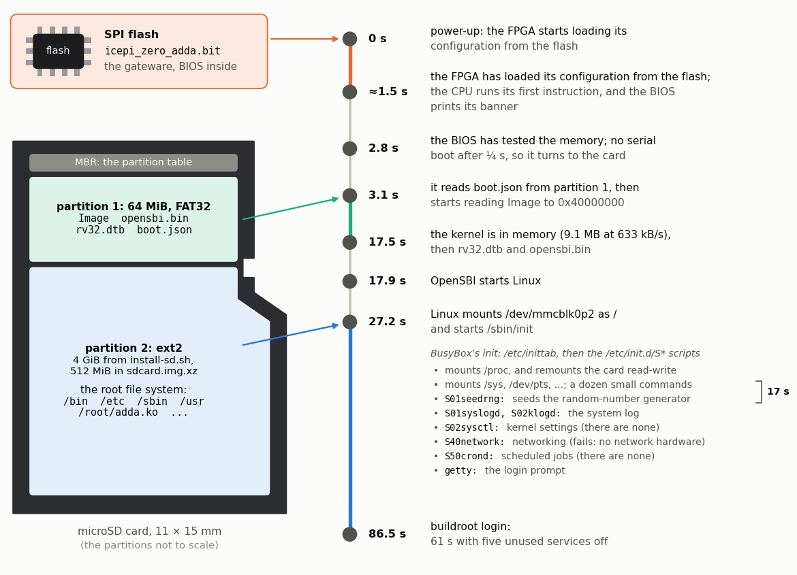

<!-- nav -->
[← 3.03 Building Linux yourself](3_03_building_linux.md#303-building-linux-yourself) &emsp;&emsp;&emsp; **[Contents](../README.md#contents)** &emsp;&emsp;&emsp; [4.00 One-board experiments →](4_00_one_board_experiments.md#400-one-board-experiments)

# 3.04 Booting from an SD card



A five-minute boot is fine while you're developing, but not for an
instrument. The board has what it takes to boot by itself. The SPI
flash chip beside the FPGA keeps a bitstream through power cycles
(`openFPGALoader -f`), and the micro-SD slot is wired to the FPGA. The SoC
includes LiteX's SD-card controller, and its [BIOS](https://en.wikipedia.org/wiki/BIOS) tries each way of booting in
turn: serial boot first, for a quarter of a second, so that `litex_term` can
always take over, and then the SD card. From the card, the BIOS reads
`boot.json` from the first partition, a FAT file system, and loads the files
it names, just as serial boot did.

| where | what |
| --- | --- |
| SPI flash | the gateware, `icepi_zero_adda.bit` |
| SD card, partition 1, 64 MiB, FAT32 | `Image`, `opensbi.bin`, `rv32.dtb`, `boot.json` |
| SD card, partition 2, ext2 | the root file system |

The [device tree](https://en.wikipedia.org/wiki/Devicetree) for this boot differs from [3.01](3_01_booting_linux.md#301-booting-linux)'s in one line: the kernel's
root file system is `root=/dev/mmcblk0p2`, the card's second partition,
instead of a RAM disk.

<details>
<summary><b>Detail:</b> why the bitstream isn't on the card too, as on a Zynq</summary>

On a Xilinx Zynq (the chip in the PYNQ boards and the Red Pitaya), the CPUs
are hard silicon beside the FPGA fabric. They boot first, from the SD card,
and then load a bitstream from the card into the fabric; PYNQ's *overlays*
swap one bitstream for another from a running Python program, while Linux
keeps running on the hard CPUs.

Here the CPU is *made of* the fabric. Until a bitstream is loaded there is no
CPU to read the card, so the ECP5 has to configure itself, from the SPI flash
(at power-up) or over JTAG (`openFPGALoader`). And loading a new bitstream
erases the whole fabric, CPU and Linux included. The ECP5 can't swap one part
of itself while the rest keeps running (partial reconfiguration), and the
open-source tools couldn't build such a part if it could. The nearest thing
would be for Linux to write a new bitstream into the SPI flash and then
reload the FPGA from it: LiteX has an SPI-flash controller that would let it
(this SoC leaves it out; `openFPGALoader -f` from the laptop does the job).
That is a whole new system after a reboot, not an overlay.

</details>

## Make the card

There are two ways. Both erase the card. Use a card of 8 GB or more: the
installer makes a 4 GiB root partition.

**With a card reader** (any laptop): write
[`src/linux/prebuilt/sdcard.img.xz`](../src/linux/prebuilt/) to the card with
[Raspberry Pi Imager](https://www.raspberrypi.com/software/) (*Choose OS → Use
custom*) or [balenaEtcher](https://etcher.balena.io/). Both read the `.xz`
file directly. On Linux you can also
`xzcat sdcard.img.xz | sudo dd of=/dev/sdX bs=4M conv=fsync`, with your card
reader's device in place of `sdX` (check with `lsblk` first: `dd` will happily
erase the wrong disk). To make your own image from your own build, see
[`make_sd_image.py`](../src/linux/make_sd_image.py).

**Without a card reader**: let the board write its own card. Its Linux has a
driver for the SD controller, and the card appears as `/dev/mmcblk0`. The
hard part is getting 9 MB of files *to* the board, since its only link is
the serial port. Serial boot is reliable (`litex_term` sends each file in
checksummed frames and resends any that arrive damaged), so the card's files
ride along with a serial boot: the kernel accepts an [initramfs](https://en.wikipedia.org/wiki/Initial_ramdisk) made of several
archives back to back, and
[`make_sd_installer.sh`](../src/linux/make_sd_installer.sh) adds a second,
small archive to the end of `rootfs.cpio.gz` that holds the card's files under
`/boot/sd/`, and a script that installs them. The prebuilt version is in
`src/linux/prebuilt/install/` (it borrows `Image` and `opensbi.bin` from
`images/` next to it, so keep the folder as it is). Put a card in the board,
and:

```bash
openFPGALoader -b icepi-zero src/linux/prebuilt/icepi_zero_adda.bit && \
litex_term --speed=460800 --images=src/linux/prebuilt/install/boot.json /dev/ttyUSB0
```

The upload is 15 MB this time, 5½ minutes. Log in, and:

```console
# time /root/install-sd.sh
1/5 partition table
2/5 file systems
32768 inodes, 1048576 blocks
3/5 boot files
...
4/5 root file system
5/5 sync
Done.  Flash the bitstream (openFPGALoader -f), reset, and it boots from the card.
real	6m 2.47s
```

Most of the 6 minutes is unpacking the kernel and writing it to the card. This
CPU is slow at everything, as you'll see in a moment.

<details>
<summary>How the installer works: <code>make_sd_installer.sh</code>, <code>make_mbr.py</code>, <code>install-sd.sh</code></summary>

<!-- file: src/linux/make_sd_installer.sh -->
```sh
#!/bin/sh
# make_sd_installer.sh -- build the two sets of boot images for the SD card of 3.04.
#
# Run from $ADDA/tools/linux-on-litex-vexriscv after the Buildroot build, with
# the gateware already built by make_linux.py --build:
#
#     sh $ADDA/src/linux/make_sd_installer.sh
#
#   images_sd/       what goes on the card's FAT partition: Image, opensbi.bin,
#                    and a device tree whose root file system is /dev/mmcblk0p2
#   images_install/  a one-time serial boot: the usual kernel and root file
#                    system, plus an "installer payload" -- images_sd's files,
#                    an MBR and install-sd.sh -- appended to the initramfs, so
#                    they appear under /boot/sd on the running system
set -e
HERE=$(cd "$(dirname "$0")" && pwd)
BR=${BR:-$HERE/../../tools/buildroot-icepi/images}
MAKE_LINUX="python3 $HERE/make_linux.py --board=icepi_zero_adda --uart-baudrate=460800"

# ---- images_sd: the files the BIOS will load from the card -------------------
mkdir -p images_sd
cp $BR/Image images_sd/
cp $BR/fw_jump.bin images_sd/opensbi.bin
$MAKE_LINUX --rootfs=mmcblk0p2 --images-dir=images_sd > /dev/null

# ---- the payload: an uncompressed cpio archive with /boot/sd/* ----------------
P=$(mktemp -d)
mkdir -p $P/boot/sd $P/root
gzip -9 -c images_sd/Image > $P/boot/sd/Image.gz          # gunzipped onto the card
cp images_sd/opensbi.bin images_sd/rv32.dtb images_sd/boot.json $P/boot/sd/
python3 $HERE/make_mbr.py $P/boot/sd/mbr.bin
cp $HERE/install-sd.sh $P/root/
chmod +x $P/root/install-sd.sh
(cd $P && find boot root | cpio -o -H newc --quiet) > payload.cpio
rm -rf $P

# ---- images_install: rootfs.cpio.gz + zero padding to 4 bytes + payload -------
# The kernel unpacks concatenated archives one after another, skipping zero
# bytes between them; an uncompressed one must start on a 4-byte boundary.
mkdir -p images_install
cp $BR/Image images_install/
cp $BR/fw_jump.bin images_install/opensbi.bin
cp $BR/rootfs.cpio.gz images_install/rootfs.cpio.gz
SIZE=$(stat -c %s images_install/rootfs.cpio.gz)
head -c $(( (4 - SIZE % 4) % 4 )) /dev/zero >> images_install/rootfs.cpio.gz
cat payload.cpio >> images_install/rootfs.cpio.gz
rm payload.cpio
$MAKE_LINUX --images-dir=images_install > /dev/null      # sizes the initrd in the DTB

ls -l images_sd images_install
```

A partition table is the first 512-byte sector of the card, the *master boot
record* ([MBR](https://en.wikipedia.org/wiki/Master_boot_record)). It says where each partition starts, how long it is, and what
kind it is. [BusyBox](https://en.wikipedia.org/wiki/BusyBox)'s `fdisk` expects a person at the keyboard, so the table
is built on the laptop, one field at a time:

<!-- file: src/linux/make_mbr.py -->
```python
#!/usr/bin/env python3
"""Write a 512-byte MBR (DOS) partition table for the SD card:

    partition 1:  64 MiB, FAT32 (type 0x0c)  -- the LiteX BIOS boots from here
    partition 2:   4 GiB, Linux (type 0x83)  -- the root file system

    python3 make_mbr.py mbr.bin           # what install-sd.sh writes (3.04)
    python3 make_mbr.py mbr.bin 512       # partition 2 of 512 MiB (make_sd_image.py)

The table is the first sector of the card: 446 bytes of (unused) boot code,
four 16-byte partition entries, and the signature 0x55 0xAA.  Each entry is
status, a CHS start address (unused today), type, a CHS end address, and the
two numbers that matter: the first sector and the number of sectors.
"""
import struct
import sys

SECTOR = 512
FIRST = 2048                              # 1 MiB in: the usual alignment
BOOT_SECTORS = 64 * 1024 * 1024 // SECTOR
ROOT_SECTORS = 4 * 1024 * 1024 * 1024 // SECTOR


def entry(bootable, ptype, first, count):
    no_chs = b"\xfe\xff\xff"              # "use the LBA fields"
    return struct.pack("<B3sB3sII", 0x80 if bootable else 0, no_chs, ptype, no_chs, first, count)


def make_mbr(root_sectors=ROOT_SECTORS):
    mbr = bytearray(SECTOR)
    struct.pack_into("<I", mbr, 440, 0x1CE9A0DA)              # disk signature (any value)
    mbr[446:462] = entry(True, 0x0C, FIRST, BOOT_SECTORS)
    mbr[462:478] = entry(False, 0x83, FIRST + BOOT_SECTORS, root_sectors)
    mbr[510:512] = b"\x55\xaa"
    return bytes(mbr)


if __name__ == "__main__":
    root = int(sys.argv[2]) * 1024 * 1024 // SECTOR if len(sys.argv) > 2 else ROOT_SECTORS
    open(sys.argv[1] if len(sys.argv) > 1 else "mbr.bin", "wb").write(make_mbr(root))
```

And the script that runs on the board:

<!-- file: src/linux/install-sd.sh -->
```sh
#!/bin/sh
# install-sd.sh -- make the SD card a boot disk for this system.  ERASES THE CARD.
#
#   partition 1, 64 MiB FAT32: Image, opensbi.bin, rv32.dtb, boot.json -- what the
#                              LiteX BIOS loads at power-up
#   partition 2, 4 GiB ext2:   the root file system, copied from the running one
#
# The boot files come from /boot/sd, which the installer payload put there
# (see 3.04 of the tutorial).  Takes about 6 minutes.
set -e
DEV=/dev/mmcblk0
SRC=/boot/sd
for f in mbr.bin Image.gz opensbi.bin rv32.dtb boot.json; do
    [ -f "$SRC/$f" ] || { echo "missing $SRC/$f -- boot the installer payload first"; exit 1; }
done
[ -b $DEV ] || { echo "no SD card"; exit 1; }

echo "1/5 partition table"
dd if=/dev/zero of=$DEV bs=512 count=34 2>/dev/null          # any old GPT header
SECTORS=$(cat /sys/block/mmcblk0/size)
dd if=/dev/zero of=$DEV bs=512 seek=$((SECTORS - 33)) count=33 2>/dev/null   # its backup
dd if=$SRC/mbr.bin of=$DEV bs=512 count=1 2>/dev/null
partprobe $DEV
sleep 1

echo "2/5 file systems"
mkdosfs -n BOOT ${DEV}p1 >/dev/null
mke2fs -q -i 131072 -L root ${DEV}p2      # one inode per 128 kB: 32768 of them

echo "3/5 boot files"
mkdir -p /mnt/boot /mnt/root
mount -t vfat ${DEV}p1 /mnt/boot
gunzip -c $SRC/Image.gz > /mnt/boot/Image
cp $SRC/opensbi.bin $SRC/rv32.dtb $SRC/boot.json /mnt/boot/
ls -l /mnt/boot
umount /mnt/boot

echo "4/5 root file system"
mount -t ext2 ${DEV}p2 /mnt/root
cd /
tar -cf - bin etc lib lib32 linuxrc opt root sbin usr var | tar -xf - -C /mnt/root
mkdir -p /mnt/root/dev /mnt/root/proc /mnt/root/sys /mnt/root/tmp \
         /mnt/root/run /mnt/root/mnt /mnt/root/media
du -sh /mnt/root
umount /mnt/root

echo "5/5 sync"
sync
echo "Done.  Flash the bitstream (openFPGALoader -f), reset, and it boots from the card."
```

Step 1 also erases any GPT, the newer kind of partition table that a laptop
may have written when the card was formatted. A GPT keeps a second copy at
the card's far end, and a leftover copy would confuse a laptop that reads the
card later. `mkdosfs` and `mke2fs` make empty file systems on the two
partitions. `mke2fs -i 131072` makes one *inode* (a file's entry in the file
system) per 128 kB of space: 32,768 of them, plenty for BusyBox's few hundred
files. The default is 8 times as many, and writing all those empty inodes to
the card takes 5 minutes on this CPU. The file system is ext2, the simplest of
the ext family (no journal); the kernel's ext4 driver mounts it.

</details>

## Flash the gateware, and boot from the card

Write the same bitstream to the SPI flash (`-f`) instead of the FPGA's SRAM.
When it's written, the FPGA reloads itself from the flash and boots, so start
`litex_term` right away:

```bash
openFPGALoader -b icepi-zero -f src/linux/prebuilt/icepi_zero_adda.bit   # 53 s
litex_term --speed=460800 /dev/ttyUSB0      # no --images: let the BIOS boot by itself
```

From now on the board boots by itself whenever it's powered. (Without
`--images`, `litex_term` ignores the BIOS's request for a serial boot, so
after a quarter of a second the BIOS moves on to the card.) To watch a whole
boot, type `reboot` at the board's prompt: that restarts the SoC without
taking the serial port away the way unplugging does.

```console
--================ Boot ================--
Booting from serial...
Press Q or ESC to abort boot completely.
sL5DdSMmkekro
Timeout
Booting from SDCard in SD-Mode...
Booting from boot.json...
Copying Image to 0x40000000 (9155072 bytes)...
...
Welcome to Buildroot
buildroot login:
```

| time (s) | what happened |
| ---: | --- |
| 0 | the FPGA starts loading its configuration from the flash |
| 2.8 | the BIOS has tested the memory, and offers serial boot |
| 3.1 | it starts reading `Image` from the card |
| 17.5 | 9.2 MB later (633 kB/s): the kernel is in memory, then `rv32.dtb` and `opensbi.bin` |
| 17.9 | OpenSBI starts Linux |
| 27.2 | the kernel has found the card, mounted partition 2 as `/`, and starts `/sbin/init` |
| 86.5 | `buildroot login:` |

## Make it boot faster

Where do the 86.5 s go? About 14 s loading the kernel, 9 s of kernel, and
59 s of start-up scripts. Starting a program costs a third of a second here
(`time /bin/true`, a program that does nothing at all, takes 0.37 s), and the
scripts start one program after another. Five of [Buildroot](https://en.wikipedia.org/wiki/Buildroot)'s standard services do nothing
useful on this board: `syslogd` and `klogd` keep a system log, but `dmesg`
works without them; `sysctl` applies settings, and there are none; `network`
sets up networking on a board with no network hardware (it fails anyway); and
`crond` runs scheduled jobs, of which there are none. The script `rcS` runs
every `/etc/init.d/S??*` in order, so moving them into a subfolder switches
them off. And while you're there, add a script that loads the driver at boot:

```console
# cd /etc/init.d
# mkdir off
# mv S01syslogd S02klogd S02sysctl S40network S50crond off/
# printf '#!/bin/sh\n# load the ADC/DAC driver at boot\n[ "$1" = start ] && insmod /root/adda.ko\n' > S90adda
# chmod +x S90adda
# sync
```

`sync` makes sure the changes are on the card (more on that below). Then type
`reboot`, and watch:

```console
[   40.994469] adda: loading out-of-tree module taints kernel.
[   41.059365] adda f0002000.adda: ADC/DAC peripherals ready, clock 50000000 Hz

Welcome to Buildroot
buildroot login:
```

**61 s from reset to login, with the instruments ready.** Log in, and
`/sys/bus/platform/devices/f0002000.adda/` is already there, with no
`insmod`. Notice also that the changes you made survived the reset. On the RAM
disk, every change vanished at each boot; now the card is the root file
system, and `/root` is a place to keep your scripts and data.

One caution comes with that. Linux holds changes in memory and writes them to
the card up to 30 s later, and ext2 keeps no journal to repair a write that was
cut short. So type `sync` before you unplug the board. After any reset that
wasn't a clean shutdown, the kernel warns
`EXT4-fs (mmcblk0p2): warning: mounting unchecked fs`. That means it can't
vouch for the file system, not that anything is damaged.

The flashed board still listens for a serial boot first, so you can always
test a new kernel without touching the card: start `litex_term` with
`--images`, and type `reboot`.

<details>
<summary><b>Detail:</b> why does a Raspberry Pi boot so much faster?</summary>

No single step is slow here. Each part of the minute follows from what kind of
computer this is.

- **The CPU and its memory: about 37 s**, most of the kernel's 9 s and of the
  scripts' 34 s. VexRiscv runs at 50 MHz, at most one instruction per clock,
  with 4 kB caches in front of a 16-bit SDRAM that reads at 20 MB/s. A
  Raspberry Pi Zero 2 has four 1 GHz cores that each do more per clock, and
  memory about a hundred times faster. Starting a program, a third of a
  second here, takes about a millisecond there, so the same start-up scripts
  would take well under a second.
- **The card: about 20 s**, the 14.4 s kernel load plus about 6 s of the
  scripts' time reading programs. It isn't the card or the protocol: the BIOS
  clocks the same 4-bit SD bus at 25 MHz, which could carry 12.5 MB/s, and gets
  633 kB/s, because the 50 MHz CPU does the work for every block. A Pi's SD
  hardware reaches tens of MB/s and loads its kernel in well under a second.
- **How much the system does at boot.** This is the one thing tuning changes.
  Raspberry Pi OS starts dozens of services and still takes roughly 10–30 s
  to reach a login. An embedded system tuned for it starts the one program it
  needs and is ready in a second or two.

Tuning helps this board too, though it can't make up a factor of a hundred in
CPU speed. Starting one program as `init`, instead of BusyBox's scripts,
would leave about the kernel's 27 s. A kernel stripped to this board's
hardware loads faster, and a quicker bitstream load saves 1.4 s (the last
Try-this below). A reasonable floor is somewhere around 20 s; these estimates
come from the measurements above, but haven't been tried. If an instrument
has to be ready the moment it's switched on, it shouldn't use Linux: the
firmware of Chapter 2 needs no operating system, and the BIOS that would
start it is running 1.5 s after power-up, and through its memory test at
2.8 s.

</details>

## A computer of its own?

With Linux on a card, the board needs the laptop only for power and a
terminal. Could it have its own monitor, keyboard and network? Its bottom
edge has four connectors, left to right as seen from above:

- **A mini-HDMI socket** (the board's files call it GPDI). Its pins go
  straight to the FPGA, which makes the HDMI signal itself, in logic.
  linux-on-litex-vexriscv's stock Icepi Zero build includes LiteX's *video
  terminal*, which shows the BIOS on a monitor at 800 × 600, and LiteX also
  has a *framebuffer* (`--with-video-framebuffer`, 640 × 480) that Linux can
  use as its console. `make_linux.py` leaves video out to make room for the
  ADC/DAC peripherals: this SoC already fills 51 of the FPGA's 56 block RAMs.
  A build without them could have it back. (Not tried here.)
- **USB-C, marked Flash**: the FT231X, to the laptop.
- **USB-C 1 and 2**: their two data wires also go straight to FPGA pins,
  which is enough for USB 1.1 (12 Mbit/s) done in logic. LiteX has a USB
  *host* controller (OHCI, written in SpinalHDL like the CPU) that Linux's
  own USB drivers run, and linux-on-litex-vexriscv already turns it on for
  Machdyne's Schoko and Konfekt, ECP5 boards (the Konfekt's FPGA is smaller
  than this one's). Here it would take some configuration: a 48 MHz clock,
  `add_usb_host()` in the target, and room, again at the ADC/DAC's expense.
  Then a USB keyboard and mouse (through a USB-C to USB-A adapter) would just
  work, and with the framebuffer the board would be a computer of its own.
  (Not tried here either.)

A network is harder. There's no Ethernet jack or WiFi chip on the board.
With the USB host, a USB Ethernet adapter that works at 12 Mbit/s might work
too, but most WiFi adapters need USB 2.0's 480 Mbit/s, firmware, and more
CPU for the encryption than one 50 MHz core has. A Raspberry Pi Zero has
another trick: through its USB port, it *looks like* a network adapter to the
laptop. That needs a USB *device* controller with a Linux "gadget" driver;
LiteX's USB device core can be a serial port (the Icepi Zero target's
`--uart-name=usb_acm`), but has no such driver. What works today is IP over a
serial line, [SLIP](https://en.wikipedia.org/wiki/Serial_Line_Internet_Protocol), which [5.05](5_05_fsk_modem.md#505-a-modem) runs between two boards over a second serial port.

**Try this:**

- Time the start-up yourself. Add `cat /proc/uptime` lines to
  `/etc/init.d/rcS`, or read the kernel's timestamps with `dmesg`. The 17 s
  between remounting `/` read-write (`dmesg | grep re-mounted`) and the first
  service go to a dozen small commands in `/etc/inittab`, and to `S01seedrng`.
  Which could you drop?
- BusyBox is linked against the C library at run time. Try linking it
  statically (`CONFIG_STATIC=y` in `src/linux/busybox.config`, then rebuild as
  in [3.03](3_03_building_linux.md#303-building-linux-yourself)) and time `/bin/true` again. This wasn't tried here, so predict first:
  does it help?
- Make a third partition for data, format it, and log captures to it. `dd`
  writes to the card at about 210 kB/s. How long a record of the lock-in can
  you keep?
- The FPGA reads its 440 kB bitstream from the flash one bit at a time, at
  2.4 MHz, which takes about 1.5 s. The flash chip can send four bits at a
  time, much faster. Repack the same design with
  `ecppack --bootaddr 0 --spimode qspi --freq 62.0 --compress <build>/gateware/icepi_zero_adda.config --bit adda_q62.bit`
  (from your own build, [3.03](3_03_building_linux.md#303-building-linux-yourself)), flash `adda_q62.bit`, and time the boot.
  Measured: the BIOS's `Memtest OK` comes 1.44 s sooner, and login 1.1–1.2 s
  sooner.

<!-- nav -->
[← 3.03 Building Linux yourself](3_03_building_linux.md#303-building-linux-yourself) &emsp;&emsp;&emsp; **[Contents](../README.md#contents)** &emsp;&emsp;&emsp; [4.00 One-board experiments →](4_00_one_board_experiments.md#400-one-board-experiments)

<!-- author -->
<sub>Jason Gallicchio, jason@hmc.edu, Harvey Mudd College</sub>
