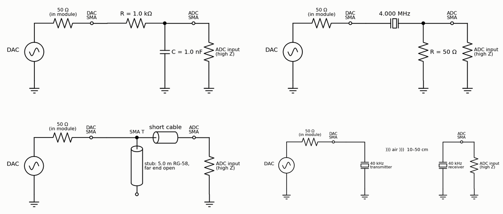

<!-- nav -->
[← 3.04 Booting from an SD card](3_04_booting_from_sd.md#304-booting-from-an-sd-card) &emsp;&emsp;&emsp; **[Contents](../README.md#contents)** &emsp;&emsp;&emsp; [4.01 A faster DAC: PLLs →](4_01_a_faster_dac.md#401-a-faster-dac-plls)

# 4.00 One-board experiments

**What you need first:** Chapter 1 through [1.08](1_08_lockin.md#108-a-lock-in-amplifier); each page names the instrument it uses.
[4.01](4_01_a_faster_dac.md#401-a-faster-dac-plls) needs only [1.03](1_03_dac_sine.md#103-a-sine-direct-digital-synthesis). Nothing here needs Chapters 2 or 3.

Chapters 1 to 3 built instruments out of logic: a function generator, a
digitizer, a [lock-in amplifier](https://en.wikipedia.org/wiki/Lock-in_amplifier) that is also a [network analyzer](https://en.wikipedia.org/wiki/Network_analyzer_(electrical)), and a spectrum
analyzer. This chapter uses them. First, [4.01](4_01_a_faster_dac.md#401-a-faster-dac-plls) doubles
the DAC's speed with one of the FPGA's [phase-locked loops](https://en.wikipedia.org/wiki/Phase-locked_loop). Then come the
experiments.

Sections [4.02](4_02_rc_and_lc_circuits.md#402-rc-and-lc-circuits) to [4.09](4_09_your_crystal.md#409-your-crystal-against-a-reference) are experiments for the instruments you've built. Each
needs only the designs and scripts from Chapters 1–3, a few components, and
SMA-to-pin adapters (or a small board with two SMA jacks) to connect them.
Each comes with the numbers to expect, worked out in advance, so that a
measurement that disagrees is itself a finding. Every circuit starts at the
DAC, drawn as a source behind the ~50 Ω source resistance the module's output
appears to have ([1.08](1_08_lockin.md#measuring-with-it)), and ends at the ADC's
high-impedance input.

> [!NOTE]
> The experiments of [4.02](4_02_rc_and_lc_circuits.md#402-rc-and-lc-circuits) to [4.09](4_09_your_crystal.md#409-your-crystal-against-a-reference) are designed but **not yet tried**, apart
> from timing the crystal against the laptop's clock in [4.09](4_09_your_crystal.md#409-your-crystal-against-a-reference): their numbers are
> predictions, not measurements. If you do one, you're the first.

| experiment | what you learn | parts | uses |
| --- | --- | --- | --- |
| [4.01 A faster DAC](4_01_a_faster_dac.md#401-a-faster-dac-plls) | phase-locked loops: a 100 MHz clock from the board's 50 MHz; images, and how a faster DAC moves them | nothing | `lockin_pll.sv` |
| [4.02 The cable's capacitance](4_02_rc_and_lc_circuits.md#the-adcs-input-and-the-cables-capacitance) | an RC corner; C per metre; the cable's Z0 from two measurements | 10 kΩ | `lockin.py --ref` |
| [4.02 RC filters](4_02_rc_and_lc_circuits.md#rc-low-pass-and-high-pass) | Bode plots; −45° at the corner | 1 kΩ, 1 nF | `lockin.py --ref` |
| [4.02 LC resonance](4_02_rc_and_lc_circuits.md#a-series-lc-resonance) | resonance, Q, the phase flip | 100 µH, 100 pF, 100 Ω | `lockin.py --ref` |
| [4.03 A quartz crystal](4_03_quartz_crystal.md#403-the-q-of-a-quartz-crystal) | a [Q](https://en.wikipedia.org/wiki/Q_factor) of 104, loaded down to 2,000 so the crystal stays cool; series and parallel resonance; a clock is a crystal too | 4 MHz crystal, 1 kΩ, 50 Ω | `lockin.py` |
| [4.04 A diode clipper](4_04_harmonics.md#404-harmonics-a-diode-clipper) | harmonics; why symmetry kills the even ones | 1 kΩ, two 1N4148 | Chapter 2's SoC |
| [4.05 A quarter-wave stub](4_05_quarter_wave_stub.md#405-a-quarter-wave-stub) | [standing waves](https://en.wikipedia.org/wiki/Standing_wave); a cable's length from a notch | SMA T, 5 m RG-58 | `lockin.py` |
| [4.06 The speed of sound](4_06_speed_of_sound.md#406-the-speed-of-sound-at-40-khz) | phase vs distance; *c* to 0.3%; temperature | 40 kHz transducer pair | `lockin.py -f` |
| [4.07 An optical link](4_07_optical_link.md#407-an-optical-link) | [photodiode](https://en.wikipedia.org/wiki/Photodiode) bandwidth; lock-in detection under room light | red LED, BPW34, 9 V | `lockin.py`, `capture.py` |
| [4.08 Feedback control](4_08_feedback_control.md#408-feedback-control-of-an-rc-plant) | a PI loop, and what 6 samples of latency cost | 1 kΩ, 1 µF | new gateware |
| [4.09 Your crystal](4_09_your_crystal.md#409-your-crystal-against-a-reference) | parts per billion from a phase drift | 10 MHz reference (or none) | `lockin.sv` |

Two more experiments need nothing but a cable: the pseudo-random impulse
response and the loop oscillator, both in [1.07](1_07_closing_the_loop.md#107-closing-the-loop-the-dac-talks-to-the-adc).

## More ideas

[4.10](4_10_more_ideas.md#410-more-ideas-for-one-board) collects more experiments
for one board, none tried yet, each a good size for a final project.

<!-- nav -->
[← 3.04 Booting from an SD card](3_04_booting_from_sd.md#304-booting-from-an-sd-card) &emsp;&emsp;&emsp; **[Contents](../README.md#contents)** &emsp;&emsp;&emsp; [4.01 A faster DAC: PLLs →](4_01_a_faster_dac.md#401-a-faster-dac-plls)

<!-- author -->
Jason Gallicchio, jason@hmc.edu, Harvey Mudd College
