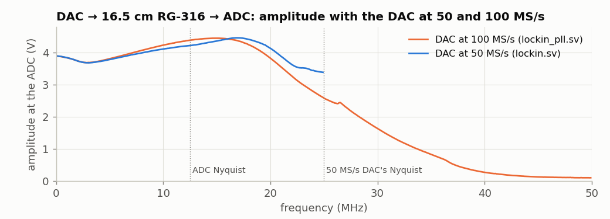
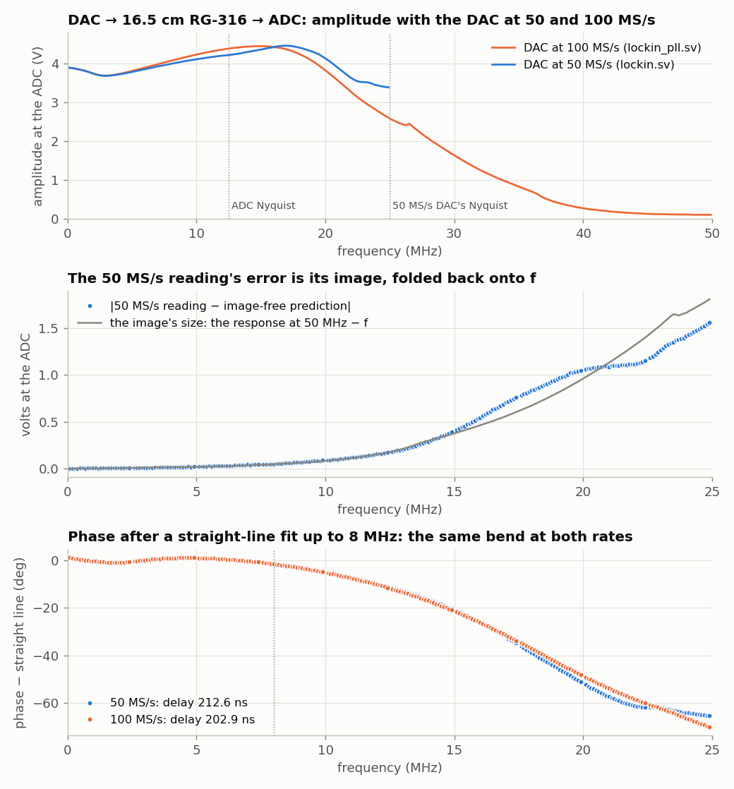

<!-- nav -->
[← 4.00 One-board experiments](4_00_one_board_experiments.md#400-one-board-experiments) &emsp;&emsp;&emsp; **[Contents](../README.md#contents)** &emsp;&emsp;&emsp; [4.02 RC and LC circuits →](4_02_rc_and_lc_circuits.md#402-rc-and-lc-circuits)

# 4.01 A faster DAC: PLLs



Every AD9708 is guaranteed to run at 100 MS/s, twice what Chapter 1 gives
it, but the board has only a 50 MHz oscillator. The FPGA can multiply that.
This section builds a 100 MHz clock, plays a sine with it, and then runs the
lock-in of [1.08](1_08_lockin.md#108-a-lock-in-amplifier) with it, which turns out to fix the lock-in's errors above
8 MHz.

## Phase-locked loops

The ECP5 has two **[phase-locked loops](https://en.wikipedia.org/wiki/Phase-locked_loop) (PLLs)**. A PLL has its own fast
voltage-controlled oscillator (VCO) and a feedback loop. The loop divides the
output clock by *N*, compares the result with the input clock, and steers the
VCO until the two agree in frequency *and* phase. So the output settles at
*N* times the input. Divide the input by *M* first and you get *N*/*M* times
the input, for many whole numbers *N* and *M*. Because the output is
phase-locked to the crystal, it's exactly as accurate as the crystal: the
"100 MHz" is the crystal's 50 MHz times two, error and all. (The crystals on
the five boards measured here ran 2.8, 3.3, 1.7, 2.1 and 2.0 ppm slow, and
[5.02](5_02_warming_a_crystal.md#502-warming-a-crystal) shows how much they move with temperature.)

You rarely work out the dividers yourself. The OSS CAD Suite's `ecppll` does
it, and writes the SystemVerilog:

```console
$ ecppll -i 50 -o 100 -f my_pll.v
Pll parameters:
Refclk divisor: 1
Feedback divisor: 2
clkout0 divisor: 6
clkout0 frequency: 100 MHz
VCO frequency: 600
```

Check one number that `ecppll` doesn't check for you. The ECP5 datasheet
guarantees the PLL's jitter only when the input clock, divided by `Refclk
divisor`, is at least 10 MHz. From this board's 50 MHz, that means a divisor
of 5 or less. Ask `ecppll` for 32 MHz and it picks a divisor of 14 (and gives
32.14 MHz). The PLL will run like that, but its jitter is no longer specified.

`pll100.sv` is `my_pll.v`, tidied up and with clearer port names. There's one
module, `EHXPLLL`, which is the PLL itself, and a page of settings you can
take as given:

<!-- file: src/verilog/pll100.sv -->
```systemverilog
// pll100.sv -- 100 MHz from the board's 50 MHz oscillator, with the ECP5's PLL.
//
// A PLL (phase-locked loop) steers a voltage-controlled oscillator (VCO) until
// the VCO, divided down, matches the input in frequency and phase:
//
//     VCO = 50 MHz x CLKFB_DIV x CLKOP_DIV / CLKI_DIV = 50 x 2 x 6 / 1 = 600 MHz
//     clk100 = VCO / CLKOP_DIV = 100 MHz,  phase-locked to the 50 MHz input
//
// The VCO must stay between 400 and 800 MHz.  This file is the output of
// `ecppll -i 50 -o 100` (from the OSS CAD Suite), tidied up; ask ecppll for
// any other frequency and paste its numbers in.  Used by sine_pll.sv and
// lockin_pll.sv.

module pll100 (
    input  logic clk,         // 50 MHz
    output logic clk100,      // 100 MHz
    output logic locked       // 1 once clk100 is steady (about 10 us after power-up)
);
    // The FREQUENCY_PIN attributes tell nextpnr the output frequency, so it
    // checks timing at 100 MHz without being told separately.  The rest of
    // the settings are ecppll's: take them as given.
    (* FREQUENCY_PIN_CLKI="50" *) (* FREQUENCY_PIN_CLKOP="100" *)
    (* ICP_CURRENT="12" *) (* LPF_RESISTOR="8" *) (* MFG_ENABLE_FILTEROPAMP="1" *) (* MFG_GMCREF_SEL="2" *)
    EHXPLLL #(
        // ######################################################################
        // ##  KEY LINE: the three dividers that set the frequency.
        // ##  VCO = 50 x 2 x 6 / 1 = 600 MHz;  clk100 = 600 / 6 = 100 MHz.
        // ######################################################################
        .CLKI_DIV(1), .CLKFB_DIV(2), .CLKOP_DIV(6), .CLKOP_CPHASE(2), .CLKOP_FPHASE(0),
        .CLKOP_ENABLE("ENABLED"), .FEEDBK_PATH("CLKOP"),
        .OUTDIVIDER_MUXA("DIVA"), .OUTDIVIDER_MUXB("DIVB"),
        .OUTDIVIDER_MUXC("DIVC"), .OUTDIVIDER_MUXD("DIVD"),
        .PLLRST_ENA("DISABLED"), .INTFB_WAKE("DISABLED"),
        .STDBY_ENABLE("DISABLED"), .DPHASE_SOURCE("DISABLED")
    ) pll (
        .CLKI(clk), .CLKFB(clk100), .CLKOP(clk100), .LOCK(locked),
        .RST(1'b0), .STDBY(1'b0), .PHASESEL0(1'b0), .PHASESEL1(1'b0),
        .PHASEDIR(1'b1), .PHASESTEP(1'b1), .PHASELOADREG(1'b1),
        .PLLWAKESYNC(1'b0), .ENCLKOP(1'b0)
    );
endmodule
```

<details>
<summary><b>Detail:</b> how many clocks can a design have?</summary>

The LFE5U-25 on the Icepi Zero has two PLLs (and two DLLs, for fine delays),
and each PLL has four outputs, so one crystal can give a design up to eight
related frequencies. Clocks reach the flip-flops over dedicated low-skew
*global clock networks*, 16 in each quadrant of the chip
([Project Trellis](https://github.com/YosysHQ/prjtrellis), which documents the
chip's insides, describes them). The logic driven by one clock is a *clock
domain*. A signal that crosses from one domain to another needs care, because
the receiving flip-flop can catch it mid-change: a single bit goes through two
flip-flops in a row, as the serial receiver in `uart.sv` does
([1.06](1_06_fast_capture.md#106-fast-captures)), and a stream of numbers goes
through a FIFO. This tutorial mostly avoids the problem. Its designs run on
one 50 MHz clock and make slower things with *enables* (the ADC's 25 MHz is a
flip-flop that toggles, not a second clock), and `lockin_pll.sv` moves
everything to the PLL's 100 MHz. LiteX's SoC of Chapter 2 makes its own clocks
for the CPU and the SDRAM with a PLL.

</details>

## A sine at 100 MS/s

`sine_pll.sv` is `sine.sv` with its clock from the PLL. One precaution: the
DDS waits until the PLL reports `locked`, since the output clock wanders while
the loop settles.

<!-- file: src/verilog/sine_pll.sv -->
```systemverilog
// sine_pll.sv -- sine.sv with the DAC at 100 MS/s instead of 50, clocked by a PLL.
//
// Only three things change from sine.sv: the clock comes from pll100.sv, the DDS
// waits for the PLL to lock, and the tuning word is for 100 MHz:
//
//     f = TW * 100 MHz / 2^32,   so   TW = round(f / 100 MHz * 2^32)

module sine_pll #(
    parameter logic [31:0] TW = 32'd42949673    // 1.000 000 MHz at 100 MS/s
) (
    input  logic       clk,                     // 50 MHz
    output logic [7:0] dac_d,
    output logic       dac_clk
);
    // ##########################################################################
    // ##  KEY LINE: the PLL makes clk100 from the 50 MHz clk.  Everything
    // ##  below runs on clk100 instead of clk.
    // ##########################################################################
    logic clk100, locked;
    pll100 pll (.clk(clk), .clk100(clk100), .locked(locked));

    logic signed [7:0] sine_table [0:255];
    initial
        for (int i = 0; i < 256; i++)
            sine_table[i] = $rtoi($floor(127.0 * $sin(6.283185307179586 * i / 256) + 0.5));

    logic [31:0] phase = 0;
    always_ff @(posedge clk100)
        if (locked) begin                       // wait until the PLL has settled
            phase <= phase + TW;
            dac_d <= sine_table[phase[31:24]] + 128;
        end

    assign dac_clk = ~clk100;                   // 5 ns after each data change
endmodule
```

`make load-sine_pll`. The tone is the same 1 MHz, but it's now built from
steps 10 ns long instead of 20. On a [spectrum analyzer](https://en.wikipedia.org/wiki/Spectrum_analyzer) fast enough to see it,
the first image, at clock − *f*, moves from 49 MHz to 99 MHz. It's weaker,
because the DAC's [zero-order hold](https://en.wikipedia.org/wiki/Zero-order_hold) (the staircase) suppresses it by [sinc](https://en.wikipedia.org/wiki/Sinc_function)(99/100)
instead of sinc(49/50), and the analog filters on the module suppress it
further. A faster clock also flattens the droop of the tone itself. A
staircase of steps *T* long has a response sinc(*fT*) = sin(π*fT*)/(π*fT*): at
20 MHz that's 0.76 at 50 MS/s and 0.94 at 100 MS/s.

<details>
<summary><b>Detail:</b> the timing at the DAC's pins</summary>

`nextpnr` reports that `sine_pll.sv`'s logic would run at 200 MHz, so the
FPGA isn't the limit. What it doesn't check is the timing at the DAC's pins.
With `dac_clk = ~clk100`, the DAC's clock rises 5 ns after the data changes
and 5 ns before the next change. The DAC's 2.0 ns setup and 1.5 ns hold fit
inside that, with about 3 ns to spare on each side for the pins and wires to
differ. At 125 MHz there would be only 4 ns between each edge and the next
change, and the margins shrink to 2 ns and 2.5 ns.

</details>

## The lock-in at 100 MS/s

`lockin_pll.sv` does the same for the lock-in. Every block runs on the PLL's
100 MHz clock, the ADC still samples at 25 MS/s (now 100 MHz / 4), and the
serial port still runs at 1,000,000 baud (now 100 clocks per bit).
`diff lockin.sv lockin_pll.sv` shows everything that changed. Apart from `clk`
becoming `clk100` everywhere, it's this:

```systemverilog
    logic clk100, locked;
    pll100 pll (.clk(clk), .clk100(clk100), .locked(locked));
...
    logic       adc_div      = 0;   // toggles every clock: adc_clk_r every other
    always_ff @(posedge clk100) begin
        adc_div    <= ~adc_div;
        if (adc_div) adc_clk_r <= ~adc_clk_r;
        new_sample <= 0;
        if (adc_div && adc_clk_r == 0) begin
...
    uart_rx #(.CLKS_PER_BIT(100)) rx (.clk(clk100), .rx(uart_rx),
```

<details>
<summary>The whole file: <code>lockin_pll.sv</code></summary>

<!-- file: src/verilog/lockin_pll.sv -->
```systemverilog
// lockin_pll.sv -- lockin.sv with the DAC at 100 MS/s instead of 50.
//
// Everything runs on a 100 MHz clock from pll100.sv.  The ADC still samples at
// 25 MS/s (now 100 MHz / 4), and the serial port still runs at 1,000,000 baud
// (now 100 clocks per bit), so lockin.py talks to it unchanged -- except that
// the tuning word is now  TW = f / 100 MHz * 2^32:  use  lockin.py --fclk 100e6.
//
// See lockin.sv for how it works; `diff lockin.sv lockin_pll.sv` shows the changes.

module lockin_pll #(
    parameter N_LOG2 = 20           // average 2^20 samples = 42 ms at 25 MS/s
) (
    input  logic       clk,         // 50 MHz, to the PLL
    input  logic [7:0] adc_d,
    output logic       adc_clk,
    output logic [7:0] dac_d = 128,
    output logic       dac_clk,
    input  logic       uart_rx,
    output logic       uart_tx,
    output logic [4:0] led
);
    // ##########################################################################
    // ##  KEY LINE: every block below runs on clk100, from the PLL.
    // ##########################################################################
    logic clk100, locked;
    pll100 pll (.clk(clk), .clk100(clk100), .locked(locked));

    // ---- sine table, as in sine.sv -------------------------------------------
    // One cycle of the stimulus.  Which point of the cycle is t = 0 is ours to
    // choose, so call what the DAC plays cos(wt): then the entry 64 further on,
    // a quarter of the way round the table, is cos(wt + 90 deg) = -sin(wt).
    logic signed [7:0] sine_table [0:255];
    initial
        for (int i = 0; i < 256; i++)
            sine_table[i] = $rtoi($floor(127.0 * $sin(6.283185307179586 * i / 256) + 0.5));

    // ---- the stimulus: DDS -> DAC at 100 MS/s, as in sine_pll.sv ---------------
    logic [31:0] tw    = 32'h028f5c29;  // 1 MHz until told otherwise
    logic [31:0] phase = 0;
    always_ff @(posedge clk100) begin
        phase <= phase + tw;
        dac_d <= sine_table[phase[31:24]] + 128;
    end
    assign dac_clk = ~clk100;

    // ---- the ADC at 25 MS/s: adc_clk is 20 ns high, 20 ns low, as before ----
    logic       adc_clk_r    = 0;
    logic       new_sample   = 0;
    logic [7:0] sample       = 128;
    logic [7:0] sample_phase = 0;   // the stimulus phase when it was taken
    logic       adc_div      = 0;   // toggles every clock: adc_clk_r every other
    always_ff @(posedge clk100) begin
        adc_div    <= ~adc_div;
        if (adc_div) adc_clk_r <= ~adc_clk_r;
        new_sample <= 0;
        if (adc_div && adc_clk_r == 0) begin
            sample       <= adc_d;
            // ##################################################################
            // ##  KEY LINE: remember the stimulus phase at the moment of each
            // ##  sample.  The reference below is computed from this phase.
            // ##################################################################
            sample_phase <= phase[31:24];
            new_sample   <= 1;
        end
    end
    assign adc_clk = adc_clk_r;

    // ---- multiply and accumulate: a 3-step assembly line --------------------
    // Each step takes one clock; v1 and v2 say "the step before me had data".
    logic                     v1 = 0, v2 = 0;
    logic signed [8:0]        s = 0;            // sample - 128:  -128 .. +127
    logic signed [7:0]        ref_x = 0, ref_y = 0;
    logic signed [16:0]       p_x = 0, p_y = 0;
    logic signed [N_LOG2+16:0] acc_x = 0, acc_y = 0;
    logic [N_LOG2-1:0]        count = 0;
    logic                     done = 0;         // high for one clock: X and Y are ready
    logic signed [31:0]       X = 0, Y = 0;
    logic                     restart = 0;      // set by the serial command below

    always_ff @(posedge clk100) begin
        // step 1: look up the reference, remove the ADC's mid-scale offset
        v1      <= new_sample;
        s       <= $signed({1'b0, sample}) - 9'sd128;
        ref_x <= sine_table[sample_phase];            // cos(wt): the stimulus itself
        ref_y <= sine_table[sample_phase + 8'd64];    // a quarter turn on: -sin(wt)
        // step 2: multiply (the FPGA has hardware multipliers for this)
        v2 <= v1;
        // ######################################################################
        // ##  KEY LINE 1: multiply the signal by both references, cos and -sin.
        // ######################################################################
        p_x <= s * ref_x;
        p_y <= s * ref_y;
        // step 3: add up 2^N_LOG2 products, then report and start again
        done <= 0;
        if (restart) begin
            acc_x <= 0;
            acc_y <= 0;
            count <= 0;
        end else if (v2) begin
            if (count == {N_LOG2{1'b1}}) begin              // the last one
                // ##############################################################
                // ##  KEY LINE 3: the average is the sum / 2^N_LOG2.  Keep 16
                // ##  bits after the binary point: sum / 2^N_LOG2 * 65536.
                // ##############################################################
                X <= (acc_x + p_x) >>> (N_LOG2 - 16);
                Y <= (acc_y + p_y) >>> (N_LOG2 - 16);
                done  <= 1;
                acc_x <= 0;
                acc_y <= 0;
            end else begin
                // ##############################################################
                // ##  KEY LINE 2: add up the products.  Anything not at the
                // ##  stimulus frequency averages towards zero.
                // ##############################################################
                acc_x <= acc_x + p_x;
                acc_y <= acc_y + p_y;
            end
            count <= count + 1;
        end
    end

    // ---- serial port ---------------------------------------------------------
    logic [7:0] rx_data;
    logic       rx_valid;
    logic [7:0] tx_data  = 0;
    logic       tx_start = 0;
    logic       tx_busy;
    uart_rx #(.CLKS_PER_BIT(100)) rx (.clk(clk100), .rx(uart_rx),
                                      .data(rx_data), .valid(rx_valid));
    uart_tx #(.CLKS_PER_BIT(100)) tx (.clk(clk100), .data(tx_data), .start(tx_start),
                                      .busy(tx_busy), .tx(uart_tx));

    // Commands: hex digits shift into `entry`; Enter makes it the new TW.
    logic [31:0] entry = 0;
    logic        is_digit, is_letter;
    logic [3:0]  nibble;
    assign is_digit  = rx_data >= "0" && rx_data <= "9";
    assign is_letter = rx_data >= "a" && rx_data <= "f";
    assign nibble    = is_digit ? rx_data - "0" : rx_data - "a" + 10;
    always_ff @(posedge clk100) begin
        restart <= 0;
        if (rx_valid) begin
            if (is_digit || is_letter)
                entry <= {entry[27:0], nibble};
            else if (rx_data == "\n" || rx_data == "\r") begin
                tw      <= entry;
                restart <= 1;
            end
        end
    end

    // Results: print TW, X and Y as 8 hex digits each, then a newline.
    logic [95:0] line  = 0;         // the three numbers, next digit at the top
    logic [1:0]  word  = 3;         // 0..2 = printing that number, 3 = idle
    logic [3:0]  digit = 0;         // 0..7 = a hex digit, 8 = the separator
    logic [3:0]  top;
    assign top = line[95:92];
    always_ff @(posedge clk100) begin
        tx_start <= 0;
        if (done && word == 3) begin
            line  <= {tw, X, Y};
            word  <= 0;
            digit <= 0;
        end else if (word != 3 && !tx_busy && !tx_start) begin
            tx_start <= 1;
            if (digit == 8) begin
                tx_data <= (word == 2) ? "\n" : " ";
                word    <= word + 1;
                digit   <= 0;
            end else begin
                tx_data <= (top < 10) ? "0" + top : "a" + top - 10;
                line    <= line << 4;
                digit   <= digit + 1;
            end
        end
    end

    // ---- LEDs ------------------------------------------------------------------
    logic        results_led = 0;
    logic [23:0] clip_timer  = 0;   // stays lit ~0.3 s after the ADC clips
    always_ff @(posedge clk100) begin
        if (done) results_led <= ~results_led;
        if (new_sample && (sample == 0 || sample == 255)) clip_timer <= '1;
        else if (clip_timer != 0) clip_timer <= clip_timer - 1;
    end
    assign led = {clip_timer != 0, 3'b000, results_led};
endmodule
```

</details>

`adc_clk` is still 20 ns high and 20 ns low, and the data pins are still read
just before its rising edge. Only the tuning word's arithmetic changes on the
laptop, so `lockin.py` takes the clock as an option. The DAC can now make any
frequency up to its own [Nyquist frequency](https://en.wikipedia.org/wiki/Nyquist_frequency), 50 MHz:

```console
$ make load-lockin_pll
$ python3 lockin.py --fclk 100e6 -f 40e6
    f (Hz)      amplitude (V)   phase (deg)
39999999.991       0.2751      -172.45
39999999.991       0.2832      -172.25
39999999.991       0.2754      -172.48
...
```

The ADC samples at only 25 MS/s, so how can it measure 40 MHz? It aliases
40 MHz down to 10 MHz, but the reference table is looked up at exactly the
same instants, so the reference aliases identically and still matches. (This
is [1.08](1_08_lockin.md#108-a-lock-in-amplifier)'s first Try-this, taken further.) Here are sweeps through the 16.5 cm
cable at both DAC rates:



- **The module's response, to 50 MHz** (top). It rises to 4.45 V around
  15 MHz, and then falls: 2.6 V at 25 MHz, 0.26 V at 40 MHz. That's the analog
  filters on the DAC's output and the ADC's input. Up to about 16 MHz the
  100 MS/s curve is slightly *higher*, because a staircase of shorter steps
  droops less: sinc(*f*/100 MHz) instead of sinc(*f*/50 MHz).
- **The 50 MS/s readings above ~8 MHz are wrong, and here is by how much**
  (middle). Above 16 MHz the 50 MS/s design reads *more* than the 100 MS/s
  one: at 20 MHz, 4.11 V. Taking the 100 MS/s measurement and correcting it
  for the other sinc droop, the 50 MS/s DAC's tone alone should give 3.06 V.
  The difference is the image at 50 MHz − *f*, which the ADC folds back onto
  *f*. The 100 MS/s sweep measured the module's response at 50 MHz − *f*
  independently, and it predicts the image's size: the dots and the line
  agree to within about 25% over the whole range. At 100 MS/s the image moves
  to 100 MHz − *f*, where the analog filters pass almost nothing.
- **The phase bend above 8 MHz is the instrument's own** (bottom). It's the
  same at both rates, so it isn't the image. It's the analog filters, whose
  delay isn't constant near their cutoff. It cancels when you divide one
  measurement by another, as in the cable comparison of [1.08](1_08_lockin.md#108-a-lock-in-amplifier). The image doesn't
  cancel, because its phase depends on the cable.

The fitted delay is 9.7 ns shorter at 100 MS/s: one DAC clock period less
(20 ns at 50 MS/s, 10 ns at 100). The DAC latches each new value half a clock
after the FPGA computes it, and the staircase lags its samples by another
half.

**Try this:**

- `ecppll -n pll125 -i 50 -o 125 -f pll125.v`, and push the DAC to its
  typical maximum. Then go past it. [`dev/tools/pinspeed/`](../dev/tools/pinspeed/)
  found the DAC still converting correctly at 200 MS/s, so the data sheet is
  conservative. Where does it finally give up, and is it the DAC or the FPGA's
  output pins?
- Use a second PLL output as a phase-shifted copy of the clock
  (`ecppll ... --clkout1 100 --phase1 90`). Clock the DAC from it and move the
  phase to find where the DAC's data window opens and closes. Or use it for
  equivalent-time sampling finer than [1.07](1_07_closing_the_loop.md#107-closing-the-loop-the-dac-talks-to-the-adc)'s 20 ns.
- Repeat [1.08](1_08_lockin.md#108-a-lock-in-amplifier)'s two-cable measurement with `lockin_pll.sv`. With the image
  gone, does the phase difference stay a straight line past 8 MHz?
- Measure an RC low-pass with a corner near 20 MHz, at both rates, each
  divided by its own through reference. Which result can you believe?

<!-- nav -->
[← 4.00 One-board experiments](4_00_one_board_experiments.md#400-one-board-experiments) &emsp;&emsp;&emsp; **[Contents](../README.md#contents)** &emsp;&emsp;&emsp; [4.02 RC and LC circuits →](4_02_rc_and_lc_circuits.md#402-rc-and-lc-circuits)

<!-- author -->
<sub>Jason Gallicchio, jason@hmc.edu, Harvey Mudd College</sub>
