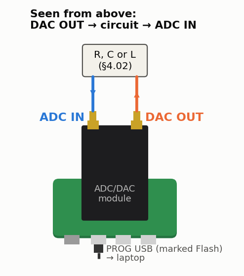

<!-- nav -->
[← 4.01 A faster DAC: PLLs](4_01_a_faster_dac.md#401-a-faster-dac-plls) &emsp;&emsp;&emsp; **[Contents](../README.md#contents)** &emsp;&emsp;&emsp; [4.03 The Q of a quartz crystal →](4_03_quartz_crystal.md#403-the-q-of-a-quartz-crystal)

# 4.02 RC and LC circuits



**Where it plugs in.** With the USB connectors toward you, DAC OUT is the
right-hand SMA and ADC IN the left-hand one.
Every circuit on this page goes between them.

Every sweep on this page is divided by a sweep of the plain cable at the same
frequencies, as [1.08](1_08_lockin.md#108-a-lock-in-amplifier) does: `-o thru.csv`
with the cable alone, then `--ref thru.csv` with the circuit. That cancels the
loop's own 213 ns and the module's response above 10 MHz; what's left is the
circuit. Without it the loop's delay is in every phase you read, −11° at 140 kHz
and −46° at 600 kHz, and the −45° points below can't be found.

```bash
python3 lockin.py --sweep 2e4 2e6 -n 60 -o thru.csv      # the cable alone, first
```

## The ADC's input and the cable's capacitance


Through a 10 kΩ resistor the cable is no longer a delay line. At these
frequencies it is just a capacitor: C′ × length, about 95 pF per metre for
RG-316, plus the ADC's own input capacitance *C*<sub>in</sub>. Together with
the 10 kΩ it makes a low-pass. The prediction, for *C*<sub>in</sub> between 10
and 20 pF, is a corner at 136–149 kHz with the 101.5 cm cable and 444–617 kHz
with the 16.5 cm one.

- Find each corner as the −45° point of a sweep:
  `python3 lockin.py --sweep 2e4 2e6 -n 60 --ref thru.csv`.
  Since *f*<sub>c</sub> = 1/(2π*RC*), the two corners give two capacitances.
  Their difference, divided by 0.85 m, is C′.
- The short cable's number, minus its 16 pF, is the ADC's *C*<sub>in</sub>.
- If |H| at low frequency is below 1, the ADC's input *resistance* R<sub>in</sub>
  is finite: |H| = R<sub>in</sub>/(R<sub>in</sub> + 10 kΩ).
- **Z<sub>0</sub> from two measurements.** [1.08](1_08_lockin.md#measuring-with-it) measured the delay per metre,
  τ′ = 4.58 ns/m. This measures C′. For a lossless line τ′ = √(L′C′) and
  Z<sub>0</sub> = √(L′/C′), so Z<sub>0</sub> = τ′/C′. Expect about 4.58 ns/m ÷ 95 pF/m = 48 Ω.

## RC low-pass and high-pass


The measurement [1.08](1_08_lockin.md#measuring-with-it) describes. The DAC's 50 Ω
adds to the 1 kΩ, so
*f*<sub>c</sub> = 1/(2π × 1050 Ω × 1 nF) = **152 kHz**. The cable and the ADC
add ~30 pF to the low-pass's capacitor, lowering it to 147 kHz. Compare the
magnitude (−3 dB, then −20 dB/decade) and phase (−45° at the corner) with
1/(1 + *jω RC*). The high-pass mirrors it: the corner is again 152 kHz, and
the passband gain is 1000/1050 = 0.95. Above ~5 MHz it droops, as the ~30 pF
starts to shunt the 1 kΩ.

## A series LC resonance


*f*<sub>0</sub> = 1/(2π√(LC)) = **1.59 MHz**. The Q is set by all the resistance in the
loop: √(L/C)/(50 + 100 + ~3 Ω of inductor) = 1000/153 ≈ **6.5**, a 244 kHz
bandwidth. The peak |H| is 100/153 = 0.65. The phase swings from +90° through
0° at *f*<sub>0</sub> to −90°. Sweep `python3 lockin.py --sweep 5e5 5e6 -n 80 --ref thru.csv`
(with a `thru.csv` taken over the same 80 frequencies), then change
the 100 Ω to 1 kΩ and watch Q fall. An inductor's self-resonance limits how
high this works; small 100 µH chokes are fine to about 5 MHz.

<!-- nav -->
[← 4.01 A faster DAC: PLLs](4_01_a_faster_dac.md#401-a-faster-dac-plls) &emsp;&emsp;&emsp; **[Contents](../README.md#contents)** &emsp;&emsp;&emsp; [4.03 The Q of a quartz crystal →](4_03_quartz_crystal.md#403-the-q-of-a-quartz-crystal)

<!-- author -->
<sub>Jason Gallicchio, jason@hmc.edu, Harvey Mudd College</sub>
