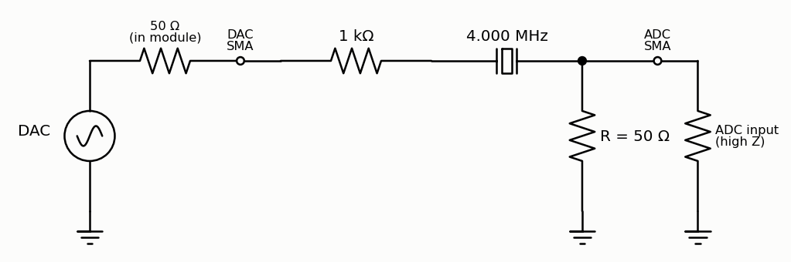
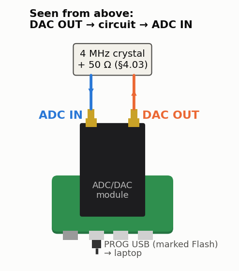

<!-- nav -->
[← 4.02 RC and LC circuits](4_02_rc_and_lc_circuits.md#402-rc-and-lc-circuits) &emsp;&emsp;&emsp; **[Contents](../README.md#contents)** &emsp;&emsp;&emsp; [4.04 Harmonics: a diode clipper →](4_04_harmonics.md#404-harmonics-a-diode-clipper)

# 4.03 The Q of a quartz crystal





**Where it plugs in.** With the USB connectors toward you, DAC OUT is the
right-hand SMA and ADC IN the left-hand one.

A [quartz crystal](https://en.wikipedia.org/wiki/Crystal_oscillator) is an RLC circuit with an absurd Q. For a typical 4 MHz HC-49
crystal, take the motional *C*<sub>1</sub> ≈ 16 fF, *R*<sub>1</sub> ≈ 50 Ω and a shunt
*C*<sub>0</sub> ≈ 5 pF (the *Butterworth–Van Dyke* model). That makes *L*<sub>1</sub> =
1/(ω<sup>2</sup>*C*<sub>1</sub>) ≈ **0.1 H**, a reactance ω*L*<sub>1</sub> of 2.5 MΩ at 4 MHz. Loaded by
50 + 50 Ω of source and load, the loop is 150 Ω and Q = ω*L*<sub>1</sub>/150 Ω ≈ **16,600**:
a peak only **~240 Hz wide** at 4 MHz, with |H| = 50/150 = 0.33 at the top.

One thing `lockin.sv` can't do is turn its stimulus down, and a crystal cares:
at resonance the whole loop is 150 Ω, so the DAC's 3.9 V would push 26 mA
through it, 17 mW in *R*<sub>1</sub>, where the data sheet allows a milliwatt at
most. The crystal would heat and walk off during the sweep. So put 1 kΩ in
series with it, between the DAC and the crystal (the drawing above leaves it
out). The loop is now 1,150 Ω, the peak current 3.4 mA, and *R*<sub>1</sub>
dissipates 0.3 mW. The price is Q: ω*L*<sub>1</sub>/1150 Ω ≈ **2,200**, a peak
**1.8 kHz wide**, with |H| = 50/1150 = 0.043 at the top: 170 mV, 4 ADC codes,
which a 2<sup>20</sup>-sample average reads without trouble. Just above the
peak, *C*<sub>0</sub> cancels the motional arm and the crystal *blocks*: the
parallel resonance, *f*<sub>s</sub>(1 + *C*<sub>1</sub>/2*C*<sub>0</sub>), about **6.4 kHz**
higher, is a deep notch, and the resistor doesn't move it. Away from both,
only *C*<sub>0</sub>'s feedthrough gets through: 1/(ω*C*<sub>0</sub>) = 8 kΩ against
the 50 Ω load, |H| ≈ 0.006, so the peak stands 7× above the floor.

This is where the lock-in shines. Its 12 Hz bandwidth resolves a 1.8 kHz peak
with ease (it would resolve the bare crystal's 240 Hz too), and the DDS sets
the frequency to 0.012 Hz. The crystal rings up in 2Q/ω ≈ 0.2 ms, much less
than one 42 ms average. One sweep in 100 Hz steps puts 18 points on the peak:

```bash
python3 lockin.py --sweep 3.99e6 4.02e6 -n 300 --linear     # both resonances, 100 Hz steps
```

<details>
<summary><b>Detail:</b> the bare crystal, with a smaller stimulus</summary>

To see the crystal's own Q, take the 1 kΩ out and use
[2.05](2_05_lockin_peripheral.md#205-a-lock-in-peripheral)'s lock-in instead,
whose function generator has an amplitude register. At 16/255 the stimulus is
0.24 V: the 150 Ω loop carries 1.6 mA, and *R*<sub>1</sub> dissipates 0.07 mW.
The first paragraph's numbers then apply: Q ≈ 16,600, a 240 Hz peak,
|H| = 0.33, and the notch 6.4 kHz up. The peak is 80 mV, 2 ADC codes, and
[2.05](2_05_lockin_peripheral.md#205-a-lock-in-peripheral)'s lock-in reads to
about a millivolt. Sweep the peak in 10 Hz steps (3.9995 to 4.0015 MHz), since
100 Hz steps would put only two or three points on it.

</details>

Fit a Lorentzian to the peak for *f*<sub>s</sub> and Q, and the model to the
whole curve for *R*<sub>1</sub>, *L*<sub>1</sub>, *C*<sub>1</sub> and *C*<sub>0</sub>. One last thing: the frequency you
measure is relative to the Icepi Zero's *own* crystal, which is itself a few
ppm off ([1.03](1_03_dac_sine.md#103-a-sine-direct-digital-synthesis) measured 2.8 ppm against the ADALM2000), about ±11 Hz here.
Every frequency measurement is a comparison between two oscillators.

<!-- nav -->
[← 4.02 RC and LC circuits](4_02_rc_and_lc_circuits.md#402-rc-and-lc-circuits) &emsp;&emsp;&emsp; **[Contents](../README.md#contents)** &emsp;&emsp;&emsp; [4.04 Harmonics: a diode clipper →](4_04_harmonics.md#404-harmonics-a-diode-clipper)

<!-- author -->
<sub>Jason Gallicchio, jason@hmc.edu, Harvey Mudd College</sub>
