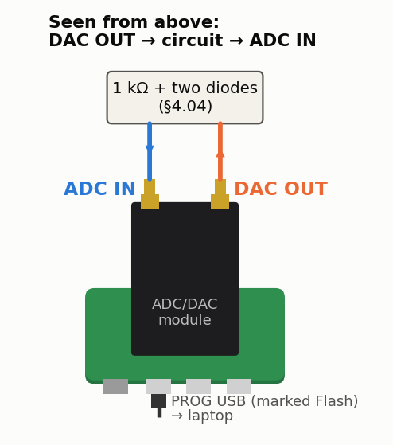

<!-- nav -->
[← 4.03 The Q of a quartz crystal](4_03_quartz_crystal.md#403-the-q-of-a-quartz-crystal) &emsp;&emsp;&emsp; **[Contents](../README.md#contents)** &emsp;&emsp;&emsp; [4.05 A quarter-wave stub →](4_05_quarter_wave_stub.md#405-a-quarter-wave-stub)

# 4.04 Harmonics: a diode clipper




**Where it plugs in.** With the USB connectors toward you, DAC OUT is the
right-hand SMA and ADC IN the left-hand one.

Drive 100 kHz at full amplitude (3.9 V). About 3 mA flows, and the diodes clip
the output at ±0.65 V. Fourier-analysing that clipped sine predicts:

| | DC | 1*f* | 2*f* | 3*f* | 4*f* | 5*f* |
| --- | --- | --- | --- | --- | --- | --- |
| both diodes | 0 | 0.82 V | 0 | 0.26 V | 0 | 0.15 V |
| D1 only (clips the positive side) | −0.93 V | 2.36 V | 0.79 V | 0.13 V | 0.13 V | 0.07 V |

The symmetric clipper makes *only odd harmonics*: it satisfies
*v*(*t* + *T*/2) = −*v*(*t*), and every even Fourier coefficient of such a
function is zero. Remove D2 and the symmetry, the even harmonics and a DC
level all appear.

Measure it with Chapter 2's SoC and firmware. At the board's console, set the
function generator:

```console
adda> fg 100000
```

Then capture and FFT on the laptop, in Python, from `src/riscv/`:

```python
import cap_plot, numpy as np
t, code = cap_plot.cap(cap_plot.find_port(), 3)       # 3.125 MS/s: 31 samples per cycle
v = (code - 126.7) / 25.35
w = np.hanning(len(v))
amp = np.abs(np.fft.rfft((v - v.mean()) * w)) / w.sum() * 2
f = np.fft.rfftfreq(len(v), t[1] - t[0])
```

The baseline to beat: with a plain cable in place of the clipper, the loop's
own harmonics measured −64, −58, −56 and −46 dBc at 2*f* to 5*f* (5*f* =
19 mV). The clipper's 3*f*, 0.26 V against the baseline's 4.9 mV there, should
stand 35 dB above it. The table is for a hard clip, though. A 1N4148's
exponential knee rounds the corners of the clipped sine, so expect 5*f* and
everything above it lower than listed.

<!-- nav -->
[← 4.03 The Q of a quartz crystal](4_03_quartz_crystal.md#403-the-q-of-a-quartz-crystal) &emsp;&emsp;&emsp; **[Contents](../README.md#contents)** &emsp;&emsp;&emsp; [4.05 A quarter-wave stub →](4_05_quarter_wave_stub.md#405-a-quarter-wave-stub)

<!-- author -->
<sub>Jason Gallicchio, jason@hmc.edu, Harvey Mudd College</sub>
