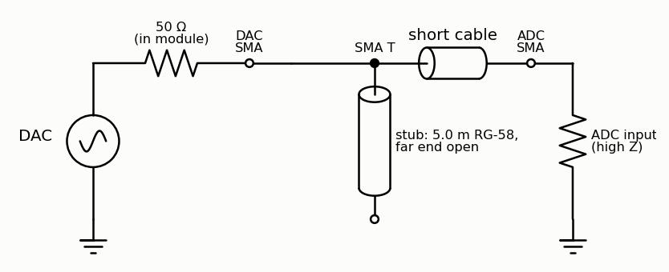
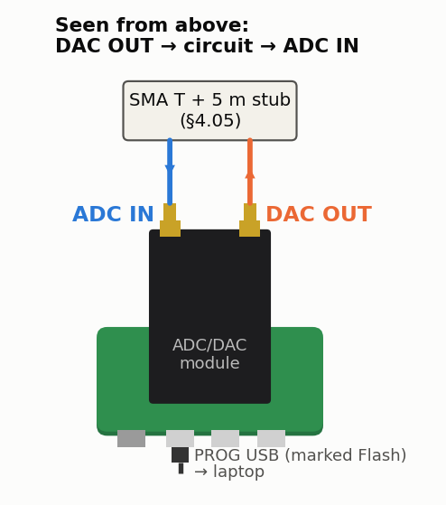
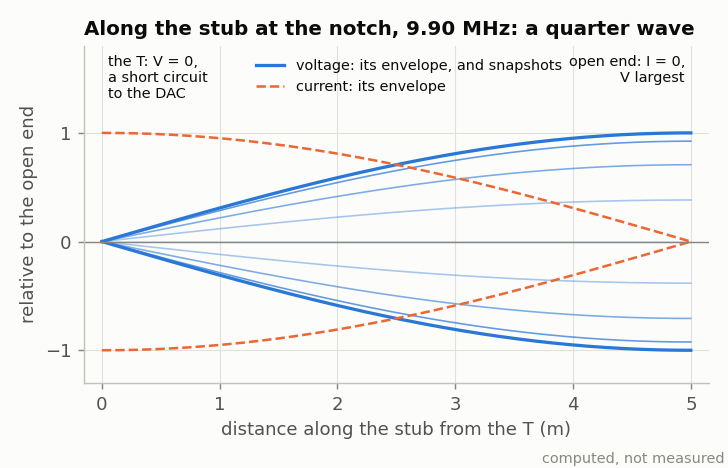

<!-- nav -->
[← 4.04 Harmonics: a diode clipper](4_04_harmonics.md#404-harmonics-a-diode-clipper) &emsp;&emsp;&emsp; **[Contents](../README.md#contents)** &emsp;&emsp;&emsp; [4.06 The speed of sound at 40 kHz →](4_06_speed_of_sound.md#406-the-speed-of-sound-at-40-khz)

# 4.05 A quarter-wave stub

 

**Where it plugs in.** With the USB connectors toward you, DAC OUT is the
right-hand SMA and ADC IN the left-hand one.

Hang an open-ended cable off a T at the DAC. A wave travels to the open end
and back. When the round trip is half a period, it returns inverted, and the
stub's input looks like a short circuit: a notch where the stub is a quarter
wavelength long. For 5.0 m of RG-58 (velocity factor 0.66) that is
*f* = 0.66 *c*/(4 × 5 m) = **9.89 MHz**. The right-hand picture above is the
[standing wave](https://en.wikipedia.org/wiki/Standing_wave) along the stub at that frequency: the open end forces a current
node and a voltage antinode, and a quarter wave back, at the T, the voltage is
zero. Its depth is set by the cable's loss. RG-58 loses about 0.2 dB over 5 m
at 10 MHz, so at the notch the stub's input is not a short but
Z0 × α*l* ≈ 1.3 Ω against the DAC's 50 Ω: about −32 dB, 100 mV at the
ADC. Below it the stub is a 505 pF capacitor working against the DAC's
50 Ω: |H| = 0.99 at 1 MHz, 0.78 at 5 MHz.
`python3 lockin.py --sweep 1e5 12e6 -n 120 --linear` finds the notch, and so
the cable's electrical length. It's [1.08](1_08_lockin.md#108-a-lock-in-amplifier)'s cable measurement done the way RF
engineers do it. (With a 10 m stub the notch moves to 4.95 MHz.)

<!-- nav -->
[← 4.04 Harmonics: a diode clipper](4_04_harmonics.md#404-harmonics-a-diode-clipper) &emsp;&emsp;&emsp; **[Contents](../README.md#contents)** &emsp;&emsp;&emsp; [4.06 The speed of sound at 40 kHz →](4_06_speed_of_sound.md#406-the-speed-of-sound-at-40-khz)

<!-- author -->
Jason Gallicchio, jason@hmc.edu, Harvey Mudd College
