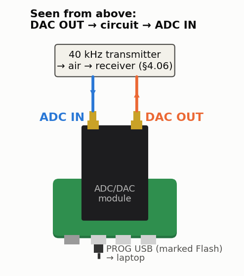

<!-- nav -->
[← 4.05 A quarter-wave stub](4_05_quarter_wave_stub.md#405-a-quarter-wave-stub) &emsp;&emsp;&emsp; **[Contents](../README.md#contents)** &emsp;&emsp;&emsp; [4.07 An optical link →](4_07_optical_link.md#407-an-optical-link)

# 4.06 The speed of sound at 40 kHz




**Where it plugs in.** With the USB connectors toward you, DAC OUT is the
right-hand SMA and ADC IN the left-hand one.

Drive a 40 kHz piezo transmitter (e.g. Murata MA40S4S; up to 20 V<sub>pp</sub>
is allowed, the DAC gives 7.8) directly from the DAC. The matching receiver,
10–50 cm away, goes straight to the ADC: expect tens of millivolts, which the
lock-in reads easily ([2.05](2_05_lockin_peripheral.md#205-a-lock-in-peripheral)). At 20 °C, *c* = 343.4 m/s, so λ = 8.59 mm, and
the phase falls by **41.9° for every millimetre** you move the receiver away.

```bash
python3 lockin.py -f 40000       # slide the receiver along a ruler, 1 mm at a time
```

Unwrap the phase against distance and fit: the slope gives *c* to a few
tenths of a percent. A reflection off the bench adds a ripple to phase against
distance, so raise the pair off the table. Then warm the air with a hair dryer. Since
*c* ≈ 331.3 + 0.606 *T*(°C) m/s, that is 0.18% per kelvin. A sweep from 36 to
44 kHz shows the transducers' own resonance (Q ≈ 20–30).

<!-- nav -->
[← 4.05 A quarter-wave stub](4_05_quarter_wave_stub.md#405-a-quarter-wave-stub) &emsp;&emsp;&emsp; **[Contents](../README.md#contents)** &emsp;&emsp;&emsp; [4.07 An optical link →](4_07_optical_link.md#407-an-optical-link)

<!-- author -->
<sub>Jason Gallicchio, jason@hmc.edu, Harvey Mudd College</sub>
