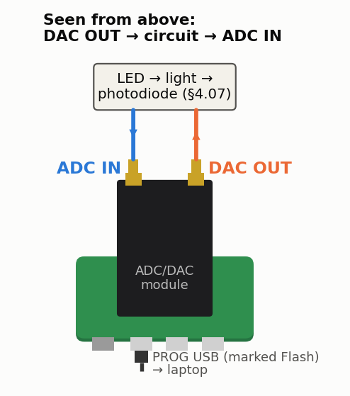

<!-- nav -->
[← 4.06 The speed of sound at 40 kHz](4_06_speed_of_sound.md#406-the-speed-of-sound-at-40-khz) &emsp;&emsp;&emsp; **[Contents](../README.md#contents)** &emsp;&emsp;&emsp; [4.08 Feedback control of an RC plant →](4_08_feedback_control.md#408-feedback-control-of-an-rc-plant)

# 4.07 An optical link

**Where it plugs in.** With the USB connectors toward you, DAC OUT is the
right-hand SMA and ADC IN the left-hand one.

A photodiode is a current source, and every photodiode amplifier ever designed
is a fight between RL and C: more ohms, more volts per photon, less
bandwidth. Here is the fight, with a 9 V battery.

The DAC drives a red LED through 100 Ω (plus its own 50 Ω): 13 mA at the peak.
The LED lights on the positive half of each cycle, which still puts plenty of
signal at the fundamental. The 1N4148 limits the LED's reverse voltage. A
BPW34 [photodiode](https://en.wikipedia.org/wiki/Photodiode), reverse-biased by a 9 V battery, turns the light into
current, and RL into a voltage: tens to hundreds of mV at a few cm.

- **Bandwidth.** The photodiode's capacitance (~15–25 pF at 9 V) plus the
  cable and ADC (~30 pF) against RL: with 10 kΩ the corner is about
  **350 kHz**; with 1 kΩ about **3.5 MHz**, for 10× less signal. Sweep both and
  see the gain–bandwidth trade that every photodiode amplifier design is about.
- **Lock-in detection in room light.** Capture with `capture.py`. The room
  lights add a large flicker at 100 or 120 Hz, twice the mains frequency, and
  the LED's signal is hard to see.
  The lock-in at 100 kHz ignores the flicker completely. Add 10 kΩ in series
  with the LED to cut its light about 70×, and the lock-in still finds it.

<!-- nav -->
[← 4.06 The speed of sound at 40 kHz](4_06_speed_of_sound.md#406-the-speed-of-sound-at-40-khz) &emsp;&emsp;&emsp; **[Contents](../README.md#contents)** &emsp;&emsp;&emsp; [4.08 Feedback control of an RC plant →](4_08_feedback_control.md#408-feedback-control-of-an-rc-plant)

<!-- author -->
Jason Gallicchio, jason@hmc.edu, Harvey Mudd College
