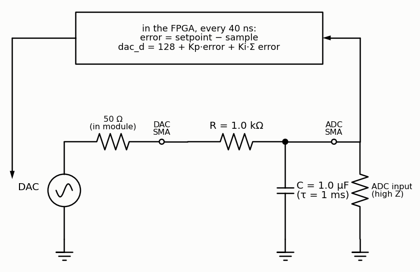
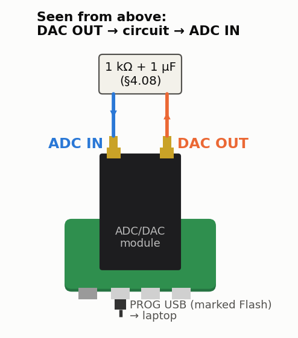
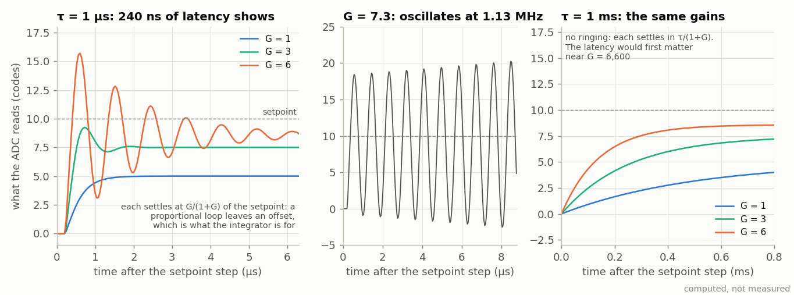

<!-- nav -->
[← 4.07 An optical link](4_07_optical_link.md#407-an-optical-link) &emsp;&emsp;&emsp; **[Contents](../README.md#contents)** &emsp;&emsp;&emsp; [4.09 Your crystal against a reference →](4_09_your_crystal.md#409-your-crystal-against-a-reference)

# 4.08 Feedback control of an RC plant

**Where it plugs in.** With the USB connectors toward you, DAC OUT is the
right-hand SMA and ADC IN the left-hand one.

Every thermostat, cruise control and laser lock is this experiment with a
different plant. Use the RC low-pass of [4.02](4_02_rc_and_lc_circuits.md#402-rc-and-lc-circuits) with R = 1 kΩ and C = **1 µF** (τ = 1 ms) as the
"plant". The goal: hold the capacitor at a setpoint voltage by adjusting the
DAC, with the controller in the FPGA. A [PI controller](https://en.wikipedia.org/wiki/PID_controller) is a few lines of
SystemVerilog: `error = setpoint - sample`, `integral += error`,
`dac_d <= 128 + Kp*error + Ki*integral`. Step the setpoint and capture the
response with `loopback.sv`'s recording logic. Then do the arithmetic [1.07](1_07_closing_the_loop.md#107-closing-the-loop-the-dac-talks-to-the-adc)
set up: the loop has 6 samples (240 ns) of latency, negligible against a 1 ms
plant. So change C to 1 nF (τ = 1 µs), push the gains up, and find where the
latency makes the loop ring and then oscillate. (The oscillator of [1.07](1_07_closing_the_loop.md#107-closing-the-loop-the-dac-talks-to-the-adc)'s
Try-this is the extreme case: all gain and no plant.)

Here are the numbers to expect. Call the loop gain G = *K*p × 0.776,
in ADC codes per ADC code ([1.07](1_07_closing_the_loop.md#107-closing-the-loop-the-dac-talks-to-the-adc) measured
0.776 ADC codes per DAC code). A proportional loop settles in τ/(1 + G), so
its bandwidth is near G/τ, and that is where the latency bites: 240 ns costs
90° of phase at 1.04 MHz. With τ = 1 µs (25 samples) a step overshoots from
about G = 3 (*K*p = 4), rings hard by G = 6, and from G ≈ 7
(*K*p ≈ 9) the loop oscillates near 1.1 MHz, where the plant's own lag
and the latency's add up to 180°. With τ = 1 ms the same point is at
G ≈ 6,500: that's what "negligible" means. Keep *K*i tiny, since the
integrator adds every 40 ns: 2−12 per sample is a sensible start.

The figure is a computation (`dev/tools/fig_control.py`), with [1.07](1_07_closing_the_loop.md#107-closing-the-loop-the-dac-talks-to-the-adc)'s
timing: the DAC's new code reaches the RC about 55 ns after the FPGA's
register changes, the ADC samples the capacitor 20 ns later, and the FPGA
reads that sample 240 ns after the register changed. It leaves out the DAC's
8-bit steps and its rails, so the real loop will differ a little, and how
much is the experiment.

<!-- nav -->
[← 4.07 An optical link](4_07_optical_link.md#407-an-optical-link) &emsp;&emsp;&emsp; **[Contents](../README.md#contents)** &emsp;&emsp;&emsp; [4.09 Your crystal against a reference →](4_09_your_crystal.md#409-your-crystal-against-a-reference)

<!-- author -->
Jason Gallicchio, jason@hmc.edu, Harvey Mudd College
