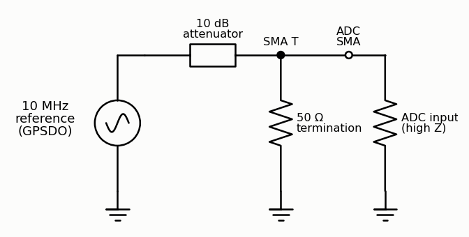
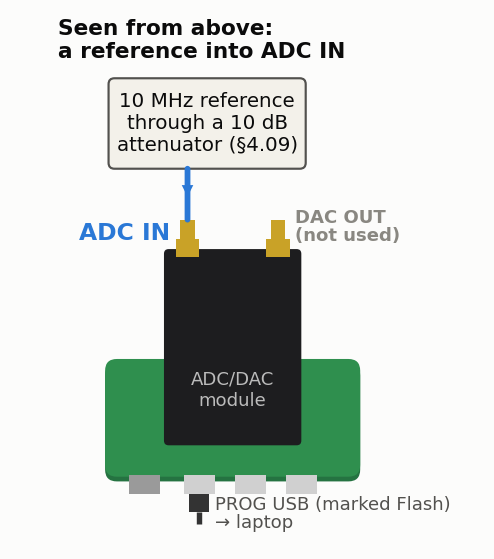

<!-- nav -->
[← 4.08 Feedback control of an RC plant](4_08_feedback_control.md#408-feedback-control-of-an-rc-plant) &emsp;&emsp;&emsp; **[Contents](../README.md#contents)** &emsp;&emsp;&emsp; [4.10 More ideas for one board →](4_10_more_ideas.md#410-more-ideas-for-one-board)

# 4.09 Your crystal against a reference

**Where it plugs in.** With the USB connectors toward you, ADC IN is the
left-hand SMA. DAC OUT, on the right, isn't used. (The first method below
needs nothing plugged in at all.)

Each board's crystal is different, and you can measure yours with no
reference at all:

1. The FPGA sends one byte over the serial port every 222 clock
   cycles.
2. The laptop time-stamps the arrivals with its own clock, which the internet
   keeps right ([NTP](https://en.wikipedia.org/wiki/Network_Time_Protocol)).
3. A straight-line fit gives the crystal's frequency. USB delivers each byte
   up to about a millisecond late, but over 12 minutes that averages out.

([`dev/tools/boardtest/`](../dev/tools/boardtest/) has the design, `tick.v`,
and the laptop's side, `measure_osc.py`.) Four more Icepi Zeros, measured this
way:

| board | frequency | error |
| --- | ---: | ---: |
| second | 49,999,835.0 Hz | 3.30 ppm slow |
| third | 49,999,914.8 Hz | 1.70 ppm slow |
| fourth | 49,999,895.0 Hz | 2.10 ppm slow |
| fifth | 49,999,900.0 Hz | 2.00 ppm slow |

Each is good to ±0.02 ppm, plus whatever error the laptop's clock has, which
can be up to about a ppm over a few minutes ([5.01](5_01_two_clocks.md#501-two-clocks)).
Measure twice, though: one board read 3.30 ppm slow in the afternoon and
0.06 ppm *fast* that evening, with its module fitted and warm
([5.02](5_02_warming_a_crystal.md#502-warming-a-crystal)).

With a real reference you can do a thousand times better. A
[GPS-disciplined](https://en.wikipedia.org/wiki/GPS_disciplined_oscillator) 10 MHz reference goes into the ADC through a 10 dB attenuator and a 50 Ω
termination, the circuit at the top. Run `lockin.sv` at 10 MHz; its DAC isn't connected to anything.
X and Y rotate at the difference between the reference and the Icepi Zero's
crystal: a few ppm, i.e. tens of Hz, too fast for a 42 ms average. So first
tune the lock-in to the reference, starting from the offset you just
measured. The board of [1.03](1_03_dac_sine.md#103-a-sine-direct-digital-synthesis) ran 2.8 ppm *slow*
against the ADALM2000, so for it you would ask for 10 MHz × (1 + 2.8 × 10−6) to get close to a
true 10 MHz, and refine until the [phasor](https://en.wikipedia.org/wiki/Phasor) turns slowly. The residual rotation, followed for
minutes, gives the crystal's offset to parts per *billion*. Put a finger on
the Icepi Zero's oscillator and watch its temperature coefficient happen.

<!-- nav -->
[← 4.08 Feedback control of an RC plant](4_08_feedback_control.md#408-feedback-control-of-an-rc-plant) &emsp;&emsp;&emsp; **[Contents](../README.md#contents)** &emsp;&emsp;&emsp; [4.10 More ideas for one board →](4_10_more_ideas.md#410-more-ideas-for-one-board)

<!-- author -->
Jason Gallicchio, jason@hmc.edu, Harvey Mudd College
