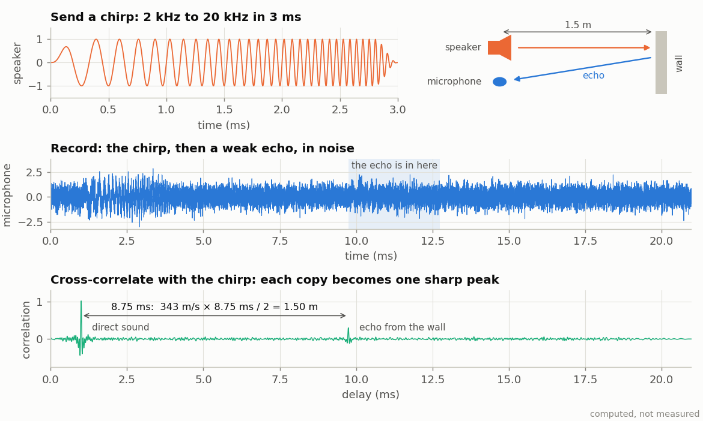

<!-- nav -->
[← 4.09 Your crystal against a reference](4_09_your_crystal.md#409-your-crystal-against-a-reference) &emsp;&emsp;&emsp; **[Contents](../README.md#contents)** &emsp;&emsp;&emsp; [5.00 Two boards on one laptop →](5_00_two_boards.md#500-two-boards-on-one-laptop)

# 4.10 More ideas for one board

None of these has been tried yet. Each starts from something you've already
built, and each is a good size for a final project.

| idea | what you'd learn | start from |
| --- | --- | --- |
| **Single sideband, and FT8** | how voice and data really travel on shortwave: [1.10](1_10_am_radio.md#110-an-am-radio)'s receiver hears AM; replace its [envelope detector](https://en.wikipedia.org/wiki/Envelope_detector) with a *product detector* (keep I, drop Q) and it hears single-sideband voice. Then feed the audio to the WSJT-X program and decode [FT8](https://en.wikipedia.org/wiki/FT8) signals from radio amateurs worldwide at 7.074 MHz | [1.10](1_10_am_radio.md#110-an-am-radio), with [1.06](1_06_fast_capture.md#106-fast-captures)'s antenna and amplifier |
| **A [chirp](https://en.wikipedia.org/wiki/Chirp) sonar, the way bats do it** | *[pulse compression](https://en.wikipedia.org/wiki/Pulse_compression)*: send a short sweep (a *chirp*) from a speaker, or [4.06](4_06_speed_of_sound.md#406-the-speed-of-sound-at-40-khz)'s 40 kHz transducer, record the echo, and cross-correlate it with the sweep. The echo collapses into one sharp peak at its delay, and a wall's distance is the speed of sound × delay / 2. A sweep of bandwidth *B* resolves *c*/2*B*: 2 to 20 kHz resolves 1 cm. Bats sweep tens of kilohertz in a few milliseconds | [5.03](5_03_time_transfer.md#503-what-time-is-it-over-there)'s `awgcap.sv`, played slower (one sample every 64 clocks: a 21 ms loop), and `twoway.delay()`; a speaker and a microphone module |
| **The ADC's linearity, from a histogram** | how ADCs are actually tested: feed a slow, exact triangle (from the DAC, or better a function generator), count how often each code appears, and every code's width falls out. Wide and narrow codes are the *[differential nonlinearity](https://en.wikipedia.org/wiki/Differential_nonlinearity)* that [2.05](2_05_lockin_peripheral.md#205-a-lock-in-peripheral) ran into | [1.06](1_06_fast_capture.md#106-fast-captures), [1.04](1_04_adc_on_the_leds.md#104-the-adc-on-the-leds)'s slow ramp |
| **[Dither](https://en.wikipedia.org/wiki/Dither)** | why adding a little noise can (perhaps shockingly) *improve* a measurement: average many captures of a signal smaller than one code, with and without added noise from the DAC | [1.06](1_06_fast_capture.md#106-fast-captures), [2.05](2_05_lockin_peripheral.md#205-a-lock-in-peripheral) |
| **A digital filter, in real time** | FIR filters as hardware: ADC → a 16-tap FIR (multipliers and adders, as in [1.08](1_08_lockin.md#108-a-lock-in-amplifier)) → DAC. A function generator in, a scope on the output; step the input frequency and watch the filter's response | [1.04](1_04_adc_on_the_leds.md#104-the-adc-on-the-leds), [1.08](1_08_lockin.md#108-a-lock-in-amplifier) |
| **Time-domain reflectometry** | reflections on a [transmission line](https://en.wikipedia.org/wiki/Transmission_line), in time instead of frequency: a fast DAC step into a T with a long cable on its other arm, recorded with [1.07](1_07_closing_the_loop.md#107-closing-the-loop-the-dac-talks-to-the-adc)'s 20 ns equivalent-time trick. Short, open and 50 Ω ends look completely different | [1.07](1_07_closing_the_loop.md#107-closing-the-loop-the-dac-talks-to-the-adc), [4.05](4_05_quarter_wave_stub.md#405-a-quarter-wave-stub) |
| **Phase noise** | how good a clock is over microseconds rather than seconds: the scatter of the lock-in's phase, through a cable, at 1, 10 and 20 MHz. Does it grow with frequency, as clock jitter would? | [1.08](1_08_lockin.md#108-a-lock-in-amplifier), [4.01](4_01_a_faster_dac.md#401-a-faster-dac-plls) |
| **[Planck's constant](https://en.wikipedia.org/wiki/Planck_constant) from LEDs** | a classic: an LED of each colour in series with 1 kΩ on DAC OUT, ADC IN across the LED. A slow DAC ramp traces each LED's current against voltage; its turn-on voltage *V* is about *hc*/(*e*λ), so red, green and blue give *h* | [1.04](1_04_adc_on_the_leds.md#104-the-adc-on-the-leds)'s slow ramp, [1.05](1_05_adc_to_python.md#105-adc-samples-to-python) to record |
| **The speed of light, from a phase** | an LED driven at 10 MHz, a retroreflector across the room, and a [photodiode](https://en.wikipedia.org/wiki/Photodiode): moving the reflector 1.5 m adds 3 m of path, 36° of phase at 10 MHz, which the lock-in measures to a fraction of a degree | [4.07](4_07_optical_link.md#407-an-optical-link)'s LED and photodiode, [1.08](1_08_lockin.md#108-a-lock-in-amplifier) |
| **A fidget-spinner tachometer** | a lamp, the spinner, and a photodiode into ADC IN: the FFT of the flicker gives the rotation rate, and its harmonics show how lopsided the spinner is | [1.09](1_09_spectrum_analyzer.md#109-a-spectrum-analyzer) |
| **A quartz-crystal microbalance** | weighing a fingerprint: the series resonance of [4.03](4_03_quartz_crystal.md#403-the-q-of-a-quartz-crystal)'s crystal falls when mass sticks to it ([Sauerbrey](https://en.wikipedia.org/wiki/Quartz_crystal_microbalance)). Open the can of an old crystal, track the resonance with the lock-in, and watch a drop of water evaporate | [4.03](4_03_quartz_crystal.md#403-the-q-of-a-quartz-crystal), [5.04](5_04_coupled_oscillators.md#504-oscillators-that-listen-to-each-other)'s hardware PLL to track it |

## Digital communications

Eye diagrams, pulse shaping, PSK with clock and carrier recovery, spread
spectrum, and more ideas for modems and radar, now have a chapter of their
own: [6.00](6_00_digital_communications.md#600-digital-communications-hardware-defined-radio).

<!-- nav -->
[← 4.09 Your crystal against a reference](4_09_your_crystal.md#409-your-crystal-against-a-reference) &emsp;&emsp;&emsp; **[Contents](../README.md#contents)** &emsp;&emsp;&emsp; [5.00 Two boards on one laptop →](5_00_two_boards.md#500-two-boards-on-one-laptop)

<!-- author -->
Jason Gallicchio, jason@hmc.edu, Harvey Mudd College
