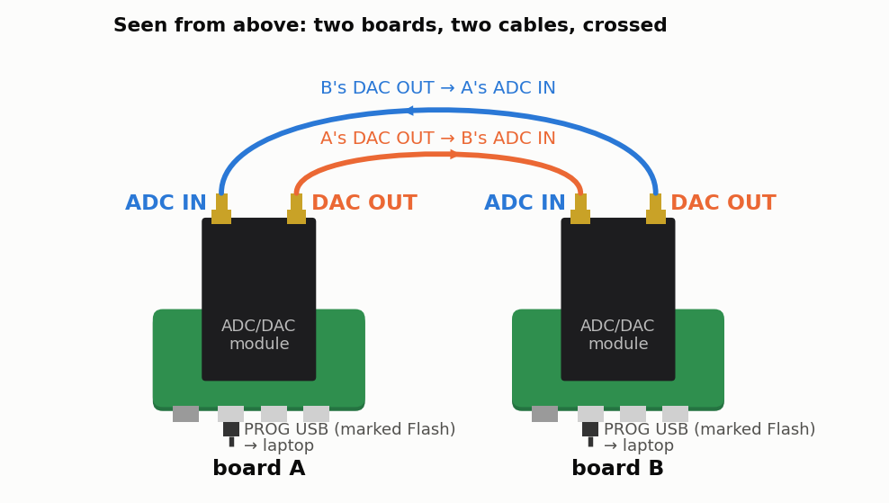

<!-- nav -->
[← 4.10 More ideas for one board](4_10_more_ideas.md#410-more-ideas-for-one-board) &emsp;&emsp;&emsp; **[Contents](../README.md#contents)** &emsp;&emsp;&emsp; [5.01 Two clocks →](5_01_two_clocks.md#501-two-clocks)

# 5.00 Two boards on one laptop



**What you need first:** Chapter 1 through [1.08](1_08_lockin.md#108-a-lock-in-amplifier), and a second board for most of it (the TIP
below says what one board can do). Only the network part of [5.05](5_05_fsk_modem.md#505-a-modem) needs Chapter 3.

Everything so far used one board, and so one clock. Connect two boards, the DAC
of each to the ADC of the other, and something new appears: two clocks that
don't quite agree. Most of this chapter is about that. It covers how to compare two
clocks to parts per billion, how to agree on what time it is when every message
takes time to arrive, how two oscillators that can hear each other fall into
step, and how much information a 16 cm cable can carry.

| | |
| --- | --- |
| board A | Icepi Zero + adapter + module; its DAC → B's ADC through a 16.5 cm RG-316 cable |
| board B | the same; its DAC → A's ADC through a second 16.5 cm cable |
| (any one board) | looped back, its own DAC → its own ADC |

This chapter builds on Chapter 1 only. It uses a few of its files (`uart.sv`,
`sine.sv`, `loopback.sv`, `lockin.sv`, `pll100.sv` and `icepi_adda.lpf`), and
the new ones are in [`src/twoboard/`](../src/twoboard/), where you work:
`cd src/twoboard`. Everything is plain SystemVerilog plus Python. The FPGAs do
the work that has to be on time, to the nanosecond, and the laptop does the
arithmetic. (Each experiment could later move into a LiteX peripheral or a
Linux driver, as Chapters 2 and 3 did for the single board, but plain
SystemVerilog keeps the physics in view.)

> [!TIP]
> **Only one board?** Most of this chapter still works, with the board's DAC
> cabled to its own ADC: one board is its own partner, with the same clock at
> both ends. Each section says what you can do, and what you'll see. The
> modem ([5.05](5_05_fsk_modem.md#505-a-modem)) and its noise test ([5.06](5_06_modem_and_noise.md#506-the-modem-against-noise)) work fully on one board, and so does
> all of Chapter 6.

## Telling the boards apart

With several boards plugged in, `/dev/ttyUSB0` and friends stop being useful.
The numbers are handed out in the order the boards appear, and every
`openFPGALoader` command makes its board vanish and come back, often under a
new number. Use each board's FT231X serial number instead. (On a Mac, the ports are
already named after it: `/dev/cu.usbserial-DP051TLX`.)

```console
$ openFPGALoader --scan-usb
Bus device vid:pid       probe_type manufacturer serial   product
005 015    0x0403:0x6015 ft231X     FTDI         DP051TLX FT231X USB UART
005 014    0x0403:0x6015 ft231X     FTDI         DP0525BU FT231X USB UART
$ openFPGALoader -b icepi-zero --usb-serial-num DP0525BU ../verilog/lockin.bit
$ ls /dev/serial/by-id/
usb-FTDI_FT231X_USB_UART_DP051TLX-if00-port0
usb-FTDI_FT231X_USB_UART_DP0525BU-if00-port0
```

The names in `/dev/serial/by-id/` follow the board wherever its `ttyUSB` number
goes. `src/twoboard/Makefile` takes the serial number as a variable:
`make load-awgcap SERIAL=DP0525BU`. (Below, board A is DP0525BU and board B
is DP051TLX, and `$A` and `$B` are their `/dev/serial/by-id/...` names; put in
your own.)

One more trap. When a board sends you data, Linux keeps about 4 kB of it for
you. If your program is busy reading the *other* board, the rest is lost. Read
each port in its own thread, as `awgcap.record_many()` in [5.03](5_03_time_transfer.md#503-what-time-is-it-over-there) does.

## Checking the links

`loopback.sv` from [1.07](1_07_closing_the_loop.md#107-closing-the-loop-the-dac-talks-to-the-adc) keeps playing its pattern after
each command and records its own ADC. Load it into both boards and send each a
command: each board's record is now the *other* board's pattern, starting at an
arbitrary point, because nothing ties one board's sample 0 to the other's. Line
the staircase up at its one big drop and it measures each direction. With
a third board looped to itself for comparison
([`dev/tools/twoboard/module_test.py`](../dev/tools/twoboard/module_test.py)
did this):

| path | ADC code per DAC code | offset (codes) | worst nonlinearity (codes) | missing ADC codes |
| --- | ---: | ---: | ---: | --- |
| A → B | 0.7815 | 27.03 | 0.51 | none in 29–225 |
| B → A | 0.7818 | 27.21 | 0.50 | none in 29–225 |
| a module looped to itself | 0.7761 | 27.57 | 0.53 | none in 29–224 |

So every data bit of both converters works on both modules, and the two
modules differ in gain by 0.7%. Each module has a potentiometer, left as it
came, and that is a likely cause.

## The experiments

| section | what happens | with one board, looped back |
| --- | --- | --- |
| [5.01 Two clocks](5_01_two_clocks.md#501-two-clocks) | two crystals beat against each other, 0.76 ppm apart, and wander: their [Allan deviation](https://en.wikipedia.org/wiki/Allan_variance) | the measurement's floor: a crystal against itself |
| [5.02 Warming a crystal](5_02_warming_a_crystal.md#502-warming-a-crystal) | one board heats itself with its own logic, and its crystal's frequency follows | against the laptop's clock instead (not tried) |
| [5.03 What time is it over there?](5_03_time_transfer.md#503-what-time-is-it-over-there) | two-way [time transfer](https://en.wikipedia.org/wiki/Time_transfer): the boards' clock offset, to a fraction of a nanosecond, and [Einstein's convention](https://en.wikipedia.org/wiki/Einstein_synchronisation) | the delay of its own loop |
| [5.04 Oscillators that listen to each other](5_04_coupled_oscillators.md#504-oscillators-that-listen-to-each-other) | coupled oscillators lock, as [Adler's equation](https://en.wikipedia.org/wiki/Injection_locking) says; then a [phase-locked loop](https://en.wikipedia.org/wiki/Phase-locked_loop) in hardware | the hardware loop |
| [5.05 A modem](5_05_fsk_modem.md#505-a-modem) | [frequency-shift keying](https://en.wikipedia.org/wiki/Frequency-shift_keying): typing from one laptop to the other, then two Linux computers on one cable | yes |
| [5.06 The modem against noise](5_06_modem_and_noise.md#506-the-modem-against-noise) | [bit error rate](https://en.wikipedia.org/wiki/Bit_error_rate) against [signal-to-noise ratio](https://en.wikipedia.org/wiki/Signal-to-noise_ratio), measured and predicted | yes: measured that way |
| [5.07 A radio link](5_07_radio_link.md#507-a-radio-link) | a narrowband modem through the air, between two loop antennas | yes, through a cable |
| [5.08 With a little more hardware](5_08_more_hardware.md#508-with-a-little-more-hardware) | more ideas: light, sound, a GPS reference, thermal noise, a network of three | |

Chapter 6 ([6.00](6_00_digital_communications.md#600-digital-communications-hardware-defined-radio)) goes on from the modem to how real digital radios work: PSK with
clock and carrier recovery, spread spectrum, and OFDM ([6.07](6_07_ofdm.md#607-ofdm-the-triumph-of-physics-over-math)), with one board or two.

<!-- nav -->
[← 4.10 More ideas for one board](4_10_more_ideas.md#410-more-ideas-for-one-board) &emsp;&emsp;&emsp; **[Contents](../README.md#contents)** &emsp;&emsp;&emsp; [5.01 Two clocks →](5_01_two_clocks.md#501-two-clocks)

<!-- author -->
<sub>Jason Gallicchio, jason@hmc.edu, Harvey Mudd College</sub>
