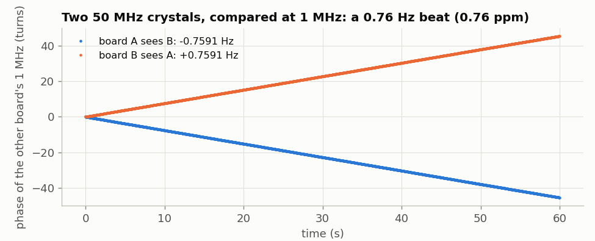
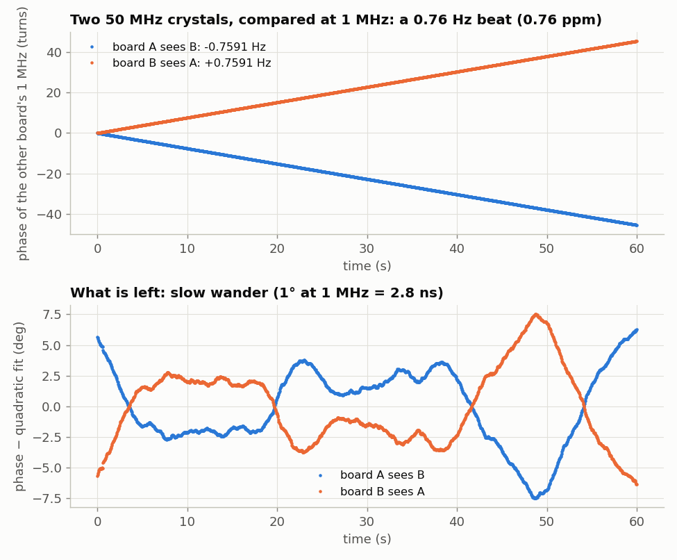
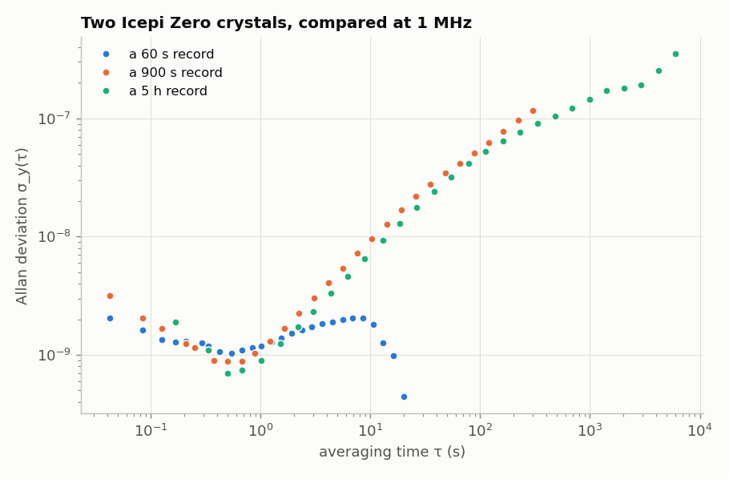
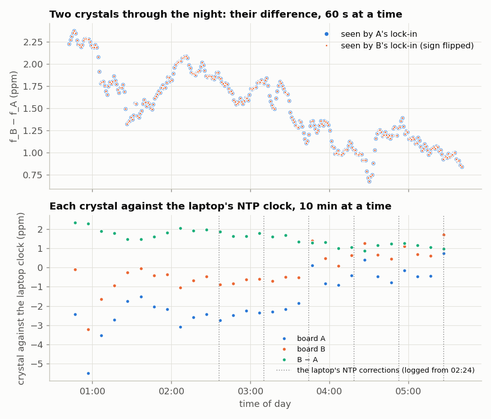

<!-- nav -->
[← 5.00 Two boards on one laptop](5_00_two_boards.md#500-two-boards-on-one-laptop) &emsp;&emsp;&emsp; **[Contents](../README.md#contents)** &emsp;&emsp;&emsp; [5.02 Warming a crystal →](5_02_warming_a_crystal.md#502-warming-a-crystal)

# 5.01 Two clocks



Load [1.08](1_08_lockin.md#108-a-lock-in-amplifier)'s lock-in into both boards and set both to 1 MHz. Each lock-in
multiplies what arrives, the other board's sine, by its own reference and
averages for 42 ms. If the two crystals agreed exactly, X and Y would sit still.
They don't, so the phase turns at the *difference* of the two frequencies.
`lockin_log.py` records both boards at once, and `beat.py` fits the phase:

<details>
<summary>The whole file: <code>lockin_log.py</code></summary>

<!-- file: src/twoboard/lockin_log.py -->
```python
#!/usr/bin/env python3
"""Log lockin.sv results from several boards at once.

    python3 lockin_log.py OUT.npz SECONDS F_HZ PORT_A PORT_B [...]

Sets every board to F_HZ, then records each board's results for SECONDS.  A board
sends one line, "TW X Y", every 2^20 samples: 41.94 ms of ITS OWN clock.  Saved per
board, as board0, board1, ...: rows of (laptop arrival time, X, Y), X and Y in lock-in
units.  So result k was taken at k * 2^20 / 25 MHz of that board's time (as long as
no line is lost), and the laptop times give the same thing against the laptop's clock.
"""
import sys
import threading
import time

import numpy as np
import serial


def tw_of(f, fclk=50e6):
    return int(round(f / fclk * 2**32)) & 0xFFFFFFFF


def s32(v):
    return v - (1 << 32) if v & (1 << 31) else v


def logger(port, tw, secs, out):
    s = serial.Serial(port, 1_000_000, timeout=1)
    time.sleep(0.05)
    s.reset_input_buffer()
    s.write(b"%08x\n" % tw)
    rows = []
    t0 = time.time()
    while time.time() - t0 < secs:
        p = s.readline().split()
        if len(p) != 3:
            continue
        try:
            t, x, y = (int(v, 16) for v in p)
        except ValueError:
            continue
        if t == tw:                          # skip anything from before the change
            rows.append((time.time(), s32(x) / 65536, s32(y) / 65536))
    s.close()
    out[port] = np.array(rows)


if __name__ == "__main__":
    out_path, secs, f = sys.argv[1], float(sys.argv[2]), float(sys.argv[3])
    ports = sys.argv[4:]
    out = {}
    # one thread per board, so that no port's input buffer overflows
    threads = [threading.Thread(target=logger, args=(p, tw_of(f), secs, out)) for p in ports]
    for t in threads:
        t.start()
    for t in threads:
        t.join()
    np.savez(out_path, f=f, tw=tw_of(f), ports=ports,
             **{"board%d" % i: out[p] for i, p in enumerate(ports)})
    for p in ports:
        print(p, len(out[p]), "results")
```

</details>

<details>
<summary>The whole file: <code>beat.py</code></summary>

<!-- file: src/twoboard/beat.py -->
```python
#!/usr/bin/env python3
"""Analyse a lockin_log.py file: the phase of the other board's signal against this
board's own time, its slope (the beat between the two crystals), and what is left.

    python3 beat.py beat.npz
"""
import sys

import numpy as np

z = np.load(sys.argv[1])
f = float(z["f"])
T = 2**20 / 25e6 * int(z["every"]) if "every" in z.files else 2**20 / 25e6
#   one row, in this board's time: every result, or every `every`-th one
for name in [k for k in z.files if k.startswith("board")]:
    d = z[name]
    xy = d[:, 1] + 1j * d[:, 2]
    phase = np.unwrap(np.angle(xy))           # radians, of the other board's sine
    t = np.arange(len(phase)) * T
    slope, _ = np.polyfit(t, phase, 1)
    beat = slope / (2 * np.pi)                # Hz: f_other - f_this, in this board's units
    rest = phase - np.polyval(np.polyfit(t, phase, 1), t)
    volts = abs(xy) * 2 / 127 / 25.35         # 1.08's conversion to volts at the ADC
    print("%s: %d points over %.0f s; beat %+.6f Hz = %+.4f ppm of %.0f Hz; amplitude %.3f V; "
          "phase residual %.2f deg rms" % (name, len(t), t[-1], beat, beat / f * 1e6, f,
                                          volts.mean(), np.degrees(rest.std())))
```

</details>

```bash
make -C ../verilog lockin.bit
openFPGALoader -b icepi-zero --usb-serial-num DP0525BU ../verilog/lockin.bit
openFPGALoader -b icepi-zero --usb-serial-num DP051TLX ../verilog/lockin.bit
python3 lockin_log.py beat.npz 60 1e6 $A $B     # 60 s at 1 MHz
python3 beat.py beat.npz
```

```console
board0: 1431 points over 60 s; beat -0.759075 Hz = -0.7591 ppm of 1000000 Hz; amplitude 3.857 V; ...
board1: 1431 points over 60 s; beat +0.759076 Hz = +0.7591 ppm of 1000000 Hz; amplitude 3.856 V; ...
```



Board A sees B's sine slipping back by 0.759 turns per second, and B sees A's
pulling ahead by the same amount. B's crystal is 0.759 ppm slower than A's. (Both are within 3 ppm of nominal,
[4.09](4_09_your_crystal.md#409-your-crystal-against-a-reference): a quartz watch is allowed
±15 seconds a month, 6 ppm.) Each
board timed its own results by its own clock (result *k* is *k* × 2<sup>20</sup> / 25 MHz),
and still the two numbers agree to six digits, as they must. A 1 MHz comparison
resolves a few parts in 10<sup>10</sup> in a few seconds; at that level what you see
is the crystals, not the instrument. That
is the power of a lock-in: it measures phase, and phase keeps accumulating.

The lower panel is what's left after a smooth fit. It isn't noise in either
measurement, because the two boards' views are exact mirror images. It's the
two crystals wandering against each other, by ±7° at 1 MHz, or ±20 ns over a
minute. That is a frequency instability of about one part in 10<sup>9</sup>, typical of
small crystal oscillators. [5.02](5_02_warming_a_crystal.md#502-warming-a-crystal) shows the biggest reason: temperature.

> [!TIP]
> **One board?** Loop it back and log just the one port
> (`python3 lockin_log.py beat1.npz 30 1e6 $A`). The board then compares its
> crystal with itself, and the result is this measurement's floor: a beat of
> +0.000002 Hz and 0.04° rms of phase wander, measured over 30 s through a 1 m
> cable, against ±7° between two crystals.

**How steady is steady?** The standard measure of a clock's stability is the
*[Allan deviation](https://en.wikipedia.org/wiki/Allan_variance)* σ_y(τ). Average the fractional frequency over a time τ, and
ask how much one such average differs from the next. For these two crystals,
compared over 60 s, over 15 minutes, and through a night of 5 hours
(`dev/tools/twoboard/fig_adev.py`):



From 0.1 s to a few seconds, σ<sub>y</sub> is about 1 × 10<sup>−9</sup>. Averaging longer doesn't
help, because something else takes over. In the 15-minute run the beat moved
between 0.38 and 0.69 Hz as the boards' temperatures changed ([5.02](5_02_warming_a_crystal.md#502-warming-a-crystal)), so by
100 s σ<sub>y</sub> has grown to 5 × 10<sup>−8</sup>. Through the night it keeps growing, more
slowly: 1.5 × 10<sup>−7</sup> at 1000 s, and 3.5 × 10<sup>−7</sup> at 1.7 hours. It never turns down
again. A good oven-controlled oscillator stays near 10<sup>−12</sup> at 100 s, and an
atomic clock lower still.

A laptop's NTP-disciplined clock turns out to be a good ruler over a night
and a poor one over ten minutes, up to a ppm off (Detail below);
[4.09](4_09_your_crystal.md#409-your-crystal-against-a-reference) and
[5.02](5_02_warming_a_crystal.md#502-warming-a-crystal) lean on that.

<details>
<summary><b>Detail:</b> through the night: five hours of two crystals</summary>

Logged for five hours from 00:41
(`python3 lockin_log.py overnight.npz 18000 1e6 $A $B`), the two crystals' difference
wandered between +0.7 and +2.4 ppm:



B was now the faster crystal, as it was in the 15-minute run. A's crystal had
ended lower after it was heated in [5.02](5_02_warming_a_crystal.md#502-warming-a-crystal), and both boards had run [5.05](5_05_fsk_modem.md#505-a-modem)'s
Linux computer for a few minutes just before the log began. Most of the change
is slow, but there are sudden steps of 0.3 to 0.5 ppm, within a minute or two,
as at 01:05, 01:25 and 03:52. A's and B's lock-ins agree on every point, so
the steps are real. What causes them, this log can't say.

</details>

<details>
<summary><b>Detail:</b> the laptop as a clock</summary>

The lower panel of the overnight figure (previous Detail) uses the laptop's
clock instead, as [4.09](4_09_your_crystal.md#409-your-crystal-against-a-reference)
does. Each board sends a result every 2<sup>20</sup> of its own samples, and the laptop
time-stamps them as they arrive. Ten minutes at a time, both boards seem to
move *together*, by up to 3 ppm, so it is the laptop's clock that moves. Ubuntu's
`systemd-timesyncd` asked an [NTP](https://en.wikipedia.org/wiki/Network_Time_Protocol) server across the internet every 34 minutes
(the dotted lines, from a log of the kernel's clock discipline). Each time, it
found the clock up to 1.35 ms off and changed its rate by up to 0.33 ppm, and
between polls the kernel slewed the offset away at up to 0.85 ppm. The
difference B − A cancels all of that. Over the five hours it averaged
+1.527 ppm, against the beat's +1.502 ppm. So a laptop's clock is a good ruler
over a night, and a poor one over ten minutes.

</details>

<details>
<summary><b>Detail:</b> a second opinion, from the laptop's clock</summary>

The NTP method of [4.09](4_09_your_crystal.md#409-your-crystal-against-a-reference), run on both boards at once,
measured A at +0.06 ppm and B at −0.65 ppm, ten minutes later. Their difference,
−0.71 ppm, is free of the laptop clock's own error, and it agrees with the beat's
−0.76 ppm to within how much these crystals drift in ten minutes. (Earlier the
same day, the same two crystals had measured −3.30 ppm, before that board had
its module, and −1.70 ppm. A crystal's offset isn't a constant.)

</details>

**Try this:**

- Put a finger on one board's oscillator and watch the beat change within
  seconds. It is Y1, a 2.5 × 2.0 mm package just off the FPGA's upper-left
  corner (USB connectors pointing down). Which way does the beat go?
- Put a thermometer beside the boards and log the beat overnight again. Do
  the steps line up with the room's temperature, or with the building's
  heating switching on and off?
- Run the comparison at 10 MHz instead of 1 MHz. The beat is ten times faster
  (7.6 Hz). The lock-in delivers 23.8 results a second; at what beat does that
  stop working, and why?

<!-- nav -->
[← 5.00 Two boards on one laptop](5_00_two_boards.md#500-two-boards-on-one-laptop) &emsp;&emsp;&emsp; **[Contents](../README.md#contents)** &emsp;&emsp;&emsp; [5.02 Warming a crystal →](5_02_warming_a_crystal.md#502-warming-a-crystal)

<!-- author -->
<sub>Jason Gallicchio, jason@hmc.edu, Harvey Mudd College</sub>
