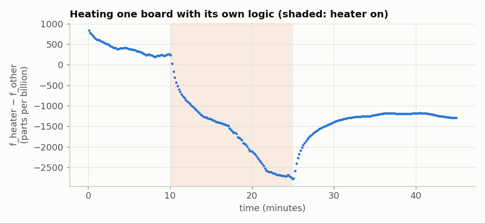
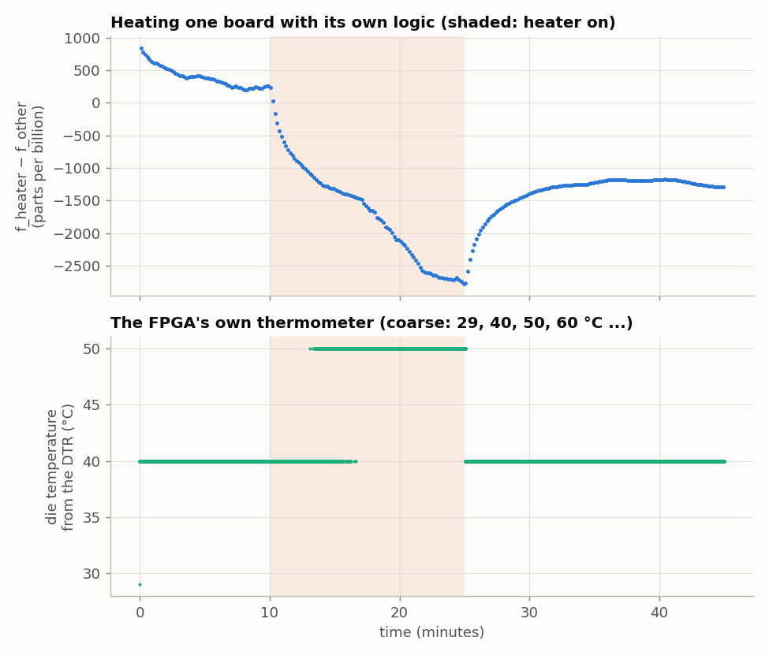

<!-- nav -->
[← 5.01 Two clocks](5_01_two_clocks.md#501-two-clocks) &emsp;&emsp;&emsp; **[Contents](../README.md#contents)** &emsp;&emsp;&emsp; [5.03 What time is it over there? →](5_03_time_transfer.md#503-what-time-is-it-over-there)

# 5.02 Warming a crystal



Why do the crystals wander, and why did they read so differently earlier in the
day? The usual suspect is temperature: a [quartz crystal](https://en.wikipedia.org/wiki/Crystal_oscillator)'s frequency changes by a
fraction of a ppm per degree. To test it, heat one board, using nothing but its
own logic.

It's an old problem. In the 1700s, finding a ship's longitude meant knowing
the time back home to a few seconds after weeks at sea, and a clock's rate
changed with the weather. John Harrison's marine chronometer H4 (1761)
solved it, in part with a bimetallic strip that corrected its balance spring
for temperature ([Harrison](https://en.wikipedia.org/wiki/John_Harrison)). Quartz has the same
problem, solved the same two ways: a wristwatch's 32,768 Hz crystal is cut so
that its frequency is flattest near the temperature of a wrist, and a
laboratory reference keeps its crystal in a small oven, held at one
temperature
([OCXO](https://en.wikipedia.org/wiki/Crystal_oven)).

> [!TIP]
> **One board?** The heater works on any board, but you need something to
> compare its crystal with. Without a second board, use the laptop's clock, as
> [4.09](4_09_your_crystal.md#409-your-crystal-against-a-reference) does with
> `tick.v`: `warmup.sv` already sends a line every 2<sup>23</sup> of its own
> clocks (0.168 s), so time-stamp those arrivals and fit ten minutes at a time.
> That is good to about a ppm, enough to see the 3 ppm drop below. (Not tried.)

`warmup.sv` keeps playing a 1 MHz sine for the other board's lock-in to follow,
and adds two things:

- **A heater.** 8192 flip-flops, clocked at 100 MHz by the PLL of [4.01](4_01_a_faster_dac.md#401-a-faster-dac-plls),
  each scrambling its neighbours. Every flip-flop that toggles charges and
  discharges a little capacitance, and that energy ends up as heat. Send "H"
  to switch it on and "C" to switch it off.
- **A thermometer.** The ECP5 has one built in, the *DTR* (digital temperature
  readout). A pulse on `STARTPULSE` starts a reading, and `DTROUT` returns a
  6-bit code. Lattice's table (FPGA-TN-02210) gives 1 °C steps only from 21 to
  29 °C and from 80 to 89 °C. In between it jumps: code 29 is 29 °C, 30 is 40,
  31 is 50, 32 is 60. So it's coarse, but it's on the die. For safety, the
  heater switches itself off at code 33 (70 °C).

<details>
<summary>The whole file: <code>warmup.sv</code></summary>

<!-- file: src/twoboard/warmup.sv -->
```systemverilog
// warmup.sv -- heat the FPGA with its own logic and watch the crystal move.
//
// The DAC plays a 1 MHz sine (sine.sv, from ../verilog), so another board's lock-in
// can follow this board's crystal.  A "heater" -- W flip-flops scrambling each other
// at 100 MHz -- burns power on command, and the ECP5's on-chip thermometer (the DTR
// primitive) reports the die temperature code.
//
// Serial port, 1,000,000 baud:  "H" heater on, "C" heater off.
// Every 2^23 clocks (0.168 s) the board sends "TT h\n": the DTR code in hex (bit 7 =
// valid, bits 5:0 = Lattice's temperature code) and the heater state.
// For safety the heater switches itself off if the code reaches 33 (70 C).
module warmup #(parameter W = 8192) (
    input  logic       clk,
    output logic [7:0] dac_d,
    output logic       dac_clk,
    input  logic       uart_rx,
    output logic       uart_tx,
    output logic [4:0] led
);
    sine #(.TW(32'd85899346)) u_sine (.clk(clk), .dac_d(dac_d), .dac_clk(dac_clk));   // 1 MHz

    // ---- 100 MHz for the heater -----------------------------------------------
    logic clk100, locked;
    pll100 u_pll (.clk(clk), .clk100(clk100), .locked(locked));

    // ---- the heater: a wide register that keeps scrambling itself ------------
    logic heat = 0;
    logic heat100a = 0, heat100 = 0;
    always_ff @(posedge clk100) begin heat100a <= heat; heat100 <= heat100a; end
    (* keep *) logic [W-1:0] h = 1;
    always_ff @(posedge clk100)
        // ######################################################################
        // ##  KEY LINE: the heater.  8192 flip-flops, most of them toggling
        // ##  100 million times a second.  Each toggle costs a little energy.
        // ######################################################################
        if (heat100) h <= {h[W-2:0], h[W-1]} ^ {h[W-3:0], h[W-1:W-2]} ^ ~(h >> 5);
    // reduce it to one bit so the tools cannot throw it away
    logic [63:0] fold = 0;
    logic sink = 0;
    always_ff @(posedge clk100) begin
        for (int k = 0; k < 64; k++) fold[k] <= ^h[k*(W/64) +: (W/64)];
        sink <= ^fold;
    end

    // ---- the thermometer ------------------------------------------------------
    logic [22:0] div = 0;
    always_ff @(posedge clk) div <= div + 1;
    logic [7:0] dtrout;
    DTR #(.DTR_TEMP(25)) u_dtr (.STARTPULSE(div[22:4] == 0), .DTROUT7(dtrout[7]), .DTROUT6(dtrout[6]),
        .DTROUT5(dtrout[5]), .DTROUT4(dtrout[4]), .DTROUT3(dtrout[3]), .DTROUT2(dtrout[2]),
        .DTROUT1(dtrout[1]), .DTROUT0(dtrout[0]));
    logic [7:0] code = 0;
    always_ff @(posedge clk) if (dtrout[7]) code <= dtrout;

    // ---- serial port ----------------------------------------------------------
    logic [7:0] rx;
    logic rxv, busy;
    uart_rx #(.CLKS_PER_BIT(50)) u_rx (.clk(clk), .rx(uart_rx), .data(rx), .valid(rxv));
    logic [2:0] idx = 7;
    logic st = 0;
    logic [7:0] d = 0;
    uart_tx #(.CLKS_PER_BIT(50)) u_tx (.clk(clk), .data(d), .start(st), .busy(busy), .tx(uart_tx));
    function automatic logic [7:0] hex(input logic [3:0] n); hex = n < 10 ? "0" + n : "A" + n - 10; endfunction
    always_ff @(posedge clk) begin
        if (rxv && rx == "H") heat <= 1;
        if ((rxv && rx == "C") || (code[7] && code[5:0] >= 6'd33)) heat <= 0;
        st <= 0;
        if (div == 23'h400000) idx <= 0;
        else if (idx < 5 && !busy && !st) begin
            d <= idx == 0 ? hex(code[7:4]) : idx == 1 ? hex(code[3:0]) : idx == 2 ? " " :
                 idx == 3 ? (heat ? "1" : "0") : "\n";
            st <= 1; idx <= idx + 1;
        end
    end
    assign led = {heat, sink, code[2:0]};
endmodule
```

</details>

<details>
<summary>The whole file: <code>warmup_run.py</code></summary>

<!-- file: src/twoboard/warmup_run.py -->
```python
#!/usr/bin/env python3
"""Warm one board with its own logic while another board's lock-in follows its crystal.

    python3 warmup_run.py HEATER_PORT LOCKIN_PORT --on 600 --off 1500 --end 2700 -o warm.npz

HEATER board: warmup.bit (1 MHz sine, heater, thermometer).  LOCKIN board: lockin.bit,
set to 1 MHz.  The lock-in's phase drifts at f_heater - f_lockin, so its slope is the
heater board's crystal frequency relative to the lock-in board's.
"""
import argparse
import threading
import time

import numpy as np
import serial


def s32(v):
    return v - (1 << 32) if v & (1 << 31) else v


ap = argparse.ArgumentParser()
ap.add_argument("heater")
ap.add_argument("lockin")
ap.add_argument("--on", type=float, default=600, help="heater on at this time (s)")
ap.add_argument("--off", type=float, default=1500, help="heater off at this time (s)")
ap.add_argument("--end", type=float, default=2700, help="stop recording (s)")
ap.add_argument("-o", "--out", default="warm.npz")
a = ap.parse_args()

TW = int(round(1e6 / 50e6 * 2**32))                 # 1 MHz
li = serial.Serial(a.lockin, 1_000_000, timeout=1)
hs = serial.Serial(a.heater, 1_000_000, timeout=1)
time.sleep(0.05)
li.reset_input_buffer()
hs.reset_input_buffer()
li.write(b"%08x\n" % TW)
hs.write(b"C")                                      # start with the heater off

L, H = [], []                                       # lock-in results; heater reports
t0 = time.time()
stop = False


def read_lockin():
    while not stop:
        p = li.readline().split()
        if len(p) != 3:
            continue
        try:
            t, x, y = (int(v, 16) for v in p)
        except ValueError:
            continue
        if t == TW:
            L.append((time.time() - t0, s32(x) / 65536, s32(y) / 65536))


def read_heater():
    while not stop:
        p = hs.readline().split()               # "TT h": DTR code (hex), heater on/off
        if len(p) != 2:
            continue
        try:
            H.append((time.time() - t0, int(p[0], 16), int(p[1])))
        except ValueError:
            pass


threads = [threading.Thread(target=read_lockin), threading.Thread(target=read_heater)]
for t in threads:
    t.start()
state = "cold"
while time.time() - t0 < a.end:
    t = time.time() - t0
    if state == "cold" and t > a.on:
        hs.write(b"H")
        state = "hot"
        print("%.0f s heater on" % t, flush=True)
    if state == "hot" and t > a.off:
        hs.write(b"C")
        state = "cooling"
        print("%.0f s heater off" % t, flush=True)
    time.sleep(0.5)
    if int(t) % 60 == 0 and L and H:                # a progress line once a minute
        print("%5.0f s  %d lock-in points, DTR code %d (%s)" %
              (t, len(L), H[-1][1] & 63, "on" if H[-1][2] else "off"), flush=True)
        time.sleep(0.6)
stop = True
for t in threads:
    t.join()
hs.write(b"C")
np.savez(a.out, lockin=np.array(L), heater=np.array(H), on=a.on, off=a.off)
```

</details>

```bash
make warmup.bit
openFPGALoader -b icepi-zero --usb-serial-num DP0525BU warmup.bit
openFPGALoader -b icepi-zero --usb-serial-num DP051TLX ../verilog/lockin.bit
python3 warmup_run.py $A $B --on 600 --off 1500 --end 2700 -o warm.npz
```



The upper panel is A's crystal relative to B's, from B's lock-in, in 10 s
pieces:

- **When the heater comes on (minute 10), A's frequency drops at once.** It
  falls by 0.8 ppm (800 parts per billion) in the first minute, and keeps
  falling for the whole 15 minutes, by 3.0 ppm in all. The die thermometer
  moves from its 40 °C step to its 50 °C step after about 3 minutes.
- **When it goes off (minute 25), the frequency comes back quickly** at first,
  1.0 ppm in two minutes, and then slowly.
- **There are two speeds.** The oscillator sits right beside the FPGA, and
  follows its die within a minute. The whole board, and the oscillator's own
  package, take ten minutes or more.
- **Even the "cold" start drifts down by 0.6 ppm.** The heater's 100 MHz clock
  reaches all 8192 flip-flops even when they hold still, and loading the design
  alone warms the board.

<details>
<summary><b>Detail:</b> which crystal moved?</summary>

The frequency did not return to where it started, but settled 1.4 ppm lower.
Which crystal moved? The laptop's clock can referee, roughly. B's lock-in sends a
result every 2<sup>20</sup> of B's own samples, so the times they arrive at the laptop
(`warmup_run.py` saves them) measure B's crystal against the laptop's clock. [NTP](https://en.wikipedia.org/wiki/Network_Time_Protocol)
keeps that clock right only to about a ppm over ten minutes ([5.01](5_01_two_clocks.md#501-two-clocks)), but that
is enough here. Against it, B stayed within 0.3 ppm of where it started,
while A fell by 2.6 ppm and came back by only 0.8. So it was A that moved. Whether A's lasting offset is the
crystal's own hysteresis or its board still cooling, one run can't tell.

</details>

So a degree or two of warming, from a hand, a draught, or the module's own
power, moves these crystals by about a ppm. That is the likely reason the
boards measured −3.30 and −1.70 ppm in the afternoon and +0.06 and −0.65 ppm
in the evening, with their modules fitted and running. Laboratory oscillators fix this by keeping the
crystal at a constant temperature in an *oven* (an OCXO), or by measuring its
temperature and correcting for it (a TCXO).

**Try this:**

- Fit the warming curve with two exponentials. What are the two time
  constants, and what are the two parts of the board they belong to?
- Make a TCXO. Run the heater at several duty cycles, fit frequency against
  the DTR code, and let the laptop correct the lock-in's reference for the
  measured temperature. How much of the wander is left?
- Use the heater as an oven. Switch it on and off to hold the DTR code
  constant (a thermostat in SystemVerilog), and see how much steadier the crystal
  becomes.

<!-- nav -->
[← 5.01 Two clocks](5_01_two_clocks.md#501-two-clocks) &emsp;&emsp;&emsp; **[Contents](../README.md#contents)** &emsp;&emsp;&emsp; [5.03 What time is it over there? →](5_03_time_transfer.md#503-what-time-is-it-over-there)

<!-- author -->
<sub>Jason Gallicchio, jason@hmc.edu, Harvey Mudd College</sub>
