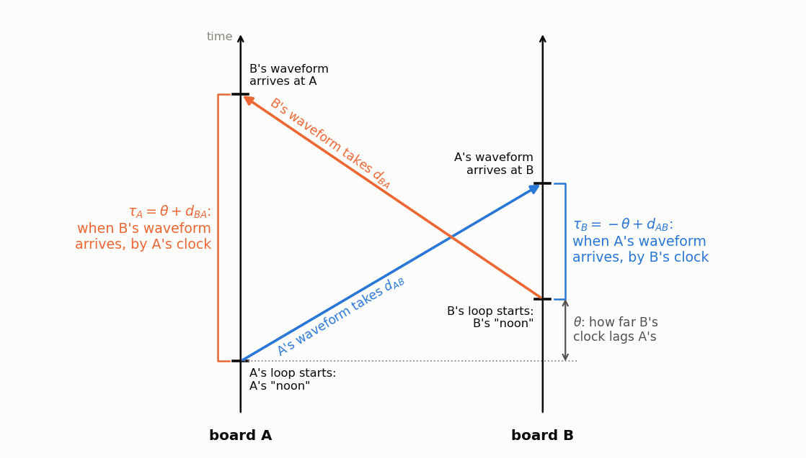
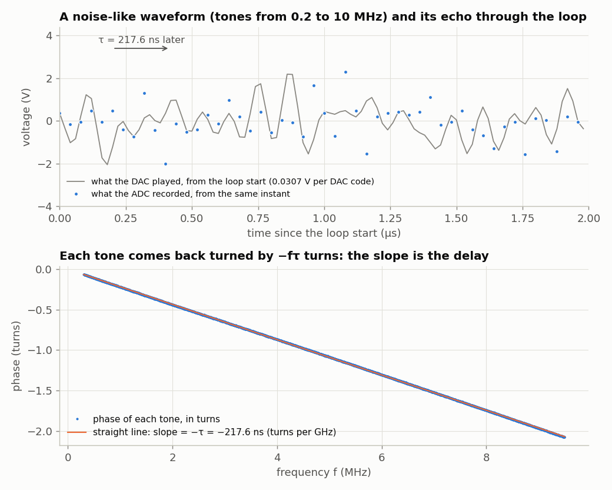
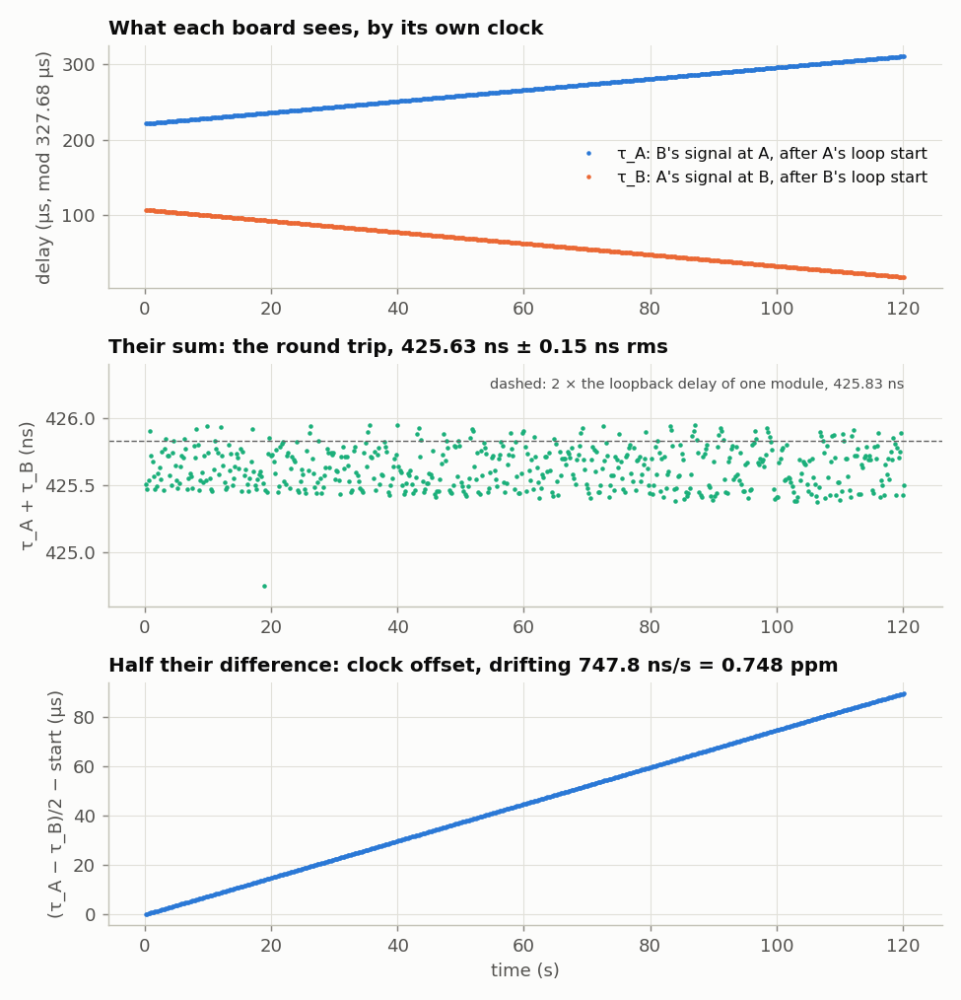

<!-- nav -->
[← 5.02 Warming a crystal](5_02_warming_a_crystal.md#502-warming-a-crystal) &emsp;&emsp;&emsp; **[Contents](../README.md#contents)** &emsp;&emsp;&emsp; [5.04 Oscillators that listen to each other →](5_04_coupled_oscillators.md#504-oscillators-that-listen-to-each-other)

# 5.03 What time is it over there?



Two observers, each with a clock, want to agree on what time it is. The only
way to compare clocks at a distance is to send a signal, and the signal takes
time to arrive. If A sends "it's noon" and B receives it, B knows only that it
was noon when A sent it, plus however long the trip took. That isn't known
unless the clocks already agree. Einstein met this in 1905 and settled it by
convention: *send a signal from A to B and straight back, and define the event
at B to be halfway through the round trip.* National time laboratories compare
their atomic clocks the same way across the Atlantic. Each station transmits
at once through a satellite, so the trip out and the trip back cancel. It is
called *two-way satellite time and frequency transfer*.

## The idea

Two boards can do exactly this, cross-connected: A's DAC to B's ADC, and B's
DAC to A's ADC. Each board plays its own waveform over and over, in a loop
327.68 µs long, and the start of each loop is that board's "noon": its
clock. Each board also records what arrives from the other, starting at its
own noon. The diagram at the top of this page is one exchange, drawn as a
space-time diagram with time going up.

θ is how far B's noon lags A's: the clock offset we want. *d*<sub>AB</sub> is
the travel time from A's DAC to B's ADC, and *d*<sub>BA</sub> the travel time
back. In A's record, B's waveform appears τ<sub>A</sub> after A's noon:

  τ<sub>A</sub> = θ + d<sub>BA</sub>

and in B's record, A's waveform appears τ<sub>B</sub> after B's noon:

  τ<sub>B</sub> = −θ + d<sub>AB</sub>

Neither alone separates the clock offset from the delay. Together, they do:

  τ<sub>A</sub> + τ<sub>B</sub> = d<sub>AB</sub> + d<sub>BA</sub>          (the round trip: no clocks in it at all)
  (τ<sub>A</sub> − τ<sub>B</sub>) / 2 = θ + (d<sub>BA</sub> − d<sub>AB</sub>)/2

The second line is the clock offset, *if* the two paths are equally long:
that's [Einstein's convention](https://en.wikipedia.org/wiki/Einstein_synchronisation).

## Measuring a delay

Each board's waveform is a sum of thousands of tones from 0.2 to 10 MHz, with
random phases, so it looks like noise. A delay τ turns the tone at frequency
*f* by −*f*τ turns (−2π*f*τ radians), so the phase of the *cross-spectrum*
between the record and the known waveform, plotted against frequency, is a
straight line, and its slope is −τ. A fit across the band gives τ to a small
fraction of a sample, though a whole sample is 40 ns. Here is one board,
looped back to itself through the 101.5 cm cable, measuring its own loop:



Five records in a row gave 217.596, 217.592, 217.597, 217.601 and
217.605 ns: a scatter of 5 ps, an eight-thousandth of a sample.

<details>
<summary><b>Detail:</b> why this waveform, and not an LFSR or a chirp?</summary>

Any waveform that repeats exactly once per loop, with its power spread across
the band, would work, because the fit only needs the phase at many
frequencies. This one has three advantages:

- **It puts power only where the converters work well:** 0.2 to 10 MHz, away
  from DC (offsets) and from 12.5 MHz, where the ADC aliases and the DAC's
  image folds back ([1.08](1_08_lockin.md#108-a-lock-in-amplifier)). An LFSR's spectrum, like [1.07](1_07_closing_the_loop.md#107-closing-the-loop-the-dac-talks-to-the-adc)'s,
  runs all the way up to the rate it's clocked at, and the part above
  12.5 MHz folds back on top of the band you're measuring. [1.07](1_07_closing_the_loop.md#107-closing-the-loop-the-dac-talks-to-the-adc)'s last
  Detail warned about exactly this.
- **It fits the loop exactly.** Each tone makes a whole number of cycles in
  the 16384-sample loop, so each lands exactly on one bin of the FFT, with
  no [leakage](https://en.wikipedia.org/wiki/Spectral_leakage). A 10-bit LFSR repeats every 1023 samples, which doesn't
  divide 16384.
- **Every tone has the same weight**, so the fit treats all frequencies
  alike, and you can leave out any band you like (a noisy one, say).

The random phases make it noise-like. Tones that all started in phase would
pile up into one huge spike per loop, far beyond the DAC's 8 bits; random
phases spread the energy evenly in time.

A *[chirp](https://en.wikipedia.org/wiki/Chirp)*, a tone sweeping from 0.2 to 10 MHz once per loop, would work just
as well. It is band-limited and periodic too, and its constant envelope gets
even more power through the 8-bit DAC. Radar uses chirps, and so do bats:
send a sweep, cross-correlate the echo with it, and the sweep collapses into
one sharp peak at the echo's delay (*[pulse compression](https://en.wikipedia.org/wiki/Pulse_compression)*). [4.10](4_10_more_ideas.md#410-more-ideas-for-one-board)
has a chirp sonar to build. Real two-way satellite [time transfer](https://en.wikipedia.org/wiki/Time_transfer), like GPS,
uses pseudo-random codes instead, because many stations share one satellite
channel, and each needs a code that the others' don't correlate with.

</details>

## The design

The tool is a design that is both a signal generator and a recorder,
`awgcap.sv`. It plays any 16384-sample waveform from block RAM over and over
at 50 MS/s, which is one loop every 327.68 µs. On command it records 16384
ADC samples, starting *exactly* at the beginning of its own loop.

<!-- file: src/twoboard/awgcap.sv -->
```systemverilog
// awgcap.sv -- an arbitrary waveform generator and a digitizer in one design.
//
// The DAC plays a 16384-sample waveform from block RAM, over and over, at
// 50 MS/s (one loop = 327.68 us).  The ADC records 16384 samples at 25 MS/s
// (655.36 us = exactly two loops), starting on the first sample of a loop, so
// every record has the same timing relative to this board's own waveform.
//
// Serial port, 1,000,000 baud:
//   "W" then 16384 bytes   load a new waveform (the DAC keeps playing as it loads)
//   "C"                    record, then send back the 16384 ADC samples
//
// Two boards running this, cross-connected, can send each other any signal.
// One board looped back records its own.
module awgcap (
    input  logic       clk,         // 50 MHz
    output logic [7:0] dac_d = 8'd128,
    output logic       dac_clk,
    input  logic [7:0] adc_d,
    output logic       adc_clk,
    input  logic       uart_rx,
    output logic       uart_tx,
    output logic [4:0] led
);
    localparam N = 16384;

    // ---- the waveform: one sample per clock -----------------------------------
    logic [7:0]  wave [0:N-1];
    logic [13:0] play = 0;                  // which sample the DAC is playing
    initial for (int i = 0; i < N; i++) wave[i] = 8'd128;
    always_ff @(posedge clk) begin
        // ######################################################################
        // ##  KEY LINE: play the stored waveform, one sample per clock.  `play`
        // ##  wraps from 16383 to 0, so it loops forever.  Its zero is this
        // ##  board's "noon": the instant every record is lined up with.
        // ######################################################################
        play  <= play + 1;
        dac_d <= wave[play];
    end
    assign dac_clk = ~clk;                  // as in the earlier designs

    // ---- the ADC: 25 MS/s, as in capture.sv ------------------------------------
    logic adc_clk_r = 0, new_sample = 0;
    logic [7:0] sample = 0;
    always_ff @(posedge clk) begin
        adc_clk_r  <= ~adc_clk_r;
        new_sample <= 0;
        if (adc_clk_r == 0) begin
            sample     <= adc_d;
            new_sample <= 1;
        end
    end
    assign adc_clk = adc_clk_r;

    // ---- serial port ----------------------------------------------------------
    logic [7:0] rx_data;
    logic       rx_valid, tx_busy;
    logic [7:0] tx_data = 0;
    logic       tx_start = 0;
    uart_rx #(.CLKS_PER_BIT(50)) urx (.clk(clk), .rx(uart_rx), .data(rx_data), .valid(rx_valid));
    uart_tx #(.CLKS_PER_BIT(50)) utx (.clk(clk), .data(tx_data), .start(tx_start), .busy(tx_busy), .tx(uart_tx));

    // ---- load, record, send ---------------------------------------------------
    logic [7:0]  rec [0:N-1];
    logic [13:0] addr = 0;
    logic [7:0]  rd = 0;
    typedef enum logic [2:0] {IDLE, LOAD, ARM, RECORD, SEND, SEND2} state_t;
    state_t state = IDLE;
    always_ff @(posedge clk) begin
        tx_start <= 0;
        rd <= rec[addr];
        case (state)
            IDLE:
                if (rx_valid && rx_data == "W") begin addr <= 0; state <= LOAD; end
                else if (rx_valid && rx_data == "C") state <= ARM;
            LOAD:
                if (rx_valid) begin
                    wave[addr] <= rx_data;
                    addr <= addr + 1;
                    if (addr == N - 1) state <= IDLE;
                end
            ARM:
                // ##############################################################
                // ##  KEY LINE: start recording on the first sample of a loop,
                // ##  so every record starts at the same instant of this
                // ##  board's own clock.
                // ##############################################################
                if (new_sample && play == 14'd1) begin
                    rec[0] <= sample; addr <= 1; state <= RECORD;
                end
            RECORD:
                if (new_sample) begin
                    rec[addr] <= sample;
                    addr <= addr + 1;
                    if (addr == N - 1) begin addr <= 0; state <= SEND; end
                end
            SEND:  state <= SEND2;          // one clock for the RAM read
            SEND2:
                if (!tx_busy && !tx_start) begin
                    tx_data <= rd; tx_start <= 1;
                    if (addr == N - 1) state <= IDLE;
                    else begin addr <= addr + 1; state <= SEND; end
                end
        endcase
    end
    assign led = {state, 2'b0};
endmodule
```

<details>
<summary>The whole file: <code>awgcap.py</code></summary>

<!-- file: src/twoboard/awgcap.py -->
```python
#!/usr/bin/env python3
"""The laptop side of awgcap.sv: load waveforms into boards and record their ADCs.

    import awgcap
    awgcap.upload("/dev/ttyUSB0", wave)        # wave: 16384 numbers 0..255, played at 50 MS/s
    codes = awgcap.record("/dev/ttyUSB0")      # 16384 ADC codes at 25 MS/s
    a, b = awgcap.record_many([port_a, port_b])   # both boards at (nearly) the same moment
"""
import threading
import time

import numpy as np
import serial

N = 16384
FS_DAC, FS_ADC = 50e6, 25e6


def upload(port, wave):
    w = np.clip(np.round(np.asarray(wave)), 0, 255).astype(np.uint8)
    assert len(w) == N
    with serial.Serial(port, 1_000_000, timeout=2) as s:
        s.write(b"W" + w.tobytes())
        s.flush()
    time.sleep(0.05)


def record(port):
    with serial.Serial(port, 1_000_000, timeout=2) as s:
        time.sleep(0.02)
        s.reset_input_buffer()
        s.write(b"C")
        raw = s.read(N)
    if len(raw) != N:
        raise RuntimeError("got %d of %d bytes -- is awgcap.bit loaded?" % (len(raw), N))
    return np.frombuffer(raw, np.uint8).astype(int)


def record_many(ports):
    """Ask several boards to record at once.  Each port is read in its own thread:
    a port nobody is reading loses data after about 4 kB."""
    sers = [serial.Serial(p, 1_000_000, timeout=2) for p in ports]
    time.sleep(0.02)
    for s in sers:
        s.reset_input_buffer()
    out = [None] * len(sers)
    def go(i):
        sers[i].write(b"C")
        out[i] = sers[i].read(N)
    th = [threading.Thread(target=go, args=(i,)) for i in range(len(sers))]
    for t in th: t.start()
    for t in th: t.join()
    for s in sers: s.close()
    if any(len(o) != N for o in out):
        raise RuntimeError("short record: %s" % [len(o) for o in out])
    return [np.frombuffer(o, np.uint8).astype(int) for o in out]
```

</details>

`twoway.py` is the laptop's half. It makes the two waveforms, loads one into
each board, asks both boards to record at the same moment, and fits each τ:

<details>
<summary>The whole file: <code>twoway.py</code></summary>

<!-- file: src/twoboard/twoway.py -->
```python
#!/usr/bin/env python3
"""Two-way time transfer between two boards running awgcap.sv, cross-connected.

    python3 twoway.py PORT_A PORT_B [--seconds 120] [-o out.npz]

Each board loops its own noise-like waveform (a random-phase multitone, 0.2-10 MHz)
and records the other's.  From each record, the delay of the other board's waveform
relative to THIS board's loop start:

    tau_A = theta + d_BA        tau_B = -theta + d_AB        (mod one loop, 327.68 us)

theta = how far B's loop start is behind A's (the clock offset), d = the one-way
delays.  So tau_A + tau_B = d_AB + d_BA, the round trip, whatever the clocks do, and
(tau_A - tau_B)/2 = theta if the two delays are equal (Einstein's convention).
"""
import argparse
import time

import numpy as np

import awgcap

N, P = awgcap.N, awgcap.N / awgcap.FS_DAC          # one loop: 327.68 us


def multitone(seed, fmin=0.2e6, fmax=10e6):
    """A real waveform, periodic in N samples at 50 MS/s, with flat spectrum fmin..fmax."""
    rng = np.random.default_rng(seed)
    X = np.zeros(N // 2 + 1, complex)
    k = np.arange(len(X)); f = k * awgcap.FS_DAC / N
    band = (f >= fmin) & (f <= fmax)
    X[band] = np.exp(2j * np.pi * rng.random(band.sum()))
    x = np.fft.irfft(X, N)
    return 128 + 100 * x / np.abs(x).max()


def delay(record, wave, fmin=0.3e6, fmax=9.5e6):
    """Delay (s, mod one loop) of `wave` (as played at 50 MS/s) inside `record` (25 MS/s,
    starting at this board's loop start).  The record holds exactly two loops: average them,
    then fit the cross-spectrum's phase against frequency -- coarse lag from the
    correlation peak, fine lag from the slope."""
    r = record.reshape(2, N // 2).mean(0); r = r - r.mean()
    w = wave[::2] - wave.mean()                     # the waveform at 25 MS/s
    R, W = np.fft.rfft(r), np.fft.rfft(w)
    C = R * np.conj(W)
    lag0 = np.argmax(np.fft.irfft(C, N // 2))      # integer samples at 25 MS/s
    f = np.fft.rfftfreq(N // 2, 1 / awgcap.FS_ADC)
    band = (f >= fmin) & (f <= fmax)
    ph = np.unwrap(np.angle(C[band] * np.exp(2j * np.pi * f[band] * lag0 / awgcap.FS_ADC)))
    slope = np.polyfit(f[band], ph, 1)[0]
    return (lag0 / awgcap.FS_ADC - slope / (2 * np.pi)) % P


if __name__ == "__main__":
    ap = argparse.ArgumentParser()
    ap.add_argument("port_a"); ap.add_argument("port_b")
    ap.add_argument("--seconds", type=float, default=120)
    ap.add_argument("-o", "--out", default="twoway.npz")
    a = ap.parse_args()
    wa, wb = multitone(1), multitone(2)
    awgcap.upload(a.port_a, wa); awgcap.upload(a.port_b, wb)
    rows = []; t0 = time.time()
    while time.time() - t0 < a.seconds:
        ra, rb = awgcap.record_many([a.port_a, a.port_b])
        ta, tb = delay(ra, wb), delay(rb, wa)
        rows.append((time.time() - t0, ta, tb))
        print("%7.2f s  tau_A %10.3f ns  tau_B %10.3f ns  sum %9.3f ns" %
              (rows[-1][0], ta * 1e9, tb * 1e9, ((ta + tb) % P) * 1e9), flush=True)
    np.savez(a.out, rows=np.array(rows), wa=wa, wb=wb)
```

</details>

## Running it

```bash
make awgcap.bit
make load-awgcap SERIAL=DP0525BU; make load-awgcap SERIAL=DP051TLX
python3 twoway.py $A $B --seconds 120
```



Over two minutes, 571 exchanges:

- **The round trip doesn't move:** 425.63 ns, with a scatter of 0.15 ns rms.
  For comparison, one module looped back to its own ADC measures 212.92 ns one
  way (through a 16.5 cm cable). Twice that is 425.83 ns: the two new modules' paths average within
  0.2 ns of the old one's. (Whether A → B equals B → A, this measurement
  can't say. See below.)
  Almost all of each one-way delay is in the converters and their analog
  circuits: 16.5 cm of RG-316 is only 0.75 ns, while the AD9280 alone hands
  out each sample 3 conversion cycles (120 ns) after taking it ([1.04](1_04_adc_on_the_leds.md#104-the-adc-on-the-leds)).
- **The clock offset grows in a straight line**, by 747.8 ns every second:
  0.748 ppm, the beat of [5.01](5_01_two_clocks.md#501-two-clocks) measured a completely different way. Both
  numbers say how fast B's clock falls behind A's.
- Around that straight line, the offset wanders by 37 ns rms over the two
  minutes. That is the crystals' frequency wander of [5.01](5_01_two_clocks.md#501-two-clocks), now seen as time.

> [!TIP]
> **One board?** Load `awgcap.sv` into one looped-back board, and it records
> its own waveform. The same fit then gives the one-way delay through its own
> loop (212.92 ns, measured through a 16.5 cm cable), with no clock offset at all, since both ends
> share one clock. That's the number the round trip above was compared with.

## One-way delays?

Neither board ever learns the one-way delay. Only the round trip is measured,
and splitting it in half is the convention. It is a natural one, but no
measurement made with these two clocks alone can test it: to learn
*d*<sub>AB</sub> by itself, you'd have to know θ some other way.

There are other ways, and each needs one more thing you trust:

- **Carry a clock.** Set a third board by A, side by side, take it to B, and
  compare. Before satellites, national laboratories compared their clocks
  this way. In 1971 Joseph Hafele and Richard Keating flew four caesium
  atomic clocks around the world on airliners, east and then west, and found
  them 59 ns behind and 273 ns ahead of the clocks left at the US Naval
  Observatory, as relativity predicted
  ([Hafele–Keating](https://en.wikipedia.org/wiki/Hafele%E2%80%93Keating_experiment)).
  A carried clock is only as good as it is on the trip: these boards'
  crystals, wandering 37 ns in two minutes, aren't.
- **Make the path symmetric, and measure what isn't.** CERN's
  *[White Rabbit](https://en.wikipedia.org/wiki/White_Rabbit_Project)*, which
  keeps the clocks across its accelerator complex together to better than a
  nanosecond over kilometres of fibre, sends both directions down the *same*
  fibre, at two wavelengths, and corrects for the one difference left: light's
  slightly different speeds at the two wavelengths, measured once in the lab.
  The best optical clocks, in laboratories hundreds of kilometres apart, are
  compared over fibre the same way.
- **Ask whether it can be done at all.** Underneath is a question for physics
  rather than engineering: whether a
  [one-way speed of light](https://en.wikipedia.org/wiki/One-way_speed_of_light)
  can be measured without first choosing how to synchronize the clocks that
  time it. (It can't.)

<details>
<summary><b>Detail:</b> why a few nanoseconds matter (and who pays for them)</summary>

- **Faster-than-light neutrinos.** In 2011 the OPERA experiment timed
  neutrinos from CERN to the Gran Sasso laboratory, 730 km away, and found
  them arriving 60 ns *before* light could have. The cause, found months
  later, was in the time transfer: a loose fibre-optic connector delayed the
  timing signal at one end. ([OPERA neutrino anomaly](https://en.wikipedia.org/wiki/2011_OPERA_faster-than-light_neutrino_anomaly).)
- **GPS runs on relativity.** A GPS satellite's clock, higher up and moving
  fast, gains about 38 µs a day on clocks on the ground. Uncorrected, that's
  11 km of position error a day, so the satellites' clocks are deliberately
  set slow before launch.
- **Milliseconds are money.** Light in glass fibre travels at about two thirds
  of its speed in air, so high-frequency traders built chains of microwave
  towers between the exchanges in Chicago and New Jersey, to send prices a
  few milliseconds sooner than fibre could.

</details>

**Try this:**

- Replace one of the two cables with a longer one. The round trip grows by
  the extra delay, about 4.6 ns per metre for RG-316, and the inferred clock
  offset jumps by *half* of it. Nothing in the data shows which cable
  changed. (This is why GPS receivers need to know their antenna-cable
  delays.)
- Correct for the offset's drift: fit θ(t) and subtract it, and the two boards
  share a timescale to a fraction of a nanosecond. What limits it, the
  crystals' wander or the measurement?
- Swap the noise waveform for a single tone. Why does the delay then become
  ambiguous, and by how much?
- Swap it for a chirp instead: phase 2π(*f*<sub>0</sub>*t* + (*f*<sub>1</sub> − *f*<sub>0</sub>)*t*<sup>2</sup>/2*P*)
  over one loop of length *P*, with (*f*<sub>0</sub> + *f*<sub>1</sub>)*P*/2 a
  whole number so that it joins up without a phase jump (the frequency still
  jumps, from *f*<sub>1</sub> back to *f*<sub>0</sub>). Does the scatter of τ get
  smaller? Why?
- Use two cables of different lengths, then swap them. The round trip can't
  change, but the clock offset that Einstein's convention infers moves by the
  whole difference between the two cables' delays. So swapping measures the
  cables' share of the asymmetry. The electronics' share stays hidden.

<!-- nav -->
[← 5.02 Warming a crystal](5_02_warming_a_crystal.md#502-warming-a-crystal) &emsp;&emsp;&emsp; **[Contents](../README.md#contents)** &emsp;&emsp;&emsp; [5.04 Oscillators that listen to each other →](5_04_coupled_oscillators.md#504-oscillators-that-listen-to-each-other)

<!-- author -->
<sub>Jason Gallicchio, jason@hmc.edu, Harvey Mudd College</sub>
