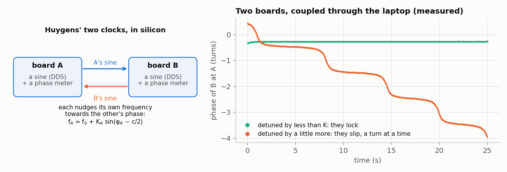
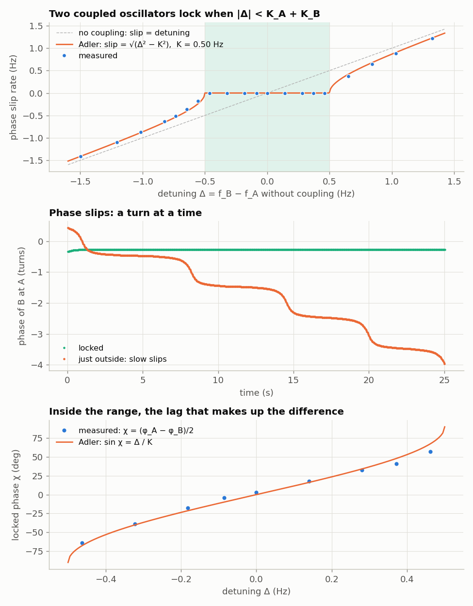
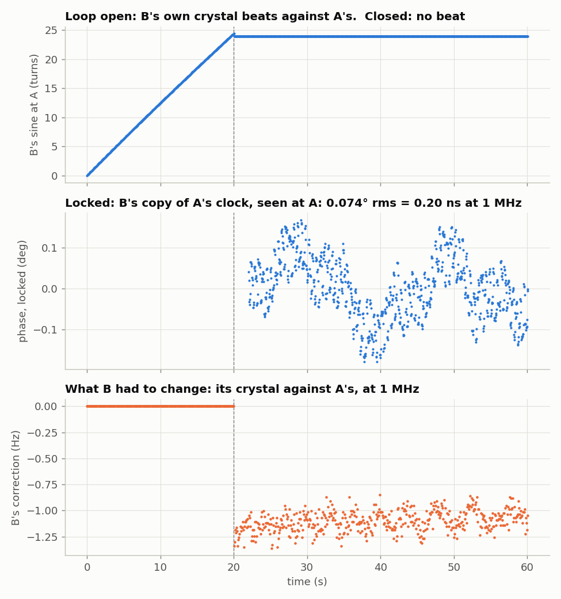

<!-- nav -->
[← 5.03 What time is it over there?](5_03_time_transfer.md#503-what-time-is-it-over-there) &emsp;&emsp;&emsp; **[Contents](../README.md#contents)** &emsp;&emsp;&emsp; [5.05 A modem →](5_05_fsk_modem.md#505-a-modem)

# 5.04 Oscillators that listen to each other



In 1665 Christiaan [Huygens](https://en.wikipedia.org/wiki/Christiaan_Huygens), ill in bed, noticed that two pendulum clocks hanging
from the same beam always ended up keeping exactly the same time, with their
pendulums swinging in opposite directions. Each clock pushed the beam a little,
and the beam pushed the other clock. The same thing makes fireflies
flash together, keeps the generators of a power grid in step, and locks a laser
to a seed laser. Two oscillators that each nudge their frequency towards the
other's phase *lock*, as long as their natural frequencies are close enough. If
they are too far apart, they slip past each other, but more slowly than they
would on their own.

> [!TIP]
> **One board?** The coupled oscillators need two boards. The hardware
> [phase-locked loop](https://en.wikipedia.org/wiki/Phase-locked_loop) at the end of this page works on one, looped back: it
> locks to a test tone from its own DAC.

Two boards running [1.08](1_08_lockin.md#108-a-lock-in-amplifier)'s `lockin.sv` are already two oscillators (each DDS)
and two phase meters (each lock-in sees the other board's sine). All that's
missing is the nudge. `coupled.py` reads both phases every 42 ms and resets each
board's frequency:

  f<sub>A</sub> = f<sub>0</sub> + K<sub>A</sub> sin(φ<sub>A</sub> − c/2)        f<sub>B</sub> = f<sub>0</sub> + δ + K<sub>B</sub> sin(φ<sub>B</sub> − c/2)

φ<sub>A</sub> is the phase of B's sine at A, relative to A's own sine, and φ<sub>B</sub> is the
reverse. δ is a deliberate detuning. The *coupling constants* K<sub>A</sub> and K<sub>B</sub>, in
hertz, say how hard each one listens.

The c/2 matters, and it is [5.03](5_03_time_transfer.md#503-what-time-is-it-over-there) again. Each measured phase includes a path
delay: φ<sub>A</sub> = ψ + c<sub>A</sub> and φ<sub>B</sub> = −ψ + c<sub>B</sub>, where ψ is the true phase difference
between the two oscillators. Their *sum* φ<sub>A</sub> + φ<sub>B</sub> = c<sub>A</sub> + c<sub>B</sub> = c is the
round-trip phase, which doesn't depend on ψ at all, so the laptop can measure it
all the time. Subtracting c/2 from each side leaves both looking at ψ itself.
Without it, the delays (about 77° each way at 1 MHz) would weaken the coupling
by a factor cos(c/2), and could even reverse it.

<details>
<summary>The whole file: <code>coupled.py</code></summary>

<!-- file: src/twoboard/coupled.py -->
```python
#!/usr/bin/env python3
"""Two coupled oscillators: each board's lockin.sv is an oscillator (its DDS) and a phase
meter (its lock-in sees the OTHER board's sine).  Every 42 ms the laptop reads both phases
and sets each frequency to

    f_i = f0 + detune_i + K_i * sin(phi_i - c/2)        (Hz)

where phi_i is the phase of the other board's signal relative to board i's own, and
c = phi_A + phi_B is the round-trip phase (cable and converter delays, both ways).
c does not depend on the oscillators' phases at all, so it can be measured all along;
subtracting half of it from each side makes the coupling symmetric, as in Adler's
equation (without it, the delays would scale the coupling by cos(c/2)).
K_A = 0, K_B > 0 is a phase-locked loop (B follows A).  K_A = K_B > 0 is mutual
coupling (Kuramoto / Adler): the two lock when |natural detuning| < K_A + K_B.

    python3 coupled.py PORT_A PORT_B --KA 0.5 --KB 0.5 --seconds 60 [--detune 0.3] -o out.npz
"""
import argparse
import threading
import time

import numpy as np
import serial

F_CLK = 50e6


def tw(f):
    return int(round(f / F_CLK * 2**32)) & 0xFFFFFFFF


def s32(v):
    return v - (1 << 32) if v & (1 << 31) else v


class Board:
    def __init__(self, port):
        self.s = serial.Serial(port, 1_000_000, timeout=1)
        time.sleep(0.05)
        self.s.reset_input_buffer()
        self.tw = None

    def set(self, f):
        self.tw = tw(f)
        self.s.write(b"%08x\n" % self.tw)

    def result(self):
        """The next complete average taken with the current tuning word."""
        while True:
            p = self.s.readline().split()
            if len(p) != 3:
                continue
            try:
                t, x, y = (int(v, 16) for v in p)
            except ValueError:
                continue
            if t == self.tw:
                return complex(s32(x), s32(y)) / 65536


if __name__ == "__main__":
    ap = argparse.ArgumentParser()
    ap.add_argument("port_a"); ap.add_argument("port_b")
    ap.add_argument("--f0", type=float, default=1e6)
    ap.add_argument("--KA", type=float, default=0.0)
    ap.add_argument("--KB", type=float, default=0.5)
    ap.add_argument("--detune", type=float, default=0.0, help="added to B's frequency, Hz")
    ap.add_argument("--seconds", type=float, default=60)
    ap.add_argument("-o", "--out", default="coupled.npz")
    a = ap.parse_args()
    A, B = Board(a.port_a), Board(a.port_b)
    fa, fb = a.f0, a.f0 + a.detune
    A.set(fa); B.set(fb)
    rows = []; t0 = time.time(); csum = 1
    while time.time() - t0 < a.seconds:
        res = {}
        th = [threading.Thread(target=lambda n, b: res.__setitem__(n, b.result()), args=(n, b)) for n, b in (("A", A), ("B", B))]
        for t in th: t.start()
        for t in th: t.join()
        pa, pb = np.angle(res["A"]), np.angle(res["B"])
        csum = 0.9 * csum + 0.1 * np.exp(1j * (pa + pb)) if rows else np.exp(1j * (pa + pb))
        half = np.angle(csum) / 2
        fa = a.f0 + a.KA * np.sin(pa - half)
        fb = a.f0 + a.detune + a.KB * np.sin(pb - half)
        A.set(fa); B.set(fb)
        rows.append((time.time() - t0, pa, pb, abs(res["A"]), abs(res["B"]), fa, fb))
    np.savez(a.out, rows=np.array(rows), KA=a.KA, KB=a.KB, detune=a.detune, f0=a.f0)
    r = np.array(rows)
    print("%d updates in %.1f s; final half: phi_A %.1f +- %.1f deg, phi_B %.1f +- %.1f deg; f_B - f_A %.4f Hz" %
          (len(r), r[-1, 0], np.degrees(np.mean(r[len(r)//2:, 1])), np.degrees(np.std(np.unwrap(r[len(r)//2:, 1]))),
           np.degrees(np.mean(r[len(r)//2:, 2])), np.degrees(np.std(np.unwrap(r[len(r)//2:, 2]))), np.mean(r[len(r)//2:, 6] - r[len(r)//2:, 5])))
```

</details>

The theory is *[Adler's equation](https://en.wikipedia.org/wiki/Injection_locking)*. With natural detuning Δ = f<sub>B</sub> − f<sub>A</sub> and total
coupling K = K<sub>A</sub> + K<sub>B</sub>, the phase difference obeys

  dψ/dt = 2π (Δ − K sin ψ)

If |Δ| < K, it settles where sin ψ = Δ/K: **locked**, with a phase lag that
makes up the difference. If |Δ| > K, it keeps turning, but at the average rate
√(Δ<sup>2</sup> − K<sup>2</sup>) instead of Δ, and unevenly: it lingers where the coupling holds it
back, then slips a whole turn quickly.


The picture to keep is a particle on a tilted washboard
(`dev/tools/fig_washboard.py`): Adler's equation is dψ/dt = −dU/dψ for
U(ψ) = −2π(Δψ + K cos ψ), an overdamped ball on a corrugated slope. The
coupling makes the corrugations, the detuning tilts the board. Tilt it
gently and every corrugation still has a dip for the ball to rest in: locked.
Tilt it past |Δ| = K and the dips are gone, but the slope is still gentlest
where they were, and that is where the ball lingers.

```bash
openFPGALoader -b icepi-zero --usb-serial-num DP0525BU ../verilog/lockin.bit
openFPGALoader -b icepi-zero --usb-serial-num DP051TLX ../verilog/lockin.bit
python3 coupled.py $A $B --KA 0 --KB 0 --seconds 20            # free-running: slip = natural detuning
python3 coupled.py $A $B --KA 0 --KB 1.0 --seconds 30          # one-way: B follows A (a PLL)
python3 coupled.py $A $B --KA 0.25 --KB 0.25 --detune 0.3      # mutual, K = 0.5 Hz
```

The natural detuning here was about −0.7 Hz: B's crystal is the slower one,
as in [5.01](5_01_two_clocks.md#501-two-clocks). With one-way coupling (K<sub>B</sub> = 1 Hz) B's frequency settles 0.694 Hz
above its nominal, and both phases hold still to ±0.1°. That is a phase-locked
loop, and B is now a copy of A's clock. With mutual coupling, each moves part of
the way. For the figure, K<sub>A</sub> = K<sub>B</sub> = 0.25 Hz (K = 0.5 Hz), and δ was stepped
so that Δ ran from −1.5 to +1.4 Hz, 25 s per step:



- **Inside |Δ| < 0.5 Hz, every run locked**, with slips of under 0.001 Hz.
  The edges fall where K says.
- **Outside, the slip rate follows √(Δ<sup>2</sup> − K<sup>2</sup>) to 0.033 Hz rms.** Far from
  the edges it agrees to 0.002 Hz. Nearer the edges the slip rate depends
  steeply on Δ, which drifted with the crystals (see below).
- **Just outside the range** the phase slips one turn at a time, with long
  pauses between: the middle panel, at Δ = −0.55 Hz.
- **Inside, the locked phase χ = (φ<sub>A</sub> − φ<sub>B</sub>)/2 follows arcsin(Δ/K)**, the
  bottom panel. That is the lag the oscillators need to keep pulling each
  other to a common frequency.

<details>
<summary><b>Detail:</b> the crystals drifted during the sweep</summary>

One honest complication: the crystals drifted during the 9-minute sweep, and
the natural detuning went from −0.69 Hz before it to −0.89 Hz after. The
figure assumes the drift was steady and interpolates. Without that, the slip
rates sit 0.1 Hz off the curve.

</details>

**Try this:**

- Unequal coupling: K<sub>A</sub> = 0.4, K<sub>B</sub> = 0.1. Who moves, and to what common
  frequency? (Measure f<sub>A</sub> and f<sub>B</sub>, saved in the `.npz`.)
- Negative K. The pair still locks, but where?
- The laptop updates every 42 ms. Raise K until the loop overshoots and rings.
  The update delay limits it, much as the cable's latency does in [4.08](4_08_feedback_control.md#408-feedback-control-of-an-rc-plant).
- Put a finger on one oscillator while locked ([5.01](5_01_two_clocks.md#501-two-clocks)). The lock holds, and
  the locked phase moves to make up the difference.

## The same loop in hardware

The laptop updates the frequencies 24 times a
second. Put the whole loop inside the FPGA instead and it can update 24,414
times a second. `pll.sv` is a hardware phase-locked loop. Its phase detector is a
lock-in summed over 1024 samples (41 µs), and its *loop filter* adds a
proportional and an integral correction to the DDS tuning word. The integral
is what lets it settle with zero phase error even when the two crystals differ,
as a [GPS-disciplined](https://en.wikipedia.org/wiki/GPS_disciplined_oscillator) oscillator does.

<details>
<summary>The whole file: <code>pll.sv</code></summary>

<!-- file: src/twoboard/pll.sv -->
```systemverilog
// pll.sv -- a phase-locked loop in hardware: this board's oscillator follows the sine
// arriving at its ADC, updating 24 414 times a second.
//
// The oscillator is a DDS (tuning word tw).  The phase detector is a lock-in: ADC
// samples times sin and cos of the oscillator's phase, summed over 1024 samples
// (41 us), give I and Q; Q is proportional to the sine of the phase error.  A
// proportional-plus-integral loop filter turns Q into a correction of tw:
//
//     integ += Q >>> 17          tw = tw0 + (Q >>> 10) + integ
//
// For a full-scale input that is a loop bandwidth of about 50 Hz, damping 0.7.
// The DAC plays either the locked oscillator itself (command L) or, for testing on
// one board looped back, an independent test tone (command X).
//
// Serial port, 1,000,000 baud.  Laptop -> board, one line each:
//   "Fhhhhhhhh"   centre tuning word tw0 (also resets the integrator)
//   "Thhhhhhhh"   test-tone tuning word; "L" = DAC plays the oscillator, "X" = test tone
//   "O" / "C"     loop open (tw = tw0) / closed
// Board -> laptop, about 12 times a second: "tw I Q" as three 32-bit hex numbers.
module pll (
    input  logic       clk,
    output logic [7:0] dac_d = 128,
    output logic       dac_clk,
    input  logic [7:0] adc_d,
    output logic       adc_clk,
    input  logic       uart_rx,
    output logic       uart_tx,
    output logic [4:0] led
);
    logic signed [7:0] sine_table [0:255];
    initial for (int i = 0; i < 256; i++)
        sine_table[i] = $rtoi($floor(127.0 * $sin(6.283185307179586 * i / 256) + 0.5));

    // ---- control registers (set over the serial port, below) --------------------
    logic [31:0] tw0 = 32'd85899346, tw_test = 32'd85899346;   // 1 MHz
    logic closed = 1, play_test = 0, cmd_reset = 0;

    // ---- the oscillator and the test tone -------------------------------------
    logic [31:0] tw = 32'd85899346, phase = 0, tphase = 0;
    always_ff @(posedge clk) begin
        phase  <= phase + tw;
        tphase <= tphase + tw_test;
        dac_d  <= (play_test ? sine_table[tphase[31:24]] : sine_table[phase[31:24]]) + 128;
    end
    assign dac_clk = ~clk;

    // ---- ADC at 25 MS/s, and the phase detector --------------------------------
    logic adc_clk_r = 0;
    logic signed [8:0] x = 0;
    logic [7:0] ph_at_sample = 0;
    logic new_sample = 0;
    always_ff @(posedge clk) begin
        adc_clk_r <= ~adc_clk_r;
        new_sample <= 0;
        if (adc_clk_r == 0) begin
            x <= $signed({1'b0, adc_d}) - 9'sd128;
            ph_at_sample <= phase[31:24];
            new_sample <= 1;
        end
    end
    assign adc_clk = adc_clk_r;
    logic signed [7:0] rs = 0, rc = 0;
    logic mult = 0;
    always_ff @(posedge clk) begin
        mult <= new_sample;
        if (new_sample) begin
            rs <= sine_table[ph_at_sample];
            rc <= sine_table[ph_at_sample + 8'd64];
        end
    end
    logic signed [31:0] acc_i = 0, acc_q = 0, I = 0, Q = 0;
    logic [9:0] n = 0;
    logic update = 0;
    always_ff @(posedge clk) begin
        update <= 0;
        if (mult) begin
            n <= n + 1;
            if (n == 10'd1023) begin
                // ##############################################################
                // ##  KEY LINE: the phase detector's answer, every 1024 samples.
                // ##  Q is (amplitude) x sin(phase error).
                // ##############################################################
                I <= acc_i + x * rs; Q <= acc_q + x * rc;
                acc_i <= 0; acc_q <= 0; update <= 1;
            end else begin
                acc_i <= acc_i + x * rs; acc_q <= acc_q + x * rc;
            end
        end
    end
    // ---- loop filter --------------------------------------------------------------
    // The correction is formed as a SIGNED value first.  Written inline as
    // tw0 + (Q >>> 10) + integ, SystemVerilog would treat the whole sum as unsigned
    // (tw0 is), turn >>> into a logical shift, and a negative Q into a huge positive kick.
    logic signed [31:0] integ = 0;
    logic signed [31:0] corr;
    assign corr = (Q >>> 10) + integ;
    logic upd2 = 0;
    always_ff @(posedge clk) begin
        upd2 <= update;
        // ######################################################################
        // ##  KEY LINES: the loop filter.  The integral collects the error so
        // ##  that, once locked, the oscillator sits at the right frequency with
        // ##  no error left; the proportional term steadies the loop.
        // ######################################################################
        if (update && closed) integ <= integ + (Q >>> 17);
        if (upd2) tw <= closed ? tw0 + corr : tw0;
        if (cmd_reset) integ <= 0;
    end

    // ---- serial port: commands in, reports out --------------------------------------
    logic [7:0] rx;
    logic rxv, busy;
    uart_rx #(.CLKS_PER_BIT(50)) u_rx (.clk(clk), .rx(uart_rx), .data(rx), .valid(rxv));
    logic [7:0] cmd = 0;
    logic [31:0] val = 0;
    function automatic logic [3:0] unhex(input logic [7:0] c);
        unhex = (c >= "a") ? c - "a" + 10 : (c >= "A") ? c - "A" + 10 : c - "0";
    endfunction
    always_ff @(posedge clk) begin
        cmd_reset <= 0;
        if (rxv) begin
            if (rx == "F" || rx == "T") begin cmd <= rx; val <= 0; end
            else if (rx == "L") play_test <= 0;
            else if (rx == "X") play_test <= 1;
            else if (rx == "O") closed <= 0;
            else if (rx == "C") closed <= 1;
            else if (rx == "\n" || rx == "\r") begin
                if (cmd == "F") begin tw0 <= val; cmd_reset <= 1; end
                if (cmd == "T") tw_test <= val;
                cmd <= 0;
            end else val <= {val[27:0], unhex(rx)};
        end
    end
    logic [21:0] tick = 0;
    logic [31:0] r_tw = 0, r_i = 0, r_q = 0;
    logic [4:0] idx = 31;
    logic st = 0;
    logic [7:0] d = 0;
    uart_tx #(.CLKS_PER_BIT(50)) u_tx (.clk(clk), .data(d), .start(st), .busy(busy), .tx(uart_tx));
    function automatic logic [7:0] hex(input logic [3:0] v); hex = v < 10 ? "0" + v : "a" + v - 10; endfunction
    logic [31:0] word;
    logic [4:0]  nib;
    assign word = (idx < 8) ? r_tw : (idx < 17) ? r_i : r_q;
    assign nib  = (idx < 8) ? 7 - idx : (idx < 17) ? 16 - idx : 25 - idx;
    always_ff @(posedge clk) begin
        tick <= tick + 1; st <= 0;
        if (tick == 0) begin r_tw <= tw; r_i <= I; r_q <= Q; idx <= 0; end
        else if (idx < 27 && !busy && !st) begin
            d <= (idx == 8 || idx == 17) ? " " : (idx == 26) ? "\n" : hex(word[nib*4 +: 4]);
            st <= 1; idx <= idx + 1;
        end
    end
    assign led = {closed, play_test, 3'b0};
endmodule
```

</details>

One lesson in that file is worth knowing. The correction was first written inline,
`tw0 + (Q >>> 10) + integ`. Because `tw0` is unsigned, SystemVerilog evaluates the
*whole* expression as unsigned, so `>>>` quietly becomes a logical shift and a
negative Q becomes a huge positive one. The oscillator jumped by
2<sup>32</sup> / 2<sup>10</sup> tuning-word steps, 48.8 kHz, whenever Q went negative. Computing the
correction as a `signed` wire first fixed it.

<details>
<summary>The whole file: <code>pll_test.py</code></summary>

<!-- file: src/twoboard/pll_test.py -->
```python
#!/usr/bin/env python3
"""Drive pll.sv: set it up, close the loop, and print what it reports.

    python3 pll_test.py PORT --test-offset 100        # one board looped back: lock to a test tone 100 Hz off
    python3 pll_test.py PORT --seconds 60 -o pll.npz  # follow whatever arrives (another board)
"""
import argparse
import time

import numpy as np
import serial


def tw(f):
    return int(round(f / 50e6 * 2**32))


def s32(v):
    return v - (1 << 32) if v & (1 << 31) else v


if __name__ == "__main__":
    ap = argparse.ArgumentParser()
    ap.add_argument("port")
    ap.add_argument("--f0", type=float, default=1e6, help="centre frequency (Hz)")
    ap.add_argument("--test-offset", type=float, help="play a test tone this far from f0, and lock to it")
    ap.add_argument("--seconds", type=float, default=3)
    ap.add_argument("-o", "--out")
    a = ap.parse_args()

    s = serial.Serial(a.port, 1_000_000, timeout=1)
    time.sleep(0.05)
    commands = ["O", "F%08x\n" % tw(a.f0)]               # open the loop, set the centre
    if a.test_offset is not None:
        commands += ["T%08x\n" % tw(a.f0 + a.test_offset), "X"]   # the DAC plays a test tone
    else:
        commands += ["L"]                                  # the DAC plays the oscillator
    commands += ["C"]                                      # close the loop
    for c in commands:
        s.write(c.encode())
        time.sleep(0.02)

    s.reset_input_buffer()
    s.readline()                                           # drop a partial line
    rows = []
    t0 = time.time()
    while time.time() - t0 < a.seconds:
        p = s.readline().split()
        if len(p) != 3:
            continue
        t, i, q = int(p[0], 16), s32(int(p[1], 16)), s32(int(p[2], 16))
        rows.append((time.time() - t0, (t - tw(a.f0)) * 50e6 / 2**32, i, q))
        print("%6.2f s  oscillator %+10.4f Hz from f0   I %9d  Q %8d  phase error %+7.3f deg" %
              (rows[-1][0], rows[-1][1], i, q, np.degrees(np.arctan2(q, i))), flush=True)
    if a.out:
        np.savez(a.out, rows=np.array(rows), f0=a.f0)
```

</details>

```bash
make load-pll SERIAL=DP0525BU
python3 pll_test.py $A --test-offset 100      # one board looped back: lock to a tone 100 Hz off
```

Looped back on one board (the DAC playing a test tone, the PLL following it
through the cable), it locked to tones 2 Hz, 100 Hz and ±1000 Hz away, with a
phase error under 1°. A tone 1 kHz away took about a second to pull in, since
the integrator has to wind up first. One 3 kHz away was out of its reach in
the 1.2 s it was given (`--seconds 1.2`; the default is 3). Between two boards, B locks to A's sine and plays its own
oscillator back, and A's lock-in watches:

<details>
<summary>The whole file: <code>pll_pair.py</code></summary>

<!-- file: src/twoboard/pll_pair.py -->
```python
#!/usr/bin/env python3
"""Discipline one board's oscillator to another's, in hardware.

    python3 pll_pair.py PORT_A PORT_B --open 20 --closed 40 -o pll_pair.npz

A runs lockin.sv at 1 MHz: it plays A's sine and measures whatever comes back.
B runs pll.sv with its DAC playing its own oscillator (command L), locked to A's sine.
With B's loop open, A sees B's free-running crystal: a beat.  Closed, B sends A's
own frequency back, and the beat stops.
"""
import argparse
import threading
import time

import numpy as np
import serial


def tw(f):
    return int(round(f / 50e6 * 2**32))


def s32(v):
    return v - (1 << 32) if v & (1 << 31) else v


ap = argparse.ArgumentParser()
ap.add_argument("port_a")
ap.add_argument("port_b")
ap.add_argument("--open", type=float, default=20, help="seconds with B's loop open")
ap.add_argument("--closed", type=float, default=40, help="then seconds with it closed")
ap.add_argument("-o", "--out", default="pll_pair.npz")
a = ap.parse_args()

A = serial.Serial(a.port_a, 1_000_000, timeout=1)
B = serial.Serial(a.port_b, 1_000_000, timeout=1)
time.sleep(0.05)
A.reset_input_buffer()
B.reset_input_buffer()
TW = tw(1e6)
A.write(b"%08x\n" % TW)                            # A: lock-in at 1 MHz
for c in ("O", "F%08x\n" % TW, "L"):               # B: loop open, centre 1 MHz, play the oscillator
    B.write(c.encode())
    time.sleep(0.02)

LA, LB = [], []
t0 = time.time()
stop = False


def read_a():                                      # A's lock-in: B's sine, as A sees it
    while not stop:
        p = A.readline().split()
        if len(p) != 3:
            continue
        try:
            t, x, y = (int(v, 16) for v in p)
        except ValueError:
            continue
        if t == TW:
            LA.append((time.time() - t0, s32(x), s32(y)))


def read_b():                                      # B's PLL: its correction, I and Q
    while not stop:
        p = B.readline().split()
        if len(p) != 3:
            continue
        try:
            LB.append((time.time() - t0, (int(p[0], 16) - TW) * 50e6 / 2**32,
                       s32(int(p[1], 16)), s32(int(p[2], 16))))
        except ValueError:
            pass


threads = [threading.Thread(target=read_a), threading.Thread(target=read_b)]
for t in threads:
    t.start()
time.sleep(a.open)
B.write(b"C")                                      # close B's loop
t_close = time.time() - t0
time.sleep(a.closed)
stop = True
for t in threads:
    t.join()

LA, LB = np.array(LA), np.array(LB)
np.savez(a.out, A=LA, B=LB, t_close=t_close)
phase = np.unwrap(np.angle(LA[:, 1] + 1j * LA[:, 2])) / (2 * np.pi)      # turns
for name, sel in (("open", LA[:, 0] < t_close - 1), ("closed (last 20 s)", LA[:, 0] > LA[-1, 0] - 20)):
    p = np.polyfit(LA[sel, 0], phase[sel], 1)
    rest = (phase[sel] - np.polyval(p, LA[sel, 0])) * 360
    print("%-20s A sees B's sine turning at %+.5f Hz; phase scatter %.3f deg rms" % (name, p[0], rest.std()))
locked = LB[:, 0] > LB[-1, 0] - 20
print("B's correction when locked: %+.4f Hz (= A's crystal minus B's, at 1 MHz)" % LB[locked, 1].mean())
```

</details>

```console
$ python3 pll_pair.py $A $B --open 20 --closed 40
open                 A sees B's sine turning at +1.22035 Hz; phase scatter 28.052 deg rms
closed (last 20 s)   A sees B's sine turning at -0.00000 Hz; phase scatter 0.067 deg rms
B's correction when locked: -1.0750 Hz (= A's crystal minus B's, at 1 MHz)
```



Once the loop closes, B's oscillator is a copy of A's clock. What A sees of it
wanders by 0.07° at 1 MHz (0.067° over the console's last 20 s, 0.074° over
the figure's whole 40 s), which is 0.2 ns, against the tens of nanoseconds of
two free-running crystals ([5.01](5_01_two_clocks.md#501-two-clocks), [5.03](5_03_time_transfer.md#503-what-time-is-it-over-there)). The bottom panel is B's correction
creeping from −1.2 to −1.05 Hz over 40 s. That's A's crystal drifting (A had
just been heated in [5.02](5_02_warming_a_crystal.md#502-warming-a-crystal)), and B following it. This is exactly how a
GPS-disciplined oscillator works, with A's sine in place of GPS.

**Try this:**

- Change the shifts (`>>> 10` and `>>> 17`) to make the loop faster or
  slower. Measure its step response with `pll_test.py --test-offset`, by
  jumping the test tone 10 Hz.
- Make the loop wider than the crystals' wander ([5.01](5_01_two_clocks.md#501-two-clocks)), and then narrower.
  Which one lets more of A's wander through, and which more of B's?
- Close the loop on both boards at once. What frequency do they agree on?
  (Compare the mutual coupling above.)

<!-- nav -->
[← 5.03 What time is it over there?](5_03_time_transfer.md#503-what-time-is-it-over-there) &emsp;&emsp;&emsp; **[Contents](../README.md#contents)** &emsp;&emsp;&emsp; [5.05 A modem →](5_05_fsk_modem.md#505-a-modem)

<!-- author -->
<sub>Jason Gallicchio, jason@hmc.edu, Harvey Mudd College</sub>
