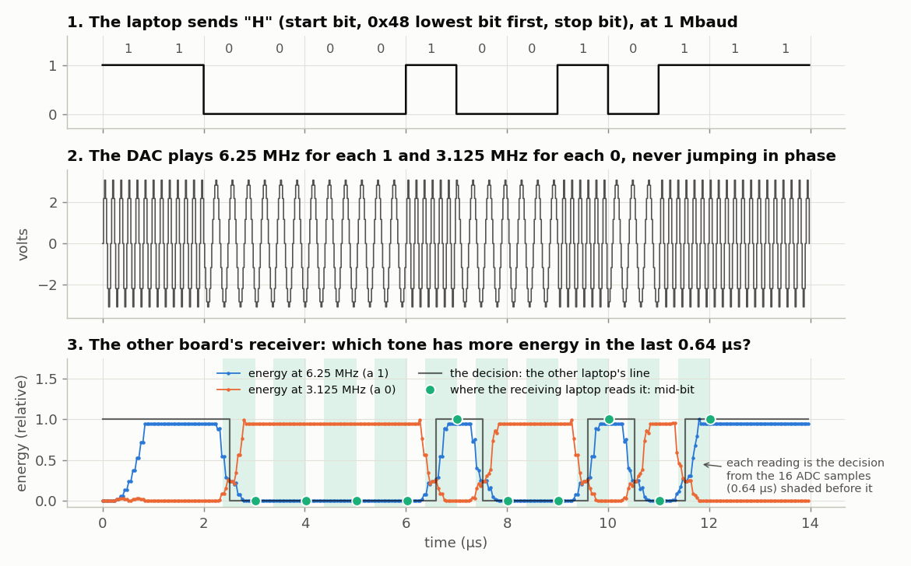

<!-- nav -->
[← 5.04 Oscillators that listen to each other](5_04_coupled_oscillators.md#504-oscillators-that-listen-to-each-other) &emsp;&emsp;&emsp; **[Contents](../README.md#contents)** &emsp;&emsp;&emsp; [5.06 The modem against noise →](5_06_modem_and_noise.md#506-the-modem-against-noise)

# 5.05 A modem



Until now the laptop did the thinking. This experiment needs no laptop arithmetic at
all. `modem.sv` is a *frequency-shift-keying* modem, like the Bell 103 modems
that first put computers on telephone lines, at 300 baud. This one carries
the 115,200 baud of the terminals below, nearly four hundred times faster, and
keeps working to 2.5 Mbaud, eight thousand times. The
line from your laptop picks the transmitted tone, and the receiver turns tones back
into a line to the other laptop. Type into one board's terminal, and the text
comes out of the other's.

- **Transmit:** a DDS whose tuning word follows the laptop's serial line: 6.25 MHz
  for a 1 (*mark*), 3.125 MHz for a 0 (*space*). Only the step size changes,
  never the phase, so the tone switches without a jump.
- **Receive:** the lock-in idea again, twice. Each ADC sample is multiplied by
  cos and sin of both tones, and the products are summed over the last 16
  samples (0.64 µs). In 16 samples the mark makes exactly 4 cycles and the
  space 2, so each detector sums the *other* tone to zero. That is the same
  orthogonality that makes OFDM work. Whichever tone has more energy, I<sup>2</sup> + Q<sup>2</sup>,
  drives the line to the other laptop.

The modem never looks at the bits. It doesn't know where a byte starts, or what
baud rate the laptops chose. It carries a level, and the UARTs at either end do the
rest.

> [!TIP]
> **One board?** Load `modem.sv` into a looped-back board, open its serial
> port with `screen`, and type: every character goes out as tones, comes back
> through the cable, and appears on your screen. The error tests below were
> run that way too.

<!-- file: src/twoboard/modem.sv -->
```systemverilog
// modem.sv -- a frequency-shift-keying modem: text typed into this board's serial
// port travels down the cable as two tones and comes out of the other board's port.
//
// Transmit: the line from the laptop (uart_rx: 1 when idle) picks the DAC's tone,
//           MARK = 6.25 MHz for 1, SPACE = 3.125 MHz for 0, without phase jumps.
// Receive:  the ADC's samples (25 MS/s) are mixed with both tones and summed over a
//           16-sample (0.64 us) window -- 4 cycles of MARK, 2 of SPACE, so the two
//           detectors ignore each other's tone -- and whichever tone has more energy
//           sets the line back to the laptop (uart_tx).  No signal at all reads as idle (1).
//
// The modem never looks at the bits: it carries whatever baud rate the laptops use, up
// to what a 0.64 us window can resolve (about 2.5 Mbaud, measured).
module modem (
    input  logic       clk,         // 50 MHz
    input  logic       uart_rx,     // from the laptop
    output logic       uart_tx = 1, // to the laptop
    output logic [7:0] dac_d = 128,
    output logic       dac_clk,
    input  logic [7:0] adc_d,
    output logic       adc_clk,
    output logic [4:0] led
);
    // ---- transmitter: a phase accumulator whose step follows the laptop's line ----
    logic rx1 = 1, rx2 = 1;
    always_ff @(posedge clk) begin rx1 <= uart_rx; rx2 <= rx1; end
    logic [31:0] phase = 0;
    localparam logic [31:0] TW_MARK = 32'h2000_0000, TW_SPACE = 32'h1000_0000;   // 1/8 and 1/16 of 50 MHz
    logic signed [7:0] sine_table [0:255];
    initial for (int i = 0; i < 256; i++)
        sine_table[i] = $rtoi($floor(100.0 * $sin(6.283185307179586 * i / 256) + 0.5));
    always_ff @(posedge clk) begin
        // ######################################################################
        // ##  KEY LINE: the transmitter.  The serial line picks the step size,
        // ##  and so the frequency.  The phase itself never jumps.
        // ######################################################################
        phase <= phase + (rx2 ? TW_MARK : TW_SPACE);
        dac_d <= sine_table[phase[31:24]] + 128;
    end
    assign dac_clk = ~clk;

    // ---- the ADC at 25 MS/s, as in capture.sv ------------------------------------
    logic adc_clk_r = 0, new_sample = 0;
    logic signed [8:0] x = 0;
    always_ff @(posedge clk) begin
        adc_clk_r  <= ~adc_clk_r;
        new_sample <= 0;
        if (adc_clk_r == 0) begin
            x <= $signed({1'b0, adc_d}) - 9'sd128;
            new_sample <= 1;
        end
    end
    assign adc_clk = adc_clk_r;

    // ---- receiver: mix with both tones, sum over 16 samples ----------------------
    // MARK  = fs/4: cos = 1,0,-1,0   sin = 0,1,0,-1
    // SPACE = fs/8: cos = 1,c,0,-c,-1,-c,0,c  with c = 181/256 = 0.707
    // The references are so simple that "multiplying" is just picking x, -x, 0 or c*x.
    logic [2:0] n = 0;
    logic signed [17:0] pmi, pmq, psi, psq;         // this sample times each reference
    logic signed [17:0] xc;
    assign xc = (x * 181) >>> 8;
    always_ff @(posedge clk) if (new_sample) begin
        n <= n + 1;
        case (n[1:0]) 0: begin pmi <= x;  pmq <= 0;  end
                      1: begin pmi <= 0;  pmq <= x;  end
                      2: begin pmi <= -x; pmq <= 0;  end
                      3: begin pmi <= 0;  pmq <= -x; end endcase
        case (n)      0: begin psi <= x;   psq <= 0;   end
                      1: begin psi <= xc;  psq <= xc;  end
                      2: begin psi <= 0;   psq <= x;   end
                      3: begin psi <= -xc; psq <= xc;  end
                      4: begin psi <= -x;  psq <= 0;   end
                      5: begin psi <= -xc; psq <= -xc; end
                      6: begin psi <= 0;   psq <= -x;  end
                      7: begin psi <= xc;  psq <= -xc; end endcase
    end
    // running sums over the last 16 products (a 16-deep delay line for each)
    logic signed [17:0] dmi [0:15], dmq [0:15], dsi [0:15], dsq [0:15];
    logic signed [21:0] smi = 0, smq = 0, ssi = 0, ssq = 0;
    logic [3:0] k = 0;
    logic step = 0;
    always_ff @(posedge clk) begin
        step <= new_sample;                         // one clock after the products update
        if (step) begin
            // ##################################################################
            // ##  KEY LINE: a running sum over the last 16 products: add the
            // ##  newest, subtract the one from 16 samples ago.
            // ##################################################################
            smi <= smi + pmi - dmi[k]; dmi[k] <= pmi;
            smq <= smq + pmq - dmq[k]; dmq[k] <= pmq;
            ssi <= ssi + psi - dsi[k]; dsi[k] <= psi;
            ssq <= ssq + psq - dsq[k]; dsq[k] <= psq;
            k <= k + 1;
        end
    end
    // energies and the decision
    logic [43:0] em = 0, es = 0;
    always_ff @(posedge clk) begin
        em <= smi * smi + smq * smq;
        es <= ssi * ssi + ssq * ssq;
        // ######################################################################
        // ##  KEY LINE: the decision.  More MARK energy than SPACE: a 1.
        // ######################################################################
        uart_tx <= (em >= es) || (em + es < 44'd40000);   // no signal: idle
    end
    assign led = {~uart_tx, ~rx2, 3'b0};
endmodule
```

```bash
make load-modem SERIAL=DP0525BU; make load-modem SERIAL=DP051TLX
screen $A 115200        # in one terminal
screen $B 115200        # in another: type in either, read in the other
```

<details>
<summary>The whole file: <code>modem_test.py</code></summary>

<!-- file: src/twoboard/modem_test.py -->
```python
#!/usr/bin/env python3
"""Full-duplex test of two boards running modem.sv: each laptop's port sends random bytes to the
other at the same time, and each checks what arrives.

    python3 modem_test.py PORT_A PORT_B [--baud 1000000] [--bytes 20000]
"""
import argparse
import os
import threading
import time

import serial

ap = argparse.ArgumentParser()
ap.add_argument("port_a")
ap.add_argument("port_b")
ap.add_argument("--baud", type=int, default=1_000_000)
ap.add_argument("--bytes", type=int, default=20000)
a = ap.parse_args()

A = serial.Serial(a.port_a, a.baud, timeout=0.5)
B = serial.Serial(a.port_b, a.baud, timeout=0.5)
time.sleep(0.05)
A.reset_input_buffer()
B.reset_input_buffer()
data_a, data_b = os.urandom(a.bytes), os.urandom(a.bytes)
got = {"A": bytearray(), "B": bytearray()}


def reader(name, port):
    """Read until the line goes quiet for 0.5 s.  Reading while writing matters: Linux keeps
    only about 4 kB for a port that nobody is reading."""
    while True:
        chunk = port.read(65536)
        if not chunk:
            break
        got[name].extend(chunk)


readers = [threading.Thread(target=reader, args=("A", A)), threading.Thread(target=reader, args=("B", B))]
for t in readers:
    t.start()
writers = [threading.Thread(target=A.write, args=(data_a,)), threading.Thread(target=B.write, args=(data_b,))]
for t in writers:
    t.start()
for t in writers + readers:
    t.join()

for src, dst, sent in (("A", "B", data_a), ("B", "A", data_b)):
    received = bytes(got[dst])
    wrong = sum(x != y for x, y in zip(sent, received)) + abs(len(sent) - len(received))
    print("%s -> %s at %d baud: %d of %d bytes arrived, %d wrong" %
          (src, dst, a.baud, len(received), len(sent), wrong))
```

</details>

Between two boards, both directions at once (`modem_test.py`, 20,000 random
bytes each way, sent at the same time), and looped back on one board, there
were **no errors at any speed up to 2.5 Mbaud**:

| baud | bit length | errors in 20,000 bytes |
| ---: | ---: | ---: |
| 115,200 to 1,000,000 | 25–217 samples | 0 (both ways, and looped back) |
| 1,500,000 | 16.7 samples | 0 (looped back) |
| 2,000,000 | 12.5 samples | 0 (both ways, and looped back) |
| 2,500,000 | 10.0 samples | 0 (both ways, and looped back) |
| 3,000,000 | 8.3 samples | 19,938 (everything; looped back) |

The limit is the window. The detector decides on the last 16 samples, so a
lone bit has to fill more than half of it, at least 8 samples, or the
neighbouring bits outvote it. That puts the limit near 25 MS/s ÷ 8 ≈ 3.1 Mbaud,
and 3 Mbaud (8.3 samples per bit) is right on the edge. A longer window would
reject more noise but carry fewer bits. A shorter one needs tones further apart.
This trade between time and bandwidth is the uncertainty principle of signal
processing.

## Two Linux computers on one cable

The modem doesn't care what drives its
serial line, so it can be a serial port of Chapter 3's Linux SoC instead of the laptop.
`make_modem_linux.py` builds the stock Icepi Zero SoC with a second LiteX [UART](https://en.wikipedia.org/wiki/Universal_asynchronous_receiver-transmitter).
Its transmit line drives `modem.sv`'s transmitter inside the FPGA, and the
modem's receiver drives its receive line. A node in the [device tree](https://en.wikipedia.org/wiki/Devicetree) tells
Linux about it, and it appears as `/dev/ttyLXU1`. The kernel in
`src/linux/prebuilt/` already has what this needs (two LiteX serial ports, and
[SLIP](https://en.wikipedia.org/wiki/Serial_Line_Internet_Protocol) for the network below), so only the gateware has to be built, as in [3.03](3_03_building_linux.md#303-building-linux-yourself).

<details>
<summary>The whole file: <code>make_modem_linux.py</code></summary>

<!-- file: src/twoboard/make_modem_linux.py -->
```python
#!/usr/bin/env python3
"""A Linux SoC whose second serial port is modem.sv: two FPGA Linux computers, talking
through their DACs, ADCs and the cables.

Run it from the linux-on-litex-vexriscv directory, like ../linux/make_linux.py (3.03):

    cd $ADDA/tools/linux-on-litex-vexriscv
    python3 $ADDA/src/twoboard/make_modem_linux.py --board=icepi_zero_modem --build --uart-baudrate=460800

The SoC is the stock icepi_zero (as in Chapter 3) plus a second LiteX UART at 115200 baud
with 512-byte FIFOs.  (At 1 Mbaud, with 64-byte FIFOs, Linux on this 50 MHz CPU could not
empty the receive FIFO in time and lost most of a 32 kB file; the modem itself carries
2.5 Mbaud.)
Inside the FPGA, that UART's transmit line drives modem.sv's transmitter and modem.sv's
receiver drives the UART's receive line, so Linux sees /dev/ttyLXU1, and whatever is
written to it on one board can be read from it on the other.  The device tree goes to
images_modem/rv32.dtb (copy Image, rootfs.cpio.gz and opensbi.bin there from images_adda).
"""
import json
import os
import shutil
import subprocess
import sys

HERE = os.path.dirname(os.path.abspath(__file__))
sys.path.insert(0, os.path.join(HERE, "..", "litex"))
sys.path.insert(0, os.getcwd())

from migen import ClockSignal, Instance, Record, Signal
from litex.soc.cores.uart import RS232PHY, UART
import make      # linux-on-litex-vexriscv's make.py
import boards
from litex_boards.targets import icepi_zero
from adda_litex import adda_pins

IMAGES = "images_modem"


def add_modem(soc, baudrate=115_200, fifo=512):
    soc.platform.add_extension(adda_pins)
    soc.platform.add_source(os.path.join(HERE, "modem.sv"))
    pins = soc.platform.request("adda")
    line = Record([("tx", 1), ("rx", 1)])          # a serial line that never leaves the chip
    soc.uart1_phy = RS232PHY(line, soc.sys_clk_freq, baudrate=baudrate)
    soc.uart1 = UART(soc.uart1_phy, tx_fifo_depth=fifo, rx_fifo_depth=fifo)
    soc.irq.add("uart1", use_loc_if_exists=True)
    soc.specials += Instance("modem",
        i_clk=ClockSignal("sys"),
        i_uart_rx=line.tx,                         # what Linux sends -> tones
        o_uart_tx=line.rx,                         # tones from the other board -> Linux
        o_dac_d=pins.dac_d, o_dac_clk=pins.dac_clk,
        i_adc_d=pins.adc_d, o_adc_clk=pins.adc_clk,
        o_led=Signal(5))


class IcepiZeroModemSoC(icepi_zero.BaseSoC):
    def __init__(self, **kwargs):
        icepi_zero.BaseSoC.__init__(self, **kwargs)
        add_modem(self)


class Icepi_zero_modem(boards.Icepi_zero):
    def __init__(self):
        boards.Board.__init__(self, IcepiZeroModemSoC, soc_capabilities={"serial", "sdcard", "leds"})


make.supported_boards["icepi_zero_modem"] = Icepi_zero_modem

DTS_NODE = """
/ {{
    soc {{
        liteuart1: serial@{base:x} {{
            compatible = "litex,liteuart";
            reg = <0x{base:x} 0x100>;
            interrupts = <{irq}>;
            status = "okay";
        }};
    }};
}};
"""


def write_dtb(board_name):
    build = os.path.join("build", board_name)
    csr = json.load(open(os.path.join(build, "csr.json")))
    dts_file = os.path.join(build, board_name + ".dts")
    dts = open(dts_file).read()
    import re
    m = re.search(r"linux,initrd-start = <(0x[0-9a-f]+)>", dts)
    if m:
        end = int(m.group(1), 16) + os.path.getsize(os.path.join(IMAGES, "rootfs.cpio.gz"))
        dts = re.sub(r"linux,initrd-end   = <0x[0-9a-f]+>", "linux,initrd-end   = <0x%x>" % end, dts)
    dts += DTS_NODE.format(base=csr["csr_bases"]["uart1"], irq=csr["constants"]["uart1_interrupt"])
    open(dts_file, "w").write(dts)
    subprocess.check_call(["dtc", "-O", "dtb", "-o", os.path.join(IMAGES, "rv32.dtb"), dts_file])
    shutil.copy(os.path.join("images", "boot_ram0.json"), os.path.join(IMAGES, "boot.json"))
    print(f"Device tree with a second liteuart: {IMAGES}/rv32.dtb")


if __name__ == "__main__":
    os.makedirs(IMAGES, exist_ok=True)
    stock_dtb = os.path.join("images", "rv32.dtb")
    saved = open(stock_dtb, "rb").read() if os.path.exists(stock_dtb) else None
    try:
        make.main()
    finally:
        if saved is not None:
            open(stock_dtb, "wb").write(saved)
    write_dtb([a.split("=", 1)[1] for a in sys.argv if a.startswith("--board=")][0])
```

</details>

<details>
<summary><b>Detail:</b> two things that had to change first</summary>

Two things had to change before it worked, and both are worth knowing:

- **The kernel allowed only one LiteX UART.** The first boot printed
  `liteuart f0003800.serial: probe with driver liteuart failed with error -22`.
  The driver registers `CONFIG_SERIAL_LITEUART_MAX_PORTS` ports, and the
  default is 1. `src/linux/kernel_modules.config` ([3.03](3_03_building_linux.md#303-building-linux-yourself)) now sets it to 2. The
  kernel and root file system rebuild in 35 s
  (`make O=$ADDA/tools/buildroot-icepi linux-reconfigure all`), and the
  change makes no difference to boards with one UART.
- **Linux on a 50 MHz CPU can't keep up with 1 Mbaud.** With the UART at
  1 Mbaud and 64-byte FIFOs, a 32 kB file arrived as 1040 bytes: the receive
  FIFO filled in 0.64 ms and overflowed before Linux emptied it. At
  115 200 baud with 512-byte FIFOs, Linux has 45 ms of slack, and it copes.

</details>

```bash
cd $ADDA/tools/linux-on-litex-vexriscv
python3 $ADDA/src/twoboard/make_modem_linux.py --board=icepi_zero_modem --build --uart-baudrate=460800
mkdir -p images_modem; cp $ADDA/src/linux/prebuilt/images/{Image,rootfs.cpio.gz,opensbi.bin} images_modem/
python3 $ADDA/src/twoboard/make_modem_linux.py --board=icepi_zero_modem --uart-baudrate=460800   # device tree for these files
# then for each board, one at a time, as in 3.01:
openFPGALoader -b icepi-zero --usb-serial-num DP0525BU build/icepi_zero_modem/gateware/icepi_zero_modem.bit && \
litex_term --speed=460800 --images=images_modem/boot.json $A
```

Then, on the receiving board, *first*, then the sending one:

```console
B# cat /dev/ttyLXU1 > /tmp/rx.bin &                 (B starts listening first)
A# dd if=/dev/urandom of=/tmp/tx.bin bs=1024 count=32; md5sum /tmp/tx.bin
59a83427647b4d109a532a400ddb2448  /tmp/tx.bin
A# time cat /tmp/tx.bin > /dev/ttyLXU1
real	0m 3.18s
B# killall cat; ls -l /tmp/rx.bin; md5sum /tmp/rx.bin
-rw-r--r--    1 root     root         32768 Jan  1 00:03 /tmp/rx.bin
59a83427647b4d109a532a400ddb2448  /tmp/rx.bin
```

That is 32 kB in 3.2 s (10 kB/s, near the 11.5 kB/s that 115,200 baud allows),
from one Linux computer to another through two FPGAs, a DAC, a cable and an ADC.
It worked in both directions (three files A → B and one B → A), with one
exception. The very first file, sent seconds after B had booted, arrived
6% short, because B's start-up scripts were still running and its receive
FIFO overflowed. Bytes sent to a serial port that nobody has open are thrown
away too, so the receiver has to be listening first.

## A network

A serial line can carry IP. SLIP, from 1988, is the simplest
way: each IP packet is sent as raw bytes, with a special byte marking the end.
With `CONFIG_SLIP=y` in the kernel and [BusyBox](https://en.wikipedia.org/wiki/BusyBox)'s `slattach` and `nc` (both are
in Chapter 3's configuration files), the two boards become a two-computer network:

```console
A# slattach -p slip -s 115200 /dev/ttyLXU1 &
A# ifconfig sl0 10.0.0.1 pointopoint 10.0.0.2 up
B# slattach -p slip -s 115200 /dev/ttyLXU1 &
B# ifconfig sl0 10.0.0.2 pointopoint 10.0.0.1 up
A# ping -c 5 10.0.0.2
64 bytes from 10.0.0.2: seq=0 ttl=64 time=51.036 ms
64 bytes from 10.0.0.2: seq=1 ttl=64 time=49.892 ms
64 bytes from 10.0.0.2: seq=2 ttl=64 time=48.847 ms
64 bytes from 10.0.0.2: seq=3 ttl=64 time=43.247 ms
64 bytes from 10.0.0.2: seq=4 ttl=64 time=44.433 ms
5 packets transmitted, 5 packets received, 0% packet loss
B# nc -l -p 5000 > /tmp/rx.bin &
A# nc 10.0.0.2 5000 < /tmp/tx.bin              (32 kB of random bytes, by TCP)
B# md5sum /tmp/rx.bin                           (the same as A's /tmp/tx.bin)
192d7b31e257c3332917de1af9880f3b  /tmp/rx.bin
A# ping -c 20 -s 1000 10.0.0.2 | tail -2
20 packets transmitted, 20 packets received, 0% packet loss
round-trip min/avg/max = 253.146/258.960/283.574 ms
```

That's `ping` and TCP between two computers built inside FPGAs, over two DACs,
two cables, two ADCs and two FSK modems. The round trip time is mostly
physics. A 1000-byte ping is 1028 bytes of IP, 10 bits a byte on the wire at
115,200 baud: 89 ms each way, or 178 ms of the 259. The rest is two 50 MHz CPUs
handling the packets, and that rest is also most of a small ping's 47 ms.

<!-- nav -->
[← 5.04 Oscillators that listen to each other](5_04_coupled_oscillators.md#504-oscillators-that-listen-to-each-other) &emsp;&emsp;&emsp; **[Contents](../README.md#contents)** &emsp;&emsp;&emsp; [5.06 The modem against noise →](5_06_modem_and_noise.md#506-the-modem-against-noise)

<!-- author -->
<sub>Jason Gallicchio, jason@hmc.edu, Harvey Mudd College</sub>
