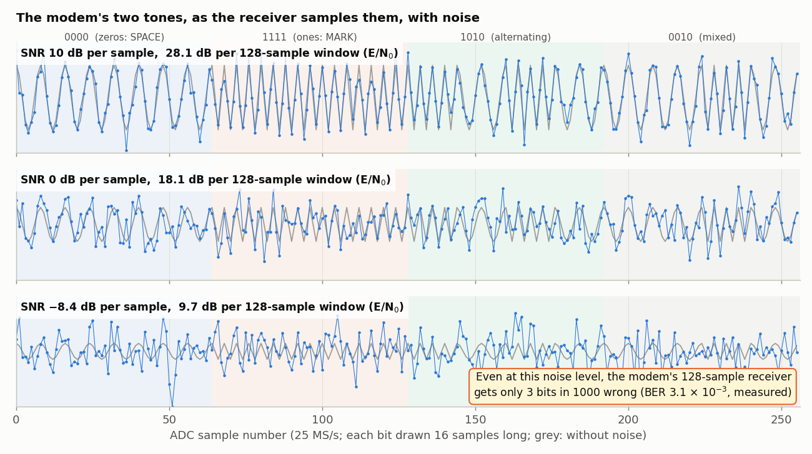
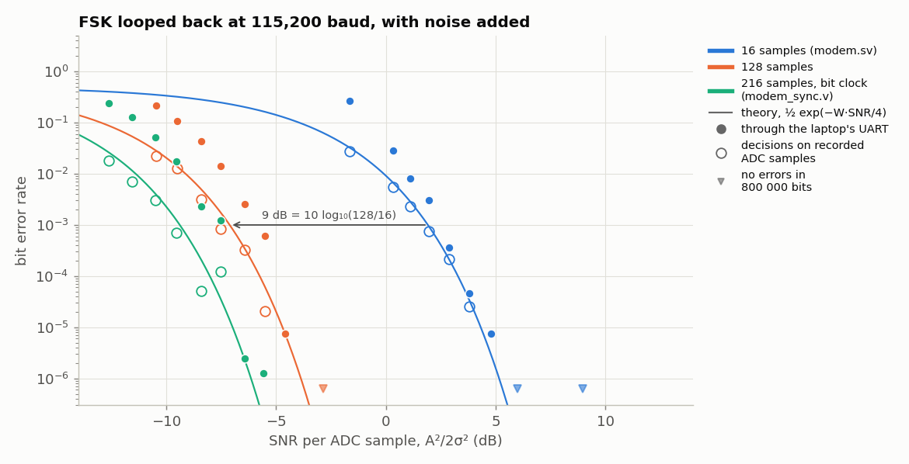

<!-- nav -->
[← 5.05 A modem](5_05_fsk_modem.md#505-a-modem) &emsp;&emsp;&emsp; **[Contents](../README.md#contents)** &emsp;&emsp;&emsp; [5.07 A radio link →](5_07_radio_link.md#507-a-radio-link)

# 5.06 The modem against noise



> [!TIP]
> **One board?** Everything on this page was measured on one board, looped
> back.

A receiver's real test is noise: how fast do
its errors grow as the signal gets weaker? `modem_noise.sv` is `modem.sv` with
three knobs. `NOISE` adds white noise to the transmitted tone, `AMP` sets the
tone's amplitude, and `LOGWIN` sets the receiver's window to 2^LOGWIN samples.
With the defaults it *is* `modem.sv`. The noise is made in the FPGA. A 32-bit
xorshift generator produces four random bytes every clock, and their sum is
nearly Gaussian, as the central limit theorem promises for a sum of a few
independent things. Its standard deviation is 147.8, scaled by NOISE/256, or
0.577 × NOISE DAC codes.

<details>
<summary>The whole file: <code>modem_noise.sv</code></summary>

<!-- file: src/twoboard/modem_noise.sv -->
```systemverilog
// modem_noise.sv -- modem.sv with three knobs, for measuring error rate against noise:
//
//   NOISE   white noise added to the transmitted tone: about 0.577 * NOISE DAC codes rms
//   AMP     the tone's amplitude in DAC codes (modem.sv: 100)
//   LOGWIN  the receiver's window is 2^LOGWIN samples (modem.sv: 4, i.e. 16 samples)
//
// With the defaults (NOISE = 0, AMP = 100, LOGWIN = 4) it is modem.sv.  Everything else
// is as in modem.sv: MARK = 6.25 MHz for 1, SPACE = 3.125 MHz for 0; the ADC at 25 MS/s
// is mixed with both tones and summed over the window, and the stronger tone wins.
module modem_noise #(parameter integer NOISE = 0, parameter integer AMP = 100,
                     parameter integer LOGWIN = 4) (
    input  logic       clk,         // 50 MHz
    input  logic       uart_rx,     // from the laptop
    output logic       uart_tx = 1, // to the laptop
    output logic [7:0] dac_d = 128,
    output logic       dac_clk,
    input  logic [7:0] adc_d,
    output logic       adc_clk,
    output logic [4:0] led
);
    localparam integer W = 1 << LOGWIN;                   // window, in samples
    // ---- transmitter: a phase accumulator whose step follows the laptop's line ----
    logic rx1 = 1, rx2 = 1;
    always_ff @(posedge clk) begin rx1 <= uart_rx; rx2 <= rx1; end
    logic [31:0] phase = 0;
    localparam logic [31:0] TW_MARK = 32'h2000_0000, TW_SPACE = 32'h1000_0000;   // 1/8 and 1/16 of 50 MHz
    logic signed [7:0] sine_table [0:255];
    initial for (int i = 0; i < 256; i++)
        sine_table[i] = $rtoi($floor(AMP * $sin(6.283185307179586 * i / 256) + 0.5));
    // ---- noise: the four bytes of a 32-bit xorshift generator, added up (a sum of
    //      four nearly independent bytes is nearly Gaussian); it repeats after 2^32 - 1
    //      clocks, 86 s
    logic [31:0] r = 32'h2545_f491;
    logic [31:0] r1, r2, r3;
    assign r1 = r ^ (r << 13);
    assign r2 = r1 ^ (r1 >> 17);
    assign r3 = r2 ^ (r2 << 5);
    logic signed [10:0] gsum = 0;                   // sum of four bytes, minus the mean
    logic signed [19:0] scaled = 0;
    logic signed [9:0]  tone = 0;
    always_ff @(posedge clk) begin
        // ######################################################################
        // ##  KEY LINE: one step of the xorshift random-number generator,
        // ##  32 new pseudo-random bits every clock.
        // ######################################################################
        r      <= r3;
        gsum   <= $signed({3'b0, r[7:0]}) + $signed({3'b0, r[15:8]}) + $signed({3'b0, r[23:16]})
                + $signed({3'b0, r[31:24]}) - 11'sd510;
        scaled <= gsum * NOISE;
        phase  <= phase + (rx2 ? TW_MARK : TW_SPACE);
        tone   <= sine_table[phase[31:24]];
    end
    // ##########################################################################
    // ##  KEY LINE: tone plus noise, clipped to what the DAC can do.
    // ##########################################################################
    logic signed [11:0] v;
    assign v = 12'sd128 + tone + (scaled >>> 8);
    always_ff @(posedge clk) dac_d <= (v < 0) ? 8'd0 : (v > 255) ? 8'd255 : v[7:0];   // clip
    assign dac_clk = ~clk;

    // ---- the ADC at 25 MS/s, as in capture.sv -----------------------------------
    logic adc_clk_r = 0, new_sample = 0;
    logic signed [8:0] x = 0;
    always_ff @(posedge clk) begin
        adc_clk_r  <= ~adc_clk_r;
        new_sample <= 0;
        if (adc_clk_r == 0) begin
            x <= $signed({1'b0, adc_d}) - 9'sd128;
            new_sample <= 1;
        end
    end
    assign adc_clk = adc_clk_r;

    // ---- receiver: mix with both tones, sum over the window ----------------------
    logic [2:0] n = 0;
    logic signed [17:0] pmi, pmq, psi, psq;         // this sample times each reference
    logic signed [17:0] xc;
    assign xc = (x * 181) >>> 8;
    always_ff @(posedge clk) if (new_sample) begin
        n <= n + 1;
        case (n[1:0]) 0: begin pmi <= x;  pmq <= 0;  end
                      1: begin pmi <= 0;  pmq <= x;  end
                      2: begin pmi <= -x; pmq <= 0;  end
                      3: begin pmi <= 0;  pmq <= -x; end endcase
        case (n)      0: begin psi <= x;   psq <= 0;   end
                      1: begin psi <= xc;  psq <= xc;  end
                      2: begin psi <= 0;   psq <= x;   end
                      3: begin psi <= -xc; psq <= xc;  end
                      4: begin psi <= -x;  psq <= 0;   end
                      5: begin psi <= -xc; psq <= -xc; end
                      6: begin psi <= 0;   psq <= -x;  end
                      7: begin psi <= xc;  psq <= -xc; end endcase
    end
    logic signed [17:0] dmi [0:W-1], dmq [0:W-1], dsi [0:W-1], dsq [0:W-1];
    logic signed [17+LOGWIN:0] smi = 0, smq = 0, ssi = 0, ssq = 0;
    logic [LOGWIN-1:0] k = 0;
    logic step = 0;
    always_ff @(posedge clk) begin
        step <= new_sample;
        if (step) begin
            smi <= smi + pmi - dmi[k]; dmi[k] <= pmi;
            smq <= smq + pmq - dmq[k]; dmq[k] <= pmq;
            ssi <= ssi + psi - dsi[k]; dsi[k] <= psi;
            ssq <= ssq + psq - dsq[k]; dsq[k] <= psq;
            k <= k + 1;
        end
    end
    // energies and the decision.  "No signal" is now less than a third of the amplitude
    // that a tone of AMP codes gives (modem.sv's 40000 is this for AMP = 100, LOGWIN = 4).
    localparam logic [63:0] QUIET = (AMP * W / 8) * (AMP * W / 8);
    logic [2*(18+LOGWIN)-1:0] em = 0, es = 0;
    always_ff @(posedge clk) begin
        em <= smi * smi + smq * smq;
        es <= ssi * ssi + ssq * ssq;
        uart_tx <= (em >= es) || (em + es < QUIET);
    end
    assign led = {~uart_tx, ~rx2, 3'b0};
endmodule
```

</details>

One board looped back is enough: its DAC's tones go through the cable to its
own ADC. `modem_ber.py` sends 100,000 random bytes through the modem at
115,200 baud and counts the bits that come back wrong. It lines up what came
back with what was sent first, because a corrupted start bit makes the laptop's
[UART](https://en.wikipedia.org/wiki/Universal_asynchronous_receiver-transmitter) lose or invent a byte, and comparing position by position would then call
everything after it wrong.

<details>
<summary>The whole file: <code>modem_ber.py</code></summary>

<!-- file: src/twoboard/modem_ber.py -->
```python
#!/usr/bin/env python3
"""Count a modem's bit errors, on one board whose DAC is cabled to its own ADC.

    python3 modem_ber.py PORT [--bytes 100000] [--baud 115200]

Sends random bytes through the modem and lines up what comes back with what was sent.
A corrupted start bit makes the laptop's UART lose or invent a byte, so a byte-by-byte
comparison would count everything after it as wrong; difflib finds the matching runs.
"""
import argparse
import difflib
import os
import threading
import time

import serial

ap = argparse.ArgumentParser()
ap.add_argument("port")
ap.add_argument("--bytes", type=int, default=100000)
ap.add_argument("--baud", type=int, default=115200)
a = ap.parse_args()

s = serial.Serial(a.port, a.baud, timeout=0.5)
time.sleep(0.05)
s.reset_input_buffer()
sent, got = os.urandom(a.bytes), bytearray()
deadline = time.time() + a.bytes * 10 / a.baud + 1


def reader():
    # until the line is quiet for 0.5 s, or the deadline: in heavy noise the idle tone
    # makes false start bits, and garbage keeps arriving for ever
    while time.time() < deadline:
        chunk = s.read(65536)
        if not chunk:
            break
        got.extend(chunk)


t = threading.Thread(target=reader)
t.start()
s.write(sent)
t.join()
got = bytes(got)

bits = 0
for op, i1, i2, j1, j2 in difflib.SequenceMatcher(None, sent, got, autojunk=False).get_opcodes():
    if op == "replace":                          # bytes that came back different
        n = min(i2 - i1, j2 - j1)
        bits += sum(bin(x ^ y).count("1") for x, y in zip(sent[i1:i1 + n], got[j1:j1 + n]))
        bits += 8 * abs((i2 - i1) - (j2 - j1))
    elif op == "delete" or (op == "insert" and i1 < len(sent)):   # lost, or invented
        bits += 8 * max(i2 - i1, j2 - j1)
print("%d bytes sent, %d received; %d bit errors in %d bits: BER %.2e" %
      (len(sent), len(got), bits, 8 * len(sent), bits / (8 * len(sent))))
```

</details>

```console
$ make modem_noise NOISE=86                        # makes modem_noise_86_100_4.bit
$ make load-modem_noise_86_100_4 SERIAL=DP0525LR       # a third board, looped back
$ python3 modem_ber.py /dev/serial/by-id/usb-FTDI_FT231X_USB_UART_DP0525LR-if00-port0
100000 bytes sent, 100000 received; 226 bit errors in 800000 bits: BER 2.82e-04
```

## What to expect

Two [signal-to-noise ratios](https://en.wikipedia.org/wiki/Signal-to-noise_ratio) matter here, and it pays to keep them apart.
A tone of amplitude A (in ADC codes) in noise of σ per sample has, per sample,

  SNR = A<sup>2</sup>/2σ<sup>2</sup>

Each detector sums W samples. The tone puts A·W/2 into its own detector and
nothing into the other, and the noise puts a variance of σ<sup>2</sup>W/2 into the
I and the Q of both. So the whole window's signal-to-noise ratio grows with W;
the textbooks call it E/N<sub>0</sub> = W·SNR/2. The decision goes wrong when
the detector with only noise in it comes out stronger than the one with the
tone, and for two such detectors the probability works out to

  P = ½ exp(−(AW/2)<sup>2</sup> / (4 · σ<sup>2</sup>W/2)) = ½ exp(−W · SNR / 4) = ½ exp(−E/2N<sub>0</sub>)

the textbook result for non-coherent FSK. A window twice as long collects
twice the energy, so it reaches the same error rate at half the SNR per
sample. A 128-sample window should need 10 log<sub>10</sub> 8 = 9 dB less than
16 samples.

## What happened

For each setting the SNR per sample was measured, not
assumed: a steady MARK tone plus the same noise, recorded with `capture.sv`. A
fitted sine is the signal, and what's left over is the noise. (It agrees with
the knobs' prediction, SNR ≈ (AMP<sup>2</sup>/2) / (0.577·NOISE)<sup>2</sup> = 1.5 (AMP/NOISE)<sup>2</sup>, to
within 0.6 dB.) The same records, put through the receiver's arithmetic in
numpy, give the error rate of the *decisions* alone, before any UART is
involved. Each line is one run of 800,000 bits:

| window | SNR per sample | theory | decisions | through the UART | bytes lost |
| ---: | ---: | ---: | ---: | ---: | ---: |
| 16 (AMP 100) | 6.0 dB | 6 × 10<sup>−8</sup> | 0 | 0 | 0 |
| | 4.8 dB | 3.0 × 10<sup>−6</sup> | 0 | 7.5 × 10<sup>−6</sup> | 0 |
| | 3.8 dB | 3.5 × 10<sup>−5</sup> | 2.5 × 10<sup>−5</sup> | 4.6 × 10<sup>−5</sup> | 0 |
| | 2.9 dB | 2.1 × 10<sup>−4</sup> | 2.1 × 10<sup>−4</sup> | 3.7 × 10<sup>−4</sup> | 1 |
| | 2.0 dB | 9.4 × 10<sup>−4</sup> | 7.7 × 10<sup>−4</sup> | 3.1 × 10<sup>−3</sup> | 6 |
| | 1.1 dB | 2.8 × 10<sup>−3</sup> | 2.3 × 10<sup>−3</sup> | 8.1 × 10<sup>−3</sup> | 26 |
| | 0.3 dB | 6.8 × 10<sup>−3</sup> | 5.5 × 10<sup>−3</sup> | 2.8 × 10<sup>−2</sup> | 139 |
| | −1.6 dB | 3.2 × 10<sup>−2</sup> | 2.8 × 10<sup>−2</sup> | 0.27 | 2131 |
| 128 (AMP 25) | −2.9 dB | 3 × 10<sup>−8</sup> | 0 | 0 | 0 |
| | −4.6 dB | 7.4 × 10<sup>−6</sup> | 0 | 7.5 × 10<sup>−6</sup> | 0 |
| | −5.5 dB | 6.0 × 10<sup>−5</sup> | 2.1 × 10<sup>−5</sup> | 6.0 × 10<sup>−4</sup> | 8 |
| | −6.4 dB | 3.5 × 10<sup>−4</sup> | 3.3 × 10<sup>−4</sup> | 2.6 × 10<sup>−3</sup> | 20 |
| | −7.5 dB | 1.7 × 10<sup>−3</sup> | 8.4 × 10<sup>−4</sup> | 1.4 × 10<sup>−2</sup> | 113 |
| | −8.4 dB | 4.9 × 10<sup>−3</sup> | 3.1 × 10<sup>−3</sup> | 4.3 × 10<sup>−2</sup> | 297 |
| | −9.5 dB | 1.4 × 10<sup>−2</sup> | 1.3 × 10<sup>−2</sup> | 0.11 | 733 |
| | −10.5 dB | 2.8 × 10<sup>−2</sup> | 2.2 × 10<sup>−2</sup> | 0.21 | 1311 |



- **The detector is as good as theory says.** The open circles, decisions
  made on the recorded samples, sit on the lines for both windows. The
  128-sample window does need 9 dB less SNR. At −10.5 dB it still decides
  correctly 98% of the time, with noise 3.3 times stronger (in rms) than the
  tone it is looking for.
- **The UART makes it worse,** by a factor of 2 to 5 with 16 samples (more
  at the lowest SNR) and 8 to 30 with 128. A UART times every byte from the
  1 → 0 edge of its start bit, and hunts for that edge from the middle of the
  previous stop bit. One wrong decision there makes it start the byte early,
  and then several bits come out wrong instead of one, or a byte is lost (the
  last column). A long
  window adds a second problem: it blurs each edge over the whole window, so
  noise moves the edge the UART sees. A simulation of the whole chain
  (`dev/tools/twoboard/fsk_sim.py`, with a plain 16×-oversampling UART) puts that
  wander at 3 samples rms for 16-sample windows, against 101 samples of margin
  ((217 − 16)/2), but at 14–22 samples rms for 128-sample windows, against
  only 45. The simulated link error rates come within a factor of 2 of the
  measured ones at the lower SNRs, and within 4 to 6 at the highest, where
  errors are rare. (The FT231X's UART is surely not exactly the simulated
  one.) With perfect bit timing, the simulation's errors fall back onto the
  theory lines.
- **The textbook receiver does better still.** It sums over the *whole* bit,
  from one edge to the next ("integrate and dump"): 217 samples at
  115,200 baud, 11.3 dB better than 16 samples in theory. But it has to know
  the baud rate and find the bit edges itself. `modem.sv` gives all that up to
  stay blind to the baud rate, and pays for it in SNR.

<details>
<summary><b>Detail:</b> the textbook receiver, built</summary>

`dev/tools/twoboard/modem_sync.v` (green in the
figure) sums each tone over 216 samples, which hold whole cycles of both
tones, and runs its own bit clock. At the end of each bit it decides, and
sends the bit on to the laptop, so the laptop gets a clean copy of the line one bit
late. To stay centred on the bits, it notes |E<sub>m</sub> − E<sub>s</sub>| 40 samples before and
40 samples after each decision. If the decision comes late, the later window
reaches further into the next bit, and whenever that bit differs, it shows
less than the earlier window. Eight more votes one way than the other move the
clock by a sample. This is an *early–late gate*, the simplest kind of clock
recovery.

Its first version got 11% of the bits wrong with no noise at all. The FT231X
can't make 115,200 baud exactly: it divides 3 MHz by 26 and sends
115,385 baud, so a bit is 216.67 samples, not 217. A UART starts afresh at
every byte and never notices 0.16%. A free-running bit clock gains a third of
a sample every bit, faster than eight votes can correct. With 216⅔ samples a
bit (a fractional counter makes two bits in three 217 samples long), it carried
100,000 bytes without an error. With noise, through the UART, it reaches a
[bit error rate](https://en.wikipedia.org/wiki/Bit_error_rate) of 10<sup>−3</sup> at about −7.5 dB. That is 1.7 dB better than the
128-sample window and 10 dB better than `modem.sv`, against 2.3 and 11.3 dB in
theory. Its link is still 10 to 35 times worse than the theory for single
decisions, mostly because the UART pays for every wrong start or stop bit with
a byte or more. (Its open circles count every window position, and neighbouring
windows share most of their samples, so the rare-error end of the green
circles rests on only a handful of independent events.)

</details>

**Try this:**

- Bring the tones closer together (say 4.6875 and 6.25 MHz) and find the new
  limit. Is it what Δf × window ≥ 1 predicts?
- Build the textbook receiver another way: find each start bit's falling
  edge with a fast detector, then sum each tone over exactly one bit, ten sums
  a byte, and compare it with `modem_sync.v`. (In a simulation, a 16-sample
  edge detector was hopeless below −8 dB, where it is wrong a quarter of the
  time. A bit clock averages over many edges.)
- Let `modem_sync.v`'s votes adjust the bit length as well as the phase (a
  second integrator, like `pll.sv`'s), so that it follows a laptop whose baud rate
  is off by a percent or two.
- Drive a speaker with the DAC (through an amplifier) and make the tones
  audible: 1200 Hz and 2200 Hz at 1200 baud is the Bell 202 standard of the
  1970s.

<!-- nav -->
[← 5.05 A modem](5_05_fsk_modem.md#505-a-modem) &emsp;&emsp;&emsp; **[Contents](../README.md#contents)** &emsp;&emsp;&emsp; [5.07 A radio link →](5_07_radio_link.md#507-a-radio-link)

<!-- author -->
<sub>Jason Gallicchio, jason@hmc.edu, Harvey Mudd College</sub>
