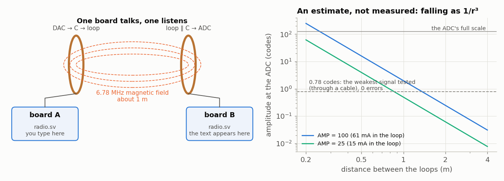
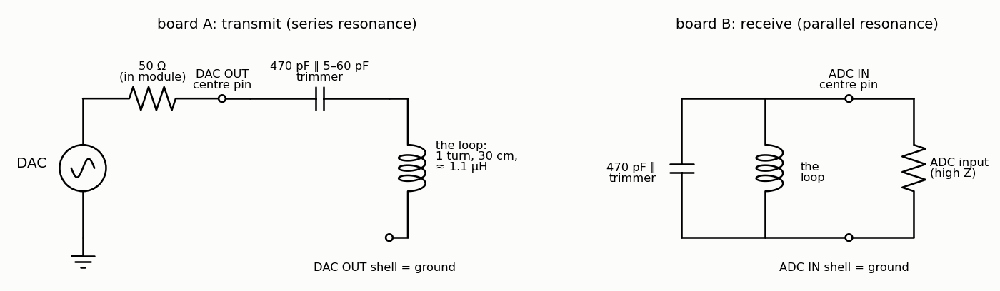
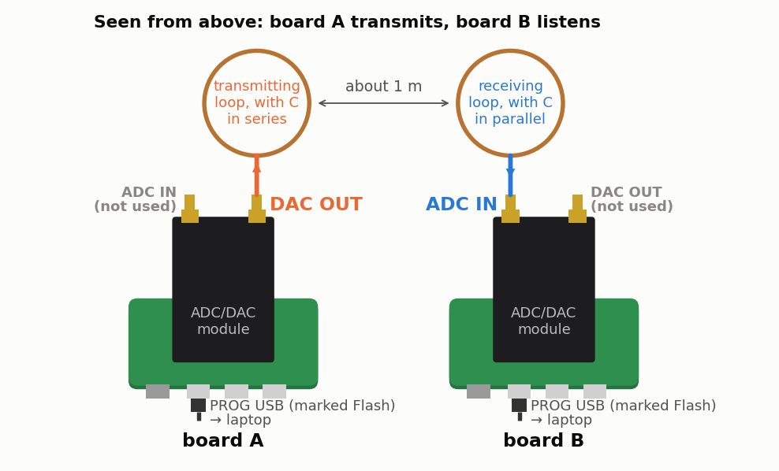

<!-- nav -->
[← 5.06 The modem against noise](5_06_modem_and_noise.md#506-the-modem-against-noise) &emsp;&emsp;&emsp; **[Contents](../README.md#contents)** &emsp;&emsp;&emsp; [5.08 With a little more hardware →](5_08_more_hardware.md#508-with-a-little-more-hardware)

# 5.07 A radio link



[5.05](5_05_fsk_modem.md#505-a-modem)'s modem sends text through a cable. Take the cable away, put a loop of
wire on each end, and it's a radio. Two things have to change. The receiver
must hear signals hundreds of times weaker, so it needs a much narrower
filter. And the transmitter has to stay on one small patch of spectrum, both
so the narrow receiver can find it and because radio is regulated.

> [!NOTE]
> `radio.sv` was tested through a cable on one board, down to a signal
> smaller than one ADC code (below). **The antennas haven't been built yet**:
> the loops, the range and the field-strength estimates on this page are
> calculations. If you build them, you're the first.

## A narrower modem

[`radio.sv`](../src/twoboard/radio.sv) is `modem.sv` with three changes:

- **Two tones 15 kHz apart**, 6.7725 MHz for a 0 and 6.7875 MHz for a 1,
  instead of 3.125 and 6.25 MHz. Both lie in the 6.765–6.795 MHz *[ISM band](https://en.wikipedia.org/wiki/ISM_radio_band)*,
  one of the slots that the international radio regulations reserve for
  "industrial, scientific and medical" equipment (some wireless phone
  chargers use it).
- **[1.08](1_08_lockin.md#108-a-lock-in-amplifier)'s lock-in at each tone, with a leaky average.** Each ADC sample is
  multiplied by cos and −sin of each tone, as in [1.08](1_08_lockin.md#108-a-lock-in-amplifier). Instead of summing a
  window of 16 samples, each product goes into an accumulator that loses
  1/1024 of its contents every sample: `acc <= acc + p - (acc >>> 10)`. That's
  an RC low-pass filter in one line, with a time constant of 1024 samples,
  41 µs. It lets in noise from about 6 kHz around each tone, against 780 kHz
  for `modem.sv`'s 16-sample window: 128 times less noise, 21 dB.
- **A signal-strength meter on the LEDs**, for pointing and tuning antennas
  without a laptop. Each LED needs about three times the amplitude (10 dB
  more) of the one to its right. The rightmost lights at half an ADC code,
  which is also the *squelch*: below it, the receiver reports an idle line
  rather than noise.

The price is speed. The average takes about 30 µs to swing from one tone to
the other, so a bit must last longer than that: 9600 baud is comfortable.

<!-- file: src/twoboard/radio.sv -->
```systemverilog
// radio.sv -- 5.05's modem, made narrow enough for a radio link.  Text typed into this
// board's serial port leaves the DAC as one of two tones near 6.78 MHz, and the other
// board's receiver turns the tones back into text.
//
// Transmit: MARK = 6.7875 MHz for a 1, SPACE = 6.7725 MHz for a 0: 15 kHz apart, both
//           inside the 6.765-6.795 MHz ISM band.  A phase accumulator, as in modem.sv.
// Receive:  1.08's lock-in, once per tone: each ADC sample is multiplied by cos and -sin
//           of the tone, and each product goes through a "leaky" average with a time
//           constant of 2^LOGTAU samples (2^10 = 41 us).  Whichever tone has more energy,
//           I^2 + Q^2, sets the line to the laptop; too little of either reads as idle (1).
//           The narrow average is what lets it hear weak signals: it lets in noise from
//           about 6 kHz, against 780 kHz for modem.sv's 16-sample window.
// LEDs:     a signal-strength meter.  Each LED needs about 3 times the amplitude
//           (10 dB more) of the one to its right; the rightmost lights at half an ADC code.
//
// The modem never looks at the bits, so any baud rate up to about 9600 works (a bit
// must last a few time constants).
module radio #(
    parameter integer AMP = 100,    // the transmitted tone's amplitude, in DAC codes (max 127)
    parameter integer LOGTAU = 10   // the receiver's averaging time: 2^LOGTAU samples
) (
    input  logic       clk,         // 50 MHz
    input  logic       uart_rx,     // from the laptop
    output logic       uart_tx = 1, // to the laptop
    output logic [7:0] dac_d = 128,
    output logic       dac_clk,
    input  logic [7:0] adc_d,
    output logic       adc_clk,
    output logic [4:0] led
);
    // tuning words: f / 50 MHz * 2^32 for the DAC, f / 25 MHz * 2^32 for the ADC's references
    localparam logic [31:0] TX_MARK = 32'h22c0_8312, TX_SPACE = 32'h22ac_d9e8;
    localparam logic [31:0] RX_MARK = 32'h4581_0625, RX_SPACE = 32'h4559_b3d0;

    logic signed [7:0] tx_table [0:255], ref_table [0:255];
    initial for (int i = 0; i < 256; i++) begin
        tx_table[i]  = $rtoi($floor(AMP * $sin(6.283185307179586 * i / 256) + 0.5));
        ref_table[i] = $rtoi($floor(127.0 * $sin(6.283185307179586 * i / 256) + 0.5));
    end

    // ---- transmitter: as modem.sv, with this page's two tones --------------------------
    logic rx1 = 1, rx2 = 1;
    always_ff @(posedge clk) begin rx1 <= uart_rx; rx2 <= rx1; end
    logic [31:0] tx_phase = 0;
    always_ff @(posedge clk) begin
        // ######################################################################
        // ##  KEY LINE: the transmitter.  The laptop's line picks the tone.
        // ######################################################################
        tx_phase <= tx_phase + (rx2 ? TX_MARK : TX_SPACE);
        dac_d    <= tx_table[tx_phase[31:24]] + 128;
    end
    assign dac_clk = ~clk;

    // ---- the ADC at 25 MS/s, as in capture.sv -------------------------------------------
    logic adc_clk_r = 0, new_sample = 0;
    logic signed [8:0] x = 0;
    always_ff @(posedge clk) begin
        adc_clk_r  <= ~adc_clk_r;
        new_sample <= 0;
        if (adc_clk_r == 0) begin
            x <= $signed({1'b0, adc_d}) - 9'sd128;
            new_sample <= 1;
        end
    end
    assign adc_clk = adc_clk_r;

    // ---- receiver: two lock-ins, with leaky averages ------------------------------------
    // Each tone's reference has its own phase accumulator, stepped once per ADC sample.
    // As in 1.08: the table at the phase is cos, a quarter turn on is -sin.
    logic [31:0] pm = 0, ps = 0;
    logic signed [16:0] p [0:3];                    // x * the four references
    logic step = 0;
    always_ff @(posedge clk) begin
        step <= new_sample;
        if (new_sample) begin
            pm   <= pm + RX_MARK;
            ps   <= ps + RX_SPACE;
            p[0] <= x * ref_table[pm[31:24]];               // mark, cos
            p[1] <= x * ref_table[pm[31:24] + 8'd64];       // mark, -sin
            p[2] <= x * ref_table[ps[31:24]];               // space, cos
            p[3] <= x * ref_table[ps[31:24] + 8'd64];       // space, -sin
        end
    end
    localparam integer W = 17 + LOGTAU + 1;
    logic signed [W-1:0] acc [0:3];
    initial for (int i = 0; i < 4; i++) acc[i] = 0;
    always_ff @(posedge clk)
        if (step)
            for (int i = 0; i < 4; i++)
                // ##############################################################
                // ##  KEY LINE: the leaky average.  Add the new product, and let
                // ##  1/2^LOGTAU of the total leak away.  acc / 2^LOGTAU is then
                // ##  an average over the last ~2^LOGTAU samples.
                // ##############################################################
                acc[i] <= acc[i] + p[i] - (acc[i] >>> LOGTAU);

    // energies: (I^2 + Q^2) of each tone, with I and Q the averages (acc / 2^LOGTAU)
    logic signed [16:0] avg [0:3];
    always_comb for (int i = 0; i < 4; i++) avg[i] = acc[i] >>> LOGTAU;
    logic [34:0] em = 0, es = 0, e = 0;
    always_ff @(posedge clk) begin
        em <= avg[0] * avg[0] + avg[1] * avg[1];
        es <= avg[2] * avg[2] + avg[3] * avg[3];
        e  <= em + es;
        // ######################################################################
        // ##  KEY LINE: the decision.  More MARK energy than SPACE: a 1.  Less
        // ##  than (half a code x 127/2)^2 of either: nothing there, so idle (1).
        // ######################################################################
        uart_tx <= (em >= es) || (em + es < 35'd1000);
    end

    // signal strength: a tone of A codes gives (A x 127/2)^2, so these thresholds are
    // amplitudes of 50, 15, 5, 1.5 and 0.5 codes
    assign led = {e >= 35'd10_000_000, e >= 35'd900_000, e >= 35'd100_000,
                  e >= 35'd9_000, e >= 35'd1_000};
endmodule
```

## Try it with a cable first

On one board, looped back, through the 101.5 cm cable:

```console
$ cd src/twoboard
$ make load-radio
$ python3 modem_ber.py /dev/ttyUSB0 --bytes 10000 --baud 9600
10000 bytes sent, 10000 received; 0 bit errors in 80000 bits: BER 0.00e+00
```

`modem_ber.py` is [5.06](5_06_modem_and_noise.md#506-the-modem-against-noise)'s error counter. With the full transmitter (`AMP` =
100 DAC codes), there were no errors in 80,000 bits at 4800, 9600 and 19,200
baud. Then the same test with the transmitter turned down, at 9600 baud:

| transmitter | built with | at the ADC | errors in 80,000 bits |
| --- | --- | --- | --- |
| 100 DAC codes | `make load-radio` | 78 codes, 3 V | 0 |
| 8 DAC codes | `make load-radio_amp8` | 6 codes, 0.25 V | 0 |
| 2 DAC codes | `make load-radio_amp2` | 1.6 codes, 61 mV | 0 |
| 1 DAC code | `make load-radio_amp1` | 0.78 codes, 30 mV | 0 |

The last line is a signal smaller than one step of the ADC, and the receiver
still decodes it without an error. (A sine that small doesn't stay on one
code: the ADC's own noise jiggles it across the code boundaries, and the
long average sorts out the pattern.) So whatever reaches the ADC from an
antenna needs to be some tens of millivolts. How far away can that be?

## Antennas

At 6.78 MHz the wavelength is 44 m, and a proper antenna, a half-wave dipole,
would be 22 m long. Instead, use small loops, close together. A loop carrying
a current makes a magnetic field, and a second loop nearby picks it up, as
the coils in a phone charger or an NFC card do. Within a few metres (well
inside λ/2π = 7 m) this is [near-field](https://en.wikipedia.org/wiki/Near_and_far_field) coupling, and it falls as 1/*r*<sup>3</sup>:
twice as far, eight times weaker.

**Build two loops.** One turn of stiff wire (or copper pipe, or a coax's
outer braid), 30 cm across. Its inductance is about 1.1 µH, so about 500 pF
tunes it to 6.78 MHz: a 470 pF capacitor (C0G/NP0 ceramic, or silver mica)
plus a 5–60 pF trimmer.

- **The transmitting loop** goes in *series* with its capacitor, from the DAC's
  SMA to ground. At resonance the loop and capacitor cancel, and the current
  is set by the DAC's 50 Ω: 3.07 V / 50 Ω = 61 mA at `AMP` = 100. If the
  module's output can't supply 61 mA, every number below shrinks with it: put
  10 Ω in series with the loop and measure the voltage across it to know the
  real current.
- **The receiving loop** goes in *parallel* with its capacitor, across the
  ADC's SMA. At resonance the voltage across it is the induced voltage times
  the loop's *Q*, perhaps 30 to 100 for a wire loop.



An SMA-to-wire adapter (an SMA "pigtail" cable, or an SMA jack with solder
cups) brings out the centre pin and the shell; the loop and the capacitors
solder to those two wires. Board A's loop goes on DAC OUT, board B's on ADC
IN:



**Tune them with the lock-in.** Put both loops on one board, the
transmitting one on its DAC and the receiving one on its ADC, 20 cm apart and
facing each other. Load [1.08](1_08_lockin.md#108-a-lock-in-amplifier)'s `lockin.sv` and sweep across the band:
`python3 lockin.py --sweep 6e6 7.5e6 -n 60 --linear`. Adjust one trimmer, then
the other, until the peak sits at 6.78 MHz. You've built a [network analyzer](https://en.wikipedia.org/wiki/Network_analyzer_(electrical));
this is what it's for.

**What to expect.** Loop A's 61 mA, at 1 m on the common axis, makes a field
that induces about 2.6 mV in loop B, which the receiving loop's *Q* of 30
turns into about 80 mV: two ADC codes, enough (the figure at the top). At
2 m, a quarter of a code: probably too little. Turn one loop by 90° and the
coupling vanishes: the field lines no longer thread it.

**Or buy the receiving antenna.** An *active* loop, made for listening to
shortwave, has an amplifier built in. The MLA-30+ (about $40; 0.5 to 30 MHz,
powered from USB, with an SMA plug) goes straight into board B's ADC, and
should hear board A's home-made loop from much further away.

**A link has two ends, but this one only talks one way.** Each board also
transmits all the time (an idle line is a steady 1, the 6.7875 MHz tone), and
a receiver beside its own transmitter would hear nothing else. So load
`radio.sv` into both boards, but give board A only the transmitting loop and
board B only the receiving one. Real radios solve this with widely separated
frequencies and sharp filters, or by taking turns.

## The rules

Anything that radiates is regulated, and the limits depend on your country:

- **In the US**, FCC Part 15 (§15.209) allows an unlicensed transmitter
  between 1.705 and 30 MHz a field of 30 µV/m at 30 m. For a small loop that
  far away, the field is about 120π<sup>2</sup> *I A* / (*r* λ<sup>2</sup>).
  With the 30 cm loop at `AMP` = 100, that's about 90 µV/m: too much. At
  `AMP` = 25 (`make load-radio_amp25`, 15 mA) it's about 22 µV/m, under the
  limit.
- **In Europe**, 6.765–6.795 MHz is set aside for inductive short-range
  devices (ERC Recommendation 70-03), with a limit of 42 dBµA/m at 10 m that
  these loops meet with a wide margin even at full power.
- **Elsewhere**, look up your country's rules for unlicensed low-power
  devices.

These are estimates, not measurements: keep the transmitter turned down, and
the loops small.

**Try this:**

- Measure the signal against distance, with the LED meter or by loading
  `capture.sv` into board B and finding the tone's amplitude in an FFT
  ([1.09](1_09_spectrum_analyzer.md#109-a-spectrum-analyzer)). Does it fall by 60 dB per decade?
- Make the link two-way by taking turns: let each transmitter go quiet when
  its laptop's line has been idle for a few milliseconds. Then both boards can
  have both loops, on one frequency.
- `LOGTAU` sets the average. Make it 12 (164 µs): a quarter of the noise
  bandwidth, so in a noisy room it should hear signals half as large, while
  the highest baud rate falls by four. Does it?

<!-- nav -->
[← 5.06 The modem against noise](5_06_modem_and_noise.md#506-the-modem-against-noise) &emsp;&emsp;&emsp; **[Contents](../README.md#contents)** &emsp;&emsp;&emsp; [5.08 With a little more hardware →](5_08_more_hardware.md#508-with-a-little-more-hardware)

<!-- author -->
<sub>Jason Gallicchio, jason@hmc.edu, Harvey Mudd College</sub>
