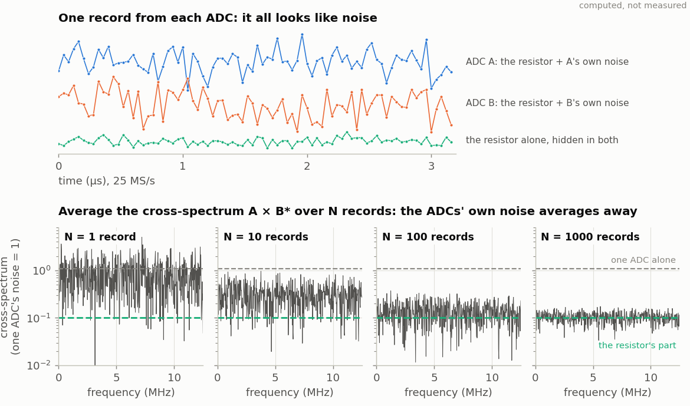

<!-- nav -->
[← 5.07 A radio link](5_07_radio_link.md#507-a-radio-link) &emsp;&emsp;&emsp; **[Contents](../README.md#contents)** &emsp;&emsp;&emsp; [6.00 Digital communications (Hardware Defined Radio) →](6_00_digital_communications.md#600-digital-communications-hardware-defined-radio)

# 5.08 With a little more hardware

Each of these starts from a design in this chapter, and none has been tried yet:

| idea | add | start from |
| --- | --- | --- |
| **[Einstein's convention](https://en.wikipedia.org/wiki/Einstein_synchronisation), tested** | one long cable in place of a short one | [5.03](5_03_time_transfer.md#503-what-time-is-it-over-there): the round trip grows, the inferred offset jumps by half, and nothing tells you which cable it was |
| **Radio, wider** | [5.07](5_07_radio_link.md#507-a-radio-link)'s loops, and an amplifier | [5.07](5_07_radio_link.md#507-a-radio-link) sends 9600 baud through the air. Try [6.07](6_07_ofdm.md#607-ofdm-the-triumph-of-physics-over-math)'s OFDM over the same loops: a tuned loop is narrow, so how many subcarriers fit, and how does each one fade as you move a loop? |
| **Light** | an LED and a [photodiode](https://en.wikipedia.org/wiki/Photodiode) with an amplifier ([4.07](4_07_optical_link.md#407-an-optical-link)) | [5.05](5_05_fsk_modem.md#505-a-modem) over a beam, then [5.03](5_03_time_transfer.md#503-what-time-is-it-over-there) over a beam: [time transfer](https://en.wikipedia.org/wiki/Time_transfer) by light, as some labs do over fibre |
| **Sound** | two 40 kHz ultrasonic transducers ([4.06](4_06_speed_of_sound.md#406-the-speed-of-sound-at-40-khz)) | [5.03](5_03_time_transfer.md#503-what-time-is-it-over-there) at audio speed: a two-way exchange through air measures the speed of sound in each direction. Blow across the path and the two directions differ: a wind meter |
| **A better clock** | a 10 MHz [GPS-disciplined](https://en.wikipedia.org/wiki/GPS_disciplined_oscillator) reference into one board's ADC | [5.04](5_04_coupled_oscillators.md#504-oscillators-that-listen-to-each-other) with KA = 0: the board follows GPS, and [5.01](5_01_two_clocks.md#501-two-clocks) then shows how much better it is than its own crystal |
| **Thermal noise** | a resistor, a preamplifier, and a tee to both ADCs | Each ADC's own noise is independent, but the resistor's noise is common. Cross-correlating the two records averages away the ADCs and leaves [Johnson noise](https://en.wikipedia.org/wiki/Johnson%E2%80%93Nyquist_noise), 4kTRB, below either ADC's floor |
| **A network** | a third board, in a ring | [5.03](5_03_time_transfer.md#503-what-time-is-it-over-there) around a triangle: can three clocks agree, and what do the three pairwise offsets add up to? |
| **Remote login** | [BusyBox](https://en.wikipedia.org/wiki/BusyBox)'s `telnet` and `telnetd` (`CONFIG_TELNET`, `CONFIG_TELNETD` and `CONFIG_FEATURE_TELNETD_STANDALONE` in `src/linux/busybox.config`; [Buildroot](https://en.wikipedia.org/wiki/Buildroot) then starts `telnetd` at every boot) | [5.05](5_05_fsk_modem.md#505-a-modem)'s [SLIP](https://en.wikipedia.org/wiki/Serial_Line_Internet_Protocol) link: log in to one FPGA computer from the other, across the cable |

## Instruments for a physics lab

Physics labs often buy a [Red Pitaya](https://redpitaya.com/), a commercial
[lock-in amplifier](https://en.wikipedia.org/wiki/Lock-in_amplifier), or National Instruments hardware and LabVIEW for these.
Each is a few designs from this tutorial plus some optics or a detector, all
of it open source. None has been tried with this board yet.

| idea | what it needs | start from |
| --- | --- | --- |
| **An open-source [Pound–Drever–Hall](https://en.wikipedia.org/wiki/Pound%E2%80%93Drever%E2%80%93Hall_technique) laser lock** | a laser whose frequency follows its current (a diode laser) or an electro-optic modulator, a Fabry–Pérot cavity, a photodiode. The DAC adds a fast modulation to a slow correction; the lock-in demodulates the reflected light into the error signal; a PI loop in the FPGA holds the laser on the cavity's resonance | [1.08](1_08_lockin.md#108-a-lock-in-amplifier), [4.08](4_08_feedback_control.md#408-feedback-control-of-an-rc-plant) |
| **An interferometer, locked to a fringe** | a Michelson interferometer with one mirror on a piezo (through a high-voltage amplifier) and a photodiode: [dither](https://en.wikipedia.org/wiki/Dither) the mirror, demodulate, and feed back, the way gravitational-wave detectors hold their arms | [1.08](1_08_lockin.md#108-a-lock-in-amplifier), [4.08](4_08_feedback_control.md#408-feedback-control-of-an-rc-plant) |
| **Saturated-absorption spectroscopy** | a diode laser, a rubidium cell and a photodiode: sweep the laser's current with the DAC, and lock-in detection pulls the narrow hyperfine lines out from under the wide Doppler profile | [1.08](1_08_lockin.md#108-a-lock-in-amplifier), [1.02](1_02_dac_sawtooth.md#102-a-sawtooth-from-the-dac)'s ramp |
| **A coincidence counter for quantum optics** | the single-photon detectors of a quantum-eraser or Bell-test experiment give logic pulses; two free FPGA pins and a counter count the coincidences within a few nanoseconds. Many undergraduate quantum labs use an FPGA for exactly this | [1.01](1_01_led_counter.md#101-a-counter-on-the-leds)'s counter, a free pin pair |
| **A muon detector** | a scintillator and a silicon photomultiplier, as in MIT's open-source [CosmicWatch](http://www.cosmicwatch.lns.mit.edu/): the ADC records each pulse's height, and two detectors in coincidence show the muons coming from above | [1.06](1_06_fast_capture.md#106-fast-captures) with a trigger |
| **The electron's charge, from [shot noise](https://en.wikipedia.org/wiki/Shot_noise)** | a photodiode, a lamp and a [low-noise amplifier](https://en.wikipedia.org/wiki/Low-noise_amplifier): the photocurrent's noise power is 2*eI* per hertz. Measure it against the current *I* with the averaged FFT, and *e* is the slope (an MIT Junior Lab classic) | [1.09](1_09_spectrum_analyzer.md#109-a-spectrum-analyzer) |
| **Boltzmann's constant, from Johnson noise** | the "Thermal noise" row above, done carefully: 4*k*B*TRB* against *R* and *T* | two boards, as above |
| **Earth's-field NMR** | a coil of a few hundred turns around a bottle of water and a preamplifier: polarize the protons with a current, switch it off, and record their precession, about 2 kHz in the Earth's field; the FFT gives the field to a few parts per million | [1.05](1_05_adc_to_python.md#105-adc-samples-to-python) or [1.06](1_06_fast_capture.md#106-fast-captures), [1.09](1_09_spectrum_analyzer.md#109-a-spectrum-analyzer) |
| **A Doppler radar speed gun** | a $5 HB100 10.5 GHz Doppler module and an op-amp: its output is the Doppler shift, 70 Hz per m/s, which the FFT turns into speed | [1.05](1_05_adc_to_python.md#105-adc-samples-to-python), [1.09](1_09_spectrum_analyzer.md#109-a-spectrum-analyzer) |
| **Music over a light beam** | the [FM](https://en.wikipedia.org/wiki/Frequency_modulation) LED transmitter of many electronics courses, done digitally: board A's ADC hears a music player and FM-modulates an LED; board B's photodiode and ADC demodulate it and stream it to `stream.py --play` | [5.05](5_05_fsk_modem.md#505-a-modem)'s phase accumulator, [4.07](4_07_optical_link.md#407-an-optical-link)'s optics |

<!-- nav -->
[← 5.07 A radio link](5_07_radio_link.md#507-a-radio-link) &emsp;&emsp;&emsp; **[Contents](../README.md#contents)** &emsp;&emsp;&emsp; [6.00 Digital communications (Hardware Defined Radio) →](6_00_digital_communications.md#600-digital-communications-hardware-defined-radio)

<!-- author -->
Jason Gallicchio, jason@hmc.edu, Harvey Mudd College
