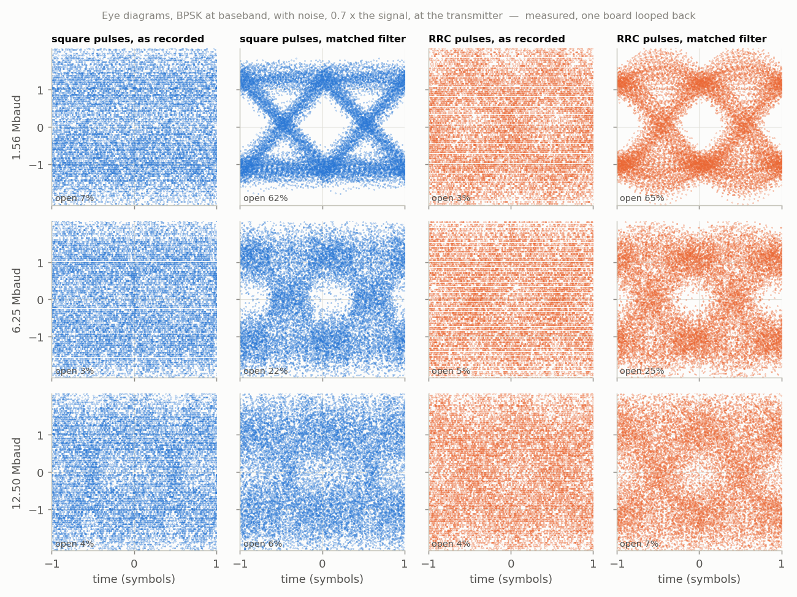
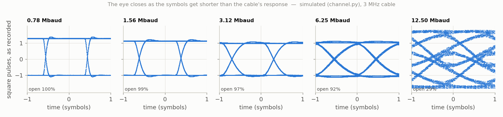

<!-- nav -->
[← 6.00 Digital communications (Hardware Defined Radio)](6_00_digital_communications.md#600-digital-communications-hardware-defined-radio) &emsp;&emsp;&emsp; **[Contents](../README.md#contents)** &emsp;&emsp;&emsp; [6.02 PSK and QPSK: finding the clock and the carrier →](6_02_psk_and_qpsk.md#602-psk-and-qpsk-finding-the-clock-and-the-carrier)

# 6.01 Eye diagrams and pulse shaping


Send a stream of random bits, +1 V for a 1 and −1 V for a 0, and record what
arrives. Now cut the record into pieces two symbols long, all starting at
the same point in a symbol, and draw them on top of each other. That's an
**eye diagram**, and it's how engineers judge a link at a glance. Where the
receiver will decide, in the middle of each symbol, every trace should be
near +1 or −1, leaving a clear gap, the "eye", between them. Anything that
smears one symbol into the next (*intersymbol interference*) or adds noise
closes the eye, and once it's shut the receiver can't tell 1s from 0s.

`eye.py` sends BPSK at baseband, with no carrier: just ±100 DAC codes, with
the bits from GPS's G1 register ([1.07](1_07_closing_the_loop.md#107-closing-the-loop-the-dac-talks-to-the-adc)), through `awgcap.sv` and the cable, at
five rates from 0.78 to 12.5 million symbols a second (*Mbaud*; the figure
shows three of them). Each loop
holds an odd number of symbols, so the ADC's 8192 samples per loop fall at
8192 different places within a symbol: folding them at the symbol period
draws the whole eye, even at two samples per symbol. It's the
equivalent-time trick of [1.07](1_07_closing_the_loop.md#107-closing-the-loop-the-dac-talks-to-the-adc), and of every sampling oscilloscope.

<details>
<summary>The whole file: <code>eye.py</code></summary>

<!-- file: src/comms/eye.py -->
```python
#!/usr/bin/env python3
"""Eye diagrams: square and root-raised-cosine pulses through the cable, faster and faster.

    python3 eye.py                      # one board looped back (finds its port)
    python3 eye.py PORT_A PORT_B        # board A plays, board B records
    python3 eye.py --sim                # no board: channel.py's model
    python3 eye.py --sim --corner 5e6   # ... with a 5 MHz low-pass in the cable
    python3 eye.py --noise 0.5          # add noise at the transmitter (rms, relative
                                        #   to the signal), to see the matched filter work
    python3 eye.py -o eye.npz --no-plot

The board runs awgcap.sv (5.01).  Each waveform is BPSK at BASEBAND, with no carrier:
the DAC's voltage is +1 or -1 (times 100 codes, about mid-scale) for each bit, the
bits from GPS's G1 register (1.07).  Two pulse shapes:

  square   the obvious one: hold the level for the whole symbol
  rrc      root-raised cosine, roll-off 0.35, as psk.py sends

and for each, the eye diagram of what the ADC records, raw and after the matched
filter (for square pulses, the matched filter averages over one symbol: "integrate
and dump"; for rrc, it is the same rrc again).

Equivalent-time sampling: each loop holds an ODD number of symbols (255, 511, ...,
4095), so the ADC's 8192 samples per loop land at 8192 different places within a
symbol, and folding them at the symbol period draws the whole eye, the trick of a
sampling oscilloscope (1.07).  Even at 12.5 Mbaud, two samples per symbol, the eye
is drawn with 8192 points.
"""
import argparse
import os
import sys

import numpy as np

HERE = os.path.dirname(os.path.abspath(__file__))
sys.path.insert(0, HERE)
import channel                                      # noqa: E402
from psk import g1, rrc, find_port                 # noqa: E402

N, L = 16384, 8192                  # DAC samples per loop; ADC samples per loop
FS_DAC, FS_ADC = 50e6, 25e6
RATES = (255, 511, 1023, 2047, 4095)    # symbols per loop: 0.78 ... 12.5 Mbaud
AMP = 100


def square(a, shift=0.0):
    """Square pulses at the DAC: levels a[0..n-1], each held for 16384/n DAC samples,
    starting `shift` DAC samples into the loop (any fraction), over and over."""
    n = len(a)
    T = N / n                                               # DAC samples per symbol
    cum = np.concatenate([[0], np.cumsum(a)]) * T           # level integrated up to each edge
    def integral(x):                                        # of the levels, from `shift` to x
        loops, x = np.divmod(x - shift, N)
        k = np.minimum(np.floor(x / T).astype(int), n - 1)
        return loops * cum[-1] + cum[k] + a[k] * (x - k * T)
    u = np.arange(N, dtype=float)
    # ##########################################################################
    # ##  KEY LINE: each DAC sample takes the average of the levels over its
    # ##  20 ns, so an edge that falls between two DAC samples gets an
    # ##  in-between value, in the right proportion.
    # ##########################################################################
    return integral(u + 1) - integral(u)


def waveform(nsym, pulse, noise=0.0, rng=None):
    """One loop of baseband BPSK: 16384 DAC codes."""
    a = 1 - 2 * g1(nsym)                            # bits 0, 1 -> +1, -1
    if pulse == "square":
        s = square(a)
    else:
        u = np.arange(N)
        t = u * nsym / N                                        # in symbols
        k0 = np.floor(t).astype(int)
        s = np.zeros(N)
        for j in range(-8, 9):
            k = k0 + j
            s += a[k % nsym] * rrc(t - k)
    s = s / np.abs(s).max()
    if noise:
        s = s + noise * np.std(s) * np.random.default_rng(rng).standard_normal(N)
    return 128 + AMP * s / max(1.0, np.abs(s).max())


def matched(x, nsym, pulse):
    """The matched filter for one loop of samples.  The loop repeats, so filter in the
    frequency domain: multiply the spectrum by the pulse's own spectrum (it is real
    and even, so that is also its complex conjugate)."""
    R = nsym / L                                    # symbols per sample
    f = np.fft.fftfreq(L)                           # cycles per sample
    if pulse == "square":
        # ######################################################################
        # ##  KEY LINE: a square pulse's spectrum is sinc(f / symbol rate), so
        # ##  this is "average over one symbol" (integrate and dump), done for
        # ##  every possible sampling instant at once.
        # ######################################################################
        H = np.sinc(f / R)
    else:
        m = np.arange(-L // 2, L // 2)
        h = rrc(m * R) * (np.abs(m * R) <= 8)
        H = np.real(np.fft.fft(np.fft.ifftshift(h)))
    return np.real(np.fft.ifft(np.fft.fft(x) * H / H[0]))


def fold(x, nsym):
    """Equivalent time: the place within its symbol of every sample, in symbols, for
    one loop of samples, shifted so that the eye's opening is centred on 0."""
    n = np.arange(L)
    # ##########################################################################
    # ##  KEY LINE: sample n is (n x nsym / 8192) symbols after the loop start,
    # ##  and nsym is odd, so these fractions are all different: 8192 places in
    # ##  one symbol.
    # ##########################################################################
    ph = (n * nsym / L) % 1.0
    c = np.arange(128) / 128
    op = np.array([opening((ph - ci + 0.5) % 1.0 - 0.5, x) for ci in c])
    # the middle of the longest stretch of (nearly) the widest opening
    good = np.concatenate([op, op]) >= op.max() - 0.02
    best, run, start = 0, 0, 0
    for i, g in enumerate(good):
        run = run + 1 if g else 0
        if run > best and run <= 128:
            best, start = run, i - run + 1
    centre = c[(start + best // 2) % 128]
    return (ph - centre + 0.5) % 1.0 - 0.5


def opening(ph, x, width=0.02):
    """How open the eye is at its centre: (lowest +1 - highest -1) / (mean +1 - mean -1).
    1 = wide open; 0 or less = shut."""
    c = np.abs(ph) < width
    up, dn = x[c & (x > 0)], x[c & (x < 0)]
    if len(up) == 0 or len(dn) == 0:
        return -1.0
    return (up.min() - dn.max()) / (up.mean() - dn.mean())


def main():
    ap = argparse.ArgumentParser(description=__doc__,
                                 formatter_class=argparse.RawDescriptionHelpFormatter)
    ap.add_argument("ports", nargs="*", help="one port: looped back; two: A plays, B records")
    ap.add_argument("--sim", action="store_true", help="use channel.py's model, not a board")
    ap.add_argument("--corner", type=float, default=40e6, help="--sim: the cable's low-pass, Hz")
    ap.add_argument("--noise", type=float, default=0.0, help="noise at the transmitter, rms relative to the signal")
    ap.add_argument("--rates", default=",".join(map(str, RATES)), help="symbols per loop (odd)")
    ap.add_argument("-o", "--out", help="save the results (.npz)")
    ap.add_argument("--no-plot", action="store_true")
    args = ap.parse_args()
    rates = [int(x) for x in args.rates.split(",")]
    if args.sim:
        rng = np.random.default_rng(1)
        play_record = lambda w: channel.channel(w, corner=args.corner, rng=rng)
    else:
        sys.path.insert(0, os.path.join(HERE, "..", "twoboard"))
        import awgcap
        ports = args.ports or [find_port()]
        def play_record(w):
            awgcap.upload(ports[0], w)
            return awgcap.record(ports[-1])
    out = {}
    print("eye opening (1 = wide open, 0 or less = shut)")
    print("  Mbaud    square raw  square matched    rrc raw  rrc matched")
    for nsym in rates:
        row = []
        for pulse in ("square", "rrc"):
            rec = play_record(waveform(nsym, pulse, args.noise, rng=nsym))
            x = rec[:L] - rec.mean()                        # one loop
            x = x / np.median(np.abs(x))
            for name, y in (("raw", x), ("matched", matched(x, nsym, pulse))):
                y = y / np.median(np.abs(y))
                ph = fold(y, nsym)
                out["%s_%s_%d" % (pulse, name, nsym)] = np.array([ph, y])
                row.append(opening(ph, y))
        print("%7.3f   %10.2f  %14.2f  %9.2f  %11.2f" % ((nsym * FS_DAC / N / 1e6,) + tuple(row)))
    if args.out:
        np.savez(args.out, rates=rates, **out)
    if not args.no_plot:
        import matplotlib.pyplot as plt
        fig, ax = plt.subplots(len(rates), 4, figsize=(12, 2.2 * len(rates)), sharex=True, sharey=True)
        ax = np.atleast_2d(ax)
        for i, nsym in enumerate(rates):
            for j, key in enumerate(("square_raw", "square_matched", "rrc_raw", "rrc_matched")):
                ph, y = out["%s_%d" % (key, nsym)]
                for shift in (-1, 0, 1):                     # draw two symbol periods
                    ax[i, j].plot(ph + shift, y, ".", markersize=0.6, color="C%d" % (j // 2))
                ax[i, j].set_xlim(-1, 1); ax[i, j].set_ylim(-2, 2); ax[i, j].grid(True)
                if i == 0:
                    ax[i, j].set_title(key.replace("_", ", "))
            ax[i, 0].set_ylabel("%.2f Mbaud" % (nsym * FS_DAC / N / 1e6))
        for a in ax[-1]:
            a.set_xlabel("time (symbols)")
        fig.tight_layout()
        plt.show()


if __name__ == "__main__":
    main()
```

</details>

```console
$ cd src/twoboard && make load-awgcap        # DAC OUT cabled to ADC IN
$ cd ../comms && python3 eye.py
eye opening (1 = wide open, 0 or less = shut)
  Mbaud    square raw  square matched    rrc raw  rrc matched
  0.778         1.00            0.98       0.72         0.94
  1.559         1.00            0.96       0.71         0.95
  3.122         0.99            0.93       0.74         0.95
  6.247         0.97            0.86       0.76         0.95
 12.497         0.97            0.78       0.71         0.93
```

## Square pulses, and why modems don't send them

Square pulses look ideal: the eye is wide open. You can see the cable ring
after each edge, but it dies out long before the middle of the next symbol.
The trouble is their spectrum. A square pulse's spectrum is a [sinc](https://en.wikipedia.org/wiki/Sinc_function),
whose sidelobes fall off only as 1/*f*: a 1 Mbaud square-pulse signal still
puts energy tens of megahertz away, on top of everyone else's channel. A
radio licence gives you a band, and you must stay inside it.

## Root-raised-cosine pulses, and the matched filter

So modems shape each symbol as a smooth pulse whose spectrum stops at
(1 + α) × half the symbol rate. The usual one is the
**root-raised cosine** (RRC); α, the *roll-off*, is the extra bandwidth, here
0.35, as digital satellite TV uses. The price is that one RRC pulse rings on
into its neighbours: the RRC eye, as recorded, is only about 70% open.

The receiver then filters with **the same pulse shape**. Two RRCs in a row
make a *raised cosine*, a pulse that is exactly zero at every other symbol's
centre, so the neighbours' ringing vanishes exactly where the receiver
looks: the eye opens to 95%, at every rate. This is *Nyquist's criterion*
for no intersymbol interference (learnSDR's [lesson 14](https://github.com/gallicchio/learnSDR/blob/main/docs/lesson14.md)): the pulse may
do what it likes between symbols, as long as it is zero at every other
symbol's centre. The raised cosine is the standard pulse that does it with
a spectrum that stops at (1 + α)*R*/2, and the square root is split between
the two ends so that the receiver's half is also the matched filter
([lesson 15](https://github.com/gallicchio/learnSDR/blob/main/docs/lesson15.md); PySDR's [pulse-shaping chapter](https://pysdr.org/content/pulse_shaping.html) derives the same thing):


That second filter isn't just a tidy trick. Filtering with the pulse's own
shape, the **matched filter**, gives the best [signal-to-noise ratio](https://en.wikipedia.org/wiki/Signal-to-noise_ratio) any
linear filter can: it weights each moment by how much of the signal is
there, and white noise is the same everywhere. Its output signal-to-noise
ratio is 2*E*/*N*<sub>0</sub>, the pulse's energy against the noise density,
whatever the pulse's shape. For square pulses the matched filter is a running
average over one symbol ("integrate and dump"). Its eye closes a little at
high rates (0.78 open at 12.5 Mbaud): the averaging is done on the ADC's
samples, and a square edge has energy above 12.5 MHz that the ADC has
already folded onto the signal, so the digital "integrate and dump" isn't
quite the analog one. Sampled receivers want band-limited pulses.

With noise almost as large as the signal (its rms 0.7 times the signal's, added at the
transmitter), the raw eyes shut completely, and the matched filters open
them again, as long as each symbol holds enough samples to average:



At 1.56 Mbaud each symbol is 16 ADC samples and the filter averages the noise
down by about √16; at 12.5 Mbaud there are only 2 samples per symbol to
average, and the eye stays shut. This is the trade every link makes: fewer
symbols per second, or more signal, or more errors.

A slow channel closes the eye from the other side. Through a cable with a
3 MHz low-pass in it (simulated here), each symbol's step takes longer than
a symbol at the higher rates, and the levels pile up:



**Try this:**

- Put [4.02](4_02_rc_and_lc_circuits.md#402-rc-and-lc-circuits)'s RC low-pass in the cable and measure the slow-channel eye for
  real. At what corner frequency does each rate's eye close?
- Four levels instead of two (±1 and ±3: *PAM-4*, as in Ethernet and some
  DDR memory) carry two bits per symbol. Change the levels in `eye.py` and
  watch three small eyes appear in place of one big one.
- Change the roll-off α. Smaller α makes a narrower spectrum but longer
  ringing: what happens to the raw RRC eye, and to the matched one if the
  timing is a little off?

<!-- author -->
<sub>Jason Gallicchio, jason@hmc.edu, Harvey Mudd College</sub>
