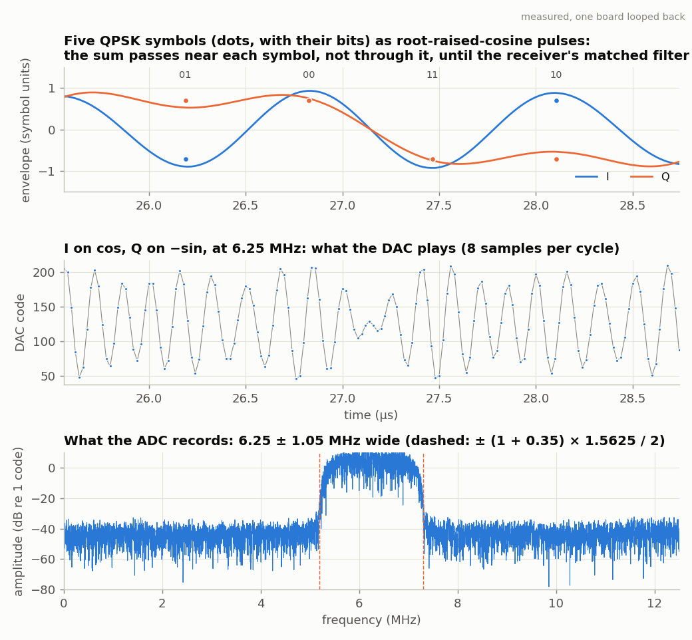
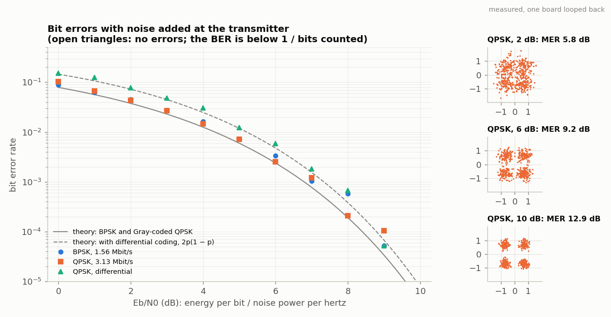

<!-- nav -->
[← 6.01 Eye diagrams and pulse shaping](6_01_eye_diagrams.md#601-eye-diagrams-and-pulse-shaping) &emsp;&emsp;&emsp; **[Contents](../README.md#contents)** &emsp;&emsp;&emsp; [6.03 QAM: more bits per symbol →](6_03_qam.md#603-qam-more-bits-per-symbol)

# 6.02 PSK and QPSK: finding the clock and the carrier

![Measured, one board looped back, with the transmitter's carrier 3052 Hz high and its symbols 1953 ppm fast on purpose. Top: before the loops, every 16th sample is a ring, because the carrier offset turns the constellation twice in one record and the wrong sampling instants fill it in; after the two loops, four tight clusters and 0 errors in 962 bits; the eye after the matched filter. Middle: the timing loop's sampling point drifts steadily as it learns the symbol rate, settling at the 1953 ppm that was sent, and its detector's output per symbol. Bottom: the Costas loop turns the constellation steadily as it learns the carrier offset, settling at the 3052 Hz that was sent, and its detector's output](img/comms_psk_loops.png)

The lock-in of [1.08](1_08_lockin.md#108-a-lock-in-amplifier) measures a sine's amplitude and phase as one complex
number, X + *j*Y. **Phase-shift keying** makes the phase the message. The
transmitter holds its carrier's phase at one of two values for each symbol
(**BPSK**: 0° or 180°, one bit) or one of four (**[QPSK](https://en.wikipedia.org/wiki/Phase-shift_keying#Quadrature_phase-shift_keying_(QPSK))**: 45°, 135°, 225° or 315°,
two bits), and the receiver is a lock-in with a very short average, one
symbol long, that reads back which. QPSK is really two BPSK signals at once,
one on cos and one on −sin: over a symbol they're orthogonal, so they share
the band without disturbing each other, and QPSK carries twice the bits in
the same bandwidth. GPS, Wi-Fi's slowest rates, satellite TV and deep-space
probes all use one or the other.

## The transmitter

`psk.py` builds one loop's worth of signal for `awgcap.sv` ([5.01](5_01_two_clocks.md#501-two-clocks)) to play:

- **Bits** from GPS's G1 register ([1.07](1_07_closing_the_loop.md#107-closing-the-loop-the-dac-talks-to-the-adc)), a pseudo-random sequence.
- **Symbols** with *Gray coding*: the bit pairs 00, 01, 11, 10 go around the
  circle in that order, so mistaking a symbol for its neighbour, the usual
  error, costs only one bit.
- **A frame**: each loop starts with a 32-symbol *unique word* the receiver
  knows (more on why below), then 480 data symbols.
- **Pulses**: root-raised cosines ([6.01](6_01_eye_diagrams.md#601-eye-diagrams-and-pulse-shaping)), 512 symbols per loop: 1.5625 million
  symbols a second, 16 ADC samples each.
- **The carrier**: I on cos and Q on −sin at 6.25 MHz, 2048 whole cycles per
  loop, so the loop has no seam.



## The receiver, and what it doesn't know

The whole receiver, and the transmitter, are in one file:

<details>
<summary>The whole file: <code>psk.py</code></summary>

<!-- file: src/comms/psk.py -->
```python
#!/usr/bin/env python3
"""BPSK and QPSK through the cable, received with a Gardner timing loop and a Costas loop.

    python3 psk.py                      # QPSK, one board looped back (finds its port)
    python3 psk.py PORT_A PORT_B        # board A plays, board B records
    python3 psk.py --sim                # no board: the channel model of channel.py
    python3 psk.py --sim --ppm 0.76     #   ... pretending to be two boards
    python3 psk.py --bpsk               # BPSK instead (one bit per symbol)
    python3 psk.py --cfo 3000 --sro 2000    # give the loops work to do: the transmitter's
                                        #   carrier 3 kHz high, its symbols 2000 ppm fast
    python3 psk.py --ebn0 6             # add noise at the transmitter: Eb/N0 = 6 dB
    python3 psk.py --ber 0:10           # bit error rate against Eb/N0, 0 to 10 dB
    python3 psk.py --diff               # differential coding instead of the unique word
    python3 psk.py -o psk.npz --no-plot

The board runs awgcap.sv (5.01): it plays a 16384-sample waveform at 50 MS/s, over
and over (one loop = 327.68 us), and records 16384 samples at 25 MS/s (two loops).

TRANSMITTER (here, in Python; the board just plays the result)
  bits    GPS's G1 register (1.07), a pseudo-random sequence that repeats every 1023 bits
  symbols Gray-coded: BPSK +1 or -1; QPSK one of four points at 45, 135, 225, 315 deg
  frame   one frame per loop: a 32-symbol unique word, then 480 symbols of data
  pulses  root-raised-cosine, roll-off 0.35, 512 symbols per loop = 1.5625 Msymbol/s
  carrier 6.25 MHz: a quarter of the ADC's 25 MS/s, and exactly 2048 cycles per loop

Everything is a whole number of cycles per loop, or the waveform would jump at the
loop's seam.  So --cfo moves the carrier in steps of 1/327.68 us = 3051.76 Hz, and
--sro adds or removes whole symbols per loop (1 in 512 = 1953 ppm).

Why these numbers: 6.25 MHz sits in the middle of the ADC's 0-12.5 MHz, far from the
converters' offsets near 0 and the DAC's images near 12.5 MHz, and at a quarter of
25 MS/s mixing down is multiplying by 1, -j, -1, j.  16 samples per symbol make
smooth eyes and leave the timing loop room to work; the signal is 1.35 x 1.5625 =
2.1 MHz wide (5.2-7.3 MHz).  Roll-off 0.35 is what DVB-S, digital satellite TV, uses.

RECEIVER (in Python, on the record)
  1. mix down with cos and -sin at 6.25 MHz, as the lock-in (1.08) does
  2. matched filter: the same root-raised-cosine
  3. Gardner timing loop: where, between samples, is the middle of each symbol?
  4. Costas loop: which way is up?  It turns the constellation to square it up
  5. the unique word fixes the 90-degree (QPSK) or 180-degree (BPSK) ambiguity
     that's left (or, with --diff, the data are in the CHANGES of phase), and
     shows where each frame starts; then count the bit errors

Both loops are second order (they learn a frequency as well as a phase), with noise
bandwidths of 0.01 (timing) and 0.02 (carrier) times the symbol rate, 16 and 31 kHz.
They settle in about 300 symbols; the first 400 aren't counted.  Wider loops lock
faster but jitter more; narrower ones are quieter but slow, and lose lock more easily
when the transmitter's carrier is off.
"""
import argparse
import math
import os
import sys

import numpy as np

HERE = os.path.dirname(os.path.abspath(__file__))
sys.path.insert(0, HERE)
import channel                                              # noqa: E402

N = 16384                       # DAC samples per loop
FS_DAC, FS_ADC = 50e6, 25e6
F_LOOP = FS_DAC / N             # 3051.76 Hz: anything periodic in the loop is a multiple
F_C = 6.25e6                    # carrier: FS_ADC / 4, 2048 cycles per loop
NSYM = 512                      # symbols per loop: 1.5625 Msymbol/s, 16 ADC samples each
ALPHA = 0.35                    # root-raised-cosine roll-off (excess bandwidth)
NUW = 32                        # unique-word symbols at the start of each frame
UW_START = 319                  # ... taken from G2 starting here: its shifted copies
                                #   match it by at most 18% (BPSK and QPSK)
SPAN = 6                        # pulses are cut off this many symbols each side
AMP = 100                       # the waveform's peaks, DAC codes from mid-scale


# ---- bits -------------------------------------------------------------------------
def lfsr(taps, n, out_stage=10, start=0):
    """A 10-stage shift register, as loopback.sv's: each step shifts left, feeding the
    XOR of the `taps` stages into stage 1, and outputs stage 10.  Starts all ones.
    Returns n bits (0/1), starting `start` steps in."""
    reg = [1] * 10                                   # reg[0] is stage 1
    seq = []
    for _ in range(1023):
        seq.append(reg[out_stage - 1])
        fb = 0
        for t in taps:
            fb ^= reg[t - 1]
        reg = [fb] + reg[:9]
    return np.resize(np.roll(np.array(seq), -start), n)


def g1(n, start=0):
    """GPS's G1: x^10 + x^3 + 1."""
    return lfsr((3, 10), n, start=start)


def g2(n, start=0):
    """GPS's G2: x^10 + x^9 + x^8 + x^6 + x^3 + x^2 + 1."""
    return lfsr((2, 3, 6, 8, 9, 10), n, start=start)


# ---- symbols ----------------------------------------------------------------------
# A symbol is a whole number q of turns of 360/M degrees: BPSK (M = 2) sends
# e^(j pi q), QPSK (M = 4) e^(j (pi/4 + q pi/2)).  Gray code: bit pairs 00 01 11 10
# go to q = 0 1 2 3, so neighbouring points differ in only one bit.
GRAY = {2: [0, 1], 4: [0, 1, 3, 2]}           # q -> the bits it carries, as a number


def point(q, M):
    """The constellation point for symbol number q (a complex number of size 1)."""
    q = np.asarray(q)
    return np.exp(1j * np.pi * q) if M == 2 else np.exp(1j * (np.pi / 4 + np.pi / 2 * q))


def bits_to_q(bits, M):
    """Bits (0/1, 1 or 2 per symbol) -> symbol numbers q."""
    b = int(math.log2(M))
    v = bits.reshape(-1, b) @ (1 << np.arange(b)[::-1])          # bits -> number
    # ##########################################################################
    # ##  KEY LINE: Gray code.  Bits 00 01 11 10 -> q = 0 1 2 3: a small error
    # ##  (to a neighbouring point) costs only one bit.
    # ##########################################################################
    return np.argsort(GRAY[M])[v]


def q_to_bits(q, M):
    """Symbol numbers q -> the bits they carry."""
    b = int(math.log2(M))
    v = np.array(GRAY[M])[np.asarray(q) % M]
    return ((v[:, None] >> np.arange(b)[::-1]) & 1).ravel()


def decide(z, M):
    """The nearest constellation point to each z: returns q."""
    if M == 2:
        return (z.real < 0).astype(int)
    return np.round((np.angle(z) - np.pi / 4) / (np.pi / 2)).astype(int) % 4


def make_frame(M, nsym=NSYM, start=0, diff=False):
    """One loop's symbols.  Returns (q of every symbol, the data bits)."""
    b = int(math.log2(M))
    uw = bits_to_q(g2(NUW * b, start=UW_START), M)   # the unique word: from G2
    data = g1((nsym - NUW) * b, start=start)         # the data: G1, a PRBS-10
    dq = bits_to_q(data, M)
    if diff:
        # ######################################################################
        # ##  KEY LINE: differential coding.  The data say how far to TURN from
        # ##  the previous symbol, not where to point.
        # ######################################################################
        dq = (uw[-1] + np.cumsum(dq)) % M
    return np.concatenate([uw, dq]), data


# ---- pulses -----------------------------------------------------------------------
def rrc(t, alpha=ALPHA):
    """Root-raised-cosine pulse; t in symbol periods.  Not normalized."""
    t = np.asarray(t, float)
    out = np.empty_like(t)
    a = alpha
    zero = np.isclose(t, 0)
    edge = np.isclose(np.abs(t), 1 / (4 * a))
    ok = ~(zero | edge)
    tt = t[ok]
    out[ok] = (np.sin(np.pi * tt * (1 - a)) + 4 * a * tt * np.cos(np.pi * tt * (1 + a))) / \
              (np.pi * tt * (1 - (4 * a * tt)**2))
    out[zero] = 1 - a + 4 * a / np.pi
    out[edge] = a / np.sqrt(2) * ((1 + 2 / np.pi) * np.sin(np.pi / (4 * a)) +
                                  (1 - 2 / np.pi) * np.cos(np.pi / (4 * a)))
    return out


def rc(t, alpha=ALPHA):
    """Raised-cosine pulse (= rrc convolved with itself), 1 at t = 0; t in symbols."""
    t = np.asarray(t, float)
    den = 1 - (2 * alpha * t)**2
    safe = np.where(np.isclose(den, 0), 1, den)
    return np.where(np.isclose(den, 0), np.pi / 4 * np.sinc(1 / (2 * alpha)),
                    np.sinc(t) * np.cos(np.pi * alpha * t) / safe)


# ---- transmitter ------------------------------------------------------------------
def transmit(q, M, cfo_bins=0, ebn0=None, rng=None):
    """The DAC waveform (16384 codes) for one loop of symbols q, on the carrier, with
    optional noise.  Symbols per loop = len(q), any whole number."""
    nsym = len(q)
    a = point(q, M)
    u = np.arange(N)                                  # DAC sample number
    t = u * nsym / N                                  # ... in symbol periods
    k0 = np.floor(t).astype(int)
    env = np.zeros(N, complex)                        # the complex envelope I + jQ
    for j in range(-SPAN - 2, SPAN + 3):
        k = k0 + j
        # ######################################################################
        # ##  KEY LINE: pulse shaping.  Each symbol is a root-raised-cosine
        # ##  pulse centred on its own time k; the waveform is their sum.
        # ######################################################################
        env += a[k % nsym] * rrc(t - k)
    fc = F_C + cfo_bins * F_LOOP
    # ##########################################################################
    # ##  KEY LINE: onto the carrier.  I rides on cos, Q on -sin, so that the
    # ##  lock-in's  < s e^(-jwt) >  gives back I + jQ.
    # ##########################################################################
    s = np.real(env * np.exp(2j * np.pi * fc * u / FS_DAC))
    if ebn0 is not None:
        s = s + noise_for(s, ebn0, M, nsym, fc, rng)
    return 128 + AMP * s / np.abs(s).max()


def noise_for(s, ebn0_db, M, nsym, fc, rng):
    """White Gaussian noise for Eb/N0 = ebn0_db, in a band fc +- the symbol rate
    (wider than the signal, 1.35x the symbol rate in all, so the matched filter
    sees it as white).  Periodic in the loop, like everything the DAC plays."""
    rng = np.random.default_rng(rng)
    R = nsym * F_LOOP                                 # symbols per second
    Eb = np.mean(s**2) / R / math.log2(M)             # signal power x time per bit
    N0 = Eb / 10**(ebn0_db / 10)                      # one-sided noise density
    k = np.arange(N // 2 + 1)
    band = np.abs(k * F_LOOP - fc) <= R
    var = N0 * band.sum() * F_LOOP                    # noise power = N0 x bandwidth
    X = np.zeros(N // 2 + 1, complex)
    X[band] = rng.standard_normal(band.sum()) + 1j * rng.standard_normal(band.sum())
    x = np.fft.irfft(X, N)
    return x * np.sqrt(var) / x.std()


# ---- receiver ---------------------------------------------------------------------
def loop_gains(bnt, kd, zeta=1 / np.sqrt(2)):
    """Proportional and integral gains of a second-order loop with noise bandwidth
    bnt (in units of the update rate, here once per symbol) and damping zeta, when
    its detector gives kd per unit of error (Rice, Digital Communications, App. C)."""
    th = bnt / (zeta + 1 / (4 * zeta))
    d = 1 + 2 * zeta * th + th**2
    return 4 * zeta * th / d / kd, 4 * th**2 / d / kd


def gardner_gain(sps, alpha=ALPHA):
    """Slope of the Gardner detector's average output against timing error (per
    sample), for unit-power symbols and raised-cosine pulses: its "S-curve" at 0."""
    j = np.arange(-20, 21)
    def S(tau):                                       # tau in samples
        x = tau / sps
        return np.sum(rc(j - 0.5 + x, alpha) * (rc(j + x, alpha) - rc(j - 1 + x, alpha)))
    return (S(0.01) - S(-0.01)) / 0.02


def interp(y, t):
    """y at fractional sample t: cubic through the 4 nearest samples (a Farrow
    interpolator, as an FPGA would do it)."""
    i = int(t)
    mu = t - i
    ym1, y0, y1, y2 = y[i - 1], y[i], y[i + 1], y[i + 2]
    c1 = -ym1 / 3 - y0 / 2 + y1 - y2 / 6
    c2 = ym1 / 2 - y0 + y1 / 2
    c3 = -ym1 / 6 + y0 / 2 - y1 / 2 + y2 / 6
    return ((c3 * mu + c2) * mu + c1) * mu + y0


def matched(rec, nsym=NSYM):
    """Steps 1 and 2: mix down, matched-filter.  Returns the complex baseband signal at
    25 MS/s, scaled so that the symbols come out about 1 in size."""
    sps = FS_ADC * N / FS_DAC / nsym                 # samples per symbol (16.0)
    r = rec - np.mean(rec)
    n = np.arange(len(r))
    # ##########################################################################
    # ##  KEY LINE: the lock-in again: multiply by cos and -sin, i.e. by
    # ##  e^(-jwt).  At 6.25 MHz = 25 MS/s / 4 that's just 1, -j, -1, j, ...
    # ##########################################################################
    z = 2 * r * np.exp(-2j * np.pi * F_C * n / FS_ADC)
    m = np.arange(-int(SPAN * sps), int(SPAN * sps) + 1)
    h = rrc(m / sps)
    # ##########################################################################
    # ##  KEY LINE: the matched filter: the same pulse shape again.  It throws
    # ##  away the 12.5 MHz (2 x carrier) part of the mixing, and all noise
    # ##  outside the signal's band, and makes the pulses raised cosines.
    # ##########################################################################
    y = np.convolve(z, h, mode="same")
    return y * np.sqrt(1 - ALPHA / 4) / np.sqrt(np.mean(np.abs(y)**2))


def timing_loop(y, sps, bnt=0.01, t0=None):
    """Step 3: Gardner's timing loop.  Returns the symbols (one complex number each),
    the time of each (in samples), and the loop's error and period, symbol by symbol."""
    kd = gardner_gain(sps)
    k1, k2 = loop_gains(bnt, kd)
    t = sps if t0 is None else t0                    # a guess for the first symbol
    t_prev = t - sps
    y_prev = interp(y, t_prev)
    integ = 0.0
    out, times, errs, periods = [], [], [], []
    while t + 3 < len(y):
        y_now = interp(y, t)
        y_mid = interp(y, (t_prev + t) / 2)          # half-way between this symbol and the last
        # ######################################################################
        # ##  KEY LINE: Gardner's timing error.  Half-way between two different
        # ##  symbols the signal should be crossing zero.  If it has already
        # ##  crossed (in the direction it was going), we are sampling late: e > 0.
        # ######################################################################
        e = np.real(np.conj(y_mid) * (y_now - y_prev))
        # ######################################################################
        # ##  KEY LINES: the loop filter.  A little of e moves this one symbol;
        # ##  e summed up (integ) learns the transmitter's symbol period.
        # ######################################################################
        integ += k2 * e
        step = sps - (k1 * e + integ)
        out.append(y_now); times.append(t); errs.append(e); periods.append(sps - integ)
        t_prev, y_prev = t, y_now
        t += step
    return np.array(out), np.array(times), np.array(errs), np.array(periods)


def costas(z, M, bnt=0.02):
    """Step 4: the Costas loop, once per symbol.  Returns the turned symbols, and the
    loop's phase (rad), frequency (rad per symbol) and error, symbol by symbol."""
    k1, k2 = loop_gains(bnt, 1.0)                    # detector: sin(error) ~ error
    phi = w = 0.0
    out, phis, ws, errs = [], [], [], []
    for zk in z:
        zr = zk * np.exp(-1j * phi)                  # turn back by our phase estimate
        d = point(decide(zr, M), M)                  # the nearest constellation point
        # ######################################################################
        # ##  KEY LINE: the phase detector.  Im(z d*) = |z| sin(angle from z to
        # ##  the nearest point): how far the symbol is turned from where it
        # ##  belongs.  (For BPSK this is Q * sign(I), almost the I*Q of the
        # ##  original Costas loop.)
        # ######################################################################
        e = np.imag(zr * np.conj(d))
        # ######################################################################
        # ##  KEY LINES: the loop filter.  w integrates e: it learns the carrier's
        # ##  frequency offset (radians per symbol).  phi integrates w + k1 e.
        # ######################################################################
        w += k2 * e
        out.append(zr); phis.append(phi); ws.append(w); errs.append(e)
        phi += w + k1 * e
    return np.array(out), np.array(phis), np.array(ws), np.array(errs)


def score(zc, M, nsym, q_tx, diff=False, skip=400):
    """Step 5: find each frame's unique word, undo the constellation's leftover turn,
    and count bit errors in one loop's worth of symbols after `skip` (the loops' time
    to settle).  Returns a dict."""
    uw = point(q_tx[:NUW], M)
    K = len(zc)
    c = np.array([np.vdot(uw, zc[k:k + NUW]) / NUW for k in range(K - NUW)])   # sum z uw*
    # Frames repeat every nsym symbols: the biggest peak marks one of them; let each
    # other frame's own peak move by a symbol or two (in case the timing slipped).
    p0 = int(np.argmax(np.abs(c[skip // 2:]))) + skip // 2
    starts, seen = [], []
    for p in range(p0 - nsym, K, nsym):
        if 2 <= p < len(c) - 2:                        # a unique word inside the record
            p = p - 2 + int(np.argmax(np.abs(c[p - 2:p + 3])))
            seen.append(len(starts))
        starts.append(p)
    starts = np.array(starts)
    # ##########################################################################
    # ##  KEY LINE: the phase ambiguity.  The Costas loop squares the
    # ##  constellation up but can't know which way is up: it may be off by a
    # ##  multiple of 90 deg (QPSK) or 180 deg (BPSK).  The unique word's
    # ##  correlation points the way: round its angle to a multiple of 360/M.
    # ##########################################################################
    rot = np.round(np.angle(c[starts[seen]]) / (2 * np.pi / M)).astype(int)
    # a frame whose unique word fell outside the record borrows its neighbour's
    rot = rot[np.clip(np.searchsorted(seen, np.arange(len(starts))), 0, len(seen) - 1)]
    q_rx = decide(zc, M)
    bits_per = int(math.log2(M))
    errs = nbits = 0
    sq_err = []
    for k in range(skip, min(skip + nsym, K)):
        f = np.searchsorted(starts, k, side="right") - 1      # the frame this symbol is in
        if f < 0:
            continue
        i = k - starts[f]                                     # position in the frame
        if i < NUW + (1 if diff else 0) or i >= nsym:
            continue
        if diff:
            dq = (q_rx[k] - q_rx[k - 1]) % M                  # how far it turned
            want = (q_tx[i] - q_tx[i - 1]) % M
        else:
            dq = (q_rx[k] - rot[f]) % M
            want = q_tx[i]
        errs += int(np.sum(q_to_bits([dq], M) != q_to_bits([want], M)))
        nbits += bits_per
        sq_err.append(abs(zc[k] * np.exp(-2j * np.pi * rot[f] / M) - point(q_tx[i], M))**2)
    mer = -10 * np.log10(np.mean(sq_err)) if sq_err else float("nan")
    return dict(errs=errs, nbits=nbits, mer=mer, starts=starts, rot=rot, uwcorr=c)


def receive(rec, M, nsym_tx=NSYM, q_tx=None, diff=False, bnt_timing=0.01,
            bnt_carrier=0.02, skip=400):
    """The whole receiver.  nsym_tx and q_tx are only for counting errors: the loops
    assume the nominal 512 symbols per loop and the nominal carrier."""
    sps = FS_ADC * N / FS_DAC / NSYM
    y = matched(rec)
    zs, times, ted, period = timing_loop(y, sps, bnt_timing)
    zs = zs / np.sqrt(np.mean(np.abs(zs)**2))         # symbols: rms 1
    zc, phi, w, ec = costas(zs, M, bnt_carrier)
    out = dict(y=y, sps=sps, times=times, ted=ted, period=period, zs=zs, zc=zc,
               phi=phi, w=w, ec=ec, naive=y[np.arange(int(sps), len(y) - 1, sps).astype(int)])
    if q_tx is not None:
        out.update(score(zc, M, nsym_tx, q_tx, diff, skip))
    return out


def eye(r, M, skip=400, nsym=600, res=8):
    """Eye-diagram traces from the matched filter's output: two symbol periods
    around each symbol time the timing loop found, turned by the Costas loop's
    phase and the unique word's.  Returns (time in symbols, traces)."""
    y, sps, times = r["y"], r["sps"], r["times"]
    rot = np.exp(-2j * np.pi * (r["rot"][-1] if "rot" in r else 0) / M)
    tau = np.arange(-res * sps, res * sps + 1) / res          # samples, -1..+1 symbol
    tr = []
    for k in range(skip, min(skip + nsym, len(times))):
        tt = times[k] + tau
        if tt[0] < 2 or tt[-1] > len(y) - 3:
            continue
        tr.append(channel.cubic(y, tt) * np.exp(-1j * r["phi"][k]) * rot)
    return tau / sps, np.array(tr)


# ---- the board, or the model ------------------------------------------------------
def find_port():
    """The first FTDI FT231X serial port (USB ID 0403:6015): the Icepi Zero's."""
    from serial.tools import list_ports
    for p in list_ports.comports():
        if (p.vid, p.pid) == (0x0403, 0x6015):
            return p.device
    raise SystemExit("No Icepi Zero found. Is it plugged in? (Or give its port, or --sim.)")


def make_link(args):
    """Returns play(wave) and record() for the board(s), or for the model."""
    if args.sim:
        rng = np.random.default_rng(args.seed)
        st = {"wave": None, "start": rng.uniform(0, N)}
        def play(wave):
            st["wave"] = wave
        def record():
            if args.ppm:                              # two boards
                return channel.channel(st["wave"], start=st["start"], ppm=args.ppm, rng=rng)
            return channel.channel(st["wave"], rng=rng)
        return play, record
    sys.path.insert(0, os.path.join(HERE, "..", "twoboard"))
    import awgcap
    ports = args.ports or [find_port()]
    tx, rx = ports[0], ports[-1]
    return (lambda wave: awgcap.upload(tx, wave)), (lambda: awgcap.record(rx))


def ber_theory(ebn0_db, diff=False):
    """Coherent BPSK, or Gray-coded QPSK, per bit: Q(sqrt(2 Eb/N0)).  Differential
    encoding with a coherent receiver gives exactly 2p(1 - p): one wrong symbol spoils
    two differences."""
    p = 0.5 * math.erfc(math.sqrt(10**(ebn0_db / 10)))
    return 2 * p * (1 - p) if diff else p


def run_once(args, M, play, record, start=0, ebn0=None, rng=None):
    """Make a frame, play it, record it, receive it.  args: sro, cfo, diff, bnt_timing,
    bnt_carrier, skip (as the command line's)."""
    nsym_tx = NSYM + int(round(args.sro * 1e-6 * NSYM))
    q, data = make_frame(M, nsym_tx, start=start, diff=args.diff)
    cfo_bins = int(round(args.cfo / F_LOOP))
    play(transmit(q, M, cfo_bins, ebn0=ebn0, rng=rng))
    rec = record()
    r = receive(rec, M, nsym_tx, q, args.diff, args.bnt_timing, args.bnt_carrier, args.skip)
    r.update(rec=rec, q_tx=q, nsym_tx=nsym_tx, cfo=cfo_bins * F_LOOP,
             sro=(nsym_tx / NSYM - 1) * 1e6, M=M)
    return r


def plot(r, M, title, skip=400):
    """Constellations before and after, the eye, and the two loops at work."""
    import matplotlib.pyplot as plt
    R = NSYM * F_LOOP
    k = np.arange(len(r["zc"]))
    us = k / R * 1e6                                         # time, microseconds
    fig, ax = plt.subplots(2, 3, figsize=(13, 7.5))
    a = ax[0, 0]
    zn = r["naive"] / np.sqrt(np.mean(np.abs(r["naive"])**2))
    a.plot(zn.real, zn.imag, ".", markersize=2)
    a.set_title("before the loops: one sample every 16")
    a = ax[0, 1]
    good = k >= skip
    zr = r["zc"] * np.exp(-2j * np.pi * (r["rot"][-1] if "rot" in r else 0) / M)
    a.plot(zr[~good].real, zr[~good].imag, ".", color="0.75", markersize=2, label="settling")
    a.plot(zr[good].real, zr[good].imag, ".", markersize=2, label="after %d symbols" % skip)
    a.set_title("after the loops: %d errors in %d bits" % (r.get("errs", 0), r.get("nbits", 0)))
    a.legend(loc="upper right", fontsize=8)
    for a in ax[0, :2]:
        a.set_aspect("equal"); a.set_xlim(-1.8, 1.8); a.set_ylim(-1.8, 1.8)
        a.set_xlabel("I"); a.set_ylabel("Q"); a.grid(True)
    a = ax[0, 2]
    tau, tr = eye(r, M, skip)
    for x in tr[:300]:
        a.plot(tau, x.real, color="C0", lw=0.3, alpha=0.4)
    a.set_xlabel("time from the symbol's centre (symbols)"); a.set_ylabel("I (after both loops)")
    a.set_title("eye diagram, I"); a.grid(True)
    a = ax[1, 0]
    a.plot(us, r["times"] - r["sps"] * k, ".", markersize=1.5)
    a.set_xlabel("time (us)"); a.set_ylabel("sampling time - k x 16 (samples)")
    a.set_title("timing loop: where it samples symbol k")
    a2 = a.twinx()
    a2.plot(us, (r["sps"] / r["period"] - 1) * 1e6, color="C1", lw=1)
    a2.set_ylabel("symbol rate offset it found (ppm)", color="C1")
    a.grid(True)
    a = ax[1, 1]
    a.plot(us, np.degrees(r["phi"]), lw=1)
    a.set_xlabel("time (us)"); a.set_ylabel("phase correction (deg)")
    a.set_title("Costas loop"); a.grid(True)
    a2 = a.twinx()
    a2.plot(us, r["w"] * R / (2 * np.pi) / 1e3, color="C1", lw=1)
    a2.set_ylabel("carrier offset it found (kHz)", color="C1")
    a = ax[1, 2]
    a.plot(us, r["ted"], ".", markersize=1.5, label="Gardner (timing)")
    a.plot(us, r["ec"], ".", markersize=1.5, label="Costas (phase)")
    a.set_xlabel("time (us)"); a.set_ylabel("error signal"); a.legend(fontsize=8)
    a.set_title("what the loops' detectors say"); a.grid(True)
    fig.suptitle(title)
    fig.tight_layout()
    plt.show()


if __name__ == "__main__":
    ap = argparse.ArgumentParser(description=__doc__,
                                 formatter_class=argparse.RawDescriptionHelpFormatter)
    ap.add_argument("ports", nargs="*", help="one port: looped back; two: A plays, B records")
    ap.add_argument("--sim", action="store_true", help="use channel.py's model, not a board")
    ap.add_argument("--ppm", type=float, default=0.0, help="--sim: pretend to be two boards, A this many ppm fast")
    ap.add_argument("--bpsk", action="store_true", help="BPSK (default QPSK)")
    ap.add_argument("--cfo", type=float, default=0.0, help="transmitter's carrier offset, Hz (rounded to 3051.76 Hz steps)")
    ap.add_argument("--sro", type=float, default=0.0, help="transmitter's symbol-rate offset, ppm (rounded to 1953 ppm steps)")
    ap.add_argument("--ebn0", type=float, help="add noise at the transmitter: Eb/N0 in dB")
    ap.add_argument("--ber", help="measure BER at Eb/N0 = LO:HI dB (1 dB steps)")
    ap.add_argument("--records", type=int, default=40, help="--ber: at most this many uploads per point")
    ap.add_argument("--diff", action="store_true", help="differential coding")
    ap.add_argument("--bnt-timing", type=float, default=0.01, help="timing loop bandwidth x symbol time")
    ap.add_argument("--bnt-carrier", type=float, default=0.02, help="Costas loop bandwidth x symbol time")
    ap.add_argument("--skip", type=int, default=400, help="symbols to let the loops settle")
    ap.add_argument("--seed", type=int, default=1)
    ap.add_argument("-o", "--out", help="save the results (.npz)")
    ap.add_argument("--no-plot", action="store_true")
    args = ap.parse_args()
    M = 2 if args.bpsk else 4
    name = "BPSK" if M == 2 else "QPSK"
    play, record = make_link(args)
    R = NSYM * F_LOOP

    if args.ber:
        lo, hi = (float(x) for x in args.ber.split(":"))
        rng = np.random.default_rng(args.seed)
        rows = []
        print("%s%s, %.4g Msymbol/s: Eb/N0 (dB), bit errors, bits, BER, theory, MER (dB)"
              % (name, " (differential)" if args.diff else "", R / 1e6))
        for eb in np.arange(lo, hi + 0.01, 1.0):
            e = nb = 0; mers = []
            for i in range(args.records):
                # a fresh noise waveform and fresh data for every upload: within one
                # upload the noise repeats every loop, so count one loop's worth
                r = run_once(args, M, play, record, start=int(rng.integers(0, 1023)), ebn0=eb, rng=rng)
                e += r["errs"]; nb += r["nbits"]; mers.append(r["mer"])
                if e >= 200 and i >= 2:
                    break
            th = ber_theory(eb, args.diff)
            rows.append((eb, e, nb, e / nb, th, np.mean(mers)))
            print("%5.1f %6d %8d  %.2e  %.2e  %5.1f" % rows[-1], flush=True)
        if args.out:
            np.savez(args.out, rows=np.array(rows), M=M, diff=args.diff)
        if not args.no_plot:
            import matplotlib.pyplot as plt
            rows = np.array(rows)
            ebs = np.linspace(lo, hi, 100)
            plt.semilogy(ebs, [ber_theory(x, args.diff) for x in ebs], label="theory")
            ok = rows[:, 1] > 0
            plt.semilogy(rows[ok, 0], rows[ok, 3], "o", label="measured")
            plt.xlabel("Eb/N0 (dB)"); plt.ylabel("bit error rate"); plt.grid(True, which="both")
            plt.legend(); plt.title("%s through the cable" % name); plt.show()
    else:
        r = run_once(args, M, play, record, ebn0=args.ebn0, rng=args.seed)
        print("%s at %.4g Msymbol/s (%.4g Mbit/s) on %.4f MHz; transmitter's carrier %+.0f Hz, symbols %+.0f ppm"
              % (name, R / 1e6, R * math.log2(M) / 1e6, F_C / 1e6, r["cfo"], r["sro"]))
        last = slice(-200, None)
        print("timing loop:  symbol rate offset found %+.0f ppm (mean of the last 200 symbols)"
              % np.mean((r["sps"] / r["period"][last] - 1) * 1e6))
        print("Costas loop:  carrier offset found %+.0f Hz" % np.mean(r["w"][last] * R / (2 * np.pi)))
        print("unique words at symbols %s, turned by %s x %d deg"
              % (list(r["starts"]), list(r["rot"]), 360 // M))
        print("%d bit errors in %d bits after the first %d symbols; MER %.1f dB"
              % (r["errs"], r["nbits"], args.skip, r["mer"]))
        if args.out:
            tau, tr = eye(r, M, args.skip)
            np.savez(args.out, **{k: v for k, v in r.items() if isinstance(v, (np.ndarray, int, float))},
                     eye_t=tau, eye=tr[:300])
        if not args.no_plot:
            plot(r, M, "%s, %s" % (name, "simulated" if args.sim else " ".join(args.ports) or "one board"),
                 args.skip)
```

</details>

```console
$ python3 psk.py                     # QPSK; awgcap.sv loaded, DAC OUT cabled to ADC IN
QPSK at 1.562 Msymbol/s (3.125 Mbit/s) on 6.2500 MHz; transmitter's carrier +0 Hz, symbols +0 ppm
timing loop:  symbol rate offset found +3 ppm (mean of the last 200 symbols)
Costas loop:  carrier offset found +0 Hz
unique words at symbols [-1, 511], turned by [-1, -1] x 90 deg   (-1: the frame that began just before the record)
0 bit errors in 960 bits after the first 400 symbols; MER 38.3 dB
```

The receiver mixes down with cos and −sin, as the lock-in does, then applies
the matched filter, and then it has three problems:


It It doesn't know **when**
each symbol's centre is, the transmitter's clock. It doesn't know the
carrier's **phase**, or its exact **frequency**. And even when the
constellation is square again, it doesn't know **which way is up**.

Between two boards, one crystal on each causes the first two at once: a
transmitter whose crystal runs 1 ppm fast sends its symbols 1 ppm fast *and*
its carrier 1 ppm high. One board looped back to itself has neither problem,
so `psk.py` makes them on purpose, `--cfo 3000 --sro 2000`: the carrier 3052 Hz
high and the symbols 1953 ppm fast (the nearest values that keep everything
periodic in the loop):

```console
$ python3 psk.py --cfo 3000 --sro 2000
QPSK at 1.562 Msymbol/s (3.125 Mbit/s) on 6.2500 MHz; transmitter's carrier +3052 Hz, symbols +1953 ppm
timing loop:  symbol rate offset found +1956 ppm (mean of the last 200 symbols)
Costas loop:  carrier offset found +3045 Hz
unique words at symbols [-1, 512], turned by [-1, -1] x 90 deg
0 bit errors in 962 bits after the first 400 symbols; MER 37.9 dB
```

The picture at the top of this page is another run like it (`dev/tools/comms/fig_psk.py`). Before the loops, every
16th sample is a ring (the carrier offset turns the constellation twice in
the 655 µs record, and sampling at the wrong instants fills it in); after
them, four tight clusters. The
*modulation error ratio* (MER), the clusters' size against their spacing, is
38 dB.

## What the receiver holds

After mixing and the matched filter, the receiver holds

  *y*(*t*) = e<sup>*j*(θ + Δω*t*)</sup> Σ<sub>*k*</sub> *a*<sub>*k*</sub> *g*(*t* − *kT* − τ) + noise,

with *a*<sub>*k*</sub> the symbols, *g* the raised cosine of [6.01](6_01_eye_diagrams.md#601-eye-diagrams-and-pulse-shaping), and three
numbers it doesn't know: τ (the transmitter's clock), θ (the carrier's
phase) and Δω (its frequency). The timing loop finds τ, and *T* with it; the
Costas loop finds θ and Δω; the unique word settles the 90° the Costas loop
can't. (PySDR's [synchronization chapter](https://pysdr.org/content/sync.html) builds the same two loops in
Python, with the same names.)

## The timing loop

The timing loop finds the symbol centres. It uses Gardner's idea: sample
twice per symbol, at the guessed centres and half-way between them. When two
neighbouring symbols differ, the signal must cross zero half-way. If the
half-way sample has *already* crossed, in the direction the signal is going,
the guess is late. The detector is one line:

  *e* = Re{ *y*<sub>mid</sub><sup>*</sup> (*y*<sub>now</sub> − *y*<sub>prev</sub>) }

(*y*<sub>now</sub> − *y*<sub>prev</sub>) says which way the signal is going,
and is zero when two symbols are the same: runs of equal symbols say nothing.
*y*<sub>mid</sub> says how far past zero it is:


The picture uses an alternating +1, −1, +1 train, for which the half-way
sample is exactly zero on time; with random data a neighbour's tail leaks
into it (the self-noise of the Detail below), which is why one symbol's *e*
scatters and only the average is trusted. And turning all three samples
by any phase leaves *e* unchanged, so the timing loop can lock *before* the
carrier loop has: that breaks the chicken-and-egg problem of needing one to
find the other.

One symbol's *e* scatters widely, because it depends on the data. But
averaged over random data it passes straight through zero (the detector's
"S-curve", *S*(τ) = Σ<sub>*j*</sub> *g*(*j* − ½ + τ)[*g*(*j* + τ) − *g*(*j* − 1 + τ)], a
straight line near zero that curves over beyond a quarter of a symbol): measured, a slope of 1.08 per symbol, against 1.07 per
symbol predicted for raised-cosine pulses.


The loop around the detector is a [PI controller](https://en.wikipedia.org/wiki/PID_controller) ([4.08](4_08_feedback_control.md#408-feedback-control-of-an-rc-plant)). The proportional
part nudges the next sampling instant; the integral part learns the
transmitter's symbol period, so the loop follows a rate offset with no lag:
the middle graph above settles at the 1953 ppm that was sent. Between
samples, a cubic *interpolator* computes the signal's value at any fractional
time, as an FPGA would.

## The Costas loop

After the timing loop, each symbol is one complex number *z*, which should sit
at 45°, 135°, 225° or 315° but is turned by the unknown carrier phase. The
[Costas loop](https://en.wikipedia.org/wiki/Costas_loop) turns it back. Its detector:

  *e* = Im( *z* *d*<sup>*</sup> ),  where *d* is the constellation point nearest to *z*

is |*z*| times the sine of the angle from where *z* is to where it belongs. Choosing the
nearest point *removes the data*: any symbol works as a reference. (John
Costas's original analog loop, for BPSK, multiplied I by Q: ½ sin 2θ, the
same thing as squaring the signal, which also removes the data. QPSK would
need the fourth power.) The loop filter is again a PI controller. Its
integral is the carrier's frequency offset, in radians per symbol; the phase
follows it. It's a [phase-locked loop](https://en.wikipedia.org/wiki/Phase-locked_loop) like [5.04](5_04_coupled_oscillators.md#504-oscillators-that-listen-to-each-other)'s, whose reference is the
carrier with the data taken out:


## How wide should the loops be?

Each loop's *noise bandwidth* sets a trade. Here it is 0.01 × the symbol rate
(16 kHz) for timing, and 0.02 × the symbol rate (31 kHz) for the carrier. Wider loops lock faster and follow
bigger offsets, but noise shakes them more and, at low SNR, the carrier loop
can slip by a quarter turn. Narrower loops are quiet but slow, and lose a
carrier offset they could have caught. These two settle in about 300 symbols
(the grey band in the picture, 400 symbols, isn't counted), and at
*E*<sub>b</sub>/*N*<sub>0</sub> = 6 dB they leave about 3% of a symbol of
timing jitter and 3° of phase jitter (in simulation, `--sim`).

<details>
<summary><b>Detail:</b> the loop gains, and why 300 symbols</summary>

`loop_gains()` turns a bandwidth into the two gains of a second-order loop
(Rice, *Digital Communications*, appendix C): with ζ = 1/√2 and
θ = *B*<sub>n</sub>*T*/(ζ + 1/4ζ), the proportional gain is
*K*<sub>p</sub> = 4ζθ/(1 + 2ζθ + θ<sup>2</sup>)/*K*<sub>d</sub> and the integral gain
*K*<sub>i</sub> = 4θ<sup>2</sup>/(1 + 2ζθ + θ<sup>2</sup>)/*K*<sub>d</sub>, where *K*<sub>d</sub> is
the detector's slope (1.07 per symbol for Gardner's, 1 for the Costas
detector). The loop's natural frequency is about 2θ per symbol: 9 kHz for
the Costas loop, so a 3 kHz offset is well inside its range, and it settles
in about 4/(ζω<sub>n</sub>) ≈ 300 symbols, which is what the figure shows.
That turns "about 300 symbols" from an observation into a prediction.

</details>

## When the offset is too big: a frequency-locked loop

The Costas loop found 3052 Hz without complaint. How far can it go? `fll.py
--pullin` steps the transmitter's carrier up until the loop fails. Through
the cable, with the loop's default bandwidth, it locks cleanly to 24 kHz, is
marginal at 27 kHz and fails from 30 kHz; with noise at *E*<sub>b</sub>/*N*<sub>0</sub> = 6 dB it
gives up at about 20 kHz. Its natural frequency is 4.7 kHz, and the range it
can pull into without slipping is about 2ζ*f*<sub>n</sub> = 6.6 kHz; beyond that the
integrator drags it in slowly, and noise breaks the process. Two radios
whose crystals disagree by 20 ppm at 915 MHz are 18 kHz apart before anyone
has sent a bit, so a real receiver needs a coarser step first. Two work with
no symbols, no timing and no decisions:

1. **The x<sup>4</sup> line.** Raise the matched-filter output to the fourth
   power. QPSK's four phases become one (×4 turns 45°, 135°, 225° and 315°
   all into 180°), the data cancel in the mean, and what's left is a pure
   tone at four times the carrier offset: an FFT finds it to a few hertz in
   one 655 µs record. It's learnSDR [lesson 12](https://github.com/gallicchio/learnSDR/blob/main/docs/lesson12.md)'s squaring trick taken
   to the fourth power and read with an FFT. (For BPSK, square.)
2. **The band-edge FLL** (learnSDR [lesson 17](https://github.com/gallicchio/learnSDR/blob/main/docs/lesson17.md)). Two filters sit on the
   two slopes of the signal's spectrum, half a symbol rate above and below
   the carrier; if the carrier is too high, the upper filter sees more
   power than the lower. The difference is the error, and a first-order
   loop on the frequency follows it. No FFT, two short filters, sample by
   sample: the kind of thing an FPGA likes.

Either one hands a corrected signal (the carrier mixed back by the offset
found) to the ordinary receiver, which finishes the job:

Both estimators, and the pull-in test, are in one file:

<details>
<summary>The whole file: <code>fll.py</code></summary>

<!-- file: src/comms/fll.py -->
```python
#!/usr/bin/env python3
"""When the carrier is too far off for the Costas loop: find it coarsely first.

    python3 fll.py --cfo 100000             # one board looped back, its carrier 100 kHz high
    python3 fll.py --sim --cfo 100000       # no board: the channel model of channel.py
    python3 fll.py --sim --cfo 24000 --ebn0 6
    python3 fll.py --sim --pullin           # the Costas loop alone, --cfo stepped up: where it gives up
    python3 fll.py --bpsk ...               # BPSK: square instead of raising to the 4th power
    python3 fll.py --tau 1000               # the FLL's time constant, symbols (default 100)
    python3 fll.py -o fll.npz --no-plot

psk.py's Costas loop learns the carrier's frequency as well as its phase, but only if it
starts close enough: its PULL-IN range.  With the default loop (noise bandwidth 2% of
the symbol rate, 31 kHz) that is about 27 kHz on a clean signal and 12 kHz at
Eb/N0 = 6 dB (--pullin measures it, in --sim).  Real links start further off than that:
two crystals 20 ppm apart put a 915 MHz carrier 18 kHz off, and a cheap synthesizer can
miss by 100 kHz.  So a receiver first finds the frequency coarsely, knowing neither the
symbols nor their timing, in one of two classic ways:

  x^4   raise the matched-filter output to the 4th power.  QPSK's four phases 45, 135,
        225, 315 deg become 180, 540, 900, 1260 = all the same: the data vanish, and
        a spectral LINE is left at 4 x the offset.  One FFT finds it.  (BPSK: square,
        the line is at 2 x.)  Open loop: one estimate from one record.
  band edge   two narrow filters at the signal's two edges, where its spectrum rolls
        off.  A signal that sits too high puts more power through the upper filter
        than the lower; the difference is a frequency error, and a loop drives it to
        zero (fred harris; GNU Radio's fll_band_edge; learnSDR lesson 17).  Closed
        loop: it keeps following.

Either gives the offset to a few hundred hertz.  The record is then shifted by that
much, as a mixer with a corrected local oscillator would do, and handed to psk.py's
receiver, whose Costas loop takes it from there.

The FLL here is a first-order loop on frequency, w += k e: the frequency estimate
w moves towards the truth with a time constant of `tau` symbols.  GNU Radio's wraps
the same detector in its generic second-order loop with "loop bandwidth" theta per
sample, whose frequency gain is 4 theta^2, so its time constant is 1 / (4 theta^2)
samples: lesson 17's 2 pi / sps / 100 is 1000 symbols; the /1000 in its flowgraph
is 100 times longer.
"""
import argparse
import math
import os
import sys

import numpy as np

HERE = os.path.dirname(os.path.abspath(__file__))
sys.path.insert(0, HERE)
import psk                                                  # noqa: E402
from psk import N, FS_ADC, F_LOOP, F_C, NSYM, ALPHA, SPAN, make_link    # noqa: E402

SPS = 16                        # ADC samples per symbol
R = NSYM * F_LOOP               # symbol rate, 1.5625 Msymbol/s


# ---- the record, in frequency ------------------------------------------------------
def mixdown(rec):
    """The lock-in's first step, as psk.matched: multiply by e^(-jwt) at 6.25 MHz."""
    r = rec - np.mean(rec)
    return 2 * r * np.exp(-2j * np.pi * F_C * np.arange(len(r)) / FS_ADC)


def shift(rec, df):
    """The real record moved up by df Hz, as a mixer with a corrected local oscillator
    would: through its analytic signal (positive frequencies only)."""
    r = np.asarray(rec, float)
    X = np.fft.fft(r - r.mean())
    n = len(r)
    X[n // 2 + 1:] = 0; X[1:n // 2] *= 2                   # keep f > 0, double it
    xa = np.fft.ifft(X)
    return np.real(xa * np.exp(2j * np.pi * df * np.arange(n) / FS_ADC)) + r.mean()


# ---- 1. the x^4 line ----------------------------------------------------------------
def fourth_power(rec, M):
    """Raise the matched-filter output to the Mth power (M = 2 or 4), FFT, find the
    line.  Returns the carrier offset in Hz, and the spectrum (f in Hz, |Y| in dB)."""
    y = psk.matched(rec)
    n = len(y)
    # ##########################################################################
    # ##  KEY LINE: y^4.  Each symbol's phase (45 + 90 q) deg becomes 180 + 360 q:
    # ##  the data are gone, and what is left spins at 4 x the carrier offset.
    # ##########################################################################
    Y = np.abs(np.fft.fft(y**M * np.hanning(n)))
    f = np.fft.fftfreq(n, 1 / FS_ADC)
    inband = np.abs(f) < FS_ADC / (2 * M)                   # 4 x offset must not alias
    i = int(np.argmax(np.where(inband, Y, 0)))
    # the line's centre to a fraction of a bin: a parabola through the peak's log
    a, b, c = np.log(Y[i - 1]), np.log(Y[i]), np.log(Y[i + 1])
    frac = 0.5 * (a - c) / (a - 2 * b + c)
    f_line = (f[i] + frac * FS_ADC / n)
    db = 20 * np.log10(Y / Y[i])
    return f_line / M, np.fft.fftshift(f), np.fft.fftshift(db)


# ---- 2. the band-edge FLL -----------------------------------------------------------
def band_edge_filters(sps=SPS, ntaps=2 * SPAN * SPS + 1):
    """Two filters, each a half-cosine bump as wide as the pulse's roll-off region
    (alpha x the symbol rate), centred on the band edges +R/2 and -R/2: the slope of
    the signal's own spectrum.  Returns (upper taps, lower taps)."""
    m = np.arange(ntaps) - (ntaps - 1) / 2                  # samples from the centre
    # ##########################################################################
    # ##  KEY LINE: two sincs half a cycle apart add up to a half-cosine bump
    # ##  in frequency, alpha R wide; spinning it by e^(+-j 2 pi (R/2) t) puts
    # ##  one copy on each band edge.
    # ##########################################################################
    bump = np.sinc(ALPHA * m / sps + 0.5) + np.sinc(ALPHA * m / sps - 0.5)
    hu = bump * np.exp(2j * np.pi * m / (2 * sps)) * np.hanning(ntaps + 2)[1:-1]
    hu = hu / np.sqrt(np.sum(np.abs(hu)**2))
    return hu, np.conj(hu)


def rc_spectrum(f, sps=SPS, alpha=ALPHA):
    """The signal's power spectrum before the matched filter: a raised cosine in f
    (cycles per sample), 1 in the middle, rolling off over (1 +- alpha) R / 2."""
    nu = np.abs(f) * sps                                    # in units of the symbol rate
    S = np.where(nu < (1 - alpha) / 2, 1.0,
                 0.5 * (1 + np.cos(np.pi * (nu - (1 - alpha) / 2) / alpha)))
    return np.where(nu > (1 + alpha) / 2, 0.0, S)


def s_curve(hu, hl, offsets_hz, sps=SPS, nfft=8192):
    """What the detector should say for a signal `offset` Hz too high: the power the
    upper filter passes minus the lower's, over their sum."""
    f = np.fft.fftfreq(nfft)
    Hu2 = np.abs(np.fft.fft(hu, nfft))**2
    Hl2 = np.abs(np.fft.fft(hl, nfft))**2
    out = []
    for d in np.atleast_1d(offsets_hz):
        S = rc_spectrum(f - d / FS_ADC, sps)
        pu, pl = np.sum(S * Hu2), np.sum(S * Hl2)
        out.append((pu - pl) / (pu + pl + 1e-12))
    return np.array(out)


def band_edge_error(z, hu, hl):
    """The detector, open loop, over a whole record: one number."""
    pu = np.sum(np.abs(np.convolve(z, hu, "valid"))**2)
    pl = np.sum(np.abs(np.convolve(z, hl, "valid"))**2)
    return (pu - pl) / (pu + pl)


def fll(z, tau=100, sps=SPS, ntaps=2 * SPAN * SPS + 1):
    """The frequency-locked loop, sample by sample on the mixed-down signal z.
    Returns the frequency it believes (rad per sample) at every sample, the error
    signal, and its final estimate of the offset in Hz."""
    hu, hl = band_edge_filters(sps, ntaps)
    kd = float(np.diff(s_curve(hu, hl, [-100.0, 100.0], sps))) / (2 * 100.0 * 2 * np.pi / FS_ADC)
    k = 1 / (kd * tau * sps)                                # KEY: one time constant = tau symbols
    P = np.mean(np.abs(np.convolve(z, hu, "valid"))**2 + np.abs(np.convolve(z, hl, "valid"))**2)
    hu_r, hl_r = hu[::-1], hl[::-1]                         # convolution = dot with reversed taps
    v = np.zeros(len(z) + ntaps - 1, complex)               # the derotated signal, with history
    phi = w = 0.0
    ws, es = np.empty(len(z)), np.empty(len(z))
    for n in range(len(z)):
        v[n + ntaps - 1] = z[n] * np.exp(-1j * phi)         # turn back by what we believe so far
        win = v[n:n + ntaps]
        u, l = hu_r @ win, hl_r @ win                       # the two band-edge filters
        # ######################################################################
        # ##  KEY LINE: the frequency error.  Too high, and the upper band edge
        # ##  carries more power than the lower one.  No symbols, no timing.
        # ######################################################################
        e = (abs(u)**2 - abs(l)**2) / P
        # ######################################################################
        # ##  KEY LINE: a first-order loop on FREQUENCY.  w is radians per
        # ##  sample; it creeps towards the offset with time constant tau.
        # ######################################################################
        w += k * e
        phi += w
        ws[n], es[n] = w, e
    # The data make the band edges' power flicker, so w jitters by several kHz even
    # once it has settled (its "self-noise", as Gardner's detector has): the estimate
    # is w averaged over the second half of the record.
    return dict(w=ws, e=es, df=float(np.mean(ws[len(z) // 2:])) * FS_ADC / (2 * np.pi), kd=kd, taps=(hu, hl))


# ---- running it -----------------------------------------------------------------------
def found_by_costas(r):
    """The carrier offset psk.py's Costas loop ended up believing, Hz."""
    return float(np.mean(r["w"][-200:]) * R / (2 * np.pi))


def one_record(args, M, play, record, cfo_bins, ebn0=None, rng=None):
    """Play one frame `cfo_bins` steps of 3052 Hz high; receive it three ways: the
    Costas loop alone, after the x^4 estimate, after the FLL."""
    q, data = psk.make_frame(M)
    play(psk.transmit(q, M, cfo_bins, ebn0=ebn0, rng=rng))
    rec = record()
    out = dict(rec=rec, q=q, cfo=cfo_bins * F_LOOP)
    r = psk.receive(rec, M, NSYM, q, bnt_carrier=args.bnt_carrier)
    out["costas"] = dict(errs=r["errs"], nbits=r["nbits"], mer=r["mer"], found=found_by_costas(r), z=r["zc"][400:])
    df4, f4, spec4 = fourth_power(rec, M)
    r = psk.receive(shift(rec, -df4), M, NSYM, q, bnt_carrier=args.bnt_carrier)
    out["x4"] = dict(df=df4, f=f4, spec=spec4, errs=r["errs"], nbits=r["nbits"], mer=r["mer"],
                     found=df4 + found_by_costas(r), z=r["zc"][400:] * np.exp(-2j * np.pi * r["rot"][-1] / M))
    loop = fll(mixdown(rec), tau=args.tau)
    r = psk.receive(shift(rec, -loop["df"]), M, NSYM, q, bnt_carrier=args.bnt_carrier)
    out["fll"] = dict(df=loop["df"], w=loop["w"], e=loop["e"], kd=loop["kd"], errs=r["errs"], nbits=r["nbits"],
                      mer=r["mer"], found=loop["df"] + found_by_costas(r),
                      z=r["zc"][400:] * np.exp(-2j * np.pi * r["rot"][-1] / M))
    return out


def plot(o, M, title):
    import matplotlib.pyplot as plt
    fig, ax = plt.subplots(2, 3, figsize=(13, 7.5))
    a = ax[0, 0]
    a.plot(o["x4"]["f"] / 1e6, o["x4"]["spec"], lw=0.5)
    a.axvline(M * o["cfo"] / 1e6, color="C1", ls="--", lw=1, label="%d x %.1f kHz" % (M, o["cfo"] / 1e3))
    a.set_xlim(-FS_ADC / 2e6, FS_ADC / 2e6); a.set_ylim(-60, 5)
    a.set_xlabel("frequency (MHz)"); a.set_ylabel("|FFT(y^%d)| (dB re the line)" % M)
    a.set_title("the x^%d line: offset found %.0f Hz" % (M, o["x4"]["df"])); a.legend(); a.grid(True)
    a = ax[0, 1]
    us = np.arange(N) / FS_ADC * 1e6
    a.plot(us, o["fll"]["w"] * FS_ADC / (2 * np.pi) / 1e3, lw=1)
    a.axhline(o["cfo"] / 1e3, color="C1", ls="--", lw=1, label="sent: %.1f kHz" % (o["cfo"] / 1e3))
    a.set_xlabel("time (us)"); a.set_ylabel("the FLL's frequency (kHz)")
    a.set_title("band-edge FLL: offset found %.0f Hz" % o["fll"]["df"]); a.legend(); a.grid(True)
    a = ax[0, 2]
    a.plot(us, o["fll"]["e"], ".", markersize=1)
    a.set_xlabel("time (us)"); a.set_ylabel("band-edge error")
    a.set_title("the FLL's detector, every sample"); a.grid(True)
    for a, key, lab in ((ax[1, 0], "costas", "Costas loop alone"), (ax[1, 1], "x4", "after x^%d" % M),
                        (ax[1, 2], "fll", "after the FLL")):
        z = o[key]["z"]
        a.plot(z.real, z.imag, ".", markersize=2)
        a.set_aspect("equal"); a.set_xlim(-1.8, 1.8); a.set_ylim(-1.8, 1.8)
        a.set_xlabel("I"); a.set_ylabel("Q"); a.grid(True)
        a.set_title("%s: %d errors in %d bits" % (lab, o[key]["errs"], o[key]["nbits"]))
    fig.suptitle(title); fig.tight_layout(); plt.show()


if __name__ == "__main__":
    ap = argparse.ArgumentParser(description=__doc__,
                                 formatter_class=argparse.RawDescriptionHelpFormatter)
    ap.add_argument("ports", nargs="*", help="one port: looped back; two: A plays, B records")
    ap.add_argument("--sim", action="store_true", help="use channel.py's model, not a board")
    ap.add_argument("--ppm", type=float, default=0.0, help="--sim: pretend to be two boards, A this many ppm fast")
    ap.add_argument("--bpsk", action="store_true", help="BPSK (default QPSK)")
    ap.add_argument("--cfo", type=float, default=100e3, help="transmitter's carrier offset, Hz (3051.76 Hz steps)")
    ap.add_argument("--ebn0", type=float, help="add noise at the transmitter: Eb/N0 in dB")
    ap.add_argument("--pullin", action="store_true", help="step --cfo up to 120 kHz: the Costas loop alone")
    ap.add_argument("--tau", type=float, default=100, help="the FLL's time constant, symbols")
    ap.add_argument("--bnt-carrier", type=float, default=0.02, help="Costas loop bandwidth x symbol time")
    ap.add_argument("--seed", type=int, default=1)
    ap.add_argument("-o", "--out", help="save the results (.npz)")
    ap.add_argument("--no-plot", action="store_true")
    args = ap.parse_args()
    M = 2 if args.bpsk else 4
    play, record = make_link(args)
    args.sro = 0; args.diff = False; args.bnt_timing = 0.01; args.skip = 400     # for psk.run_once

    if args.pullin:
        print("%s, Costas loop alone (bandwidth %.3f x symbol rate), Eb/N0 %s:" % ("BPSK" if M == 2 else "QPSK",
              args.bnt_carrier, "none" if args.ebn0 is None else "%.0f dB" % args.ebn0))
        print("  carrier offset (Hz)  found (Hz)  bit errors / bits  MER (dB)")
        rows = []
        for bins in list(range(0, 12)) + [14, 16, 20, 24, 28, 33, 40]:
            args.cfo = bins * F_LOOP
            r = psk.run_once(args, M, play, record, ebn0=args.ebn0, rng=args.seed)
            rows.append((r["cfo"], found_by_costas(r), r["errs"], r["nbits"], r["mer"]))
            print("  %8.0f  %18.0f  %6d / %4d  %8.1f" % rows[-1], flush=True)
        if args.out:
            np.savez(args.out, rows=np.array(rows), M=M)
    else:
        cfo_bins = int(round(args.cfo / F_LOOP))
        o = one_record(args, M, play, record, cfo_bins, ebn0=args.ebn0, rng=args.seed)
        print("%s, transmitter's carrier %+.0f Hz%s" % ("BPSK" if M == 2 else "QPSK", o["cfo"],
              "" if args.ebn0 is None else ", Eb/N0 %.0f dB" % args.ebn0))
        print("  receiver                      offset found (Hz)  bit errors / bits  MER (dB)")
        for key, lab in (("costas", "Costas loop alone"), ("x4", "x^%d line, then Costas" % M),
                         ("fll", "band-edge FLL, then Costas")):
            x = o[key]
            print("  %-28s  %17.0f  %6d / %4d  %8.1f" % (lab, x["found"], x["errs"], x["nbits"], x["mer"]))
        print("  (x^%d alone said %+.0f Hz; the FLL alone %+.0f Hz, with a time constant of %.0f symbols)"
              % (M, o["x4"]["df"], o["fll"]["df"], args.tau))
        if args.out:
            np.savez(args.out, rec=o["rec"], cfo=o["cfo"], M=M, x4_df=o["x4"]["df"], fll_df=o["fll"]["df"],
                     fll_w=o["fll"]["w"], fll_e=o["fll"]["e"], x4_f=o["x4"]["f"], x4_spec=o["x4"]["spec"],
                     **{"%s_%s" % (k, s): o[k][s] for k in ("costas", "x4", "fll") for s in ("errs", "nbits", "mer", "found", "z")})
        if not args.no_plot:
            plot(o, M, "%s, carrier %+.0f Hz, %s" % ("BPSK" if M == 2 else "QPSK", o["cfo"],
                                                    "simulated" if args.sim else " ".join(args.ports) or "one board"))
```

</details>

```console
$ python3 fll.py --cfo 100000
QPSK, transmitter's carrier +100708 Hz
  receiver                      offset found (Hz)  bit errors / bits  MER (dB)
  Costas loop alone                          3051     482 /  960      -3.0
  x^4 line, then Costas                    100707       0 /  960      38.1
  band-edge FLL, then Costas               100707       0 /  960      38.1
  (x^4 alone said +100710 Hz; the FLL alone +110160 Hz, with a time constant of 100 symbols)
$ python3 fll.py --cfo 24000 --ebn0 6
QPSK, transmitter's carrier +24414 Hz, Eb/N0 6 dB
  receiver                      offset found (Hz)  bit errors / bits  MER (dB)
  Costas loop alone                          1883     501 /  960      -3.3
  x^4 line, then Costas                     24431       2 /  960       9.2
  band-edge FLL, then Costas                24431       3 /  960       9.2
  (x^4 alone said +24401 Hz; the FLL alone +31303 Hz, with a time constant of 100 symbols)
```


Look at the last line of each block: the x<sup>4</sup> line is within 10 Hz, the
FLL alone is off by 10 kHz. (Panel f of the figure is what that costs: at
100 kHz and 6 dB the FLL handed over 7.9 kHz short, right at the noisy
Costas loop's limit, and that record failed; the x<sup>4</sup> path had no such
trouble.) The FLL's detector has self-noise, exactly like
Gardner's: the power in a 547 kHz band edge flickers with the data, so the
frequency it settles on jitters, by about 13 kHz rms with a 100-symbol time
constant and only as 1/√τ with a longer one, and one record holds just 1000
symbols. The x<sup>4</sup> line is a coherent tone (the data cancel exactly,
they only raise the floor around it), so the same record places it 500
times more precisely. Why does anyone use band-edge, then? Because a
streaming receiver has seconds to average, the filters cost nothing, and
the x<sup>4</sup> trick fails for 8PSK at low SNR (x<sup>8</sup> drowns) and for
OFDM.

<details>
<summary><b>Detail:</b> learnSDR's lesson 17, and its /100 that became /1000</summary>

GNU Radio's loop updates its frequency by β*e* with β = 4θ<sup>2</sup>/(1 + 2ζθ + θ<sup>2</sup>),
θ the "loop bandwidth" in radians per sample, so the FLL is a first-order
loop with a time constant of about 1/(4θ<sup>2</sup>) samples (to within the detector's
gain, a factor of one or two). [Lesson 17](https://github.com/gallicchio/learnSDR/blob/main/docs/lesson17.md)'s text has θ = 2π/16/100 at
16 samples per symbol and 1 MS/s: a time constant of 16,000 samples, 16 ms,
settled in about 65 ms, jittering by about 140 Hz. Its flowgraph has /1000:
a time constant of 1.6 s and six seconds to settle. Both lock a crystal's
fixed offset; /100 is the sensible one, since it also follows a drifting
oscillator and the student sees it work, while /1000 looks dead for several
seconds. The lesson's first question, what doubling the bandwidth does to
the settling time, has the answer "a factor of four", because β goes as θ<sup>2</sup>.

</details>

## Which way is up?

The Costas detector is zero, and pushes towards zero, every 90° for QPSK
(every 180° for BPSK): the loop is equally happy in four positions, and can't
know which is right. There are two standard fixes, and `psk.py` has both:

- **A unique word**: known symbols at the start of every frame. Correlating
  with them gives a peak whose angle, rounded to 90°, is the leftover turn,
  and whose position marks where the frame starts. (`turned by [-1, -1] x
  90 deg` above: the loop had settled a quarter turn off.)
- **Differential coding** (`--diff`): put the data in the *change* of phase
  from one symbol to the next. Any fixed turn cancels out, but each wrong
  symbol now spoils two differences, so the error rate is 2*p*(1 − *p*):
  twice the uncoded rate *p* when *p* is small, 0.3 dB at 10<sup>−5</sup>. (This is
  differential *encoding* with a coherent receiver. A receiver with no
  Costas loop at all, reading each symbol against the previous one, is
  DQPSK with differential *detection*: about 2.3 dB worse at 10<sup>−5</sup>, and
  what you build when the carrier is too unstable to track.)

## Against theory

`--ebn0` adds white noise at the transmitter, at a given *E*<sub>b</sub>/*N*<sub>0</sub>,
the energy per bit over the noise's power per hertz: the fair way to compare
modulations that carry different numbers of bits per symbol. The curve to
beat is *P*<sub>b</sub> = Q(√(2*E*<sub>b</sub>/*N*<sub>0</sub>)) = ½ erfc(√(*E*<sub>b</sub>/*N*<sub>0</sub>)) for BPSK, and for
Gray-coded QPSK too, because its two bits ride on two independent BPSKs.
Per symbol, *E*<sub>s</sub> = 2*E*<sub>b</sub>, and the MER of the three constellations in the
figure is *E*<sub>s</sub>/*N*<sub>0</sub>: 5, 9 and 13 dB at 2, 6 and 10 dB. The whole
receiver, loops and all, measured through the cable:



BPSK at 1.56 Mbit/s and QPSK at twice that land on the same curve, as theory
says they should: per bit, QPSK's second channel costs nothing. Up to 7 dB the
measurements sit 0.2–0.5 dB to the right of theory (BPSK at 6 dB: 3.3 × 10<sup>−3</sup>,
against 2.4 × 10<sup>−3</sup>). The model gives the same gap (`--sim --ber 4:6`), so it
is the receiver's, not the cable's: the two loops' jitter, most likely,
though which part of the receiver is a fair question for a "Try this".
Differential coding costs 2*p*(1 − *p*), as predicted. Above 7 dB each point rests on only a few errors (1 to 26), too few
to pin the rate down, and at 0 dB QPSK does worse than theory (0.10, against
0.079): there the Costas loop sometimes slips a quarter turn.

<details>
<summary><b>Detail:</b> learnSDR's timing detector, and its open question</summary>

learnSDR's [lesson 18](https://github.com/gallicchio/learnSDR/blob/main/docs/lesson18.md) uses GNU Radio's symbol synchronizer with its "maximum
likelihood" detector, *x* · d*x*/d*t*: at the right instant the pulse is at its
peak, so its slope is zero. The lesson asks why the average of this should
be a straight line through zero, when one symbol's value, as on the left of
the detector picture, scatters so widely. The answer: averaged over random
data, it is Σ<sub>*j*</sub> *g*(*jT* + τ) *g*′(*jT* + τ), where *g* is the
whole raised-cosine pulse, and its slope at τ = 0 is the curvature of the
pulse's own peak, *g*″(0), plus Σ<sub>*j*≠0</sub> *g*′(*jT*)<sup>2</sup> from the
neighbouring symbols. The peak's curvature does the work; the neighbours'
slopes average to zero at τ = 0 but scatter from symbol to symbol (that's the
"self-noise"), and they make the slope *shallower*: for α = 0.35, −3.52 + 1.79
= −1.73 per symbol. Gardner's detector is the same idea evaluated at the zero
crossing instead of at the peak. (Lesson 18's flowgraph also leaves the
detector's gain at GNU Radio's default of 1, so its loop bandwidth isn't
quite the 0.045 it asks for. `psk.py` computes Gardner's gain from the pulse
shape, `gardner_gain()`, to set its loops exactly.)

</details>

**Try this:**

- Two boards: `python3 psk.py /dev/ttyUSB0 /dev/ttyUSB1`, with A's DAC OUT
  cabled to B's ADC IN. The crystals' 0.76 ppm ([5.01](5_01_two_clocks.md#501-two-clocks)) is only 4.75 Hz at
  6.25 MHz, too little to see in one 655 µs record; a crystal 2000 ppm off
  (`--sim --ppm 2000`) shows both offsets coming from one cause.
- `fll.py --pullin --bnt-carrier 0.05`: a wider Costas loop pulls in further
  (to about 80 kHz through the cable). What does that cost at 6 dB
  (`--ebn0 6`)? Then `--tau 1000` and watch the FLL not arrive within one
  record, and raise `--cfo` to a megahertz to find where each coarse
  estimator gives up.
- Run `--ber 0:9 --diff` and check that differential coding costs about
  twice the errors.
- learnSDR's lessons [12](https://github.com/gallicchio/learnSDR/blob/main/docs/lesson12.md) and [13](https://github.com/gallicchio/learnSDR/blob/main/docs/lesson13.md) run a Costas loop on every sample of square
  pulses 100 samples long, with no timing recovery at all. Try that order
  here: what does it need, and why do real receivers find the timing first?

<!-- author -->
<sub>Jason Gallicchio, jason@hmc.edu, Harvey Mudd College</sub>
