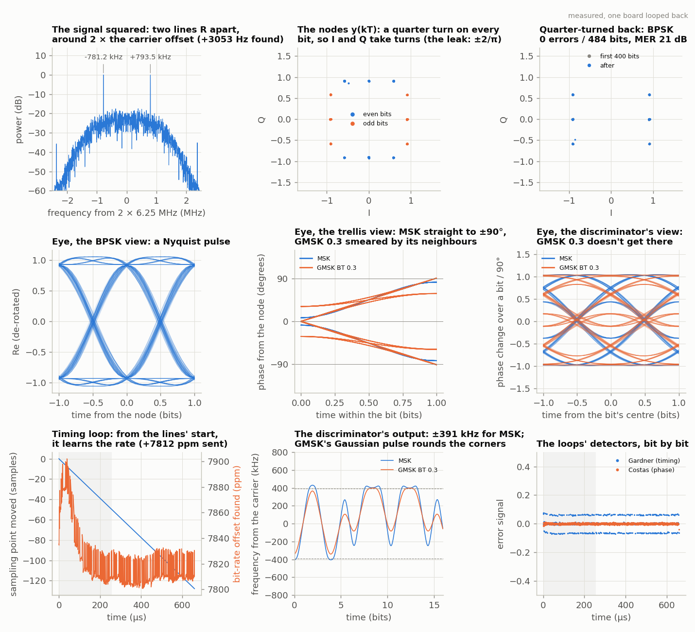
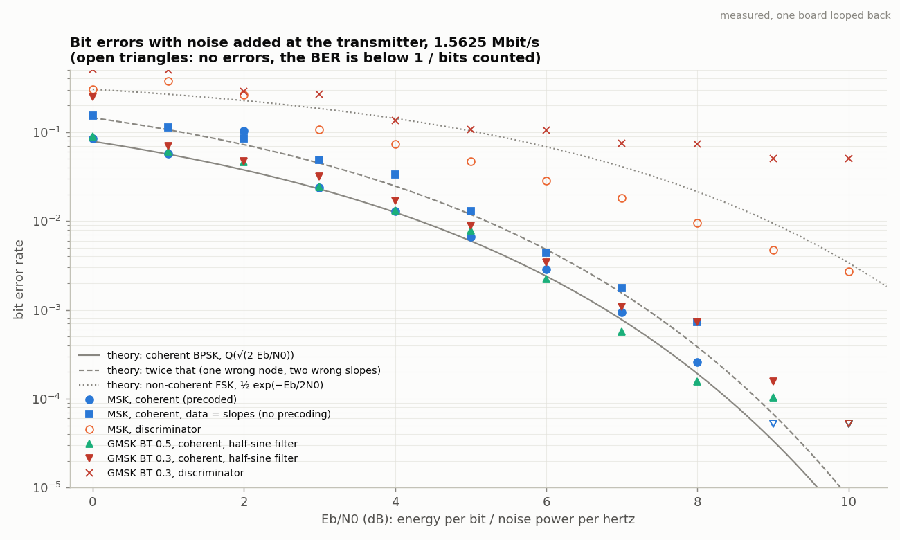

<!-- nav -->
[← 6.03 QAM: more bits per symbol](6_03_qam.md#603-qam-more-bits-per-symbol) &emsp;&emsp;&emsp; **[Contents](../README.md#contents)** &emsp;&emsp;&emsp; [6.05 The channel: sounding it, and equalizing it →](6_05_the_channel.md#605-the-channel-sounding-it-and-equalizing-it)

# 6.04 MSK and GMSK: constant envelope


The amplifier in a phone is a switch. A transistor that is either hard on or
hard off wastes almost nothing (class C, D, E: 70–90% efficient), and a
battery-powered radio wants exactly that; a transistor asked to reproduce a
waveform faithfully (class A, AB) burns most of the battery as heat. But a
switch has no amplitude to offer: whatever you put in, the output is a
constant-amplitude signal with the input's zero crossings. Only the *phase*
survives. So if you want the cheap amplifier, you need a modulation that
puts everything in the phase and keeps the amplitude constant. That is what
MSK and GMSK are, and why GSM, Bluetooth, Zigbee, DECT, ships' AIS and deep
space use them. learnSDR skipped this; it shouldn't have.


## FSK with the phase kept

[5.05](5_05_fsk_modem.md#505-a-modem)'s modem already did half of this. Its DDS steps its frequency when a bit
changes and never touches its phase, so the phase is an integral,

  φ(*t*) = 2π*h* Σ<sub>*k*</sub> *a*<sub>*k*</sub> *q*(*t* − *kT*),  *a*<sub>*k*</sub> = ±1,  *q*(∞) = ½,

and an integral can't jump: each bit turns the phase by π*h* and nothing
else happens. The number *h*, the *modulation index*, is the two tones'
spacing in units of the bit rate: [5.05](5_05_fsk_modem.md#505-a-modem) used *h* = 2 (four and two cycles per
bit), Sunde's FSK is *h* = 1, and *h* = ½, the two tones only half a bit rate
apart, is **minimum-shift keying**. "Minimum" because that is as close as two
tones can be and still be told apart by a coherent receiver: over one bit,
∫cos(2π*f*<sub>1</sub>*t*) cos(2π*f*<sub>2</sub>*t*) d*t* is zero when 2Δ*f T* is a whole number,
so Δ*f* = 1/2*T*, *h* = ½. A non-coherent receiver, which doesn't know the
phase ([5.05](5_05_fsk_modem.md#505-a-modem)'s energy detector), needs Δ*f T* itself whole: *h* = 1 at least.
Bluetooth's basic rate sits at *h* ≈ 0.32, not orthogonal at all, which its
cheap receiver tolerates because the error rate it wants is modest. **GMSK**
smooths the frequency step with a Gaussian filter of bandwidth *B* so that
each bit's quarter turn is spread over about three bits (*BT* = 0.3 in GSM,
0.5 in Bluetooth LE), which narrows the spectrum further at the price of
some intersymbol interference.

![Theory, from msk.py: the frequency pulse of one bit, rectangular for MSK and Gaussian for GMSK at BT 0.5 and 0.3, and its integral, every bit turning the phase by 90 degrees; the phase trellis for a bit pattern, MSK's straight and GMSK's smoothed, against CPFSK's steeper h = 1; the same MSK as half-sine pulses on I and Q, with the OQPSK and trellis constructions agreeing to one part in ten to the fourteenth; the envelope the amplifier must follow, constant for MSK against the wobble of QPSK and the spikes of OFDM; and the correlation of two tones over one bit against their spacing, zero at h = ½ coherently and h = 1 non-coherently](img/comms_msk_phase.png)

You can hear this. `msk.py --play` sends the same bits at 1200 baud
through the laptop's speaker five ways: FSK from two switched oscillators
(the phase jumps at every bit edge, and every jump is a click), CPFSK with
the phase kept, MSK, GMSK, and square-pulse BPSK. The clicks are the
sidelobes: a jump in the waveform spreads energy everywhere. 1200 baud at
1200 and 2200 Hz is the Bell 202 modem of the 1980s and APRS today, sent
through a voice radio's microphone jack.

## Two views of one signal

Here is the fact that makes MSK special. Follow the phase trellis: at every
bit boundary the phase sits on one of four values, and it moves ±90° per
bit. Write the phase at the boundaries as *e*<sub>*k*</sub> *j*<sup>*k*</sup> (*e*<sub>*k*</sub> = ±1),
and the straight line between boundaries becomes

  *s*(*t*) = *e*<sub>*k*</sub> *j*<sup>*k*</sup> cos(π*t*′/2*T*) + *e*<sub>*k*+1</sub> *j*<sup>*k*+1</sup> sin(π*t*′/2*T*):

a half-sine pulse two bits long on I for even *k*, on Q for odd *k*, the
two offset by one bit. **MSK is offset [QPSK](https://en.wikipedia.org/wiki/Phase-shift_keying#Quadrature_phase-shift_keying_(QPSK)) with half-sine pulses**, and
I<sup>2</sup> + Q<sup>2</sup> = cos<sup>2</sup> + sin<sup>2</sup> = 1 is why its envelope is constant. `msk.py` builds
the signal both ways and finds them equal to one part in 10<sup>14</sup>.
(IEEE 802.15.4, the Zigbee radio, specifies "O-QPSK with half-sine pulse
shaping", which is MSK under another name.) The one subtlety: the data in
the trellis view are the *slopes* (which way the phase turned), in the
OQPSK view the *nodes* (where it sits). GSM converts one to the other
before the modulator (*precoding*); without it a coherent receiver has to
multiply two node decisions and pays a factor of two in errors, as
differential coding did in [6.02](6_02_psk_and_qpsk.md#602-psk-and-qpsk-finding-the-clock-and-the-carrier).

## Spectra: smoothness sets the fall-off

A waveform with steps (square-pulse QPSK) has a spectrum that falls as
1/*f*<sup>2</sup>; MSK's waveform is continuous but its *frequency* steps, so
1/*f*<sup>4</sup>; GMSK has no corners at any order and falls faster than any
power. Measured through the cable, with the limiter that is the point of
the page:

Everything on this page is one file:

<details>
<summary>The whole file: <code>msk.py</code></summary>

<!-- file: src/comms/msk.py -->
```python
#!/usr/bin/env python3
"""MSK and GMSK through the cable: a constant envelope, two receivers, and a saturated amplifier.

    python3 msk.py                      # MSK, one board looped back (finds its port)
    python3 msk.py PORT_A PORT_B        # board A plays, board B records
    python3 msk.py --sim                # no board: the channel model of channel.py
    python3 msk.py --bt 0.3             # GMSK: a Gaussian frequency pulse, BT = 0.3 (GSM)
    python3 msk.py --bt 0.5             # ... BT = 0.5 (Bluetooth LE, which calls it GFSK)
    python3 msk.py --h 1 --disc         # plain continuous-phase FSK, tones a bit rate apart
    python3 msk.py --disc               # the cheap receiver: an FM discriminator
    python3 msk.py --raw                # the data are the slopes, not the nodes (no precoding)
    python3 msk.py --limit hard         # a saturated amplifier before the DAC (or soft)
    python3 msk.py --cfo 3000 --sro 8000    # give the loops work to do: the transmitter's
                                        #   carrier 3 kHz high, its bits 8000 ppm fast
    python3 msk.py --ebn0 6             # add noise at the transmitter: Eb/N0 = 6 dB
    python3 msk.py --ber 0:10           # bit error rate against Eb/N0, 0 to 10 dB
    python3 msk.py --spectra            # six waveforms: spectra, 99% bandwidths, PAPR,
                                        #   before and after a hard limiter
    python3 msk.py --play               # hear it, slowed to 1200 baud: FSK with phase jumps,
                                        #   then continuous phase, MSK, GMSK (and BPSK)
    python3 msk.py --wav DIR            # only write those sound files

The board runs awgcap.sv (5.01): it plays a 16384-sample waveform at 50 MS/s, over
and over (one loop = 327.68 us), and records 16384 samples at 25 MS/s (two loops).

TRANSMITTER (here, in Python; the board just plays the result)
  bits    512 per loop = 1.5625 Mbit/s, 32 DAC samples and 16 ADC samples each; a
          32-bit unique word from G2 then 480 data bits from G1, as psk.py's frames
  phase   continuous-phase FSK: the frequency is f_c + h x (bit) x (bit rate) / 2, so
          each bit turns the phase by +-180 h degrees, with NO jumps.  h = 0.5 is MSK:
          +-90 degrees per bit, the two tones only half the bit rate apart.
  pulse   the frequency pulse is a rectangle one bit long (MSK, CPFSK), or that
          rectangle smoothed by a Gaussian low-pass of bandwidth BT x bit rate (GMSK)
  carrier 6.25 MHz: a quarter of the ADC's 25 MS/s, exactly 2048 cycles per loop
  seam    the phase must come back to where it started, or the loop would jump: the
          bits are chosen so that it does (precode(), below)

Two ways to see MSK, which are the same signal (oqpsk() checks, to 1e-15):
  1. a phase trellis: +90 or -90 degrees per bit, in straight lines;
  2. offset QPSK with half-sine pulses: I carries the nodes of the trellis at the even
     bit boundaries, Q those at the odd ones, each as a half-sine two bits long, so
     I^2 + Q^2 = cos^2 + sin^2 = 1.  The envelope never moves.

RECEIVERS (in Python, on the record)
  coherent  mix down (the lock-in, 1.08), half-sine matched filter, then the trick:
            multiply by e^(-j pi t / 2T), a quarter turn back per bit.  MSK becomes
            BPSK (the nodes alternate I, Q, -I, -Q; turned back, they are +-1), and the
            Gardner timing loop and a (modified) Costas loop of 6.02 do the rest.
            Squaring the signal first gives two spectral LINES at +-(bit rate)/2 whose
            frequencies and phases are the carrier offset, the bit rate, the carrier
            phase and the bit timing: MSK's own synchronizer (de Buda, 1972).
  discriminator  what a cheap Bluetooth chip does: band-pass, then the phase step from
            one sample to the next, angle(z[n] z*[n-1]), is the frequency; summed over
            a bit it is +-90 degrees.  No carrier loop at all, and about 4 dB worse
            (measured, --ber: textbooks say 3-4 with the best filters).
"""
import argparse
import math
import os
import sys

import numpy as np

HERE = os.path.dirname(os.path.abspath(__file__))
sys.path.insert(0, HERE)
import channel                                              # noqa: E402
import psk                                                  # noqa: E402
from psk import g1, find_port, make_link, loop_gains        # noqa: E402,F401

N = 16384                       # DAC samples per loop
FS_DAC, FS_ADC = 50e6, 25e6
F_LOOP = FS_DAC / N             # 3051.76 Hz: anything periodic in the loop is a multiple
F_C = 6.25e6                    # carrier: FS_ADC / 4, 2048 cycles per loop
NBIT = 512                      # bits per loop: 1.5625 Mbit/s
SPS = 16                        # ADC samples per bit (32 DAC samples)
R = NBIT * F_LOOP               # the bit rate, 1.5625 Mbit/s
AMP = 100                       # the waveform's peaks, DAC codes from mid-scale
erf = np.vectorize(math.erf)


# ---- the frequency pulse, and the phase ------------------------------------------
def freq_pulse(t, bt=None):
    """The frequency pulse g(t), t in bit periods, centred on its bit, with area 1/2
    (so one bit turns the phase by 2 pi h x 1/2 = pi h): a rectangle one bit long
    (MSK and plain CPFSK), or that rectangle passed through a Gaussian low-pass of
    bandwidth bt x the bit rate (GMSK: GSM uses 0.3, Bluetooth 0.5)."""
    t = np.asarray(t, float)
    if bt is None:
        return 0.5 * ((t >= -0.5) & (t < 0.5))
    sigma = np.sqrt(np.log(2)) / (2 * np.pi * bt)    # the Gaussian's width, in bits
    return 0.25 * (erf((t + 0.5) / (sigma * np.sqrt(2))) - erf((t - 0.5) / (sigma * np.sqrt(2))))


def phase_pulse(t, bt=None):
    """The phase pulse q(t) = the integral of g: 0 before the bit, 1/2 after it, a straight
    ramp between (MSK) or an S-curve that spills into the neighbours (GMSK)."""
    t = np.asarray(t, float)
    if bt is None:
        return 0.5 * np.clip(t + 0.5, 0, 1)
    c = np.sqrt(np.log(2)) / (2 * np.pi * bt) * np.sqrt(2)
    F = lambda x: x * erf(x / c) + c / np.sqrt(np.pi) * np.exp(-(x / c)**2)   # integral of erf
    return 0.25 * (F(t + 0.5) - F(t - 0.5)) + 0.25


def phase(a, h=0.5, bt=None, T=None, span=3):
    """The phase phi (radians) at every sample, for one loop of bits a (+1 / -1) at T
    samples per bit (the DAC's 16384 / len(a) unless told otherwise).  It is 0 at the
    start of bit 0 and comes back to a multiple of 2 pi at the end if the bits allow
    (precode()), so the loop has no seam."""
    nbit = len(a)
    L = N if T is None else int(round(nbit * T))
    t = np.arange(L) * nbit / L                     # time, in bit periods: bit k is [k, k + 1)
    k0 = np.floor(t).astype(int)
    aa = np.concatenate([a[-span:], a])             # the previous loop's last bits spill in
    done = np.concatenate([[0], np.cumsum(aa)])     # done[i]: the sum of aa[:i]
    phi = np.pi * h * (done[k0] - done[span])       # bits long over: pi h each
    for j in range(-span, span + 1):
        k = k0 + j
        # ######################################################################
        # ##  KEY LINE: the phase is the sum of every bit's phase pulse, each
        # ##  rising smoothly from 0 to pi h: it can't jump.  (A bit's pulse
        # ##  shows in the frequency as g(t), the slope of q.)
        # ######################################################################
        phi += 2 * np.pi * h * a[k % nbit] * phase_pulse(t - k - 0.5, bt)
    return phi


def cpm(a, h=0.5, bt=None, T=None):
    """The complex envelope e^(j phi): size 1 at every sample.  That's the point."""
    return np.exp(1j * phase(a, h, bt, T))


def precode(e):
    """The slopes a_k from the nodes e_k (+1 / -1): a_k = e_k e_(k+1), so that an MSK
    receiver that reads the nodes gets e back directly (GSM does this; it makes the
    error rate BPSK's instead of twice that).  Around the loop the product of all
    the a's is then 1, an even number of -1s, and with a multiple of 4 bits per loop
    their sum is a multiple of 4: the phase comes home (4 x 90 degrees)."""
    assert len(e) % 4 == 0, "bits per loop must be a multiple of 4 for the seam"
    return e * np.roll(e, -1)


def halfsine(t):
    """The half-sine pulse, t in bits: cos(pi t / 2) for |t| < 1.  Two bits long."""
    t = np.asarray(t, float)
    return np.cos(np.pi * t / 2) * (np.abs(t) < 1)


def oqpsk(e, T=None):
    """The other view of MSK: offset QPSK with half-sine pulses.  Node e_k rides a
    half-sine centred on bit boundary k, on I for even k and on Q for odd k, and
    with the sign j^k (the trellis turns a quarter turn per bit).  Returns the
    complex envelope, which equals cpm(precode(e)) exactly."""
    nbit = len(e)
    T = N // nbit if T is None else T
    t = np.arange(nbit * T) / T
    k0 = np.floor(t).astype(int)
    s = np.zeros(nbit * T, complex)
    for j in (0, 1):                                # the two pulses that overlap bit k0
        k = k0 + j
        s += e[k % nbit] * 1j ** (k % 4) * halfsine(t - k)
    return s * e[0]                                 # cpm() starts at phase 0: node 0 = +1


# ---- transmitter ------------------------------------------------------------------
def amplifier(env, kind):
    """What a saturated amplifier does to the envelope.  'soft': a transistor amplifier
    driven to its knee (Rapp's model with p = 2, saturating at the signal's own rms).
    'hard': a limiter, a class-C or switching stage: only the phase survives.  (A real
    one also makes harmonics at 3 x 6.25 MHz etc.; the band filter after it removes
    those, and here they would alias onto the carrier, so we don't make them.)"""
    A = np.abs(env)
    if kind == "hard":
        # ######################################################################
        # ##  KEY LINE: a hard limiter keeps the phase and throws the
        # ##  amplitude away.  A constant envelope has nothing to lose.
        # ######################################################################
        return env / np.where(A > 0, A, 1)
    rms = np.sqrt(np.mean(A**2))
    return env / (1 + (A / rms)**4)**0.25


def papr_db(env):
    """Peak-to-average power ratio of a complex envelope, dB."""
    p = np.abs(env)**2
    return 10 * np.log10(p.max() / p.mean())


def transmit(a, h=0.5, bt=None, cfo_bins=0, limit=None, ebn0=None, rng=None, env=None):
    """The DAC waveform (16384 codes) for one loop of slopes a (+1 / -1), on the carrier,
    through an optional amplifier model, with optional noise.  Give env to send some
    other complex envelope instead (QPSK, for comparison)."""
    nbit = len(a)
    if env is None:
        env = cpm(a, h, bt)
    if limit:
        env = amplifier(env, limit)
    u = np.arange(N)
    fc = F_C + cfo_bins * F_LOOP
    s = np.real(env * np.exp(2j * np.pi * fc * u / FS_DAC))    # I on cos, Q on -sin, as psk
    if ebn0 is not None:
        s = s + psk.noise_for(s, ebn0, 2, nbit, fc, rng)
    return 128 + AMP * s / np.abs(s).max()


def qpsk_env(q, pulse="rrc"):
    """A QPSK envelope at the same BIT rate (256 symbols per loop), for comparison:
    square pulses, or psk.py's root-raised cosines."""
    nsym = len(q)
    if pulse == "square":
        return np.repeat(psk.point(q, 4), N // nsym)
    env = np.zeros(N, complex)
    t = np.arange(N) * nsym / N
    k0 = np.floor(t).astype(int)
    for j in range(-psk.SPAN - 2, psk.SPAN + 3):
        k = k0 + j
        env += psk.point(q[k % nsym], 4) * psk.rrc(t - k)
    return env / np.abs(env).max()


# ---- receiver: shared -----------------------------------------------------------------
def mixdown(rec):
    """Step 1: the lock-in.  Multiply by e^(-jwt) at 6.25 MHz: 1, -j, -1, j, ..."""
    r = rec - np.mean(rec)
    n = np.arange(len(r))
    return 2 * r * np.exp(-2j * np.pi * F_C * n / FS_ADC)


def lowpass(z, cutoff, taps=65):
    """A windowed-sinc low-pass at `cutoff` (Hz) for a signal at 25 MS/s.  Removes the
    2 x carrier part of the mixing, and noise outside the band."""
    m = np.arange(taps) - taps // 2
    h = np.sinc(2 * cutoff / FS_ADC * m) * np.hanning(taps)
    return np.convolve(z, h / h.sum(), mode="same")


def lines(z, search=20):
    """MSK's own synchronizer: square the signal.  2 x the phase advances by +-180 deg
    per bit, in a straight line that continues across bits, so z^2 is two pure tones
    at +-R/2 (about twice the carrier offset), present whenever the bit is + or -.
    Their frequencies give the carrier offset and the bit rate; their phases the
    carrier phase (to a quarter turn) and the bit timing (to a bit).  Returns
    (f_plus, f_minus, phase_plus, phase_minus) from the record's FFT, each line's
    frequency refined to a fraction of a bin from its neighbours (Jacobsen).  (Low-
    pass first: at a quarter-rate carrier, 4 x 6.25 MHz is the ADC's 25 MS/s, so the
    mixer's image squared would land on the same bins, mirrored.)"""
    z = lowpass(z, R)
    zz = z * z
    n = np.arange(len(z))
    Z = np.fft.fft(zz)
    f = np.fft.fftfreq(len(z), 1 / FS_ADC)
    out = []
    for sign in (+1, -1):
        near = np.abs(f - sign * R / 2) < search * F_LOOP
        i = np.argmax(np.abs(Z) * near)
        d = -np.real((Z[i + 1] - Z[i - 1]) / (2 * Z[i] - Z[i - 1] - Z[i + 1]))
        fl = (i + d) * FS_ADC / len(z)
        fl = fl - FS_ADC if fl > FS_ADC / 2 else fl
        out.append((fl, np.angle(np.sum(zz * np.exp(-2j * np.pi * fl * n / FS_ADC)))))
    return out[0][0], out[1][0], out[0][1], out[1][1]


# ---- receiver: coherent ---------------------------------------------------------------
def matched(z):
    """Step 2: the half-sine matched filter, two bits long."""
    m = np.arange(-SPS, SPS + 1)
    h = halfsine(m / SPS)
    y = np.convolve(z, h, mode="same")
    return y / np.sqrt(np.mean(np.abs(y)**2))


def derotate(y, t0=0.0, rate=R):
    """Step 3, the trick: turn back a quarter turn per bit.  The trellis's nodes, at
    angles 0, 90, 180, 270, ... in turn, all come to the real axis: MSK is now BPSK
    (the pulse r(t) cos(pi t / 2T) is even a Nyquist pulse: no ISI in the real part).
    The imaginary part holds the neighbours' leak, (e_(k+1) - e_(k-1)) / pi."""
    n = np.arange(len(y)) - t0
    # ##########################################################################
    # ##  KEY LINE: MSK's two tones sit at f_c +- R/4.  Shifting everything down
    # ##  by R/4 puts the "+" tone at 0 Hz, a standing constellation point,
    # ##  and the "-" tone at -R/2, half a turn per bit: from the point to -it.
    # ##########################################################################
    return y * np.exp(-2j * np.pi * (rate / 4) * n / FS_ADC)


LEAK = 1 / np.pi                # r(T) / r(0) for the half-sine's autocorrelation


def carrier_loop(u, bnt=0.02):
    """Step 5: a Costas loop for the de-rotated symbols, once per bit.  BPSK's detector
    Im(z d*) would take the neighbours' leak into Q for a phase error; the reference
    point includes it instead (Simon's loop for offset QPSK).  Returns the turned
    symbols, and the loop's phase, frequency and error, bit by bit."""
    k1, k2 = loop_gains(bnt, 1.0)
    phi = w = 0.0
    out, phis, ws, errs = [], [], [], []
    u = np.concatenate([[u[0]], u, [u[-1]]])
    for k in range(1, len(u) - 1):
        v = u[k - 1:k + 2] * np.exp(-1j * phi)       # this bit and its neighbours, turned back
        d = np.sign(v.real)                          # the decisions on all three
        # ######################################################################
        # ##  KEY LINE: where this symbol should be: its bit on the real axis,
        # ##  and the neighbours' difference, over pi, on the imaginary axis.
        # ######################################################################
        ref = d[1] + 1j * LEAK * (d[2] - d[0])
        e = np.imag(v[1] * np.conj(ref)) / np.abs(ref)**2
        w += k2 * e
        out.append(v[1]); phis.append(phi); ws.append(w); errs.append(e)
        phi += w + k1 * e
    return np.array(out), np.array(phis), np.array(ws), np.array(errs)


GARDNER = 1.08 / 2.0            # psk.timing_loop sets its gains for the Gardner detector's
                                #   slope on raised cosines, 1.08 per symbol; on the real
                                #   part of MSK's de-rotated signal it is 2.0 per bit
                                #   (measured, --sim), so the signal is scaled by the root


def receive(rec, nbit_tx=NBIT, q_tx=None, raw=False, bnt_timing=0.01, bnt_carrier=0.02,
            skip=400, acquire=True):
    """The coherent receiver.  nbit_tx and q_tx (the nodes, as 0/1) are only for counting
    errors; with raw=True the data are the slopes a_k = e_k e_(k+1) instead, and each
    wrong node spoils two of them.

    The lines of the squared signal come first: they give the carrier offset and the
    bit rate (to a few hertz), the carrier phase (to a quarter turn) and the bit
    timing (to a bit), and the loops start from there.  They have to: the de-rotated
    signal's timing detector only works once the phase is about right, which is
    MSK's chicken-and-egg (acquire=False shows it)."""
    z0 = mixdown(rec)
    n = np.arange(len(z0))
    fp, fm, pp, pm = lines(z0)
    out = dict(f_plus=fp, f_minus=fm, cfo_est=(fp + fm) / 4, rate_est=fp - fm,
               tau_est=((pm - pp) / (2 * np.pi) % 1) * SPS, theta_est=(pp + pm) / 4)
    tau, theta = (out["tau_est"], out["theta_est"]) if acquire else (0.0, 0.0)
    z = z0 * np.exp(-2j * np.pi * out["cfo_est"] * n / FS_ADC) if acquire else z0
    u = derotate(matched(z * np.exp(-1j * theta)), tau, out["rate_est"] if acquire else R)
    if acquire:
        # a quarter turn is the same as a bit of timing: if the nodes came out on
        # the imaginary axis, the I and Q labels were swapped
        k = np.arange(int(tau) + SPS, len(u), SPS)
        if np.sum(np.abs(u[k].imag)) > np.sum(np.abs(u[k].real)):
            u = u * -1j
    # Step 4: the timing loop of 6.02, on the real part (the imaginary part's leak
    # would fight it), then the complex signal sampled where the loop says
    sps = SPS * R / out["rate_est"] if acquire else SPS      # the lines' bit rate, as a start
    _, times, ted, period = psk.timing_loop(u.real * np.sqrt(GARDNER) + 0j, sps, bnt_timing,
                                            tau + SPS if acquire else None)
    zs = np.array([psk.interp(u, t) for t in times])
    zs = zs / np.sqrt(np.mean(np.abs(zs)**2))
    zc, phi, w, ec = carrier_loop(zs, bnt_carrier)
    out.update(z=z0, u=u, sps=SPS, times=times, ted=ted, period=period, zs=zs, zc=zc,
               phi=phi, w=w, ec=ec)
    if q_tx is not None:
        out.update(psk.score(zc.real + 0j, 2, nbit_tx, q_tx, skip=skip))
        if raw:
            # ##################################################################
            # ##  KEY LINE: without precoding, a bit is the product of two
            # ##  neighbouring nodes' decisions: one wrong node, two wrong bits.
            # ##  (The unique word found the frames above; the sign cancels.)
            # ##################################################################
            d = np.sign(zc.real)
            e_tx = 1 - 2 * q_tx
            errs = nbits = 0
            for k in range(skip, min(skip + nbit_tx, len(d) - 1)):
                f = np.searchsorted(out["starts"], k, side="right") - 1
                i = k - out["starts"][f] if f >= 0 else -1
                if psk.NUW <= i < nbit_tx - 1:
                    errs += int(d[k] * d[k + 1] != e_tx[i] * e_tx[i + 1])
                    nbits += 1
            out.update(errs=errs, nbits=nbits)
    return out


# ---- receiver: the discriminator ------------------------------------------------------
def discriminator(rec, nbit_tx=NBIT, q_tx=None, h=0.5, bnt_timing=0.01, skip=400,
                  cutoff=R / 2, acquire=True):
    """The non-coherent receiver: band-pass, FM discriminator, integrate over a bit.
    No carrier phase, no carrier loop; a carrier offset just shifts the output.
    The band-pass is as wide as the bit rate (BT = 1, the usual choice): narrower
    smears the bits together, wider lets in more noise, and noise in an FM
    receiver makes CLICKS, whole turns of phase.  The bit clock still has to come
    from somewhere: the squared signal's lines again (a Bluetooth chip uses the
    packet's preamble).  q_tx are the SLOPES (0 for +, 1 for -)."""
    z0 = mixdown(rec)
    z = lowpass(z0, cutoff)
    # ##########################################################################
    # ##  KEY LINE: the phase step from one sample to the next is the frequency.
    # ##  angle(z[n] z*[n-1]) needs no unwrapping: it's already a difference.
    # ##########################################################################
    df = np.angle(z[1:] * np.conj(z[:-1]))
    df = np.concatenate([[0], df]) - np.mean(df)         # the mean is the carrier offset
    v = np.convolve(df, np.ones(SPS), mode="same") / (np.pi * h)   # over one bit: +-1
    if acquire and h == 0.5:
        # the clock from the lines, trusted for the whole record (a Bluetooth chip
        # trusts its crystal for a packet): no loop, just sample every bit
        fp, fm, pp, pm = lines(z0)
        t0 = ((pm - pp) / (2 * np.pi) % 1) * SPS + SPS // 2 + 1     # the node, then half a bit
        sps = SPS * R / (fp - fm)
        times = t0 + sps * np.arange(int((len(v) - t0 - 3) / sps))
        zs = np.array([psk.interp(v, t) for t in times])
        ted, period = np.zeros(len(times)), np.full(len(times), sps)
    else:
        # or 6.02's timing loop on the clipped output (MSK only: on GMSK 0.3's shut
        # eye the Gardner detector has almost no slope, and the loop wanders)
        zs, times, ted, period = psk.timing_loop(np.clip(v, -1, 1) + 0j, SPS, bnt_timing)
    out = dict(z=z0, v=v, sps=SPS, times=times, ted=ted, period=period, zs=zs, zc=zs,
               df=df, cfo_est=np.mean(df) * FS_ADC / (2 * np.pi))
    if q_tx is not None:
        out.update(psk.score(zs, 2, nbit_tx, q_tx, skip=skip))
    return out


# ---- spectra ----------------------------------------------------------------------------
def spectrum(x, fs=FS_ADC):
    """Power spectrum (Hann window) in dB relative to the total power, and its frequency
    axis in Hz: 0 to fs/2 for a real record, -fs/2 to fs/2 for a complex envelope
    (frequencies from the carrier)."""
    x = x - np.mean(x)
    w = np.hanning(len(x))
    if np.isrealobj(x):
        P = np.abs(np.fft.rfft(x * w))**2
        f = np.fft.rfftfreq(len(x), 1 / fs)
    else:
        P = np.fft.fftshift(np.abs(np.fft.fft(x * w))**2)
        f = np.fft.fftshift(np.fft.fftfreq(len(x), 1 / fs))
    P = P / P.sum()
    return f, 10 * np.log10(P + 1e-20), P


def bandwidth(f, P, fc=0.0, frac=0.99):
    """The narrowest band centred on fc holding `frac` of the power (Hz)."""
    d = np.abs(f - fc)
    i = np.argsort(d)
    cum = np.cumsum(P[i]) / P.sum()
    return 2 * d[i][np.searchsorted(cum, frac)]


def waveforms(a, q4):
    """The six envelopes at 1.5625 Mbit/s, for the spectra: name -> complex envelope."""
    return [("QPSK, square pulses", qpsk_env(q4, "square")),
            ("QPSK, root-raised cosine 0.35", qpsk_env(q4, "rrc")),
            ("CPFSK, h = 1", cpm(a, 1.0)),
            ("MSK (h = 0.5)", cpm(a, 0.5)),
            ("GMSK, BT = 0.5", cpm(a, 0.5, 0.5)),
            ("GMSK, BT = 0.3", cpm(a, 0.5, 0.3))]


def ofdm_papr(carriers=64, symbols=64, rng=1):
    """For comparison: the PAPR of OFDM, `carriers` QPSK subcarriers (as Wi-Fi's 48 + 4),
    the worst of `symbols` symbols."""
    rng = np.random.default_rng(rng)
    X = psk.point(rng.integers(0, 4, (symbols, carriers)), 4)
    x = np.fft.ifft(X, 4 * carriers, axis=1)         # oversampled 4x, to see the real peaks
    return papr_db(x.ravel())


# ---- the frames, and one run ------------------------------------------------------------
def make_frame(nbit=NBIT, start=0):
    """One loop: the nodes e (+1 / -1; a unique word then G1 data, as psk.py), their
    0/1 form q, the slopes a and their 0/1 form."""
    q, data = psk.make_frame(2, nbit, start=start)
    e = 1 - 2 * q
    a = precode(e)
    return e, q, a, ((1 - a) // 2).astype(int)


def run_once(args, play, record, start=0, ebn0=None, rng=None):
    """Make a frame, play it, record it, receive it.  args: h, bt, disc, raw, limit, cfo,
    sro, bnt_timing, bnt_carrier, skip, acquire (as the command line's)."""
    nbit_tx = NBIT + 4 * int(round(args.sro * 1e-6 * NBIT / 4))     # steps of 4 bits
    e, q, a, qa = make_frame(nbit_tx, start)
    cfo_bins = int(round(args.cfo / F_LOOP))
    play(transmit(a, args.h, args.bt, cfo_bins, args.limit, ebn0, rng))
    rec = record()
    if args.disc or args.h != 0.5:
        r = discriminator(rec, nbit_tx, qa, args.h, args.bnt_timing, args.skip, acquire=args.acquire)
    else:
        r = receive(rec, nbit_tx, q, args.raw, args.bnt_timing, args.bnt_carrier, args.skip,
                    args.acquire)
    r.update(rec=rec, e_tx=e, a_tx=a, nbit_tx=nbit_tx, cfo=cfo_bins * F_LOOP,
             sro=(nbit_tx / NBIT - 1) * 1e6)
    return r


def ber_theory(ebn0_db, raw=False):
    """Coherent MSK, precoded, is BPSK: Q(sqrt(2 Eb/N0)).  Without precoding one wrong
    node spoils two slopes: nearly twice that."""
    return psk.ber_theory(ebn0_db, diff=raw)


# ---- sound ------------------------------------------------------------------------------
def audio(baud=1200, seconds=3.0, fs=48000):
    """The same modulations slowed to telephone-modem speed, as sounds.  Bell 202 (the
    1200-baud AFSK of packet radio) sends 1200 Hz for a 1 and 2200 Hz for a 0.
    Returns [(name, what it is, samples)]."""
    T = int(round(fs / baud))
    nbit = int(seconds * baud)
    a = 1 - 2 * g1(nbit)
    t = np.arange(nbit * T) / fs
    bit = np.repeat(a, T)
    mark, space = 1200.0, 2200.0
    fc = (mark + space) / 2                          # 1700 Hz
    # two free-running oscillators, switched: the phase jumps at every change
    jumps = np.where(bit > 0, np.cos(2 * np.pi * mark * t), np.cos(2 * np.pi * space * t))
    # continuous phase, h = 1000 / 1200 = 0.83: the frequency switches, the phase doesn't
    h202 = (space - mark) / baud
    out = [("fsk_jumps", "FSK, two switched oscillators 1200/2200 Hz: a click at every change", jumps),
           ("cpfsk", "FSK 1200/2200 Hz with continuous phase (Bell 202, h = 0.83)",
            np.cos(2 * np.pi * fc * t + phase(a, h202, None, T))),
           ("msk", "MSK, 1400/2000 Hz (h = 0.5)", np.cos(2 * np.pi * fc * t + phase(a, 0.5, None, T))),
           ("gmsk03", "GMSK, BT = 0.3, on 1700 Hz", np.cos(2 * np.pi * fc * t + phase(a, 0.5, 0.3, T))),
           ("bpsk", "BPSK, square pulses on 1700 Hz: a phase reversal is a click too",
            bit * np.cos(2 * np.pi * fc * t))]
    return out


def write_wav(path, x, fs=48000):
    import wave
    x = x / np.abs(x).max()
    with wave.open(path, "wb") as w:
        w.setnchannels(1); w.setsampwidth(2); w.setframerate(fs)
        w.writeframes((x * 30000).astype("<i2").tobytes())


def play_wav(path):
    """Through the laptop's speaker: sounddevice if installed, else a system player."""
    import shutil
    import subprocess
    try:
        import sounddevice
        import wave
        with wave.open(path) as w:
            x = np.frombuffer(w.readframes(w.getnframes()), "<i2") / 32768
        sounddevice.play(x, 48000, blocking=True)
        return
    except ImportError:
        pass
    for player in ("afplay", "paplay", "aplay"):
        if shutil.which(player):
            subprocess.run([player, path])
            return
    print("no audio player found: open %s yourself" % path)


# ---- plots ------------------------------------------------------------------------------
def plot(r, title, disc=False, skip=400):
    import matplotlib.pyplot as plt
    k = np.arange(len(r["zc"]))
    us = k / R * 1e6
    fig, ax = plt.subplots(2, 3, figsize=(13, 7.5))
    a = ax[0, 0]
    f, P, _ = spectrum(r["z"]**2)
    a.plot(f / 1e6, P, lw=0.6)
    a.set_xlim(-2.5, 2.5); a.set_ylim(-70, 5)
    a.set_xlabel("frequency from 2 x carrier (MHz)"); a.set_ylabel("dB")
    a.set_title("the signal squared: lines at +-R/2 = +-0.78 MHz" if not disc else "the signal squared")
    a = ax[0, 1]
    if disc:
        a.plot(r["times"][skip:skip + 40] / SPS, r["zs"][skip:skip + 40].real, "o")
        n0 = int(r["times"][skip]) - SPS
        a.plot(np.arange(n0, n0 + 41 * SPS) / SPS, r["v"][n0:n0 + 41 * SPS], lw=0.8)
        a.set_xlabel("time (bits)"); a.set_ylabel("phase change over a bit / 90 deg")
        a.set_title("discriminator output, and the decisions")
    else:
        zr = r["zc"] * np.exp(-2j * np.pi * (r["rot"][-1] if "rot" in r else 0) / 2)
        a.plot(zr[skip:].real, zr[skip:].imag, ".", markersize=2)
        a.set_aspect("equal"); a.set_xlim(-1.8, 1.8); a.set_ylim(-1.8, 1.8)
        a.set_xlabel("I"); a.set_ylabel("Q")
        a.set_title("after the loops: %d errors in %d bits" % (r.get("errs", 0), r.get("nbits", 0)))
    a = ax[0, 2]
    y = r["u"] if not disc else r["v"]
    tau = np.arange(-SPS, SPS + 1)
    for kk in range(skip, min(skip + 300, len(r["times"]))):
        tt = int(round(r["times"][kk]))
        if tt - SPS < 0 or tt + SPS >= len(y):
            continue
        a.plot(tau / SPS, np.real(y[tt - SPS:tt + SPS + 1]), color="C0", lw=0.3, alpha=0.4)
    a.set_xlabel("time from the bit's centre (bits)"); a.set_title("eye")
    a = ax[1, 0]
    a.plot(us, r["times"] - r["sps"] * k, ".", markersize=1.5)
    a.set_xlabel("time (us)"); a.set_ylabel("sampling time - k x 16 (samples)")
    a.set_title("timing loop")
    a2 = a.twinx()
    a2.plot(us, (r["sps"] / r["period"] - 1) * 1e6, color="C1", lw=1)
    a2.set_ylabel("bit rate offset it found (ppm)", color="C1")
    a = ax[1, 1]
    if not disc:
        a.plot(us, np.degrees(r["phi"]), lw=1)
        a.set_ylabel("phase correction (deg)"); a.set_title("carrier loop")
        a2 = a.twinx()
        a2.plot(us, r["w"] * R / (2 * np.pi) / 1e3, color="C1", lw=1)
        a2.set_ylabel("carrier offset it found (kHz)", color="C1")
    else:
        a.plot(np.arange(len(r["df"]))[:20 * SPS] / SPS, r["df"][:20 * SPS] * FS_ADC / (2 * np.pi) / 1e3, lw=0.8)
        a.set_ylabel("frequency (kHz)"); a.set_title("the discriminator's output, raw")
    a.set_xlabel("time (us)" if not disc else "time (bits)")
    a = ax[1, 2]
    a.plot(us, r["ted"], ".", markersize=1.5, label="Gardner (timing)")
    if not disc:
        a.plot(us, r["ec"], ".", markersize=1.5, label="Costas (phase)")
    a.set_xlabel("time (us)"); a.set_ylabel("error signal"); a.legend(fontsize=8)
    a.set_title("what the loops' detectors say")
    for a in ax.ravel():
        a.grid(True)
    fig.suptitle(title)
    fig.tight_layout()
    plt.show()


if __name__ == "__main__":
    ap = argparse.ArgumentParser(description=__doc__,
                                 formatter_class=argparse.RawDescriptionHelpFormatter)
    ap.add_argument("ports", nargs="*", help="one port: looped back; two: A plays, B records")
    ap.add_argument("--sim", action="store_true", help="use channel.py's model, not a board")
    ap.add_argument("--ppm", type=float, default=0.0, help="--sim: pretend to be two boards, A this many ppm fast")
    ap.add_argument("--bt", type=float, help="GMSK: Gaussian pulse, BT = this (0.3 GSM, 0.5 Bluetooth)")
    ap.add_argument("--h", type=float, default=0.5, help="modulation index (0.5 = MSK; others: --disc)")
    ap.add_argument("--disc", action="store_true", help="the discriminator receiver")
    ap.add_argument("--raw", action="store_true", help="the data are the slopes (no precoding)")
    ap.add_argument("--limit", choices=["soft", "hard"], help="a saturated amplifier before the DAC")
    ap.add_argument("--cfo", type=float, default=0.0, help="transmitter's carrier offset, Hz (3051.76 Hz steps)")
    ap.add_argument("--sro", type=float, default=0.0, help="transmitter's bit-rate offset, ppm (7812 ppm steps)")
    ap.add_argument("--ebn0", type=float, help="add noise at the transmitter: Eb/N0 in dB")
    ap.add_argument("--ber", help="measure BER at Eb/N0 = LO:HI dB (1 dB steps)")
    ap.add_argument("--records", type=int, default=40, help="--ber: at most this many uploads per point")
    ap.add_argument("--spectra", action="store_true", help="the six waveforms' spectra and PAPR")
    ap.add_argument("--play", action="store_true", help="hear it (writes msk_*.wav here, then plays them)")
    ap.add_argument("--wav", help="write the sound files to this folder, don't play")
    ap.add_argument("--baud", type=float, default=1200, help="--play: bits per second (try 50)")
    ap.add_argument("--no-acquire", dest="acquire", action="store_false", help="loops only, no head start from the lines")
    ap.add_argument("--bnt-timing", type=float, default=0.01, help="timing loop bandwidth x bit time")
    ap.add_argument("--bnt-carrier", type=float, default=0.02, help="carrier loop bandwidth x bit time")
    ap.add_argument("--skip", type=int, default=400, help="bits to let the loops settle")
    ap.add_argument("--seed", type=int, default=1)
    ap.add_argument("-o", "--out", help="save the results (.npz)")
    ap.add_argument("--no-plot", action="store_true")
    args = ap.parse_args()
    name = ("GMSK BT %.2g" % args.bt) if args.bt else ("MSK" if args.h == 0.5 else "CPFSK h = %g" % args.h)
    rx = "discriminator" if (args.disc or args.h != 0.5) else "coherent"

    if args.play or args.wav:
        folder = args.wav or "."
        for key, what, x in audio(args.baud):
            path = os.path.join(folder, "msk_%s.wav" % key)
            write_wav(path, x)
            f, P, Pl = spectrum(x, 48000)
            print("%-20s %s  (99%% of the power within %.0f Hz)" % (path, what, bandwidth(f, Pl, 1700)))
            if args.play:
                play_wav(path)
        sys.exit()

    play, record = make_link(args)

    if args.spectra:
        e, q, a, qa = make_frame()
        q4 = psk.make_frame(4, NBIT // 2)[0]
        print("%-32s PAPR    as sent: 99%% band  outside +-R    hard-limited: 99%% band  outside +-R"
              % "waveform (1.5625 Mbit/s)")
        for label, env in waveforms(a, q4):
            row = [label, papr_db(env)]
            for limit in (None, "hard"):
                play(transmit(a, env=env, limit=limit))
                rec = record()
                f, P, Pl = spectrum(rec)
                row += [bandwidth(f, Pl, F_C) / 1e6, 10 * np.log10(Pl[np.abs(f - F_C) > R].sum())]
            print("%-32s %4.1f dB %12.2f MHz %7.1f dB %18.2f MHz %7.1f dB" % tuple(row))
        print("for comparison, OFDM with 64 QPSK subcarriers: PAPR %.1f dB (worst of 64 symbols)" % ofdm_papr())
        sys.exit()

    if args.ber:
        lo, hi = (float(x) for x in args.ber.split(":"))
        rng = np.random.default_rng(args.seed)
        rows = []
        print("%s, %s receiver, %.4g Mbit/s: Eb/N0 (dB), bit errors, bits, BER, BPSK theory"
              % (name, rx, R / 1e6))
        for eb in np.arange(lo, hi + 0.01, 1.0):
            er = nb = 0
            for i in range(args.records):
                r = run_once(args, play, record, start=int(rng.integers(0, 1023)), ebn0=eb, rng=rng)
                er += r["errs"]; nb += r["nbits"]
                if er >= 200 and i >= 2:
                    break
            rows.append((eb, er, nb, er / nb, ber_theory(eb, args.raw)))
            print("%5.1f %6d %8d  %.2e  %.2e" % rows[-1], flush=True)
        if args.out:
            np.savez(args.out, rows=np.array(rows), name=name, rx=rx)
        if not args.no_plot:
            import matplotlib.pyplot as plt
            rows = np.array(rows)
            ebs = np.linspace(lo, hi, 100)
            plt.semilogy(ebs, [ber_theory(x, args.raw) for x in ebs], label="BPSK theory")
            ok = rows[:, 1] > 0
            plt.semilogy(rows[ok, 0], rows[ok, 3], "o", label="measured")
            plt.xlabel("Eb/N0 (dB)"); plt.ylabel("bit error rate"); plt.grid(True, which="both")
            plt.legend(); plt.title("%s, %s receiver" % (name, rx)); plt.show()
    else:
        r = run_once(args, play, record, ebn0=args.ebn0, rng=args.seed)
        print("%s at %.4g Mbit/s on %.4f MHz, %s receiver; transmitter's carrier %+.0f Hz, bits %+.0f ppm%s"
              % (name, R / 1e6, F_C / 1e6, rx, r["cfo"], r["sro"],
                 ", through a %s limiter" % args.limit if args.limit else ""))
        last = slice(-200, None)
        if rx == "coherent":
            print("squared: lines at %+.1f and %+.1f kHz: carrier offset %+.0f Hz, bit rate %.4f Mbit/s, "
                  "timing %.2f bits, phase %.0f deg"
                  % (r["f_plus"] / 1e3, r["f_minus"] / 1e3, r["cfo_est"], r["rate_est"] / 1e6,
                     r["tau_est"] / SPS, np.degrees(r["theta_est"])))
            print("carrier loop: offset found %+.0f Hz more" % np.mean(r["w"][last] * R / (2 * np.pi)))
        else:
            print("discriminator: mean frequency %+.0f Hz from the carrier" % r["cfo_est"])
        print("timing loop:  bit rate offset found %+.0f ppm (mean of the last 200 bits)"
              % np.mean((r["sps"] / r["period"][last] - 1) * 1e6))
        print("unique words at bits %s, turned by %s x 180 deg" % (list(r["starts"]), list(r["rot"])))
        print("%d bit errors in %d bits after the first %d bits; MER %.1f dB"
              % (r["errs"], r["nbits"], args.skip, r["mer"]))
        if args.out:
            np.savez(args.out, **{k: v for k, v in r.items() if isinstance(v, (np.ndarray, int, float))})
        if not args.no_plot:
            plot(r, "%s, %s receiver, %s" % (name, rx, "simulated" if args.sim else " ".join(args.ports) or "one board"),
                 rx != "coherent", args.skip)
```

</details>

```console
$ python3 msk.py --spectra               # awgcap.sv loaded, DAC OUT cabled to ADC IN
waveform (1.5625 Mbit/s)         PAPR    as sent: 99% band  outside +-R    hard-limited: 99% band  outside +-R
QPSK, square pulses               0.0 dB         8.69 MHz   -13.3 dB               8.69 MHz   -13.3 dB
QPSK, root-raised cosine 0.35     3.6 dB         0.90 MHz   -40.1 dB               4.01 MHz   -18.1 dB
CPFSK, h = 1                      0.0 dB         3.30 MHz   -18.5 dB               3.30 MHz   -18.5 dB
MSK (h = 0.5)                     0.0 dB         1.84 MHz   -26.2 dB               1.84 MHz   -26.2 dB
GMSK, BT = 0.5                    0.0 dB         1.61 MHz   -36.6 dB               1.61 MHz   -36.6 dB
GMSK, BT = 0.3                    0.0 dB         1.42 MHz   -42.1 dB               1.42 MHz   -42.1 dB
for comparison, OFDM with 64 QPSK subcarriers: PAPR 10.2 dB (worst of 64 symbols)
```

Read the first number column honestly: bandwidth is *not* where constant
envelope wins. QPSK with root-raised-cosine pulses is the narrowest signal
in the table, 0.58 bit rates for 99% of its power, against MSK's 1.18 and
GMSK's 0.91. (Carson's rule, 2(Δ*f* + *f*<sub>m</sub>), gets *h* = 1 right and is
30% pessimistic for MSK; and *h* = 1 FSK wastes half its power in two carrier
lines, visible at 5.47 and 7.03 MHz.) The win is the second half of the
table. **PAPR**, the peak-to-average power ratio, is 3.6 dB for QPSK-RRC,
10 dB for OFDM and exactly 0 for every constant-envelope waveform. Put each
through a hard limiter (done in Python before the DAC, so the cable then
carries exactly what a saturated amplifier would radiate): QPSK's sidelobes
grow back by 22 dB and its 99% band quadruples, while MSK and GMSK don't
move by a tenth of a decibel, and all of them still decode without an
error. A linear amplifier must be backed off by the PAPR, so at the same
peak power the constant-envelope signal also carries 3.6 dB more. That is
the whole argument for GSM and Bluetooth, for why EDGE's 8PSK and
Bluetooth EDR's π/4-DQPSK forced linear amplifiers into phones, why Wi-Fi
and LTE radios run their amplifiers at a few percent efficiency with
predistortion, and why LTE's uplink was deliberately made single-carrier
(SC-FDMA, 2–3 dB less PAPR) to spare the phone's battery. ([6.03](6_03_qam.md#603-qam-more-bits-per-symbol) met the
same number from the DAC's side.)

<details>
<summary><b>Detail:</b> what a real limiter would add, and why the one here acts on the envelope</summary>

A real hard limiter makes a square wave with the signal's zero crossings:
odd harmonics of 6.25 MHz, and the third, 18.75 MHz, aliases at 25 MS/s
onto 6.25 MHz exactly. `msk.py`'s `amplifier()` therefore clips the
*envelope* (the AM–AM curve of an amplifier) and leaves the carrier clean,
which is what a real transmitter's output filter would do. `--limit soft`
is a gentler amplifier (Rapp's model, saturating over an octave).

</details>

## Two receivers

**Coherent (MSK is BPSK in disguise).** Matched-filter with the half sine,
then turn the signal back a quarter turn per bit: every trellis node lands
on the real axis, and the de-rotated pulse is Nyquist (zero at ±*T* from the
cosine, ±2*T* from the pulse), so the real part is a BPSK eye with no
intersymbol interference. The imaginary part carries the neighbours' leak,
(*e*<sub>*k*+1</sub> − *e*<sub>*k*−1</sub>)/π, which is why the MER printed below is modest
while the error rate is BPSK's. [6.02](6_02_psk_and_qpsk.md#602-psk-and-qpsk-finding-the-clock-and-the-carrier)'s Gardner loop runs on the real part,
and the [Costas loop](https://en.wikipedia.org/wiki/Costas_loop) uses a reference that knows about the leak (Simon's
OQPSK loop). One thing is new: this receiver's timing detector is *not*
rotation-invariant (I and Q swap under a 90° turn, which is the same thing
as one bit of timing), so the chicken-and-egg problem is back, and MSK
solves it with a trick of its own. Square the signal: 2φ advances ±180° per
bit, so *z*<sup>2</sup> is two pure tones at 2Δ*f* ± *R*/2 whose frequencies give the
carrier offset and the bit rate, and whose phases give the carrier phase
and the bit timing. De Buda's synchronizer, 1972, in one FFT:

```console
$ python3 msk.py --cfo 3000 --sro 8000
MSK at 1.562 Mbit/s on 6.2500 MHz, coherent receiver; transmitter's carrier +3052 Hz, bits +7812 ppm
squared: lines at +793.5 and -781.3 kHz: carrier offset +3051 Hz, bit rate 1.5747 Mbit/s, timing 0.34 bits, phase 51 deg
carrier loop: offset found +2 Hz more
timing loop:  bit rate offset found +7809 ppm (mean of the last 200 bits)
unique words at bits [-1, 515], turned by [0, 0] x 180 deg
0 bit errors in 484 bits after the first 400 bits; MER 21.0 dB
```

The two lines found a 3052 Hz carrier offset to a hertz and a 0.78% rate
offset to three digits before any loop ran; the loops then had 2 Hz and
3 ppm left to find. (At a quarter-rate carrier the real signal's mirror
image squared lands on the same bins, so `msk.py` low-passes before
squaring: a trap worth a sentence.)

**Non-coherent (a Bluetooth chip).** Band-pass as wide as the bit rate,
then the *discriminator*: angle(*z*[*n*] *z*<sup>*</sup>[*n*−1]) summed over a bit is the
phase change, ±90°, and the sign is the bit. No carrier loop at all; a
carrier offset only shifts the output's mean. learnSDR's [lesson 24](https://github.com/gallicchio/learnSDR/blob/main/lesson24_FSKhardware.grc) uses
exactly this block (GNU Radio's "Quadrature Demod"). It costs about 3.6 dB
at a [bit error rate](https://en.wikipedia.org/wiki/Bit_error_rate) of 10<sup>−2</sup>, and below about 3 dB it falls off the *FM
threshold*: noise makes whole-turn clicks and the error rate heads for a
half.

```console
$ python3 msk.py --disc
MSK at 1.562 Mbit/s on 6.2500 MHz, discriminator receiver; transmitter's carrier +0 Hz, bits +0 ppm
discriminator: mean frequency +1 Hz from the carrier
timing loop:  bit rate offset found -0 ppm (mean of the last 200 bits)
unique words at bits [0, 512], turned by [0, 0] x 180 deg
0 bit errors in 480 bits after the first 400 bits; MER 8.9 dB
$ python3 msk.py --bt 0.3
GMSK BT 0.3 at 1.562 Mbit/s on 6.2500 MHz, coherent receiver; transmitter's carrier +0 Hz, bits +0 ppm
squared: lines at +781.3 and -781.2 kHz: carrier offset +1 Hz, bit rate 1.5625 Mbit/s, timing 0.34 bits, phase 52 deg
carrier loop: offset found +1 Hz more
timing loop:  bit rate offset found +6 ppm (mean of the last 200 bits)
unique words at bits [-1, 511], turned by [0, 0] x 180 deg
0 bit errors in 480 bits after the first 400 bits; MER 15.9 dB
```



**GMSK's price.** Spreading each bit's turn over three bits means the phase
at a node is off by up to ±32° at *BT* = 0.3 (±19° at 0.5): intersymbol
interference, on purpose. The simple coherent receiver loses 0.5 dB at
*BT* = 0.3; the discriminator's eye closes to a quarter of MSK's and its error
rate floors at a few percent. GSM gets the last decibel back with a
Viterbi equalizer over the three-bit memory, the same algorithm as [6.09](6_09_error_correcting_codes.md#609-error-correcting-codes)'s
decoder, which Laurent's 1986 decomposition makes possible: GMSK is, to a
very good approximation, one amplitude-modulated pulse three bits long.

## Against theory



Measured, with noise added at the transmitter, at one error in a hundred
(where every curve has enough errors to count):

| receiver | *E*<sub>b</sub>/*N*<sub>0</sub> for BER 10<sup>−2</sup> | against BPSK's 4.32 dB |
| --- | ---: | ---: |
| MSK, coherent, precoded | 4.38 dB | +0.06 dB |
| MSK, coherent, data on the slopes (no precoding) | 5.24 dB | +0.91 dB |
| MSK, discriminator | 7.93 dB | +3.6 dB |
| GMSK *BT* = 0.5, coherent, half-sine filter | 4.51 dB | +0.19 dB |
| GMSK *BT* = 0.3, coherent, half-sine filter | 4.82 dB | +0.50 dB |
| GMSK *BT* = 0.3, discriminator | never: the error rate floors at 5% | |

The first row is the point of the chapter: a constant-envelope waveform
with the bit error rate of BPSK, to within the measurement. The second is
the "twice the errors" of the unprecoded receiver, worth 0.9 dB here (the
dashed theory curve). The discriminator pays 3.6 dB for needing no carrier
and lands near the non-coherent FSK curve, which is where a receiver that
throws away the phase belongs. The Gaussian filter costs the coherent
receiver 0.2 dB at *BT* = 0.5 and 0.5 dB at *BT* = 0.3, the ISI it was
promised. And the discriminator on *BT* = 0.3 never gets below 5% at any
*E*<sub>b</sub>/*N*<sub>0</sub>: with a quarter of an eye the ISI alone flips one bit
in twenty, noise or no noise, which is the floor GSM's equalizer exists to
remove.

## Who uses it, and why

| system | modulation | why |
| --- | --- | --- |
| GSM (2G) | GMSK, *BT* 0.3, precoded, 270.833 kbit/s in 200 kHz | 1980s handset amplifiers were saturated class C; a Viterbi equalizer eats the *BT* 0.3 ISI and the multipath with it. EDGE's 8PSK later had to back the amplifier off |
| Bluetooth basic rate | GFSK, *BT* 0.5, *h* 0.28–0.35, 1 Mbit/s | the cheapest radio there is: a discriminator, no carrier recovery, *h* below orthogonal. The EDR modes added π/4-DQPSK and needed a linear amplifier |
| Bluetooth LE | GFSK, *BT* 0.5, *h* 0.45–0.55 | the same chip with *h* back to ½: GMSK *BT* 0.5 by another name |
| Zigbee, Thread (802.15.4) | "O-QPSK with half-sine pulses" = MSK, 2 Mchip/s | coin-cell radios; spread with 32-chip symbols ([6.06](6_06_spread_spectrum.md#606-spread-spectrum-the-gps-way)) |
| DECT cordless phones | GFSK, *BT* 0.5, *h* ½, 1.152 Mbit/s | class-C amplifiers |
| AIS (ships) | GMSK, *BT* 0.4, 9600 bit/s in 25 kHz | a marine VHF radio is an FM transmitter already |
| Deep space (CCSDS) | GMSK, *BT* 0.25 and 0.5 | travelling-wave-tube amplifiers run saturated, and every watt is a watt |
| APRS (AX.25, 1200 baud) | Bell 202 AFSK, 1200/2200 Hz | through a voice radio's microphone jack: this page's audio demo, literally |
| LoRa | chirps ([6.10](6_10_chirps_and_lora.md#610-chirps-zadoffchu-and-lora-ranging-and-radar-on-a-cable)) | a [chirp](https://en.wikipedia.org/wiki/Chirp) is FM: constant envelope, a $1 transmitter at +20 dBm |
| Wi-Fi, LTE, 5G | OFDM (and SC-FDMA uplink) | the counter-examples: PAPR 3–10 dB, linear amplifiers, back-off, predistortion |

**Try this:**

- `--limit soft` instead of hard: at what back-off does QPSK-RRC's spectrum
  stop regrowing, and what does that back-off cost in power?
- `--h 0.32 --disc`: Bluetooth's basic rate. Does the discriminator care that
  the tones aren't orthogonal? Then `--raw --ber 0:8` to measure the factor of
  two that precoding saves.
- `--no-acquire`: why does the timing loop fail once the loopback's phase is
  near 90°?
- `--bt 0.2`, then write the four-state Viterbi equalizer that GSM uses for
  the three-bit memory.
- A real limiter: 470 Ω from DAC OUT, then two anti-parallel LEDs across
  ADC IN (they clip at about ±1.8 V, 46 codes). Set the amplitude so that MSK
  sits under the knee and QPSK's peaks above it: the LEDs flash on QPSK's
  peaks, stay dark on MSK, and the ADC measures real spectral regrowth. (Not
  tried.)
