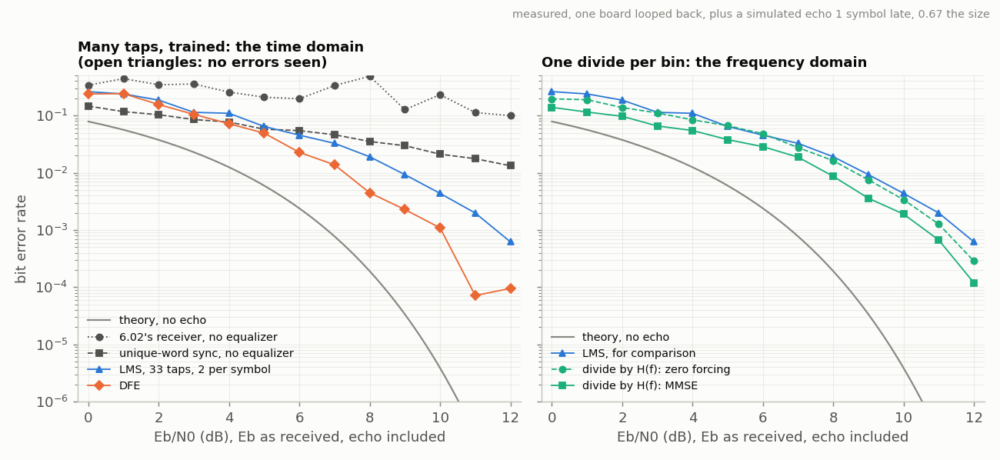

<!-- nav -->
[← 6.04 MSK and GMSK: constant envelope](6_04_msk_and_gmsk.md#604-msk-and-gmsk-constant-envelope) &emsp;&emsp;&emsp; **[Contents](../README.md#contents)** &emsp;&emsp;&emsp; [6.06 Spread spectrum, the GPS way →](6_06_spread_spectrum.md#606-spread-spectrum-the-gps-way)

# 6.05 The channel: sounding it, and equalizing it


Everything so far assumed the cable did nothing but delay the signal and
scale it. It very nearly does; that's why a metre of coax is a good place to
learn. But a cable is a *filter*, and so is the air between two antennas,
and the difference between the two is only how bad a filter. This page
measures the cable, then adds the one thing a short cable lacks, an echo,
and undoes it two ways: the hard way, with a filter that learns, and the
easy way, which is the reason [6.07](6_07_ofdm.md#607-ofdm-the-triumph-of-physics-over-math)'s OFDM runs the world.


## A channel is a filter

Whatever you send, *x*(*t*), comes out as *y*(*t*) = ∫ *h*(τ) *x*(*t* − τ) dτ:
a *convolution* with the channel's [impulse response](https://en.wikipedia.org/wiki/Impulse_response) *h*, or in frequency
*Y*(*f*) = *H*(*f*) *X*(*f*), a multiplication. [1.07](1_07_closing_the_loop.md#107-closing-the-loop-the-dac-talks-to-the-adc) already measured *h*[*n*]
through the cable: nothing for six samples, most of the signal in one, a
little ringing. That *h* is the whole story. Every symbol you send arrives
smeared by it, on top of its smeared neighbours (*intersymbol
interference*), and because the channel is linear and doesn't change from
one symbol to the next, you can measure *h* once and undo it.

## Sounding it, three ways

`sound.py` measures the same cable three ways and compares:

1. **An [m-sequence](https://en.wikipedia.org/wiki/Maximum_length_sequence).** Its circular autocorrelation is a delta function, so
   cross-correlating the record with the chips gives *h*[*n*] directly: [1.07](1_07_closing_the_loop.md#107-closing-the-loop-the-dac-talks-to-the-adc)'s
   trick, the [Wiener–Khinchin theorem](https://en.wikipedia.org/wiki/Wiener%E2%80%93Khinchin_theorem) at work.
2. **A step.** Difference successive samples of the averaged step.
3. **Divide.** The loop repeats, so any known signal's spectrum sits exactly
   on the FFT's bins, and *H*(*f*) = *Y*(*f*)/*X*(*f*) is one complex division per
   bin. [6.07](6_07_ofdm.md#607-ofdm-the-triumph-of-physics-over-math)'s multitone covers the whole band; the [QPSK](https://en.wikipedia.org/wiki/Phase-shift_keying#Quadrature_phase-shift_keying_(QPSK)) frame of [6.02](6_02_psk_and_qpsk.md#602-psk-and-qpsk-finding-the-clock-and-the-carrier)
   sounds its own band, 5.2–7.3 MHz, with no help.

<details>
<summary>The whole file: <code>sound.py</code></summary>

<!-- file: src/comms/sound.py -->
```python
#!/usr/bin/env python3
"""Sounding the channel: its impulse response and its frequency response, three ways.

    python3 sound.py                    # one board looped back (finds its port)
    python3 sound.py PORT_A PORT_B      # board A plays, board B records
    python3 sound.py --sim              # no board: channel.py's model
    python3 sound.py --sim --stub 25    # ... with a 25 m open stub on a T (echo.py)
    python3 sound.py --records 4        # average 4 records per probe (the default)
    python3 sound.py -o sound.npz --no-plot

The board runs awgcap.sv (5.01).  The cable, the converters and the T with its stub are
one linear, time-invariant system: whatever goes in comes out convolved with its impulse
response h[n], or, the same thing, with each frequency multiplied by H(f).  Three probes,
each one loop long, measure it:

  mseq       1.07's m-sequence (GPS's G1, 1023 chips), one chip per ADC sample, played
             8 times with 8 chips of padding to fill the loop.  Cross-correlating the
             record with the sequence gives h[n] directly, because the sequence's
             autocorrelation is a delta (1.07).  25 Mchip/s: h at 40 ns resolution.
  step       a square wave, 8 periods per loop: h[n] is the difference between
             successive samples of the (averaged) step response.
  multitone  every bin of the loop from 3 kHz to 12.3 MHz at the same amplitude with
             random phases (6.04's sounding).  The loop repeats, so its spectrum sits
             exactly on the FFT's bins, and H(f) = Y(f) / X(f): one divide per bin.
             Its inverse FFT is h[n] again.
  psk        psk.py's QPSK frame itself, the same divide, but only where the signal has
             power, 5.2-7.3 MHz.  Any transmission a receiver knows can sound the channel:
             6.07's OFDM does it with one known symbol, every frame.

One system, so all the answers should agree.  (Through the long cable they almost do:
1.07 found it slightly non-linear, 0.74 against 0.79 at the main tap.)

h[n] is in ADC codes per DAC code: about 0.74 at a delay of 6 samples (240 ns) through
1 m of cable, 1.07's number, and nearly nothing elsewhere.  |H(f)| is the same gain
against frequency; its phase slopes down at 2 pi f x 240 ns; the group delay,
-dphase/d(2 pi f), is that 240 ns, flat, until something (a stub) makes it wobble.
"""
import argparse
import os
import sys

import numpy as np

HERE = os.path.dirname(os.path.abspath(__file__))
sys.path.insert(0, HERE)
import channel                                      # noqa: E402
import echo                                         # noqa: E402
import psk                                          # noqa: E402
from psk import g1, find_port                      # noqa: E402

N, L = 16384, 8192                  # DAC samples per loop; ADC samples per loop
FS_DAC, FS_ADC = 50e6, 25e6
HI, LO = 224, 32                    # the m-sequence's and the step's two levels (1.07)
MSEQ = 1023
PROBES = ("mseq", "step", "multitone", "psk")


# ---- the probes: each returns (the DAC waveform, what the ADC should see at 25 MS/s) ----
def probe_mseq():
    chips = 2 * g1(MSEQ) - 1                                  # +1 for a 1, as loopback.sv
    x = np.zeros(L)
    x[:8 * MSEQ] = np.tile(chips, 8)                          # 8 periods, then 8 chips of 0
    return 128 + (HI - LO) / 2 * np.repeat(x, 2), (HI - LO) / 2 * x


def probe_step():
    x = np.where((np.arange(L) // 512) % 2 == 1, HI, LO).astype(float)
    return np.repeat(x, 2), x - (HI + LO) / 2


def probe_multitone(rms=28.0, seed=11):
    rng = np.random.default_rng(seed)
    X = np.zeros(L // 2 + 1, complex)
    band = np.arange(1, L // 2 - 40)                          # 3 kHz to 12.3 MHz
    X[band] = np.exp(2j * np.pi * rng.random(len(band)))
    x = np.fft.irfft(X, L)
    x *= rms / x.std()
    X2 = np.zeros(L + 1, complex)
    X2[:L // 2 + 1] = np.fft.rfft(x)                          # to 50 MS/s: pad the spectrum
    return np.clip(np.round(128 + 2 * np.fft.irfft(X2, N)), 0, 255), x


def probe_psk():
    q, _ = psk.make_frame(4)
    wave = psk.transmit(q, 4)
    return wave, wave[::2] - 128                              # band-limited: every 2nd sample is exact


# ---- the three methods --------------------------------------------------------------
def by_mseq(rec):
    """h[n] by cross-correlation, averaged over the 14 clean periods of the two loops
    (the period right after the padding is skipped)."""
    chips = 2 * g1(MSEQ) - 1
    periods = [rec[lp + k * MSEQ:lp + (k + 1) * MSEQ] for lp in (0, L) for k in range(1, 8)]
    y = np.mean(periods, axis=0)
    # ##########################################################################
    # ##  KEY LINE: cross-correlate what came back with what was sent (1.07).
    # ##  The m-sequence's autocorrelation is a delta, so this IS h[n].
    # ##########################################################################
    r = np.real(np.fft.ifft(np.fft.fft(y - y.mean()) * np.conj(np.fft.fft(chips)))) / (MSEQ + 1)
    return r / ((HI - LO) / 2)                                # ADC codes per DAC code


def by_step(rec, n=64):
    """h[n] from the 16 rising edges (at ADC samples 512, 1536, ...), averaged."""
    edges = 512 + 1024 * np.arange(16)
    s = np.mean([rec[e - 8:e + n] for e in edges], axis=0)
    h = np.diff(s) / (HI - LO)
    return h[7:]                                               # h[0] is the sample of the step


def by_divide(rec, x):
    """H(f) = Y(f) / X(f) on the loop's bins, from the two loops averaged, where the probe
    has power; NaN elsewhere.  Also h[n] = its inverse FFT (multitone only)."""
    y = rec.reshape(2, L).mean(axis=0)
    X = np.fft.rfft(x)
    Y = np.fft.rfft(y - y.mean())
    ok = np.abs(X) > 0.05 * np.abs(X).max()
    H = np.full(len(X), np.nan, complex)
    # ##########################################################################
    # ##  KEY LINE: one complex divide per frequency bin.  (The loop repeats,
    # ##  so the convolution is circular and the FFT turns it into a product.)
    # ##########################################################################
    H[ok] = Y[ok] / X[ok]
    return H


def group_delay(f, H, smooth=64):
    """-d(phase)/d(2 pi f), in seconds, from the unwrapped phase, smoothed over `smooth`
    bins (NaN where H is unknown, and within smooth/2 bins of there)."""
    ok = np.isfinite(H)
    ph = np.unwrap(np.angle(H[ok]))
    gd = -np.gradient(ph, f[ok]) / (2 * np.pi)
    gd = np.convolve(gd, np.ones(smooth) / smooth, mode="valid")
    out = np.full(len(f), np.nan)
    out[np.flatnonzero(ok)[smooth // 2:smooth // 2 + len(gd)]] = gd
    return out


def delay_in_band(f, H, lo=5.3e6, hi=7.2e6):
    """The mean group delay between lo and hi: a straight line fitted to the phase."""
    sel = np.isfinite(H) & (f > lo) & (f < hi)
    return -np.polyfit(f[sel], np.unwrap(np.angle(H[sel])), 1)[0] / (2 * np.pi)


def sound(play, record, probes=PROBES, records=4, align=False):
    """Play each probe, record it `records` times, and measure.  Returns a dict:
    h_mseq, h_step (impulse responses, ADC codes per DAC code, one per 40 ns sample),
    f and H_mseq, H_multitone, H_psk (frequency responses on the loop's bins)."""
    out = {"f": np.fft.rfftfreq(L, 1 / FS_ADC)}
    for name in probes:
        wave, x = globals()["probe_" + name]()
        play(wave)
        rec = np.mean([record() for _ in range(records)], axis=0).astype(float)
        if align:                                                # two boards: find the loop's start
            c = np.fft.irfft(np.fft.rfft(rec[:L] - rec.mean()) * np.conj(np.fft.rfft(x)), L)
            rec = np.roll(rec, -int(np.argmax(c)))
        out["rec_" + name] = rec
        if name == "mseq":
            out["h_mseq"] = by_mseq(rec)
            out["H_mseq"] = np.fft.rfft(out["h_mseq"], L)         # h[n] -> H(f), 1.07's caution applies
        elif name == "step":
            out["h_step"] = by_step(rec)
        else:
            out["H_" + name] = by_divide(rec, x)
            if name == "multitone":
                out["h_multitone"] = np.fft.irfft(np.nan_to_num(out["H_multitone"]), L)
    return out


def summary(out):
    f = out["f"]
    lines = []
    for name in ("mseq", "step", "multitone"):
        if "h_" + name in out:
            h = out["h_" + name]
            lines.append("h[n] by %-9s delay %2d samples, main tap %.3f; h[0..11] = %s"
                         % (name + ":", np.argmax(h[:64]), h[:64].max(), np.round(h[:12], 3)))
    for name in ("mseq", "multitone", "psk"):
        if "H_" + name in out:
            H = out["H_" + name]
            gains = []
            for fm in (1e6, 6.25e6, 11e6):
                near = np.abs(H[np.abs(f - fm) < 50e3])
                gains.append("%.3f" % np.nanmean(near) if np.isfinite(near).any() else "  -  ")
            lines.append("H(f) by %-9s |H| %s at 1 MHz, %s at 6.25 MHz, %s at 11 MHz; delay %.0f ns across 5.3-7.2 MHz"
                         % (name + ":", *gains, delay_in_band(f, H) * 1e9))
    return "\n".join(lines)


def make_link(args):
    """play(wave) and record() for the board(s) or the model, with the simulated stub
    (--stub) added to every record."""
    if args.sim:
        rng = np.random.default_rng(args.seed)
        st = {}
        def play(wave):
            st["wave"] = wave
        def record():
            return channel.channel(st["wave"], rng=rng)
    else:
        sys.path.insert(0, os.path.join(HERE, "..", "twoboard"))
        import awgcap
        ports = args.ports or [find_port()]
        play = lambda wave: awgcap.upload(ports[0], wave)
        record = lambda: awgcap.record(ports[-1])
    if args.stub:
        rec0 = record
        record = lambda: echo.add_stub(rec0(), args.stub, vf=args.vf, loss=args.loss)
    return play, record


def plot(out, title):
    import matplotlib.pyplot as plt
    f = out["f"] / 1e6
    fig, ax = plt.subplots(2, 2, figsize=(12, 7))
    n = np.arange(40)
    for name, m in (("mseq", "o"), ("step", "s"), ("multitone", "^")):
        if "h_" + name in out:
            ax[0, 0].plot(n, out["h_" + name][:40], m + "-", ms=4, lw=0.8, label=name)
    ax[0, 0].set_xlabel("delay (ADC samples of 40 ns)"); ax[0, 0].set_ylabel("h (ADC codes per DAC code)")
    ax[0, 0].set_title("impulse response"); ax[0, 0].legend(); ax[0, 0].grid(True)
    for name in ("mseq", "multitone", "psk"):
        if "H_" + name in out:
            H = out["H_" + name]
            ax[0, 1].plot(f, np.abs(H), lw=0.7, label=name)
            ax[1, 0].plot(f, np.degrees(np.unwrap(np.angle(np.nan_to_num(H, nan=1)))), lw=0.7, label=name)
            ax[1, 1].plot(f, group_delay(out["f"], H) * 1e9, lw=0.7, label=name)
    ax[0, 1].set_ylabel("|H| (ADC codes per DAC code)"); ax[0, 1].set_title("gain")
    ax[1, 0].set_ylabel("phase (degrees, unwrapped)"); ax[1, 0].set_title("phase")
    ax[1, 1].set_ylabel("group delay (ns)"); ax[1, 1].set_title("group delay"); ax[1, 1].set_ylim(0, 600)
    for a in (ax[0, 1], ax[1, 0], ax[1, 1]):
        a.set_xlabel("frequency (MHz)"); a.set_xlim(0, 12.5); a.grid(True); a.legend()
    fig.suptitle(title); fig.tight_layout(); plt.show()


if __name__ == "__main__":
    ap = argparse.ArgumentParser(description=__doc__,
                                 formatter_class=argparse.RawDescriptionHelpFormatter)
    ap.add_argument("ports", nargs="*", help="one port: looped back; two: A plays, B records")
    ap.add_argument("--sim", action="store_true", help="use channel.py's model, not a board")
    ap.add_argument("--stub", type=float, default=0.0, help="add a simulated open stub of this many metres (echo.py)")
    ap.add_argument("--vf", type=float, default=echo.VF, help="--stub: the stub's velocity factor")
    ap.add_argument("--loss", type=float, default=echo.LOSS, help="--stub: the stub's loss, dB/m at 10 MHz")
    ap.add_argument("--probe", choices=PROBES, help="just one probe (default: all four)")
    ap.add_argument("--records", type=int, default=4, help="records averaged per probe")
    ap.add_argument("--seed", type=int, default=1)
    ap.add_argument("-o", "--out", help="save the results (.npz)")
    ap.add_argument("--no-plot", action="store_true")
    args = ap.parse_args()
    play, record = make_link(args)
    out = sound(play, record, (args.probe,) if args.probe else PROBES, args.records,
                align=len(args.ports) == 2)
    print(summary(out))
    if args.out:
        np.savez(args.out, **out)
    if not args.no_plot:
        plot(out, "channel sounding, %s%s" % ("simulated" if args.sim else "measured",
                                              ", %g m stub" % args.stub if args.stub else ""))
```

</details>

```console
$ python3 sound.py                      # awgcap.sv loaded, DAC OUT cabled to ADC IN
h[n] by mseq:     delay  6 samples, main tap 0.786; h[0..11] = [-0.001 -0.001 -0.001 -0.001 -0.002  0.039  0.786 -0.071  0.017  0.006 -0.002  0.001]
h[n] by step:     delay  6 samples, main tap 0.760; h[0..11] = [ 0.     0.     0.     0.     0.     0.042  0.76  -0.036  0.     0.005  0.     0.   ]
h[n] by multitone: delay  5 samples, main tap 0.538; h[0..11] = [-0.046  0.057 -0.073  0.102 -0.169  0.538  0.438 -0.181  0.122 -0.069  0.044 -0.03 ]
H(f) by mseq:     |H| 0.767 at 1 MHz, 0.793 at 6.25 MHz, 0.817 at 11 MHz; delay 239 ns across 5.3-7.2 MHz
H(f) by multitone: |H| 0.772 at 1 MHz, 0.773 at 6.25 MHz, 0.825 at 11 MHz; delay 219 ns across 5.3-7.2 MHz
H(f) by psk:      |H|   -   at 1 MHz, 0.776 at 6.25 MHz,   -   at 11 MHz; delay 218 ns across 5.3-7.2 MHz
```


Three methods, one cable. The m-sequence and the step agree on a main tap
of 0.76–0.79 at six samples (the 3% between them is [1.07](1_07_closing_the_loop.md#107-closing-the-loop-the-dac-talks-to-the-adc)'s slight
nonlinearity, which one measures with an edge and the other with a code).
The multitone's *h* looks different, and it's instructive why: the true
delay is 5.7 samples, between two ADC samples, and a method that works
through the FFT draws the [sinc](https://en.wikipedia.org/wiki/Sinc_function) that a fractional delay really is, 0.54 and
0.44 on neighbouring samples with ripples either side, where the
[cross-correlation](https://en.wikipedia.org/wiki/Cross-correlation), which only ever asks "how much at lag *n*", rounds it to
one tap. Same channel, two honest pictures. The phase is a straight line
whose slope is the delay; the group delay, −dφ/d(2π*f*), is flat at 219–239 ns
across the band, and the gain rises by 7% from 1 to 11 MHz, the ±8% wander
of [6.00](6_00_digital_communications.md#600-digital-communications-hardware-defined-radio)'s model comparison.

## An echo: a T with an open stub

A metre of good coax is too kind a channel to learn equalization on. The
cheap way to make a bad one is an SMA T at the DAC with a length of cable
hanging off its third arm and nothing on the far end. The forward wave at
the T meets two 50 Ω lines in parallel, 25 Ω: two thirds of the voltage goes
on into each branch and a third reflects back to the DAC. The stub's share
travels to the open end, reflects there with the same sign (zero current,
so the voltage doubles), and comes back after τ = 2*L*/*v*, 9.6 ns per metre of
RG-316 (velocity factor 0.695); at the T it again splits two thirds forward,
a third back down the stub. So the ADC gets the direct wave, then echoes of
2/3, −2/9, +2/27, … at τ, 2τ, 3τ, each paying the cable's loss twice. With
*z* = e<sup>−*j*2π*f*τ</sup> and ρ the round-trip loss,

  *H*(*f*) = (2/3) (1 + ρ*z*) / (1 + ρ*z*/3).

*H* is smallest where ρ*z* = −1: at *f* = 1/(2τ), 3/(2τ), 5/(2τ), …, a *comb of
notches* 1/τ apart. That is [4.05](4_05_quarter_wave_stub.md#405-a-quarter-wave-stub)'s "an odd number of quarter waves" again:
the time-domain echo and the frequency-domain stub are the same object. The
loss fills the notches in (the bottom is (2/3)(1 − ρ)/(1 − ρ/3), so a
notch's depth measures the cable's loss), and at DC the stub is invisible,
as it must be. `echo.py` holds the model and prints the menu:

<details>
<summary>The whole file: <code>echo.py</code></summary>

<!-- file: src/comms/echo.py -->
```python
#!/usr/bin/env python3
"""An echo in the cable: a T with an open stub, simulated, on top of channel.py (or a record).

    import echo
    rec = echo.add_stub(channel.channel(wave), 25.0)        # a 25 m open stub on a T
    rec = echo.add_echo(rec, tau=0.64e-6, a=0.67)           # or just: an echo, 0.64 us late,
                                                            #   2/3 the size of the direct signal
    H = echo.stub_response(f, 25.0)                         # the stub's H(f), relative to no stub

    python3 echo.py                     # a table: stub lengths, their delays and their notches
    python3 echo.py --loss 0.045 --vf 0.66      # ... for RG-58 instead of RG-316

Hang an open-ended cable off a T at the DAC (4.05).  A wave from the DAC reaches the T
and sees two 50-ohm lines in parallel, 25 ohm: 2/3 of its voltage goes on into EACH of
them, and 1/3 bounces back to the DAC, whose 50 ohm absorbs it.  The 2/3 that went into
the stub reflects off the open end (+1: the current must be zero there, so the voltage
doubles) and comes back 2L/v later: at RG-316's velocity factor 0.695, 9.6 ns per metre
of stub.  Back at the T it again sees 25 ohm: 2/3 of it goes on to the ADC, and 1/3,
inverted, goes down the stub for another round trip.  So the ADC gets

    the direct signal (2/3 of what it got without the T), then
    echoes at tau, 2 tau, 3 tau, ...  of size  2/3, -2/9, +2/27, ...  of it,

each round trip also paying the cable's loss twice, rho = 10^(-2 L x dB/m / 20).  With
z = e^(-j 2 pi f tau), the whole thing in the frequency domain is one line:

    H(f) = (2/3) [1 + a z / (1 - b z)]       a = 2/3 rho (the first echo),  b = -rho/3
         = (2/3) (1 + rho z) / (1 + rho z/3)

H = 0 wherever rho z = -1: a lossless stub shorts the T at f = 1/(2 tau), 3/(2 tau), ...,
a comb of notches 1/tau apart, where the stub is an odd number of quarter waves (4.05).
Loss fills them in: a notch bottoms out at (2/3)(1 - rho)/(1 - rho/3), so its depth
measures the cable's loss.  At DC the stub is invisible, H = 1, as it should be.

Two things this leaves out: the DAC's and ADC's own reflections (1.07's ringing), and
the stub's own dispersion.  And `a` is a free parameter in add_echo(): a bigger echo
than 2/3 would need a mismatched T, but it makes a nastier channel to equalize.
"""
import argparse

import numpy as np

C = 299792458.0                  # m/s
VF = 0.695                       # RG-316's velocity factor (RG-58: 0.66)
LOSS = 0.10                      # dB per metre at 10 MHz: RG-316, a typical datasheet value
                                 #   (RG-58: about 0.045; RG-213: about 0.02); grows as sqrt(f)
FS_ADC = 25e6
F_C = 6.25e6                     # psk.py's carrier, for the table below
R = 1.5625e6                     # ... and its symbol rate


def stub_response(f, length, vf=VF, loss=LOSS):
    """H(f) of a T with an open stub `length` metres long, relative to the cable without
    it: the direct path and the whole series of echoes, with the cable's loss."""
    f = np.asarray(f, float)
    tau = 2 * length / (vf * C)                                      # the round trip
    rho = 10 ** (-2 * length * loss * np.sqrt(np.abs(f) / 10e6) / 20)   # ... and its loss
    z = np.exp(-2j * np.pi * f * tau)
    # ##########################################################################
    # ##  KEY LINE: the T splits the wave 2/3 - 1/3, the open end reflects it
    # ##  whole, and the echoes go on for ever, each one -1/3 of the last.
    # ##########################################################################
    return 2 / 3 * (1 + rho * z) / (1 + rho * z / 3)


def echo_response(f, tau, a, b=0.0):
    """H(f) of a direct path plus echoes at tau, 2 tau, 3 tau, ... (seconds) of sizes
    a, a b, a b^2, ...: the textbook echo.  b = 0 is a single echo."""
    z = np.exp(-2j * np.pi * np.asarray(f, float) * tau)
    return 1 + a * z / (1 - b * z)


def apply(x, response, fs=FS_ADC):
    """Pass x, one or more whole loops of samples at fs (so periodic), through the
    frequency response `response(f)`.  Works on a record (25 MS/s) or a waveform (50 MS/s)."""
    x = np.asarray(x, float)
    f = np.fft.rfftfreq(len(x), 1 / fs)
    m = x.mean()                                     # the converters' offset isn't the cable's
    # ##########################################################################
    # ##  KEY LINE: a linear channel multiplies each frequency by one complex
    # ##  number.  The loop repeats, so its FFT bins are exactly its frequencies.
    # ##########################################################################
    return m + np.fft.irfft(np.fft.rfft(x - m) * response(f), len(x))


def add_stub(x, length, fs=FS_ADC, **kw):
    """x with a `length` metre open stub's echoes added (see stub_response)."""
    return apply(x, lambda f: stub_response(f, length, **kw), fs)


def add_echo(x, tau, a, b=0.0, fs=FS_ADC):
    """x with an echo `tau` seconds late, `a` times the size (and b, b^2, ... further ones)."""
    return apply(x, lambda f: echo_response(f, tau, a, b), fs)


def impulse(response, n=64, fs=FS_ADC, nfft=8192):
    """The impulse response h[0..n-1] (one sample each at fs) of `response(f)`."""
    f = np.fft.rfftfreq(nfft, 1 / fs)
    return np.fft.irfft(response(f), nfft)[:n]


def notches(length, vf=VF, fmax=FS_ADC / 2):
    """The stub's notch frequencies below fmax: odd multiples of v / 4L."""
    f1 = vf * C / (4 * length)
    return f1 * np.arange(1, int(fmax / f1) + 1, 2)


if __name__ == "__main__":
    ap = argparse.ArgumentParser(description=__doc__,
                                 formatter_class=argparse.RawDescriptionHelpFormatter)
    ap.add_argument("--vf", type=float, default=VF, help="velocity factor")
    ap.add_argument("--loss", type=float, default=LOSS, help="dB per metre at 10 MHz")
    ap.add_argument("--lengths", default="5,10,15,20,25,30,67,133", help="stub lengths, m")
    args = ap.parse_args()
    f = np.fft.rfftfreq(8192, 1 / FS_ADC)
    band = (f > F_C - (1 + 0.35) * R / 2) & (f < F_C + (1 + 0.35) * R / 2)   # psk.py's band
    print("open stub on a T, velocity factor %.3f, %.3f dB/m at 10 MHz (%.1f ns per metre, round trip)"
          % (args.vf, args.loss, 2e9 / (args.vf * C)))
    print("  length  round trip  ADC samples  symbols at 1.56 / 6.25 Msym/s  first echo  |H| in 5.2-7.3 MHz   notches below 12.5 MHz")
    for L in (float(s) for s in args.lengths.split(",")):
        tau = 2 * L / (args.vf * C)
        rho = 10 ** (-2 * L * args.loss * np.sqrt(F_C / 10e6) / 20)
        H = np.abs(stub_response(f, L, args.vf, args.loss))
        nf = notches(L, args.vf)
        print("  %5.0f m  %7.0f ns  %9.1f    %6.2f  / %5.2f                  %4.2f      %4.2f .. %4.2f         %s MHz"
              % (L, tau * 1e9, tau * FS_ADC, tau * R, tau * 4 * R, 2 / 3 * rho, H[band].min(), H[band].max(),
                 ", ".join("%.2f" % (x / 1e6) for x in nf[:6]) + (", ..." if len(nf) > 6 else "")))
    print("(one symbol at 1.5625 Msym/s is 0.64 us: %.0f m of stub)" % (0.64e-6 * args.vf * C / 2))
```

</details>

```console
$ python3 echo.py
open stub on a T, velocity factor 0.695, 0.100 dB/m at 10 MHz (9.6 ns per metre, round trip)
  length  round trip  ADC samples  symbols at 1.56 / 6.25 Msym/s  first echo  |H| in 5.2-7.3 MHz   notches below 12.5 MHz
      5 m       48 ns        1.2      0.07  /  0.30                  0.61      0.67 .. 0.87         10.42 MHz
     10 m       96 ns        2.4      0.15  /  0.60                  0.56      0.14 .. 0.76         5.21 MHz
     25 m      240 ns        6.0      0.37  /  1.50                  0.42      0.31 .. 0.78         2.08, 6.25, 10.42 MHz
     67 m      643 ns       16.1      1.00  /  4.02                  0.20      0.51 .. 0.79         0.78, 2.33, 3.89, 5.44, 7.00, 8.55, ... MHz
(one symbol at 1.5625 Msym/s is 0.64 us: 67 m of stub)
```

> [!NOTE]
> No stub was at hand when this was written, so from here on the echo is
> *added in software* to the real cable's record: a reflection of size *a*
> arriving one symbol late, which is what 67 m of stub would do if cable had
> no loss. The scripts take a real stub (`--stub 0`) the moment one is
> plugged in; a 25 m reel of RG-58 on a T is the one to buy, because its
> third notch lands on the 6.25 MHz carrier, 15 dB deep.


In baseband the echo carries the carrier's phase, e<sup>−*j*2π*f*<sub>c</sub>τ</sup>. The
carrier makes exactly four cycles per symbol here, so a whole-symbol echo
arrives in phase: each received symbol is *z*<sub>*k*</sub> = *s*<sub>*k*</sub> + *a* *s*<sub>*k*−1</sub>, four
points become sixteen, and the margin to a decision boundary shrinks from
0.707 to 0.707(1 − *a*). With no noise there are no errors even at *a* = 0.9;
at *E*<sub>b</sub>/*N*<sub>0</sub> = 10 dB a plain slicer goes from no errors through 6 × 10<sup>−4</sup>
(*a* = 0.3) and 2 × 10<sup>−2</sup> (*a* = 0.67) to 4 × 10<sup>−2</sup> (*a* = 0.9). [6.02](6_02_psk_and_qpsk.md#602-psk-and-qpsk-finding-the-clock-and-the-carrier)'s
receiver does worse still: the Gardner detector is biased by correlated
symbols, and the [Costas loop](https://en.wikipedia.org/wiki/Costas_loop) faces a sixteen-point constellation it was
never told about.

## Undoing it in the frequency domain: divide by *H*

The obvious fix is to divide: *W*(*f*) = 1/*H*(*f*) restores the signal exactly.
It also multiplies the noise by 1/|*H*|<sup>2</sup>, which is enormous in a notch.
For a one-symbol echo the average noise gain is 1/(1 − *a*<sup>2</sup>): 2.6 dB at
*a* = 0.67, 7.2 dB at 0.9. Add the echo's own share of the received energy,
10 log(1 + *a*<sup>2</sup>) = 1.6 dB, and this *zero-forcing* equalizer should lose
4.2 dB: a predicted error rate of 2.9 × 10<sup>−3</sup> at 10 dB, and 3.3 × 10<sup>−3</sup>
measured. A perfect notch (a lossless stub) has no inverse at all; the loss
is what makes it invertible, and the noise then decides how far to go.

The right answer is Wiener's: *W* = *H*<sup>*</sup> *S* / (|*H*|<sup>2</sup> *S* + *N*), which is
zero forcing times "the fraction of what you received that is signal".
Where the channel has buried the signal under the noise, don't dig. This
*MMSE* equalizer needs the noise spectrum, and the record gives it away:
the signal repeats every loop, so it lives on the even bins of a
two-loop FFT and the odd bins hold noise alone. One line, `W = (1/H) * (1 −
N/P)`, and the error rate at 10 dB halves (1.4 × 10<sup>−3</sup> against 3.3 × 10<sup>−3</sup>);
at 0 dB zero forcing is worse than doing nothing and MMSE is not.

## Undoing it in the time domain: a filter that learns

Before OFDM, every modem did this with an [FIR filter](https://en.wikipedia.org/wiki/Finite_impulse_response), *y*<sub>*k*</sub> = Σ<sub>*i*</sub> *w*<sub>*i*</sub> *x*<sub>*k*−*i*</sub>,
whose complex taps it had to find for itself. The **LMS** rule nudges every
tap down the gradient of the squared error:

  *e*<sub>*k*</sub> = *d*<sub>*k*</sub> − *y*<sub>*k*</sub>,  *w*<sub>*i*</sub> ← *w*<sub>*i*</sub> + μ *e*<sub>*k*</sub> *x*<sup>*</sup><sub>*k*−*i*</sub>.

It needs a reference *d*<sub>*k*</sub>: a training sequence the receiver knows (a
modem's handshake; here the frame's 32-symbol unique word, and the first two
records in full), and between trainings its own decisions, which is fine
while most of them are right. Each mode of the input's correlation matrix
settles with a time constant 1/(μλ); stability needs μ < 2/(*N* *P*<sub>*x*</sub>); and
the *misadjustment*, the excess error the dithering taps leave, is about
μ*NP*<sub>*x*</sub>/2, so μ buys speed with a noise floor. The inverse of a one-tap
echo is the infinite series 1, −*a*, *a*<sup>2</sup>, …, so a linear equalizer needs
taps spanning several echo delays (33 here, at two per symbol) and the
truncation sets a floor. Through the cable, with the echo added:

<details>
<summary>The whole file: <code>equalize.py</code></summary>

<!-- file: src/comms/equalize.py -->
```python
#!/usr/bin/env python3
"""QPSK through an echo, and three equalizers that undo it: LMS, a DFE, and divide-by-H(f).

    python3 equalize.py --sim --echo 1:0.67     # an echo one symbol late, 2/3 the size
    python3 equalize.py --sim --stub 25         # a 25 m open stub on a T: echo.py's bounces and loss
    python3 equalize.py PORT --stub 25          # the real cable, plus the simulated stub
    python3 equalize.py PORT                    # the real cable alone (or with a real T and stub)
    python3 equalize.py --sim --echo 1:0.67 --ebn0 10    # noise at the receiver: Eb/N0 = 10 dB
    python3 equalize.py --sim --echo 1:0.67 --ber 0:12   # bit error rate against Eb/N0
    python3 equalize.py --sim --echo 1:0.67 --taps 21 --mu 0.1 --nlms
    python3 equalize.py --sim --echo 1:0.67 --spacing 1  # one tap per symbol instead of two
    python3 equalize.py --sim --echo 1:0.67 -o eq.npz --no-plot

The board runs awgcap.sv (5.01) and plays psk.py's QPSK: 512 symbols per loop (a 32-symbol
unique word, then 480 of data) at 1.5625 Msymbol/s on 6.25 MHz, 16 ADC samples a symbol.

THE CHANNEL is the record (the ADC's, or channel.py's model) plus echo.py's echo, plus
white noise added at the RECEIVER (--ebn0), after the echo, where a radio's front end
adds it.  So a notch in the channel does not notch the noise, and undoing the notch
costs something: that is the whole subject.

FOUR RECEIVERS, all on the same record
  loops  6.02's receiver, untouched: matched filter, Gardner loop, Costas loop, slice.
  lms    the matched filter; then the unique word, correlated at every sample, gives the
         symbol timing and the carrier phase in one go (a burst modem's way: no loops);
         then an FIR filter with `taps` complex taps, 2 per symbol (--spacing 2, "T/2-
         spaced") or 1 (--spacing 1, "symbol-spaced"), whose taps LEARN by the LMS rule:
             y_k = sum_i w_i x_{k-i}           the filter
             e_k = d_k - y_k                   how wrong it was
             w_i <- w_i + mu e_k x*_{k-i}      nudge every tap towards less error
         d_k is the symbol that was sent while training (the first --train records are
         a training sequence the receiver knows in full, as a modem's handshake sends),
         and every frame's unique word; in between it is the receiver's own decision
         (decision-directed).  mu is in units of 1/(taps x input power); --nlms divides
         by the actual |x|^2 of each input vector instead (normalized LMS).
  dfe    the same, plus --fb taps fed with the past DECISIONS: a decided symbol is clean,
         so subtracting the echo it causes adds no noise (until a decision is wrong, and
         the error propagates).
  fd     divide by H(f).  The channel is sounded once with sound.py's multitone, and the
         record's spectrum is divided by H(f) bin by bin (zero forcing, ZF), or multiplied
         by (1/H) x S/(S + N), which backs off where the signal is weak (MMSE).  The result
         goes to 6.02's receiver, untouched.

The matched filter is the best receiver for one pulse in white noise.  After an echo the
signal isn't one pulse any more, and the equalizer is what fixes that.
"""
import argparse
import math
import os
import sys

import numpy as np

HERE = os.path.dirname(os.path.abspath(__file__))
sys.path.insert(0, HERE)
import channel                                      # noqa: E402
import echo                                         # noqa: E402
import psk                                          # noqa: E402
import sound                                        # noqa: E402
from psk import N, FS_ADC, F_LOOP, F_C, NSYM, NUW, find_port       # noqa: E402

L = 8192                            # ADC samples per loop
M = 4                               # QPSK
EDGE = 7 * 16                       # samples at each end of the matched filter's output to skip


# ---- the channel ------------------------------------------------------------------
def add_noise(rec, ebn0_db, nsym=NSYM, rng=None):
    """White noise at the receiver, in fc +- the symbol rate, for Eb/N0 = ebn0_db, with
    Eb the energy per bit AS RECEIVED (from the record's own power, echoes and all)."""
    rng = np.random.default_rng(rng)
    rec = np.asarray(rec, float)
    R = nsym * F_LOOP
    s = rec - rec.mean()
    Eb = np.mean(s**2) / R / math.log2(M)
    N0 = Eb / 10**(ebn0_db / 10)
    f = np.fft.rfftfreq(len(rec), 1 / FS_ADC)
    band = np.abs(f - F_C) <= R
    var = N0 * band.sum() * (FS_ADC / len(rec))           # noise power = N0 x bandwidth
    X = np.zeros(len(f), complex)
    X[band] = rng.standard_normal(band.sum()) + 1j * rng.standard_normal(band.sum())
    x = np.fft.irfft(X, len(rec))
    return rec + x * np.sqrt(var) / x.std()


def make_link(args):
    """play(wave) and record() for the board(s) or the model, with the echo (--echo or
    --stub) added to every record.  Returns them and a description for the plots."""
    if args.sim:
        rng = np.random.default_rng(args.seed)
        st = {}
        def play(wave):
            st["wave"] = wave
        def record():
            return channel.channel(st["wave"], rng=rng)
        desc = "simulated"
    else:
        sys.path.insert(0, os.path.join(HERE, "..", "twoboard"))
        import awgcap
        ports = args.ports or [find_port()]
        play = lambda wave: awgcap.upload(ports[0], wave)
        record = lambda: awgcap.record(ports[-1])
        desc = "measured"
    rec0 = record
    if args.stub:
        record = lambda: echo.add_stub(rec0(), args.stub, vf=args.vf, loss=args.loss)
        desc += ", %g m stub" % args.stub
    elif args.echo:
        D, a, b = args.echo
        tau = D / (args.nsym * F_LOOP)
        record = lambda: echo.add_echo(rec0(), tau, a, b)
        desc += ", echo %g symbol%s late, size %g" % (D, "" if D == 1 else "s", a)
    return play, record, desc


def sound_channel(play, record, records=4):
    """H(f) on the loop's bins, by sound.py's multitone, through whatever record() does."""
    wave, x = sound.probe_multitone()
    play(wave)
    rec = np.mean([record() for _ in range(records)], axis=0)
    return sound.by_divide(rec, x)


# ---- receiver 1: 6.02's loops ----------------------------------------------------------
def loops(rec, q, nsym=NSYM):
    """psk.py's receiver (any symbols per loop).  Returns its dict: errs, nbits, mer, ..."""
    sps = FS_ADC * N / psk.FS_DAC / nsym
    y = psk.matched(rec, nsym)
    zs, times, ted, period = psk.timing_loop(y, sps)
    zs = zs / np.sqrt(np.mean(np.abs(zs)**2))
    zc, phi, w, ec = psk.costas(zs, M)
    r = dict(y=y, sps=sps, times=times, zc=zc, phi=phi)
    r.update(psk.score(zc, M, nsym, q))
    return r


# ---- receivers 2 and 3: sync on the unique word, then LMS, with or without feedback ----
def sync(y, q, sps):
    """Where the frame starts (a sample of y) and the carrier phase there: correlate the
    matched filter's output with the unique word at every sample offset.  (6.02 did
    this once per symbol, after the loops; here it replaces them.)"""
    uw = psk.point(q[:NUW], M)
    step = int(round(sps))
    K = len(y) - NUW * step
    c = np.zeros(K, complex)
    for i in range(NUW):
        c += np.conj(uw[i]) * y[i * step:i * step + K]
    c /= NUW
    t0 = EDGE + int(np.argmax(np.abs(c[EDGE:EDGE + L])))     # the first whole frame
    return t0, np.angle(c[t0]), c


def lms(u, j0, ks, known, w, mu, sps, fb=0, nlms=False, power=1.0):
    """The LMS equalizer, run over symbols ks.  u: the input, `sps` samples per symbol,
    symbol k's centre at u[j0 + sps k].  known[k]: the symbol sent, or None (decide).
    w: the taps, feedforward (centred on the symbol) then `fb` feedback ones; updated in
    place.  Returns the outputs y_k, the errors e_k, the decisions, and the taps' history."""
    taps = len(w) - fb
    half = taps // 2
    up = np.concatenate([np.zeros(half), u, np.zeros(half)])      # so the edges are safe
    past = np.zeros(fb, complex)                                   # the last fb decisions
    ys, es, ds, W = [], [], [], []
    for k in ks:
        j = j0 + sps * k + half
        x = up[j + half - np.arange(taps)]                         # newest sample first
        if fb:
            x = np.concatenate([x, past])
        # ######################################################################
        # ##  KEY LINES: the filter, the error, the update.  A DFE is the same
        # ##  thing with the past decisions appended to the input vector.
        # ######################################################################
        y = w @ x
        d = known[k] if known[k] is not None else psk.point(psk.decide(y, M), M)
        e = d - y
        g = mu / (1e-9 + np.vdot(x, x).real) if nlms else mu / (len(x) * power)
        w += g * e * np.conj(x)
        if fb:
            past = np.concatenate([[d], past[:-1]])
        ys.append(y); es.append(e); ds.append(d); W.append(w.copy())
    return np.array(ys), np.array(es), np.array(ds), np.array(W)


def wiener(u, j0, ks, sent, taps, sps):
    """The least-squares taps for the same input: the answer the LMS creeps towards.  One
    matrix solve instead of thousands of nudges, but it needs the whole record at once."""
    half = taps // 2
    up = np.concatenate([np.zeros(half), u, np.zeros(half)])
    X = np.array([up[j0 + sps * k + 2 * half - np.arange(taps)] for k in ks])
    # ##########################################################################
    # ##  KEY LINE: minimize sum |d - X w|^2 over w: a least-squares solve.
    # ##########################################################################
    return np.linalg.lstsq(X, sent, rcond=None)[0]


def equalized(y, w, step):
    """The whole matched-filter output put through the (feedforward) taps, spaced `step`
    samples: the equalized signal at every sample, for an eye diagram."""
    taps = len(w)
    half = taps // 2
    out = np.zeros(len(y), complex)
    for i, wi in enumerate(w):
        out += wi * np.roll(y, -(half - i) * step)
    return out


# ---- receiver 4: divide by H(f) ----------------------------------------------------------
def fd_equalize(rec, H, mmse=True, nsym=NSYM, smooth=64, hlen=256):
    """The record's spectrum divided by the sounded H(f): zero forcing, or MMSE.  The
    signal repeats every loop, so it has power only on the record's EVEN bins; the odd
    bins hold noise alone, and that measures S and N for the MMSE's S/(S + N)."""
    rec = np.asarray(rec, float)
    m = rec.mean()
    Rf = np.fft.rfft(rec - m)
    f = np.fft.rfftfreq(len(rec), 1 / FS_ADC)
    fH = np.fft.rfftfreq(L, 1 / FS_ADC)
    # The sounded H(f) carries the converters' rounding noise, 1-2% per bin, and 1/H
    # would stamp that onto the signal.  But the channel's h[n] is short (sound.py),
    # so keep only its first `hlen` samples: H(f) smoothed, the noise averaged away.
    h = np.fft.irfft(np.nan_to_num(H), L)
    h[hlen:] = 0
    H = np.fft.rfft(h, L)
    Hi = np.interp(f, fH, H.real) + 1j * np.interp(f, fH, H.imag)
    R = nsym * F_LOOP
    inband = np.abs(f - F_C) <= R                              # the matched filter's band
    W = np.zeros(len(f), complex)
    # ##########################################################################
    # ##  KEY LINE: zero forcing is one complex divide per bin.
    # ##########################################################################
    W[inband] = 1 / Hi[inband]
    if mmse:
        k = np.ones(smooth) / smooth
        P = np.abs(Rf)**2
        Ps = np.convolve(P[0::2], k, mode="same")              # even bins: signal + noise
        Pn = np.convolve(P[1::2], k, mode="same")              # odd bins: noise
        Pn = np.append(Pn, Pn[-1])                              # (one fewer odd bin than even)
        wiener = np.clip(1 - Pn / Ps, 0, 1)
        # ######################################################################
        # ##  KEY LINE: MMSE = zero forcing times S / (S + N): where the channel
        # ##  has buried the signal in noise, don't try to dig it out.
        # ######################################################################
        W *= np.repeat(wiener, 2)[:len(W)]
    return m + np.fft.irfft(Rf * W, len(rec)), W


# ---- putting it together ------------------------------------------------------------------
def score(z, sent, is_uw):
    """Bit errors, bits and MER (dB) of the symbols z against the ones sent, data only."""
    d = ~is_uw
    errs = int(np.sum(psk.q_to_bits(psk.decide(z[d], M), M) != psk.q_to_bits(psk.decide(sent[d], M), M)))
    return dict(errs=errs, nbits=2 * int(d.sum()), mer=-10 * np.log10(np.mean(np.abs(z[d] - sent[d])**2)))


def slicer(rec, q, nsym=NSYM, spacing=2):
    """Matched filter, unique-word sync, and the symbols at every symbol instant, with
    `spacing` samples per symbol in between (u, j0): the equalizers' input."""
    sps_in = FS_ADC * N / psk.FS_DAC / nsym                    # 16
    step = int(round(sps_in / spacing))                        # samples between taps
    y = psk.matched(rec, nsym)
    t0, phi, c = sync(y, q, sps_in)
    u = y[t0 % step::step] * np.exp(-1j * phi)
    j0 = t0 // step
    ks = np.arange(int(np.ceil((EDGE - t0) / sps_in)), (len(y) - EDGE - t0) // int(sps_in))
    sent = psk.point(q[ks % nsym], M)
    is_uw = (ks % nsym) < NUW
    return dict(y=y, t0=t0, phi=phi, u=u, j0=j0, step=step, ks=ks, sent=sent, is_uw=is_uw,
                x=u[j0 + spacing * ks])


def receive_all(rec, q, args, state, H=None, count=True):
    """Run every receiver on one record.  `state` keeps the equalizers' taps between
    records; `count` says whether this record's errors are to be counted (not while
    training).  Returns a dict of results."""
    nsym = args.nsym
    out = {}
    # 1. the loops
    r = loops(rec, q, nsym)
    out["loops"] = dict(errs=r["errs"], nbits=r["nbits"], mer=r["mer"], r=r)
    # 2, 3. sync, then LMS and DFE
    s = slicer(rec, q, nsym, args.spacing)
    out["sync"] = s
    out["none"] = score(s["x"], s["sent"], s["is_uw"])
    out["none"]["x"] = s["x"]
    training = not count or args.train_all
    known = {k: (z if (training or uw) else None) for k, z, uw in zip(s["ks"], s["sent"], s["is_uw"])}
    power = np.mean(np.abs(s["u"])**2)
    for name, fb in (("lms", 0), ("dfe", args.fb)):
        if name not in state:
            state[name] = np.zeros(args.taps + fb, complex)
            state[name][args.taps // 2] = 1.0                    # start as "do nothing"
        ys, es, ds, W = lms(s["u"], s["j0"], s["ks"], known, state[name], args.mu, args.spacing,
                            fb, args.nlms, power)
        out[name] = score(ys, s["sent"], s["is_uw"])
        out[name].update(y=ys, e=es, W=W, ks=s["ks"])
    # 4. divide by H(f), then the same sync and slicer (and, for the record, 6.02's loops)
    if H is not None:
        for name, mmse in (("fd_zf", False), ("fd_mmse", True)):
            req, W = fd_equalize(rec, H, mmse, nsym)
            s2 = slicer(req, q, nsym, args.spacing)
            out[name] = score(s2["x"], s2["sent"], s2["is_uw"])
            out[name].update(W=W, rec=req, x=s2["x"])
        r = loops(req, q, nsym)
        out["fd_mmse_loops"] = dict(errs=r["errs"], nbits=r["nbits"], mer=r["mer"])
    return out


RECEIVERS = ("loops", "none", "lms", "dfe", "fd_zf", "fd_mmse", "fd_mmse_loops")
LABELS = {"loops": "6.02's loops, no equalizer", "none": "unique-word sync, no equalizer",
          "lms": "LMS", "dfe": "DFE", "fd_zf": "divide by H(f), zero forcing",
          "fd_mmse": "divide by H(f), MMSE", "fd_mmse_loops": "divide by H(f), MMSE, then 6.02's loops"}


def run(args, play, record, q, H, ebn0=None, rng=None, records=None, state=None, min_errs=0):
    """`records` records (the first `train` of them as training), every receiver; with
    min_errs, keep going (up to args.max_records) until the LMS has that many errors.
    Returns (totals per receiver, the last record's results, the equalizers' state)."""
    records = records or args.records
    state = {} if state is None else state
    tot = {k: [0, 0, []] for k in RECEIVERS}
    hist = {"W_lms": [], "e_lms": [], "e_dfe": []}                # the whole run, record by record
    last = None
    i = 0
    while i < records or (min_errs and tot["lms"][0] < min_errs and i < args.max_records):
        rec = record()
        if ebn0 is not None:
            rec = add_noise(rec, ebn0, args.nsym, rng)
        last = receive_all(rec, q, args, state, H, count=i >= args.train)
        if i >= args.train:
            for k in RECEIVERS:
                if k in last:
                    tot[k][0] += last[k]["errs"]; tot[k][1] += last[k]["nbits"]; tot[k][2].append(last[k]["mer"])
        hist["W_lms"].append(last["lms"]["W"]); hist["e_lms"].append(last["lms"]["e"]); hist["e_dfe"].append(last["dfe"]["e"])
        i += 1
    state["hist"] = {k: np.concatenate(v) for k, v in hist.items()}
    return tot, last, state


def plot(res, tot, desc, args):
    import matplotlib.pyplot as plt
    fig, ax = plt.subplots(2, 3, figsize=(13, 8))
    ks = res["lms"]["ks"]
    W = res["lms"]["W"]
    half = args.taps // 2
    for i in range(max(0, half - 2 * args.spacing), min(args.taps, half + 8 * args.spacing + 1)):
        ax[0, 0].plot(ks, W[:, i].real, lw=0.8, label="tap %+d" % (i - half) if i in (half, half + args.spacing) else None)
    ax[0, 0].set_xlabel("symbol"); ax[0, 0].set_ylabel("Re(tap)"); ax[0, 0].legend(fontsize=8)
    ax[0, 0].set_title("LMS taps (last record)")
    for name in ("lms", "dfe"):
        e2 = np.abs(res[name]["e"])**2
        ax[0, 1].plot(ks, 10 * np.log10(np.convolve(e2, np.ones(32) / 32, mode="same") + 1e-9), lw=0.8, label=name)
    ax[0, 1].set_xlabel("symbol"); ax[0, 1].set_ylabel("error power (dB)"); ax[0, 1].legend()
    ax[0, 1].set_title("|e|^2, averaged over 32 symbols")
    f = np.fft.rfftfreq(2 * L, 1 / FS_ADC) / 1e6
    for name in ("fd_zf", "fd_mmse"):
        if name in res:
            ax[0, 2].plot(f, np.abs(res[name]["W"]), lw=0.8, label=name)
    ax[0, 2].set_xlim(4.5, 8); ax[0, 2].set_xlabel("frequency (MHz)"); ax[0, 2].set_ylabel("|W(f)|")
    ax[0, 2].set_title("the frequency-domain equalizers"); ax[0, 2].legend()
    pts = (("none", res["none"]["x"]), ("lms", res["lms"]["y"]), ("dfe", res["dfe"]["y"]))
    for a, (name, z) in zip(ax[1], pts):
        a.plot(z.real, z.imag, ".", ms=2)
        a.set_aspect("equal"); a.set_xlim(-2, 2); a.set_ylim(-2, 2)
        a.set_title("%s: %d errors in %d bits, MER %.1f dB" % (name, tot[name][0], tot[name][1], np.mean(tot[name][2])), fontsize=9)
    fig.suptitle("QPSK, %s" % desc); fig.tight_layout(); plt.show()


def parse_echo(s):
    p = [float(x) for x in s.split(":")]
    return (p + [0.0])[:3] if len(p) >= 2 else (p[0], 0.67, 0.0)


def defaults(D, spacing=2, taps=None, fb=None, mu=0.3, nlms=False, train=2, records=6,
             max_records=24, nsym=NSYM, train_all=False):
    """The equalizers' settings for an echo D symbols late, as the command line would
    set them: taps spanning 8 echo delays each side (the inverse of an echo is a series
    that dies away as a^k), and feedback taps spanning 3 (the echoes themselves)."""
    import types
    taps = taps or 2 * spacing * max(4, int(math.ceil(8 * D))) + 1
    fb = fb or max(2, int(math.ceil(3 * D)))
    return types.SimpleNamespace(spacing=spacing, taps=taps, fb=fb, mu=mu, nlms=nlms, train=train,
                                 records=records, max_records=max_records, nsym=nsym, train_all=train_all)


if __name__ == "__main__":
    ap = argparse.ArgumentParser(description=__doc__,
                                 formatter_class=argparse.RawDescriptionHelpFormatter)
    ap.add_argument("ports", nargs="*", help="one port: looped back; two: A plays, B records")
    ap.add_argument("--sim", action="store_true", help="use channel.py's model, not a board")
    ap.add_argument("--echo", type=parse_echo, help="DELAY:SIZE[:RATIO]: an echo DELAY symbols late, SIZE times the direct signal (RATIO: each further echo over the last)")
    ap.add_argument("--stub", type=float, default=0.0, help="a simulated open stub of this many metres on a T (echo.py)")
    ap.add_argument("--vf", type=float, default=echo.VF, help="--stub: velocity factor")
    ap.add_argument("--loss", type=float, default=echo.LOSS, help="--stub: dB per metre at 10 MHz")
    ap.add_argument("--ebn0", type=float, help="noise at the receiver: Eb/N0 in dB")
    ap.add_argument("--ber", help="bit error rate at Eb/N0 = LO:HI dB (1 dB steps)")
    ap.add_argument("--records", type=int, default=6, help="records per run (--ber: at least this many per point)")
    ap.add_argument("--max-records", type=int, default=24, help="--ber: at most this many per point (it stops at 100 LMS errors)")
    ap.add_argument("--train", type=int, default=2, help="of which the first this many are a training sequence")
    ap.add_argument("--train-all", action="store_true", help="never decision-directed: always told the symbols")
    ap.add_argument("--taps", type=int, help="feedforward taps (default: from the echo's delay)")
    ap.add_argument("--fb", type=int, help="the DFE's feedback taps (default: from the echo's delay)")
    ap.add_argument("--spacing", type=int, default=2, choices=(1, 2), help="taps per symbol")
    ap.add_argument("--mu", type=float, default=0.3, help="LMS step, in units of 1/(taps x power)")
    ap.add_argument("--nlms", action="store_true", help="normalized LMS")
    ap.add_argument("--nsym", type=int, default=NSYM, help="symbols per loop (2048: 6.25 Msymbol/s)")
    ap.add_argument("--seed", type=int, default=1)
    ap.add_argument("-o", "--out", help="save the results (.npz)")
    ap.add_argument("--no-plot", action="store_true")
    args = ap.parse_args()
    D = args.echo[0] if args.echo else (2 * args.stub / (args.vf * echo.C)) * args.nsym * F_LOOP if args.stub else 0.5
    d = defaults(D, args.spacing, args.taps, args.fb)
    args.taps, args.fb = d.taps, d.fb
    play, record, desc = make_link(args)
    R = args.nsym * F_LOOP
    print("QPSK at %.4g Msymbol/s, %s; echo %.2f symbols late (%.0f ns); equalizer: %d taps, %d per symbol, "
          "%d feedback, mu %g%s, %d training records" % (R / 1e6, desc, D, D / R * 1e9, args.taps, args.spacing,
                                                         args.fb, args.mu, " (NLMS)" if args.nlms else "", args.train))
    H = sound_channel(play, record)
    q, _ = psk.make_frame(M, args.nsym)
    play(psk.transmit(q, M))
    rng = np.random.default_rng(args.seed + 1)
    if args.ber:
        lo, hi = (float(x) for x in args.ber.split(":"))
        rows = []
        shown = RECEIVERS[:-1]
        print("Eb/N0 (dB), then bit errors / bits for: " + ", ".join(shown) + "  (theory)")
        for eb in np.arange(lo, hi + 0.01, 1.0):
            tot, _, _ = run(args, play, record, q, H, eb, rng, min_errs=100)
            rows.append([eb] + [tot[k][0] / max(1, tot[k][1]) for k in shown])
            print("%5.1f  " % eb + "  ".join("%5d/%-6d" % (tot[k][0], tot[k][1]) for k in shown)
                  + "  (%.1e)" % psk.ber_theory(eb), flush=True)
        if args.out:
            np.savez(args.out, rows=np.array(rows), receivers=shown, desc=desc)
    else:
        tot, res, state = run(args, play, record, q, H, args.ebn0, rng)
        print("sync: frame starts at sample %d, phase %.0f deg" % (res["sync"]["t0"], np.degrees(res["sync"]["phi"])))
        for k in RECEIVERS:
            print("  %-32s %5d errors in %6d bits, MER %5.1f dB" % (LABELS[k] + ":", tot[k][0], tot[k][1], np.mean(tot[k][2])))
        if args.out:
            np.savez(args.out, desc=desc, **{k + "_" + f: v for k in RECEIVERS for f in ("errs", "nbits")
                                           for v in [tot[k][0 if f == "errs" else 1]]},
                     W_lms=res["lms"]["W"], e_lms=res["lms"]["e"], y_lms=res["lms"]["y"], x_none=res["none"]["x"],
                     ks=res["lms"]["ks"], W_zf=res["fd_zf"]["W"], W_mmse=res["fd_mmse"]["W"])
        if not args.no_plot:
            plot(res, tot, desc, args)
```

</details>

```console
$ python3 equalize.py --echo 1:0.67 --ebn0 10
QPSK at 1.562 Msymbol/s, measured, echo 1 symbol late, size 0.67; echo 1.00 symbols late (640 ns); equalizer: 33 taps, 2 per symbol, 3 feedback, mu 0.3, 2 training records
sync: frame starts at sample 8203, phase -128 deg
  6.02's loops, no equalizer:        381 errors in   3840 bits, MER   3.8 dB
  unique-word sync, no equalizer:    189 errors in   7616 bits, MER   6.5 dB
  LMS:                                34 errors in   7616 bits, MER   8.8 dB
  DFE:                                 7 errors in   7616 bits, MER  11.0 dB
  divide by H(f), zero forcing:       19 errors in   7620 bits, MER   9.3 dB
  divide by H(f), MMSE:               17 errors in   7620 bits, MER   9.8 dB
  divide by H(f), MMSE, then 6.02's loops:    10 errors in   3840 bits, MER   9.6 dB
```

Two things about that table. The equalizer here *replaces* [6.02](6_02_psk_and_qpsk.md#602-psk-and-qpsk-finding-the-clock-and-the-carrier)'s loops: the
unique word gives the timing to a sixteenth of a symbol and the phase in one
correlation, as a burst modem (Wi-Fi) does, and the taps absorb the rest.
That works because the taps are spaced at half a symbol: a *fractionally
spaced* equalizer sees the whole band and can move the sampling instant
itself; a symbol-spaced one sees only the spectrum folded at the symbol
rate, and a sampling-phase error can put a null in the folded spectrum that
no tap can undo (`--spacing 1` to see it fail). And the **DFE**, the
*decision-feedback equalizer*, wins: feed the past *decisions* back through
their own taps, *y*<sub>*k*</sub> = Σ *w*<sub>*i*</sub> *x*<sub>*k*−*i*</sub> − Σ *b*<sub>*j*</sub> *d*<sub>*k*−*j*</sub>, and since a decision is
clean, subtracting the echo it causes adds no noise. For a one-tap echo the
DFE needs one feedback tap and loses only the echo's 1.6 dB. Its weakness is
that a wrong decision is fed back and breeds more; at low *E*<sub>b</sub>/*N*<sub>0</sub> its
curve crosses above the plain LMS one.



<details>
<summary><b>Detail:</b> where the sync lands, and what the taps really converge to</summary>

The unique-word correlation that finds the frame is itself a channel
sounding, |*c*(τ)| ≈ |*g*(τ) + *a g*(τ − *T*)|, so with a one-symbol echo it
lands 0.3 symbol *between* the two paths (sample 8203, not 8198). Seen from
there the symbol-spaced channel is [−0.07, 0.23, 0.86, 0.32, −0.04], and the
least-squares taps at offsets −1..+3 are [−0.79, 1.78, −0.90, 0.57, −0.39]:
the equalizer needs taps *before* the main one as well as after. Only a
sampler sitting exactly on the direct path would see the tidy 1, −*a*, *a*<sup>2</sup>,
−*a*<sup>3</sup>. `wiener()` solves for those taps in one matrix inversion, which is
what RLS creeps towards and LMS crawls towards.

</details>

## One tap per subcarrier

Dividing by *H*(*f*) was one complex divide per bin, and it worked because the
record was periodic: a circular convolution is a product of FFTs. [6.07](6_07_ofdm.md#607-ofdm-the-triumph-of-physics-over-math)'s
OFDM makes *every symbol* periodic with a [cyclic prefix](https://en.wikipedia.org/wiki/Cyclic_prefix), so every symbol is
equalized by one divide per subcarrier, measured from a pilot, with no
training sequence, no convergence, no μ, no misadjustment, and the MMSE
version is the same divide with the Wiener factor. That is why Wi-Fi, LTE,
digital TV and DSL are OFDM, and why [6.06](6_06_spread_spectrum.md#606-spread-spectrum-the-gps-way)'s CDMA lost: a rake receiver
is a DFE's worth of trouble for every echo, and the echoes multiply with the
bandwidth. (The single-carrier frequency-domain equalizer that
`equalize.py`'s `fd` receivers are is exactly what LTE's uplink does.)

**Try this:**

- `--spacing 1` against `2`: shift the sync by four samples (add 4 to
  `t0` in `sync()`) and watch the symbol-spaced equalizer fail and the
  fractionally spaced one not notice.
- Raise `--mu` until the LMS diverges (about 2 in `equalize.py`'s units);
  lower it and time the convergence. Then replace it with `wiener()` on one
  record: one solve instead of thousands of nudges. What does that cost?
- `--echo 0.375:0.9` puts a 20 dB notch on the carrier (what the 25 m stub
  does): zero forcing 242 errors, MMSE 104, the DFE 15 in 7624 bits at 10 dB.
- `--nsym 2048 --stub 10`: at 6.25 Msymbol/s a 10 m stub is as bad as the
  one-symbol echo ([6.02](6_02_psk_and_qpsk.md#602-psk-and-qpsk-finding-the-clock-and-the-carrier)'s receiver 35% errors, LMS 0.7%, the DFE 0.06%).
- With a real stub: measure its notch depth with `sound.py` and solve
  (2/3)(1 − ρ)/(1 − ρ/3) for ρ: the cable's loss, from an echo.
- PySDR's [multipath fading chapter](https://pysdr.org/content/multipath_fading.html)
  is the wireless version of this page, with the Rayleigh fading a cable
  cannot make; its [sync chapter](https://pysdr.org/content/sync.html) has the
  same equalizer ideas in a few lines of numpy.

