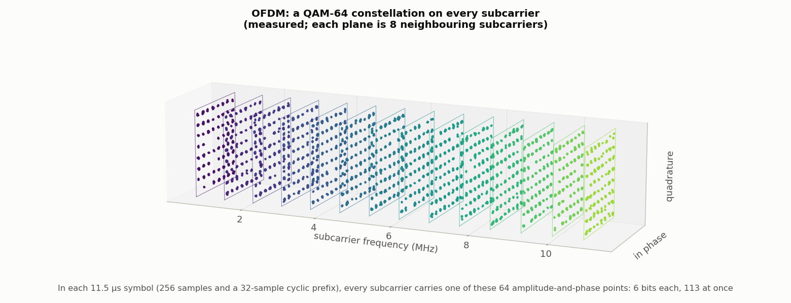
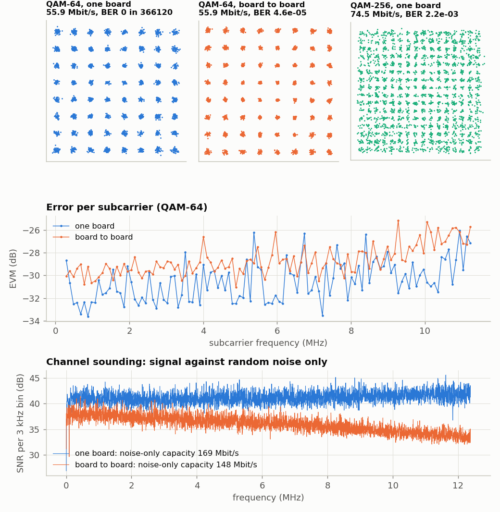
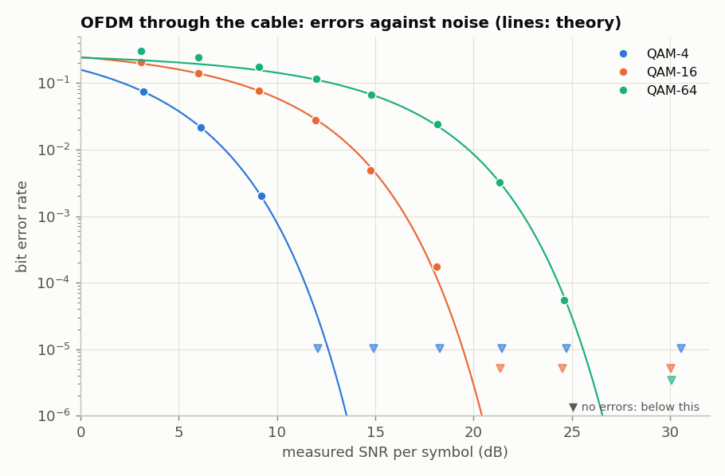

<!-- nav -->
[← 6.06 Spread spectrum, the GPS way](6_06_spread_spectrum.md#606-spread-spectrum-the-gps-way) &emsp;&emsp;&emsp; **[Contents](../README.md#contents)** &emsp;&emsp;&emsp; [6.08 Shannon's limit, and how far from it you are →](6_08_shannons_limit.md#608-shannons-limit-and-how-far-from-it-you-are)

# 6.07 OFDM: the triumph of physics over math



The modem of [5.05](5_05_fsk_modem.md#505-a-modem) spends a whole 6 MHz of bandwidth on a single bit at a time,
and [6.02](6_02_psk_and_qpsk.md#602-psk-and-qpsk-finding-the-clock-and-the-carrier)'s [QPSK](https://en.wikipedia.org/wiki/Phase-shift_keying#Quadrature_phase-shift_keying_(QPSK)) carried 3.1 Mbit/s in 2.1 MHz, 1.5 bits per second per hertz.
Modern links (Wi-Fi, 4G and 5G, DSL, digital TV) do much better with
*[orthogonal frequency-division multiplexing](https://en.wikipedia.org/wiki/Orthogonal_frequency-division_multiplexing)*, OFDM, and it is Fourier analysis
put to work. (learnSDR planned a lesson on it that never got made; this
is that lesson.)

1. **Split the band into many narrow subcarriers.** Here a 256-point FFT at
   25 MS/s gives subcarriers 97.66 kHz apart, and 113 of them (0.29 to
   11.2 MHz) are used. Why 113 of 256? The DAC plays a real signal, and the
   FFT of a real signal is symmetric: bins 129–255 are the negative
   frequencies, mirror images of bins 1–127, so only bins 0–128 (0 to
   12.5 MHz) can carry data. Of those, bins 0–2 (below 0.29 MHz) stay empty
   because the converters' offsets and low-frequency noise live there, and
   bins 116–128 (11.3–12.5 MHz) because near the ADC's [Nyquist frequency](https://en.wikipedia.org/wiki/Nyquist_frequency) the
   analog filters roll off and the DAC's image folds back on top ([1.08](1_08_lockin.md#108-a-lock-in-amplifier)).
2. **Put one complex number on each:** a point of a *[QAM](https://en.wikipedia.org/wiki/Quadrature_amplitude_modulation) constellation*.
   QAM-16 is a 4 × 4 grid of amplitudes and phases (4 bits); QAM-64 is 8 × 8
   (6 bits); QAM-256 is 16 × 16 (8 bits).
3. **The inverse FFT turns the 113 numbers into one stretch of waveform**, 256
   samples, a *symbol*. Copy its last 32 samples in front, as a *cyclic
   prefix*. An FFT finds frequencies as if its 256 samples repeated over and
   over again forever (that's the *cyclic*), and the prefix makes the received
   symbol look like exactly that, even though the cable smears the end of one
   symbol into the start of the next. The prefix must be longer than the
   channel's memory: here 32 samples, 1.28 µs, against a cable that has
   stopped ringing within 0.3 µs ([1.07](1_07_closing_the_loop.md#107-closing-the-loop-the-dac-talks-to-the-adc)). With that, the channel's
   *y*[*n*] = Σ<sub>*m*</sub> *h*[*m*] *x*[*n* − *m*] becomes a *circular* convolution, and a
   circular convolution is a product of FFTs: *Y*<sub>*k*</sub> = *H*<sub>*k*</sub> *X*<sub>*k*</sub>, one
   complex number per subcarrier. The price is 32 samples in every 288, 11%
   of the time.


4. **At the receiver, drop the prefix and take the FFT.** Because of the
   prefix, the channel's smearing (a few samples long, as [1.07](1_07_closing_the_loop.md#107-closing-the-loop-the-dac-talks-to-the-adc)'s loopback
   showed) acts on each subcarrier as a single complex multiplication H(f). One
   known *pilot* symbol measures H(f), and dividing by it undoes the whole
   channel: cable, converters, filters, and the clock offset.

## The triumph of physics over math

Step 4 is the whole reason OFDM runs the world, so it deserves a closer
look. [6.05](6_05_the_channel.md#605-the-channel-sounding-it-and-equalizing-it) showed what a channel does: it convolves your signal with its
[impulse response](https://en.wikipedia.org/wiki/Impulse_response), which for anything but a short, clean cable means echoes,
and echoes put notches in the spectrum. Undoing a convolution in the time
domain means an equalizer: a filter with as many taps as the echo is long,
in symbols, and a training sequence or a loop to find them. A 5 µs echo
spread at 20 MHz is a hundred taps, each a complex multiply, each adjusted
by feedback, for every symbol. It works, and it's messy, and it gets worse
the wider the channel.

The physics says there is a basis in which the channel isn't messy at all.
A cable, or the air, is (to an excellent approximation) *linear* and *time
invariant*: a signal sent a microsecond later comes out the same, a
microsecond later. A system with that symmetry has one set of eigenfunctions,
and they are the complex exponentials: put e<sup>*j*2π*ft*</sup> in and
you get H(*f*) e<sup>*j*2π*ft*</sup> out, the same function times one complex
number. A sine wave is the only shape a linear time-invariant system can't
change. So if you send your data as a sum of sine waves and look at the
received signal in that same basis, the channel is a diagonal matrix: each
subcarrier is multiplied by its own H(*f*<sub>*k*</sub>), and undoing it is
one division. The [cyclic prefix](https://en.wikipedia.org/wiki/Cyclic_prefix) is the trick that makes a finite block of
samples look to the channel like a piece of an infinite sine wave (it turns
the channel's linear convolution into a circular one, which is the natural basis for the DFT). That's all the mathematics there is in OFDM.

It's worth saying why this was a *triumph*, because it wasn't obvious at the
time. The 1990s and early 2000s were full of cleverer-looking bases. CDMA
([6.06](6_06_spread_spectrum.md#606-spread-spectrum-the-gps-way)), which ran 3G, spread every user across the whole band with codes
that were orthogonal in the abstract and then fought the channel with a
*rake receiver* and chip-level equalizers. Wavelets, which were the hot
topic of applied mathematics, were proposed as modulation bases too
(wavelet-packet modulation, "wavelet OFDM"; the powerline standard IEEE
1901 still carries one as an option). Wavelets are a fine basis for things
that are localized in time *and* frequency, like the edges in an image
(JPEG 2000) or a transient in a seismogram. But a radio channel doesn't
care what's localized; it cares what its eigenfunctions are, and for a
linear time-invariant channel those are sines and cosines, as Fourier said
in 1822 and any physicist who has solved a linear differential equation
would have told you. The cleverer bases all had to be undone again at the
receiver, at a cost that grew with bandwidth; the Fourier basis never
needed undoing. LTE chose OFDM in 2006 (Release 8, frozen in 2008), Wi-Fi had chosen it in 1999, 5G and
Wi-Fi 7 kept it, and the channels grew from 5 MHz to 320 MHz without the
receivers getting any harder. The channel chooses the basis; the
mathematician doesn't get a vote.

(Two honest footnotes. A channel that changes *during* a symbol, a train at
300 km/h or a satellite, is not time invariant, its eigenfunctions aren't
pure sines, and OFDM's subcarriers start to leak into each other; the
proposals for 6G that handle this, such as OTFS, work in a delay–Doppler
basis, which is still Fourier, applied twice. And spread spectrum didn't
die; it retreated to the jobs it's good at: hiding under the noise, sharing
a frequency among many weak users, and measuring distance, which is GPS,
Bluetooth, LoRa, and [6.10](6_10_chirps_and_lora.md#610-chirps-zadoffchu-and-lora-ranging-and-radar-on-a-cable).)

`ofdm.py` builds 28 symbols per 8192-sample loop (a pilot and 27 data symbols)
and plays them through `awgcap.sv` at 50 MS/s, upsampled by 2. It records them
on the same board, looped back, or on a second one, finds the frame by
correlation, and decodes. (`--sim` runs it on `channel.py`'s model instead.)

> [!TIP]
> **One board?** Load `awgcap.sv` into a looped-back board and give `ofdm.py`
> no ports at all: `python3 ofdm.py --qam 64`. Through a 1 m cable that
> gave 0 errors in 109,836 bits at 55.9 Mbit/s, with 3.0% EVM (a shorter
> run than the table's).

<details>
<summary>The whole file: <code>ofdm.py</code></summary>

<!-- file: src/comms/ofdm.py -->
```python
#!/usr/bin/env python3
"""OFDM over the cable: a board (awgcap.sv) loops an OFDM frame, a board (the same one,
looped back, or a second one) records it, and this script demodulates it.

    python3 ofdm.py --qam 16 [--records 10]       # one board looped back (finds its port)
    python3 ofdm.py PORT_A PORT_B --qam 16        # two boards: A plays, B records
    python3 ofdm.py --sim --qam 64                # no board: channel.py's model
    python3 ofdm.py --sound                       # channel sounding and Shannon capacity

The frame is designed at the ADC's 25 MS/s: 256-point FFT (97.66 kHz per subcarrier),
a 32-sample cyclic prefix, one pilot symbol and 27 data symbols per 8192-sample loop,
on subcarriers 3..115 (0.29-11.2 MHz).  It is played at 50 MS/s (upsampled by 2).
The receiver's record starts at ITS OWN loop start, so the frame is found by
correlation, and with two boards the transmitter's and receiver's clocks differ by
about 1 ppm.
"""
import argparse
import os
import sys

import numpy as np

HERE = os.path.dirname(os.path.abspath(__file__))
sys.path.insert(0, HERE)
sys.path.insert(0, os.path.join(HERE, "..", "twoboard"))      # awgcap

NFFT, CP, NSYM = 256, 32, 28
L = 8192                         # one loop at 25 MS/s
KS = np.arange(3, 116)           # used subcarriers
FS = 25e6                        # the ADC's rate


def qam_map(bits, M):
    """Gray-coded square QAM, unit average power."""
    m = int(np.sqrt(M)); b = int(np.log2(m))
    def pam(bb):
        g = bb @ (1 << np.arange(b)[::-1])                 # Gray index
        n = g ^ (g >> 1)
        for s in (2, 4, 8):
            n ^= n >> s
        return 2 * n - (m - 1)
    bits = bits.reshape(-1, 2 * b)
    s = pam(bits[:, :b]) + 1j * pam(bits[:, b:])
    return s / np.sqrt(2 * (M - 1) / 3)


def qam_demap(s, M):
    m = int(np.sqrt(M)); b = int(np.log2(m))
    s = s * np.sqrt(2 * (M - 1) / 3)
    def unpam(x):
        n = np.clip(np.round((x + m - 1) / 2), 0, m - 1).astype(int)
        g = n ^ (n >> 1)
        return ((g[:, None] >> np.arange(b)[::-1]) & 1)
    return np.hstack([unpam(s.real), unpam(s.imag)]).ravel()


def frame(M, seed=7, rms=28.0, noise=0.0):
    """Returns (waveform at 50 MS/s as codes, pilot symbols, data bits).  noise: rms of white
    noise added to the data symbols' subcarriers, relative to the signal (0.1 = -20 dB)."""
    rng = np.random.default_rng(seed)
    pilot = np.exp(1j * np.pi / 2 * rng.integers(0, 4, len(KS)))        # QPSK
    nb = int(np.log2(M)) * len(KS) * (NSYM - 1)
    bits = rng.integers(0, 2, nb)
    data = qam_map(bits, M).reshape(NSYM - 1, len(KS))
    x = np.zeros(L)
    for i in range(NSYM):
        X = np.zeros(NFFT // 2 + 1, complex)
        X[KS] = pilot if i == 0 else data[i - 1]
        if i > 0 and noise:                          # in-band noise on the data symbols only
            X[KS] += noise * (rng.normal(size=len(KS)) + 1j * rng.normal(size=len(KS))) / np.sqrt(2)
        s = np.fft.irfft(X, NFFT)
        x[i * (NFFT + CP):(i + 1) * (NFFT + CP)] = np.concatenate([s[-CP:], s])
    x *= rms / x.std()
    # play at 50 MS/s: perfect periodic interpolation by zero-padding the spectrum
    Xf = np.fft.rfft(x); X2 = np.zeros(L + 1, complex); X2[:len(Xf)] = Xf
    x50 = np.fft.irfft(X2, 2 * L) * 2
    return np.clip(np.round(128 + x50), 0, 255), pilot, bits, x


def demod(rec, M, pilot, bits, x_ref):
    """Align, strip prefixes, FFT, equalise with the pilot, slice.  Returns per-loop
    (bit errors, EVM per subcarrier)."""
    out = []
    for half in rec.reshape(2, L):
        r = half - half.mean()
        lag = np.argmax(np.fft.irfft(np.fft.rfft(r) * np.conj(np.fft.rfft(x_ref)), L))
        r = np.roll(r, -lag)
        Y = np.array([np.fft.rfft(r[i * (NFFT + CP) + CP:(i + 1) * (NFFT + CP)], NFFT)[KS] for i in range(NSYM)])
        H = Y[0] / pilot
        Z = Y[1:] / H
        rb = qam_demap(Z.ravel(), M)
        ideal = qam_map(bits, M).reshape(NSYM - 1, len(KS))
        evm = np.sqrt(np.mean(np.abs(Z - ideal)**2, axis=0))           # per subcarrier, rms
        out.append((int((rb != bits).sum()), evm, Z))
    return out


def make_link(ports, sim=False, seed=1):
    """play(wave) and record() for one board looped back, two boards, or the model."""
    if sim:
        import channel
        rng = np.random.default_rng(seed)
        st = {}
        def play(wave):
            st["wave"] = wave
        def record():
            return channel.channel(st["wave"], rng=rng)
        return play, record
    import awgcap
    from psk import find_port
    ports = ports or [find_port()]
    tx, rx = ports[0], ports[-1]
    return (lambda wave: awgcap.upload(tx, wave)), (lambda: awgcap.record(rx))


def sound(play, record, nrec=20):
    """Multitone on every 25 MS/s bin; average records -> H(f), noise -> SNR(f)."""
    rng = np.random.default_rng(11)
    X = np.zeros(L // 2 + 1, complex); band = np.arange(1, L // 2 - 40)
    X[band] = np.exp(2j * np.pi * rng.random(len(band)))
    x = np.fft.irfft(X, L); x *= 28 / x.std()
    Xf = np.fft.rfft(x); X2 = np.zeros(L + 1, complex); X2[:len(Xf)] = Xf
    play(np.clip(np.round(128 + np.fft.irfft(X2, 2 * L) * 2), 0, 255))
    # Signal and noise from inside each record: it holds two loops of the same waveform,
    # 327.68 us apart, so (loop1 + loop2)/2 is signal and (loop1 - loop2)/2 is noise.
    # (Comparing DIFFERENT records would count the slow drift of the two boards' relative
    # sampling phase as noise.)
    f = np.fft.rfftfreq(L, 1 / FS)
    sig = np.zeros(len(f)); noi = np.zeros(len(f)); Hs = []
    for _ in range(nrec):
        A, B = np.fft.rfft(record().reshape(2, L).astype(float), axis=1)
        sig += np.abs((A + B) / 2)**2; noi += 2 * np.abs((A - B) / 2)**2
        Hs.append(np.abs((A + B) / 2))
    with np.errstate(invalid='ignore', divide='ignore'):
        snr_single = sig / noi                    # SNR of ONE loop (8192 samples)
    S = np.mean(Hs, axis=0)
    sel = band
    C = np.sum(np.log2(1 + snr_single[sel])) * FS / L
    return f[sel], S[sel] / np.abs(np.fft.rfft(x)[sel]), snr_single[sel], C


if __name__ == "__main__":
    ap = argparse.ArgumentParser()
    ap.add_argument("ports", nargs="*", help="none: one board looped back; two: A plays, B records")
    ap.add_argument("--sim", action="store_true", help="use channel.py's model, not a board")
    ap.add_argument("--qam", type=int, default=16)
    ap.add_argument("--records", type=int, default=10)
    ap.add_argument("--sound", action="store_true")
    ap.add_argument("-o", "--out", help="save the results (.npz)")
    a = ap.parse_args()
    play, record = make_link(a.ports, a.sim)
    if a.sound:
        f, H, snr, C = sound(play, record)
        for fm in (0.5e6, 2e6, 5e6, 8e6, 11e6, 12e6):
            i = np.argmin(abs(f - fm)); print("%5.1f MHz: |H| %.3f, SNR %.1f dB" % (fm / 1e6, H[i], 10 * np.log10(snr[i])))
        print("Shannon capacity of one record's worth of channel: %.1f Mbit/s" % (C / 1e6))
        if a.out:
            np.savez(a.out, f=f, H=H, snr=snr, C=C)
    else:
        wave, pilot, bits, x = frame(a.qam)
        play(wave)
        rate = np.log2(a.qam) * len(KS) * (NSYM - 1) / (L / FS)
        errs = nbits = 0; evms = []; Zs = []
        for _ in range(a.records):
            for e, evm, Z in demod(record(), a.qam, pilot, bits, x):
                errs += e; nbits += len(bits); evms.append(evm); Zs.append(Z)
        evm = np.sqrt(np.mean(np.array(evms)**2, axis=0))
        print("QAM-%d: %.1f Mbit/s while sending; %d errors in %d bits (BER %.2e); EVM %.1f%% rms (%.1f dB), best %.1f%%, worst %.1f%% at %.2f MHz" %
              (a.qam, rate / 1e6, errs, nbits, errs / nbits, 100 * np.sqrt(np.mean(evm**2)), 20 * np.log10(np.sqrt(np.mean(evm**2))),
               100 * evm.min(), 100 * evm.max(), KS[np.argmax(evm)] * FS / NFFT / 1e6))
        if a.out:
            np.savez(a.out, M=a.qam, Z=np.array(Zs[:4]), evm=evm, fk=KS * FS / NFFT, errs=errs, nbits=nbits, rate=rate)
```

</details>

```console
$ cd src/comms
$ python3 ofdm.py --qam 64 --records 10                          # one board looped back
$ python3 ofdm.py /dev/ttyUSB0 /dev/ttyUSB1 --qam 64 --records 10  # two boards: A sends, B receives
$ python3 ofdm.py --sound                                        # channel sounding
```

| constellation | bits per subcarrier | data rate (the frame fills the loop, prefixes included) | errors, board to board | errors, one board looped back | EVM |
| --- | ---: | ---: | --- | --- | --- |
| QAM-4 | 2 | 18.6 Mbit/s | — | 0 in 61 020 | 3.1% |
| QAM-16 | 4 | 37.2 Mbit/s | 0 in 244 080 (each way) | 0 in 244 080 | 3.2–3.5% |
| QAM-64 | 6 | **55.9 Mbit/s** | 0–17 in 366 120 (four runs) | 0 in 366 120 | 3.1–3.8% |
| QAM-256 | 8 | 74.5 Mbit/s | — | BER 2.2 × 10<sup>−3</sup> | 3.8% |



The *[error-vector magnitude](https://en.wikipedia.org/wiki/Error_vector_magnitude)* (EVM) is the rms distance of the received points
from where they should be, relative to the signal. 3.1% is −30 dB: an SNR of
30 dB, for all impairments together. That carries fifty-six megabits a second
through two 8-bit converters, with at most 17 bit errors in 366,120
(5 × 10<sup>−5</sup>). A 16 × 16 grid needs better than about 3% EVM, which is why
QAM-256 starts to fail.

## Shannon's limit

A channel of bandwidth B and [signal-to-noise ratio](https://en.wikipedia.org/wiki/Signal-to-noise_ratio) S/N
carries at most C = B log<sub>2</sub>(1 + S/N) bits per second, however clever the
coding. `--sound` plays a flat multitone and compares each record's two
loops: their sum is signal, their difference is noise. Against random noise
alone the SNR is about 40 dB in every 3 kHz bin from 0 to 12.5 MHz, a capacity
of 150–170 Mbit/s. But the 30 dB from the EVM, which counts *everything*
(8-bit quantization, the converters' distortion, a channel measured from one
noisy pilot), gives 11 MHz × log<sub>2</sub>(1001) ≈ 110 Mbit/s for the band used. So
QAM-64 at 56 Mbit/s reaches half of what Shannon allows, with no error-correcting
code at all. Real links get within about 1 dB of the limit by adding one
(LDPC and turbo codes: [6.09](6_09_error_correcting_codes.md#609-error-correcting-codes)); [6.08](6_08_shannons_limit.md#608-shannons-limit-and-how-far-from-it-you-are) draws the gap.

## Errors against noise

How does the error rate depend on SNR? Add known
noise to the transmitted symbols (`frame(..., noise=...)`), and measure both
the SNR, from the received points, and the error rate. Then compare with the
textbook formula for Gray-coded square QAM in white noise:

<details>
<summary>The whole file: <code>ber_curve.py</code></summary>

<!-- file: src/comms/ber_curve.py -->
```python
#!/usr/bin/env python3
"""Bit error rate against signal-to-noise ratio for OFDM with QAM, by adding known
noise to the transmitted symbols.  Compares with the textbook curve for Gray-coded
square M-QAM.

    python3 ber_curve.py -o ber.npz                 # one board looped back
    python3 ber_curve.py PORT_A PORT_B -o ber.npz   # two boards
"""
import argparse
import numpy as np
from math import erfc, sqrt
import ofdm


def ber_theory(M, snr):
    """Gray-coded square M-QAM in white noise; snr = Es/N0 per symbol (linear)."""
    k = np.log2(M); m = sqrt(M)
    return 4 / k * (1 - 1 / m) * 0.5 * np.array([erfc(sqrt(3 * s / (2 * (M - 1)))) for s in np.atleast_1d(snr)])


if __name__ == "__main__":
    ap = argparse.ArgumentParser()
    ap.add_argument("ports", nargs="*")
    ap.add_argument("--sim", action="store_true")
    ap.add_argument("--records", type=int, default=4)
    ap.add_argument("-o", "--out", default="ber.npz")
    a = ap.parse_args()
    play, record = ofdm.make_link(a.ports, a.sim)
    rows = []
    for M in (4, 16, 64):
        for nz in (0.0, 0.05, 0.08, 0.12, 0.18, 0.25, 0.35, 0.5, 0.7):
            wave, pilot, bits, x = ofdm.frame(M, noise=nz)
            play(wave)
            errs = nb = 0; ev = []
            for _ in range(a.records):
                for e, evm, Z in ofdm.demod(record(), M, pilot, bits, x):
                    errs += e; nb += len(bits); ev.append(evm)
            evm = np.sqrt(np.mean(np.array(ev)**2))
            snr = 1 / evm**2                       # measured Es/N0, everything included
            rows.append((M, nz, snr, errs, nb))
            print("QAM-%-3d added noise %.2f: SNR %5.1f dB, BER %.2e (%d/%d), theory at that SNR %.2e" %
                  (M, nz, 10 * np.log10(snr), errs / nb, errs, nb, ber_theory(M, snr)[0]), flush=True)
    np.savez(a.out, rows=np.array(rows))
```

</details>



The SNR here is per symbol, *E*<sub>s</sub>/*N*<sub>0</sub> = (bits per symbol) × *E*<sub>b</sub>/*N*<sub>0</sub> of
[6.02](6_02_psk_and_qpsk.md#602-psk-and-qpsk-finding-the-clock-and-the-carrier): QAM-4 at 9.2 dB is QPSK at *E*<sub>b</sub>/*N*<sub>0</sub> = 6.2 dB, and that page's curve
there gives the same 2.0 × 10<sup>−3</sup>. The measured points sit on the theory curves. QAM-4 at 9.2 dB gave
2.01 × 10<sup>−3</sup> (theory 2.00 × 10<sup>−3</sup>), QAM-16 at 14.8 dB gave 4.85 × 10<sup>−3</sup> (theory
5.42 × 10<sup>−3</sup>), and QAM-64 at 21.3 dB gave 3.25 × 10<sup>−3</sup> (theory 3.19 × 10<sup>−3</sup>).
Each step from QAM-4 to 16 to 64 adds two bits per symbol, one each in I and Q,
and costs about 6 dB, because halving the grid spacing in each direction
needs the noise amplitude halved. Once you know a link's SNR, you know its
error rate. Only at the noisiest end, where the formula's approximations stop
holding, do the points leave the curves.

<details>
<summary><b>Detail:</b> two things about 8-bit converters</summary>

Two things about 8-bit converters that the experiment shows:

- **The signal level is a compromise.** An OFDM signal is noise-like, and its
  peaks are 3–4 times its rms. Too quiet, and the 8-bit steps are a large
  part of the signal. Too loud, and the peaks hit 0 or 255 and clip. For
  QAM-256 the [bit error rate](https://en.wikipedia.org/wiki/Bit_error_rate) was 4.2 × 10<sup>−3</sup> at 20 codes rms, 2.3 × 10<sup>−3</sup> at 28,
  and 3.0 × 10<sup>−3</sup> at 40 (where 0.14% of samples clip).
- **Two clocks, again.** The DAC's 50 MS/s steps leave an image of each tone
  f at 50 − f, and the 25 MS/s ADC folds it back exactly onto f. On one board
  the image's phase is fixed. Between two boards it rotates once every
  1 / (50 MHz × 0.75 ppm) ≈ 27 ms, as the two sample clocks slide past each
  other. Within one 0.66 ms record that hardly moves, so the pilot takes care
  of it. But records taken at different times disagree, and comparing them
  makes the channel look 15–20 dB noisier than it is. Even within one record,
  the board-to-board noise grows with frequency (38 dB at low frequencies, 33 dB
  near 12 MHz, in the bottom panel). The two clocks jitter against each other
  by a few hundred picoseconds over the 0.33 ms between loops, and a timing
  error makes an error in proportion to frequency.

</details>

**Try this:**

- Bit-loading: give each subcarrier the largest constellation its own EVM
  allows (the middle panel), as DSL modems do. How close to Shannon do you
  get?
- Add a convolutional or LDPC code (Python libraries exist) and run QAM-256
  error-free.
- Replace the pilot symbol with two, at the start and end of the loop, and
  track the slow phase drift between them. Then record ten loops in a row
  without re-measuring the channel.

<!-- nav -->
[← 6.06 Spread spectrum, the GPS way](6_06_spread_spectrum.md#606-spread-spectrum-the-gps-way) &emsp;&emsp;&emsp; **[Contents](../README.md#contents)** &emsp;&emsp;&emsp; [6.08 Shannon's limit, and how far from it you are →](6_08_shannons_limit.md#608-shannons-limit-and-how-far-from-it-you-are)

<!-- author -->
<sub>Jason Gallicchio, jason@hmc.edu, Harvey Mudd College</sub>
