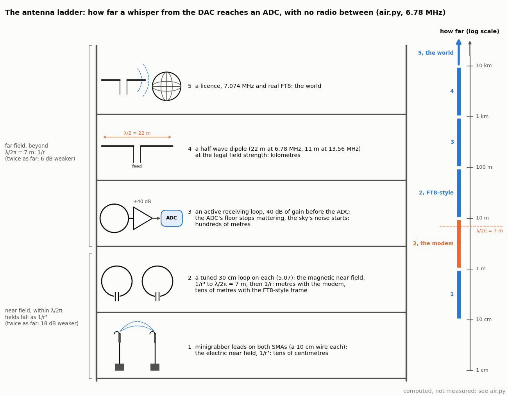

<!-- nav -->
[← 6.11 The modem in the FPGA](6_11_the_modem_in_the_fpga.md#611-the-modem-in-the-fpga) &emsp;&emsp;&emsp; **[Contents](../README.md#contents)** &emsp;&emsp;&emsp; [6.13 More ideas, and a radar chapter →](6_13_more_ideas.md#613-more-ideas-and-a-radar-chapter)

# 6.12 On the air: whispers, and how far they carry


[5.07](5_07_radio_link.md#507-a-radio-link) took the cable away and put
a loop of wire on each end: a radio, at 9600 baud, that needs tens of
millivolts at the ADC and reaches about a metre. This page asks the
question that follows: how far apart can two boards send each other a
text message with nothing but a bit of wire, and what does each step up
from there buy? The answer has a modulation half and an antenna half. The
modulation half is FT8, the mode that let radio amateurs work the world
on a few watts by sending slowly, narrowly, and with a code; a simplified
version of it runs here through the cable at forty thousand times its
speed, and at its real speed through a new piece of gateware. The antenna
half is a ladder, from minigrabber leads to a half-wave dipole, with a
calculator for each rung and a strong recommendation to beat it with a
tape measure.

Where things run: `ft8.py` is laptop Python, driving `awgcap.sv` for the
fast frame and `ddc.sv` for the slow one; `ddc.sv` is gateware that does
what [1.08](1_08_lockin.md#108-a-lock-in-amplifier)'s lock-in did,
continuously, and streams the result; `air.py` is a calculator that needs
no board at all.

## What FT8 is

In 2017 Joe Taylor (a Nobel laureate for the binary pulsar, and K1JT) and
Steve Franke released FT8 in WSJT-X, and within a year it was most of the
digital traffic on the amateur bands. It is a *weak-signal* mode: it
decodes at a [signal-to-noise ratio](https://en.wikipedia.org/wiki/Signal-to-noise_ratio) of −21 dB in a 2.5 kHz voice channel,
where a human hears only noise and a 1990s modem hears nothing at all. It
does this with nothing clever, done carefully:

- **Slow and narrow.** 6.25 symbols a second, so a symbol is 160 ms and a
  tone 6.25 Hz wide. The noise in a 6.25 Hz bin is 400 times less (26 dB)
  than in the 2.5 kHz channel. That is the whole trick: −21 dB in 2.5 kHz
  is +5 dB in the bin, and +5 dB is decodable.
- **8-FSK, detected by magnitude.** Eight tones, 1/*T* apart, which makes
  them orthogonal over a symbol exactly as OFDM's subcarriers are
  ([6.07](6_07_ofdm.md#607-ofdm-the-triumph-of-physics-over-math)). The
  receiver correlates each symbol with all eight and picks the biggest. No
  carrier phase to track ([6.02](6_02_psk_and_qpsk.md#602-psk-and-qpsk-finding-the-clock-and-the-carrier)'s
  [Costas loop](https://en.wikipedia.org/wiki/Costas_loop) would never lock at this SNR); a 20 ppm crystal is tolerated,
  because a frequency offset just moves all eight tones together.
- **Costas arrays for sync.** Three 7-symbol blocks of known tones at the
  start, middle and end of the frame, in a pattern (3 1 4 0 6 5 2) whose
  autocorrelation in time *and* frequency has one peak: a two-dimensional
  search over start time and frequency offset, the same search a GPS
  receiver makes ([6.06](6_06_spread_spectrum.md#606-spread-spectrum-the-gps-way)),
  with 21 symbols voting.
- **A code.** 77 message bits and a 14-bit CRC become 174 code bits through
  an LDPC(174,91) code ([6.09](6_09_error_correcting_codes.md#609-error-correcting-codes)),
  58 symbols of three bits each; the CRC is how the receiver knows that
  the decoder's answer is right rather than merely plausible.


`ft8.py` keeps FT8's frame, tones, Gray map, CRC polynomial and free-text
alphabet, and makes two honest simplifications: [6.09](6_09_error_correcting_codes.md#609-error-correcting-codes)'s
K = 7 convolutional code with soft Viterbi decoding in place of the LDPC
code, which costs one of the thirteen characters (twelve fit), and no
Gaussian smoothing of the tone switches (they are phase-continuous, which
is most of the point). The real code's generator matrix is in WSJT-X's
source, and swapping it in is the last "Try this".

<details>
<summary>The whole file: <code>ft8.py</code></summary>

<!-- file: src/comms/ft8.py -->
```python
#!/usr/bin/env python3
"""FT8, forty thousand times faster: a weak-signal text message in 79 tones through the
cable, and the same frame at six symbols a second through 6.78 MHz for the air.

    python3 ft8.py "CQ HMC JASON"           # one board looped back: encode, play, record, decode
    python3 ft8.py --sim "HELLO WORLD"      # no board: channel.py's model
    python3 ft8.py --esn0 3                 # noise at the transmitter: energy per symbol / N0, dB
    python3 ft8.py --cfo 40                 # the transmitter 40 steps (122 kHz, half a tone) high
    python3 ft8.py --rate=-2:10             # decodes and symbol errors against Es/N0, 10 frames each
    python3 ft8.py --slow PORT --send "CQ HMC JASON"   # ddc.sv loaded: 5.96 baud at 6.78 MHz
    python3 ft8.py --slow PORT --listen --seconds 30   # ... the receiving end, same or another board
    python3 ft8.py -o ft8.npz --no-plot

FT8 (Franke, Somerville and Taylor, 2017: WSJT-X) sends 77 bits in 12.64 seconds as 79
symbols of 8-FSK, tones 6.25 Hz apart, and decodes them 21 dB under the noise in a
2.5 kHz channel.  Its frame is three 7-symbol COSTAS ARRAYS, for finding the signal in
time and frequency at once, around two blocks of 29 data symbols.  This is the same
frame with the same tones, the same Gray map, FT8's 14-bit CRC polynomial and FT8's
free-text alphabet, with two honest simplifications: 6.09's K = 7 convolutional code
(soft Viterbi) in place of FT8's LDPC(174,91), which costs one of the 13 characters
(12 fit), and no Gaussian smoothing of the tone switches (they are phase-continuous).

FAST: on awgcap.sv (6.00) the symbol is 200 DAC samples = 4 us (FT8: 160 ms), the tones
250 kHz apart (6.25 Hz) around 6.25 MHz, and the 79 symbols take 316 us of the 327.68 us
loop.  Es/N0 is the honest axis; FT8's "SNR in 2.5 kHz" is Es/N0 - 26 dB (2.5 kHz is
400 tone spacings), so FT8's -21 dB is Es/N0 = +5 dB.

SLOW: ddc.sv (6.12) plays the same 79 tones one every 2^23 clocks (167.8 ms) from a table
of 8 tuning words, 25e6/2^22 = 5.96 Hz apart at 6.78 MHz, and its down-converter streams
I/Q at 3052 S/s to the laptop; the same receiver code runs on that stream with 512
samples per symbol instead of 100.

RECEIVER (both): mix to baseband; for each of the 8 tones, correlate every symbol-long
window with that tone (a sliding DFT, by FFT); search the 21 Costas positions over
every start time and a grid of frequency offsets for the biggest sum; read the 8
magnitudes at each of the 58 data symbols; turn them into three soft bits each (the
best tone with the bit 0 against the best with the bit 1); Viterbi; CRC; text.
"""
import argparse
import os
import sys
import time

import numpy as np

HERE = os.path.dirname(os.path.abspath(__file__))
sys.path.insert(0, HERE)
import channel                                      # noqa: E402
from psk import find_port                          # noqa: E402
from ecc import CONV                               # noqa: E402

N, L = 16384, 8192                  # DAC samples per loop; ADC samples per loop
FS_DAC, FS_ADC = 50e6, 25e6
F_LOOP = FS_DAC / N                 # 3051.76 Hz: one cycle per loop
F_C = 6.25e6
AMP = 100
NSYM = 79
COSTAS = [3, 1, 4, 0, 6, 5, 2]      # FT8's 7 x 7 Costas array
COSTAS_AT = [0, 36, 72]
DATA_AT = list(range(7, 36)) + list(range(43, 72))
GRAY = [0, 1, 3, 2, 5, 6, 4, 7]     # FT8's gray map: 3 bits (MSB first) -> tone
UNGRAY = [GRAY.index(t) for t in range(8)]
ALPHA = " 0123456789ABCDEFGHIJKLMNOPQRSTUVWXYZ+-./?"      # FT8's free-text alphabet, 42
NCHAR, NTEXT = 12, 65               # 42^12 < 2^65
CRC_POLY, CRC_BITS = 0x2757, 14     # FT8's CRC-14
NINFO = NTEXT + CRC_BITS            # 79 information bits
NCODE = 174                         # 58 symbols x 3 bits
TONE_OFF = -3.5                     # tone k sits (k - 3.5) tone spacings from the carrier

# the fast frame
SPS_DAC, SPS = 200, 100             # samples per symbol at the DAC and the ADC
DF = FS_ADC / SPS                   # 250 kHz: one cycle per symbol
# the slow frame
SLOW_F0 = 6.78e6
SLOW_LOG2 = 22                      # ADC samples per symbol = 2^22: 167.77 ms
SLOW_DF = FS_ADC / 2**SLOW_LOG2     # 5.96 Hz
SLOW_DECIM = 13                     # ddc.sv sums 2^13 samples: 3051.76 I/Q per second
SLOW_SPS = 2**(SLOW_LOG2 - SLOW_DECIM)   # 512 I/Q samples per symbol


# ---- the message ------------------------------------------------------------------
def pack_text(text):
    """12 characters of FT8's alphabet -> 65 bits (a base-42 integer, MSB first)."""
    text = text.upper()[:NCHAR].ljust(NCHAR)
    v = 0
    for ch in text:
        if ch not in ALPHA:
            ch = "?"
        v = v * len(ALPHA) + ALPHA.index(ch)
    return np.array([(v >> (NTEXT - 1 - i)) & 1 for i in range(NTEXT)])


def unpack_text(bits):
    v = 0
    for b in bits[:NTEXT]:
        v = (v << 1) | int(b)
    out = []
    for _ in range(NCHAR):
        out.append(ALPHA[v % len(ALPHA)])
        v //= len(ALPHA)
    return "".join(reversed(out))


def crc(bits, poly=CRC_POLY, nbits=CRC_BITS):
    """A cyclic redundancy check: the remainder of the message (times x^14) divided by
    the polynomial, in GF(2).  14 bits catch all bursts up to 14 long and 1 in 16384 of
    anything else: the receiver's way to know that the decoder's answer is right."""
    r = 0
    for b in list(bits) + [0] * nbits:
        r = (r << 1) | int(b)
        if r & (1 << nbits):
            r ^= (1 << nbits) | poly
    return np.array([(r >> (nbits - 1 - i)) & 1 for i in range(nbits)])


def encode(text):
    """Text -> 79 tones.  The code bits go three at a time through the Gray map."""
    info = np.concatenate([pack_text(text), crc(pack_text(text))])         # 79 bits
    code = CONV.encode(info)                                              # 170 (6 tail bits)
    code = np.concatenate([code, np.zeros(NCODE - len(code), int)])       # 174
    syms = code.reshape(-1, 3) @ [4, 2, 1]
    data_tones = [GRAY[s] for s in syms]
    tones = np.zeros(NSYM, int)
    for p in COSTAS_AT:
        tones[p:p + 7] = COSTAS
    tones[DATA_AT] = data_tones
    return tones


def decode(values):
    """174 soft code bits (+ for a 0, - for a 1) -> (text, crc ok) by soft Viterbi."""
    info = CONV.viterbi(values[:2 * (NINFO + CONV.K - 1)])
    ok = bool(np.all(crc(info[:NTEXT]) == info[NTEXT:NINFO]))
    return unpack_text(info[:NTEXT]), ok


# ---- the fast frame on awgcap.sv ---------------------------------------------------
def waveform(tones, cfo_steps=0):
    """DAC codes for one loop: 79 phase-continuous tones, then silence."""
    f = F_C + cfo_steps * F_LOOP + (np.repeat(tones, SPS_DAC) + TONE_OFF) * DF
    phase = 2 * np.pi * np.cumsum(f) / FS_DAC
    s = np.zeros(N)
    s[:len(phase)] = np.cos(phase)
    return s


def transmit(tones, esn0=None, cfo_steps=0, rng=None):
    """The waveform with white noise over the ADC's band for the given Es/N0 (energy per
    symbol over the noise density), as the other scripts add it: at the transmitter."""
    s = waveform(tones, cfo_steps)
    if esn0 is not None:
        es = 0.5 * SPS_DAC / FS_DAC                     # a unit-amplitude tone, one symbol
        n0 = es / 10**(esn0 / 10)
        k = np.arange(N // 2 + 1)
        band = (k > 0) & (k * F_LOOP <= FS_ADC / 2)
        X = np.zeros(N // 2 + 1, complex)
        X[band] = np.random.default_rng(rng).standard_normal((band.sum(), 2)) @ [1, 1j]
        x = np.fft.irfft(X, N)
        s = s + x * np.sqrt(n0 * band.sum() * F_LOOP) / x.std()
    return 128 + AMP * s / np.abs(s).max()


def baseband(rec):
    """Two loops of the record, mixed down from 6.25 MHz and low-passed to +-1.5 MHz."""
    r = np.asarray(rec, float)[:L] - np.mean(rec)
    r = np.tile(r, 2)
    n = np.arange(len(r))
    z = 2 * r * np.exp(-2j * np.pi * F_C * n / FS_ADC)
    f = np.fft.fftfreq(len(r), 1 / FS_ADC)
    return np.fft.ifft(np.fft.fft(z) * (np.abs(f) <= 6 * DF))


# ---- the receiver, for either frame ------------------------------------------------
def tone_corr(z, sps, nu=0.0):
    """Correlate every symbol-long window of z with each of the 8 tones, the whole
    record at once by FFT.  C[k, t0] = sum_n z[t0 + n] exp(-2 pi j (k + off + nu) n / sps).
    nu: a frequency offset in tone spacings (cycles per symbol) to take out first."""
    n = np.arange(len(z))
    Z = np.fft.fft(z * np.exp(-2j * np.pi * nu * n / sps))
    C = np.empty((8, len(z)), complex)
    for k in range(8):
        e = np.zeros(len(z), complex)
        e[:sps] = np.exp(2j * np.pi * (k + TONE_OFF) * np.arange(sps) / sps)
        # ##############################################################################
        # ##  KEY LINE: a sliding matched filter for tone k, at every start time, in
        # ##  one FFT: this is 6.06's acquisition with a tone instead of a code.
        # ##############################################################################
        C[k] = np.fft.ifft(Z * np.conj(np.fft.fft(e)))
    return C


def sync(z, sps, nu_max=1.0, nu_step=0.125):
    """Find the frame: the start time and frequency offset where the 21 Costas symbols
    add up best.  Returns (t0, nu, C at that nu, the search surface)."""
    nus = np.arange(-nu_max, nu_max + nu_step / 2, nu_step)
    best, surface = None, []
    for nu in nus:
        C = tone_corr(z, sps, nu)
        S = np.zeros(len(z))
        for p in COSTAS_AT:
            for j, tone in enumerate(COSTAS):
                # ######################################################################
                # ##  KEY LINE: the Costas sum.  Each of the 21 known symbols votes for
                # ##  the start time that puts its tone where it should be.
                # ######################################################################
                S += np.abs(np.roll(C[tone], -(p + j) * sps))
        surface.append(S)
        if best is None or S.max() > best[0]:
            best = (S.max(), int(np.argmax(S)), nu, C)
    _, t0, nu, C = best
    return t0, nu, C, np.array(surface), nus


def magnitudes(C, t0, sps):
    """The 8 tone magnitudes at each of the 79 symbols: (79, 8)."""
    idx = (t0 + np.arange(NSYM) * sps) % C.shape[1]
    return np.abs(C[:, idx]).T


def soft_bits(M):
    """(58, 8) magnitudes -> 174 soft code bits.  For each bit: the best tone that has
    it 0, minus the best that has it 1, in units of a clean symbol's peak."""
    scale = np.median(M.max(axis=1)) + 1e-12
    bits_of_tone = np.array([[(UNGRAY[t] >> (2 - b)) & 1 for b in range(3)] for t in range(8)])
    v = np.empty((len(M), 3))
    for b in range(3):
        zero = bits_of_tone[:, b] == 0
        # ##############################################################################
        # ##  KEY LINE: a soft bit from eight magnitudes.  A near miss between two tones
        # ##  that agree on this bit leaves it confident; a miss across it leaves it ~0.
        # ##############################################################################
        v[:, b] = (M[:, zero].max(axis=1) - M[:, ~zero].max(axis=1)) / scale
    return v.ravel()


def receive(z, sps, nu_max=1.0, period=None):
    """Baseband in; dict out: text, crc ok, the tones heard, the sync, the magnitudes.
    period: the record repeats every this many samples (the fast frame: one loop), so
    the start is reported modulo it; without one, a start past the middle is reported
    as negative (the frame began before the record did)."""
    t0, nu, C, surface, nus = sync(z, sps, nu_max)
    M = magnitudes(C, t0, sps)
    if period:
        t0 %= period
    elif t0 > C.shape[1] // 2:
        t0 -= C.shape[1]
    heard = np.argmax(M, axis=1)
    text, ok = decode(soft_bits(M[DATA_AT]))
    return dict(text=text, ok=ok, t0=t0, nu=nu, M=M, heard=heard, surface=surface, nus=nus)


def report(r, tones, esn0=None, sps=SPS, df=DF):
    serr = int(np.sum(r["heard"][DATA_AT] != tones[DATA_AT]))
    cerr = int(np.sum(r["heard"][[p + j for p in COSTAS_AT for j in range(7)]]
                      != np.tile(COSTAS, 3)))
    snr = "" if esn0 is None else " at Es/N0 %.1f dB (FT8's scale: %.0f dB in 2.5 kHz)" % (esn0, esn0 - 10 * np.log10(400))
    print("sync: frame starts at sample %d, carrier off by %+.3f tone spacings (%+.1f Hz)%s"
          % (r["t0"], r["nu"], r["nu"] * df, snr))
    print("tones heard: %d of 58 data symbols wrong, %d of 21 Costas symbols wrong" % (serr, cerr))
    print("decoded: %r  CRC %s" % (r["text"], "ok" if r["ok"] else "FAILED"))
    return serr


# ---- the link ----------------------------------------------------------------------
def make_link(args):
    if args.sim:
        rng = np.random.default_rng(args.seed)
        st = {}
        def play(wave):
            st["wave"] = wave
        def record():
            return channel.channel(st["wave"], rng=rng)
        return play, record
    sys.path.insert(0, os.path.join(HERE, "..", "twoboard"))
    import awgcap
    ports = args.ports or [find_port()]
    return (lambda w: awgcap.upload(ports[0], w)), (lambda: awgcap.record(ports[-1]))


def rate_run(play, record, esn0s, frames=10, seed=1, out=None):
    """Decodes and data-symbol errors against Es/N0."""
    rng = np.random.default_rng(seed)
    rows = []
    print("%8s  %8s  %12s  %s" % ("Es/N0", "decoded", "symbols wrong", "FT8 scale"))
    for e in esn0s:
        ok, serr, nsym = 0, 0, 0
        for i in range(frames):
            text = "TEST %04d %s" % (rng.integers(10000), ALPHA[rng.integers(1, 11)])
            tones = encode(text)
            play(transmit(tones, e, rng=rng))
            r = receive(baseband(record()), SPS, period=L)
            ok += int(r["ok"] and r["text"].strip() == text.strip())
            serr += int(np.sum(r["heard"][DATA_AT] != tones[DATA_AT]))
            nsym += 58
        rows.append((e, ok / frames, serr / nsym))
        print("%6.1f dB  %3d of %2d   %5d of %4d  %+.0f dB" % (e, ok, frames, serr, nsym, e - 10 * np.log10(400)))
    rows = np.array(rows)
    if out:
        np.savez(out, esn0=rows[:, 0], decoded=rows[:, 1], ser=rows[:, 2], frames=frames)
    return rows


def ser_theory_8fsk(esn0_db):
    """Symbol error rate of non-coherent 8-FSK (Proakis), for the uncoded reference."""
    from math import comb
    g = 10**(np.asarray(esn0_db, float) / 10)
    p = np.zeros_like(g)
    for n in range(1, 8):
        p += (-1)**(n + 1) * comb(7, n) / (n + 1) * np.exp(-n * g / (n + 1))
    return p


# ---- the slow frame on ddc.sv ------------------------------------------------------
def slow_tones_hz():
    return [SLOW_F0 + (k + TONE_OFF) * SLOW_DF for k in range(8)]


def slow_send(port, text, amp=100):
    sys.path.insert(0, os.path.join(HERE, "..", "twoboard"))
    import ddc
    ser = ddc.open_port(port)
    for k, f in enumerate(slow_tones_hz()):
        ddc.set_tone(ser, k, f)
    ddc.set_amp(ser, amp)
    ddc.set_symbol(ser, 2**(SLOW_LOG2 + 1))
    tones = encode(text)
    ddc.queue(ser, [int(t) for t in tones])
    print("sending %r: 79 tones, %.2f s, %.2f Hz apart at %.4f MHz" % (text, NSYM * 2**SLOW_LOG2 / FS_ADC, SLOW_DF, SLOW_F0 / 1e6))
    return tones


def slow_listen(port, seconds=30.0, nu_max=3.0):
    sys.path.insert(0, os.path.join(HERE, "..", "twoboard"))
    import ddc
    ser = ddc.open_port(port)
    ddc.set_rx(ser, SLOW_F0)
    ddc.set_decim(ser, SLOW_DECIM)
    ddc.stream(ser, True)
    n = int(seconds * FS_ADC / 2**SLOW_DECIM)
    print("listening at %.4f MHz for %.0f s (%d I/Q samples)..." % (SLOW_F0 / 1e6, seconds, n))
    z = ddc.read_iq(ser, n, SLOW_DECIM)
    ddc.stream(ser, False)
    rms = np.sqrt(np.mean(np.abs(z)**2))
    z = np.concatenate([z, np.zeros(SLOW_SPS * NSYM, complex)])      # room for a linear search
    r = receive(z, SLOW_SPS, nu_max)
    print("signal: %.2f codes rms over the record; the frame's tones peak at %.1f codes"
          % (rms, r["M"].max() / SLOW_SPS))
    return r, z


def main():
    ap = argparse.ArgumentParser(description=__doc__, formatter_class=argparse.RawDescriptionHelpFormatter)
    ap.add_argument("text", nargs="?", default="CQ HMC JASON", help="up to 12 characters of ' 0-9 A-Z + - . / ?'")
    ap.add_argument("ports", nargs="*", help="one port: looped back; two: A plays, B records")
    ap.add_argument("--sim", action="store_true", help="use channel.py's model, not a board")
    ap.add_argument("--esn0", type=float, help="noise at the transmitter: energy per symbol / N0, dB")
    ap.add_argument("--cfo", type=int, default=0, help="transmitter's carrier offset, steps of 3051.76 Hz")
    ap.add_argument("--rate", help="decode rate against Es/N0 = LO:HI dB (1 dB steps)")
    ap.add_argument("--frames", type=int, default=10, help="--rate: frames per point")
    ap.add_argument("--slow", action="store_true", help="the real-speed frame through ddc.sv (6.12)")
    ap.add_argument("--send", help="--slow: transmit this text")
    ap.add_argument("--listen", action="store_true", help="--slow: receive for --seconds and decode")
    ap.add_argument("--seconds", type=float, default=30.0)
    ap.add_argument("--amp", type=int, default=100, help="--slow: the tone's amplitude in DAC codes")
    ap.add_argument("--seed", type=int, default=1)
    ap.add_argument("-o", "--out", help="save the results (.npz)")
    ap.add_argument("--no-plot", action="store_true")
    args = ap.parse_args()
    if args.text and args.text.startswith("/dev/"):
        args.ports.insert(0, args.text)
        args.text = "CQ HMC JASON"

    if args.slow:
        port = args.ports[0] if args.ports else find_port()
        if args.send:
            slow_send(port, args.send, args.amp)
        if args.listen:
            r, z = slow_listen(port, args.seconds)
            report(r, encode(args.send or ""), sps=SLOW_SPS, df=SLOW_DF)
            if args.out:
                np.savez(args.out, z=z, M=r["M"], heard=r["heard"], t0=r["t0"], nu=r["nu"], text=r["text"], ok=r["ok"])
        return

    play, record = make_link(args)
    if args.rate:
        lo, hi = map(float, args.rate.split(":"))
        rate_run(play, record, np.arange(lo, hi + 0.5, 1.0), args.frames, args.seed, args.out)
        return

    tones = encode(args.text)
    print("sending %r: %d information bits (65 text + 14 CRC) -> 174 code bits -> 58 data symbols + 21 Costas"
          % (args.text, NINFO))
    play(transmit(tones, args.esn0, args.cfo, rng=np.random.default_rng(args.seed)))
    rec = record()
    r = receive(baseband(rec), SPS, period=L)
    report(r, tones, args.esn0)
    if args.out:
        np.savez(args.out, rec=rec, tones=tones, M=r["M"], heard=r["heard"], t0=r["t0"], nu=r["nu"],
                 surface=r["surface"], nus=r["nus"], text=r["text"], ok=r["ok"], esn0=np.nan if args.esn0 is None else args.esn0)
    if not args.no_plot:
        import matplotlib.pyplot as plt
        fig, ax = plt.subplots(2, 1, figsize=(10, 7))
        ax[0].imshow(r["M"].T, aspect="auto", origin="lower", cmap="Blues",
                     extent=(-0.5, NSYM - 0.5, -0.5, 7.5))
        ax[0].plot(np.arange(NSYM), tones, "o", color="C1", ms=3, label="sent")
        ax[0].set_ylabel("tone"); ax[0].set_xlabel("symbol"); ax[0].legend(loc="upper right")
        ax[0].set_title("the 8 tone magnitudes at every symbol; %r, CRC %s" % (r["text"], "ok" if r["ok"] else "failed"))
        ax[1].imshow(r["surface"], aspect="auto", origin="lower", cmap="Blues",
                     extent=(0, r["surface"].shape[1], r["nus"][0], r["nus"][-1]))
        ax[1].plot(r["t0"], r["nu"], "x", color="C1", ms=10)
        ax[1].set_xlabel("start sample"); ax[1].set_ylabel("frequency offset (tone spacings)")
        ax[1].set_title("the Costas search")
        fig.tight_layout(); plt.show()


if __name__ == "__main__":
    main()
```

</details>

## The frame, forty thousand times faster

On `awgcap.sv` a symbol is 200 DAC samples, 4 µs instead of 160 ms, so the
tones are 250 kHz apart around 6.25 MHz and the 79 symbols take 316 µs of
the loop. Nothing else changes: the receiver code is the same function
that runs at real speed below, with 100 samples per symbol instead of 512.
The honest axis is *E*<sub>s</sub>/*N*<sub>0</sub>, the energy per symbol over the
noise density; FT8's "SNR in 2.5 kHz" is that minus 26 dB, so FT8's −21 dB
is *E*<sub>s</sub>/*N*<sub>0</sub> = +5 dB:

<!-- FT8_HW -->
```console
$ cd src/comms
$ python3 ft8.py "CQ HMC JASON"                    # one board looped back
sending 'CQ HMC JASON': 79 information bits (65 text + 14 CRC) -> 174 code bits -> 58 data symbols + 21 Costas
sync: frame starts at sample 6, carrier off by +0.000 tone spacings (+0.0 Hz)
tones heard: 0 of 58 data symbols wrong, 0 of 21 Costas symbols wrong
decoded: 'CQ HMC JASON'  CRC ok
$ python3 ft8.py "HELLO WORLD?" --esn0 7
sync: frame starts at sample 6, carrier off by +0.000 tone spacings (+0.0 Hz) at Es/N0 7.0 dB (FT8's scale: -19 dB in 2.5 kHz)
tones heard: 10 of 58 data symbols wrong, 3 of 21 Costas symbols wrong
decoded: 'HELLO WORLD?'  CRC ok
$ python3 ft8.py --esn0 8 --cfo 40                # the transmitter 122 kHz high: half a tone
sync: frame starts at sample 6, carrier off by +0.500 tone spacings (+125000.0 Hz) at Es/N0 8.0 dB (FT8's scale: -18 dB in 2.5 kHz)
tones heard: 5 of 58 data symbols wrong, 2 of 21 Costas symbols wrong
decoded: 'CQ HMC JASON'  CRC ok
```

Ten of 58 data symbols wrong, and the message is right: that is what a
code is for, and the figure's lower-left panel marks the wrong ones in its
own run. The
third run puts the transmitter half a tone spacing high and the Costas
search finds it (the figure's upper-right panel is that search: a ridge
in time, a ridge in frequency, one peak). The sweep in the last panel
gives the threshold: every message decodes from 8 dB up, two thirds at 6
and 7, none at 5 and below, where two fifths of the symbols are wrong.
Real FT8 decodes at 5. The 2 to 3 dB between them is the LDPC code against
the convolutional one, plus a sixteenth of a tone spacing of frequency
grid, and it is a fair price for a decoder that fits in
[6.09](6_09_error_correcting_codes.md#609-error-correcting-codes)'s twenty
lines.

<details>
<summary><b>Detail:</b> three soft bits from eight magnitudes</summary>

The Viterbi decoder wants, for each code bit, a number whose sign is the
bit and whose size is the confidence. A symbol gives eight magnitudes.
For bit *b* of the three, take the largest magnitude among the four tones
whose Gray label has that bit 0, minus the largest among the four that
have it 1. A clean symbol gives three confident bits. A near miss between
two tones that *agree* on a bit (Gray neighbours agree on two of three)
leaves that bit confident and only the disagreeing one near zero, which
is exactly the right thing to tell the decoder. This is the "max-log"
approximation to the true log-likelihood ratio, and it is what every FSK
receiver with a soft decoder does.

</details>

## The same frame at six symbols a second

For the air the frame has to be slow, and `awgcap.sv`'s 327.68 µs loop
cannot hold a 13-second frame. `ddc.sv` can. It is
[5.07](5_07_radio_link.md#507-a-radio-link)'s radio generalized: a
transmitter whose tone comes from a table of eight tuning words, played
from a queue one every 2<sup>23</sup> clocks (167.77 ms) with the phase never
jumping, and a receiver that is [1.08](1_08_lockin.md#108-a-lock-in-amplifier)'s
lock-in run continuously: multiply every ADC sample by cos and −sin of a
numerically controlled oscillator, add up 2<sup>13</sup> of them, send the two
sums to the laptop as seven bytes, start again. That is a *digital
down-converter*, and 3052 complex samples a second at 1 Mbaud is a stream
the laptop can keep up with forever. The tones are 25 MHz / 2<sup>22</sup> =
5.96 Hz apart (FT8: 6.25) at 6.78 MHz, inside the band
[5.07](5_07_radio_link.md#507-a-radio-link) chose; the symbol is 512 of
those samples; the laptop's receiver is the same code as above.

<details>
<summary>The whole file: <code>ddc.sv</code></summary>

<!-- file: src/twoboard/ddc.sv -->
```systemverilog
// ddc.sv -- the narrowband radio for an FT8-style weak-signal text link (6.11).  The
// laptop picks the tones and their timing; this board plays them, phase-continuous,
// and mixes what its ADC hears down to baseband and streams I/Q back to the laptop,
// whose Python does the decoding.
//
// Transmit: a DDS (phase accumulator + sine table, as modem.sv and radio.sv) whose
//           tuning word comes from a table of 8 that the laptop fills.  A 256-entry FIFO
//           of tone indices plays one entry per symbol period, counted in 50 MHz clocks.
//           The FT8-style symbol is 2^23 DAC clocks = 2^22 ADC samples = 167.77 ms, so
//           tones 25e6/2^22 = 5.96 Hz apart are orthogonal over a symbol (real FT8:
//           160 ms and 6.25 Hz; 79 symbols = 13.25 s).  Only the tuning word ever
//           changes, never the phase.  The carrier, 6.78 MHz, is inside the
//           6.765-6.795 MHz ISM band (5.07).
// Receive:  a digital down-converter (DDC): each ADC sample (25 MS/s) times cos and
//           -sin of an NCO at the laptop's frequency, as 1.08's lock-in, and the two
//           products summed over 2^d samples (a "boxcar") and dumped: one I/Q pair per
//           2^d samples, 3051.76 a second at d = 13, each a 7-byte frame on uart_tx:
//           0xA5, I (24-bit signed, big-endian), Q (likewise).  I = sum >>> (d - 9), so
//           a tone of A codes gives |I + jQ| = A x 2^9 x 127/2 = A x 32512 whatever d is.
//
// The laptop's protocol (1,000,000 baud, 8N1; multi-byte integers big-endian):
//   'W' idx word(4)   tone table entry idx (0..7) = f / 50e6 x 2^32 (the DAC's clock)
//   'A' amp           transmitted amplitude in DAC codes, 0..127; 0 = silent (DAC = 128)
//   'T' n(4)          symbol length in 50 MHz clocks (default 2^23 = 167.77 ms)
//   'M' count idx...  append count tone indices (0xFF = a silent symbol) to the FIFO;
//                     the first starts at once if the transmitter was idle
//   'C' idx           a continuous tone, for tuning antennas; 0xFF = off.  While it is
//                     on it replaces the FIFO's tone (the FIFO keeps its timing)
//   'R' word(4)       the receiver's NCO: f / 25e6 x 2^32 (the ADC's clock)
//   'D' d             decimation: one I/Q per 2^d ADC samples, 10..16 (default 13)
//                     ('R' and 'D' both restart the boxcar, so the next frame is clean)
//   'S' 0/1           I/Q streaming off/on (default off)
//   Unknown bytes are ignored; a command's argument bytes are taken in order.
//
// The UART carries 100,000 bytes a second, 14,285 frames: d >= 11 (12,207 frames/s)
// streams every one, d = 10 (24,414/s) can only send every other.  A frame that is
// ready while the one before is still going out is dropped whole, so the stream stays
// aligned; `dropped` counts them (visible in the simulation, not over the UART).
//
// LEDs:     led[0] = a tone is going out; led[4:1] = signal strength from the latest
//           |I| + |Q|, about 10 dB per LED: 1, 3, 10 and 30 codes of tone at the ADC.
//           ddc.py does the laptop side.
module ddc (
    input  logic       clk,         // 50 MHz
    input  logic       uart_rx,     // from the laptop
    output logic       uart_tx,     // to the laptop
    output logic [7:0] dac_d = 128,
    output logic       dac_clk,
    input  logic [7:0] adc_d,
    output logic       adc_clk,
    output logic [4:0] led
);
    // ---- the serial port, both directions (uart.sv) -----------------------------------
    logic [7:0] rx_data, tx_data = 0;
    logic       rx_valid, tx_start = 0, tx_busy;
    uart_rx #(.CLKS_PER_BIT(50)) urx (.clk(clk), .rx(uart_rx), .data(rx_data), .valid(rx_valid));
    uart_tx #(.CLKS_PER_BIT(50)) utx (.clk(clk), .data(tx_data), .start(tx_start),
                                      .busy(tx_busy), .tx(uart_tx));

    // ---- the settings, as the laptop left them ----------------------------------------
    logic [31:0] tone_word [0:7];                   // 'W'; all 6.78 MHz until told otherwise
    initial for (int i = 0; i < 8; i++) tone_word[i] = 32'h22b6_ae7d;
    logic [6:0]  amp     = 7'd100;                  // 'A'
    logic [31:0] sym_len = 32'd8_388_608;           // 'T': 2^23 clocks = 167.77 ms
    logic [3:0]  cont    = 4'd8;                    // 'C': 0..7 = that tone, 8 = off
    logic [31:0] rx_word = 32'h456d_5cfb;           // 'R': 6.78 MHz
    logic [4:0]  d       = 5'd13;                   // 'D'
    logic        stream  = 0;                       // 'S'
    logic [7:0]  fifo [0:255];                      // 'M': tone indices, 0xFF = silence
    logic [8:0]  wr_ptr = 0, rd_ptr = 0;            // 9 bits: equal = empty, 256 apart = full

    // ---- the command parser: a command byte, then its arguments in order ---------------
    logic [7:0]  cmd  = 0;                          // the command being filled in; 0 = none
    logic [7:0]  left = 0;                          // argument bytes still to come
    logic [7:0]  idx  = 0;                          // 'W': which table entry
    logic [31:0] arg  = 0;                          // the argument bytes so far, newest lowest
    logic        restart = 0;                       // 'R' or 'D' done: start a fresh boxcar
    always_ff @(posedge clk) begin
      restart <= 0;
      if (rx_valid) begin
        if (cmd == 0)
            case (rx_data)
                "W": begin cmd <= "W"; left <= 5; end
                "A": begin cmd <= "A"; left <= 1; end
                "T": begin cmd <= "T"; left <= 4; end
                "M": begin cmd <= "M"; left <= 1; end
                "C": begin cmd <= "C"; left <= 1; end
                "R": begin cmd <= "R"; left <= 4; end
                "D": begin cmd <= "D"; left <= 1; end
                "S": begin cmd <= "S"; left <= 1; end
                default: ;                          // not a command: ignored
            endcase
        else begin
            arg  <= {arg[23:0], rx_data};
            left <= left - 1;
            if (left == 1) cmd <= 0;                // that was the last argument
            case (cmd)
                "W": if (left == 5) idx <= rx_data;
                     else if (left == 1) tone_word[idx[2:0]] <= {arg[23:0], rx_data};
                "A": amp <= rx_data[7] ? 7'd127 : rx_data[6:0];
                "T": if (left == 1) sym_len <= {arg[23:0], rx_data};
                "M": begin                          // the count; then that many entries ("m")
                         cmd  <= (rx_data == 0) ? 8'd0 : "m";
                         left <= rx_data;
                     end
                "m": if (wr_ptr - rd_ptr != 9'd256) begin      // not full
                         fifo[wr_ptr[7:0]] <= rx_data;
                         wr_ptr <= wr_ptr + 1;
                     end
                "C": cont <= (rx_data < 8) ? rx_data[3:0] : 4'd8;
                "R": if (left == 1) begin rx_word <= {arg[23:0], rx_data}; restart <= 1; end
                "D": if (rx_data >= 10 && rx_data <= 16) begin d <= rx_data[4:0]; restart <= 1; end
                "S": stream <= rx_data[0];
                default: ;
            endcase
        end
      end
    end

    // ---- transmitter: the symbol timer, the FIFO, and the DDS ---------------------------
    logic signed [8:0] sin_table [0:255];           // 128 x sin: amp x sin / 128 is amp codes
    initial for (int i = 0; i < 256; i++)
        sin_table[i] = $rtoi($floor(128.0 * $sin(6.283185307179586 * i / 256) + 0.5));

    logic [31:0] sym_timer = 0;                     // clocks left in this symbol
    logic [31:0] seq_word  = 0;                     // the FIFO's tuning word; 0 = silence
    logic        seq_on    = 0;
    logic [7:0]  entry;                             // the FIFO's next entry
    assign entry = fifo[rd_ptr[7:0]];
    logic [31:0] tx_word = 0, tx_phase = 0;
    logic        tx_on   = 0;
    always_ff @(posedge clk) begin
        if (sym_timer != 0)
            sym_timer <= sym_timer - 1;
        else if (wr_ptr != rd_ptr) begin
            // ######################################################################
            // ##  KEY LINE: the symbol timer.  Exactly sym_len clocks after the last
            // ##  symbol began (or at once, if the FIFO was empty), take the next
            // ##  entry: its tuning word, or silence.
            // ######################################################################
            seq_word  <= (entry == 8'hff) ? 32'd0 : tone_word[entry[2:0]];
            seq_on    <= (entry != 8'hff);
            rd_ptr    <= rd_ptr + 1;
            sym_timer <= sym_len - 1;
        end else begin                              // the FIFO is empty: silence
            seq_word <= 0;
            seq_on   <= 0;
        end
        tx_word <= (cont != 8) ? tone_word[cont[2:0]] : seq_word;    // 'C' wins
        tx_on   <= (cont != 8) || seq_on;
        // ##########################################################################
        // ##  KEY LINE: phase-continuous.  The phase only ever adds the current
        // ##  tuning word; a new tone is a new step size, never a new phase.
        // ##########################################################################
        tx_phase <= tx_phase + tx_word;
    end

    // sine table, times the amplitude, to the DAC (three clocks of pipeline)
    logic signed [8:0]  sv   = 0;
    logic signed [16:0] prod = 0, rounded;
    logic               on1  = 0, on2 = 0;
    assign rounded = (prod + 17'sd64) >>> 7;        // -127..127
    always_ff @(posedge clk) begin
        sv    <= sin_table[tx_phase[31:24]];         on1 <= tx_on;
        prod  <= sv * $signed({1'b0, amp});          on2 <= on1;
        dac_d <= on2 ? 8'd128 + rounded[7:0] : 8'd128;
    end
    assign dac_clk = ~clk;

    // ---- the ADC at 25 MS/s, as in capture.sv -------------------------------------------
    logic adc_clk_r = 0, new_sample = 0;
    logic signed [8:0] x = 0;
    always_ff @(posedge clk) begin
        adc_clk_r  <= ~adc_clk_r;
        new_sample <= 0;
        if (adc_clk_r == 0) begin
            x <= $signed({1'b0, adc_d}) - 9'sd128;
            new_sample <= 1;
        end
    end
    assign adc_clk = adc_clk_r;

    // ---- the DDC: an NCO, a mixer, and a boxcar that dumps every 2^d samples -----------
    // As in radio.sv: the table at the NCO's phase is "cos", a quarter turn on is "-sin".
    logic signed [7:0] ref_table [0:255];
    initial for (int i = 0; i < 256; i++)
        ref_table[i] = $rtoi($floor(127.0 * $sin(6.283185307179586 * i / 256) + 0.5));
    logic [31:0]        rx_phase = 0;
    logic signed [16:0] p_x = 0, p_y = 0;           // |p| <= 128 x 127 < 2^14
    logic               step = 0;
    always_ff @(posedge clk) begin
        step <= new_sample;
        if (new_sample) begin
            rx_phase <= rx_phase + rx_word;
            // ######################################################################
            // ##  KEY LINE: the mixer.  Each sample times the NCO's cos and -sin.
            // ######################################################################
            p_x <= x * ref_table[rx_phase[31:24]];
            p_y <= x * ref_table[rx_phase[31:24] + 8'd64];
        end
    end
    logic signed [31:0] acc_x = 0, acc_y = 0;       // |acc| < 2^(d+14) <= 2^30
    logic signed [31:0] dump_x = 0, dump_y = 0;
    logic [15:0]        n = 0, last;                // samples so far; 2^d - 1
    logic               dump = 0;
    assign last = 16'((17'd1 << d) - 1);
    always_ff @(posedge clk) begin
        dump <= 0;
        if (restart) begin                          // a new NCO or d: throw the part-sum away
            acc_x <= 0;
            acc_y <= 0;
            n     <= 0;
        end else if (step) begin
            if ((n & last) == last) begin
                // ##################################################################
                // ##  KEY LINE: the boxcar.  Sum 2^d products, hand the sum over,
                // ##  and start again from zero.
                // ##################################################################
                dump_x <= acc_x + p_x;
                dump_y <= acc_y + p_y;
                acc_x  <= 0;
                acc_y  <= 0;
                n      <= 0;
                dump   <= 1;
            end else begin
                acc_x <= acc_x + p_x;
                acc_y <= acc_y + p_y;
                n     <= n + 1;
            end
        end
    end
    // scaled to 24 bits: sum >>> (d - 9), so the result does not depend on d
    logic [2:0]         sh;
    logic signed [23:0] iq_i = 0, iq_q = 0;
    logic               iq_new = 0;
    assign sh = 3'(d - 5'd9);
    always_ff @(posedge clk) begin
        iq_new <= dump;
        if (dump) begin
            iq_i <= 24'(dump_x >>> sh);
            iq_q <= 24'(dump_y >>> sh);
        end
    end

    // ---- the frames to the laptop: 0xA5, I, Q, one byte after another --------------------
    logic [55:0] frame   = 0;                       // the bytes still to go, next one on top
    logic [2:0]  nbytes  = 0;
    logic [15:0] dropped = 0;                       // frames that found the last one still going
    always_ff @(posedge clk) begin
        tx_start <= 0;
        if (iq_new && stream && nbytes == 0) begin
            frame  <= {8'ha5, iq_i, iq_q};
            nbytes <= 7;
        end else begin
            if (iq_new && stream)
                dropped <= dropped + 1;
            if (nbytes != 0 && !tx_busy && !tx_start) begin   // the UART is free: next byte
                tx_data  <= frame[55:48];
                tx_start <= 1;
                frame    <= {frame[47:0], 8'h00};
                nbytes   <= nbytes - 1;
            end
        end
    end

    // ---- LEDs: transmitting, and a signal-strength meter ----------------------------------
    // |I| + |Q| is between 32512 and 46000 per code of tone amplitude at the ADC, so the
    // thresholds below are tones of about 1, 3, 10 and 30 codes: 10 dB per LED.
    logic [23:0] abs_i, abs_q;
    logic [24:0] mag = 0;
    assign abs_i = iq_i[23] ? 24'(-iq_i) : 24'(iq_i);
    assign abs_q = iq_q[23] ? 24'(-iq_q) : 24'(iq_q);
    always_ff @(posedge clk) if (iq_new) mag <= abs_i + abs_q;
    assign led = {mag >= 25'd1_000_000, mag >= 25'd320_000, mag >= 25'd100_000,
                  mag >= 25'd32_000, tx_on && (amp != 0)};
endmodule
```

</details>

<details>
<summary>The whole file: <code>ddc.py</code></summary>

<!-- file: src/twoboard/ddc.py -->
```python
#!/usr/bin/env python3
"""The laptop side of ddc.sv (6.11): tones out of the DAC, and I/Q frames in from the DDC.

    python3 ddc.py --tone 6.78e6              # a continuous 6.78 MHz tone (finds the port)
    python3 ddc.py /dev/ttyUSB0 --tone 6.78e6 --amp 50
    python3 ddc.py --monitor                  # NCO at 6.78 MHz: print |z|, dB and the
                                              #   frequency offset once a second (Ctrl-C stops)
    python3 ddc.py --monitor --rx 6.7800e6 --decim 13
    python3 ddc.py --queue 0,1,0,1 --symbol 8388608     # 4 symbols of 167.77 ms: tones
                                              #   6.78 MHz + idx x 5.96 Hz
    python3 ddc.py --queue 0,1,2,3 --symbol 50000000 --monitor   # 1 s symbols, watched:
                                              #   the offset should step 0, 6, 12, 18 Hz
    python3 ddc.py --off                      # silence
    python3 ddc.py --selftest                 # the frame parser against made-up bytes

    import ddc
    ser = ddc.open_port()                     # or open_port("/dev/ttyUSB0")
    ddc.set_tone(ser, 0, 6.78e6); ddc.set_tone(ser, 1, 6.78e6 + ddc.F_BIN)
    ddc.set_amp(ser, 100); ddc.set_symbol(ser, 2**23)
    ddc.queue(ser, [0, 1, 1, 0, None])        # None = a silent symbol
    ddc.set_rx(ser, 6.78e6); ddc.set_decim(ser, 13); ddc.stream(ser, True)
    z = ddc.read_iq(ser, 3052)                # one second of complex samples, in ADC codes

Every frame from the board is 7 bytes: 0xA5, then I and Q as 24-bit signed big-endian,
I = sum(x cos) >>> (d - 9) over 2^d ADC samples.  A tone of A codes at the NCO frequency
gives |I + jQ| = A x 2^d x 127/2 / 2^(d-9) = A x 32512, so read_iq divides by 32512 and
returns ADC codes.  The tone's offset from the NCO is the slope of the phase: a tone
above the NCO turns the I/Q counterclockwise (checked in ddc_tb.sv with +df=1000).
"""
import argparse
import struct
import sys
import time

import numpy as np

FS_DAC, FS_ADC = 50e6, 25e6
F_BIN = FS_ADC / 2**22          # 5.96 Hz: one FT8-style tone spacing (symbol = 2^22 ADC samples)
SYMBOL = 2**23                  # the FT8-style symbol in 50 MHz clocks: 167.77 ms
HDR = 0xA5
FRAME = 7
SCALE = 2**9 * 127 / 2          # 32512 I/Q units per ADC code of tone amplitude
SILENT = 0xFF                   # the FIFO entry for a silent symbol


# ---- the port -----------------------------------------------------------------------
def find_port():
    """The first FTDI FT231X serial port (USB ID 0403:6015): the Icepi Zero's."""
    from serial.tools import list_ports
    for p in list_ports.comports():
        if (p.vid, p.pid) == (0x0403, 0x6015):
            return p.device
    raise SystemExit("No Icepi Zero found. Is it plugged in? (Or give its port.)")


def open_port(port=None, baud=1_000_000):
    import serial                                   # pip install pyserial
    ser = serial.Serial(port or find_port(), baud, timeout=1)
    time.sleep(0.02)
    ser.reset_input_buffer()                        # the FT231X's junk byte on opening
    return ser


# ---- the commands (see the header of ddc.sv) ---------------------------------------
def dac_word(f_hz):
    return int(round(f_hz / FS_DAC * 2**32)) & 0xFFFFFFFF


def adc_word(f_hz):
    return int(round(f_hz / FS_ADC * 2**32)) & 0xFFFFFFFF


def set_tone(ser, idx, f_hz):
    """Tone table entry idx (0..7) = f_hz, as the DAC's tuning word."""
    ser.write(b"W" + bytes([idx & 7]) + struct.pack(">I", dac_word(f_hz)))


def set_amp(ser, amp):
    """The transmitted amplitude in DAC codes, 0..127 (0 = silent)."""
    ser.write(b"A" + bytes([max(0, min(127, int(amp)))]))


def set_symbol(ser, clocks):
    """The symbol length in 50 MHz clocks (2^23 = 167.77 ms)."""
    ser.write(b"T" + struct.pack(">I", int(clocks) & 0xFFFFFFFF))


def queue(ser, indices):
    """Append tone indices (0..7, or None / 0xFF for silence) to the board's 256-entry
    FIFO; it plays one per symbol, starting at once if it was idle."""
    idx = bytes([SILENT if i is None else (i & 0xFF) for i in indices])
    for k in range(0, len(idx), 255):               # 'M' takes at most 255 at a time
        chunk = idx[k:k + 255]
        ser.write(b"M" + bytes([len(chunk)]) + chunk)


def tone(ser, idx_or_none):
    """A continuous tone from table entry idx (for tuning antennas); None turns it off."""
    ser.write(b"C" + bytes([SILENT if idx_or_none is None else idx_or_none & 7]))


def set_rx(ser, f_hz):
    """The receiver's NCO frequency (restarts the boxcar)."""
    ser.write(b"R" + struct.pack(">I", adc_word(f_hz)))


def set_decim(ser, d):
    """One I/Q sample per 2^d ADC samples, d = 10..16 (restarts the boxcar).
    d = 13 is 3051.76 samples a second; d = 10 is more than the UART carries."""
    assert 10 <= d <= 16
    ser.write(b"D" + bytes([d]))


def stream(ser, on):
    ser.write(b"S" + bytes([1 if on else 0]))


def iq_rate(d=13):
    """I/Q samples per second at decimation d."""
    return FS_ADC / 2**d


# ---- the frames back ----------------------------------------------------------------
def parse_frames(buf):
    """Pull every complete frame out of `buf` (bytes).  Returns (z, rest): z the complex
    I + jQ values (raw units, not yet scaled), rest the unparsed tail to prepend to the
    next read.  Resyncs on the 0xA5 header: a header is only believed if the frame after
    it also starts with 0xA5 (or the buffer ends there), so a data byte that happens to
    be 0xA5 does not throw the alignment off."""
    buf = bytes(buf)
    out = []
    i = 0
    n = len(buf)
    while i + FRAME <= n:
        if buf[i] != HDR or (i + FRAME < n and buf[i + FRAME] != HDR):
            i += 1
            continue
        I = int.from_bytes(buf[i + 1:i + 4], "big", signed=True)
        Q = int.from_bytes(buf[i + 4:i + 7], "big", signed=True)
        out.append(complex(I, Q))
        i += FRAME
    # the tail: from the last byte that could still start a frame
    j = buf.find(bytes([HDR]), i)
    rest = buf[j:] if j >= 0 else b""
    return np.array(out, dtype=complex), rest


def read_iq(ser, n, d=13):
    """n I/Q samples from the stream (streaming must be on), scaled to ADC codes: a tone
    of A codes at the NCO frequency gives |z| = A.  (The scale does not depend on d; it
    is here for the record, and to size the read.)"""
    want = int(n)
    got = []
    total = 0
    rest = b""
    deadline = time.time() + want / iq_rate(d) + 2.0
    while total < want:
        chunk = ser.read(max(FRAME, (want - total) * FRAME + FRAME))
        if not chunk:
            if time.time() > deadline:
                raise RuntimeError("only %d of %d frames: is ddc.bit loaded and streaming on?"
                                   % (total, want))
            continue
        z, rest = parse_frames(rest + chunk)
        if len(z):
            got.append(z)
            total += len(z)
    z = np.concatenate(got)[:want]
    return z / SCALE


def summarize(z, d=13):
    """|z| in codes and dB (re 1 code), and the tone's offset from the NCO, from the
    average phase step between consecutive samples."""
    mag = np.abs(z).mean()
    db = 20 * np.log10(max(mag, 1e-9))
    step = np.angle(np.sum(z[1:] * np.conj(z[:-1])))     # radians per I/Q sample
    f_off = step / (2 * np.pi) * iq_rate(d)
    return mag, db, f_off


# ---- a test of the parser, with bytes made up here ---------------------------------
def make_frame(I, Q):
    return bytes([HDR]) + struct.pack(">i", I)[1:] + struct.pack(">i", Q)[1:]


def selftest():
    vals = [(650240, 0), (-78919, -647022), (-5921371, -0x800000),   # -5921371 is bytes A5 A5 A5
            (1, -1), (0x7FFFFF, 0)]
    frames = b"".join(make_frame(I, Q) for I, Q in vals)
    # junk before, a frame whose data contains 0xA5, and a cut-off frame at the end
    buf = b"\x12\xa5\x00" + frames + frames[:4]
    z, rest = parse_frames(buf)
    assert len(z) == len(vals), (len(z), z)
    for (I, Q), v in zip(vals, z):
        assert v == complex(I, Q), (I, Q, v)
    assert rest == frames[:4], rest
    # the tail joins the next read: the rest of the cut-off frame, then another
    z2, rest2 = parse_frames(rest + frames[4:FRAME] + make_frame(5, 6))
    assert list(z2) == [complex(*vals[0]), complex(5, 6)] and rest2 == b"", (z2, rest2)
    # the scale and the offset estimate: a 20-code tone 3 Hz above the NCO at d = 13
    t = np.arange(3052) / iq_rate(13)
    z = 20 * np.exp(2j * np.pi * 3.0 * t) * SCALE
    buf = b"".join(make_frame(int(round(v.real)), int(round(v.imag))) for v in z)
    zz, _ = parse_frames(buf)
    mag, db, f_off = summarize(zz / SCALE, 13)
    assert abs(mag - 20) < 0.01 and abs(f_off - 3.0) < 0.01, (mag, f_off)
    print("selftest: %d frames parsed, tail kept, scale %.3f codes, offset %.3f Hz: OK"
          % (len(vals), mag, f_off))


# ---- the command line -----------------------------------------------------------------
def main():
    ap = argparse.ArgumentParser(description=__doc__.split("\n")[0])
    ap.add_argument("port", nargs="?", help="serial port (default: the first Icepi Zero)")
    ap.add_argument("--tone", type=float, metavar="HZ", help="a continuous tone at HZ")
    ap.add_argument("--amp", type=int, default=100, help="DAC codes, 0..127 (default 100)")
    ap.add_argument("--queue", metavar="IDX,IDX,...", help="play these tone indices (0..7, x = silence), "
                    "one a symbol, from a table of 8 tones --carrier + idx x 5.96 Hz")
    ap.add_argument("--carrier", type=float, default=6.78e6, metavar="HZ", help="tone 0 (default 6.78e6)")
    ap.add_argument("--symbol", type=int, default=SYMBOL, help="symbol length in clocks (default 2^23)")
    ap.add_argument("--monitor", action="store_true", help="stream I/Q and print |z|, dB, offset")
    ap.add_argument("--rx", type=float, default=6.78e6, metavar="HZ", help="the NCO (default 6.78e6)")
    ap.add_argument("--decim", type=int, default=13, help="log2 decimation, 10..16 (default 13)")
    ap.add_argument("--off", action="store_true", help="silence, streaming off")
    ap.add_argument("--selftest", action="store_true")
    args = ap.parse_args()
    if args.selftest:
        selftest()
        return
    if not (args.tone or args.queue or args.monitor or args.off):
        ap.error("say what to do: --tone, --queue, --monitor or --off")

    ser = open_port(args.port)
    if args.off:
        tone(ser, None)
        set_amp(ser, 0)
        stream(ser, False)
        print("off")
    if args.tone:
        set_tone(ser, 0, args.tone)
        set_amp(ser, args.amp)
        tone(ser, 0)
        print("continuous tone at %.6f MHz, %d codes (word 0x%08x)" % (args.tone / 1e6, args.amp, dac_word(args.tone)))
    if args.queue:
        idx = [None if s.strip().lower() in ("x", "-", "ff") else int(s) for s in args.queue.split(",")]
        for k in range(8):                              # the FT8-style tones, 5.96 Hz apart
            set_tone(ser, k, args.carrier + k * F_BIN)
        set_amp(ser, args.amp)
        set_symbol(ser, args.symbol)
        queue(ser, idx)
        print("tones %.6f MHz + idx x %.4f Hz; queued %d symbols of %.3f ms: %s"
              % (args.carrier / 1e6, F_BIN, len(idx), args.symbol / 50e3, idx))
    if args.monitor:
        d = args.decim
        set_rx(ser, args.rx)
        set_decim(ser, d)
        stream(ser, True)
        ser.reset_input_buffer()
        n = int(round(iq_rate(d)))
        print("NCO %.6f MHz (word 0x%08x), d = %d: %.2f I/Q samples a second, %d a line"
              % (args.rx / 1e6, adc_word(args.rx), d, iq_rate(d), n))
        try:
            while True:
                z = read_iq(ser, n, d)
                mag, db, f_off = summarize(z, d)
                print("|z| = %8.3f codes  %6.1f dB   phase %7.1f deg   offset %+9.3f Hz"
                      % (mag, db, np.degrees(np.angle(z[-1])), f_off))
        except KeyboardInterrupt:
            pass
        stream(ser, False)
    ser.close()


if __name__ == "__main__":
    main()
```

</details>

The laptop talks to it in a byte protocol (`ddc.py` wraps it): `W` sets a
tone's tuning word, `A` the amplitude, `T` the symbol length, `M` queues
up to 255 tone indices, `C` plays one tone continuously for tuning an
antenna, `R` sets the receiver's oscillator, `D` the decimation, `S`
starts the stream. Through the cable, on one board:

```console
$ cd src/twoboard
$ make load-ddc                              # replaces awgcap.bit; make load-awgcap puts it back
$ python3 ddc.py --tone 6.78e6               # a continuous tone, 100 DAC codes
continuous tone at 6.780000 MHz, 100 codes (word 0x22b6ae7d)
$ python3 ddc.py --monitor                   # the lock-in's output, once a second; Ctrl-C to stop
NCO 6.780000 MHz (word 0x456d5cfb), d = 13: 3051.76 I/Q samples a second, 3052 a line
|z| =   78.380 codes    37.9 dB   phase   -75.6 deg   offset    -0.006 Hz
|z| =   78.378 codes    37.9 dB   phase   -77.7 deg   offset    -0.006 Hz
|z| =   78.379 codes    37.9 dB   phase   -79.7 deg   offset    -0.006 Hz
$ python3 ddc.py --monitor --rx 6779994.04   # the oscillator one tone spacing below the tone
NCO 6.779994 MHz (word 0x456d58fb), d = 13: 3051.76 I/Q samples a second, 3052 a line
|z| =   78.379 codes    37.9 dB   phase  -104.7 deg   offset    +5.955 Hz
|z| =   78.379 codes    37.9 dB   phase  -120.2 deg   offset    +5.955 Hz
$ python3 ddc.py --tone 6.78e6 --amp 1       # one DAC code
$ python3 ddc.py --monitor
|z| =    0.972 codes    -0.3 dB   phase   151.0 deg   offset    -0.007 Hz
|z| =    0.969 codes    -0.3 dB   phase   148.8 deg   offset    -0.007 Hz
```

The cable's 0.776 again (78.4 codes from 100), steady to three decimals;
the phase creeps by 2° a second because the receiver's tuning word for
6.78 MHz rounds 0.006 Hz differently from the transmitter's, which is the
resolution of a 32-bit phase accumulator at 25 MS/s; one tone spacing of
offset reads 5.955 Hz, which is 25 MHz / 2<sup>22</sup>; and a tone of one DAC
code, 0.97 of a code at the ADC, reads as cleanly as the big one, which is
what a lock-in with 2<sup>13</sup> samples per output does for you.

Then the frame itself. `--send` queues the 79 tones and `--listen` reads
the stream for 20 seconds and runs the receiver on it, so on one board
looped back the two together are a complete link:

```console
$ cd src/comms
$ python3 ft8.py --slow --send "CQ HMC JASON" --listen --seconds 20
sending 'CQ HMC JASON': 79 tones, 13.25 s, 5.96 Hz apart at 6.7800 MHz
listening at 6.7800 MHz for 20 s (61035 I/Q samples)...
signal: 63.71 codes rms over the record; the frame's tones peak at 78.4 codes
sync: frame starts at sample -108, carrier off by +0.000 tone spacings (+0.0 Hz)
tones heard: 0 of 58 data symbols wrong, 0 of 21 Costas symbols wrong
decoded: 'CQ HMC JASON'  CRC ok
$ python3 ft8.py --slow --send "HELLO WORLD?" --listen --seconds 20 --amp 4
signal: 2.51 codes rms over the record; the frame's tones peak at 3.1 codes
sync: frame starts at sample -111, carrier off by +0.000 tone spacings (+0.0 Hz)
tones heard: 0 of 58 data symbols wrong, 0 of 21 Costas symbols wrong
decoded: 'HELLO WORLD?'  CRC ok
$ python3 ft8.py --slow --send "CQ HMC JASON" --listen --seconds 20 --amp 1
signal: 0.77 codes rms over the record; the frame's tones peak at 0.9 codes
sync: frame starts at sample -114, carrier off by +0.000 tone spacings (+0.0 Hz)
tones heard: 0 of 58 data symbols wrong, 0 of 21 Costas symbols wrong
decoded: 'CQ HMC JASON'  CRC ok
```

(The frame starts a tenth of a second before the listener's first sample,
because `--send` queues it first; the receiver finds it anyway and reports
the start as negative.)

The third run is the point of the page. A tone of one DAC code, 0.9 of a
code at the ADC, smaller than the converter's step, decodes with every one
of its 79 symbols right, because 512 samples of lock-in output per symbol
and 2<sup>13</sup> ADC samples per lock-in output make a bin 5.96 Hz wide, and
in 5.96 Hz the ADC's own noise is 8 µV against a signal of 30 mV.
[5.07](5_07_radio_link.md#507-a-radio-link)'s modem managed the same
signal at 9600 baud only just; this one has 60 dB in hand if the floor
arithmetic below is right (the third "Try this" tests it), and 60 dB is
distance.

With two boards there is one more thing to find: their crystals differ by
about a part per million ([5.01](5_01_two_clocks.md#501-two-clocks)),
which at 6.78 MHz is 7 Hz, more than a tone spacing. The Costas search
runs over ±3 tone spacings in the slow mode for exactly this, and reports
what it found; two boards 20 ppm apart would need ±25, which is what real
FT8 searches. The frame also drifts in time by ten microseconds over its 13
seconds, which nothing notices against a 168 ms symbol.

## The air, rung by rung



Two laws and one floor decide everything. Within λ/2π of the transmitter
(7 m at 6.78 MHz) the fields are the *near* fields of a dipole, electric
for a wire, magnetic for a loop, and they fall as 1/*r*<sup>3</sup>: twice as
far is 18 dB weaker. Beyond that distance the radiated field takes over
and falls as 1/*r*: twice as far is 6 dB. The floor is the ADC's: eight
bits of 39 mV, with the converter's own noise, is about 0.3 of a code rms
over 12.5 MHz, which is 3.4 µV per √Hz, 8 µV in a 6 Hz bin, and a quarter of a
millivolt in [5.07](5_07_radio_link.md#507-a-radio-link)'s 6 kHz. A small passive
antenna delivers microvolts, and whether that is above or below the floor
is the whole question; the sky's own radio noise, which is what a real
receiver is limited by, is far below the ADC's floor until an amplifier
brings it up. `air.py` works the ladder out, with the exact dipole fields
so that one formula covers the bench and the far side of campus:

<details>
<summary>The whole file: <code>air.py</code></summary>

<!-- file: src/comms/air.py -->
```python
#!/usr/bin/env python3
"""The air, rung by rung: how far a whisper from the DAC carries to an ADC with no radio
in between.  COMPUTED, NOT MEASURED: scaling laws and order-of-magnitude numbers, for
the student to beat with a tape measure.

    python3 air.py                     # the ladder at 6.78 MHz, the transmitter at full power
    python3 air.py --amp 25            # turned down to 5.07's legal estimate
    python3 air.py --f 13.56e6         # the RFID band, where US Part 15 allows 500x the field
    python3 air.py --lna 40            # 40 dB of gain in front of the ADC
    python3 air.py --zin 1e3           # the ADC module's input impedance, if you've measured it
    python3 air.py --fa 40             # the site's noise: ITU-R P.372's Fa in dB above kT0

The transmitter is the DAC: 3.07 V peak into 50 ohm at AMP = 100 (5.07).  The receiver is
the ADC: 8 bits of 39 mV, its own noise about 0.1 code rms, so its floor, quantization
and all, is about 0.3 code rms = 12 mV over 12.5 MHz: 3.4 uV per root hertz, 8 uV in a
6 Hz FT8 tone bin.  That floor is what a small passive antenna fights, not the sky.

Three antennas, each as transmitter and receiver:

  wire    a 10 cm lead with a minigrabber on it: an electric dipole of effective
          length 5 cm and about 2 pF.  Near field ~ 1/r^3, far field ~ 1/r.
  loop    5.07's 30 cm one-turn loop, series-tuned to transmit (I = V / 50 ohm),
          parallel-tuned with Q = 30 to receive: a magnetic dipole.
  dipole  a half-wave dipole (22 m at 6.78 MHz, 11 m at 13.56 MHz): V_oc = E lambda / pi
          into the ADC through a 73 ohm source.  Efficient, so the sky's noise matters.

The fields are the exact dipole fields (electric or magnetic), with their 1/r^3, 1/r^2
and 1/r terms, so one formula covers the bench and the far side of campus.  The
receiver's noise is the ADC floor plus the site's radio noise (ITU-R P.372: Fa dB
above kT0, 50 dB at 7 MHz in a suburb) scaled by the antenna's efficiency, both
through an optional low-noise amplifier.  The thresholds: 5.07's modem needs about
20 mV at the ADC (one code, decoded error-free in a 6 kHz bandwidth); 6.12's FT8-style
frame needs Es/N0 of 7 dB in a 6 Hz bin.
"""
import argparse

import numpy as np

C0, MU0, EPS0, ETA0 = 299792458.0, 4e-7 * np.pi, 8.854e-12, 376.73
K_B, T0 = 1.380649e-23, 290.0
V_DAC_FULL = 3.07                   # volts peak into 50 ohm at AMP = 100
ADC_FLOOR = 3.4e-6                  # volts per root hertz at the ADC (0.3 code rms over 12.5 MHz)
BIN = 5.96                          # hertz: one FT8-style tone bin (2^22 samples at 25 MS/s)
MODEM_V = 20e-3                     # volts at the ADC for 5.07's modem
FT8_ESN0_DB = 7.0                   # Es/N0 for 6.12's frame to decode
FCC_UV_M = {6.78e6: 30.0, 13.56e6: 15848.0}      # 15.209 (1.705-30 MHz); 15.225 (13.553-13.567 MHz)


def dipole_field(moment, r, k, electric=True):
    """|E_theta| of an electric dipole p (or |H_theta| of a magnetic dipole m) at
    theta = 90 degrees: the near 1/r^3, induction 1/r^2 and radiation 1/r terms."""
    kr = k * r
    mag = np.sqrt((1 / kr - 1 / kr**3)**2 + 1 / kr**4) * k**3 / (4 * np.pi)
    return mag * moment / EPS0 if electric else mag * moment


class Wire:
    name, l_eff, cap = "10 cm wire", 0.05, 2e-12
    def tx_field(self, v, r, k, f):                 # electric field, V/m
        return dipole_field(self.cap * v * self.l_eff, r, k, True)
    def rx_volts(self, e, h, f, zin):               # from E, into zin
        v_oc = e * self.l_eff
        zs = 1 / (2 * np.pi * f * self.cap)
        return v_oc * zin / np.hypot(zin, zs)
    field = "E"
    efficiency_db = -60.0                           # radiation resistance of milliohms

class Loop:
    name, radius, turns, q = "30 cm loop", 0.15, 1, 30.0
    @property
    def area(self):
        return np.pi * self.radius**2
    def tx_field(self, v, r, k, f):                 # magnetic field, A/m
        return dipole_field((v / 50.0) * self.turns * self.area, r, k, False)
    def rx_volts(self, e, h, f, zin):
        return self.q * 2 * np.pi * f * self.turns * self.area * MU0 * h
    field = "H"
    efficiency_db = -35.0                           # 31171 (A / lambda^2)^2 ohm against ~0.1 ohm of loss

class Dipole:
    name = "half-wave dipole"
    def tx_field(self, v, r, k, f):                 # fed with the DAC's power into 73 ohm
        p = (v**2 / 2) / 73.0
        return np.sqrt(ETA0 * 1.64 * p / (4 * np.pi * r**2))     # far field only
    def rx_volts(self, e, h, f, zin):
        lam = C0 / f
        return e * lam / np.pi * zin / (zin + 73.0)
    field = "E"
    efficiency_db = 0.0


def ladder(f, amp, lna_db, zin, fa_db, rs):
    k = 2 * np.pi * f / C0
    lam = C0 / f
    v = V_DAC_FULL * amp / 100.0
    g = 10**(lna_db / 20)
    print("f = %.2f MHz (lambda = %.1f m, near field within lambda/2pi = %.1f m); AMP = %d (%.2f V peak); "
          "LNA %g dB; ADC input %g ohm; site noise Fa = %g dB" % (f / 1e6, lam, lam / (2 * np.pi), amp, v, lna_db, zin, fa_db))
    print("ADC floor: %.1f uV in a %.2f Hz bin; FT8-style threshold %.0f dB above it = %.0f uV; 5.07's modem: %.0f mV"
          % (ADC_FLOOR * np.sqrt(BIN) * 1e6, BIN, FT8_ESN0_DB, ADC_FLOOR * np.sqrt(BIN) * 10**(FT8_ESN0_DB / 20) * 1e6, MODEM_V * 1e3))
    limit = FCC_UV_M.get(f)
    pairs = [(Wire(), Wire()), (Wire(), Loop()), (Loop(), Loop()), (Loop(), Dipole()), (Dipole(), Dipole())]
    print()
    print("%-18s %-18s %10s %10s %12s %12s %14s" % ("transmit", "receive", "field@30m", "legal?", "V at 1 m", "5.07 modem", "FT8-style"))
    print("%-18s %-18s %10s %10s %12s %12s %14s" % ("", "", "(uV/m)", "", "", "range", "range"))
    for tx, rx in pairs:
        if tx.field == "H" and rx.field == "E" and not isinstance(rx, Dipole):
            continue
        def volts_at(r):
            fld = tx.tx_field(v, r, k, f)
            if tx.field == "H":
                h = fld
                e = ETA0 * h if isinstance(rx, Dipole) else None     # far field only, for a dipole
            else:
                e, h = fld, None
                if rx.field == "H":
                    h = e / ETA0                                      # far-field relation (crude nearer in)
            return rx.rx_volts(e, h, f, zin) * g
        # the noise at the ADC: its floor, plus the site's noise through the antenna and the LNA
        p_ext = K_B * T0 * BIN * 10**(fa_db / 10) * 10**(rx.efficiency_db / 10)
        v_ext = np.sqrt(p_ext * 50.0) * g
        v_noise = np.hypot(ADC_FLOOR * np.sqrt(BIN), v_ext)
        e30 = tx.tx_field(v, 30.0, k, f)
        e30 = e30 if tx.field == "E" else ETA0 * e30
        legal = "" if limit is None else ("yes" if e30 * 1e6 <= limit else "NO, %.0fx over" % (e30 * 1e6 / limit))
        def rng_for(target):
            lo, hi = 0.01, 1e6
            if volts_at(lo) < target:
                return 0.0
            for _ in range(80):
                mid = np.sqrt(lo * hi)
                if volts_at(mid) >= target:
                    lo = mid
                else:
                    hi = mid
            return lo
        r_modem = rng_for(MODEM_V)
        r_ft8 = rng_for(v_noise * 10**(FT8_ESN0_DB / 20))
        def fmt(r):
            if r >= 1e5:
                return "> 100 km"
            return "0 (never)" if r == 0 else ("%.0f cm" % (r * 100) if r < 1 else ("%.0f m" % r if r < 1000 else "%.1f km" % (r / 1000)))
        v1 = "(far field)" if isinstance(tx, Dipole) else "%.3g uV" % (volts_at(1.0) * 1e6)
        print("%-18s %-18s %10.3g %10s %12s %12s %14s" % (tx.name, rx.name, e30 * 1e6, legal, v1, fmt(r_modem), fmt(r_ft8)))
    print()
    print("Read down the last two columns: each rung is an antenna you can make in an afternoon, and the")
    print("FT8-style frame hears what the modem can't, because a 6 Hz bin lets in a thousandth of the noise")
    print("of a 6 kHz one.  With an LNA (--lna) the dipole rungs stop being limited by the ADC and start")
    print("being limited by the sky, which is the best any receiver can do.")


def main():
    ap = argparse.ArgumentParser(description=__doc__, formatter_class=argparse.RawDescriptionHelpFormatter)
    ap.add_argument("--f", type=float, default=6.78e6, help="carrier, Hz (6.78e6 or 13.56e6)")
    ap.add_argument("--amp", type=int, default=100, help="the DAC's amplitude, codes (5.07's AMP)")
    ap.add_argument("--lna", type=float, default=0.0, help="gain before the ADC, dB")
    ap.add_argument("--zin", type=float, default=50.0, help="the ADC module's input impedance, ohm")
    ap.add_argument("--fa", type=float, default=50.0, help="site noise, dB above kT0 (ITU-R P.372: 35 quiet rural .. 62 business)")
    args = ap.parse_args()
    ladder(args.f, args.amp, args.lna, args.zin, args.fa, None)


if __name__ == "__main__":
    main()
```

</details>

```console
$ python3 air.py --amp 25              # no board; 5.07's legal estimate for the loop
f = 6.78 MHz (lambda = 44.2 m, near field within lambda/2pi = 7.0 m); AMP = 25 (0.77 V peak); LNA 0 dB; ADC input 50 ohm; site noise Fa = 50 dB
ADC floor: 8.3 uV in a 5.96 Hz bin; FT8-style threshold 7 dB above it = 19 uV; 5.07's modem: 20 mV

transmit           receive             field@30m     legal?     V at 1 m   5.07 modem      FT8-style
                                          (uV/m)                                range          range
10 cm wire         10 cm wire              0.452        yes     0.145 uV         2 cm          20 cm
10 cm wire         30 cm loop              0.452        yes       206 uV        22 cm            2 m
30 cm loop         30 cm loop               21.3        yes   9.7e+03 uV        79 cm            9 m
30 cm loop         half-wave dipole         21.3        yes  1.84e+05 uV          2 m          202 m
half-wave dipole   half-wave dipole     1.48e+04 NO, 495x over  (far field)      127 m       > 100 km
```

| rung | what | the law | with the modem | with the FT8-style frame |
| --- | --- | --- | --- | --- |
| 1 | an SMA-to-BNC adapter and a BNC minigrabber lead on each board: 10 cm of wire | electric near field, 1/*r*<sup>3</sup> | centimetres | tens of centimetres |
| 2 | [5.07](5_07_radio_link.md#507-a-radio-link)'s tuned 30 cm loops | magnetic near field, 1/*r*<sup>3</sup> to 7 m | about a metre | metres to tens of metres |
| 3 | the loop transmitting, a receiving loop with 40 dB of gain in front of the ADC | 1/*r* beyond 7 m; the sky's noise starts to matter | metres | a kilometre, in free space |
| 4 | a half-wave dipole receiving (22 m of wire, 11 m at 13.56 MHz) | 1/*r* | tens of metres | kilometres, in free space |
| 5 | a licence, 7.074 MHz, a few watts and real FT8 | the ionosphere | | the world |

Read the computed column with the right suspicion. The [near-field](https://en.wikipedia.org/wiki/Near_and_far_field) rungs
depend on the ADC module's input impedance, which this tutorial has not
measured (`--zin` takes yours); the far-field rungs assume free space,
and a 7 MHz ground wave over a campus of buildings loses more than that;
the site noise is a textbook median. What the calculator is good for is
the *ratios*: each rung is 10 to 20 dB, the FT8-style frame is worth 60 dB
over the modem on every rung (ten times the distance in the near field, a
thousand in the far: 30 dB from the bandwidth and 30 dB because the modem
needs a whole code where the frame needs 7 dB over the noise), and an
amplifier in front of the ADC is worth more than any antenna until the
sky's noise is what you hear. Then
go and measure, which is the experiment: the first number a student
should get is the distance at which rung 1 stops decoding, and whether
it scales as 1/*r*<sup>3</sup>.

<details>
<summary><b>Detail:</b> why the ADC needs an amplifier before it needs an antenna</summary>

A 30 cm loop is a terrible antenna: its radiation resistance is forty
microohms against a tenth of an ohm of wire loss, so it radiates (and
receives) a few ten-thousandths of what a dipole would, −35 dB. That does not
matter for the field-strength rule, which limits the field and not the
power, and it does not matter for receiving *if* the receiver's own noise
is below the sky's. The sky at 7 MHz, in a suburb, is about 50 dB above
thermal (ITU-R P.372), which in a 6 Hz bin is −116 dBm, and through a
−35 dB loop −151 dBm: 0.006 µV. The ADC's floor is 8 µV. So the loop's
signal must beat the *ADC*, not the sky, by 60 dB of margin that an
efficient antenna and a [low-noise amplifier](https://en.wikipedia.org/wiki/Low-noise_amplifier) would give for free. Rung 3 is
that amplifier: 40 dB of gain and a noise figure of a few dB, which is
what an active receiving loop (the MLA-30+ of
[5.07](5_07_radio_link.md#507-a-radio-link), or a wideband HF amplifier
module) provides. After it, the sky is the limit and the calculator's
far-field rows apply.

</details>

## The rules, and the band the calculator likes

[5.07](5_07_radio_link.md#507-a-radio-link) has the rules for 6.78 MHz:
in the US, FCC Part 15 §15.209 allows an unlicensed transmitter anywhere
from 1.705 to 30 MHz a field of 30 µV/m at 30 m, which the 30 cm loop
meets at `AMP` = 25. The ISM designation of 6.765–6.795 MHz buys nothing
in the US (Part 18's ISM bands are for industrial equipment, not
communication, and Part 15's limit is the same inside them as outside);
what it buys is a slot nobody will complain about. There is one band
below 30 MHz where Part 15 is generous: 13.553–13.567 MHz, the RFID
band, where §15.225 allows 15,848 µV/m at 30 m, five hundred times the
field, 54 dB more power. The calculator at 13.56 MHz:

```console
$ python3 air.py --f 13.56e6 --amp 25
...
30 cm loop         30 cm loop                 87        yes  1.89e+04 uV        98 cm           85 m
30 cm loop         half-wave dipole           87        yes  8.95e+04 uV          2 m          404 m
half-wave dipole   half-wave dipole     1.48e+04        yes  (far field)         64 m        68.5 km
```

Four milliwatts into a dipole is legal there, and 68 km of free space is
what the frame could cross with that; the ground will take its share, but
a campus is not in doubt. The band is 14 kHz wide and the frame 50 Hz,
the required frequency tolerance (±0.01%, 1.4 kHz) is met by any crystal,
and both converters reach it: the DAC makes 13.56 MHz directly (its [sinc](https://en.wikipedia.org/wiki/Sinc_function)
roll-off is 0.88 there), and the ADC at 25 MS/s sees it folded to
11.44 MHz, spectrum inverted, so `ddc.sv`'s oscillator goes to 11.44 MHz
and the receiver swaps *I* and *Q*. The one unknown is the ADC *module*'s
input amplifier above 12.5 MHz, which [1.08](1_08_lockin.md#108-a-lock-in-amplifier)'s
sweep can measure with the DAC as the source. In Europe the same band is
for inductive short-range devices under ERC Recommendation 70-03, Annex 9,
with its own field limit at 10 m; elsewhere, look it up.

And the other route, which is the one radio amateurs take: a licence. In
the US a Technician licence allows data modes on 28.0–28.3 MHz at up to
200 W, and 28.074 MHz is where FT8 lives on the 10 m band, within reach of
the DAC's second image and the ADC's alias with a band-pass filter at
both; a General licence adds 7.074 MHz, the busiest FT8 frequency on
Earth, which both converters reach directly, with a dipole on a roof and
a few watts from a kit amplifier. With the real LDPC code in `ft8.py` and
a real frame clock, WSJT-X on any laptop decodes you, and
[PSKReporter](https://pskreporter.info) shows who heard you, which is a
better range measurement than a tape measure.

> [!WARNING]
> The near-field rungs radiate almost nothing and are legal anywhere. The
> far-field ones are where the rules bite: keep the transmitter turned
> down to the field strength your country allows, measure the field if
> you can (an RTL-SDR with a calibrated antenna is the cheap way), and
> remember that a dipole fed with the DAC's full 65 mW is two thousand
> times over the field limit at 6.78 MHz, and still five hundred times
> over when turned down to 4 mW.

## Parts

| part | for | about |
| --- | --- | --- |
| two SMA-male to BNC-female adapters, two BNC minigrabber test leads | rung 1 | $5 and $10 each; the clips hold any wire |
| two 30 cm loops of stiff wire, two 470 pF C0G capacitors, two 5–60 pF trimmers | rung 2, [5.07](5_07_radio_link.md#507-a-radio-link)'s build | a few dollars |
| an active receiving loop (MLA-30+ or similar, 0.5–30 MHz, USB-powered, SMA) | rung 3 | about $40 |
| a wideband HF amplifier module, 20–40 dB, 1–30 MHz (sold as an "LNA for HF" or "SDR preamplifier") | rung 3 and 4, in front of the ADC | $15–40 |
| 22 m (or 11 m at 13.56 MHz) of wire, a centre insulator, a 1:1 balun or a few turns of coax on a toroid | rung 4 | $20 |
| an SMA 20 dB attenuator | turning the transmitter down without rebuilding | $10 |
| an RTL-SDR dongle with an HF upconverter or direct-sampling mode | watching your own signal, and WSJT-X as a reference receiver | $30–55 |

**Try this:**

- Rung 1 on one board: a minigrabber lead on DAC OUT and another on ADC
  IN, `ddc.py --tone 6.78e6 --monitor`, and move the leads apart until the
  signal falls into the noise. Plot the signal against distance on log
  axes: is the slope −3?
- `ft8.py --slow --send ... --listen` at that distance, then twice it.
- Lower `--amp` on the cable until the frame stops decoding, in steps of
  3 dB; where is the threshold in codes at the ADC, and does it match the
  8 µV floor plus 7 dB?
- Two boards, a tuned loop each ([5.07](5_07_radio_link.md#507-a-radio-link)),
  one sending and one listening: how far down the corridor? Then turn one
  loop by 90°.
- The 13.56 MHz version: `ddc.py --tone 13.56e6` on the DAC, the receiver's
  oscillator at 11.44 MHz, and a `--invert` flag in the receiver that
  conjugates the stream. First measure the ADC module's response there.
- A continuous listener: read one second at a time, keep the last 30, and
  try a decode every second, so that the two ends need not be started in
  order. Then the FT8 *protocol*: 15-second slots, a reply, a QSO.
- Real FT8: WSJT-X's LDPC(174,91) generator matrix and its 77-bit message
  packing in place of the convolutional code, 13 characters, and a
  160 ms symbol (`--symbol 8000000` and tones 6.25 Hz apart). Then an
  RTL-SDR, WSJT-X, and a decode of your own board on a laptop that has
  never heard of it.
- PySDR's [link budgets chapter](https://pysdr.org/content/link_budgets.html)
  does the far-field arithmetic in decibels, which is how everyone else
  does it; redo rung 4 that way and check `air.py`.

