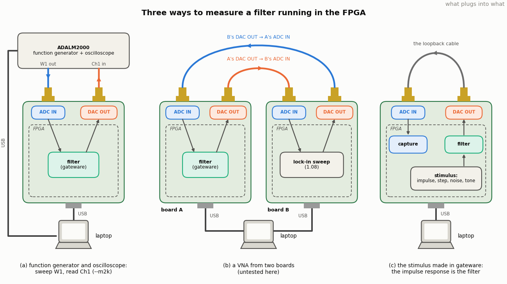

<!-- nav -->
[← 6.13 More ideas, and a radar chapter](6_13_more_ideas.md#613-more-ideas-and-a-radar-chapter) &emsp;&emsp;&emsp; **[Contents](../README.md#contents)** &emsp;&emsp;&emsp; [7.01 FIR filters: the sliding dot product →](7_01_fir_filters.md#701-fir-filters-the-sliding-dot-product)

# 7.00 Signal processing in gateware

Chapter 6 did its signal processing in Python, on records the board sent
to the laptop, except for one page ([6.11](6_11_the_modem_in_the_fpga.md#611-the-modem-in-the-fpga))
that moved a whole modem into the FPGA and found out what that costs.
This chapter is about that move. A filter, a decimator, a feedback
controller: each is a few lines of numpy on the laptop and a few dozen
lines of SystemVerilog in the FPGA, and the gateware version runs on
every sample at 25 MS/s with a latency of nanoseconds, which the laptop
version never will. *Gateware* is the word for what you load into an
FPGA, as [6.00](6_00_digital_communications.md#600-digital-communications-hardware-defined-radio)
explains: not software, not firmware, not quite hardware.

**What you need first:** the spine, Chapter 1 through
[1.08](1_08_lockin.md#108-a-lock-in-amplifier), and a way to put a known
signal into ADC IN and look at DAC OUT. There are three:

- **A function generator and an oscilloscope.** The author's are an
  ADALM2000 (an "M2k": a USB instrument with two 100 MS/s 12-bit scope
  channels and two arbitrary waveform outputs, about $200): its W1 output
  into ADC IN, DAC OUT into its channel 1. Every script in this chapter
  has an `--m2k` flag that drives the sweep and reads the scope through
  libm2k, and this is how the filter pages were measured. Any generator
  and scope will do by hand.
- **A second board.** Load [1.08](1_08_lockin.md#108-a-lock-in-amplifier)'s
  lock-in into board B, cable B's DAC OUT to A's ADC IN and A's DAC OUT to
  B's ADC IN, and B sweeps A: a vector [network analyzer](https://en.wikipedia.org/wiki/Network_analyzer_(electrical)) made of two $40
  boards. Untested here (only one board has a converter module), but it
  is the same `lockin.py --sweep` that measured the cable.
- **One board, looped back.** The filter's input can come from a
  stimulus made inside the FPGA, an impulse, a step, white noise or a
  tone, instead of the ADC; the DAC plays the output, the cable brings it
  back, and the ADC records it. The [impulse response](https://en.wikipedia.org/wiki/Impulse_response) *is* the filter,
  and its FFT is the frequency response. This is the way that needs
  nothing but the loopback cable.

| section | what | runs where |
| --- | --- | --- |
| [7.01](7_01_fir_filters.md#701-fir-filters-the-sliding-dot-product) | FIR filters: a moving average, a windowed [sinc](https://en.wikipedia.org/wiki/Sinc_function), an edge detector, in a dozen lines of gateware | gateware; the laptop measures |
| [7.02](7_02_iir_filters.md#702-iir-filters-feedback-and-an-rc-in-one-line) | IIR filters: feedback, the one-tap RC, a resonator, and why they need more bits | gateware |
| [7.03](7_03_a_filter_you_can_load.md#703-a-filter-you-can-load) | coefficients designed in scipy and loaded over the [UART](https://en.wikipedia.org/wiki/Universal_asynchronous_receiver-transmitter); the filter measured three ways | gateware + laptop Python |
| [7.04](7_04_the_filter_as_a_litex_peripheral.md#704-the-filter-as-a-litex-peripheral) | the same filter as a LiteX peripheral: coefficients from C, from MicroPython on the board, and from the laptop over the bridge | gateware + firmware + Python |
| [7.05](7_05_trading_speed_for_bits.md#705-trading-speed-for-bits) | oversampling, noise shaping and delta-sigma: 8-bit converters that act like 12-bit ones, and a 1-bit DAC that plays a clean sine | laptop Python on `awgcap.sv`, and gateware |
| [7.06](7_06_control.md#706-control-at-the-speed-of-the-cable) | a PID loop in gateware, and latency as the thing that limits every fast control loop, from drones to laser locks to qubits | gateware |
| [7.07](7_07_bigger_ideas.md#707-bigger-ideas-nmr-mri-and-qubits) | NMR, MRI and qubits: what this board can do with the pulsed NMR spectrometer you may already own, and what the cheapest real MRI looks like | priced, not built |

The code is in `src/dsp/`, built with the same `make` as Chapter 5's
(`make filter.bit`, `make load-filter`), and the figures in
`dev/tools/dsp/`. Where a page's numbers were measured with the M2k, the
figure says so; where they were computed, it says that.

> [!TIP]
> **Where things run.** `*.sv` in `src/dsp/` is gateware; `*.py` beside it
> is laptop Python talking over the UART (`$`); [7.04](7_04_the_filter_as_a_litex_peripheral.md#704-the-filter-as-a-litex-peripheral)'s loaders run as C in
> the firmware (`adda>`), as MicroPython on the board (`>>>`), and as
> Python on the laptop through LiteX's bridge. The `--m2k` flags are laptop
> Python talking to the ADALM2000 over its own USB cable.
